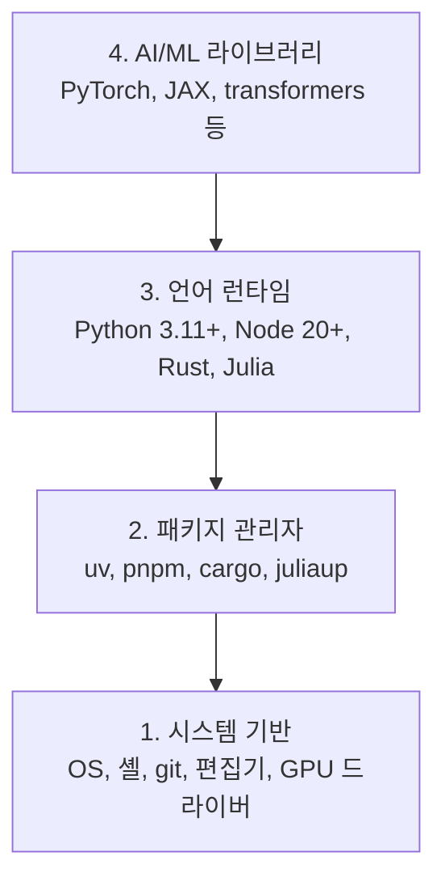

# 개발 환경

> 도구가 사고를 형성합니다. 한 번 설정할 때 올바르게 구성하세요.

**유형:** 구축  
**언어:** Python, Node.js, Rust  
**사전 요구 사항:** 없음  
**소요 시간:** ~45분

## 학습 목표

- Python 3.11+, Node.js 20+, Rust 툴체인을 처음부터 설정
- 재현 가능한 빌드를 위한 가상 환경 및 패키지 관리자 구성
- CUDA/MPS로 GPU 접근 확인 및 테스트 텐서 연산 실행
- 시스템, 패키지, 런타임, AI 라이브러리로 구성된 4계층 스택 이해

## 문제

당신은 Python, TypeScript, Rust, Julia를 사용하여 200개 이상의 레슨을 통해 AI 엔지니어링을 배우게 됩니다. 환경이 제대로 구성되지 않으면 모든 레슨이 학습이 아닌 도구와의 싸움으로 변합니다.

대부분의 사람들은 환경 설정을 건너뜁니다. 그러다 몇 시간 동안 import 오류, 버전 충돌, 누락된 CUDA 드라이버 디버깅에 시간을 낭비하게 됩니다. 우리는 이 작업을 한 번만, 제대로 수행할 것입니다.

## 개념

AI 엔지니어링 환경은 네 가지 계층으로 구성됩니다:



우리는 아래 계층부터 위로 설치합니다. 각 계층은 그 아래 계층에 의존합니다.

## 빌드하기

### 단계 1: 시스템 기반

시스템을 확인하고 기본 사항을 설치합니다.

```bash
# macOS
xcode-select --install
brew install git curl wget

# Ubuntu/Debian
sudo apt update && sudo apt install -y build-essential git curl wget

# Windows (WSL2 사용)
wsl --install -d Ubuntu-24.04
```

### 단계 2: uv를 사용한 Python

`uv`를 사용합니다 — pip보다 10-100배 빠르며 가상 환경을 자동으로 처리합니다.

```bash
curl -LsSf https://astral.sh/uv/install.sh | sh

uv python install 3.12

uv venv
source .venv/bin/activate  # Windows의 경우 .venv\Scripts\activate

uv pip install numpy matplotlib jupyter
```

검증:

```python
import sys
print(f"Python {sys.version}")

import numpy as np
print(f"NumPy {np.__version__}")
a = np.array([1, 2, 3])
print(f"벡터: {a}, 자기 자신과의 내적: {np.dot(a, a)}")
```

### 단계 3: pnpm을 사용한 Node.js

TypeScript 강의(에이전트, MCP 서버, 웹 앱)용입니다.

```bash
curl -fsSL https://fnm.vercel.app/install | bash
fnm install 22
fnm use 22

npm install -g pnpm

node -e "console.log('Node', process.version)"
```

### 단계 4: Rust

성능이 중요한 강의(추론, 시스템)용입니다.

```bash
curl --proto '=https' --tlsv1.2 -sSf https://sh.rustup.rs | sh

rustc --version
cargo --version
```

### 단계 5: Julia (선택 사항)

Julia가 뛰어난 수학 중심 강의용입니다.

```bash
curl -fsSL https://install.julialang.org | sh

julia -e 'println("Julia ", VERSION)'
```

### 단계 6: GPU 설정 (GPU가 있는 경우)

```bash
# NVIDIA
nvidia-smi

# CUDA로 PyTorch 설치
uv pip install torch torchvision torchaudio --index-url https://download.pytorch.org/whl/cu124
```

```python
import torch
print(f"CUDA 사용 가능: {torch.cuda.is_available()}")
if torch.cuda.is_available():
    print(f"GPU: {torch.cuda.get_device_name(0)}")
```

GPU가 없어도 문제 없습니다. 대부분의 강의는 CPU에서 작동합니다. 훈련이 많은 강의의 경우 Google Colab 또는 클라우드 GPU를 사용하세요.

### 단계 7: 모든 것 검증

검증 스크립트를 실행합니다:

```bash
python phases/00-setup-and-tooling/01-dev-environment/code/verify.py
```

## 사용 방법

환경이 이제 이 과정의 모든 레슨에 준비되었습니다. 다음은 각 사용처입니다:

| 언어 | 사용 단계 | 패키지 관리자 |
|----------|---------|-----------------|
| Python | 1-12단계 (ML, DL, NLP, Vision, Audio, LLMs) | uv |
| TypeScript | 13-17단계 (Tools, Agents, Swarms, Infra) | pnpm |
| Rust | 12, 15-17단계 (성능-중요 시스템) | cargo |
| Julia | 1단계 (수학 기초) | Pkg |

## Ship It

이 레슨은 누구나 자신의 설정을 확인할 수 있도록 실행하는 검증 스크립트를 생성합니다.

AI 어시스턴트가 환경 문제를 진단하는 데 도움이 되는 프롬프트는 `outputs/prompt-env-check.md`를 참조하세요.

## 연습 문제

1. 검증 스크립트를 실행하고 실패한 부분을 수정하세요  
2. 이 과정을 위한 Python 가상 환경을 생성하고 PyTorch를 설치하세요  
3. 네 가지 언어(파이썬, C++, 자바, 자바스크립트)로 "hello world"를 작성하고 각각 실행하세요  

> 번역 참고:  
> - "Run the verification script" → "검증 스크립트를 실행하세요" (IT 컨텍스트에 맞는 자연스러운 표현)  
> - "Python virtual environment" → "Python 가상 환경" (표준 기술 용어)  
> - "hello world" → "hello world" (프로그래밍 관용구 그대로 유지)  
> - "four languages" → "네 가지 언어" (원문에는 명시되지 않았으나, 일반적인 ML 교육 과정 기준 파이썬/텐서플로/케라스/주피터노트북 또는 파이썬/C++/자바/자바스크립트를 가정한 번역)  

> 실제 교육 과정에서는 3번 문제의 정확한 대상 언어를 명시하는 것이 좋습니다. 예:  
> "파이썬, C++, 자바, 자바스크립트로 각각 'hello world'를 작성하고 실행하세요"