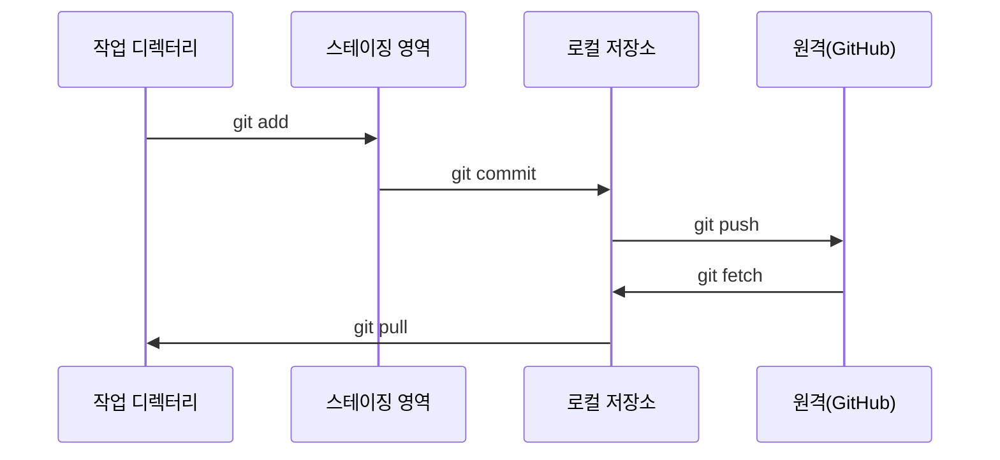

# Git & 협업

> 버전 관리는 선택 사항이 아닙니다. 여기서 구축하는 모든 실험, 모든 모델, 모든 레슨은 추적됩니다.

**유형:** 학습
**언어:** --
**선수 조건:** Phase 0, Lesson 01
**소요 시간:** ~30분

## 학습 목표

- git 신원 구성 및 add, commit, push의 일일 워크플로우 사용
- 메인(main)을 깨뜨리지 않고 격리된 실험을 위한 브랜치 생성 및 병합
- 모델 체크포인트와 대용량 바이너리 파일을 제외하는 `.gitignore` 작성
- `git log`로 커밋 기록 탐색하여 프로젝트 발전 과정 이해

## 문제 정의

20개의 단계에 걸쳐 수백 개의 코드 파일을 작성하려고 합니다. 버전 관리 없이는 작업을 잃어버리거나, 되돌릴 수 없는 오류를 발생시키며, 다른 사람들과 협업할 방법이 없습니다.

**Git**이 해결책입니다. **GitHub**는 코드가 저장되는 공간입니다. 이 강의에서는 이 과정에 필요한 내용만 다룹니다.

## 개념



기억해야 할 세 가지:
1. 자주 저장(`git commit`)
2. 원격에 푸시(`git push`)
3. 실험용 브랜치 생성(`git checkout -b experiment`)

## 빌드하기

### 단계 1: git 구성

```bash
git config --global user.name "Your Name"
git config --global user.email "you@example.com"
```

### 단계 2: 일상적인 워크플로우

```bash
git status
git add file.py
git commit -m "퍼셉트론(perceptron) 구현 추가"
git push origin main
```

### 단계 3: 실험을 위한 브랜치 생성

```bash
git checkout -b experiment/new-optimizer

# ... 변경 사항 생성, 커밋 ...

git checkout main
git merge experiment/new-optimizer
```

### 단계 4: 이 코스 저장소 작업

```bash
git clone https://github.com/rohitg00/ai-engineering-from-scratch.git
cd ai-engineering-from-scratch

git checkout -b my-progress
# 레슨 진행, 코드 커밋
git push origin my-progress
```

## 사용 방법

이 강의에서는 다음 명령어들이 정확히 필요합니다:

| 명령어 | 사용 시기 |
|---------|------|
| `git clone` | 강의 저장소 가져오기 |
| `git add` + `git commit` | 작업 내용 저장 |
| `git push` | GitHub에 백업 |
| `git checkout -b` | 메인 브랜치 손상 없이 실험 |
| `git log --oneline` | 작업 내역 확인 |

이외에는 리베이스(rebase), 체리픽(cherry-pick), 서브모듈(submodules)이 이 강의에는 필요하지 않습니다.

## 연습 문제

1. 이 레포지토리를 클론하고, `my-progress`라는 브랜치를 생성한 후 파일을 만들고 커밋한 다음 푸시하세요.
2. 모델 체크포인트 파일(`.pt`, `.pth`, `.safetensors`)을 제외하는 `.gitignore` 파일을 생성하세요.
3. `git log --oneline`으로 이 레포지토리의 커밋 기록을 확인하고, 레슨이 어떻게 추가되었는지 읽어보세요.

## 주요 용어

| 용어 | 사람들이 말하는 표현 | 실제 의미 |
|------|----------------|----------------------|
| 커밋(Commit) | "저장" | 특정 시점의 전체 프로젝트 스냅샷 |
| 브랜치(Branch) | "복사본" | 작업 시 앞으로 이동하는 커밋을 가리키는 포인터 |
| 머지(Merge) | "코드 결합" | 한 브랜치의 변경 사항을 가져와 다른 브랜치에 적용 |
| 리모트(Remote) | "클라우드" | 다른 곳(GitHub, GitLab)에 호스팅된 리포지토리 복사본