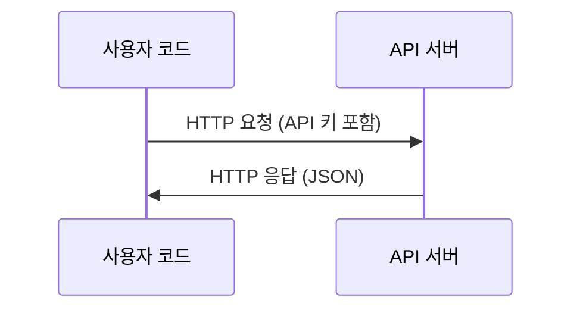

# API & 키

> 모든 AI API는 동일한 방식으로 작동합니다: 요청을 보내고 응답을 받습니다. 세부 사항은 달라지지만 패턴은 동일합니다.

**유형:** 빌드  
**언어:** Python, TypeScript  
**선수 조건:** Phase 0, Lesson 01  
**소요 시간:** ~30분

## 학습 목표

- 환경 변수(environment variables)와 `.env` 파일을 사용하여 API 키를 안전하게 저장
- Anthropic Python SDK와 raw HTTP를 모두 사용하여 LLM API 호출
- 디버깅을 위한 SDK 기반과 raw HTTP 요청/응답 형식 비교
- 인증 및 요청 제한(rate limits)을 포함한 일반적인 API 오류 식별 및 처리

## 문제 설명

11단계부터 LLM API(Anthropic, OpenAI, Google)를 호출하게 됩니다. 13-16단계에서는 이러한 API를 루프에서 사용하는 에이전트를 구축하게 됩니다. API 키 작동 방식, 안전하게 저장하는 방법, 그리고 첫 번째 API 호출을 수행하는 방법을 알아야 합니다.

## 개념



모든 API 호출에는 다음이 포함됩니다:
1. 엔드포인트(URL)
2. API 키(인증)
3. 요청 본문(원하는 내용)
4. 응답 본문(받은 내용)

## 빌드하기

### 1단계: API 키 안전하게 저장하기

API 키를 코드에 직접 넣지 마세요. 환경 변수를 사용하세요.

```bash
export ANTHROPIC_API_KEY="sk-ant-..."
export OPENAI_API_KEY="sk-..."
```

또는 `.env` 파일을 사용하세요 (`.gitignore`에 추가):

```
ANTHROPIC_API_KEY=sk-ant-...
OPENAI_API_KEY=sk-...
```

### 2단계: 첫 API 호출 (Python)

```python
import anthropic

client = anthropic.Anthropic()

response = client.messages.create(
    model="claude-sonnet-4-20250514",
    max_tokens=256,
    messages=[{"role": "user", "content": "신경망을 한 문장으로 설명해주세요."}]
)

print(response.content[0].text)
```

### 3단계: 첫 API 호출 (TypeScript)

```typescript
import Anthropic from "@anthropic-ai/sdk";

const client = new Anthropic();

const response = await client.messages.create({
  model: "claude-sonnet-4-20250514",
  max_tokens: 256,
  messages: [{ role: "user", content: "신경망을 한 문장으로 설명해주세요." }],
});

console.log(response.content[0].text);
```

### 4단계: 원시 HTTP (SDK 없음)

```python
import os
import urllib.request
import json

url = "https://api.anthropic.com/v1/messages"
headers = {
    "Content-Type": "application/json",
    "x-api-key": os.environ["ANTHROPIC_API_KEY"],
    "anthropic-version": "2023-06-01",
}
body = json.dumps({
    "model": "claude-sonnet-4-20250514",
    "max_tokens": 256,
    "messages": [{"role": "user", "content": "신경망을 한 문장으로 설명해주세요."}],
}).encode()

req = urllib.request.Request(url, data=body, headers=headers, method="POST")
with urllib.request.urlopen(req) as resp:
    result = json.loads(resp.read())
    print(result["content"][0]["text"])
```

SDK가 내부적으로 수행하는 작업입니다. 원시 HTTP 호출을 이해하면 디버깅 시 도움이 됩니다.

## 사용 방법

이 과정을 위해 다음 API를 사용합니다:

| API | 필요한 시기 | 무료 티어 |
|-----|------------|----------|
| Anthropic (Claude) | 11-16단계(에이전트, 도구) | 가입 시 $5 크레딧 제공 |
| OpenAI | 11단계(비교) | 가입 시 $5 크레딧 제공 |
| Hugging Face | 4-10단계(모델, 데이터셋) | 무료 |

지금은 모두 설정할 필요가 없습니다. 레슨에서 필요할 때 설정하세요.

## Ship It

이 레슨은 다음을 생성합니다:
- `outputs/prompt-api-troubleshooter.md` - 일반적인 API 오류 진단

## 연습 문제

1. Anthropic API 키를 발급받고 첫 번째 API 호출을 수행해 보세요
2. 원시 HTTP 버전을 사용해 보고 SDK 버전과 응답 형식을 비교해 보세요
3. 의도적으로 잘못된 API 키를 사용해 보고 오류 메시지를 확인해 보세요

## 주요 용어

| 용어 | 일반적인 표현 | 실제 의미 |
|------|----------------|----------------------|
| API 키 | "API용 비밀번호" | 계정을 식별하고 요청을 승인하는 고유 문자열 |
| 요청 제한(rate limit) | "그들이 나를 제한하고 있어" | 남용 방지 및 공정한 사용을 보장하기 위한 분당/시간당 최대 요청 수 |
| 토큰(token) | "단어 하나" (API 문맥에서) | 과금 단위: 입력 및 출력 토큰은 별도로 계산되어 청구됨 |
| 스트리밍(streaming) | "실시간 응답" | 전체 응답을 기다리지 않고 단어 단위로 응답을 받는 방식 |