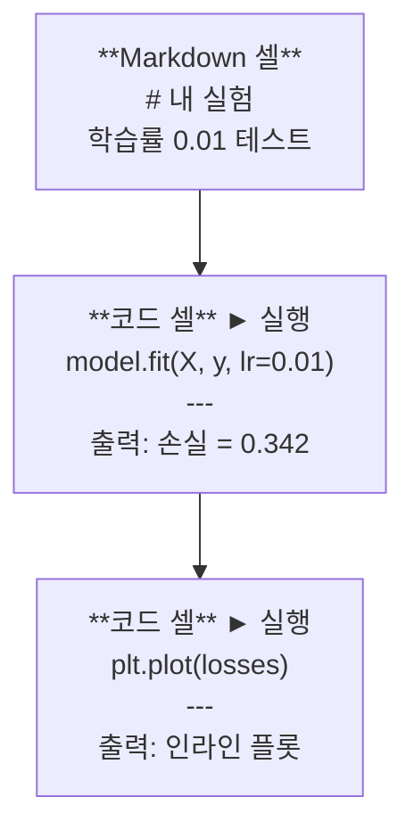
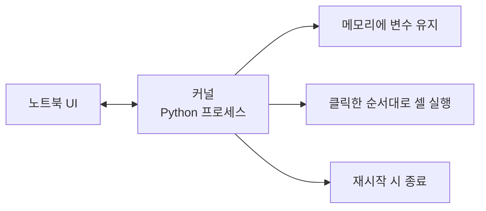

# Jupyter Notebooks

> 노트북은 AI 엔지니어링의 실험실 벤치입니다. 여기서 프로토타입을 만들고, 작동하는 것을 프로덕션으로 이동시킵니다.

**유형:** Build  
**언어:** Python  
**사전 요구 사항:** Phase 0, Lesson 01  
**소요 시간:** ~30분

## 학습 목표

- JupyterLab, Jupyter Notebook 또는 Jupyter 확장이 설치된 VS Code를 설치하고 실행
- 매직 명령어(`%timeit`, `%%time`, `%matplotlib inline`)를 사용하여 벤치마크 및 인라인 시각화 수행
- 노트북과 스크립트 사용 시기를 구분하고 "노트북에서 탐색, 스크립트로 배포" 워크플로우 적용
- 일반적인 노트북 함정 식별 및 회피: 순서 없는 실행, 숨겨진 상태, 메모리 누수

## 문제

모든 AI 논문, 튜토리얼, 캐글 경연에서는 주피터 노트북을 사용합니다. 노트북을 사용하면 코드를 조각 단위로 실행하고, 출력을 인라인으로 확인하며, 코드와 설명을 혼합하고, 빠르게 반복할 수 있습니다. 노트북 없이 AI를 배우려고 한다면, 연습장 없이 수학 숙제를 하는 것과 같습니다.

하지만 노트북에는 실제 함정이 있습니다. 사람들은 노트북을 모든 일에 사용하며, 심지어 노트북이 형편없는 일들까지 포함합니다. 노트북을 사용해야 할 때와 스크립트를 사용해야 할 때를 아는 것은 나중에 디버깅 악몽을 피하는 데 도움이 될 것입니다.

## 개념

노트북은 셀들의 목록입니다. 각 셀은 코드 또는 텍스트입니다.



커널은 백그라운드에서 실행되는 Python 프로세스입니다. 셀을 실행하면 코드가 커널로 전송되어 실행되고 결과가 반환됩니다. 모든 셀은 동일한 커널을 공유하므로 변수들이 셀 간에 유지됩니다.



"클릭한 순서대로 실행"되는 이 특성은 초능력인 동시에 위험 요소입니다.

## 구축 방법

### 1단계: 인터페이스 선택

세 가지 옵션, 하나의 형식:

| 인터페이스 | 설치 | 최적 사용처 |
|-----------|---------|----------|
| JupyterLab | `pip install jupyterlab` 후 `jupyter lab` | 전체 IDE 경험, 여러 탭, 파일 브라우저, 터미널 |
| Jupyter Notebook | `pip install notebook` 후 `jupyter notebook` | 단순, 경량, 한 번에 하나의 노트북 |
| VS Code | "Jupyter" 확장 설치 | 이미 편집기 내장, git 통합, 디버깅 |

세 가지 모두 동일한 `.ipynb` 파일을 읽고 씁니다. 원하는 것을 선택하세요. AI 작업에서는 JupyterLab이 가장 일반적입니다.

```bash
pip install jupyterlab
jupyter lab
```

### 2단계: 중요한 키보드 단축키

두 가지 모드로 작업합니다. `Escape`를 눌러 명령 모드(왼쪽 파란색 바)로 전환, `Enter`를 눌러 편집 모드(녹색 바)로 전환합니다.

**명령 모드(가장 많이 사용):**

| 키 | 동작 |
|-----|--------|
| `Shift+Enter` | 셀 실행, 다음 셀로 이동 |
| `A` | 위에 셀 삽입 |
| `B` | 아래에 셀 삽입 |
| `DD` | 셀 삭제 |
| `M` | 마크다운으로 변환 |
| `Y` | 코드로 변환 |
| `Z` | 셀 작업 실행 취소 |
| `Ctrl+Shift+H` | 모든 단축키 표시 |

**편집 모드:**

| 키 | 동작 |
|-----|--------|
| `Tab` | 자동 완성 |
| `Shift+Tab` | 함수 시그니처 표시 |
| `Ctrl+/` | 주석 토글 |

`Shift+Enter`는 하루에 수천 번 사용할 단축키입니다. 먼저 익히세요.

### 3단계: 셀 유형

**코드 셀**은 Python을 실행하고 출력을 표시합니다:

```python
import numpy as np
data = np.random.randn(1000)
data.mean(), data.std()
```

출력: `(0.0032, 0.9987)`

**마크다운 셀**은 서식이 적용된 텍스트를 렌더링합니다. 작업 내용과 이유를 문서화하는 데 사용하세요. 헤더, 굵게, 기울임꼴, LaTeX 수학(`$E = mc^2$`), 표, 이미지를 지원합니다.

### 4단계: 매직 명령어

이것은 Python이 아닙니다. `%`(라인 매직) 또는 `%%`(셀 매직)로 시작하는 Jupyter 전용 명령어입니다.

**코드 시간 측정:**

```python
%timeit np.random.randn(10000)
```

출력: `45.2 us +/- 1.3 us per loop`

```python
%%time
model.fit(X_train, y_train, epochs=10)
```

출력: `Wall time: 2.34 s`

`%timeit`은 코드를 여러 번 실행하고 평균을 냅니다. `%%time`은 한 번 실행합니다. 마이크로벤치마크에는 `%timeit`, 훈련 실행에는 `%%time`을 사용하세요.

**인라인 플롯 활성화:**

```python
%matplotlib inline
```

이제 모든 `plt.plot()` 또는 `plt.show()`는 노트북에 직접 렌더링됩니다.

**노트북을 벗어나지 않고 패키지 설치:**

```python
!pip install scikit-learn
```

`!` 접두사는 모든 셸 명령어를 실행합니다.

**환경 변수 확인:**

```python
%env CUDA_VISIBLE_DEVICES
```

### 5단계: 인라인 리치 출력 표시

노트북은 셀의 마지막 표현식을 자동으로 표시합니다. 하지만 직접 제어할 수 있습니다:

```python
import pandas as pd

df = pd.DataFrame({
    "model": ["Linear", "Random Forest", "Neural Net"],
    "accuracy": [0.72, 0.89, 0.94],
    "training_time": [0.1, 2.3, 45.6]
})
df
```

이것은 텍스트 덤프가 아닌 서식이 적용된 HTML 테이블을 렌더링합니다. 플롯도 마찬가지입니다:

```python
import matplotlib.pyplot as plt

plt.figure(figsize=(8, 4))
plt.plot([1, 2, 3, 4], [1, 4, 2, 3])
plt.title("인라인 플롯")
plt.show()
```

플롯은 셀 바로 아래에 나타납니다. 이것이 노트북이 AI 작업을 지배하는 이유입니다. 데이터, 플롯, 코드를 한 번에 볼 수 있습니다.

이미지의 경우:

```python
from IPython.display import Image, display
display(Image(filename="architecture.png"))
```

### 6단계: Google Colab

Colab은 클라우드의 무료 Jupyter 노트북입니다. GPU, 사전 설치된 라이브러리, Google Drive 통합을 제공합니다. 설정이 필요 없습니다.

1. [colab.research.google.com](https://colab.research.google.com) 접속
2. 이 과정의 `.ipynb` 파일 업로드
3. Runtime > 런타임 유형 변경 > T4 GPU(무료)

Colab과 로컬 Jupyter의 차이점:
- 세션 간 파일 유지 안 됨(Drive에 저장 또는 다운로드)
- 사전 설치: numpy, pandas, matplotlib, torch, tensorflow, sklearn
- `from google.colab import files`로 파일 업로드/다운로드
- `from google.colab import drive; drive.mount('/content/drive')`로 영구 저장소
- 90분 비활동 시 세션 종료(무료 티어)

## 사용 방법

### 노트북 vs 스크립트: 언제 무엇을 사용할까

| 노트북 사용 시기 | 스크립트 사용 시기 |
|-------------------|-----------------|
| 데이터셋 탐색 | 훈련 파이프라인 |
| 모델 프로토타이핑 | 재사용 가능한 유틸리티 |
| 결과 시각화 | `if __name__`이 포함된 모든 것 |
| 작업 설명 | 예약 실행 코드 |
| 빠른 실험 | 프로덕션 코드 |
| 강의 연습 문제 | 패키지 및 라이브러리 |

규칙: **노트북에서 탐색하고, 스크립트로 배포하라**.

AI 분야의 일반적인 워크플로우:
1. 노트북에서 데이터 탐색
2. 노트북에서 모델 프로토타이핑
3. 작동이 확인되면 코드를 `.py` 파일로 이동
4. 추가 실험을 위해 해당 `.py` 파일을 노트북에 다시 임포트

### 흔한 함정

**비순차적 실행.** 셀 5를 실행한 후 셀 2, 셀 7을 실행합니다. 노트북은 내 컴퓨터에서는 작동하지만 다른 사람이 위에서 아래로 실행하면 깨집니다. 해결: 공유 전 **Kernel > Restart & Run All** 실행.

**숨겨진 상태.** 셀을 삭제했지만 해당 셀이 생성한 변수는 메모리에 남아 있습니다. 노트북은 깨끗해 보이지만 유령 셀에 의존합니다. 해결: 정기적으로 커널 재시작.

**메모리 누수.** 4GB 데이터셋 로드, 모델 훈련, 다른 데이터셋 로드. 아무것도 해제되지 않습니다. 해결: `del variable_name`과 `gc.collect()` 사용 또는 커널 재시작.

## Ship It

이 레슨은 다음을 생성합니다:
- 노트북 문제 디버깅을 위한 `outputs/prompt-notebook-helper.md`

## 연습 문제

1. JupyterLab을 열고 노트북을 생성한 후, `%timeit`을 사용하여 100,000개의 난수로 구성된 배열 생성 시 리스트 컴프리헨션 vs NumPy 속도를 비교하세요  
   ```python
   # 리스트 컴프리헨션 예시
   %timeit [random.random() for _ in range(100000)]

   # NumPy 예시
   %timeit np.random.rand(100000)
   ```

2. CSV 파일을 로드하고 데이터프레임을 표시하며 차트를 그리는 마크다운 및 코드 셀이 포함된 노트북을 생성하세요. 이후 **Kernel > Restart & Run All**을 실행하여 처음부터 끝까지 정상 작동하는지 확인하세요  
   ```python
   # CSV 로드 및 데이터프레임 표시 예시
   import pandas as pd
   df = pd.read_csv("data.csv")
   df.head()

   # 차트 그리기 예시
   import matplotlib.pyplot as plt
   df.plot(kind="line")
   plt.show()
   ```

3. `code/notebook_tips.py` 파일의 코드를 복사하여 Colab 노트북에 붙여넣고, 무료 GPU로 실행하세요  
   ```python
   # Colab에서 GPU 활성화 후 실행 예시
   import torch
   device = torch.device("cuda" if torch.cuda.is_available() else "cpu")
   print(f"Using device: {device}")
   ```

## 주요 용어

| 용어 | 사람들이 말하는 것 | 실제 의미 |
|------|----------------|----------------------|
| 커널(Kernel) | "내 코드를 실행하는 것" | 셀을 실행하고 변수를 메모리에 유지하는 별도의 Python 프로세스 |
| 셀(Cell) | "코드 블록" | 노트북에서 독립적으로 실행 가능한 단위(코드 또는 마크다운) |
| 매직 명령어(Magic command) | "Jupyter 트릭" | `%` 또는 `%%`로 시작하는 특수 명령어로 노트북 환경을 제어 |
| `.ipynb` | "노트북 파일" | 셀, 출력, 메타데이터를 포함하는 JSON 파일. IPython Notebook의 약자 |

## 추가 자료

- [JupyterLab Docs](https://jupyterlab.readthedocs.io/) 전체 기능 세트
- [Google Colab FAQ](https://research.google.com/colaboratory/faq.html) Colab 전용 제한 사항 및 기능
- [28 Jupyter Notebook Tips](https://www.dataquest.io/blog/jupyter-notebook-tips-tricks-shortcuts/) 고급 사용자 단축키