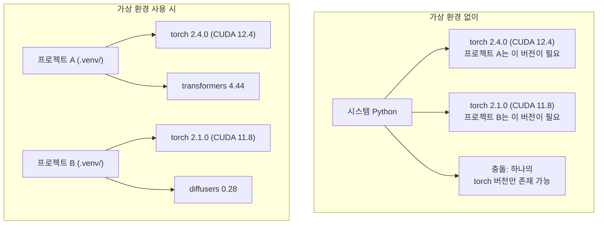

# Python 환경

> 의존성 지옥은 실제로 존재합니다. 가상 환경이 해결책입니다.

**유형:** 빌드  
**언어:** Python  
**사전 요구 사항:** Phase 0, Lesson 01  
**소요 시간:** ~30분

## 학습 목표

- `uv`, `venv` 또는 `conda`를 사용하여 격리된 가상 환경 생성
- 선택적 의존성 그룹이 포함된 `pyproject.toml` 작성 및 재현성을 위한 락 파일(lockfile) 생성
- 일반적인 문제 진단 및 해결: 글로벌 설치, pip/conda 혼용, CUDA 버전 불일치
- 충돌하는 의존성을 가진 프로젝트를 위한 단계별 환경 전략 구현

## 문제

파인튜닝(fine-tuning) 프로젝트를 위해 PyTorch 2.4를 설치합니다. 다음 주에는 다른 프로젝트에서 CUDA 빌드가 특정 버전으로 고정되어 있어 PyTorch 2.1이 필요합니다. 전역적으로 업그레이드하면 첫 번째 프로젝트가 깨집니다. 다운그레이드하면 두 번째 프로젝트가 깨집니다.

이것은 의존성 지옥(dependency hell)입니다. AI/ML 작업에서 지속적으로 발생하는 이유는 다음과 같습니다:

- PyTorch, JAX, TensorFlow는 각각 자체 CUDA 바인딩을 제공
- 모델 라이브러리는 특정 프레임워크 버전을 고정(pin)함
- 전역 `pip install`은 이전에 설치된 내용을 덮어씀
- CUDA 11.8 빌드는 CUDA 12.x 드라이버와 호환되지 않음 (그 반대도 마찬가지)

해결책: 모든 프로젝트는 자체 패키지가 있는 격리된 환경을 가져야 합니다.

## 개념



## 빌드하기

### 옵션 1: uv venv (추천)

`uv`는 가장 빠른 Python 패키지 관리자입니다(기존 pip보다 10-100배 빠름). 가상 환경, Python 버전, 의존성 해결을 하나의 도구로 처리합니다.

```bash
curl -LsSf https://astral.sh/uv/install.sh | sh

uv python install 3.12

cd your-project
uv venv
source .venv/bin/activate
```

패키지 설치:

```bash
uv pip install torch numpy
```

`pyproject.toml`이 포함된 프로젝트를 한 번에 생성:

```bash
uv init my-ai-project
cd my-ai-project
uv add torch numpy matplotlib
```

### 옵션 2: venv (내장)

`uv`를 설치할 수 없는 경우, Python에 내장된 `venv`를 사용할 수 있습니다:

```bash
python3 -m venv .venv
source .venv/bin/activate  # Linux/macOS
.venv\Scripts\activate     # Windows

pip install torch numpy
```

`uv`보다 느리지만 Python이 설치된 모든 환경에서 작동합니다.

### 옵션 3: conda (필요한 경우)

Conda는 CUDA 툴킷, cuDNN, C 라이브러리와 같은 비-Python 의존성을 관리합니다. 다음 경우에 사용하세요:

- 시스템 전체에 설치하지 않고 특정 CUDA 툴킷 버전이 필요한 경우
- 시스템 패키지 설치가 불가능한 공유 클러스터에서 작업하는 경우
- 라이브러리 설치 설명에 "conda 사용"이라고 명시된 경우

```bash
# Miniconda 설치 (전체 Anaconda가 아님)
curl -LsSf https://repo.anaconda.com/miniconda/Miniconda3-latest-Linux-x86_64.sh -o miniconda.sh
bash miniconda.sh -b

conda create -n myproject python=3.12
conda activate myproject

conda install pytorch torchvision torchaudio pytorch-cuda=12.4 -c pytorch -c nvidia
```

한 가지 규칙: conda로 환경을 생성했다면 해당 환경의 모든 패키지는 conda로 설치하세요. conda 환경에 `pip install`을 혼용하면 디버깅이 어려운 의존성 충돌이 발생할 수 있습니다.

### 이 강의용: 단계별 전략

강의 전체를 위한 단일 환경을 만들 수도 있습니다. 하지만 하지 마세요. 각 단계마다 서로 충돌하기도 하는 다른 의존성이 필요합니다.

전략:

```
ai-engineering-from-scratch/
├── .venv/                    <-- 단계 0-3용 공유 경량 환경
├── phases/
│   ├── 04-neural-networks/
│   │   └── .venv/            <-- PyTorch 환경
│   ├── 05-cnns/
│   │   └── .venv/            <-- 동일한 PyTorch 환경 (심볼릭 링크 또는 공유)
│   ├── 08-transformers/
│   │   └── .venv/            <-- 다른 트랜스포머 버전 필요 가능
│   └── 11-llm-apis/
│       └── .venv/            <-- API SDK, torch 불필요
```

`code/env_setup.sh` 스크립트는 이 강의를 위한 기본 환경을 생성합니다.

## pyproject.toml 기본 사항

모든 Python 프로젝트는 `pyproject.toml`을 가져야 합니다. 이 파일은 `setup.py`, `setup.cfg`, `requirements.txt`를 하나의 파일로 대체합니다.

```toml
[project]
name = "ai-engineering-from-scratch"
version = "0.1.0"
requires-python = ">=3.11"
dependencies = [
    "numpy>=1.26",
    "matplotlib>=3.8",
    "jupyter>=1.0",
    "scikit-learn>=1.4",
]

[project.optional-dependencies]
torch = ["torch>=2.3", "torchvision>=0.18"]
llm = ["anthropic>=0.39", "openai>=1.50"]
```

그런 다음 설치:

```bash
uv pip install -e ".[torch]"    # 기본 + PyTorch
uv pip install -e ".[llm]"     # 기본 + LLM SDKs
uv pip install -e ".[torch,llm]" # 모든 것
```

## Lockfiles

Lockfile은 모든 종속성(전이적 종속성 포함)을 정확한 버전으로 고정합니다. 이를 통해 재현성을 보장합니다: lockfile에서 설치하는 모든 사람은 정확히 동일한 패키지를 얻게 됩니다.

```bash
# uv는 uv add 사용 시 자동으로 uv.lock을 생성
uv add numpy

# pip-tools 접근법
uv pip compile pyproject.toml -o requirements.lock
uv pip install -r requirements.lock
```

Lockfile을 git에 커밋하세요. 누군가가 저장소를 클론할 때 lockfile에서 설치하면 동일한 버전을 얻게 됩니다.

## 흔한 실수

### 1. 전역 설치

```bash
pip install torch  # BAD: 시스템 Python에 설치됨

source .venv/bin/activate
pip install torch  # GOOD: 가상 환경에 설치됨
```

패키지가 설치되는 위치를 확인하세요:

```bash
which python       # .venv/bin/python이 표시되어야 함, /usr/bin/python이 아니어야 함
which pip           # .venv/bin/pip가 표시되어야 함
```

### 2. pip과 conda 혼용

```bash
conda create -n myenv python=3.12
conda activate myenv
conda install pytorch -c pytorch
pip install some-other-package   # BAD: conda의 의존성 추적을 깨뜨릴 수 있음
conda install some-other-package # GOOD: conda로 모든 것을 관리
```

conda 내에서 pip을 반드시 사용해야 할 경우(일부 패키지는 pip 전용), conda 패키지를 먼저 설치한 후 마지막에 pip 패키지를 설치하세요.

### 3. 활성화 잊기

```bash
python train.py           # 시스템 Python 사용, 패키지 누락
source .venv/bin/activate
python train.py           # 프로젝트 Python 사용, 패키지 발견됨
```

셸 프롬프트에 환경 이름이 표시되어야 합니다:

```
(.venv) $ python train.py
```

### 4. .venv를 git에 커밋

```bash
echo ".venv/" >> .gitignore
```

가상 환경은 200MB-2GB 크기입니다. 로컬에서만 사용되며, 머신 간 이식할 수 없습니다. 대신 `pyproject.toml`과 락 파일을 커밋하세요.

### 5. CUDA 버전 불일치

```bash
nvidia-smi                # 드라이버 CUDA 버전 표시 (예: 12.4)
python -c "import torch; print(torch.version.cuda)"  # PyTorch CUDA 버전 표시

# 이 둘은 호환되어야 합니다.
# PyTorch CUDA 버전은 드라이버 CUDA 버전보다 낮거나 같아야 합니다.
```

## 사용 방법

설정 스크립트를 실행하여 코스 환경을 생성하세요:

```bash
bash phases/00-setup-and-tooling/06-python-environments/code/env_setup.sh
```

이 스크립트는 리포지토리 루트에 `.venv`를 생성하고 핵심 의존성을 설치 및 검증합니다.

## 연습 문제

1. `env_setup.sh`를 실행하고 모든 검사가 통과하는지 확인
2. 두 번째 가상 환경을 생성하고, 여기에 다른 버전의 NumPy를 설치한 후 두 환경이 격리되어 있는지 확인
3. PyTorch와 Anthropic SDK가 모두 필요한 프로젝트를 위한 `pyproject.toml` 작성
4. 의도적으로 패키지 하나를 전역 설치(venv 활성화 없이)한 후 설치 위치를 확인한 다음 제거

> **참고**:  
> - 2번 문제에서 NumPy 버전 격리 확인 방법 예시:  
>   ```bash
>   # 환경1에서
>   python -c "import numpy; print(numpy.__version__)"
>   
>   # 환경2에서
>   python -c "import numpy; print(numpy.__version__)"
>   ```  
>   출력된 버전이 서로 달라야 함  
> - 4번 문제에서 전역 설치 위치 확인 명령어:  
>   ```bash
>   python -m site --user-site  # 사용자 사이트 패키지 디렉토리
>   ```

## 주요 용어

| 용어 | 사람들이 말하는 표현 | 실제 의미 |
|------|----------------|----------------------|
| 가상 환경(Virtual environment) | "A venv" | 시스템 Python과 분리된 Python 인터프리터 및 패키지를 포함하는 격리된 디렉터리 |
| 락 파일(Lockfile) | "Pinned dependencies" | 모든 패키지와 정확한 버전을 나열한 파일로, 머신 간 동일한 설치를 보장 |
| pyproject.toml | "The new setup.py" | setup.py/setup.cfg/requirements.txt를 대체하는 표준 Python 프로젝트 구성 파일 |
| 전이적 종속성(Transitive dependency) | "A dependency of a dependency" | 패키지 B가 C에 의존; B에 의존하는 A를 설치하면 C는 A의 전이적 종속성 |
| CUDA 불일치(CUDA mismatch) | "My GPU isn't working" | PyTorch가 GPU 드라이버가 지원하는 버전과 다른 CUDA 버전으로 컴파일됨 |