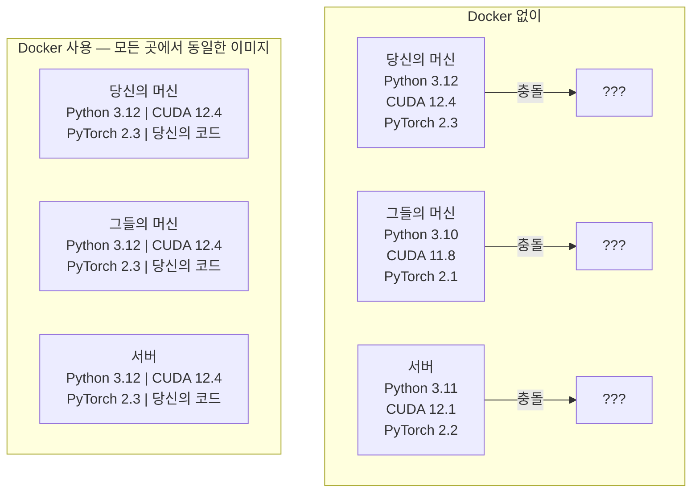

# AI/ML을 위한 Docker

> 컨테이너는 "내 컴퓨터에서는 잘 작동해"라는 말을 과거의 것으로 만듭니다.

**유형:** 빌드
**언어:** Python
**사전 요구 사항:** Phase 0, 레슨 01 및 03
**소요 시간:** ~60분

## 학습 목표

- Dockerfile로부터 CUDA, PyTorch, AI 라이브러리가 포함된 GPU 지원 Docker 이미지 빌드
- 컨테이너 재빌드 시 모델, 데이터셋, 코드를 유지하기 위해 호스트 디렉터리를 볼륨으로 마운트
- 컨테이너 내부에서 GPU를 노출하기 위한 NVIDIA Container Toolkit 구성
- Docker Compose를 사용한 다중 서비스 AI 애플리케이션(추론 서버 + 벡터 데이터베이스) 오케스트레이션

## 문제

PyTorch 2.3, CUDA 12.4, Python 3.12로 노트북에서 모델을 훈련시켰습니다. 동료는 PyTorch 2.1, CUDA 11.8, Python 3.10을 사용하고 있습니다. 동료의 머신에서 모델이 충돌합니다. Dockerfile은 두 환경에서 모두 작동합니다.

AI 프로젝트는 의존성 관리가 악몽입니다. 일반적인 스택에는 Python, PyTorch, CUDA 드라이버, cuDNN, 시스템 수준의 C 라이브러리, 그리고 정확한 컴파일러 버전이 필요한 flash-attn과 같은 특수 패키지가 포함됩니다. Docker는 이 모든 것을 단일 이미지로 패키징하여 어디서나 동일하게 실행되도록 합니다.

## 개념

Docker는 코드, 런타임, 라이브러리, 시스템 도구를 컨테이너라는 격리된 단위로 감싸줍니다. 가벼운 가상 머신이라고 생각하면 되는데, 자체 OS 커널을 실행하는 대신 호스트 OS 커널을 공유하므로 분 단위가 아닌 초 단위로 시작됩니다.



### AI 프로젝트가 Docker를 특히 더 필요로 하는 이유

1. **GPU 드라이버는 취약합니다.** CUDA 12.4 코드는 CUDA 11.8에서 실행되지 않습니다. Docker는 NVIDIA Container Toolkit을 통해 호스트 GPU 드라이버를 공유하면서 컨테이너 내부에 CUDA 툴킷을 격리합니다.

2. **모델 가중치는 크기가 큽니다.** 7B 파라미터 모델은 fp16에서 14GB입니다. 재빌드할 때마다 다시 다운로드하고 싶지 않을 것입니다. Docker 볼륨을 사용하면 호스트의 모델 디렉터리를 마운트할 수 있습니다.

3. **멀티 서비스 아키텍처가 일반적입니다.** 실제 AI 애플리케이션은 단순한 Python 스크립트가 아닙니다. 추론 서버, RAG를 위한 벡터 데이터베이스, 웹 프론트엔드가 포함될 수 있습니다. Docker Compose는 한 번의 명령으로 이 모든 것을 오케스트레이션합니다.

### 주요 용어

| 용어 | 의미 |
|------|------|
| 이미지 | 읽기 전용 템플릿. 레시피. Dockerfile로 빌드됩니다. |
| 컨테이너 | 이미지의 실행 인스턴스. 주방. |
| Dockerfile | 이미지를 빌드하는 지침. 계층별로 구성됩니다. |
| 볼륨 | 컨테이너 재시작 후에도 유지되는 영구 저장소. |
| docker-compose | YAML로 멀티 컨테이너 애플리케이션을 정의하는 도구. |

### AI 분야의 일반적인 컨테이너 패턴

```
개발 컨테이너
  전체 툴킷. 편집기 지원. Jupyter. 디버깅 도구.
  개발 및 실험 중에 사용됩니다.

훈련 컨테이너
  최소한의 구성. 훈련 스크립트와 의존성만 포함.
  GPU 클러스터에서 실행. 편집기, Jupyter 없음.

추론 컨테이너
  서빙에 최적화. 작은 이미지. 빠른 콜드 스타트.
  프로덕션 환경에서 로드 밸런서 뒤에서 실행.
```

## 빌드하기

### 1단계: Docker 설치

```bash
# macOS
brew install --cask docker
open /Applications/Docker.app

# Ubuntu
curl -fsSL https://get.docker.com | sh
sudo usermod -aG docker $USER
# 그룹 변경 적용 위해 로그아웃 후 재로그인
```

검증:

```bash
docker --version
docker run hello-world
```

### 2단계: NVIDIA Container Toolkit 설치 (NVIDIA GPU가 있는 Linux)

이를 통해 Docker 컨테이너가 GPU에 접근할 수 있습니다. macOS 및 Windows(WSL2) 사용자는 이 단계를 건너뛸 수 있습니다. Docker Desktop이 해당 플랫폼에서 GPU 패스를 다르게 처리합니다.

```bash
distribution=$(. /etc/os-release;echo $ID$VERSION_ID)
curl -fsSL https://nvidia.github.io/libnvidia-container/gpgkey | sudo gpg --dearmor -o /usr/share/keyrings/nvidia-container-toolkit-keyring.gpg
curl -s -L https://nvidia.github.io/libnvidia-container/$distribution/libnvidia-container.list | \
    sed 's#deb https://#deb [signed-by=/usr/share/keyrings/nvidia-container-toolkit-keyring.gpg] https://#g' | \
    sudo tee /etc/apt/sources.list.d/nvidia-container-toolkit.list

sudo apt-get update
sudo apt-get install -y nvidia-container-toolkit
sudo nvidia-ctk runtime configure --runtime=docker
sudo systemctl restart docker
```

컨테이너 내 GPU 접근 테스트:

```bash
docker run --rm --gpus all nvidia/cuda:12.4.1-base-ubuntu22.04 nvidia-smi
```

GPU 정보가 표시되면 툴킷이 작동하는 것입니다.

### 3단계: 베이스 이미지 이해

적절한 베이스 이미지 선택은 디버깅 시간을 절약합니다.

```
nvidia/cuda:12.4.1-devel-ubuntu22.04
  전체 CUDA 툴킷. 컴파일러 포함.
  사용처: nvcc가 필요한 패키지 빌드(flash-attn, bitsandbytes)
  크기: ~4 GB

nvidia/cuda:12.4.1-runtime-ubuntu22.04
  CUDA 런타임만. 컴파일러 없음.
  사용처: 사전 빌드된 코드 실행
  크기: ~1.5 GB

pytorch/pytorch:2.3.1-cuda12.4-cudnn9-runtime
  CUDA 위에 PyTorch 사전 설치.
  사용처: PyTorch 설치 단계 건너뛰기
  크기: ~6 GB

python:3.12-slim
  CUDA 없음. CPU 전용.
  사용처: CPU에서 추론, 경량 도구
  크기: ~150 MB
```

### 4단계: AI 개발을 위한 Dockerfile 작성

`code/Dockerfile`에 있는 Dockerfile을 살펴보겠습니다:

```dockerfile
FROM nvidia/cuda:12.4.1-devel-ubuntu22.04

ENV DEBIAN_FRONTEND=noninteractive
ENV PYTHONUNBUFFERED=1

RUN apt-get update && apt-get install -y --no-install-recommends \
    python3.12 \
    python3.12-venv \
    python3.12-dev \
    python3-pip \
    git \
    curl \
    build-essential \
    && rm -rf /var/lib/apt/lists/*

RUN update-alternatives --install /usr/bin/python python /usr/bin/python3.12 1

RUN python -m pip install --no-cache-dir --upgrade pip setuptools wheel

RUN python -m pip install --no-cache-dir \
    torch==2.3.1 \
    torchvision==0.18.1 \
    torchaudio==2.3.1 \
    --index-url https://download.pytorch.org/whl/cu124

RUN python -m pip install --no-cache-dir \
    numpy \
    pandas \
    scikit-learn \
    matplotlib \
    jupyter \
    transformers \
    datasets \
    accelerate \
    safetensors

WORKDIR /workspace

VOLUME ["/workspace", "/models"]

EXPOSE 8888

CMD ["python"]
```

빌드:

```bash
docker build -t ai-dev -f phases/00-setup-and-tooling/07-docker-for-ai/code/Dockerfile .
```

처음 실행 시 시간이 소요됩니다(CUDA 베이스 이미지 + PyTorch 다운로드). 이후 빌드는 캐시된 레이어를 사용합니다.

실행:

```bash
docker run --rm -it --gpus all \
    -v $(pwd):/workspace \
    -v ~/models:/models \
    ai-dev python -c "import torch; print(f'PyTorch {torch.__version__}, CUDA: {torch.cuda.is_available()}')"
```

컨테이너 내 Jupyter 실행:

```bash
docker run --rm -it --gpus all \
    -v $(pwd):/workspace \
    -v ~/models:/models \
    -p 8888:8888 \
    ai-dev jupyter notebook --ip=0.0.0.0 --port=8888 --no-browser --allow-root
```

### 5단계: 데이터 및 모델을 위한 볼륨 마운트

볼륨 마운트는 AI 작업에 필수적입니다. 마운트하지 않으면 컨테이너가 중지될 때 14GB 모델 다운로드가 사라집니다.

```bash
# 코드 마운트
-v $(pwd):/workspace

# 공유 모델 디렉토리 마운트
-v ~/models:/models

# 데이터셋 마운트
-v ~/datasets:/data
```

훈련 스크립트 내에서 마운트된 경로에서 로드:

```python
from transformers import AutoModel

model = AutoModel.from_pretrained("/models/llama-7b")
```

모델은 호스트 파일 시스템에 저장됩니다. 컨테이너를 재빌드해도 다시 다운로드할 필요가 없습니다.

### 6단계: 멀티 서비스 AI 앱을 위한 Docker Compose

실제 RAG 애플리케이션에는 추론 서버와 벡터 데이터베이스가 필요합니다. Docker Compose는 한 번의 명령으로 둘 다 실행합니다.

`code/docker-compose.yml` 참조:

```yaml
services:
  ai-dev:
    build:
      context: .
      dockerfile: Dockerfile
    deploy:
      resources:
        reservations:
          devices:
            - driver: nvidia
              count: all
              capabilities: [gpu]
    volumes:
      - ../../../:/workspace
      - ~/models:/models
      - ~/datasets:/data
    ports:
      - "8888:8888"
    stdin_open: true
    tty: true
    command: jupyter notebook --ip=0.0.0.0 --port=8888 --no-browser --allow-root

  qdrant:
    image: qdrant/qdrant:v1.12.5
    ports:
      - "6333:6333"
      - "6334:6334"
    volumes:
      - qdrant_data:/qdrant/storage

volumes:
  qdrant_data:
```

전체 시작:

```bash
cd phases/00-setup-and-tooling/07-docker-for-ai/code
docker compose up -d
```

이제 AI 개발 컨테이너는 서비스 이름으로 `http://qdrant:6333`에서 벡터 데이터베이스에 접근할 수 있습니다. Docker Compose는 자동으로 공유 네트워크를 생성합니다.

AI 컨테이너 내에서 연결 테스트:

```python
from qdrant_client import QdrantClient

client = QdrantClient(host="qdrant", port=6333)
print(client.get_collections())
```

전체 중지:

```bash
docker compose down
```

`-v`를 추가하여 qdrant 볼륨도 삭제:

```bash
docker compose down -v
```

### 7단계: AI 작업을 위한 유용한 Docker 명령어

```bash
# 실행 중인 컨테이너 목록
docker ps

# 모든 이미지 및 크기 목록
docker images

# 사용되지 않는 이미지 제거 (디스크 공간 확보)
docker system prune -a

# 실행 중인 컨테이너 내 GPU 사용량 확인
docker exec -it <container_id> nvidia-smi

# 컨테이너에서 호스트로 파일 복사
docker cp <container_id>:/workspace/results.csv ./results.csv

# 컨테이너 로그 보기
docker logs -f <container_id>
```

## 사용 방법

이제 재현 가능한 AI 개발 환경을 갖추게 되었습니다. 이 과정의 나머지 부분에서는 다음을 수행하세요:

- `docker compose up`을 사용하여 개발 환경과 벡터 데이터베이스를 함께 시작
- 코드, 모델, 데이터를 볼륨으로 마운트하여 재빌드 간 데이터 손실 방지
- 레슨에서 새로운 Python 패키지가 필요할 때 Dockerfile에 추가하고 재빌드
- 팀원과 Dockerfile을 공유. 동일한 환경을 얻을 수 있음

### GPU가 없나요?

`--gpus all` 플래그와 NVIDIA 배포 블록을 제거하세요. 컨테이너는 CPU 기반 레슨에서도 작동합니다. PyTorch는 CUDA 부재를 감지하고 자동으로 CPU로 전환됩니다.

## 연습 문제

1. Dockerfile을 빌드하고 컨테이너 내부에서 `python -c "import torch; print(torch.__version__)"` 명령어 실행  
2. docker-compose 스택을 시작하고 AI 컨테이너에서 `http://qdrant:6333/collections` 주소로 Qdrant 접근 가능 여부 확인  
3. Dockerfile에 `flask` 추가, 재빌드 후 포트 5000에서 간단한 API 서버 실행. `-p 5000:5000`으로 포트 매핑  
4. `docker images`로 이미지 크기 측정. 기본 이미지를 `devel`에서 `runtime`으로 변경 후 크기 비교  

> **참고**:  
> - Qdrant 접근 테스트 예시:  
>   ```python  
>   import requests  
>   response = requests.get("http://qdrant:6333/collections")  
>   print(response.status_code)  
>   ```  
> - Flask 서버 예시:  
>   ```python  
>   from flask import Flask  
>   app = Flask(__name__)  
>   @app.route('/')  
>   def hello():  
>       return "Hello from AI container!"  
>   if __name__ == "__main__":  
>       app.run(host='0.0.0.0', port=5000)  
>   ```

## 주요 용어

| 용어 | 사람들이 말하는 표현 | 실제 의미 |
|------|----------------|----------------------|
| 컨테이너(Container) | "경량 VM" | 호스트 커널을 사용하는 격리된 프로세스로, 자체 파일 시스템과 네트워크를 가짐 |
| 이미지 레이어(Image layer) | "캐시된 단계" | 각 Dockerfile 명령어는 레이어를 생성합니다. 변경되지 않은 레이어는 캐시되므로 재빌드가 빠릅니다. |
| NVIDIA 컨테이너 툴킷(NVIDIA Container Toolkit) | "Docker 내 GPU" | `--gpus` 플래그를 통해 호스트 GPU를 컨테이너에 노출시키는 런타임 훅 |
| 볼륨 마운트(Volume mount) | "공유 폴더" | 호스트의 디렉터리를 컨테이너에 매핑합니다. 컨테이너가 중지된 후에도 변경 사항이 유지됩니다. |
| 베이스 이미지(Base image) | "시작점" | Dockerfile이 기반으로 빌드하는 `FROM` 이미지. 사전 설치된 내용을 결정합니다.