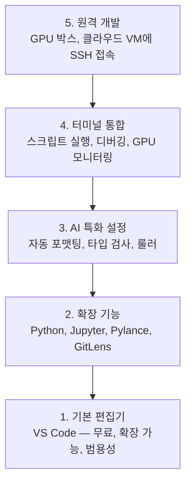

# 에디터 설정

> 에디터는 당신의 부조종사와 같습니다. 한 번 구성하면 방해되지 않고 스스로 역할을 수행하기 시작합니다.

**유형:** 빌드  
**언어:** --  
**사전 요구 사항:** 0단계, 레슨 01  
**소요 시간:** ~20분

## 학습 목표

- Python, Jupyter, 린팅, 원격 SSH를 위한 필수 확장 기능을 포함한 VS Code 설치
- AI 워크플로우를 위한 저장 시 포맷팅, 타입 검사, 노트북 출력 스크롤 구성
- 원격 GPU 머신에서 코드를 로컬처럼 편집하고 디버깅할 수 있도록 Remote SSH 설정
- AI 작업을 위한 편집기 대안(Cursor, Windsurf, Neovim) 및 각각의 트레이드오프 평가

## 문제

당신은 수천 시간을 편집기 안에서 Python 코드를 작성하고, 노트북을 실행하며, 학습 루프를 디버깅하고, GPU 박스에 SSH로 접속하는 데 보낼 것입니다. 잘못 구성된 편집기는 모든 세션을 마찰로 만듭니다: 자동 완성 없음, 타입 힌트 없음, 인라인 오류 없음, 수동 포맷팅, 불편한 터미널 워크플로우.

올바른 설정은 20분이 걸립니다. 이를 생략하면 매일 20분을 낭비하게 됩니다.

## 개념

AI 엔지니어링 편집기 설정에는 다음 다섯 가지 요소가 필요합니다:



## 구축 방법

### 1단계: VS Code 설치

VS Code는 권장되는 편집기입니다. 무료이며 모든 OS에서 실행되고, 1급 Jupyter 노트북 지원을 제공하며, 확장 기능 생태계는 AI 작업에 필요한 모든 것을 포함합니다.

[code.visualstudio.com](https://code.visualstudio.com/)에서 다운로드하세요.

터미널에서 확인:

```bash
code --version
```

macOS에서 `code`가 발견되지 않으면 VS Code를 열고 `Cmd+Shift+P`를 눌러 "Shell Command"를 입력한 후 "Install 'code' command in PATH"를 선택하세요.

### 2단계: 필수 확장 설치

VS Code의 통합 터미널(`Ctrl+`` ` 또는 `Cmd+` `)을 열고 AI 작업에 필요한 확장들을 설치하세요:

```bash
code --install-extension ms-python.python
code --install-extension ms-python.vscode-pylance
code --install-extension ms-toolsai.jupyter
code --install-extension eamodio.gitlens
code --install-extension ms-vscode-remote.remote-ssh
code --install-extension ms-python.debugpy
code --install-extension ms-python.black-formatter
code --install-extension charliermarsh.ruff
```

각 확장의 기능:

| 확장 | 이유 |
|-----------|-----|
| Python | 언어 지원, 가상 환경 감지, 실행/디버깅 |
| Pylance | 빠른 타입 검사, 자동 완성, 임포트 해결 |
| Jupyter | VS Code 내에서 노트북 실행, 변수 탐색기 |
| GitLens | 변경 사항 확인, 인라인 git blame |
| Remote SSH | 원격 GPU 박스의 폴더를 로컬처럼 열기 |
| Debugpy | Python 단계별 디버깅 |
| Black Formatter | 저장 시 자동 포맷, 일관된 스타일 |
| Ruff | 빠른 린팅, 일반적인 실수 감지 |

이 레슨의 `code/.vscode/extensions.json` 파일에는 전체 권장 목록이 포함되어 있습니다. 프로젝트 폴더를 열면 VS Code가 설치를 제안합니다.

### 3단계: 설정 구성

이 레슨의 `code/.vscode/settings.json`에서 설정을 복사하거나, "설정 > 설정 열기 (JSON)"을 통해 수동으로 적용하세요.

AI 작업을 위한 주요 설정:

```jsonc
{
    "python.analysis.typeCheckingMode": "basic",
    "editor.formatOnSave": true,
    "editor.rulers": [88, 120],
    "notebook.output.scrolling": true,
    "files.autoSave": "afterDelay"
}
```

이 설정들이 중요한 이유:

- **기본 타입 검사**: 실행 전에 잘못된 인수 타입을 감지합니다. 텐서 형태 불일치 및 잘못된 API 파라미터로 인한 디버깅 시간을 절약합니다.
- **저장 시 포맷**: 포맷에 대해 더 이상 고민할 필요 없습니다. Black이 처리합니다.
- **88과 120에 룰러 표시**: Black은 88에서 줄 바꿉니다. 120 마커는 docstring과 주석이 너무 길어질 때를 보여줍니다.
- **노트북 출력 스크롤**: 훈련 루프는 수천 줄을 출력합니다. 스크롤이 없으면 출력 패널이 폭주합니다.
- **자동 저장**: 저장을 잊을 수 있습니다. 훈련 스크립트가 오래된 코드를 실행할 수 있습니다. 자동 저장은 이를 방지합니다.

### 4단계: 터미널 통합

VS Code의 통합 터미널은 훈련 스크립트 실행, GPU 모니터링, 환경 관리를 위한 공간입니다.

올바르게 설정하세요:

```jsonc
{
    "terminal.integrated.defaultProfile.osx": "zsh",
    "terminal.integrated.defaultProfile.linux": "bash",
    "terminal.integrated.fontSize": 13,
    "terminal.integrated.scrollback": 10000
}
```

유용한 단축키:

| 작업 | macOS | Linux/Windows |
|--------|-------|---------------|
| 터미널 토글 | `` Ctrl+` `` | `` Ctrl+` `` |
| 새 터미널 | `Ctrl+Shift+`` ` | `Ctrl+Shift+`` ` |
| 터미널 분할 | `Cmd+\` | `Ctrl+\` |

분할 터미널은 유용합니다: 하나는 스크립트 실행용, 다른 하나는 `nvidia-smi -l 1` 또는 `watch -n 1 nvidia-smi`로 GPU 모니터링용입니다.

### 5단계: 원격 개발 (GPU 박스 SSH 연결)

이것은 AI 작업을 위한 가장 중요한 확장입니다. 원격 머신(클라우드 VM, 연구실 서버, Lambda, Vast.ai)에서 훈련을 실행할 것입니다. Remote SSH를 사용하면 원격 파일 시스템을 열고, 파일을 편집하고, 터미널을 실행하며, 모든 것이 로컬인 것처럼 디버깅할 수 있습니다.

설정 방법:

1. Remote SSH 확장 설치(2단계에서 완료).
2. `Ctrl+Shift+P`(또는 `Cmd+Shift+P`)를 누르고 "Remote-SSH: Connect to Host" 입력.
3. `user@your-gpu-box-ip` 입력.
4. VS Code가 원격 머신에 서버 구성 요소를 자동으로 설치합니다.

비밀번호 없는 접근을 위해 SSH 키를 설정하세요:

```bash
ssh-keygen -t ed25519 -C "your-email@example.com"
ssh-copy-id user@your-gpu-box-ip
```

편의를 위해 `~/.ssh/config`에 호스트를 추가하세요:

```
Host gpu-box
    HostName 203.0.113.50
    User ubuntu
    IdentityFile ~/.ssh/id_ed25519
    ForwardAgent yes
```

이제 "Remote-SSH: Connect to Host > gpu-box"로 즉시 연결할 수 있습니다.

## 대안

### 커서(Cursor)

[cursor.com](https://cursor.com)은 AI 코드 생성이 내장된 VS Code 포크입니다. 동일한 확장 프로그램 생태계와 설정 형식을 사용합니다. 커서를 사용하는 경우 이 강의의 모든 내용이 그대로 적용됩니다. 동일한 `settings.json`과 `extensions.json`을 가져오세요.

### 윈드서프(Windsurf)

[windsurf.com](https://windsurf.com)은 또 다른 AI 우선 VS Code 포크입니다. 동일한 내용: 동일한 확장 프로그램, 동일한 설정 형식, 동일한 Remote SSH 지원.

### 빔(Vim)/네오빔(Neovim)

이미 빔이나 네오빔을 사용하고 있고 생산적이라면 계속 사용하세요. AI Python 작업을 위한 최소 설정:

- **pyright** 또는 **pylsp** (Mason 또는 수동 설치)를 통한 타입 검사
- 언어 서버 통합을 위한 **nvim-lspconfig**
- 노트북과 유사한 실행을 위한 **jupyter-vim** 또는 **molten-nvim**
- 파일/심볼 검색을 위한 **telescope.nvim**
- 포맷팅/린팅을 위한 **none-ls.nvim**과 black 및 ruff

이미 빔을 사용하지 않는다면 지금 시작하지 마세요. 학습 곡선이 AI 엔지니어링 학습과 경쟁하게 됩니다. VS Code를 사용하세요.

## 사용 방법

이 설정을 사용하면 일상적인 작업 흐름은 다음과 같습니다:

1. VS Code에서 프로젝트 폴더를 엽니다(또는 GPU 박스에 Remote SSH로 연결).
2. 자동 완성, 타입 힌트, 인라인 오류 검사 기능을 사용하여 편집기에서 Python 코드를 작성합니다.
3. Jupyter 확장 기능을 사용하여 인라인으로 Jupyter 노트북을 실행합니다.
4. 통합 터미널을 사용하여 훈련 스크립트 실행, `uv pip install`, GPU 모니터링을 수행합니다.
5. 커밋 전 GitLens로 변경 사항을 검토합니다.

## 연습 문제

1. VS Code와 2단계에 나열된 모든 확장 프로그램을 설치하세요  
2. 이 강의의 `settings.json`을 복사하여 VS Code 설정에 적용하세요  
3. Python 파일을 열고 Pylance가 타입 힌트(type hints)를 표시하며 Black이 저장 시 포맷팅하는지 확인하세요  
4. 원격 머신에 접근 권한이 있다면 Remote SSH를 설정하고 해당 머신의 폴더를 열어보세요  

> **참고**:  
> - Pylance: VS Code용 Python 언어 서버 확장  
> - Black: Python 코드 포맷터  
> - Remote SSH: VS Code의 SSH 원격 개발 확장

## 주요 용어

| 용어 | 사람들이 말하는 것 | 실제 의미 |
|------|----------------|----------------------|
| LSP | "자동 완성 엔진" | 언어 서버 프로토콜(Language Server Protocol): 편집기가 언어별 서버로부터 타입 정보, 자동 완성, 진단 정보를 얻기 위한 표준 |
| Pylance | "파이썬 플러그인" | 타입 검사 및 인텔리센스를 위해 Pyright를 사용하는 Microsoft의 파이썬 언어 서버 |
| Remote SSH | "서버에서 작업하기" | 원격 머신에서 가벼운 서버를 실행하고 UI를 로컬 편집기로 스트리밍하는 VS Code 확장 프로그램 |
| Format on save | "자동 프리티어" | 편집기가 저장할 때마다 포매터(Black, Ruff)를 실행하여 코드 스타일이 항상 일관되게 유지됨 |