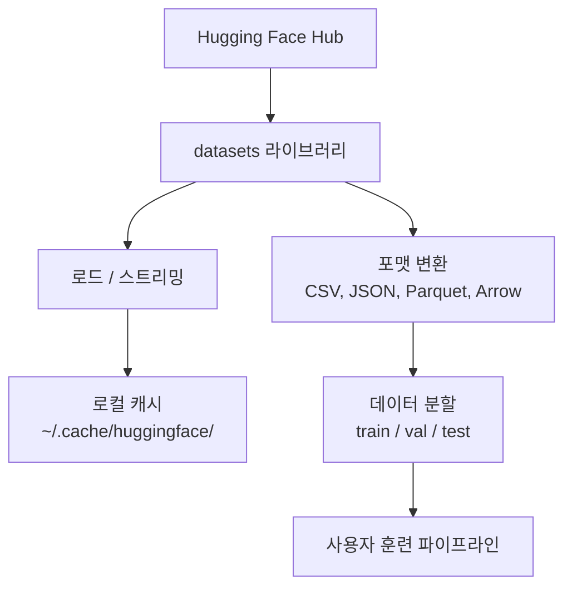

# 데이터 관리

> 데이터는 연료입니다. 데이터를 어떻게 관리하느냐에 따라 속도가 결정됩니다.

**유형:** 구축
**언어:** Python
**선수 지식:** Phase 0, Lesson 01
**소요 시간:** ~45분

## 학습 목표

- 허깅페이스 `datasets` 라이브러리를 사용하여 데이터셋을 로드, 스트리밍, 캐싱하기  
- CSV, JSON, Parquet, Arrow 형식 간 변환 및 각 형식의 장단점 설명하기  
- 고정된 난수 시드로 재현 가능한 훈련/검증/테스트 분할 생성하기  
- `.gitignore`, Git LFS, 또는 DVC를 사용하여 대용량 모델 및 데이터셋 파일 관리하기

## 문제

모든 AI 프로젝트는 데이터로부터 시작됩니다. 데이터셋을 찾고, 다운로드하며, 형식 간 변환, 훈련 및 평가용 분할, 실험 재현성을 위한 버전 관리가 필요합니다. 매번 수동으로 이 작업을 수행하는 것은 느리고 오류가 발생하기 쉽습니다. 반복 가능한 워크플로우가 필요합니다.

## 개념



Hugging Face `datasets` 라이브러리는 AI 작업을 위한 데이터를 로드하는 표준 방법입니다. 다운로드, 캐싱, 포맷 변환, 스트리밍을 기본적으로 처리합니다.

## 빌드하기

### 1단계: datasets 라이브러리 설치

```bash
pip install datasets huggingface_hub
```

### 2단계: 데이터셋 로드

```python
from datasets import load_dataset

dataset = load_dataset("imdb")
print(dataset)
print(dataset["train"][0])
```

이것은 IMDB 영화 리뷰 데이터셋을 다운로드합니다. 첫 번째 다운로드 후에는 `~/.cache/huggingface/datasets/` 캐시에서 로드됩니다.

### 3단계: 대용량 데이터셋 스트리밍

일부 데이터셋은 디스크에 저장하기에 너무 큽니다. 스트리밍은 전체 다운로드 없이 행 단위로 로드합니다.

```python
dataset = load_dataset("wikipedia", "20220301.en", split="train", streaming=True)

for i, example in enumerate(dataset):
    print(example["title"])
    if i >= 4:
        break
```

스트리밍은 `IterableDataset`을 제공합니다. 행이 도착할 때마다 처리하며, 메모리 사용량은 데이터셋 크기와 무관하게 일정하게 유지됩니다.

### 4단계: 데이터셋 형식

`datasets` 라이브러리는 내부적으로 Apache Arrow를 사용합니다. 파이프라인의 필요에 따라 다른 형식으로 변환할 수 있습니다.

```python
dataset = load_dataset("imdb", split="train")

dataset.to_csv("imdb_train.csv")
dataset.to_json("imdb_train.json")
dataset.to_parquet("imdb_train.parquet")
```

형식 비교:

| 형식 | 크기 | 읽기 속도 | 최적 용도 |
|------|------|-----------|-----------|
| CSV | 큼 | 느림 | 사람이 읽기, 스프레드시트 |
| JSON | 큼 | 느림 | API, 중첩 데이터 |
| Parquet | 작음 | 빠름 | 분석, 열 기반 쿼리 |
| Arrow | 작음 | 가장 빠름 | 메모리 내 처리 (`datasets` 내부 사용) |

AI 작업에서는 Parquet이 최고의 저장 형식입니다. Arrow는 메모리에서 작업하는 데 사용되며, CSV와 JSON은 데이터 교환용입니다.

### 5단계: 데이터 분할

모든 ML 프로젝트에는 세 가지 분할이 필요합니다:

- **학습(train)**: 모델이 이 데이터로 학습 (일반적으로 80%)
- **검증(validation)**: 학습 중 진행 상황 확인 (일반적으로 10%)
- **테스트(test)**: 학습 완료 후 최종 평가 (일반적으로 10%)

일부 데이터셋은 미리 분할되어 있습니다. 그렇지 않은 경우 직접 분할합니다:

```python
dataset = load_dataset("imdb", split="train")

split = dataset.train_test_split(test_size=0.2, seed=42)
train_val = split["train"].train_test_split(test_size=0.125, seed=42)

train_ds = train_val["train"]
val_ds = train_val["test"]
test_ds = split["test"]

print(f"학습: {len(train_ds)}, 검증: {len(val_ds)}, 테스트: {len(test_ds)}")
```

재현성을 위해 항상 시드를 설정하세요. 동일한 시드는 매번 동일한 분할을 생성합니다.

### 6단계: 모델 다운로드 및 캐싱

모델은 큰 파일입니다. `huggingface_hub` 라이브러리는 다운로드 및 캐싱을 처리합니다.

```python
from huggingface_hub import hf_hub_download, snapshot_download

model_path = hf_hub_download(
    repo_id="sentence-transformers/all-MiniLM-L6-v2",
    filename="config.json"
)
print(f"캐시 위치: {model_path}")

model_dir = snapshot_download("sentence-transformers/all-MiniLM-L6-v2")
print(f"전체 모델 위치: {model_dir}")
```

모델은 `~/.cache/huggingface/hub/`에 캐시됩니다. 한 번 다운로드하면 이후 실행 시 즉시 로드됩니다.

### 7단계: 대용량 파일 처리

모델 가중치와 대용량 데이터셋은 git에 넣지 말아야 합니다. 세 가지 옵션:

**옵션 A: .gitignore (가장 간단)**

```
*.bin
*.safetensors
*.pt
*.onnx
data/*.parquet
data/*.csv
models/
```

**옵션 B: Git LFS (git에서 대용량 파일 추적)**

```bash
git lfs install
git lfs track "*.bin"
git lfs track "*.safetensors"
git add .gitattributes
```

Git LFS는 리포지토리에 포인터를 저장하고 실제 파일은 별도 서버에 저장합니다. GitHub는 1GB를 무료로 제공합니다.

**옵션 C: DVC (데이터 버전 관리)**

```bash
pip install dvc
dvc init
dvc add data/training_set.parquet
git add data/training_set.parquet.dvc data/.gitignore
git commit -m "DVC로 학습 데이터 추적"
```

DVC는 데이터를 가리키는 작은 `.dvc` 파일을 생성합니다. 데이터 자체는 S3, GCS 또는 다른 원격 저장소에 저장됩니다.

| 접근 방식 | 복잡성 | 최적 용도 |
|-----------|--------|-----------|
| .gitignore | 낮음 | 개인 프로젝트, 다시 가져올 수 있는 다운로드 데이터 |
| Git LFS | 중간 | git을 통해 모델 가중치를 공유하는 팀 |
| DVC | 높음 | 재현 가능한 실험, 대용량 데이터셋, 팀 |

이 강의에서는 `.gitignore`로 충분합니다. 여러 머신에서 정확한 실험을 재현해야 할 때 DVC를 사용하세요.

### 8단계: 저장 패턴

**로컬 저장**은 ~10GB 미만의 데이터셋에 적합합니다. HF 캐시는 이를 자동으로 처리합니다.

**클라우드 저장**은 더 큰 규모나 여러 머신에서 공유해야 할 때 사용합니다:

```python
import os

local_path = os.path.expanduser("~/.cache/huggingface/datasets/")

# s3_path = "s3://my-bucket/datasets/"
# gcs_path = "gs://my-bucket/datasets/"
```

DVC는 S3 및 GCS와 직접 통합됩니다:

```bash
dvc remote add -d myremote s3://my-bucket/dvc-store
dvc push
```

이 강의에서는 로컬 저장으로 충분합니다. 원격 GPU 인스턴스에서 파인튜닝할 때 클라우드 저장이 필요해집니다.

## 이 과정에서 사용하는 데이터셋

| 데이터셋 | 레슨 | 크기 | 학습 내용 |
|---------|---------|------|----------------|
| IMDB | 토크나이저(tokenization), 분류(classification) | 84 MB | 텍스트 분류 기본 |
| WikiText | 언어 모델링(language modeling) | 181 MB | 다음 토큰 예측(next-token prediction) |
| SQuAD | QA 시스템(question answering systems) | 35 MB | 질문 답변, 스팬(span) |
| Common Crawl (서브셋) | 임베딩(embedding) | 다양함 | 대규모 텍스트 처리 |
| MNIST | 비전 기초(vision basics) | 21 MB | 이미지 분류 기본 |
| COCO (서브셋) | 멀티모달(multimodal) | 다양함 | 이미지-텍스트 쌍 |

지금은 이 모든 것을 다운로드할 필요가 없습니다. 각 레슨에서 필요한 내용을 명시합니다.

## 사용 방법

모든 것이 작동하는지 확인하기 위해 유틸리티 스크립트를 실행해 보세요:

```bash
python code/data_utils.py
```

이 스크립트는 작은 데이터셋을 다운로드하고, 변환한 후 분할하며 요약 정보를 출력합니다.

## Ship It

이 레슨은 다음을 생성합니다:
- `code/data_utils.py` - 재사용 가능한 데이터 로딩 및 캐싱 유틸리티
- `outputs/prompt-data-helper.md` - 작업에 적합한 데이터셋을 찾기 위한 프롬프트

## 연습 문제

1. `glue` 데이터셋에서 `mrpc` 설정으로 데이터를 로드하고 처음 5개 예시를 확인하시오  
2. `c4` 데이터셋을 스트리밍하고 10초 동안 처리할 수 있는 예시 개수를 세시오  
3. 데이터셋을 Parquet 형식으로 변환하고 CSV와의 파일 크기를 비교하시오  
4. 고정된 시드(seed)로 70/15/15 비율의 학습/검증/테스트 분할을 생성하고 분할 크기를 검증하시오  

> **참고**: 전문 용어 및 기술 스택은 원문을 유지합니다. 예: `glue`, `mrpc`, `c4`, Parquet, CSV, seed 등

## Key Terms

| Term | What people say | What it actually means |
|------|----------------|----------------------|
| Dataset split | "학습 데이터" | ML 라이프사이클의 다양한 단계에서 사용되는 명명된 부분 집합(train/val/test) |
| Streaming | "지연 로딩" | 전체 데이터셋을 다운로드하지 않고 원격 소스에서 행 단위로 데이터를 처리 |
| Parquet | "압축된 CSV" | 분석 쿼리 및 저장 효율성에 최적화된 컬럼형 파일 형식 |
| Arrow | "빠른 데이터프레임" | 데이터셋 라이브러리에서 내부적으로 사용되는 인메모리 컬럼 형식으로, 복사 없이 읽기 가능 |
| Git LFS | "대용량 파일을 위한 Git" | 큰 파일을 git 저장소 외부에 저장하면서 버전 관리에 포인터를 유지하는 확장 기능 |
| DVC | "데이터를 위한 Git" | 클라우드 스토리지와 통합되는 데이터셋 및 모델용 버전 관리 시스템 |
| Cache | "이미 다운로드됨" | 이전에 가져온 데이터의 로컬 복사본으로, 기본값은 ~/.cache/huggingface/에 저장 |