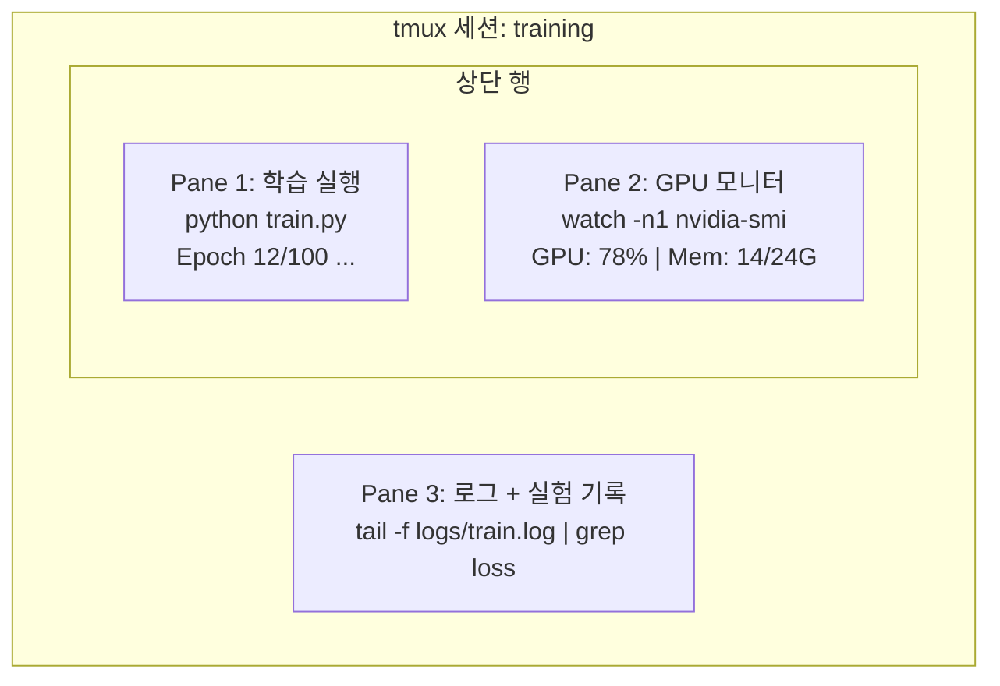

# 터미널 & 셸

> AI 엔지니어가 주로 머무는 공간입니다. 여기서 편안함을 느껴보세요.

**유형:** 학습  
**언어:** --  
**선수 지식:** Phase 0, Lesson 01  
**소요 시간:** ~35분

## 학습 목표

- **파이핑, 리다이렉션, `grep`**을 사용하여 명령줄에서 훈련 로그를 필터링하고 처리
- **병렬 훈련 및 GPU 모니터링**을 위한 여러 패인이 있는 영구적 `tmux` 세션 생성
- **`htop`, `nvtop`, `nvidia-smi`**로 시스템 및 GPU 리소스 모니터링
- **SSH, `scp`, `rsync`**를 사용하여 로컬과 원격 머신 간 파일 전송

## 문제

여러분은 어떤 편집기보다 터미널에서 더 많은 시간을 보내게 될 것입니다. 학습 실행, GPU 모니터링, 로그 추적, 원격 SSH 세션, 환경 관리 등 모든 AI 워크플로우는 셸과 연결됩니다. 여기서 느리다면 모든 면에서 느릴 수밖에 없습니다.

이 강의에서는 AI 작업에 필요한 터미널 기술을 다룹니다. 유닉스 역사도, Bash 스크립팅 심층 분석도 아닙니다. 오직 필요한 것만 전달합니다.

## 개념



세 가지 작업이 동시에 실행됩니다. 하나의 터미널에서 가능합니다. 세션을 분리(detach)한 후 집에 가거나 SSH로 다시 접속해 재연결(attach)할 수 있습니다. 학습은 계속 실행됩니다.

## 빌드하기

## 1단계: 쉘(shell) 확인하기

사용 중인 쉘을 확인하세요:

```bash
echo $SHELL
```

대부분의 시스템은 `bash` 또는 `zsh`를 사용합니다. 둘 다 잘 작동합니다. 이 과정의 명령어는 둘 중 하나에서 작동합니다.

알아둘 주요 사항:

```bash
# 이동
cd ~/projects/ai-engineering-from-scratch
pwd
ls -la

# 히스토리 검색 (가장 유용한 단축키)
# Ctrl+R 후 이전 명령어 일부 입력
# Ctrl+R 다시 눌러 일치 항목 순환

# 터미널 초기화
clear   # 또는 Ctrl+L

# 실행 중인 명령어 취소
# Ctrl+C

# 실행 중인 명령어 일시 중지 (fg로 재개)
# Ctrl+Z
```

## 2단계: 파이프(pipe)와 리다이렉션(redirect)

파이프는 명령어를 연결합니다. 로그 처리, 출력 필터링, 도구 체이닝에 사용됩니다. 자주 사용하게 될 것입니다.

```bash
# 로그에서 "loss"가 나타나는 횟수 세기
cat train.log | grep "loss" | wc -l

# 훈련 출력에서 손실 값만 추출
grep "loss:" train.log | awk '{print $NF}' > losses.txt

# 실시간으로 로그 파일 업데이트 모니터링, 오류 필터링
tail -f train.log | grep --line-buffered "ERROR"

# 최종 정확도 기준으로 실험 정렬
grep "final_accuracy" results/*.log | sort -t= -k2 -n -r

# 표준 출력과 표준 오류를 별도 파일로 리다이렉션
python train.py > output.log 2> errors.log

# 둘 다 같은 파일로 리다이렉션
python train.py > train_full.log 2>&1
```

필요한 세 가지 리다이렉션:

| 기호 | 기능 |
|--------|-------------|
| `>` | 표준 출력을 파일에 쓰기 (덮어쓰기) |
| `>>` | 표준 출력을 파일에 추가 |
| `2>` | 표준 오류를 파일에 쓰기 |
| `2>&1` | 표준 오류를 표준 출력과 같은 위치로 전송 |
| `\|` | 한 명령어의 표준 출력을 다음 명령어의 표준 입력으로 전송 |

## 3단계: 백그라운드 프로세스

훈련 실행은 몇 시간 걸립니다. 터미널을 계속 열어둘 필요는 없습니다.

```bash
# 백그라운드 실행 (출력은 터미널로)
python train.py &

# 터미널 닫아도 종료되지 않는 백그라운드 실행
nohup python train.py > train.log 2>&1 &

# 백그라운드 실행 확인
jobs
ps aux | grep train.py

# 백그라운드 작업을 포그라운드로 가져오기
fg %1

# 백그라운드 프로세스 종료
kill %1
# 또는 PID 찾아 종료
kill $(pgrep -f "train.py")
```

`&`, `nohup`, `screen`/`tmux`의 차이:

| 방법 | 터미널 닫아도 생존? | 재연결 가능? |
|--------|-------------------------|---------------|
| `command &` | 아니오 | 아니오 |
| `nohup command &` | 예 | 아니오 (로그 파일 확인) |
| `screen` / `tmux` | 예 | 예 |

몇 분 이상 실행되는 작업은 `tmux`를 사용하세요.

## 4단계: tmux

`tmux`는 여러 패널이 있는 영구적 터미널 세션을 생성할 수 있습니다. 훈련 실행 관리에 가장 유용한 도구입니다.

```bash
# 설치
# macOS
brew install tmux
# Ubuntu
sudo apt install tmux

# 이름 있는 세션 시작
tmux new -s training

# 수평 분할
# Ctrl+B 후 "

# 수직 분할
# Ctrl+B 후 %

# 패널 간 이동
# Ctrl+B 후 화살표 키

# 분리 (세션은 계속 실행)
# Ctrl+B 후 d

# 재연결
tmux attach -t training

# 세션 목록
tmux ls

# 세션 종료
tmux kill-session -t training
```

일반적인 AI 워크플로우 세션:

```bash
tmux new -s train

# 패널 1: 훈련 시작
python train.py --epochs 100 --lr 1e-4

# Ctrl+B, "로 분할, GPU 모니터 실행
watch -n1 nvidia-smi

# Ctrl+B, %로 수직 분할, 로그 확인
tail -f logs/experiment.log

# Ctrl+B, d로 분리
# SSH 종료, 커피 마시고 돌아옴
# tmux attach -t train
```

## 5단계: htop과 nvtop으로 모니터링

```bash
# 시스템 프로세스 (top보다 우수)
htop

# GPU 프로세스 (NVIDIA GPU가 있는 경우)
# 설치: sudo apt install nvtop (Ubuntu) 또는 brew install nvtop (macOS)
nvtop

# nvtop 없이 빠른 GPU 확인
nvidia-smi

# 1초마다 GPU 사용량 업데이트
watch -n1 nvidia-smi

# GPU 사용 중인 프로세스 확인
nvidia-smi --query-compute-apps=pid,name,used_memory --format=csv
```

`htop`에서 사용할 키바인딩:
- `F6` 또는 `>`로 열 기준 정렬 (메모리 기준 정렬로 메모리 누수 찾기)
- `F5`로 트리 보기 전환 (자식 프로세스 확인)
- `F9`로 프로세스 종료
- `/`로 프로세스 이름 검색

## 6단계: 원격 GPU 박스를 위한 SSH

클라우드 GPU(Lambda, RunPod, Vast.ai)를 임대할 때 SSH로 연결합니다.

```bash
# 기본 연결
ssh user@gpu-box-ip

# 특정 키 사용
ssh -i ~/.ssh/my_gpu_key user@gpu-box-ip

# 원격에 파일 복사
scp model.pt user@gpu-box-ip:~/models/

# 원격에서 파일 복사
scp user@gpu-box-ip:~/results/metrics.json ./

# 전체 디렉토리 동기화 (많은 파일에 적합)
rsync -avz ./data/ user@gpu-box-ip:~/data/

# 포트 포워딩 (로컬에서 원격 Jupyter/TensorBoard 접근)
ssh -L 8888:localhost:8888 user@gpu-box-ip
# 브라우저에서 localhost:8888 열기

# 편의를 위한 SSH 설정
# ~/.ssh/config에 추가:
# Host gpu
#     HostName 192.168.1.100
#     User ubuntu
#     IdentityFile ~/.ssh/gpu_key
# 이후 간단히:
# ssh gpu
```

## 7단계: AI 작업을 위한 유용한 별칭

`~/.bashrc` 또는 `~/.zshrc`에 추가하세요:

```bash
source phases/00-setup-and-tooling/10-terminal-and-shell/code/shell_aliases.sh
```

또는 원하는 별칭만 복사하세요. 주요 별칭:

```bash
# GPU 상태 한눈에 보기
alias gpu='nvidia-smi --query-gpu=index,name,utilization.gpu,memory.used,memory.total,temperature.gpu --format=csv,noheader'

# 모든 Python 훈련 프로세스 종료
alias killtraining='pkill -f "python.*train"'

# 가상 환경 빠르게 활성화
alias ae='source .venv/bin/activate'

# 훈련 손실 모니터링
alias watchloss='tail -f logs/*.log | grep --line-buffered "loss"'
```

전체 목록은 `code/shell_aliases.sh`를 참조하세요.

## 8단계: 일반적인 AI 터미널 패턴

실무에서 자주 사용되는 패턴:

```bash
# 훈련 실행, 모든 로그 기록, 완료 시 알림
python train.py 2>&1 | tee train.log; echo "DONE" | mail -s "Training complete" you@email.com

# 두 실험 로그 나란히 비교
diff <(grep "accuracy" exp1.log) <(grep "accuracy" exp2.log)

# 가장 큰 모델 파일 찾기 (디스크 공간 정리)
find . -name "*.pt" -o -name "*.safetensors" | xargs du -h | sort -rh | head -20

# Hugging Face에서 모델 다운로드
wget https://huggingface.co/model/resolve/main/model.safetensors

# 데이터셋 압축 해제
tar xzf dataset.tar.gz -C ./data/

# 모든 Python 파일 줄 수 세기 (프로젝트 크기 확인)
find . -name "*.py" | xargs wc -l | tail -1

# 디스크 공간 확인 (훈련 데이터는 디스크를 빠르게 채움)
df -h
du -sh ./data/*

# 훈련 전 환경 변수 확인
env | grep -i cuda
env | grep -i torch
```

## 사용 시기

이 과정에서 각 도구가 사용되는 시점은 다음과 같습니다:

| 도구 | 사용 시기 |
|------|----------------|
| tmux | 모든 학습 실행 시 (3단계+) |
| `tail -f` + `grep` | 학습 로그 모니터링 |
| `nohup` / `&` | 빠른 백그라운드 작업 |
| `htop` / `nvtop` | 느린 학습, OOM 오류 디버깅 |
| SSH + `rsync` | 클라우드 GPU 작업 시 |
| 파이프 + 리다이렉션 | 실험 결과 처리 |
| 별칭(aliases) | 반복 명령어 시간 절약 |

## 연습 문제

1. `tmux`를 설치하고, 세 개의 패인을 가진 세션을 생성한 후, 한 패인에서 `htop`을 실행하고, 다른 패인에서 `watch -n1 date`를 실행하며, 세 번째 패인에서 Python 스크립트를 실행하세요. 세션을 분리(detach)하고 다시 연결(reattach)하세요.
2. `code/shell_aliases.sh`에 있는 별칭(aliases)을 쉘 설정 파일에 추가하고 `source ~/.zshrc`(또는 `~/.bashrc`)로 재로드하세요.
3. `for i in $(seq 1 100); do echo "epoch $i loss: $(echo "scale=4; 1/$i" | bc)"; sleep 0.1; done > fake_train.log`로 가짜 훈련 로그를 생성한 후, `grep`, `tail`, `awk`를 사용하여 손실(loss) 값만 추출하세요.
4. 접근 가능한 서버에 대한 SSH 설정 항목을 구성하거나(문법 연습을 위해 `localhost` 사용 가능), SSH 설정 파일을 수정하세요.

## 주요 용어

| 용어 | 사람들이 말하는 표현 | 실제 의미 |
|------|----------------|----------------------|
| Shell | "터미널" | 명령어를 해석하는 프로그램 (bash, zsh, fish) |
| tmux | "터미널 멀티플렉서" | 하나의 창 안에서 여러 터미널 세션을 실행하고 분리/재연결할 수 있게 해주는 프로그램 |
| Pipe | "파이프 기호" | 한 명령의 출력을 다른 명령의 입력으로 전달하는 `\|` 연산자 |
| PID | "프로세스 ID" | 실행 중인 모든 프로세스에 할당되는 고유 번호, 모니터링이나 종료에 사용 |
| nohup | "노행업" | 터미널을 닫아도 종료되지 않도록 행업 신호에 영향을 받지 않게 명령을 실행 |
| SSH | "서버에 연결" | 원격 머신에서 명령을 실행하기 위한 암호화된 프로토콜인 Secure Shell |