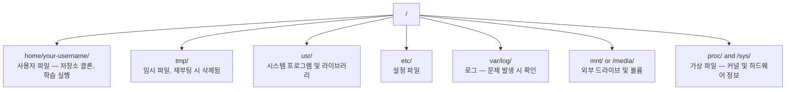

# AI를 위한 리눅스

> 대부분의 AI는 리눅스에서 실행됩니다. 막히지 않을 정도로 충분히 알아야 합니다.

**유형:** 학습  
**언어:** --  
**선수 지식:** 0단계, 01강  
**소요 시간:** ~30분

## 학습 목표

- Linux 파일 시스템을 탐색하고 명령줄에서 필수 파일 작업 수행
- `chmod`와 `chown`으로 파일 권한을 관리하여 "Permission denied" 오류 해결
- `apt`로 시스템 패키지 설치 및 AI 작업을 위한 새 GPU 박스 설정
- 원격 머신에서 작업하는 개발자를 자주 방해하는 macOS와 Linux의 차이점 식별

## 문제

당신은 macOS 또는 Windows에서 개발합니다. 하지만 클라우드 GPU 박스에 SSH로 접속하거나, Lambda 인스턴스를 임대하거나, EC2 머신을 가동하는 순간 Ubuntu 환경에 놓이게 됩니다. 터미널이 유일한 인터페이스입니다. Finder도, Explorer도, GUI도 없습니다. 파일 시스템 탐색, 패키지 설치, 프로세스 관리를 명령어로 수행할 수 없다면, "리눅스에서 파일 압축 해제하는 방법"을 검색하면서 유휴 GPU 시간에 대한 비용만 지불하게 됩니다.

이것은 생존 가이드입니다. AI 작업을 위해 원격 리눅스 머신에서 운영해야 하는 필수 내용만을 다룹니다. 그 이상은 없습니다.

## 파일 시스템 레이아웃

Linux는 모든 것을 단일 루트 `/` 아래에 구성합니다. `C:\`나 `/Volumes`는 없습니다. 실제로 접하게 될 디렉터리들:



홈 디렉터리는 `~` 또는 `/home/your-username`입니다. 거의 모든 작업이 여기서 이루어집니다.

## 필수 명령어

이 명령어들은 원격 GPU 서버에서 수행하는 작업의 95%를 커버하는 15가지입니다.

### 이동 관련

```bash
pwd                         # 현재 위치는?
ls                          # 여기엔 무엇이 있나?
ls -la                      # 숨김 파일 포함 상세 목록?
cd /path/to/dir             # 해당 경로로 이동
cd ~                        # 홈 디렉토리로 이동
cd ..                       # 상위 디렉토리로 이동
```

### 파일 및 디렉토리 관리

```bash
mkdir my-project            # 디렉토리 생성
mkdir -p a/b/c              # 중첩 디렉토리 한 번에 생성

cp file.txt backup.txt      # 파일 복사
cp -r src/ src-backup/      # 디렉토리 복사 (재귀적)

mv old.txt new.txt          # 파일 이름 변경
mv file.txt /tmp/           # 파일 이동

rm file.txt                 # 파일 삭제 (휴지통 없이 영구 삭제)
rm -rf my-dir/              # 디렉토리와 내부 모든 내용 삭제
```

`rm -rf`는 영구 삭제입니다. 실행 취소 불가능하므로 경로 확인 후 엔터 키를 누르세요.

### 파일 읽기

```bash
cat file.txt                # 파일 전체 내용 출력
head -20 file.txt           # 처음 20줄
tail -20 file.txt           # 마지막 20줄
tail -f log.txt             # 실시간 로그 파일 추적 (Ctrl+C로 중지)
less file.txt               # 파일 스크롤 보기 (q로 종료)
```

### 검색

```bash
grep "error" training.log           # "error" 포함 라인 찾기
grep -r "learning_rate" .           # 현재 디렉토리 내 모든 파일에서 검색
grep -i "cuda" config.yaml          # 대소문자 구분 없이 검색

find . -name "*.py"                 # 현재 디렉토리 하위 모든 Python 파일 찾기
find . -name "*.ckpt" -size +1G     # 1GB 이상 체크포인트 파일 찾기
```

## 권한(Permissions)

Linux의 모든 파일에는 소유자와 권한 비트가 있습니다. 스크립트가 실행되지 않거나 디렉터리에 쓸 수 없을 때 이 문제를 마주하게 됩니다.

```bash
ls -l train.py
# -rwxr-xr-- 1 user group 2048 Mar 19 10:00 train.py
#  ^^^             소유자 권한: 읽기, 쓰기, 실행
#     ^^^          그룹 권한: 읽기, 실행
#        ^^        그 외 사용자: 읽기 전용
```

일반적인 해결 방법:

```bash
chmod +x train.sh           # 스크립트 실행 권한 추가
chmod 755 deploy.sh         # 소유자: 전체 권한, 그 외: 읽기+실행
chmod 644 config.yaml       # 소유자: 읽기+쓰기, 그 외: 읽기 전용

chown user:group file.txt   # 파일 소유자 변경 (sudo 필요)
```

"Permission denied" 오류가 발생하면 거의 항상 권한 문제입니다. `chmod +x` 또는 `sudo`로 대부분의 경우를 해결할 수 있습니다.

## 패키지 관리 (apt)

Ubuntu는 `apt`를 사용합니다. 이는 시스템 수준의 소프트웨어를 설치하는 방법입니다.

```bash
sudo apt update             # 패키지 목록 새로 고침 (항상 먼저 실행)
sudo apt install -y htop    # 패키지 설치 (-y는 확인 생략)
sudo apt install -y build-essential  # C 컴파일러, make 등. 많은 Python 패키지에서 필요
sudo apt install -y tmux    # 터미널 멀티플렉서 (연결 해제 후 세션 유지)

apt list --installed        # 설치된 항목?
sudo apt remove htop        # 제거
```

새 GPU 머신에 설치할 일반적인 패키지:

```bash
sudo apt update && sudo apt install -y \
    build-essential \
    git \
    curl \
    wget \
    tmux \
    htop \
    unzip \
    python3-venv
```

## 사용자와 sudo

일반적으로 일반 사용자로 로그인합니다. 일부 작업은 루트(관리자) 접근 권한이 필요합니다.

```bash
whoami                      # 현재 사용자는 누구인가?
sudo command                # 단일 명령어를 루트로 실행
sudo su                     # 루트 권한 획득 (작업 완료 후 exit로 복귀, 가급적 적게 사용)
```

클라우드 GPU 인스턴스에서는 일반적으로 유일한 사용자이며 이미 sudo 접근 권한을 가지고 있습니다. 모든 작업을 루트로 실행하지 마세요. 필요한 경우에만 sudo를 사용하세요.

## 프로세스와 systemd

훈련 작업이 중단되거나 실행 중인 작업을 확인해야 할 때:

```bash
htop                        # 대화형 프로세스 뷰어 (종료: q)
ps aux | grep python        # 실행 중인 Python 프로세스 찾기
kill 12345                  # PID 12345 프로세스 정상 종료
kill -9 12345               # 강제 종료 (정상 종료가 작동하지 않을 때 사용)
nvidia-smi                  # GPU 프로세스 및 메모리 사용량
```

systemd는 서비스(백그라운드 데몬)를 관리합니다. 추론 서버를 실행할 때 사용합니다:

```bash
sudo systemctl start nginx          # 서비스 시작
sudo systemctl stop nginx           # 서비스 중지
sudo systemctl restart nginx        # 서비스 재시작
sudo systemctl status nginx         # 실행 상태 확인
sudo systemctl enable nginx         # 부팅 시 자동 시작
```

## 디스크 공간

GPU 박스는 종종 제한된 디스크 공간을 가집니다. 모델과 데이터셋은 이를 빠르게 채웁니다.

```bash
df -h                       # 모든 마운트된 드라이브의 디스크 사용량
df -h /home                 # /home에 대한 디스크 사용량

du -sh *                    # 현재 디렉터리의 각 항목 크기
du -sh ~/.cache             # 캐시 크기 (pip, 허깅페이스 모델 저장 위치)
du -sh /data/checkpoints/   # 체크포인트 크기 확인

# 가장 많은 공간을 차지하는 항목 찾기
du -h --max-depth=1 / 2>/dev/null | sort -hr | head -20
```

일반적인 공간 절약 방법:

```bash
# pip 캐시 삭제
pip cache purge

# apt 캐시 삭제
sudo apt clean

# 필요 없는 오래된 체크포인트 제거
rm -rf checkpoints/epoch_01/ checkpoints/epoch_02/
```

## 네트워킹

명령줄에서 모델을 다운로드하고, 파일을 전송하며, API를 호출하는 방법을 다룹니다.

```bash
# 파일 다운로드
wget https://example.com/model.bin                   # 파일 다운로드
curl -O https://example.com/data.tar.gz              # curl로 동일한 작업 수행
curl -s https://api.example.com/health | python3 -m json.tool  # API 호출 후 JSON 출력

# 머신 간 파일 전송
scp model.bin user@remote:/data/                     # 원격 머신에 파일 복사
scp user@remote:/data/results.csv .                  # 원격에서 로컬로 파일 복사
scp -r user@remote:/data/checkpoints/ ./local-dir/   # 디렉토리 복사

# 디렉토리 동기화 (대용량 전송 시 scp보다 빠르며, 실패 시 재개 가능)
rsync -avz --progress ./data/ user@remote:/data/
rsync -avz --progress user@remote:/results/ ./results/
```

대용량 작업에는 `scp` 대신 `rsync`를 사용하세요. 변경된 바이트만 전송하며, 연결이 끊겨도 재개할 수 있습니다.

## tmux: 세션 유지

원격 서버에 SSH로 접속한 상태에서 노트북을 닫아도 학습 작업이 계속 실행되도록 하려면 tmux를 사용하세요.

```bash
tmux new -s train           # "train"이라는 이름의 새 세션 시작
# ... 학습 시작 후:
# Ctrl+B, 다음 D            # 분리 (학습은 계속 실행됨)

tmux ls                     # 세션 목록 확인
tmux attach -t train        # 세션 재연결

# tmux 내부:
# Ctrl+B, 다음 %            # 세로 분할
# Ctrl+B, 다음 "            # 가로 분할
# Ctrl+B, 다음 방향키        # 분할 창 전환
```

긴 학습 작업은 항상 tmux 내에서 실행하세요. 항상.

## Windows 사용자를 위한 WSL2

Windows를 사용 중이라면 WSL2를 통해 듀얼 부팅 없이도 실제 Linux 환경을 사용할 수 있습니다.

```bash
# PowerShell(관리자 권한)에서
wsl --install -d Ubuntu-24.04

# 재시작 후 시작 메뉴에서 Ubuntu 열기
sudo apt update && sudo apt upgrade -y
```

WSL2는 실제 Linux 커널을 실행합니다. 이 강의의 모든 내용은 WSL2 내에서 작동합니다. Windows 파일은 WSL2 내부에서 `/mnt/c/Users/YourName/` 경로에 있습니다.

GPU 패스스루는 Windows 측에 NVIDIA 드라이버가 설치되어 있을 때 작동합니다. Linux 버전이 아닌 Windows용 NVIDIA 드라이버를 설치하면 WSL2 내부에서 CUDA를 사용할 수 있습니다.

## macOS에서 Linux로 전환 시 주의할 점

macOS에서 Linux로 전환할 때 주의해야 할 사항들:

| macOS | Linux | 참고 사항 |
|-------|-------|-------|
| `brew install` | `sudo apt install` | 패키지 이름이 다를 수 있음. `brew install htop`과 `sudo apt install htop`은 동일하게 작동하지만, `brew install readline`과 `sudo apt install libreadline-dev`는 다름. |
| `open file.txt` | `xdg-open file.txt` | 하지만 원격 서버에는 GUI가 없음. `cat` 또는 `less` 사용. |
| `pbcopy` / `pbpaste` | 사용 불가 | SSH를 통한 클립보드 복사/붙여넣기는 존재하지 않음. |
| `~/.zshrc` | `~/.bashrc` | macOS는 기본적으로 zsh를 사용. 대부분의 Linux 서버는 bash를 사용. |
| `/opt/homebrew/` | `/usr/bin/`, `/usr/local/bin/` | 바이너리 파일 위치가 다름. |
| `sed -i '' 's/a/b/' file` | `sed -i 's/a/b/' file` | macOS sed는 `-i` 뒤에 빈 문자열이 필요. Linux는 필요 없음. |
| 대소문자 구분 없는 파일 시스템 | 대소문자 구분 파일 시스템 | Linux에서는 `Model.py`와 `model.py`가 서로 다른 파일. |
| 줄 끝 `\n` | 줄 끝 `\n` | 동일. 하지만 Windows는 `\r\n`을 사용하여 bash 스크립트가 깨짐. `dos2unix`로 수정. |

## 빠른 참조 카드

```
네비게이션:     pwd, ls, cd, find
파일:          cp, mv, rm, mkdir, cat, head, tail, less
검색:         grep, find
권한:          chmod, chown, sudo
패키지:       apt update, apt install
프로세스:      htop, ps, kill, nvidia-smi
서비스:        systemctl start/stop/restart/status
디스크:        df -h, du -sh
네트워크:      curl, wget, scp, rsync
세션:         tmux new/attach/detach
```

## 연습 문제

1. SSH로 어떤 Linux 머신에 접속(또는 WSL2 열기)하고 홈 디렉터리로 이동합니다. 프로젝트 폴더를 생성한 후, `touch`로 그 안에 빈 파일 3개를 만들고 `ls -la`로 목록을 확인합니다.  
2. `apt`로 `htop`을 설치한 후 실행하고, 가장 많은 메모리를 사용 중인 프로세스를 식별합니다.  
3. `tmux` 세션을 시작하고, 그 안에서 `sleep 300`을 실행한 후 분리(detach)합니다. 세션 목록을 확인한 다음 다시 연결(reattach)합니다.  
4. `df -h`로 사용 가능한 디스크 공간을 확인한 후, `du -sh ~/.cache/*`로 캐시 디렉터리에서 공간을 차지하는 항목을 찾습니다.  
5. `scp`로 로컬 머신의 파일을 원격 머신으로 전송한 후, 동일한 작업을 `rsync`로 수행하고 두 경험을 비교합니다.