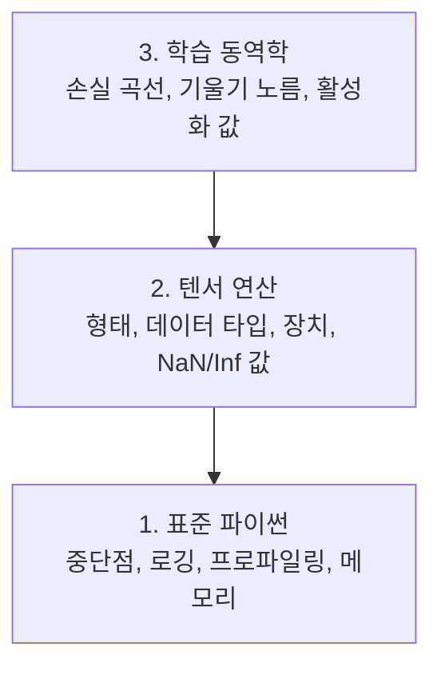

# 디버깅과 프로파일링

> 최악의 AI 버그는 크래시가 발생하지 않습니다. 그들은 쓰레기로 조용히 훈련하고 아름다운 손실 곡선을 보고합니다.

**유형:** 빌드  
**언어:** Python  
**사전 요구 사항:** 레슨 1(개발 환경), 기본적인 PyTorch 친숙도  
**소요 시간:** ~60분

## 학습 목표

- 조건부 `breakpoint()`와 `debug_print`를 사용하여 훈련 중간에 텐서 형태, 데이터 타입, NaN 값 검사
- `cProfile`, `line_profiler`, `tracemalloc`로 훈련 루프 프로파일링하여 병목 현상 찾기
- 일반적인 AI 버그 감지: 형태 불일치(shape mismatches), NaN 손실(NaN loss), 데이터 누수(data leakage), 잘못된 장치 텐서(wrong-device tensors)
- TensorBoard 설정으로 손실 곡선(loss curves), 가중치 히스토그램(weight histograms), 그래디언트 분포(gradient distributions) 시각화

## 문제

AI 코드는 일반 코드와 다르게 실패합니다. 웹 앱은 스택 트레이스와 함께 충돌합니다. 잘못 구성된 학습 루프는 8시간 동안 실행되고, GPU 시간 200달러를 소모하며, 모든 입력의 평균을 예측하는 모델을 생성합니다. 코드는 절대 오류를 발생시키지 않습니다. 버그는 잘못된 장치에 있는 텐서, 잊힌 `.detach()`, 또는 특징(feature)에 유출된 레이블(label) 때문이었습니다.

시간과 컴퓨팅 자원을 낭비하기 전에 이러한 무음 실패를 포착할 수 있는 디버깅 도구가 필요합니다.

## 개념

AI 디버깅은 세 가지 수준에서 작동합니다:



대부분의 사람들은 바로 3단계(텐서보드 응시)로 넘어갑니다. 하지만 AI 버그의 80%는 1단계와 2단계에 있습니다.

## 빌드하기

### 파트 1: 프린트 디버깅 (네, 효과가 있습니다)

프린트 디버깅은 종종 무시당합니다. 하지만 그래서는 안 됩니다. 텐서 코드의 경우, 디버거를 단계별로 실행하는 것보다 타겟팅된 프린트 문이 더 효과적입니다. 왜냐하면 형태(shape), 데이터 타입(dtype), 값 범위를 한 번에 확인해야 하기 때문입니다.

```python
def debug_print(name, tensor):
    print(f"{name}: shape={tensor.shape}, dtype={tensor.dtype}, "
          f"device={tensor.device}, "
          f"min={tensor.min().item():.4f}, max={tensor.max().item():.4f}, "
          f"mean={tensor.mean().item():.4f}, "
          f"has_nan={tensor.isnan().any().item()}")
```

의심스러운 연산 후에 이 함수를 호출하세요. 버그를 발견하면 프린트 문을 제거하세요. 간단합니다.

### 파트 2: 파이썬 디버거 (pdb 및 breakpoint)

내장 디버거는 AI 작업에 과소평가된 도구입니다. 훈련 루프에 `breakpoint()`를 삽입하고 텐서를 대화형으로 검사하세요.

```python
def training_step(model, batch, criterion, optimizer):
    inputs, labels = batch
    outputs = model(inputs)
    loss = criterion(outputs, labels)

    if loss.item() > 100 or torch.isnan(loss):
        breakpoint()

    loss.backward()
    optimizer.step()
```

디버거가 실행되면 유용한 명령어:

- `p outputs.shape`로 형태 확인
- `p loss.item()`로 손실 값 확인
- `p torch.isnan(outputs).sum()`로 NaN 개수 확인
- `p model.fc1.weight.grad`로 그래디언트 확인
- `c`로 계속, `q`로 종료

이것은 조건부 디버깅입니다. 문제가 있을 때만 중지합니다. 10,000단계 훈련 실행 시 중요합니다.

### 파트 3: 파이썬 로깅

간단한 확인을 넘어 디버깅할 때는 프린트 문 대신 로깅을 사용하세요.

```python
import logging

logging.basicConfig(
    level=logging.INFO,
    format="%(asctime)s [%(levelname)s] %(message)s",
    handlers=[
        logging.FileHandler("training.log"),
        logging.StreamHandler()
    ]
)
logger = logging.getLogger(__name__)

logger.info("훈련 시작: lr=%.4f, batch_size=%d", lr, batch_size)
logger.warning("손실 급증 감지: %.4f at step %d", loss.item(), step)
logger.error("NaN 손실 at step %d, 중지", step)
```

로깅은 타임스탬프, 심각도 수준, 파일 출력을 제공합니다. 새벽 3시에 훈련 실행이 실패할 때, 화면에서 사라진 터미널 출력이 아닌 로그 파일이 필요합니다.

### 파트 4: 코드 섹션 타이밍

시간이 어디에 소요되는지 아는 것이 최적화의 첫 단계입니다.

```python
import time

class Timer:
    def __init__(self, name=""):
        self.name = name

    def __enter__(self):
        self.start = time.perf_counter()
        return self

    def __exit__(self, *args):
        elapsed = time.perf_counter() - self.start
        print(f"[{self.name}] {elapsed:.4f}s")

with Timer("데이터 로딩"):
    batch = next(dataloader_iter)

with Timer("순전파"):
    outputs = model(batch)

with Timer("역전파"):
    loss.backward()
```

일반적인 발견: 데이터 로딩이 훈련 시간의 60%를 차지합니다. 해결책은 더 빠른 GPU가 아닌 DataLoader의 `num_workers > 0`입니다.

### 파트 5: cProfile 및 line_profiler

수동 타이머 이상의 것이 필요할 때:

```bash
python -m cProfile -s cumtime train.py
```

이것은 누적 시간 기준으로 정렬된 모든 함수 호출을 보여줍니다. 라인별 프로파일링:

```bash
pip install line_profiler
```

```python
@profile
def train_step(model, data, target):
    output = model(data)
    loss = F.cross_entropy(output, target)
    loss.backward()
    return loss

# 실행: kernprof -l -v train.py
```

### 파트 6: 메모리 프로파일링


#### tracemalloc을 사용한 CPU 메모리

```python
import tracemalloc

tracemalloc.start()

# 여기에 코드 작성
model = build_model()
data = load_dataset()

snapshot = tracemalloc.take_snapshot()
top_stats = snapshot.statistics("lineno")
for stat in top_stats[:10]:
    print(stat)
```


#### memory_profiler를 사용한 CPU 메모리

```bash
pip install memory_profiler
```

```python
from memory_profiler import profile

@profile
def load_data():
    raw = read_csv("data.csv")       # 여기서 메모리 증가 확인
    processed = preprocess(raw)       # 그리고 여기서
    return processed
```

`python -m memory_profiler your_script.py`로 실행하여 라인별 메모리 사용량을 확인하세요.


#### PyTorch를 사용한 GPU 메모리

```python
import torch

if torch.cuda.is_available():
    print(torch.cuda.memory_summary())

    print(f"할당됨: {torch.cuda.memory_allocated() / 1e9:.2f} GB")
    print(f"캐시됨: {torch.cuda.memory_reserved() / 1e9:.2f} GB")
```

OOM(메모리 부족) 발생 시:

1. 배치 크기 줄이기 (가장 먼저 시도할 것)
2. `torch.cuda.empty_cache()`로 캐시된 메모리 해제
3. 큰 중간 텐서에 대해 `del tensor` 후 `torch.cuda.empty_cache()` 사용
4. 혼합 정밀도(`torch.cuda.amp`)로 메모리 사용량 절반 감소
5. 매우 깊은 모델에 그래디언트 체크포인팅 사용

### 파트 7: 일반적인 AI 버그 및 해결 방법


#### 형태 불일치

가장 빈번한 버그입니다. 모델이 `[batch, channels, height, width]`를 기대하는데 텐서가 `[batch, features]` 형태를 가집니다.

```python
def check_shapes(model, sample_input):
    print(f"입력: {sample_input.shape}")
    hooks = []

    def make_hook(name):
        def hook(module, inp, out):
            in_shape = inp[0].shape if isinstance(inp, tuple) else inp.shape
            out_shape = out.shape if hasattr(out, "shape") else type(out)
            print(f"  {name}: {in_shape} -> {out_shape}")
        return hook

    for name, module in model.named_modules():
        hooks.append(module.register_forward_hook(make_hook(name)))

    with torch.no_grad():
        model(sample_input)

    for h in hooks:
        h.remove()
```

샘플 배치로 한 번 실행하세요. 모델 내 모든 형태 변환을 매핑합니다.


#### NaN 손실

NaN 손실은 무언가 폭발했음을 의미합니다. 일반적인 원인:

- 학습률이 너무 높음
- 사용자 정의 손실에서 0으로 나누기
- 0 또는 음수의 로그
- RNN에서 그래디언트 폭발

```python
def detect_nan(model, loss, step):
    if torch.isnan(loss):
        print(f"NaN 손실 at step {step}")
        for name, param in model.named_parameters():
            if param.grad is not None:
                if torch.isnan(param.grad).any():
                    print(f"  {name}에 NaN 그래디언트")
                if torch.isinf(param.grad).any():
                    print(f"  {name}에 무한대 그래디언트")
        return True
    return False
```


#### 데이터 누수

모델이 테스트 세트에서 99% 정확도를 달성합니다. 좋아 보이지만 버그입니다.

```python
def check_data_leakage(train_set, test_set, id_column="id"):
    train_ids = set(train_set[id_column].tolist())
    test_ids = set(test_set[id_column].tolist())
    overlap = train_ids & test_ids
    if overlap:
        print(f"데이터 누수: {len(overlap)}개 샘플이 훈련 및 테스트 세트에 모두 존재")
        return True
    return False
```

또한 시간적 누수를 확인하세요: 과거 예측을 위해 미래 데이터 사용. 분할 전 타임스탬프 기준 정렬.


#### 잘못된 장치

다른 장치(CPU vs GPU)에 있는 텐서는 런타임 오류를 발생시킵니다. 하지만 때로는 텐서가 CPU에 남아 있고 나머지는 GPU에 있어 훈련이 느리게 실행됩니다.

```python
def check_devices(model, *tensors):
    model_device = next(model.parameters()).device
    print(f"모델 장치: {model_device}")
    for i, t in enumerate(tensors):
        if t.device != model_device:
            print(f"  경고: 텐서 {i}는 {t.device}, 모델은 {model_device}")
```

### 파트 8: TensorBoard 기본

TensorBoard는 시간에 따른 훈련 내부 상태를 보여줍니다.

```bash
pip install tensorboard
```

```python
from torch.utils.tensorboard import SummaryWriter

writer = SummaryWriter("runs/experiment_1")

for step in range(num_steps):
    loss = train_step(model, batch)

    writer.add_scalar("loss/train", loss.item(), step)
    writer.add_scalar("lr", optimizer.param_groups[0]["lr"], step)

    if step % 100 == 0:
        for name, param in model.named_parameters():
            writer.add_histogram(f"weights/{name}", param, step)
            if param.grad is not None:
                writer.add_histogram(f"grads/{name}", param.grad, step)

writer.close()
```

실행:

```bash
tensorboard --logdir=runs
```

확인할 사항:

- **손실 감소 없음**: 학습률이 너무 낮거나 모델 구조 문제
- **손실 급격히 변동**: 학습률이 너무 높음
- **손실이 NaN으로 전환**: 수치적 불안정성 (위 NaN 섹션 참조)
- **훈련 손실 감소, 검증 손실 증가**: 과적합
- **가중치 히스토그램이 0으로 수렴**: 소멸 그래디언트
- **그래디언트 히스토그램 폭발**: 그래디언트 클리핑 필요

### 파트 9: VS Code 디버거

대화형 디버깅을 위해 `launch.json`으로 VS Code를 구성하세요:

```json
{
    "version": "0.2.0",
    "configurations": [
        {
            "name": "훈련 디버깅",
            "type": "debugpy",
            "request": "launch",
            "program": "${file}",
            "console": "integratedTerminal",
            "justMyCode": false
        }
    ]
}
```

가터(줄 번호 옆)를 클릭하여 중단점을 설정하세요. 변수 창에서 텐서 속성을 검사하세요. 디버그 콘솔에서 실행 중 임의의 파이썬 표현식을 실행할 수 있습니다.

각 변환 단계를 확인하려는 데이터 전처리 파이프라인에 유용합니다.

## 사용 방법

다음은 대부분의 AI 버그를 포착하는 디버깅 워크플로우입니다:

1. **훈련 전**: 샘플 배치로 `check_shapes`를 실행합니다. 입력 및 출력 차원이 예상과 일치하는지 확인합니다.
2. **첫 10단계**: 손실 함수(loss function), 출력(outputs), 기울기(gradient)에 `debug_print`를 사용합니다. NaN 값이 없고 값이 합리적인 범위 내에 있는지 확인합니다.
3. **훈련 중**: 손실(loss), 학습률(learning rate), 기울기 노름(gradient norms)을 기록합니다. 시각화를 위해 TensorBoard를 사용합니다.
4. **문제 발생 시**: 실패 지점에 `breakpoint()`를 삽입합니다. 텐서를 대화형으로 검사합니다.
5. **성능 분석 시**: 데이터 로딩, 순전파(forward pass), 역전파(backward pass) 시간을 측정합니다. OOM(Out-Of-Memory) 발생 시 메모리 프로파일링을 수행합니다.

## Ship It

디버깅 툴킷 스크립트를 실행하세요:

```bash
python phases/00-setup-and-tooling/12-debugging-and-profiling/code/debug_tools.py
```

AI 관련 버그 진단에 도움이 되는 프롬프트는 `outputs/prompt-debug-ai-code.md`를 참조하세요.

## 연습 문제

1. `debug_tools.py`를 실행하고 각 섹션의 출력을 확인하세요. 더미 모델을 수정하여 NaN을 발생시킨 후(힌트: 순전파에서 0으로 나누기) 감지기가 이를 포착하는지 관찰하세요.
2. `cProfile`로 훈련 루프를 프로파일링하고 가장 느린 함수를 식별하세요.
3. `tracemalloc`을 사용하여 데이터 로딩 파이프라인에서 가장 많은 메모리를 할당하는 라인을 찾으세요.
4. 간단한 훈련 실행에 대해 TensorBoard를 설정하고 모델이 과적합(overfitting) 상태인지 확인하세요.
5. 훈련 루프 내부에 `breakpoint()`를 설정하세요. 디버거 프롬프트에서 텐서 형태, 장치, 기울기(gradient) 값을 검사하는 연습을 하세요.