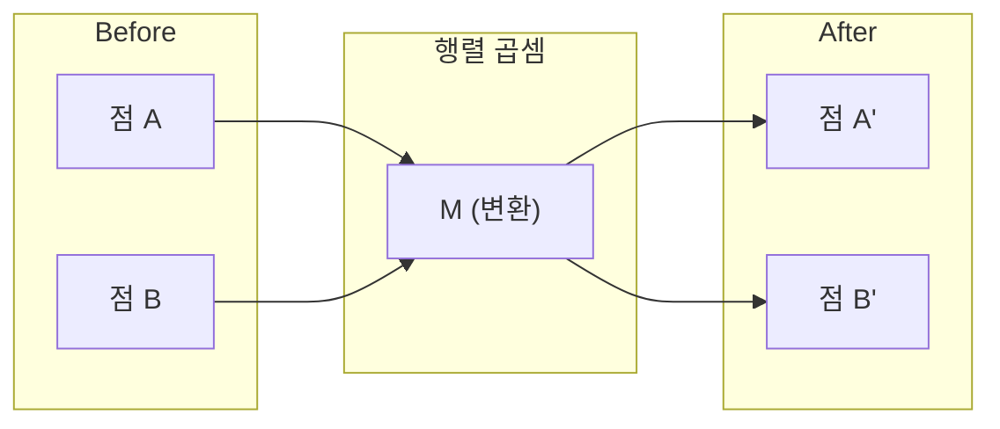
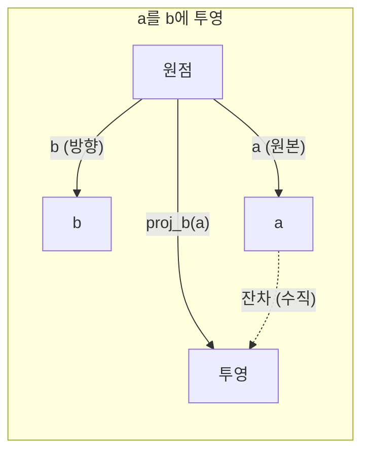

# 선형 대수 직관

> 모든 AI 모델은 단지 멋진 모자를 쓴 행렬 수학일 뿐이다.

**유형:** 학습  
**언어:** Python, Julia  
**선수 지식:** Phase 0  
**소요 시간:** ~60분

## 학습 목표

- Python에서 벡터 및 행렬 연산(덧셈, 내적, 행렬 곱셈)을 직접 구현
- 내적, 투영, 그람-슈미트 과정이 기하학적으로 무엇을 의미하는지 설명
- 행 축소를 사용하여 벡터 집합의 선형 독립성, 계수(rank), 기저(basis) 결정
- 선형 대수 개념을 AI 응용 분야와 연결: 임베딩(embedding), 어텐션 점수(attention scores), LoRA(Low-Rank Adaptation)

## 문제 정의

임의의 ML 논문을 펼쳐보면 첫 페이지 안에 벡터, 행렬, 내적, 변환이 등장합니다. 선형대수학에 대한 직관이 없다면 이들은 단순한 기호에 불과합니다. 하지만 그 직관이 있다면 신경망이 실제로 수행하는 작업—공간 내 점들을 이동시키는 것—을 이해할 수 있습니다.

수학자가 될 필요는 없습니다. 이 연산들이 기하학적으로 어떤 의미를 가지는지 이해한 다음, 직접 코드로 구현할 수 있어야 합니다.

## 개념

### 벡터는 점(및 방향)이다

벡터는 단순히 숫자 목록이다. 하지만 이 숫자들은 의미를 가진다 — 공간에서의 좌표이다.

**2D 벡터 [3, 2]:**

| x | y | 점 |
|---|---|----|
| 3 | 2 | 벡터는 원점 (0,0)에서 평면 상의 (3, 2)를 가리킨다 |

이 벡터의 크기는 sqrt(3^2 + 2^2) = sqrt(13)이며, 오른쪽 위 방향을 가리킨다.

AI에서 벡터는 모든 것을 표현한다:
- 단어 → 768개 숫자로 구성된 벡터(임베딩 공간에서의 "의미")
- 이미지 → 수백만 개의 픽셀 값으로 구성된 벡터
- 사용자 → 선호도 벡터

### 행렬은 변환이다

행렬은 한 벡터를 다른 벡터로 변환한다. 회전, 확대, 축소, 투영 등을 수행할 수 있다.



AI에서 행렬은 모델 그 자체이다:
- 신경망 가중치 → 입력을 출력으로 변환하는 행렬
- 어텐션 점수 → 무엇에 집중할지 결정하는 행렬
- 임베딩 → 단어를 벡터로 매핑하는 행렬

### 내적(Dot Product)은 유사성을 측정한다

두 벡터의 내적은 그들이 얼마나 유사한지 알려준다.

```
a · b = a₁×b₁ + a₂×b₂ + ... + aₙ×bₙ

같은 방향:      a · b > 0  (유사)
수직:           a · b = 0  (무관)
반대 방향:      a · b < 0  (상이)
```

이것이 검색 엔진, 추천 시스템, RAG(Retrieval-Augmented Generation)의 작동 방식이다 — 높은 내적 값을 가진 벡터를 찾는다.

### 선형 독립성(Linear Independence)

벡터 집합에서 어떤 벡터도 다른 벡터들의 조합으로 표현할 수 없다면, 그 벡터들은 선형 독립이다. v1, v2, v3가 독립적이라면 3D 공간을 생성한다. 만약 하나가 다른 벡터들의 조합이라면, 그들은 평면만을 생성한다.

AI에서 중요한 이유: 특성 행렬은 선형 독립인 열을 가져야 한다. 두 특성이 완벽히 상관되어 있다면(선형 종속), 모델은 그 효과를 구분할 수 없다. 이는 회귀에서 다중공선성(multicollinearity)을 유발한다 — 가중치 행렬이 불안정해지고, 작은 입력 변화가 큰 출력 변동을 일으킨다.

**구체적 예시:**

```
v1 = [1, 0, 0]
v2 = [0, 1, 0]
v3 = [2, 1, 0]   # v3 = 2*v1 + v2
```

v1과 v2는 독립적이다 — 서로 스칼라 배수나 조합이 아니다. 하지만 v3 = 2*v1 + v2이므로 {v1, v2, v3}는 종속 집합이다. 이 세 벡터는 모두 xy-평면에 있다. 어떤 조합으로든 [0, 0, 1]에 도달할 수 없다. 세 벡터가 있지만 자유도는 2차원이다.

데이터셋에서: feature_3 = 2*feature_1 + feature_2라면, feature_3를 추가해도 모델에는 새로운 정보가 없다. 더 나쁜 것은 정규 방정식(normal equations)이 특이 행렬(singular)이 되어 — 가중치에 대한 유일한 해가 존재하지 않는다.

### 기저(Basis)와 계수(Rank)

기저는 전체 공간을 생성하는 최소한의 선형 독립 벡터 집합이다. 기저 벡터의 수는 공간의 차원이다.

3D 공간의 표준 기저는 {[1,0,0], [0,1,0], [0,0,1]}이다. 하지만 3D에서 어떤 세 독립 벡터도 유효한 기저가 된다. 기저 선택은 좌표계 선택이다.

행렬의 계수(rank) = 선형 독립인 열의 수 = 선형 독립인 행의 수. 만약 계수 < min(행, 열)이면 행렬은 계수 부족(rank-deficient)이다. 이는 다음을 의미한다:
- 시스템에 무한히 많은 해(또는 해 없음)가 존재
- 변환에서 정보가 손실됨
- 행렬을 역행렬로 만들 수 없음

| 상황 | 계수 | ML에서의 의미 |
|-----------|------|---------------------|
| 완전 계수 (계수 = min(m, n)) | 최대 가능 | 유일한 최소제곱 해가 존재. 모델이 잘 조건화됨. |
| 계수 부족 (계수 < min(m, n)) | 최대 미만 | 특성들이 중복됨. 무한히 많은 가중치 해 존재. 정규화 필요. |
| 계수 1 | 1 | 모든 열이 한 벡터의 스케일링된 복사본. 모든 데이터가 직선 상에 있음. |
| 거의 계수 부족 (작은 특이값) | 수치적으로 낮음 | 행렬이 불안정함. 작은 입력 노이즈가 큰 출력 변화를 일으킴. SVD 절단 또는 릿지 회귀 사용. |

### 투영(Projection)

벡터 **a**를 벡터 **b**에 투영하면 **a**의 **b** 방향 성분을 얻는다:

```
proj_b(a) = (a dot b / b dot b) * b
```

잔차(a - proj_b(a))는 **b**와 수직이다. 이 직교 분해는 최소제곱 적합(least-squares fitting)의 기초이다.

투영은 ML 전반에 사용된다:
- 선형 회귀는 관측값과 열 공간 사이의 거리를 최소화 — 해는 투영 그 자체
- PCA는 데이터를 최대 분산 방향으로 투영
- 트랜스포머의 어텐션은 쿼리를 키에 투영하여 계산



**예시:** a = [3, 4], b = [1, 0]

proj_b(a) = (3*1 + 4*0) / (1*1 + 0*0) * [1, 0] = 3 * [1, 0] = [3, 0]

투영은 y-성분을 버린다. 이는 가장 단순한 형태의 차원 축소 — 관심 없는 방향을 버린다.

### 그람-슈미트 과정(Gram-Schmidt Process)

어떤 독립 벡터 집합을 직교 정규 기저(orthonormal basis)로 변환한다. 직교 정규는 모든 벡터의 길이가 1이고 모든 쌍이 수직임을 의미한다.

알고리즘:
1. 첫 번째 벡터를 정규화
2. 두 번째 벡터에서 첫 번째 벡터에 대한 투영을 빼고 정규화
3. 세 번째 벡터에서 이전 모든 벡터에 대한 투영을 빼고 정규화
4. 남은 벡터에 대해 반복

```
입력:  v1, v2, v3, ... (선형 독립)

u1 = v1 / |v1|

w2 = v2 - (v2 dot u1) * u1
u2 = w2 / |w2|

w3 = v3 - (v3 dot u1) * u1 - (v3 dot u2) * u2
u3 = w3 / |w3|

출력: u1, u2, u3, ... (직교 정규 기저)
```

이것이 QR 분해(QR decomposition)의 내부 작동 방식이다. Q는 직교 정규 기저이고, R은 투영 계수를 담는다. QR 분해는 다음에 사용된다:
- 선형 시스템 해결 (가우스 소거법보다 안정적)
- 고유값 계산 (QR 알고리즘)
- 최소제곱 회귀 (표준 수치 방법)

## 직접 만들어 보기

### 1단계: 벡터 구현 (Python)

```python
class Vector:
    def __init__(self, components):
        self.components = list(components)
        self.dim = len(self.components)

    def __add__(self, other):
        return Vector([a + b for a, b in zip(self.components, other.components)])

    def __sub__(self, other):
        return Vector([a - b for a, b in zip(self.components, other.components)])

    def dot(self, other):
        return sum(a * b for a, b in zip(self.components, other.components))

    def magnitude(self):
        return sum(x**2 for x in self.components) ** 0.5

    def normalize(self):
        mag = self.magnitude()
        return Vector([x / mag for x in self.components])

    def cosine_similarity(self, other):
        return self.dot(other) / (self.magnitude() * other.magnitude())

    def __repr__(self):
        return f"Vector({self.components})"


a = Vector([1, 2, 3])
b = Vector([4, 5, 6])

print(f"a + b = {a + b}")
print(f"a · b = {a.dot(b)}")
print(f"|a| = {a.magnitude():.4f}")
print(f"코사인 유사도 = {a.cosine_similarity(b):.4f}")
```

### 2단계: 행렬 구현 (Python)

```python
class Matrix:
    def __init__(self, rows):
        self.rows = [list(row) for row in rows]
        self.shape = (len(self.rows), len(self.rows[0]))

    def __matmul__(self, other):
        if isinstance(other, Vector):
            return Vector([
                sum(self.rows[i][j] * other.components[j] for j in range(self.shape[1]))
                for i in range(self.shape[0])
            ])
        rows = []
        for i in range(self.shape[0]):
            row = []
            for j in range(other.shape[1]):
                row.append(sum(
                    self.rows[i][k] * other.rows[k][j]
                    for k in range(self.shape[1])
                ))
            rows.append(row)
        return Matrix(rows)

    def transpose(self):
        return Matrix([
            [self.rows[j][i] for j in range(self.shape[0])]
            for i in range(self.shape[1])
        ])

    def __repr__(self):
        return f"Matrix({self.rows})"


rotation_90 = Matrix([[0, -1], [1, 0]])
point = Vector([3, 1])

rotated = rotation_90 @ point
print(f"원본: {point}")
print(f"90° 회전: {rotated}")
```

### 3단계: AI에 중요한 이유

```python
import random

random.seed(42)
weights = Matrix([[random.gauss(0, 0.1) for _ in range(3)] for _ in range(2)])
input_vector = Vector([1.0, 0.5, -0.3])

output = weights @ input_vector
print(f"입력 (3D): {input_vector}")
print(f"출력 (2D): {output}")
print("이것이 신경망 레이어의 동작 원리입니다 -- 행렬 곱셈.")
```

### 4단계: Julia 버전

```julia
a = [1.0, 2.0, 3.0]
b = [4.0, 5.0, 6.0]

println("a + b = ", a + b)
println("a · b = ", a ⋅ b)       # Julia는 유니코드 연산자 지원
println("|a| = ", √(a ⋅ a))
println("코사인 = ", (a ⋅ b) / (√(a ⋅ a) * √(b ⋅ b)))

# 행렬-벡터 곱셈
W = [0.1 -0.2 0.3; 0.4 0.5 -0.1]
x = [1.0, 0.5, -0.3]
println("Wx = ", W * x)
println("이것이 신경망 레이어입니다.")
```

### 5단계: 선형 독립성과 투영 구현 (Python)

```python
def is_linearly_independent(vectors):
    n = len(vectors)
    dim = len(vectors[0].components)
    mat = Matrix([v.components[:] for v in vectors])
    rows = [row[:] for row in mat.rows]
    rank = 0
    for col in range(dim):
        pivot = None
        for row in range(rank, len(rows)):
            if abs(rows[row][col]) > 1e-10:
                pivot = row
                break
        if pivot is None:
            continue
        rows[rank], rows[pivot] = rows[pivot], rows[rank]
        scale = rows[rank][col]
        rows[rank] = [x / scale for x in rows[rank]]
        for row in range(len(rows)):
            if row != rank and abs(rows[row][col]) > 1e-10:
                factor = rows[row][col]
                rows[row] = [rows[row][j] - factor * rows[rank][j] for j in range(dim)]
        rank += 1
    return rank == n


def project(a, b):
    scalar = a.dot(b) / b.dot(b)
    return Vector([scalar * x for x in b.components])


def gram_schmidt(vectors):
    orthonormal = []
    for v in vectors:
        w = v
        for u in orthonormal:
            proj = project(w, u)
            w = w - proj
        if w.magnitude() < 1e-10:
            continue
        orthonormal.append(w.normalize())
    return orthonormal


v1 = Vector([1, 0, 0])
v2 = Vector([1, 1, 0])
v3 = Vector([1, 1, 1])
basis = gram_schmidt([v1, v2, v3])
for i, u in enumerate(basis):
    print(f"u{i+1} = {u}")
    print(f"  |u{i+1}| = {u.magnitude():.6f}")

print(f"u1 · u2 = {basis[0].dot(basis[1]):.6f}")
print(f"u1 · u3 = {basis[0].dot(basis[2]):.6f}")
print(f"u2 · u3 = {basis[1].dot(basis[2]):.6f}")
```

## 사용 방법

이제 NumPy로 동일한 작업을 수행하는 방법을 살펴보겠습니다. 실제로 자주 사용하게 될 내용입니다:

```python
import numpy as np

a = np.array([1, 2, 3], dtype=float)
b = np.array([4, 5, 6], dtype=float)

print(f"a + b = {a + b}")
print(f"a · b = {np.dot(a, b)}")
print(f"|a| = {np.linalg.norm(a):.4f}")
print(f"cosine = {np.dot(a, b) / (np.linalg.norm(a) * np.linalg.norm(b)):.4f}")

W = np.random.randn(2, 3) * 0.1
x = np.array([1.0, 0.5, -0.3])
print(f"Wx = {W @ x}")
```

### 계수, 투영, QR 분해 with NumPy

```python
import numpy as np

A = np.array([[1, 2], [2, 4]])
print(f"Rank: {np.linalg.matrix_rank(A)}")

a = np.array([3, 4])
b = np.array([1, 0])
proj = (np.dot(a, b) / np.dot(b, b)) * b
print(f"{a}를 {b}에 투영한 결과: {proj}")

Q, R = np.linalg.qr(np.random.randn(3, 3))
print(f"Q는 직교 행렬: {np.allclose(Q @ Q.T, np.eye(3))}")
print(f"R은 상삼각 행렬: {np.allclose(R, np.triu(R))}")
```

### PyTorch -- 텐서는 자동 미분이 가능한 벡터

```python
import torch

x = torch.randn(3, requires_grad=True)
y = torch.tensor([1.0, 0.0, 0.0])

similarity = torch.dot(x, y)
similarity.backward()

print(f"x = {x.data}")
print(f"y = {y.data}")
print(f"내적 = {similarity.item():.4f}")
print(f"d(내적)/dx = {x.grad}")
```

x에 대한 내적(dot product)의 그래디언트는 단순히 y입니다. PyTorch는 이를 자동으로 계산했습니다. 신경망의 모든 연산은 행렬 곱셈, 내적, 투영과 같은 연산들로 구성되며, 자동 미분(autodiff)은 이 모든 과정을 통해 그래디언트를 추적합니다.

방금 NumPy가 한 줄로 처리하는 것을 직접 구현해보았습니다. 이제 내부 동작 원리를 알게 되었습니다.

## Ship It

이 레슨은 다음을 생성합니다:
- `outputs/prompt-linear-algebra-tutor.md` -- 기하학적 직관을 통해 선형 대수를 가르치는 AI 어시스턴트용 프롬프트

## 연결 관계

이 수업의 모든 내용은 현대 AI의 특정 부분과 연결됩니다:

| 개념 | 적용 분야 |
|---------|------------------|
| 내적(dot product) | 트랜스포머의 어텐션 점수(attention scores), RAG의 코사인 유사도(cosine similarity) |
| 행렬 곱셈(matrix multiply) | 모든 신경망 레이어, 모든 선형 변환(linear transformation) |
| 선형 독립성(linear independence) | 특징 선택(feature selection), 다중공선성(multicollinearity) 회피 |
| 계수(rank) | 시스템 해결 가능성 판단, LoRA(low-rank adaptation) |
| 투영(projection) | 선형 회귀(linear regression, 열 공간(column space)으로의 투영), PCA |
| 그람-슈미트/QR | 수치 해법(numerical solvers), 고유값(eigenvalue) 계산 |
| 직교 정규 기저(orthonormal basis) | 안정적인 수치 계산, 화이트닝 변환(whitening transforms) |

LoRA는 특별히 언급할 필요가 있습니다. 이는 가중치 업데이트를 저계수 행렬(low-rank matrices)로 분해하여 대형 언어 모델을 파인튜닝(fine-tuning)합니다. 4096x4096 가중치 행렬(16M 파라미터)을 업데이트하는 대신, LoRA는 4096x16 및 16x4096 크기의 두 행렬(131K 파라미터)을 업데이트합니다. 계수-16 제약은 LoRA가 가중치 업데이트가 전체 4096차원 공간의 16차원 부분공간에 존재한다고 가정함을 의미합니다. 이것이 바로 선형대수가 실제 작업을 수행하는 사례입니다.

## 연습 문제

1. 두 벡터 사이의 각도(도 단위)를 반환하는 `Vector.angle_between(other)`를 구현하세요  
2. x-좌표를 2배, y-좌표를 3배 확대하는 2D 스케일링 행렬을 생성한 후, 벡터 [1, 1]에 적용하세요  
3. 50차원의 무작위 단어 유사 벡터 5개가 주어졌을 때, 코사인 유사도를 이용해 가장 유사한 두 벡터를 찾으세요  
4. 그람-슈미트(gram-schmidt) 과정이 생성한 벡터들이 정말 직교 정규(orthonormal)인지 확인하세요: 모든 쌍의 점곱(dot product)이 0이고, 모든 벡터의 크기(magnitude)가 1인지 검증하세요  
5. 계수(rank)가 2인 3x3 행렬을 생성하세요. `rank()` 메서드로 검증한 후, 열(column)들이 어떤 기하학적 객체를 생성하는지 설명하세요  
6. 벡터 [1, 2, 3]을 [1, 1, 1] 위에 투영(projection)하세요. 결과가 기하학적으로 무엇을 의미하는지 설명하세요

## 주요 용어

| 용어 | 사람들이 말하는 것 | 실제 의미 |
|------|----------------|----------------------|
| 벡터(Vector) | "화살표" | n차원 공간에서 점이나 방향을 나타내는 숫자 목록 |
| 행렬(Matrix) | "숫자로 이루어진 표" | 한 공간의 벡터를 다른 공간으로 매핑하는 변환 |
| 내적(Dot product) | "곱하고 더하기" | 두 벡터가 얼마나 정렬되어 있는지 측정하는 값 — 유사도 검색의 핵심 |
| 임베딩(Embedding) | "어떤 AI 마법" | 단어, 이미지, 사용자 등의 의미를 나타내는 벡터 |
| 선형 독립성(Linear independence) | "겹치지 않음" | 집합 내 어떤 벡터도 다른 벡터들의 조합으로 표현할 수 없음 |
| 랭크(Rank) | "차원 수" | 행렬에서 선형 독립인 열(또는 행)의 개수 |
| 투영(Projection) | "그림자" | 한 벡터의 다른 벡터 방향으로의 성분 |
| 기저(Basis) | "좌표축" | 공간을 생성하는 최소한의 독립 벡터 집합 |
| 직교 정규(Orthonormal) | "수직인 단위 벡터" | 서로 수직이며 각각 길이가 1인 벡터들 |