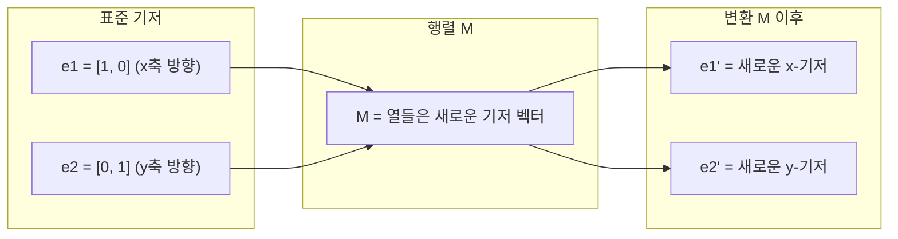
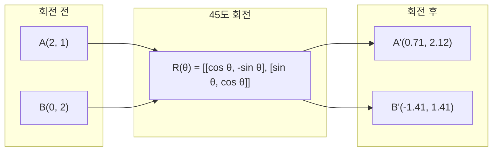
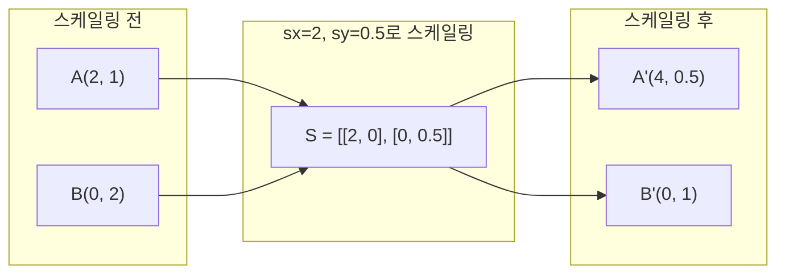
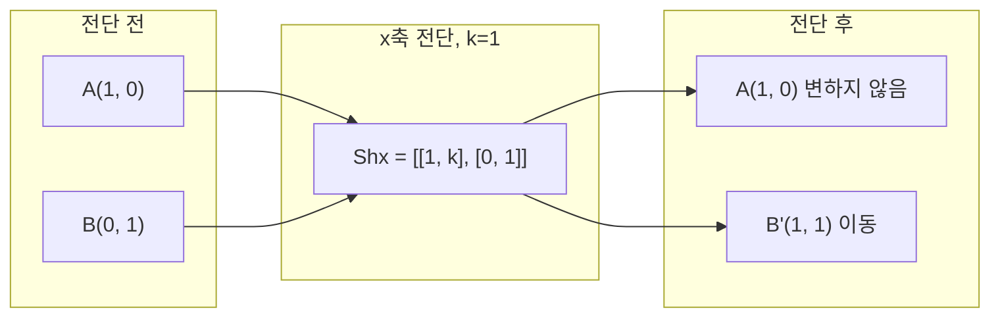
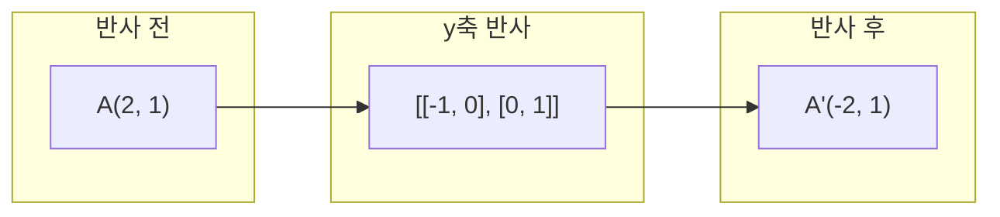
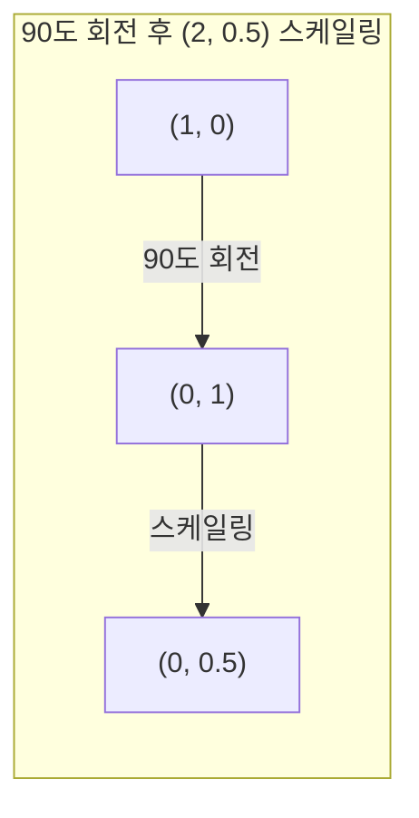
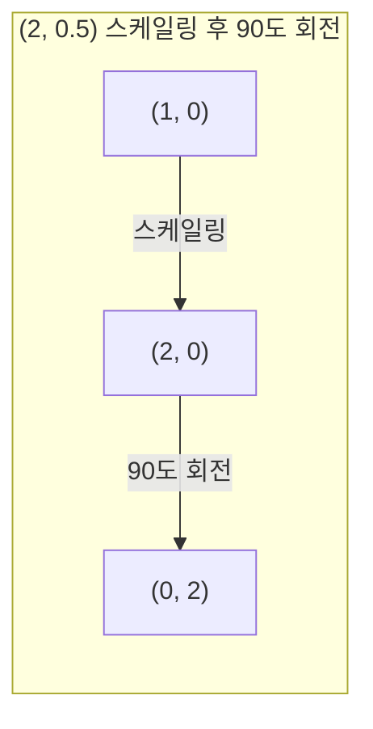

# 행렬 변환(Matrix Transformations)

> 행렬은 공간을 재구성하는 기계입니다. 모든 점에 어떤 작용을 하는지 이해하면 전체 변환을 파악할 수 있습니다.

**유형:** 빌드(Build)  
**언어:** Python, Julia  
**선수 지식:** 1단계, 레슨 01-02 (선형 대수 직관, 벡터 & 행렬 연산)  
**소요 시간:** ~75분

## 학습 목표

- 2D 및 3D 점에 회전(rotation), 스케일링(scaling), 전단(shearing), 반사(reflection) 행렬을 구성하고 적용
- 행렬 곱셈을 통해 여러 변환을 조합하고 순서가 중요함을 확인
- 특성 방정식(characteristic equation)으로부터 2×2 행렬의 고유값(eigenvalues)과 고유벡터(eigenvectors) 계산
- 고유값이 PCA(주성분 분석) 방향, RNN(순환 신경망) 안정성, 스펙트럴 클러스터링(spectral clustering) 동작을 결정하는 이유 설명

## 문제 정의

PCA에 대해 읽다가 "공분산 행렬의 고유벡터를 찾아라"라는 설명을 접합니다. 모델 안정성에서는 "모든 고유값의 크기가 1보다 작은지 확인하라"는 내용을 봅니다. 데이터 증강에서는 "무작위 회전을 적용하라"는 설명을 마주칩니다. 이 모든 내용은 행렬이 공간에 기하학적으로 어떤 영향을 미치는지 이해하기 전까지는 의미가 잘 통하지 않습니다.

행렬은 단순한 숫자 격자가 아닙니다. 행렬은 공간을 변형하는 기계입니다. 회전 행렬은 점을 회전시키고, 스케일링 행렬은 점을 늘이거나 줄입니다. 전단 행렬은 점을 기울입니다. 신경망이 데이터에 적용하는 모든 변환은 이러한 연산 중 하나이거나 여러 연산의 조합입니다. 이 강의에서는 이러한 연산들을 구체적으로 다룹니다.

## 개념

### 행렬로서의 변환

2D에서 모든 선형 변환은 2x2 행렬로 표현할 수 있습니다. 행렬은 기저 벡터 [1, 0]과 [0, 1]이 어디로 이동하는지를 정확히 알려줍니다. 나머지는 이 정보를 바탕으로 따라옵니다.



### 회전

2D에서 각도 θ만큼 회전하면 거리와 각도가 보존됩니다. 모든 점이 원호를 따라 이동합니다.



3D에서는 축을 중심으로 회전합니다. 각 축마다 고유한 회전 행렬이 있습니다:

```
Rz(theta) = | cos  -sin  0 |     z축 회전
            | sin   cos  0 |     (x-y 평면 회전, z축 고정)
            |  0     0   1 |

Rx(theta) = | 1   0     0    |   x축 회전
            | 0  cos  -sin   |   (y-z 평면 회전, x축 고정)
            | 0  sin   cos   |

Ry(theta) = |  cos  0  sin |     y축 회전
            |   0   1   0  |     (x-z 평면 회전, y축 고정)
            | -sin  0  cos |
```

### 스케일링

스케일링은 각 축을 따라 독립적으로 늘리거나 줄입니다.



### 전단(Shearing)

전단은 한 축을 기울이면서 다른 축은 고정합니다. 직사각형을 평행사변형으로 바꿉니다.



전단 행렬:
- `Shx = [[1, k], [0, 1]]`는 x를 k * y만큼 이동
- `Shy = [[1, 0], [k, 1]]`는 y를 k * x만큼 이동

### 반사(Reflection)

반사는 점이나 도형을 축이나 선에 대해 대칭 이동합니다.



반사 행렬:
- y축 반사: `[[-1, 0], [0, 1]]`
- x축 반사: `[[1, 0], [0, -1]]`

### 합성: 변환 연결

변환 A를 적용한 후 B를 적용하는 것은 행렬 곱셈 `result = B @ A @ point`과 같습니다. 순서가 중요합니다. 회전 후 스케일링은 스케일 후 회전과 다른 결과를 줍니다.



합성: `S @ R = [[0, -2], [0.5, 0]]`



합성: `R @ S = [[0, -0.5], [2, 0]]`

다른 결과가 나옵니다. 행렬 곱셈은 교환 법칙이 성립하지 않습니다.

### 고유값과 고유벡터

대부분의 벡터는 행렬이 적용되면 방향이 바뀝니다. 고유벡터는 특별합니다. 행렬이 이 벡터에 적용되면 방향만 바뀌고 크기는 변하지 않습니다. 이 크기 변화 비율이 고유값입니다.

```
A @ v = lambda * v

v는 고유벡터 (보존되는 방향)
lambda는 고유값 (얼마나 늘어나는지)

예시: A = | 2  1 |
             | 1  2 |

고유벡터 [1, 1]에 고유값 3:
  A @ [1,1] = [3, 3] = 3 * [1, 1]     (방향 유지, 3배 확대)

고유벡터 [1, -1]에 고유값 1:
  A @ [1,-1] = [1, -1] = 1 * [1, -1]  (방향 유지, 변화 없음)
```

이 행렬은 [1, 1] 방향으로 3배 늘리고 [1, -1] 방향은 그대로 유지합니다. 다른 모든 방향은 이 두 방향의 혼합입니다.

### 고유분해(Eigendecomposition)

행렬이 n개의 선형 독립 고유벡터를 가지면 다음과 같이 분해할 수 있습니다:

```
A = V @ D @ V^(-1)

V = 열들이 고유벡터인 행렬
D = 고유값들의 대각 행렬
V^(-1) = V의 역행렬

이는 고유벡터 좌표계로 회전 → 각 축 스케일링 → 다시 원래 좌표계로 회전한다는 의미입니다.
```

### 고유값이 중요한 이유

**PCA.** 공분산 행렬의 고유벡터는 주성분입니다. 고유값은 각 성분이 설명하는 분산을 나타냅니다. 고유값 순으로 정렬하고 상위 k개를 선택하면 차원 축소가 됩니다.

**안정성.** 순환 신경망과 동역학 시스템에서 고유값의 크기가 1보다 크면 출력이 폭발합니다. 1보다 작으면 사라집니다. 이것이 바로 소실/폭발 기울기 문제입니다.

**스펙트럼 방법.** 그래프 신경망은 인접 행렬의 고유값을 사용합니다. 스펙트럼 클러스터링은 라플라시안 행렬의 고유값을 사용합니다. 고유벡터는 그래프의 구조를 드러냅니다.

### 행렬식(Determinant): 부피 확대 인자

변환 행렬의 행렬식은 면적(2D)이나 부피(3D)가 얼마나 확대되는지를 나타냅니다.

```
det = 1:   면적 보존 (회전)
det = 2:   면적 2배
det = 0:   공간을 낮은 차원으로 압축 (특이 행렬)
det = -1:  면적 보존 but 방향 반전 (반사)

| det(Rotation) | = 1        (항상)
| det(Scale sx, sy) | = sx * sy
| det(Shear) | = 1           (면적 보존)
| det(Reflection) | = -1     (방향 반전)
```

## 구축 방법

### 1단계: 기본 변환 행렬 (Python)

```python
import math

def rotation_2d(theta):
    c, s = math.cos(theta), math.sin(theta)
    return [[c, -s], [s, c]]

def scaling_2d(sx, sy):
    return [[sx, 0], [0, sy]]

def shearing_2d(kx, ky):
    return [[1, kx], [ky, 1]]

def reflection_x():
    return [[1, 0], [0, -1]]

def reflection_y():
    return [[-1, 0], [0, 1]]

def mat_vec_mul(matrix, vector):
    return [
        sum(matrix[i][j] * vector[j] for j in range(len(vector)))
        for i in range(len(matrix))
    ]

def mat_mul(a, b):
    rows_a, cols_b = len(a), len(b[0])
    cols_a = len(a[0])
    return [
        [sum(a[i][k] * b[k][j] for k in range(cols_a)) for j in range(cols_b)]
        for i in range(rows_a)
    ]

point = [1.0, 0.0]
angle = math.pi / 4

rotated = mat_vec_mul(rotation_2d(angle), point)
print(f"45도 회전 (1,0): ({rotated[0]:.4f}, {rotated[1]:.4f})")

scaled = mat_vec_mul(scaling_2d(2, 3), [1.0, 1.0])
print(f"(1,1)을 (2,3)으로 확대: ({scaled[0]:.1f}, {scaled[1]:.1f})")

sheared = mat_vec_mul(shearing_2d(1, 0), [1.0, 1.0])
print(f"kx=1로 전단 (1,1): ({sheared[0]:.1f}, {sheared[1]:.1f})")

reflected = mat_vec_mul(reflection_y(), [2.0, 1.0])
print(f"y축 기준 반사 (2,1): ({reflected[0]:.1f}, {reflected[1]:.1f})")
```

### 2단계: 변환의 조합

```python
R = rotation_2d(math.pi / 2)
S = scaling_2d(2, 0.5)

rotate_then_scale = mat_mul(S, R)
scale_then_rotate = mat_mul(R, S)

point = [1.0, 0.0]
result1 = mat_vec_mul(rotate_then_scale, point)
result2 = mat_vec_mul(scale_then_rotate, point)

print(f"90도 회전 후 확대: ({result1[0]:.2f}, {result1[1]:.2f})")
print(f"확대 후 90도 회전: ({result2[0]:.2f}, {result2[1]:.2f})")
print(f"동일한가? {result1 == result2}")
```

### 3단계: 2x2 행렬의 고유값 계산

2x2 행렬 `[[a, b], [c, d]]`의 고유값은 특성 방정식 `lambda^2 - (a+d)*lambda + (ad - bc) = 0`을 풀어 구합니다.

```python
def eigenvalues_2x2(matrix):
    a, b = matrix[0]
    c, d = matrix[1]
    trace = a + d
    det = a * d - b * c
    discriminant = trace ** 2 - 4 * det
    if discriminant < 0:
        real = trace / 2
        imag = (-discriminant) ** 0.5 / 2
        return (complex(real, imag), complex(real, -imag))
    sqrt_disc = discriminant ** 0.5
    return ((trace + sqrt_disc) / 2, (trace - sqrt_disc) / 2)

def eigenvector_2x2(matrix, eigenvalue):
    a, b = matrix[0]
    c, d = matrix[1]
    if abs(b) > 1e-10:
        v = [b, eigenvalue - a]
    elif abs(c) > 1e-10:
        v = [eigenvalue - d, c]
    else:
        if abs(a - eigenvalue) < 1e-10:
            v = [1, 0]
        else:
            v = [0, 1]
    mag = (v[0] ** 2 + v[1] ** 2) ** 0.5
    return [v[0] / mag, v[1] / mag]

A = [[2, 1], [1, 2]]
vals = eigenvalues_2x2(A)
print(f"행렬: {A}")
print(f"고유값: {vals[0]:.4f}, {vals[1]:.4f}")

for val in vals:
    vec = eigenvector_2x2(A, val)
    result = mat_vec_mul(A, vec)
    scaled = [val * vec[0], val * vec[1]]
    print(f"  lambda={val:.1f}, v={[round(x,4) for x in vec]}")
    print(f"    A@v = {[round(x,4) for x in result]}")
    print(f"    l*v = {[round(x,4) for x in scaled]}")
```

### 4단계: 행렬식(volume scaling factor)

```python
def det_2x2(matrix):
    return matrix[0][0] * matrix[1][1] - matrix[0][1] * matrix[1][0]

print(f"det(45도 회전) = {det_2x2(rotation_2d(math.pi/4)):.4f}")
print(f"det(2,3 확대)   = {det_2x2(scaling_2d(2, 3)):.1f}")
print(f"det(kx=1 전단)  = {det_2x2(shearing_2d(1, 0)):.1f}")
print(f"det(y축 반사)   = {det_2x2(reflection_y()):.1f}")

singular = [[1, 2], [2, 4]]
print(f"det(특이 행렬)     = {det_2x2(singular):.1f}")
print("특이 행렬: 열들이 비례하므로 공간이 선으로 축소됩니다.")
```

## 사용 방법

NumPy는 최적화된 루틴으로 이 모든 작업을 처리합니다.

```python
import numpy as np

theta = np.pi / 4
R = np.array([[np.cos(theta), -np.sin(theta)],
              [np.sin(theta),  np.cos(theta)]])

point = np.array([1.0, 0.0])
print(f"(1,0)을 45도 회전: {R @ point}")

S = np.diag([2.0, 3.0])
composed = S @ R
print(f"회전(45) 후 스케일(2,3): {composed @ point}")

A = np.array([[2, 1], [1, 2]], dtype=float)
eigenvalues, eigenvectors = np.linalg.eig(A)
print(f"\n고유값: {eigenvalues}")
print(f"고유벡터(열):\n{eigenvectors}")

for i in range(len(eigenvalues)):
    v = eigenvectors[:, i]
    lam = eigenvalues[i]
    print(f"  A @ v{i} = {A @ v}, lambda * v{i} = {lam * v}")

print(f"\ndet(R) = {np.linalg.det(R):.4f}")
print(f"det(S) = {np.linalg.det(S):.1f}")

B = np.array([[3, 1], [0, 2]], dtype=float)
vals, vecs = np.linalg.eig(B)
D = np.diag(vals)
V = vecs
reconstructed = V @ D @ np.linalg.inv(V)
print(f"\n고유분해 A = V @ D @ V^-1:")
print(f"원본:\n{B}")
print(f"재구성:\n{reconstructed}")
```

### NumPy를 이용한 3D 회전

```python
def rotation_3d_z(theta):
    c, s = np.cos(theta), np.sin(theta)
    return np.array([[c, -s, 0], [s, c, 0], [0, 0, 1]])

def rotation_3d_x(theta):
    c, s = np.cos(theta), np.sin(theta)
    return np.array([[1, 0, 0], [0, c, -s], [0, s, c]])

point_3d = np.array([1.0, 0.0, 0.0])
rotated_z = rotation_3d_z(np.pi / 2) @ point_3d
rotated_x = rotation_3d_x(np.pi / 2) @ point_3d

print(f"\n3D 점: {point_3d}")
print(f"z축 기준 90도 회전: {np.round(rotated_z, 4)}")
print(f"x축 기준 90도 회전: {np.round(rotated_x, 4)}")
```

## Ship It

이 레슨은 PCA(Phase 2)와 신경망 가중치 분석을 위한 기하학적 기초를 구축합니다. 여기서 구축하는 고유값/고유벡터 코드는 차원 축소, 스펙트럴 클러스터링, 프로덕션 ML 시스템의 안정성 분석을 구동하는 동일한 알고리즘입니다.

## 연습 문제

1. 단위 사각형(모서리 좌표 [0,0], [1,0], [1,1], [0,1])에 회전, 스케일링, 전단 변환을 각각 적용하세요. 각 변환 후의 모서리 좌표를 출력하고, 회전 변환이 모서리 간 거리를 보존하는지 확인하세요.

2. 특성 방정식을 사용하여 행렬 [[4, 2], [1, 3]]의 고유값을 직접 계산하세요. 그 후 직접 구현한 함수와 NumPy를 이용해 결과를 검증하세요.

3. 세 가지 변환(30도 회전, [1.5, 0.8] 스케일링, kx=0.3 전단)을 조합하여 원형으로 배치된 8개 점에 적용하세요. 변환 전/후 좌표를 출력하고, 조합된 행렬의 행렬식(determinant)을 계산하여 개별 행렬식들의 곱과 일치하는지 확인하세요.

## 핵심 용어

| 용어 | 사람들이 말하는 표현 | 실제 의미 |
|------|----------------|----------------------|
| 회전 행렬(Rotation matrix) | "물체를 회전시킨다" | 점과 각도 거리를 보존하면서 점들을 원호 따라 이동시키는 직교 행렬. 행렬식(determinant)은 항상 1. |
| 스케일링 행렬(Scaling matrix) | "물체를 확대한다" | 각 축을 따라 독립적으로 늘리거나 줄이는 대각 행렬. 행렬식은 스케일 인자들의 곱. |
| 전단 행렬(Shearing matrix) | "물체를 기울인다" | 한 좌표를 다른 좌표에 비례해 이동시켜 사각형을 평행사변형으로 만드는 행렬. 행렬식은 1. |
| 반사(Reflection) | "거울처럼 뒤집는다" | 축이나 평면을 기준으로 공간을 뒤집는 행렬. 행렬식은 -1. |
| 합성(Composition) | "두 가지 작업을 수행한다" | 변환 행렬들을 곱해 연산을 연결하는 것. 순서가 중요: B @ A는 A를 먼저 적용한 후 B를 적용함을 의미. |
| 고유 벡터(Eigenvector) | "특별한 방향" | 행렬이 회전하지 않고 스케일링만 하는 방향. 변환의 지문(fingerprint). |
| 고유 값(Eigenvalue) | "얼마나 늘어나는지" | 행렬이 고유 벡터를 스케일링하는 스칼라 인자. 음수(뒤집기) 또는 복소수(회전)일 수 있음. |
| 고유 분해(Eigendecomposition) | "행렬을 분해한다" | 행렬을 V @ D @ V^(-1)로 표현하는 것. 기본 스케일링 방향과 크기로 분리. |
| 행렬식(Determinant) | "행렬에서 나온 단일 숫자" | 변환이 면적(2D) 또는 부피(3D)를 스케일링하는 인자. 0이면 변환이 불가역적. |
| 특성 방정식(Characteristic equation) | "고유 값이 나오는 곳" | det(A - lambda * I) = 0. 근이 고유 값인 다항식.

## 추가 자료

- [3Blue1Brown: 선형 변환(Linear Transformations)](https://www.3blue1brown.com/lessons/linear-transformations) -- 행렬이 공간을 재구성하는 방식에 대한 시각적 직관
- [3Blue1Brown: 고유벡터와 고유값(Eigenvectors and Eigenvalues)](https://www.3blue1brown.com/lessons/eigenvalues) -- 고유벡터의 기하학적 의미를 가장 잘 설명한 시각적 자료
- [MIT 18.06 강의 21: 고유값과 고유벡터(Eigenvalues and Eigenvectors)](https://ocw.mit.edu/courses/18-06-linear-algebra-spring-2010/) -- 길버트 스트랭(Gilbert Strang)의 고전적인 강의