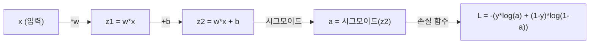
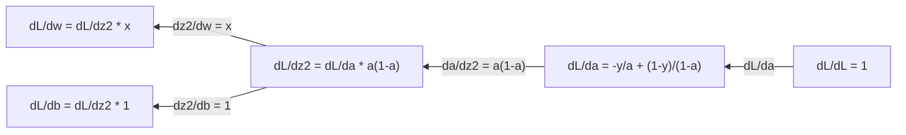
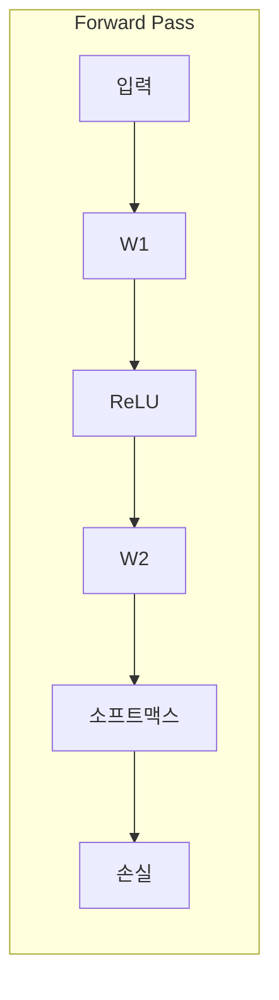
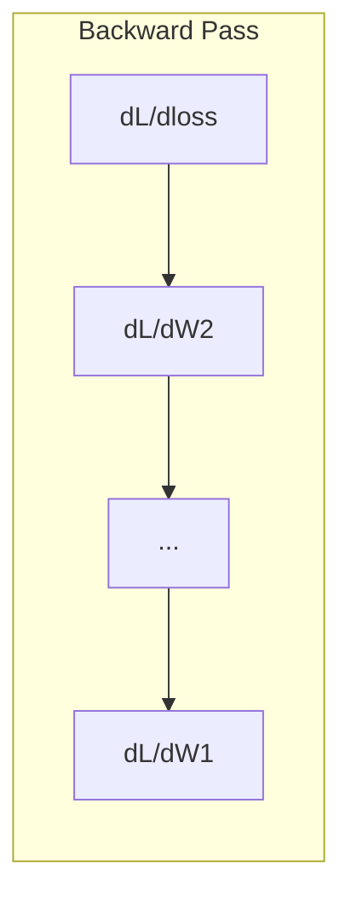

# 머신러닝을 위한 미적분학

> 도함수는 어느 방향이 내리막인지 알려줍니다. 신경망이 학습하는 데 필요한 것은 오직 이것뿐입니다.

**유형:** 학습  
**언어:** Python  
**선수 지식:** 1단계, 레슨 01-03  
**소요 시간:** ~60분

## 학습 목표

- 일반적인 ML 함수(x², 시그모이드, 크로스 엔트로피)에 대한 수치적 및 해석적 미분 계산
- 1D 및 2D에서 손실 함수를 최소화하기 위한 경사 하강법(gradient descent) 직접 구현
- 선형 회귀 모델의 그래디언트(gradient) 유도 및 수동 가중치 업데이트를 통한 모델 훈련
- 헤시안 행렬(Hessian matrix), 테일러 급수(Taylor series) 근사, 그리고 최적화 방법과의 연관성 설명

## 문제 정의

수백만 개의 가중치를 가진 신경망이 있습니다. 각 가중치는 조절 가능한 노브(knob)입니다. 모델을 약간이라도 덜 틀리게 만들기 위해 모든 노브를 어떤 방향으로 돌려야 하는지 알아내야 합니다. 미적분학이 그 방향을 알려줍니다.

미적분학 없이는 신경망 훈련이 무작위 변경을 시도하고 최선을 바라는 것을 의미합니다. 도함수를 사용하면 각 가중치가 오차에 어떻게 영향을 미치는지 정확히 알 수 있습니다. 매번 모든 노브를 올바른 방향으로 돌립니다.

## 개념

### 도함수란?

도함수는 변화율을 측정합니다. 함수 y = f(x)에 대해 도함수 f'(x)는 다음과 같이 알려줍니다: x를 아주 조금 변화시키면 y는 얼마나 변하는가?

기하학적으로 도함수는 한 점에서의 접선의 기울기입니다.

**f(x) = x^2:**

| x | f(x) | f'(x) (기울기) |
|---|------|---------------|
| 0 | 0    | 0 (평평, 최저점) |
| 1 | 1    | 2 |
| 2 | 4    | 4 (이 점에서의 접선 기울기) |
| 3 | 9    | 6 |

x=2에서 기울기는 4입니다. x를 오른쪽으로 아주 조금 이동하면 y는 그 양의 약 4배만큼 증가합니다. x=0에서 기울기는 0입니다. 그릇의 바닥에 있습니다.

공식적인 정의:

```
f'(x) = lim   f(x + h) - f(x)
        h->0  -----------------
                     h
```

코드에서는 극한을 생략하고 매우 작은 h를 사용합니다. 이것이 수치적 도함수입니다.

### 편미분: 한 번에 하나의 변수

실제 함수는 많은 입력을 가집니다. 신경망 손실 함수는 수천 개의 가중치에 의존합니다. 편미분은 하나의 변수를 제외한 모든 변수를 상수로 유지한 후 해당 변수에 대해 미분합니다.

```
f(x, y) = x^2 + 3xy + y^2

df/dx = 2x + 3y     (y를 상수로 취급)
df/dy = 3x + 2y     (x를 상수로 취급)
```

각 편미분은 다음과 같이 답합니다: 이 가중치만 조금 변화시키면 손실은 어떻게 변하는가?

### 그래디언트: 모든 편미분의 벡터

그래디언트는 모든 편미분을 하나의 벡터로 모읍니다. 함수 f(x, y, z)에 대해 그래디언트는 다음과 같습니다:

```
grad f = [ df/dx, df/dy, df/dz ]
```

그래디언트는 가장 가파른 상승 방향을 가리킵니다. 함수를 최소화하려면 반대 방향으로 이동합니다.

**f(x,y) = x^2 + y^2의 등고선 그래프:**

이 함수는 동심원을 등고선으로 하는 그릇 모양을 형성합니다. 최소값은 (0, 0)에 있습니다.

| 점 | grad f | -grad f (하강 방향) |
|-------|--------|----------------------------|
| (1, 1) | [2, 2] (오르막, 최소점에서 멀어짐) | [-2, -2] (내리막, 최소점 방향) |
| (0, 0) | [0, 0] (평평, 최소점) | [0, 0] |

이것이 바로 그래디언트 하강법입니다. 그래디언트를 계산하고, 부호를 바꾼 후 한 걸음 이동합니다.

### 최적화와의 연결

신경망 훈련은 최적화입니다. 손실 함수 L(w1, w2, ..., wn)이 모델의 오차를 측정합니다. 이를 최소화하려고 합니다.

```
그래디언트 하강 업데이트 규칙:

  w_new = w_old - learning_rate * dL/dw

모든 가중치에 대해:
  1. 손실에 대한 해당 가중치의 편미분 계산
  2. 가중치의 작은 배수를 뺌
  3. 반복
```

학습률은 걸음 크기를 제어합니다. 너무 크면 과조정, 너무 작으면 느리게 수렴합니다.

**손실 함수 지형 (1D 단면):**

손실 함수 L(w)는 가중치 w가 변함에 따라 봉우리와 골짜기를 형성합니다.

| 특징 | 설명 |
|---------|-------------|
| 전역 최소값 | 전체 곡선에서 가장 낮은 점 -- 최적 해 |
| 지역 최소값 | 이웃보다 낮지만 전체적으로는 가장 낮지 않은 골짜기 |
| 기울기 | 그래디언트 하강은 어떤 시작점에서든 내리막을 따라감 |

그래디언트 하강은 내리막을 따라갑니다. 지역 최소값에 갇힐 수 있지만, 고차원 공간(수백만 개의 가중치)에서는 실제로 거의 문제가 되지 않습니다.

### 수치적 vs 해석적 도함수

도함수를 계산하는 두 가지 방법이 있습니다.

해석적: 손으로 미적분 규칙을 적용합니다. f(x) = x^2에 대해 도함수는 f'(x) = 2x입니다. 정확하며 빠릅니다.

수치적: 정의를 이용해 근사합니다. f(x+h)와 f(x-h)를 계산한 후 차이를 사용합니다.

```
수치적 (중앙 차분):

f'(x) ~= f(x + h) - f(x - h)
          -----------------------
                  2h

h = 0.0001은 실제로 잘 작동합니다
```

수치적 도함수는 느리지만 모든 함수에 적용 가능합니다. 해석적 도함수는 빠르지만 공식을 유도해야 합니다. 신경망 프레임워크는 세 번째 접근법인 자동 미분을 사용합니다. 이는 정확한 도함수를 기계적으로 계산합니다. 3단계에서 이를 보게 될 것입니다.

### 간단한 함수의 도함수

ML에서 자주 보는 도함수들입니다.

```
함수        도함수       사용처
--------        ----------       -------
f(x) = x^2     f'(x) = 2x      손실 함수 (MSE)
f(x) = wx + b  f'(w) = x        선형 층 (가중치에 대한 그래디언트)
                f'(b) = 1        선형 층 (편향에 대한 그래디언트)
                f'(x) = w        선형 층 (입력에 대한 그래디언트)
f(x) = e^x     f'(x) = e^x     소프트맥스, 어텐션
f(x) = ln(x)   f'(x) = 1/x     크로스엔트로피 손실
f(x) = 1/(1+e^-x)  f'(x) = f(x)(1-f(x))   시그모이드 활성화
```

f(x) = x^2에 대해:

```
f(x) = x^2    f'(x) = 2x

  x    f(x)   f'(x)   의미
  -2    4      -4      기울기가 왼쪽으로 기울어짐 (감소)
  -1    1      -2      기울기가 왼쪽으로 기울어짐 (감소)
   0    0       0      평평 (최소값!)
   1    1       2      기울기가 오른쪽으로 기울어짐 (증가)
   2    4       4      기울기가 오른쪽으로 기울어짐 (증가)
```

f(w) = 3w + 1 (x=3, b=1)에 대해:

```
f(w) = 3w + 1    f'(w) = 3

w에 대한 도함수는 x입니다.
x가 크면 w의 작은 변화가 출력에 큰 변화를 일으킵니다.
```

### 연쇄 법칙

함수가 합성될 때, 연쇄 법칙은 미분 방법을 알려줍니다.

```
y = f(g(x))이면 dy/dx = f'(g(x)) * g'(x)

예: y = (3x + 1)^2
  외부: f(u) = u^2       f'(u) = 2u
  내부: g(x) = 3x + 1    g'(x) = 3
  dy/dx = 2(3x + 1) * 3 = 6(3x + 1)
```

신경망은 함수의 체인입니다: 입력 -> 선형 -> 활성화 -> 선형 -> 활성화 -> 손실. 역전파는 출력에서 입력까지 연쇄 법칙을 반복적으로 적용한 것입니다. 이것이 전체 알고리즘입니다.

### 헤시안 행렬

그래디언트는 기울기를 알려줍니다. 헤시안은 곡률을 알려줍니다.

헤시안은 2차 편미분의 행렬입니다. 함수 f(x1, x2, ..., xn)에 대해 헤시안의 (i, j) 항목은 다음과 같습니다:

```
H[i][j] = d^2f / (dx_i * dx_j)
```

2변수 함수 f(x, y)에 대해:

```
H = | d^2f/dx^2    d^2f/dxdy |
    | d^2f/dydx    d^2f/dy^2 |
```

**임계점(그래디언트 = 0)에서 헤시안이 알려주는 것:**

| 헤시안 성질 | 의미 | 예시 표면 |
|-----------------|---------|-----------------|
| 양의 정부호 (모든 고유값 > 0) | 지역 최소값 | 위로 열린 그릇 |
| 음의 정부호 (모든 고유값 < 0) | 지역 최대값 | 아래로 열린 그릇 |
| 부정부호 (혼합된 고유값) | 안장점 | 말 안장 모양 |

**예시:** f(x, y) = x^2 - y^2 (안장 함수)

```
df/dx = 2x       df/dy = -2y
d^2f/dx^2 = 2    d^2f/dy^2 = -2    d^2f/dxdy = 0

H = | 2   0 |
    | 0  -2 |

고유값: 2와 -2 (하나는 양수, 하나는 음수)
--> (0, 0)에서 안장점
```

f(x, y) = x^2 + y^2 (그릇)과 비교:

```
H = | 2  0 |
    | 0  2 |

고유값: 2와 2 (모두 양수)
--> (0, 0)에서 지역 최소값
```

**헤시안이 ML에서 중요한 이유:**

뉴턴 방법은 헤시안을 사용하여 그래디언트 하강보다 더 나은 최적화 단계를 수행합니다. 단순히 기울기를 따라가는 대신 곡률을 고려합니다:

```
뉴턴 업데이트:    w_new = w_old - H^(-1) * 그래디언트
그래디언트 하강:   w_new = w_old - lr * 그래디언트
```

뉴턴 방법은 헤시안이 그래디언트를 "재조정"하기 때문에 더 빠르게 수렴합니다 -- 가파른 방향은 작은 걸음, 평평한 방향은 큰 걸음.

단점: N개의 매개변수를 가진 신경망의 경우 헤시안은 N x N입니다. 100만 개의 매개변수를 가진 모델은 1조 개의 항목이 필요합니다. 그래서 근사법을 사용합니다.

| 방법 | 사용하는 것 | 비용 | 수렴 속도 |
|--------|-------------|------|-------------|
| 그래디언트 하강 | 1차 도함수만 | O(N) per step | 느림 (선형) |
| 뉴턴 방법 | 전체 헤시안 | O(N^3) per step | 빠름 (2차) |
| L-BFGS | 그래디언트 기록으로부터 헤시안 근사 | O(N) per step | 중간 (초선형) |
| Adam | 매개변수별 적응형 학습률 (대각선 헤시안 근사) | O(N) per step | 중간 |
| 자연 그래디언트 | 피셔 정보 행렬 (통계적 헤시안) | O(N^2) per step | 빠름 |

실제로 Adam은 딥러닝의 기본 옵티마이저입니다. 매개변수별 그래디언트의 이동 평균과 분산을 추적하여 2차 정보를 저렴하게 근사합니다.

### 테일러 급수 근사

모든 매끄러운 함수는 다항식으로 국소적으로 근사할 수 있습니다:

```
f(x + h) = f(x) + f'(x)*h + (1/2)*f''(x)*h^2 + (1/6)*f'''(x)*h^3 + ...
```

더 많은 항을 포함할수록 근사가 좋아지지만, x 근처에서만 유효합니다.

**테일러 급수가 ML에서 중요한 이유:**

- **1차 테일러 = 그래디언트 하강.** f(x + h) ~ f(x) + f'(x)*h를 사용하면 선형 근사를 하는 것입니다. 그래디언트 하강은 이 선형 모델을 최소화하여 h = -lr * f'(x)를 선택합니다.

- **2차 테일러 = 뉴턴 방법.** f(x + h) ~ f(x) + f'(x)*h + (1/2)*f''(x)*h^2를 사용하면 이차 모델을 얻습니다. 이를 최소화하면 h = -f'(x)/f''(x) -- 뉴턴의 걸음이 됩니다.

- **손실 함수 설계.** MSE와 크로스엔트로피는 매끄러워서 테일러 급수가 잘 동작합니다. 이는 우연이 아닙니다. 매끄러운 손실 함수는 최적화를 예측 가능하게 만듭니다.

```
근사 차수    포착하는 것    최적화 방법
-------------------    -----------------   -------------------
0차 (상수)   값만         무작위 탐색
1차 (선형)   기울기       그래디언트 하강
2차 (이차)   곡률         뉴턴 방법
고차         세부 구조     ML에서 거의 사용되지 않음
```

핵심 통찰: 모든 그래디언트 기반 최적화는 손실 함수를 국소적으로 근사하고 그 근사의 최소값으로 이동하는 것입니다.

### ML에서의 적분

도함수는 변화율을 알려줍니다. 적분은 누적량을 계산합니다 -- 곡선 아래의 면적.

ML에서는 적분을 직접 계산하지 않지만, 개념은 어디에나 있습니다:

**확률.** 연속 확률 변수 X에 대해 밀도 p(x)가 있을 때:
```
P(a < X < b) = a에서 b까지 p(x) dx의 적분
```
확률 밀도 곡선 사이의 면적은 해당 범위에 속할 확률입니다.

**기댓값.** 확률에 가중치를 준 평균 결과:
```
E[f(X)] = f(x) * p(x) dx의 적분
```
데이터 분포에 대한 기댓값 손실은 적분입니다. 훈련은 이 적분의 경험적 근사를 최소화합니다.

**KL 발산.** 두 분포가 얼마나 다른지 측정:
```
KL(p || q) = p(x) * log(p(x) / q(x)) dx의 적분
```
VAE, 지식 증류, 베이지안 추론에 사용됩니다.

**정규화 상수.** 베이지안 추론에서:
```
p(w | data) = p(data | w) * p(w) / p(data | w) * p(w) dw의 적분
```
분모는 모든 가능한 매개변수 값에 대한 적분입니다. 종종 계산이 불가능하여 MCMC와 변분 추론 같은 근사법을 사용합니다.

| 적분 개념 | ML에서의 등장 |
|-----------------|----------------------|
| 곡선 아래 면적 | 밀도 함수에서의 확률 |
| 기댓값 | 손실 함수, 위험 최소화 |
| KL 발산 | VAE, 정책 최적화, 증류 |
| 정규화 | 베이지안 사후 분포, 소프트맥스 분모 |
| 주변 우도 | 모델 비교, 증거 하한 (ELBO) |

### 계산 그래프에서의 다변수 연쇄 법칙

연쇄 법칙은 단순히 스칼라 함수에 적용되는 것이 아닙니다. 신경망에서는 변수가 분기하고 합쳐집니다. 간단한 순전파에서 도함수가 어떻게 흐르는지 보겠습니다:



역전파는 오른쪽에서 왼쪽으로 그래디언트를 계산합니다:



각 화살표는 지역 도함수로 곱합니다. 어떤 매개변수에 대한 그래디언트는 손실에서 그 매개변수까지의 모든 경로에 있는 지역 도함수의 곱입니다. 경로가 분기하고 합쳐질 때는 기여도를 합산합니다 (다변수 연쇄 법칙).

이것이 바로 역전파입니다: 계산 그래프를 통해 출력에서 입력까지 체계적으로 연쇄 법칙을 적용하는 것입니다.

### 야코비안 행렬

함수가 벡터를 벡터로 매핑할 때 (신경망 층처럼), 그 도함수는 행렬입니다. 야코비안은 모든 출력의 모든 입력에 대한 편미분을 포함합니다.

f: R^n -> R^m에 대해 야코비안 J는 m x n 행렬입니다:

| | x1 | x2 | ... | xn |
|---|---|---|---|---|
| f1 | df1/dx1 | df1/dx2 | ... | df1/dxn |
| f2 | df2/dx1 | df2/dx2 | ... | df2/dxn |
| ... | ... | ... | ... | ... |
| fm | dfm/dx1 | dfm/dx2 | ... | dfm/dxn |

신경망에 대해 야코비안을 직접 계산하지는 않습니다. PyTorch가 처리합니다. 하지만 야코비안이 존재함을 알면 역전파에서 형태를 이해하는 데 도움이 됩니다: 층이 R^n을 R^m로 매핑하면 야코비안은 m x n입니다. 그래디언트는 이 행렬의 전치를 통해 역방향으로 흐릅니다.

### 신경망에 중요한 이유

신경망의 모든 가중치는 그래디언트를 받습니다. 그래디언트는 손실을 줄이기 위해 해당 가중치를 어떻게 조정해야 하는지 알려줍니다.





각 가중치 업데이트:
- `W1 = W1 - lr * dL/dW1`
- `W2 = W2 - lr * dL/dW2`

순전파는 예측과 손실을 계산합니다. 역전파는 손실에 대한 모든 가중치의 그래디언트를 계산합니다. 그런 다음 모든 가중치는 내리막 방향으로 작은 걸음을 이동합니다. 수백만 번 반복합니다. 이것이 딥러닝입니다.

## 직접 만들어 보기

### 1단계: 처음부터 시작하는 수치 미분

```python
def numerical_derivative(f, x, h=1e-7):
    return (f(x + h) - f(x - h)) / (2 * h)

def f(x):
    return x ** 2

for x in [-2, -1, 0, 1, 2]:
    numerical = numerical_derivative(f, x)
    analytical = 2 * x
    print(f"x={x:2d}  f'(x) numerical={numerical:.6f}  analytical={analytical:.1f}")
```

수치 미분은 해석적 미분과 소수점 여러 자리까지 일치합니다.

### 2단계: 편미분과 기울기

```python
def numerical_gradient(f, point, h=1e-7):
    gradient = []
    for i in range(len(point)):
        point_plus = list(point)
        point_minus = list(point)
        point_plus[i] += h
        point_minus[i] -= h
        partial = (f(point_plus) - f(point_minus)) / (2 * h)
        gradient.append(partial)
    return gradient

def f_multi(point):
    x, y = point
    return x**2 + 3*x*y + y**2

grad = numerical_gradient(f_multi, [1.0, 2.0])
print(f"Numerical gradient at (1,2): {[f'{g:.4f}' for g in grad]}")
print(f"Analytical gradient at (1,2): [2*1+3*2, 3*1+2*2] = [{2*1+3*2}, {3*1+2*2}]")
```

### 3단계: f(x) = x²의 최소값 찾기 위한 경사 하강법

```python
x = 5.0
lr = 0.1
for step in range(20):
    grad = 2 * x
    x = x - lr * grad
    print(f"step {step:2d}  x={x:8.4f}  f(x)={x**2:10.6f}")
```

x=5에서 시작하여 각 단계마다 x=0(최소값)에 가까워집니다.

### 4단계: 2D 함수에 대한 경사 하강법

```python
def f_2d(point):
    x, y = point
    return x**2 + y**2

point = [4.0, 3.0]
lr = 0.1
for step in range(30):
    grad = numerical_gradient(f_2d, point)
    point = [p - lr * g for p, g in zip(point, grad)]
    loss = f_2d(point)
    if step % 5 == 0 or step == 29:
        print(f"step {step:2d}  point=({point[0]:7.4f}, {point[1]:7.4f})  f={loss:.6f}")
```

### 5단계: 수치 미분과 해석적 미분 비교

```python
import math

test_functions = [
    ("x^2",      lambda x: x**2,          lambda x: 2*x),
    ("x^3",      lambda x: x**3,          lambda x: 3*x**2),
    ("sin(x)",   lambda x: math.sin(x),   lambda x: math.cos(x)),
    ("e^x",      lambda x: math.exp(x),   lambda x: math.exp(x)),
    ("1/x",      lambda x: 1/x,           lambda x: -1/x**2),
]

x = 2.0
print(f"{'Function':<12} {'Numerical':>12} {'Analytical':>12} {'Error':>12}")
print("-" * 50)
for name, f, df in test_functions:
    num = numerical_derivative(f, x)
    ana = df(x)
    err = abs(num - ana)
    print(f"{name:<12} {num:12.6f} {ana:12.6f} {err:12.2e}")
```

### 6단계: 헤시안 행렬 수치 계산

```python
def hessian_2d(f, x, y, h=1e-5):
    fxx = (f(x + h, y) - 2 * f(x, y) + f(x - h, y)) / (h ** 2)
    fyy = (f(x, y + h) - 2 * f(x, y) + f(x, y - h)) / (h ** 2)
    fxy = (f(x + h, y + h) - f(x + h, y - h) - f(x - h, y + h) + f(x - h, y - h)) / (4 * h ** 2)
    return [[fxx, fxy], [fxy, fyy]]

def saddle(x, y):
    return x ** 2 - y ** 2

def bowl(x, y):
    return x ** 2 + y ** 2

H_saddle = hessian_2d(saddle, 0.0, 0.0)
H_bowl = hessian_2d(bowl, 0.0, 0.0)
print(f"Saddle Hessian: {H_saddle}")  # [[2, 0], [0, -2]] -- 부호가 섞여 안장점 확인
print(f"Bowl Hessian:   {H_bowl}")    # [[2, 0], [0, 2]]  -- 모두 양수, 최소값 확인
```

안장 함수의 헤시안은 고유값 2와 -2를 가지며(부호가 섞여 안장점 확인), 그릇 함수는 고유값 2와 2를 가집니다(모두 양수, 최소값 확인).

### 7단계: 테일러 근사 실제 적용

```python
import math

def taylor_approx(f, f_prime, f_double_prime, x0, h, order=2):
    result = f(x0)
    if order >= 1:
        result += f_prime(x0) * h
    if order >= 2:
        result += 0.5 * f_double_prime(x0) * h ** 2
    return result

x0 = 0.0
for h in [0.1, 0.5, 1.0, 2.0]:
    true_val = math.sin(h)
    t1 = taylor_approx(math.sin, math.cos, lambda x: -math.sin(x), x0, h, order=1)
    t2 = taylor_approx(math.sin, math.cos, lambda x: -math.sin(x), x0, h, order=2)
    print(f"h={h:.1f}  sin(h)={true_val:.4f}  order1={t1:.4f}  order2={t2:.4f}")
```

x0=0 근처에서 sin(x) ~ x(1차 테일러 근사). 작은 h에 대해서는 근사치가 우수하지만 큰 h에서는 정확도가 떨어집니다. 경사 하강법이 작은 학습률로 가장 잘 작동하는 이유도 각 단계에서 선형 근사가 정확해야 하기 때문입니다.

### 8단계: 신경망에 중요한 이유

```python
import random

random.seed(42)

w = random.gauss(0, 1)
b = random.gauss(0, 1)
lr = 0.01

xs = [1.0, 2.0, 3.0, 4.0, 5.0]
ys = [3.0, 5.0, 7.0, 9.0, 11.0]

for epoch in range(200):
    total_loss = 0
    dw = 0
    db = 0
    for x, y in zip(xs, ys):
        pred = w * x + b
        error = pred - y
        total_loss += error ** 2
        dw += 2 * error * x
        db += 2 * error
    dw /= len(xs)
    db /= len(xs)
    total_loss /= len(xs)
    w -= lr * dw
    b -= lr * db
    if epoch % 40 == 0 or epoch == 199:
        print(f"epoch {epoch:3d}  w={w:.4f}  b={b:.4f}  loss={total_loss:.6f}")

print(f"\n학습 결과: y = {w:.2f}x + {b:.2f}")
print(f"실제 값:  y = 2x + 1")
```

모든 경사 기반 학습 루프는 이 패턴을 따릅니다: 예측, 손실 계산, 기울기 계산, 가중치 업데이트.

## 사용 방법

NumPy를 사용하면 동일한 연산이 더 빠르고 간결하게 구현됩니다:

```python
import numpy as np

x = np.array([1, 2, 3, 4, 5], dtype=float)
y = np.array([3, 5, 7, 9, 11], dtype=float)

w, b = np.random.randn(), np.random.randn()
lr = 0.01

for epoch in range(200):
    pred = w * x + b
    error = pred - y
    loss = np.mean(error ** 2)
    dw = np.mean(2 * error * x)
    db = np.mean(2 * error)
    w -= lr * dw
    b -= lr * db

print(f"학습 결과: y = {w:.2f}x + {b:.2f}")
```

방금 경사 하강법(gradient descent)을 직접 구현했습니다. PyTorch는 기울기 계산을 자동화하지만, 업데이트 루프는 동일합니다.

## 연습 문제

1. `numerical_derivative`를 두 번 호출하여 `numerical_second_derivative(f, x)`를 구현하세요. x=2에서 x^3의 2차 도함수가 12임을 확인하세요.
2. 경사 하강법을 사용하여 f(x, y) = (x - 3)^2 + (y + 1)^2의 최소값을 찾으세요. 시작점은 (0, 0)입니다. 해는 (3, -1)로 수렴해야 합니다.
3. 경사 하강 루프에 모멘텀(momentum)을 추가하세요: 과거 기울기(gradient)를 누적하는 속도 벡터(velocity vector)를 유지하세요. f(x) = x^4 - 3x^2에서 모멘텀 적용 여부에 따른 수렴 속도를 비교하세요.

## 주요 용어

| 용어 | 사람들이 말하는 것 | 실제 의미 |
|------|----------------|----------------------|
| 도함수(Derivative) | "기울기" | 한 점에서의 함수 변화율. 입력의 단위 변화당 출력이 얼마나 변하는지 나타냅니다. |
| 편미분(Partial derivative) | "한 변수의 도함수" | 다른 모든 변수를 상수로 두고 한 변수에 대해 미분한 값. |
| 기울기(Gradient) | "가장 가파른 상승 방향" | 모든 편미분을 요소로 갖는 벡터. 함수를 가장 빠르게 증가시키는 방향을 가리킵니다. |
| 경사 하강법(Gradient descent) | "내리막 길" | 손실 함수 값을 줄이기 위해 파라미터에서 기울기(학습률 곱하기)를 뺍니다. 신경망 학습의 핵심입니다. |
| 학습률(Learning rate) | "단계 크기" | 각 경사 하강법 단계의 크기를 조절하는 스칼라 값. 너무 크면 발산, 너무 작으면 수렴이 느립니다. |
| 연쇄 법칙(Chain rule) | "도함수 곱하기" | 합성 함수 미분 규칙: df/dx = df/dg * dg/dx. 역전파(Backpropagation)의 수학적 기반입니다. |
| 야코비안(Jacobian) | "도함수 행렬" | 함수가 벡터를 벡터로 매핑할 때, 야코비안은 출력에 대한 입력의 모든 편미분을 담은 행렬입니다. |
| 수치 미분(Numerical derivative) | "유한 차분" | 함수를 두 근처 점에서 평가하고 그 사이의 기울기를 계산하여 도함수를 근사합니다. |
| 역전파(Backpropagation) | "역방향 자동 미분" | 연쇄 법칙을 사용하여 출력에서 입력 방향으로 층별로 기울기를 계산합니다. 신경망이 학습하는 방식입니다. |
| 헤시안(Hessian) | "2차 도함수 행렬" | 모든 2차 편미분을 담은 행렬. 함수의 곡률을 설명합니다. 임계점에서의 양의 정부호 헤시안은 국소 최소값을 의미합니다. |
| 테일러 급수(Taylor series) | "다항식 근사" | 함수를 점 근처에서 도함수들을 이용해 근사: f(x+h) ~ f(x) + f'(x)h + (1/2)f''(x)h^2 + ... 경사 하강법과 뉴턴 방법이 작동하는 이유를 이해하는 기초입니다. |
| 적분(Integral) | "곡선 아래 면적" | 범위 내 양의 누적. 머신러닝에서는 적분이 확률, 기댓값, KL 발산을 정의합니다.

## 추가 학습 자료

- [3Blue1Brown: 미적분의 본질](https://www.3blue1brown.com/topics/calculus) - 미분, 적분, 연쇄 법칙(chain rule)에 대한 시각적 직관
- [Stanford CS231n: 역전파(backpropagation)](https://cs231n.github.io/optimization-2/) - 신경망의 레이어를 통과하는 기울기(gradient) 흐름 방식