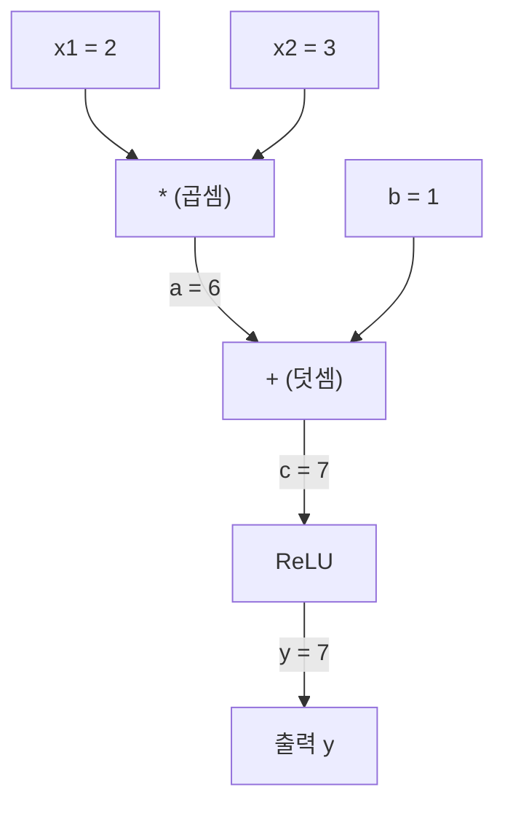
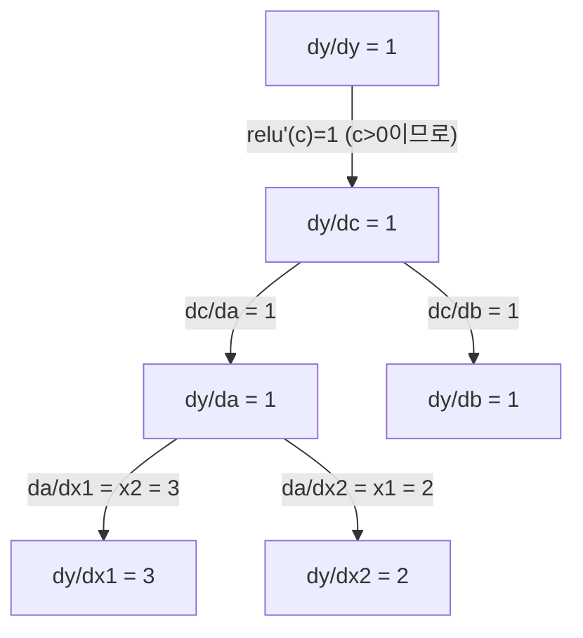

# 연쇄 법칙(Chain Rule) & 자동 미분(Automatic Differentiation)

> 연쇄 법칙(chain rule)은 학습하는 모든 신경망의 핵심 엔진입니다.

**유형:** Build  
**언어:** Python  
**선수 지식:** Phase 1, Lesson 04 (도함수(Derivatives) & 그래디언트(Gradients))  
**소요 시간:** ~90분

## 학습 목표

- 연산 기록을 수행하고 역방향 모드 자동 미분을 통해 기울기를 계산하는 최소 자동 미분 엔진(Value 클래스) 구축
- 위상 정렬을 사용한 계산 그래프 순방향 및 역방향 전파 구현
- 처음부터 구현한 자동 미분 엔진만을 사용하여 XOR 데이터셋에 대한 다층 퍼셉트론 구성 및 학습
- 수치적 유한 차분 대비 기울기 검증을 통한 자동 미분 정확도 확인

## 문제 정의

간단한 함수의 도함수를 계산할 수 있습니다. 하지만 신경망은 단순한 함수가 아닙니다. 행렬 곱셈, 편향 추가, 활성화 함수 적용, 다시 행렬 곱셈, 소프트맥스, 교차 엔트로피 손실 등 수백 개의 함수가 함께 조합된 것입니다. 출력은 함수의 함수의 함수입니다.

네트워크를 훈련시키려면 손실과 모든 단일 가중치 사이의 기울기(gradient)가 필요합니다. 수백만 개의 매개변수에 대해 이를 수동으로 계산하는 것은 불가능합니다. 수치적 방법(유한 차분)으로 계산하는 것은 너무 느립니다.

연쇄 법칙(chain rule)은 수학적 방법을 제공합니다. 자동 미분(automatic differentiation)은 알고리즘을 제공합니다. 이 둘을 함께 사용하면 단일 순전파(forward pass) 시간에 비례하는 속도로 임의의 함수 조합을 통한 정확한 기울기를 계산할 수 있습니다.

이것이 PyTorch, TensorFlow, JAX의 작동 방식입니다. 이제 직접 소규모 버전을 처음부터 구축해 볼 것입니다.

## 개념

### 연쇄 법칙(Chain Rule)

`y = f(g(x))`일 때, `x`에 대한 `y`의 미분은 다음과 같습니다:

```
dy/dx = dy/dg * dg/dx = f'(g(x)) * g'(x)
```

체인을 따라 미분값을 곱합니다. 각 링크는 지역 미분값을 기여합니다.

예시: `y = sin(x^2)`

```
g(x) = x^2       g'(x) = 2x
f(g) = sin(g)     f'(g) = cos(g)

dy/dx = cos(x^2) * 2x
```

더 깊은 합성 함수의 경우 체인이 확장됩니다:

```
y = f(g(h(x)))

dy/dx = f'(g(h(x))) * g'(h(x)) * h'(x)
```

신경망의 모든 레이어는 이 체인의 한 링크입니다.

### 계산 그래프(Computational Graphs)

계산 그래프는 연쇄 법칙을 시각화합니다. 모든 연산은 노드가 됩니다. 데이터는 그래프를 통해 전방으로 흐릅니다. 그래디언트는 역방향으로 흐릅니다.

**전방 전달(Forward pass, 값 계산):**



**역방향 전달(Backward pass, 그래디언트 계산):**



역방향 전달은 모든 노드에서 연쇄 법칙을 적용하여 출력에서 입력까지 그래디언트를 전파합니다.

### 전방 모드(Forward Mode) vs 역방향 모드(Reverse Mode)

그래프를 통해 연쇄 법칙을 적용하는 두 가지 방법이 있습니다.

**전방 모드**는 입력에서 시작하여 미분을 전방으로 전파합니다. `dx/dx = 1`을 계산하고 각 연산을 통해 전파합니다. 입력이 적고 출력이 많을 때 적합합니다.

```
전방 모드: dx/dx = 1로 시드, 전방으로 전파

  x = 2       (dx/dx = 1)
  a = x^2     (da/dx = 2x = 4)
  y = sin(a)  (dy/dx = cos(a) * da/dx = cos(4) * 4 = -2.615)
```

**역방향 모드**는 출력에서 시작하여 그래디언트를 역방향으로 당깁니다. `dy/dy = 1`을 계산하고 각 연산을 역순으로 전파합니다. 입력이 많고 출력이 적을 때 적합합니다.

```
역방향 모드: dy/dy = 1로 시드, 역방향으로 전파

  y = sin(a)  (dy/dy = 1)
  a = x^2     (dy/da = cos(a) = cos(4) = -0.654)
  x = 2       (dy/dx = dy/da * da/dx = -0.654 * 4 = -2.615)
```

신경망은 수백만 개의 입력(가중치)과 하나의 출력(손실)을 가집니다. 역방향 모드는 한 번의 역방향 전달로 모든 그래디언트를 계산합니다. 이것이 역전파(backpropagation)가 역방향 모드를 사용하는 이유입니다.

| 모드 | 시드 | 방향 | 적합한 경우 |
|------|------|-----------|-----------|
| 전방 | `dx_i/dx_i = 1` | 입력 → 출력 | 입력이 적고 출력이 많은 경우 |
| 역방향 | `dy/dy = 1` | 출력 → 입력 | 입력이 많고 출력이 적은 경우 (신경망) |

### 전방 모드를 위한 쌍곡선 수(Dual Numbers)

전방 모드는 쌍곡선 수(dual numbers)로 우아하게 구현할 수 있습니다. 쌍곡선 수는 `a + b*epsilon` 형태이며, `epsilon^2 = 0`입니다.

```
쌍곡선 수: (값, 미분)

(2, 1)은: 값이 2, x에 대한 미분이 1

연산 규칙:
  (a, a') + (b, b') = (a+b, a'+b')
  (a, a') * (b, b') = (a*b, a'*b + a*b')
  sin(a, a')         = (sin(a), cos(a)*a')
```

입력 변수에 미분 1을 시드합니다. 미분은 모든 연산을 통해 자동으로 전파됩니다.

### 오토그래드 엔진(Autograd Engine) 구축

오토그래드 엔진은 다음 세 가지가 필요합니다:

1. **값 래핑.** 모든 숫자를 값과 그래디언트를 저장하는 객체로 래핑합니다.
2. **그래프 기록.** 모든 연산은 입력과 지역 그래디언트 함수를 기록합니다.
3. **역방향 전달.** 그래프를 위상 정렬(topological sort)한 후 역순으로 탐색하며 각 노드에서 연쇄 법칙을 적용합니다.

이것이 바로 PyTorch의 `autograd`가 하는 일입니다. `torch.Tensor` 클래스는 값을 래핑하고, `requires_grad=True`일 때 연산을 기록하며, `.backward()`를 호출할 때 그래디언트를 계산합니다.

### PyTorch 오토그래드 내부 동작

다음 PyTorch 코드를 작성할 때:

```python
x = torch.tensor(2.0, requires_grad=True)
y = x ** 2 + 3 * x + 1
y.backward()
print(x.grad)  # 7.0 = 2*x + 3 = 2*2 + 3
```

PyTorch는 내부적으로 다음을 수행합니다:

1. `requires_grad=True`로 `x`에 대한 `Tensor` 노드 생성
2. 모든 연산(`**`, `*`, `+`)은 새 노드를 생성하고 역방향 함수를 기록
3. `y.backward()`는 기록된 그래프를 통해 역방향 자동 미분을 트리거
4. 각 노드의 `grad_fn`은 지역 그래디언트를 계산하고 부모 노드로 전달
5. 그래디언트는 `.grad` 속성에 누적(덮어쓰기 아님)

그래프는 동적(define-by-run)입니다. 매 전방 전달마다 새 그래프가 생성됩니다. 이것이 PyTorch가 모델 내 제어 흐름(if/else, 루프)을 지원하는 이유입니다.

## 빌드하기

### 단계 1: Value 클래스

```python
class Value:
    def __init__(self, data, children=(), op=''):
        self.data = data
        self.grad = 0.0
        self._backward = lambda: None
        self._prev = set(children)
        self._op = op

    def __repr__(self):
        return f"Value(data={self.data:.4f}, grad={self.grad:.4f})"
```

모든 `Value`는 숫자 데이터, 기울기(gradient, 초기값 0), 역전파(backward) 함수, 그리고 이를 생성한 자식 노드에 대한 포인터를 저장합니다.

### 단계 2: 기울기 추적이 가능한 산술 연산

```python
    def __add__(self, other):
        other = other if isinstance(other, Value) else Value(other)
        out = Value(self.data + other.data, (self, other), '+')
        def _backward():
            self.grad += out.grad
            other.grad += out.grad
        out._backward = _backward
        return out

    def __mul__(self, other):
        other = other if isinstance(other, Value) else Value(other)
        out = Value(self.data * other.data, (self, other), '*')
        def _backward():
            self.grad += other.data * out.grad
            other.grad += self.data * out.grad
        out._backward = _backward
        return out

    def relu(self):
        out = Value(max(0, self.data), (self,), 'relu')
        def _backward():
            self.grad += (1.0 if out.data > 0 else 0.0) * out.grad
        out._backward = _backward
        return out
```

각 연산은 지역 기울기를 계산하고 상류 기울기(`out.grad`)를 곱하는 방법을 아는 클로저를 생성합니다. `+=`는 값이 여러 연산에서 사용되는 경우를 처리합니다.

### 단계 3: 역전파(backward) 단계

```python
    def backward(self):
        topo = []
        visited = set()
        def build_topo(v):
            if v not in visited:
                visited.add(v)
                for child in v._prev:
                    build_topo(child)
                topo.append(v)
        build_topo(self)

        self.grad = 1.0
        for v in reversed(topo):
            v._backward()
```

위상 정렬(topological sort)은 모든 노드의 기울기가 자식 노드로 전파되기 전에 완전히 계산되도록 보장합니다. 시드 기울기는 1.0입니다 (dy/dy = 1).

### 단계 4: 완전한 엔진을 위한 추가 연산

기본적인 `Value` 클래스는 덧셈, 곱셈, ReLU를 처리합니다. 실제 자동 미분 엔진에는 더 많은 연산이 필요합니다. 신경망을 구축하기 위해 필요한 연산들은 다음과 같습니다:

```python
    def __neg__(self):
        return self * -1

    def __sub__(self, other):
        return self + (-other)

    def __radd__(self, other):
        return self + other

    def __rmul__(self, other):
        return self * other

    def __rsub__(self, other):
        return other + (-self)

    def __pow__(self, n):
        out = Value(self.data ** n, (self,), f'**{n}')
        def _backward():
            self.grad += n * (self.data ** (n - 1)) * out.grad
        out._backward = _backward
        return out

    def __truediv__(self, other):
        return self * (other ** -1) if isinstance(other, Value) else self * (Value(other) ** -1)

    def exp(self):
        import math
        e = math.exp(self.data)
        out = Value(e, (self,), 'exp')
        def _backward():
            self.grad += e * out.grad
        out._backward = _backward
        return out

    def log(self):
        import math
        out = Value(math.log(self.data), (self,), 'log')
        def _backward():
            self.grad += (1.0 / self.data) * out.grad
        out._backward = _backward
        return out

    def tanh(self):
        import math
        t = math.tanh(self.data)
        out = Value(t, (self,), 'tanh')
        def _backward():
            self.grad += (1 - t ** 2) * out.grad
        out._backward = _backward
        return out
```

**각 연산의 중요성:**

| 연산 | 역전파 규칙 | 사용처 |
|-----------|--------------|---------|
| `__sub__` | 덧셈 + 부정 재사용 | 손실 계산 (예측값 - 목표값) |
| `__pow__` | n * x^(n-1) | 다항식 활성화 함수, MSE (오차^2) |
| `__truediv__` | 곱셈 + 거듭제곱(-1) 재사용 | 정규화, 학습률 스케일링 |
| `exp` | exp(x) * 상류 기울기 | 소프트맥스, 로그 우도 |
| `log` | (1/x) * 상류 기울기 | 크로스 엔트로피 손실, 로그 확률 |
| `tanh` | (1 - tanh^2) * 상류 기울기 | 클래식 활성화 함수 |

영리한 부분: `__sub__`와 `__truediv__`는 기존 연산을 기반으로 정의됩니다. 체인 룰이 기본 덧셈/곱셈/거듭제곱 연산을 통해 구성되므로 정확한 기울기를 무료로 얻습니다.

### 단계 5: 처음부터 만드는 미니 MLP

완전한 `Value` 클래스를 사용하면 신경망을 구축할 수 있습니다. PyTorch도, NumPy도 필요 없습니다. 단지 `Value`와 체인 룰만 있으면 됩니다.

```python
import random

class Neuron:
    def __init__(self, n_inputs):
        self.w = [Value(random.uniform(-1, 1)) for _ in range(n_inputs)]
        self.b = Value(0.0)

    def __call__(self, x):
        act = sum((wi * xi for wi, xi in zip(self.w, x)), self.b)
        return act.tanh()

    def parameters(self):
        return self.w + [self.b]

class Layer:
    def __init__(self, n_inputs, n_outputs):
        self.neurons = [Neuron(n_inputs) for _ in range(n_outputs)]

    def __call__(self, x):
        return [n(x) for n in self.neurons]

    def parameters(self):
        return [p for n in self.neurons for p in n.parameters()]

class MLP:
    def __init__(self, sizes):
        self.layers = [Layer(sizes[i], sizes[i+1]) for i in range(len(sizes)-1)]

    def __call__(self, x):
        for layer in self.layers:
            x = layer(x)
        return x[0] if len(x) == 1 else x

    def parameters(self):
        return [p for layer in self.layers for p in layer.parameters()]
```

`Neuron`은 `tanh(w1*x1 + w2*x2 + ... + b)`를 계산합니다. `Layer`는 뉴런들의 리스트입니다. `MLP`는 레이어들을 쌓습니다. 모든 가중치는 `Value`이므로 `loss.backward()`를 호출하면 모든 파라미터에 기울기가 전파됩니다.

**XOR 학습:**

```python
random.seed(42)
model = MLP([2, 4, 1])  # 2 입력, 4 은닉 뉴런, 1 출력

xs = [[0, 0], [0, 1], [1, 0], [1, 1]]
ys = [-1, 1, 1, -1]  # XOR 패턴 (tanh를 위해 -1/1 사용)

for step in range(100):
    preds = [model(x) for x in xs]
    loss = sum((p - y) ** 2 for p, y in zip(preds, ys))

    for p in model.parameters():
        p.grad = 0.0
    loss.backward()

    lr = 0.05
    for p in model.parameters():
        p.data -= lr * p.grad

    if step % 20 == 0:
        print(f"step {step:3d}  loss = {loss.data:.4f}")

print("\n학습 후 예측값:")
for x, y in zip(xs, ys):
    print(f"  입력={x}  목표={y:2d}  예측={model(x).data:6.3f}")
```

이것이 micrograd입니다. 자동 미분을 사용하는 순수 파이썬으로 만든 완전한 신경망 학습 루프입니다. 모든 상용 딥러닝 프레임워크도 대규모로 동일한 작업을 수행합니다.

### 단계 6: 기울기 검증

자동 미분이 올바른지 어떻게 알 수 있을까요? 수치 미분과 비교해보세요. 이것이 기울기 검증입니다.

```python
def gradient_check(build_expr, x_val, h=1e-7):
    x = Value(x_val)
    y = build_expr(x)
    y.backward()
    autodiff_grad = x.grad

    y_plus = build_expr(Value(x_val + h)).data
    y_minus = build_expr(Value(x_val - h)).data
    numerical_grad = (y_plus - y_minus) / (2 * h)

    diff = abs(autodiff_grad - numerical_grad)
    return autodiff_grad, numerical_grad, diff
```

복잡한 표현식으로 테스트해 보세요:

```python
def expr(x):
    return (x ** 3 + x * 2 + 1).tanh()

ad, num, diff = gradient_check(expr, 0.5)
print(f"자동 미분:  {ad:.8f}")
print(f"수치 미분: {num:.8f}")
print(f"차이: {diff:.2e}")
# 차이는 1e-5 미만이어야 합니다
```

기울기 검증은 새로운 연산을 구현할 때 필수적입니다. 역전파에 버그가 있으면 수치 검증이 이를 잡아냅니다. 모든 진지한 딥러닝 구현은 개발 중에 기울기 검증을 실행합니다.

**기울기 검증을 사용해야 하는 경우:**

| 상황 | 기울기 검증 수행? |
|-----------|-------------------|
| 자동 미분 엔진에 새로운 연산 추가 | 예, 항상 |
| 수렴하지 않는 학습 루프 디버깅 | 예, 먼저 기울기 확인 |
| 프로덕션 학습 | 아니오, 너무 느림 (파라미터당 2배 순전파) |
| 자동 미분 코드 유닛 테스트 | 예, 자동화 |

### 단계 7: 수동 계산과 검증

```python
x1 = Value(2.0)
x2 = Value(3.0)
a = x1 * x2          # a = 6.0
b = a + Value(1.0)    # b = 7.0
y = b.relu()          # y = 7.0

y.backward()

print(f"y = {y.data}")          # 7.0
print(f"dy/dx1 = {x1.grad}")   # 3.0 (= x2)
print(f"dy/dx2 = {x2.grad}")   # 2.0 (= x1)
```

수동 검증: `y = relu(x1*x2 + 1)`. `x1*x2 + 1 = 7 > 0`이므로 ReLU는 항등 함수입니다.
`dy/dx1 = x2 = 3`. `dy/dx2 = x1 = 2`. 엔진이 일치합니다.

## 사용 방법

### PyTorch와 검증

```python
import torch

x1 = torch.tensor(2.0, requires_grad=True)
x2 = torch.tensor(3.0, requires_grad=True)
a = x1 * x2
b = a + 1.0
y = torch.relu(b)
y.backward()

print(f"PyTorch dy/dx1 = {x1.grad.item()}")  # 3.0
print(f"PyTorch dy/dx2 = {x2.grad.item()}")  # 2.0
```

동일한 기울기. 수학 연산이 동일하기 때문에 체인 룰을 통한 역전파(backpropagation) 방식으로 PyTorch와 동일한 결과를 계산합니다.

### 더 복잡한 표현식

```python
a = Value(2.0)
b = Value(-3.0)
c = Value(10.0)
f = (a * b + c).relu()  # relu(2*(-3) + 10) = relu(4) = 4

f.backward()
print(f"df/da = {a.grad}")  # -3.0 (= b)
print(f"df/db = {b.grad}")  #  2.0 (= a)
print(f"df/dc = {c.grad}")  #  1.0
```

## Ship It

이 레슨은 다음을 생성합니다:
- `outputs/skill-autodiff.md` -- 오토그래드 시스템 구축 및 디버깅을 위한 기술 문서
- `code/autodiff.py` -- 확장 가능한 최소 오토그래드 엔진

여기서 구축한 `Value` 클래스는 3단계(Phase 3)의 신경망 학습 루프의 기반이 됩니다.

## 연습 문제

1. `Value` 클래스에 `__pow__`를 추가하여 `x ** n`을 계산할 수 있도록 구현하세요. `x=2`에서 `d/dx(x^3)`이 `12.0`과 일치하는지 검증하세요.

2. 활성화 함수로 `tanh`를 추가하세요. `tanh'(0) = 1`과 `tanh'(2) = 0.0707`(약)임을 검증하세요.

3. 단일 뉴런에 대한 계산 그래프를 구축하세요: `y = relu(w1*x1 + w2*x2 + b)`. 5개의 그래디언트를 모두 계산하고 PyTorch 결과와 비교 검증하세요.

4. 쌍곡선 수(dual numbers)를 사용하여 순방향 모드 자동 미분을 구현하세요. `Dual` 클래스를 만들고 역방향 모드 엔진과 동일한 도함수를 제공하는지 검증하세요.

## 주요 용어

| 용어 | 사람들이 말하는 것 | 실제 의미 |
|------|----------------|----------------------|
| 연쇄 법칙(Chain rule) | "도함수를 곱한다" | 합성 함수의 도함수는 각 함수의 지역 도함수를 적절한 지점에서 평가한 값의 곱과 같다 |
| 계산 그래프(Computational graph) | "네트워크 다이어그램" | 노드는 연산이고 엣지는 값(순전파) 또는 그래디언트(역전파)를 전달하는 방향 비순환 그래프 |
| 순방향 모드(Forward mode) | "도함수를 앞으로 전파한다" | 입력에서 출력으로 도함수를 전파하는 자동 미분. 입력 변수당 한 번의 패스 |
| 역방향 모드(Reverse mode) | "역전파(Backpropagation)" | 출력에서 입력으로 그래디언트를 전파하는 자동 미분. 출력 변수당 한 번의 패스 |
| 오토그래드(Autograd) | "자동 그래디언트" | 값에 대한 연산을 기록하고 그래프를 구성하며 연쇄 법칙을 통해 정확한 그래디언트를 계산하는 시스템 |
| 쌍대수(Dual numbers) | "값 + 도함수" | a + b*epsilon (epsilon² = 0) 형태의 수로, 산술 연산을 통해 도함수 정보를 전달 |
| 위상 정렬(Topological sort) | "의존성 순서" | 모든 노드가 그 의존성 노드보다 뒤에 오도록 그래프 노드를 정렬. 올바른 그래디언트 전파에 필요 |
| 그래디언트 누적(Gradient accumulation) | "대체하지 않고 더한다" | 하나의 값이 여러 연산에 입력될 때, 그래디언트는 모든 들어오는 그래디언트 기여도의 합 |
| 동적 그래프(Dynamic graph) | "실행 시 정의" | 매 순전파 시 재구성되는 계산 그래프. 모델 내부에 Python 제어 흐름 허용 (PyTorch 방식) |
| 그래디언트 검증(Gradient checking) | "수치적 검증" | 자동 미분 그래디언트를 수치적 유한 차분 그래디언트와 비교하여 정확성 확인. 디버깅에 필수적 |
| MLP(Multi-layer perceptron) | "다층 퍼셉트론" | 하나 이상의 은닉층을 가진 신경망. 각 뉴런은 가중합 + 바이어스를 계산한 후 활성화 함수를 적용 |
| 뉴런(Neuron) | "가중합 + 활성화" | 기본 단위: 출력 = activation(w1*x1 + w2*x2 + ... + b). 가중치와 바이어스는 학습 가능한 매개변수 |

## 추가 자료

- [3Blue1Brown: 역전파(backpropagation) 미적분학](https://www.youtube.com/watch?v=tIeHLnjs5U8) -- 신경망에서의 연쇄 법칙(chain rule) 시각적 설명
- [PyTorch Autograd 메커니즘](https://pytorch.org/docs/stable/notes/autograd.html) -- 실제 시스템 작동 방식
- [Baydin et al., 머신러닝에서의 자동 미분(automatic differentiation): 조사](https://arxiv.org/abs/1502.05767) -- 종합 참고 자료