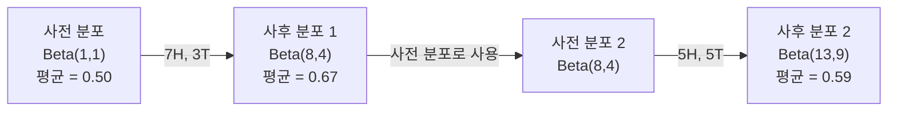

# 베이즈 정리

> 확률은 기대하는 것에 관한 것입니다. 베이즈 정리는 배우는 것에 관한 것입니다.

**유형:** Build  
**언어:** Python  
**선수 지식:** 1단계, 06강 (확률 기초)  
**소요 시간:** ~75분

## 학습 목표

- 베이즈 정리(Bayes' theorem)를 적용하여 사전 확률(prior), 가능도(likelihood), 증거(evidence)로부터 사후 확률(posterior)을 계산
- 라플라스 스무딩(Laplace smoothing)과 로그 공간(log-space) 계산을 활용해 나이브 베이즈(Naive Bayes) 텍스트 분류기를 처음부터 구현
- 최대우도추정(MLE)과 최대사후확률추정(MAP)을 비교하고, MAP가 L2 정규화(L2 regularization)에 대응하는 방식 설명
- A/B 테스트를 위한 베타-이항(Beta-Binomial) 켤레 사전 분포(conjugate prior)를 사용한 순차적 베이지안 업데이트(sequential Bayesian updating) 구현

## 문제

의료 검사가 99% 정확하다. 검사 결과 양성으로 나왔다. 실제로 질병에 걸렸을 확률은 얼마인가?

대부분의 사람들은 99%라고 답한다. 실제 정답은 질병의 희귀성에 따라 달라진다. 10,000명 중 1명이 질병을 가지고 있다면, 양성 결과는 약 1%의 확률로만 실제 질병을 의미한다. 나머지 99%의 양성 결과는 건강한 사람들에게서 나온 오탐(false alarm)이다.

이것은 함정이 있는 질문이 아니다. 베이즈 정리(Bayes' theorem)이다. 모든 스팸 필터, 모든 의료 진단, 불확실성을 정량화하는 모든 머신러닝 모델은 이 정확한 추론을 사용한다. 사전 확률(prior probability)로 시작한다. 증거(evidence)를 관찰한다. 그 후 확률을 업데이트한다.

이를 이해하지 않고 ML 시스템을 구축하면 모델 출력을 잘못 해석하고, 잘못된 임계값을 설정하며, 과신하는 예측을 배포하게 될 것이다.

## 개념

### 결합 확률에서 베이즈 정리까지

Lesson 06에서 조건부 확률이 다음과 같음을 이미 알고 있습니다:

```
P(A|B) = P(A and B) / P(B)
```

대칭적으로:

```
P(B|A) = P(A and B) / P(A)
```

두 식은 같은 분자 P(A and B)를 공유합니다. 이를 등식으로 놓고 재배열하면:

```
P(A and B) = P(A|B) * P(B) = P(B|A) * P(A)

따라서:

P(A|B) = P(B|A) * P(A) / P(B)
```

이것이 베이즈 정리입니다. 네 가지 양과 하나의 방정식입니다.

### 네 가지 구성 요소

| 구성 요소 | 이름 | 의미 |
|------|------|---------------|
| P(A\|B) | 사후 확률(Posterior) | 증거 B를 관찰한 후 A에 대한 업데이트된 믿음 |
| P(B\|A) | 가능도(Likelihood) | A가 참일 때 증거 B의 확률 |
| P(A) | 사전 확률(Prior) | 어떤 증거도 보기 전 A에 대한 믿음 |
| P(B) | 증거(Evidence) | 모든 가능성 하에서 B를 관찰할 총 확률 |

증거 항 P(B)는 정규화(normalizer) 역할을 합니다. 전체 확률의 법칙을 사용하여 확장할 수 있습니다:

```
P(B) = P(B|A) * P(A) + P(B|not A) * P(not A)
```

### 의료 검사 예시

어떤 질병은 10,000명 중 1명에게 영향을 미칩니다. 검사는 99% 정확합니다(환자의 99%를 정확히 발견하고, 1% 확률로 위양성을 냅니다).

```
P(병든)          = 0.0001     (사전 확률: 질병은 희귀함)
P(양성|병든) = 0.99       (가능도: 검사가 병을 발견함)
P(양성|건강) = 0.01    (위양성률)

P(양성) = P(양성|병든) * P(병든) + P(양성|건강) * P(건강)
        = 0.99 * 0.0001 + 0.01 * 0.9999
        = 0.000099 + 0.009999
        = 0.010098

P(병든|양성) = P(양성|병든) * P(병든) / P(양성)
             = 0.99 * 0.0001 / 0.010098
             = 0.0098
             = 0.98%
```

1% 미만입니다. 사전 확률이 지배적입니다. 조건이 희귀할 때, 정확한 검사라도 대부분 위양성을 생성합니다. 이것이 의사들이 확인 검사를 요청하는 이유입니다.

### 스팸 필터 예시

"이메일"에 "로또"라는 단어가 포함되어 있습니다. 스팸일까요?

```
P(스팸)                = 0.3      (이메일의 30%는 스팸)
P("로또"|스팸)      = 0.05     (스팸 이메일의 5%에 "로또" 포함)
P("로또"|스팸 아님)  = 0.001    (정상 이메일의 0.1%에 "로또" 포함)

P("로또") = 0.05 * 0.3 + 0.001 * 0.7
         = 0.015 + 0.0007
         = 0.0157

P(스팸|"로또") = 0.05 * 0.3 / 0.0157
              = 0.955
              = 95.5%
```

한 단어가 확률을 30%에서 95.5%로 변화시킵니다. 실제 스팸 필터는 수백 개의 단어에 대해 동시에 베이즈 정리를 적용합니다.

### 나이브 베이즈: 조건부 독립 가정

나이브 베이즈는 클래스에 대해 모든 특성이 조건부 독립이라고 가정하여 여러 특성으로 확장합니다:

```
P(클래스 | 특성_1, 특성_2, ..., 특성_n)
  = P(클래스) * P(특성_1|클래스) * P(특성_2|클래스) * ... * P(특성_n|클래스)
    / P(특성_1, 특성_2, ..., 특성_n)
```

"나이브" 부분은 독립 가정입니다. 텍스트에서 단어 발생은 독립적이지 않습니다("New"와 "York"은 상관관계가 있음). 하지만 분류기가 클래스 순위를 매기기만 하면 되기 때문에(보정된 확률을 생성할 필요 없음) 이 가정은 실제로 놀랍도록 잘 작동합니다.

분모는 모든 클래스에 대해 동일하므로 생략하고 분자만 비교할 수 있습니다:

```
score(클래스) = P(클래스) * P(특성_i | 클래스)의 곱
```

가장 높은 점수를 가진 클래스를 선택합니다.

### 최대 우도 추정(MLE)

훈련 데이터에서 P(특성|클래스)를 어떻게 구할까요? 카운트합니다.

```
P("무료"|스팸) = ("무료"를 포함하는 스팸 이메일 수) / (전체 스팸 이메일 수)
```

이것은 MLE입니다: 관측된 데이터를 가장 가능성 있게 만드는 매개변수 값을 선택합니다. 이산 카운트에 대해 우도 함수는 상대 빈도로 축소됩니다.

문제점: 훈련 중 스팸에 특정 단어가 전혀 나타나지 않으면 MLE는 확률 0을 제공합니다. 한 번도 보지 못한 단어가 전체 곱을 0으로 만듭니다. 라플라스 스무딩으로 이 문제를 해결합니다:

```
P(단어|클래스) = (count(단어, 클래스) + 1) / (클래스 내 총 단어 수 + 어휘 크기)
```

모든 카운트에 1을 더하면 어떤 확률도 0이 되지 않습니다.

### 최대 사후 확률(MAP)

MLE는 "P(데이터|매개변수)를 최대화하는 매개변수는 무엇인가?"를 묻습니다.

MAP는 "P(매개변수|데이터)를 최대화하는 매개변수는 무엇인가?"를 묻습니다.

베이즈 정리에 따르면:

```
P(매개변수|데이터) ∝ P(데이터|매개변수) * P(매개변수)
```

MAP는 매개변수 자체에 대한 사전 확률을 추가합니다. 매개변수가 작아야 한다고 믿는다면, 큰 값을 페널티로 주는 사전 확률로 인코딩합니다. 이는 ML에서 L2 정규화와 동일합니다. 릿지 회귀의 "릿지" 페널티는 가중치에 대한 가우시안 사전 확률입니다.

| 추정 방법 | 최적화 대상 | ML 대응 |
|------------|-----------|---------------|
| MLE | P(데이터\|매개변수) | 비정규화 훈련 |
| MAP | P(데이터\|매개변수) * P(매개변수) | L2 / L1 정규화 |

### 베이지안 vs 빈도주의: 실제 차이점

빈도주의자는 매개변수를 고정된 미지로 취급합니다. "이 실험을 여러 번 반복한다면 어떤 일이 일어날까?"라고 묻습니다.

베이지안자는 매개변수를 분포로 취급합니다. "내가 관찰한 것을 고려할 때 매개변수에 대해 무엇을 믿는가?"라고 묻습니다.

ML 시스템 구축 시 실제 차이점:

| 측면 | 빈도주의자 | 베이지안 |
|--------|-------------|----------|
| 출력 | 점 추정 | 값의 분포 |
| 불확실성 | 신뢰 구간(절차에 대한) | 신뢰 구간(매개변수에 대한) |
| 소량 데이터 | 과적합 가능 | 사전 확률이 정규화 역할 |
| 계산 | 일반적으로 더 빠름 | 종종 샘플링(MCMC) 필요 |

대부분의 프로덕션 ML은 빈도주의자입니다(SGD, 점 추정). 베이지안 방법은 보정된 불확실성이 필요한 경우(의료 결정, 안전 중요 시스템)나 데이터가 부족한 경우(소수 샷 학습, 콜드 스타트)에 빛을 발합니다.

### ML에 베이지안 사고가 중요한 이유

이 연결은 단순한 유추를 넘어섭니다:

**사전 확률은 정규화입니다.** 가중치에 대한 가우시안 사전 확률은 L2 정규화입니다. 라플라스 사전 확률은 L1입니다. 정규화 항을 추가할 때마다 어떤 매개변수 값을 기대하는지 베이지안 진술을 하는 것입니다.

**사후 확률은 불확실성입니다.** 단일 예측 확률은 모델이 그 추정에 얼마나 확신하는지에 대해 아무것도 알려주지 않습니다. 베이지안 방법은 분포를 제공합니다: "P(스팸)이 0.8에서 0.95 사이라고 생각합니다."

**베이즈 업데이트는 온라인 학습입니다.** 오늘의 사후 확률은 내일의 사전 확률이 됩니다. 모델이 새로운 데이터를 보면 처음부터 재훈련하는 대신 점진적으로 믿음을 업데이트합니다.

**모델 비교는 베이지안입니다.** 베이지안 정보 기준(BIC), 주변 우도, 베이즈 인자는 모두 과적합 없이 모델 간 선택을 위해 베이지안 추론을 사용합니다.

## 구축

### 1단계: 베이즈 정리 함수

```python
def bayes(prior, likelihood, false_positive_rate):
    evidence = likelihood * prior + false_positive_rate * (1 - prior)
    posterior = likelihood * prior / evidence
    return posterior

result = bayes(prior=0.0001, likelihood=0.99, false_positive_rate=0.01)
print(f"P(sick|positive) = {result:.4f}")
```

### 2단계: 나이브 베이즈 분류기

```python
import math
from collections import defaultdict

class NaiveBayes:
    def __init__(self, smoothing=1.0):
        self.smoothing = smoothing
        self.class_counts = defaultdict(int)
        self.word_counts = defaultdict(lambda: defaultdict(int))
        self.class_word_totals = defaultdict(int)
        self.vocab = set()

    def train(self, documents, labels):
        for doc, label in zip(documents, labels):
            self.class_counts[label] += 1
            words = doc.lower().split()
            for word in words:
                self.word_counts[label][word] += 1
                self.class_word_totals[label] += 1
                self.vocab.add(word)

    def predict(self, document):
        words = document.lower().split()
        total_docs = sum(self.class_counts.values())
        vocab_size = len(self.vocab)
        best_class = None
        best_score = float("-inf")
        for cls in self.class_counts:
            score = math.log(self.class_counts[cls] / total_docs)
            for word in words:
                count = self.word_counts[cls].get(word, 0)
                total = self.class_word_totals[cls]
                score += math.log((count + self.smoothing) / (total + self.smoothing * vocab_size))
            if score > best_score:
                best_score = score
                best_class = cls
        return best_class
```

로그 확률은 언더플로우를 방지합니다. 많은 작은 확률을 곱하면 부동소수점 표현 범위를 벗어나는 매우 작은 숫자가 생성됩니다. 로그 확률을 합산하는 것은 수치적으로 안정적이며 수학적으로 동일한 결과를 제공합니다.

### 3단계: 스팸 데이터로 학습

```python
train_docs = [
    "win free money now",
    "free lottery ticket winner",
    "claim your prize today free",
    "urgent offer free cash",
    "congratulations you won free",
    "meeting tomorrow at noon",
    "project update attached",
    "can we schedule a call",
    "quarterly report review",
    "lunch on thursday sounds good",
    "team standup notes attached",
    "please review the pull request",
]

train_labels = [
    "spam", "spam", "spam", "spam", "spam",
    "ham", "ham", "ham", "ham", "ham", "ham", "ham",
]

classifier = NaiveBayes()
classifier.train(train_docs, train_labels)

test_messages = [
    "free money waiting for you",
    "meeting rescheduled to friday",
    "you won a free prize",
    "please review the attached report",
]

for msg in test_messages:
    print(f"  '{msg}' -> {classifier.predict(msg)}")
```

### 4단계: 학습된 확률 확인

```python
def show_top_words(classifier, cls, n=5):
    vocab_size = len(classifier.vocab)
    total = classifier.class_word_totals[cls]
    probs = {}
    for word in classifier.vocab:
        count = classifier.word_counts[cls].get(word, 0)
        probs[word] = (count + classifier.smoothing) / (total + classifier.smoothing * vocab_size)
    sorted_words = sorted(probs.items(), key=lambda x: x[1], reverse=True)
    for word, prob in sorted_words[:n]:
        print(f"    {word}: {prob:.4f}")

print("\n스팸 상위 단어:")
show_top_words(classifier, "spam")
print("\n햄 상위 단어:")
show_top_words(classifier, "ham")
```

## 사용 방법

Scikit-learn은 프로덕션에 바로 사용 가능한 나이브 베이즈 구현체를 제공합니다:

```python
from sklearn.feature_extraction.text import CountVectorizer
from sklearn.naive_bayes import MultinomialNB
from sklearn.metrics import classification_report

vectorizer = CountVectorizer()
X_train = vectorizer.fit_transform(train_docs)
clf = MultinomialNB()
clf.fit(X_train, train_labels)

X_test = vectorizer.transform(test_messages)
predictions = clf.predict(X_test)
for msg, pred in zip(test_messages, predictions):
    print(f"  '{msg}' -> {pred}")
```

동일한 알고리즘입니다. CountVectorizer는 토큰화와 어휘 구축을 처리합니다. MultinomialNB는 내부적으로 스무딩과 로그 확률을 처리합니다. 직접 구현한 버전도 40줄 안에 동일한 작업을 수행합니다.

## Ship It

여기서 구축한 NaiveBayes 클래스는 토크나이징, 라플라스 평활화를 통한 확률 추정, 로그 공간 예측 등 전체 파이프라인을 보여줍니다. `code/bayes.py`의 코드는 Python 표준 라이브러리 외에 의존성이 없이 엔드투엔드로 실행됩니다.

### 켤레 사전 분포(Conjugate Priors)

사전 분포와 사후 분포가 동일한 분포 계열에 속할 때, 사전 분포를 "켤레(conjugate)"라고 합니다. 이는 베이지안 업데이트를 대수적으로 깔끔하게 만들어주며, 수치적 적분 없이도 닫힌 형태의 사후 분포를 얻을 수 있습니다.

| 우도(Likelihood) | 켤레 사전 분포(Conjugate Prior) | 사후 분포(Posterior) | 예시(Example) |
|------------------|----------------------------------|----------------------|---------------|
| 베르누이(Bernoulli) | 베타(Beta(a, b)) | 베타(Beta(a + 성공 횟수, b + 실패 횟수)) | 동전 편향 추정 |
| 정규 분포(알려진 분산) | 정규(Normal(mu_0, sigma_0)) | 정규(가중 평균, 더 작은 분산) | 센서 보정 |
| 포아송(Poisson) | 감마(Gamma(a, b)) | 감마(Gamma(a + 관측치 합, b + n)) | 도착률 모델링 |
| 다항(멀티노미얼) | 디리클레(Dirichlet(alpha)) | 디리클레(Dirichlet(alpha + 관측치)) | 토픽 모델링, 언어 모델 |

**중요성**: 켤레 사전 분포가 없으면 몬테카를로 샘플링이나 변분 추론으로 사후 분포를 근사해야 합니다. 켤레 사전 분포가 있으면 두 숫자만 업데이트하면 됩니다.

베타 분포는 실제로 가장 흔히 사용되는 켤레 사전 분포입니다. 베타(a, b)는 확률 매개변수에 대한 믿음을 나타냅니다. 평균은 a/(a+b)이며, a+b가 클수록 분포가 더 집중(확신)됩니다.

베타 사전 분포의 특수 사례:
- 베타(1, 1) = 균일 분포. 매개변수에 대한 의견이 없습니다.
- 베타(10, 10) = 0.5에 뾰족. 매개변수가 0.5 근처라고 강하게 믿습니다.
- 베타(1, 10) = 0에 치우침. 매개변수가 작다고 믿습니다.

업데이트 규칙은 매우 간단합니다:

```
사전 분포:     Beta(a, b)
데이터:      s 성공, f 실패
사후 분포: Beta(a + s, b + f)
```

적분도, 샘플링도 필요 없이 덧셈만 하면 됩니다.

### 순차적 베이지안 업데이트(Sequential Bayesian Updating)

베이지안 추론은 본질적으로 순차적입니다. 오늘의 사후 분포는 내일의 사전 분포가 됩니다. 이는 실제 시스템이 모든 과거 데이터를 재처리하지 않고 점진적으로 학습하는 방식입니다.

구체적인 예시: 동전이 공정한지 추정하기.

**1일차: 아직 데이터 없음.**
베타(1, 1)로 시작 — 균일 사전 분포. 의견이 없습니다.
- 사전 평균: 0.5
- [0, 1] 구간에서 평평

**2일차: 7번 앞면, 3번 뒷면 관측.**
사후 분포 = 베타(1 + 7, 1 + 3) = 베타(8, 4)
- 사후 평균: 8/12 = 0.667
- 동전이 앞면으로 편향되었다는 증거

**3일차: 5번 더 앞면, 5번 더 뒷면 관측.**
어제의 사후 분포를 오늘의 사전 분포로 사용.
사후 분포 = 베타(8 + 5, 4 + 5) = 베타(13, 9)
- 사후 평균: 13/22 = 0.591
- 균형 잡힌 새 데이터가 추정치를 0.5 쪽으로 다시 끌어당김



관측 순서는 중요하지 않습니다. 베타(1,1)에 12번 앞면과 8번 뒷면을 한 번에 업데이트하면 베타(13, 9)가 됩니다. 순차적 업데이트와 배치 업데이트는 수학적으로 동등합니다. 하지만 순차적 업데이트는 원시 데이터를 저장하지 않고도 각 단계에서 결정을 내릴 수 있게 합니다.

이것은 프로덕션 ML 시스템의 온라인 학습 기반입니다. 밴딧(Thompson sampling), 증분 추천 시스템, 스트리밍 이상 탐지기가 모두 이 패턴을 사용합니다.

### A/B 테스트와의 연결

A/B 테스트는 베이지안 추론의 변형입니다.

설정: 두 버튼 색상(변형 A(파란색), 변형 B(녹색))을 테스트합니다. 어떤 것이 더 많은 클릭을 받는지 알고 싶습니다.

베이지안 A/B 테스트:

1. **사전 분포.** 두 변형 모두 베타(1, 1)로 시작. 사전 선호도 없음.
2. **데이터.** 변형 A: 1000회 노출 중 50회 클릭. 변형 B: 1000회 노출 중 65회 클릭.
3. **사후 분포.**
   - A: 베타(1 + 50, 1 + 950) = 베타(51, 951). 평균 = 0.051
   - B: 베타(1 + 65, 1 + 935) = 베타(66, 936). 평균 = 0.066
4. **결정.** P(B > A) 계산 — B의 실제 전환율이 A보다 높을 확률.

P(B > A)를 해석적으로 계산하는 것은 어렵습니다. 하지만 몬테카를로 방법으로 간단히 해결할 수 있습니다:

```
1. 베타(51, 951)에서 100,000개 샘플 추출  -> samples_A
2. 베타(66, 936)에서 100,000개 샘플 추출  -> samples_B
3. P(B > A) = B > A인 샘플의 비율
```

P(B > A) > 0.95이면 변형 B를 출시합니다. 0.05와 0.95 사이면 데이터를 더 수집합니다. P(B > A) < 0.05이면 변형 A를 출시합니다.

빈도주의 A/B 테스트 대비 장점:
- 직접적인 확률 진술: "B가 더 좋을 확률이 97%입니다"
- p-값 혼란 없음. "귀무가설을 기각하지 못함" 같은 회피적 표현 없음.
- 거짓 양성률을 증가시키지 않고 언제든지 결과 확인 가능("피킹 문제" 없음)
- 사전 지식 통합 가능(예: 이전 테스트에서 전환율이 보통 3-8%였다는 정보)

| 측면(Aspect) | 빈도주의 A/B | 베이지안 A/B |
|--------------|--------------|--------------|
| 출력(Output) | p-값 | P(B > A) |
| 해석(Interpretation) | "A=B일 때 이 데이터가 얼마나 놀라운가?" | "B가 A보다 더 좋을 확률은 얼마인가?" |
| 조기 종료(Early stopping) | 거짓 양성 증가 | 언제든지 안전(잘 선택된 사전 분포와 올바르게 지정된 모델 가정 하에) |
| 사전 지식(Prior knowledge) | 사용되지 않음 | 베타 사전 분포로 인코딩 |
| 결정 규칙(Decision rule) | p < 0.05 | P(B > A) > 임계값 |

## 연습 문제

1. **다중 테스트.** 한 환자가 독립적인 두 테스트에서 모두 양성 반응을 보였다(두 테스트 모두 정확도 99%, 질병 유병률 1만 명 중 1명). 두 테스트 후 P(병든 상태)는 얼마인가? 첫 번째 테스트의 사후 확률을 두 번째 테스트의 사전 확률로 사용하라.

2. **평활화 영향.** 스팸 분류기를 평활화 값 0.01, 0.1, 1.0, 10.0으로 실행해보자. 상위 단어 확률은 어떻게 변하는가? 평활화=0이고 햄(ham)에서만 나타나는 단어의 경우 어떤 현상이 발생하는가?

3. **특징 추가.** NaiveBayes 클래스를 확장하여 단어 빈도 외에 메시지 길이(짧음/길음)도 특징으로 사용하도록 수정하라. 훈련 데이터에서 P(짧음|스팸)과 P(짧음|햄)을 추정하고 예측 점수에 반영하라.

4. **수동 MAP 추정.** 관측된 데이터(10번 동전 던지기 중 7번 앞면)가 주어졌을 때, Beta(2,2) 사전 분포를 사용하여 편향(bias)의 MAP 추정값을 계산하라. 그리고 이를 MLE 추정값(7/10)과 비교하라.

## 핵심 용어

| 용어 | 사람들이 말하는 표현 | 실제 의미 |
|------|----------------|----------------------|
| 사전 확률(Prior) | "내 초기 추측" | 증거(evidence)를 관측하기 전의 가설(hypothesis) 확률. ML에서는 정규화(regularization) 항. |
| 가능도(Likelihood) | "데이터가 얼마나 잘 맞는지" | P(증거|가설). 특정 가설 하에서 관측된 데이터의 확률. |
| 사후 확률(Posterior) | "업데이트된 내 믿음" | P(가설|증거). 사전 확률에 가능도를 곱한 후 정규화한 값. |
| 증거(Evidence) | "정규화 상수" | 모든 가설에 걸친 P(데이터). 사후 확률이 1이 되도록 보장. |
| 나이브 베이즈(Naive Bayes) | "그 간단한 텍스트 분류기" | 클래스(class) 주어진 특징(feature)들이 독립적이라고 가정하는 분류기. 잘못된 가정에도 잘 작동함. |
| 라플라스 평활화(Laplace smoothing) | "Add-one 평활화" | 미관측 데이터로 인한 0 확률을 방지하기 위해 모든 특징에 작은 카운트를 추가. |
| 최대우도추정(MLE) | "빈도만 사용해" | P(데이터|파라미터)를 최대화하는 파라미터 선택. 사전 확률 없음. 작은 데이터에서 과적합(overfitting) 가능. |
| 최대사후확률(MAP) | "사전 확률이 있는 MLE" | P(데이터|파라미터) * P(파라미터)를 최대화하는 파라미터 선택. 정규화된 MLE와 동일. |
| 로그 확률(Log-probability) | "로그 공간에서 작업" | 작은 수들의 곱셈 시 부동소수점 언더플로우 방지를 위해 P 대신 log(P) 사용. |
| 거짓 양성(False positive) | "잘못된 경보" | 테스트는 양성(positive)이지만 실제 상태는 음성(negative). 기저율 오류(base rate fallacy)를 유발.

## 추가 학습 자료

- [3Blue1Brown: 베이즈 정리](https://www.youtube.com/watch?v=HZGCoVF3YvM) - 의료 검사 예시를 활용한 시각적 설명
- [Stanford CS229: 생성 학습 알고리즘](https://cs229.stanford.edu/notes2022fall/cs229-notes2.pdf) - 나이브 베이즈와 판별 모델의 연관성
- [Think Bayes](https://greenteapress.com/wp-bayes/) - 무료 교재, 파이썬 코드를 활용한 베이지안 통계
- [scikit-learn 나이브 베이즈](https://scikit-learn.org/stable/modules/naive_bayes.html) - 프로덕션 구현 및 각 변형 사용 시기