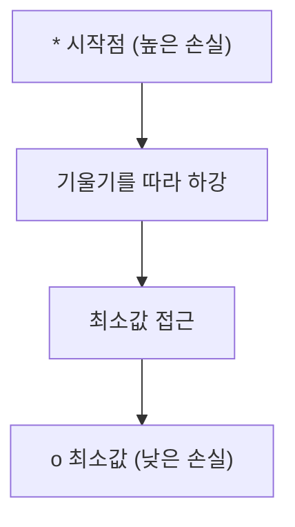
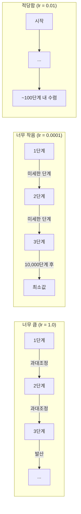
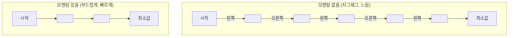
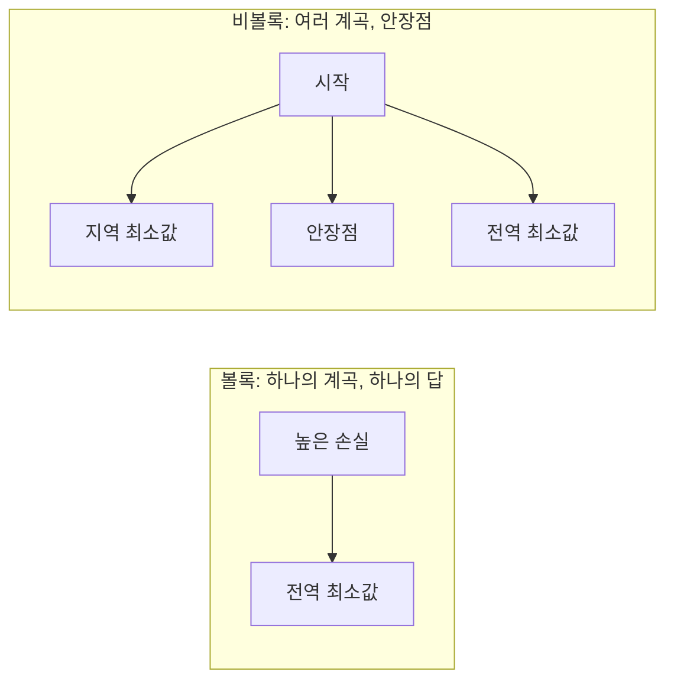
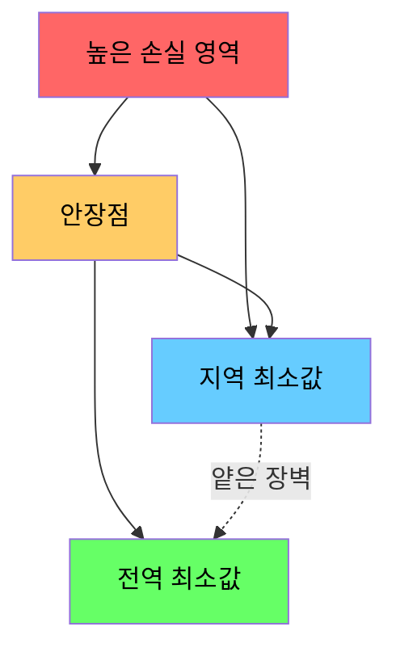

# 최적화

> 신경망 훈련은 골짜기의 바닥을 찾는 것과 같다.

**유형:** 빌드  
**언어:** Python  
**선수 지식:** Phase 1, 레슨 04-05 (미분, 기울기)  
**소요 시간:** ~75분

## 학습 목표

- **Vanilla 경사 하강법(gradient descent), 모멘텀(momentum)을 적용한 SGD, Adam을 직접 구현**  
- **로젠브록 함수(Rosenbrock function)에서 옵티마이저 수렴 속도 비교 및 Adam이 가중치별 학습률(per-weight learning rate)을 조정하는 이유 설명**  
- **볼록(convex) 및 비볼록(non-convex) 손실 함수 형태 구분과 고차원 공간에서 안장점(saddle point)의 역할 설명**  
- **학습 안정성 확보를 위한 학습률 스케줄(단계적 감소(step decay), 코사인 어닐링(cosine annealing), 워밍업(warmup)) 구성 방법**

## 문제 정의

손실 함수(loss function)가 있습니다. 이는 모델이 얼마나 틀렸는지 알려줍니다. 기울기(gradient)도 있습니다. 이는 손실을 더 악화시키는 방향을 알려줍니다. 이제 우리는 골짜기 아래로 내려가는 전략이 필요합니다.

순진한 접근법은 간단합니다: 기울기의 반대 방향으로 이동합니다. 학습률(learning rate)이라는 숫자로 스텝 크기를 조정합니다. 이를 반복합니다. 이것이 경사 하강법(gradient descent)이며, 작동합니다. 하지만 "작동한다"에는 주의 사항이 있습니다. 학습률이 너무 크면 골짜기를 완전히 지나쳐 벽 사이를 튕기며 진동합니다. 너무 작으면 수천 번의 불필요한 스텝을 거쳐 답에 천천히 접근합니다. 안장점(saddle point)에 부딪히면 최소값을 찾지 못했음에도 움직임이 멈춥니다.

딥러닝의 모든 옵티마이저(optimizer)는 같은 질문에 대한 답변입니다: 어떻게 하면 더 빠르고 안정적으로 골짜기의 바닥에 도달할 수 있을까요?

## 개념

### 최적화란 무엇인가

최적화는 함수를 최소화(또는 최대화)하는 입력값을 찾는 것입니다. 머신러닝에서 함수는 손실(loss)입니다. 입력값은 모델의 가중치(weights)입니다. 학습은 최적화입니다.

```
minimize L(w) where:
  L = 손실 함수(loss function)
  w = 모델 가중치 (수백만 개의 파라미터일 수 있음)
```

### 경사 하강법(vanilla)

가장 간단한 옵티마이저입니다. 손실 함수에 대한 모든 가중치의 기울기(gradient)를 계산합니다. 각 가중치를 기울기의 반대 방향으로 이동시킵니다. 학습률(learning rate)로 단계 크기를 조정합니다.

```
w = w - lr * 기울기(gradient)
```

이것이 전체 알고리즘입니다. 단 한 줄입니다.



### 학습률: 가장 중요한 하이퍼파라미터

학습률은 단계 크기를 제어합니다. 수렴에 관한 모든 것을 결정합니다.



적절한 학습률을 위한 공식은 없습니다. 실험을 통해 찾습니다. 일반적인 시작점: Adam의 경우 0.001, 모멘텀이 있는 SGD의 경우 0.01.

### SGD vs 배치 vs 미니배치

바닐라 경사 하강법은 전체 데이터셋에 대한 기울기를 계산한 후 한 단계를 진행합니다. 이를 배치 경사 하강법(batch gradient descent)이라고 합니다. 안정적이지만 느립니다.

확률적 경사 하강법(SGD)은 단일 무작위 샘플에 대한 기울기를 계산하고 즉시 단계를 진행합니다. 노이즈가 많지만 빠릅니다.

미니배치 경사 하강법은 중간 방식을 사용합니다. 작은 배치(32, 64, 128, 256개 샘플)에 대한 기울기를 계산한 후 단계를 진행합니다. 실제로 모두가 사용하는 방식입니다.

| 변형 | 배치 크기 | 기울기 품질 | 단계당 속도 | 노이즈 |
|---------|-----------|-----------------|---------------|-------|
| 배치 GD | 전체 데이터셋 | 정확 | 느림 | 없음 |
| SGD | 1개 샘플 | 매우 노이즈 많음 | 빠름 | 높음 |
| 미니배치 | 32-256 | 좋은 추정치 | 균형 | 보통 |

SGD와 미니배치의 노이즈는 버그가 아닙니다. 얕은 지역 최소값과 안장점(saddle point)에서 탈출하는 데 도움이 됩니다.

### 모멘텀: 언덕을 굴러 내려오는 공

바닐라 경사 하강법은 현재 기울기만 고려합니다. 기울기가 지그재그 형태라면(좁은 계곡에서 흔함) 진행이 느립니다. 모멘텀은 과거 기울기를 속도 항(velocity term)에 누적시켜 이를 해결합니다.

```
v = beta * v + 기울기
w = w - lr * v
```

비유: 언덕을 굴러 내려오는 공. 모든 돌부리에서 멈추지 않고 계속 구릅니다. 일관된 방향으로 속도를 축적하고 진동을 감쇠시킵니다.



`beta`(일반적으로 0.9)는 얼마나 많은 과거 정보를 유지할지 제어합니다. 높은 베타는 더 많은 모멘텀, 더 부드러운 경로를 의미하지만 방향 전환에 대한 반응은 느려집니다.

### Adam: 적응형 학습률

각 가중치에는 서로 다른 학습률이 필요합니다. 큰 기울기를 거의 받지 않는 가중치는 큰 단계를 취해야 합니다. 반면 지속적으로 큰 기울기를 받는 가중치는 작은 단계를 취해야 합니다.

Adam(Adaptive Moment Estimation)은 가중치마다 두 가지를 추적합니다:

1. 1차 모멘트(m): 기울기의 이동 평균(모멘텀과 유사)
2. 2차 모멘트(v): 제곱된 기울기의 이동 평균(기울기 크기)

```
m = beta1 * m + (1 - beta1) * 기울기
v = beta2 * v + (1 - beta2) * 기울기^2

m_hat = m / (1 - beta1^t)    편향 보정
v_hat = v / (1 - beta2^t)    편향 보정

w = w - lr * m_hat / (sqrt(v_hat) + epsilon)
```

`sqrt(v_hat)`로 나누는 것이 핵심 아이디어입니다. 큰 기울기를 가진 가중치는 큰 수로 나누어(작은 유효 단계) 작은 기울기를 가진 가중치는 작은 수로 나누어(큰 유효 단계) 각 가중치에 적응형 학습률을 제공합니다.

기본 하이퍼파라미터: `lr=0.001, beta1=0.9, beta2=0.999, epsilon=1e-8`. 이 기본값은 대부분의 문제에 잘 작동합니다.

### 학습률 스케줄

고정된 학습률은 타협점입니다. 학습 초기에는 큰 단계로 빠르게 진행하기를 원합니다. 학습 후기에는 작은 단계로 최소값 근처에서 미세 조정을 원합니다.

일반적인 스케줄:

| 스케줄 | 공식 | 사용 사례 |
|----------|---------|----------|
| 단계 감소 | lr = lr * factor every N epochs | 간단한 수동 제어 |
| 지수 감소 | lr = lr_0 * decay^t | 부드러운 감소 |
| 코사인 감소 | lr = lr_min + 0.5 * (lr_max - lr_min) * (1 + cos(pi * t / T)) | 트랜스포머, 현대 훈련 |
| 워밍업 + 감소 | 선형 증가 후 감소 | 대형 모델, 초기 불안정성 방지 |

### 볼록 vs 비볼록

볼록 함수는 하나의 최소값을 가집니다. 경사 하강법은 항상 이를 찾습니다. `f(x) = x^2`와 같은 이차 함수는 볼록합니다.

신경망 손실 함수는 비볼록입니다. 많은 지역 최소값, 안장점, 평탄한 영역이 있습니다.



실제로 고차원 신경망의 지역 최소값은 전역 최소값과 가까운 손실 값을 가집니다. 안장점(일부 방향은 평탄, 다른 방향은 곡선)이 진짜 장애물입니다. 모멘텀과 미니배치의 노이즈가 탈출에 도움을 줍니다.

### 손실 지형 시각화

손실은 모든 가중치의 함수입니다. 100만 개의 가중치를 가진 모델의 손실 지형은 1,000,001차원 공간에 존재합니다. 가중치 공간에서 두 개의 무작위 방향을 선택해 해당 방향으로의 손실을 플롯하여 2D 표면을 생성합니다.



예리한 최소값(sharp minima)은 일반화 성능이 낮습니다. 평탄한 최소값(flat minima)은 일반화 성능이 높습니다. 모멘텀이 있는 SGD가 종종 Adam보다 최종 테스트 정확도에서 우수한 이유 중 하나는 노이즈가 예리한 최소값에 머무르지 않게 하기 때문입니다.

## 구축 방법

### 1단계: 테스트 함수 정의

로젠브록 함수는 고전적인 최적화 벤치마크입니다. 이 함수의 최소값은 (1, 1)에 위치하며, 좁은 곡선 골짜기 내부에 있어 찾기는 쉽지만 따라가기는 어렵습니다.

```
f(x, y) = (1 - x)^2 + 100 * (y - x^2)^2
```

```python
def rosenbrock(params):
    x, y = params
    return (1 - x) ** 2 + 100 * (y - x ** 2) ** 2

def rosenbrock_gradient(params):
    x, y = params
    df_dx = -2 * (1 - x) + 200 * (y - x ** 2) * (-2 * x)
    df_dy = 200 * (y - x ** 2)
    return [df_dx, df_dy]
```

### 2단계: 기본 경사 하강법

```python
class GradientDescent:
    def __init__(self, lr=0.001):
        self.lr = lr

    def step(self, params, grads):
        return [p - self.lr * g for p, g in zip(params, grads)]
```

### 3단계: 모멘텀 적용 SGD

```python
class SGDMomentum:
    def __init__(self, lr=0.001, momentum=0.9):
        self.lr = lr
        self.momentum = momentum
        self.velocity = None

    def step(self, params, grads):
        if self.velocity is None:
            self.velocity = [0.0] * len(params)
        self.velocity = [
            self.momentum * v + g
            for v, g in zip(self.velocity, grads)
        ]
        return [p - self.lr * v for p, v in zip(params, self.velocity)]
```

### 4단계: Adam

```python
class Adam:
    def __init__(self, lr=0.001, beta1=0.9, beta2=0.999, epsilon=1e-8):
        self.lr = lr
        self.beta1 = beta1
        self.beta2 = beta2
        self.epsilon = epsilon
        self.m = None
        self.v = None
        self.t = 0

    def step(self, params, grads):
        if self.m is None:
            self.m = [0.0] * len(params)
            self.v = [0.0] * len(params)

        self.t += 1

        self.m = [
            self.beta1 * m + (1 - self.beta1) * g
            for m, g in zip(self.m, grads)
        ]
        self.v = [
            self.beta2 * v + (1 - self.beta2) * g ** 2
            for v, g in zip(self.v, grads)
        ]

        m_hat = [m / (1 - self.beta1 ** self.t) for m in self.m]
        v_hat = [v / (1 - self.beta2 ** self.t) for v in self.v]

        return [
            p - self.lr * mh / (vh ** 0.5 + self.epsilon)
            for p, mh, vh in zip(params, m_hat, v_hat)
        ]
```

### 5단계: 실행 및 비교

```python
def optimize(optimizer, func, grad_func, start, steps=5000):
    params = list(start)
    history = [params[:]]
    for _ in range(steps):
        grads = grad_func(params)
        params = optimizer.step(params, grads)
        history.append(params[:])
    return history

start = [-1.0, 1.0]

gd_history = optimize(GradientDescent(lr=0.0005), rosenbrock, rosenbrock_gradient, start)
sgd_history = optimize(SGDMomentum(lr=0.0001, momentum=0.9), rosenbrock, rosenbrock_gradient, start)
adam_history = optimize(Adam(lr=0.01), rosenbrock, rosenbrock_gradient, start)

for name, history in [("GD", gd_history), ("SGD+M", sgd_history), ("Adam", adam_history)]:
    final = history[-1]
    loss = rosenbrock(final)
    print(f"{name:6s} -> x={final[0]:.6f}, y={final[1]:.6f}, loss={loss:.8f}")
```

예상 출력: Adam이 가장 빠르게 수렴합니다. 모멘텀 적용 SGD는 더 부드러운 경로를 따릅니다. 기본 경사 하강법은 좁은 골짜기를 따라 느리게 진행됩니다.

## 사용 방법

실제 적용 시에는 PyTorch 또는 JAX 옵티마이저를 사용하세요. 이들은 파라미터 그룹, 가중치 감소(weight decay), 그래디언트 클리핑(gradient clipping), GPU 가속을 처리합니다.

```python
import torch

model = torch.nn.Linear(784, 10)

sgd = torch.optim.SGD(model.parameters(), lr=0.01, momentum=0.9)
adam = torch.optim.Adam(model.parameters(), lr=0.001)
adamw = torch.optim.AdamW(model.parameters(), lr=0.001, weight_decay=0.01)

scheduler = torch.optim.lr_scheduler.CosineAnnealingLR(adam, T_max=100)
```

경험적 규칙:

- Adam(lr=0.001)으로 시작하세요. 튜닝 없이도 대부분의 문제에 작동합니다.
- 최적의 최종 정확도가 필요하고 더 많은 튜닝을 할 수 있을 때는 모멘텀(momentum)이 있는 SGD(lr=0.01, momentum=0.9)로 전환하세요.
- 트랜스포머(transformer)에는 분리된 가중치 감소(weight decay)가 있는 AdamW를 사용하세요.
- 몇 에포크 이상 훈련하는 경우 항상 학습률 스케줄(learning rate schedule)을 사용하세요.
- 훈련이 불안정하면 학습률(learning rate)을 줄이세요. 훈련이 너무 느리면 학습률을 늘리세요.

## Ship It

이 레슨은 적절한 옵티마이저(optimizer)를 선택하기 위한 프롬프트를 생성합니다. `outputs/prompt-optimizer-guide.md`를 참조하세요.

여기서 구축된 옵티마이저 클래스들은 3단계에서 신경망을 처음부터 학습할 때 다시 등장합니다.

## 연습 문제

1. **학습률 스윕.** 로젠브록 함수(Rosenbrock function)에 대해 학습률 [0.0001, 0.0005, 0.001, 0.005, 0.01]로 기본 경사 하강법(vanilla gradient descent)을 실행합니다. 각 학습률에 대해 5000 스텝 후 최종 손실(loss)을 플롯 또는 출력합니다. 여전히 수렴하는 가장 큰 학습률을 찾습니다.

2. **모멘텀 비교.** 로젠브록 함수에 모멘텀 값 [0.0, 0.5, 0.9, 0.99]를 적용한 SGD를 실행합니다. 매 스텝마다 손실 값을 추적합니다. 어떤 모멘텀 값이 가장 빠르게 수렴하나요? 어떤 값이 과적합(overshoot)하나요?

3. **안장점 탈출.** 함수 `f(x, y) = x^2 - y^2` (원점에 안장점 존재)를 정의합니다. 시작점을 (0.01, 0.01)로 설정합니다. 기본 경사 하강법(vanilla GD), 모멘텀을 적용한 SGD, Adam의 동작을 비교합니다. 어떤 방법이 안장점을 탈출하나요?

4. **학습률 감쇠 구현.** GradientDescent 클래스에 지수 감쇠 스케줄 `lr = lr_0 * 0.999^step`을 추가합니다. 로젠브록 함수에서 감쇠 적용 여부에 따른 수렴 속도를 비교합니다.

## 주요 용어

| 용어 | 사람들이 말하는 표현 | 실제 의미 |
|------|----------------|----------------------|
| 기울기 하강법(Gradient descent) | "내리막 길로 가라" | 학습률(learning rate)로 스케일링된 기울기를 빼서 가중치를 업데이트한다. 가장 기본적인 옵티마이저. |
| 학습률(Learning rate) | "걸음 크기" | 각 업데이트가 가중치를 얼마나 이동시킬지 제어하는 스칼라 값. 너무 크면 발산하고, 너무 작으면 계산 자원을 낭비한다. |
| 모멘텀(Momentum) | "계속 굴러라" | 과거 기울기들을 속도 벡터에 누적한다. 진동을 감쇠시키고 일관된 방향으로의 이동을 가속화한다. |
| SGD | "무작위 샘플링" | 확률적 기울기 하강법(Stochastic Gradient Descent). 전체 데이터셋 대신 무작위 부분집합으로 기울기를 계산한다. 실제로는 거의 항상 미니배치 SGD를 의미한다. |
| 미니배치(Mini-batch) | "데이터 조각" | 기울기 추정에 사용되는 작은 훈련 데이터 부분집합(32-256개 샘플). 속도와 기울기 정확도의 균형을 맞춘다. |
| Adam | "기본 옵티마이저" | 적응적 모멘트 추정(Adaptive Moment Estimation). 기울기와 제곱 기울기의 가중치별 이동 평균을 추적하여 각 가중치에 고유한 학습률을 부여한다. |
| 편향 보정(Bias correction) | "초기 시작 문제 해결" | Adam의 1차 및 2차 모멘트는 0으로 초기화된다. 편향 보정은 초기 단계 동안 (1 - beta^t)로 나누어 보상한다. |
| 학습률 스케줄(Learning rate schedule) | "시간에 따라 lr 변경" | 훈련 중 학습률을 조정하는 함수. 초기에는 큰 걸음, 후기에는 작은 걸음. |
| 볼록 함수(Convex function) | "하나의 골짜기" | 모든 지역 최소값이 전역 최소값인 함수. 기울기 하강법은 항상 이를 찾는다. 신경망 손실 함수는 볼록하지 않다. |
| 안장점(Saddle point) | "평평하지만 최소값은 아님" | 기울기는 0이지만 어떤 방향에서는 최소값, 다른 방향에서는 최대값인 지점. 고차원에서 흔하다. |
| 손실 지형(Loss landscape) | "지형" | 가중치 공간에 대해 플롯된 손실 함수. 두 개의 무작위 방향을 따라 슬라이스하여 시각화한다. |
| 수렴(Convergence) | "도달" | 옵티마이저가 추가 단계들이 손실을 의미 있게 줄이지 않는 지점에 도달한 상태.

## 추가 자료

- [Sebastian Ruder: 경사 하강법 최적화 알고리즘 개요](https://ruder.io/optimizing-gradient-descent/) - 모든 주요 옵티마이저에 대한 종합 조사
- [모멘텀이 실제로 작동하는 이유 (Distill)](https://distill.pub/2017/momentum/) - 모멘텀 동역학의 대화형 시각화
- [Adam: 확률적 최적화 방법 (Kingma & Ba, 2014)](https://arxiv.org/abs/1412.6980) - 원본 Adam 논문, 읽기 쉽고 간결함
- [신경망의 손실 함수 지형 시각화 (Li et al., 2018)](https://arxiv.org/abs/1712.09913) - 날카로운 최소값 vs 평탄한 최소값을 보여준 논문