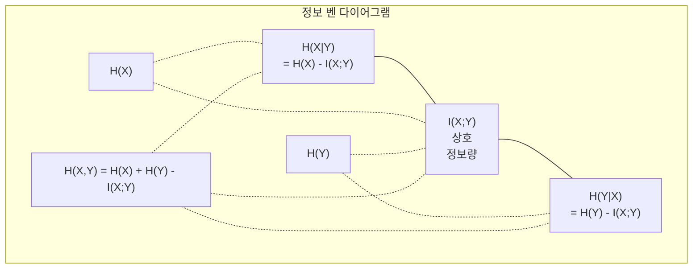

# 정보 이론

> 정보 이론은 놀라움(surprise)을 측정합니다. 손실 함수는 이를 기반으로 구축됩니다.

**유형:** 학습
**언어:** Python
**선수 지식:** 1단계, 06강 (확률)
**소요 시간:** ~60분

## 학습 목표

- 엔트로피(entropy), 교차 엔트로피(cross-entropy), KL 발산(KL divergence)을 직접 계산하고 그 관계를 설명
- 교차 엔트로피 손실(cross-entropy loss) 최소화가 로그 우도(log-likelihood) 최대화와 동등한 이유를 유도
- 피처(feature)와 타겟(target) 간 상호 정보(mutual information)를 계산하여 피처 중요도 순위 매기기
- 퍼플렉서티(perplexity)를 언어 모델이 선택하는 효과적인 어휘 크기(effective vocabulary size)로 설명

## 문제 정의

여러분은 훈련하는 모든 분류 모델에서 `CrossEntropyLoss()`를 호출합니다. 모든 언어 모델 논문에서 "퍼플렉서티(perplexity)"를 봅니다. VAE, 지식 증류(knowledge distillation), RLHF에서 KL 발산(KL divergence)에 대해 읽습니다. 이 개념들은 서로 연결되지 않은 것이 아닙니다. 모두 다른 이름으로 불리는 동일한 아이디어입니다.

정보 이론(information theory)은 불확실성(uncertainty), 압축(compression), 예측(prediction)에 대해 추론할 수 있는 언어를 제공합니다. 클로드 섀넌(Claude Shannon)은 1948년 통신 문제를 해결하기 위해 이를 발명했습니다. 알고 보니 신경망 훈련도 통신 문제입니다: 모델은 학습된 가중치(learned weights)라는 노이즈가 있는 채널을 통해 올바른 레이블을 전송하려고 합니다.

이 강의에서는 모든 공식을 처음부터 구축하여, 공식이 어디에서 비롯되었는지와 왜 작동하는지 보여줍니다.

## 개념

### 정보량 (놀라움)

일어나기 어려운 일이 발생하면 더 많은 정보를 전달합니다. 동전이 앞면으로 나오는 것? 놀랍지 않습니다. 복권 당첨? 매우 놀랍습니다.

확률 p(x)를 가진 사건의 정보량은 다음과 같습니다:

```
I(x) = -log(p(x))
```

로그 밑을 2로 사용하면 비트(bit)가 됩니다. 자연로그를 사용하면 내트(nat)가 됩니다. 같은 개념이지만 단위가 다릅니다.

```
사건              확률       놀라움 (비트)
공정한 동전 앞면  0.5        1.0
주사위 6 나옴     0.167      2.58
1/1000 확률 사건  0.001      9.97
확실한 사건       1.0        0.0
```

확실한 사건은 정보를 전혀 전달하지 않습니다. 이미 발생할 것을 알고 있기 때문입니다.

### 엔트로피 (평균 놀라움)

엔트로피는 분포의 모든 가능한 결과에 대한 기대 놀라움입니다.

```
H(P) = -sum( p(x) * log(p(x)) )  모든 x에 대해
```

공정한 동전은 이진 변수에서 최대 엔트로피를 가집니다: 1비트. 편향된 동전(99% 앞면)은 엔트로피가 낮습니다: 0.08비트. 이미 결과를 알고 있으므로 각 던지기는 거의 정보를 주지 않습니다.

```
공정한 동전:    H = -(0.5 * log2(0.5) + 0.5 * log2(0.5)) = 1.0 비트
편향된 동전:  H = -(0.99 * log2(0.99) + 0.01 * log2(0.01)) = 0.08 비트
```

엔트로피는 분포의 불가피한 불확실성을 측정합니다. 이를 밑돌 수 없습니다.

### 교차 엔트로피 (매일 사용하는 손실 함수)

교차 엔트로피는 분포 Q를 사용하여 실제로 분포 P에서 나온 사건을 인코딩할 때의 평균 놀라움을 측정합니다.

```
H(P, Q) = -sum( p(x) * log(q(x)) )  모든 x에 대해
```

P는 실제 분포(라벨)입니다. Q는 모델의 예측입니다. Q가 P와 완벽히 일치하면 교차 엔트로피는 엔트로피와 같습니다. 불일치가 있으면 값이 커집니다.

분류에서 P는 원-핫 벡터입니다(정답 클래스만 확률 1, 나머지는 0). 이는 교차 엔트로피를 다음과 같이 단순화합니다:

```
H(P, Q) = -log(q(true_class))
```

이것이 분류용 교차 엔트로피 손실 함수의 전체 공식입니다. 정답 클래스의 예측 확률을 최대화합니다.

### KL 발산 (분포 간 거리)

KL 발산은 Q를 사용할 때 P에 비해 얼마나 더 많은 놀라움을 얻는지를 측정합니다.

```
D_KL(P || Q) = sum( p(x) * log(p(x) / q(x)) )  모든 x에 대해
            = H(P, Q) - H(P)
```

교차 엔트로피는 엔트로피 더하기 KL 발산입니다. 학습 중 실제 분포의 엔트로피는 상수이므로, 교차 엔트로피를 최소화하는 것은 KL 발산을 최소화하는 것과 같습니다. 모델의 분포를 실제 분포로 밀어붙이는 것입니다.

KL 발산은 대칭적이지 않습니다: D_KL(P || Q) != D_KL(Q || P). 진정한 거리 척도가 아닙니다.

### 상호 정보량

상호 정보량은 한 변수를 아는 것이 다른 변수에 대해 얼마나 많은 정보를 주는지를 측정합니다.

```
I(X; Y) = H(X) - H(X|Y)
       = H(X) + H(Y) - H(X, Y)
```

X와 Y가 독립적이면 상호 정보량은 0입니다. 하나를 아는 것이 다른 것에 대해 아무런 정보도 주지 않습니다. 완벽히 상관관계가 있으면 상호 정보량은 두 변수의 엔트로피 중 하나와 같습니다.

특성 선택에서 특성과 타겟 간 높은 상호 정보량은 해당 특성이 유용함을 의미합니다. 낮은 상호 정보량은 잡음임을 의미합니다.

### 조건부 엔트로피

H(Y|X)는 X를 관측한 후 Y에 남아 있는 불확실성을 측정합니다.

```
H(Y|X) = H(X,Y) - H(X)
```

두 극단:
- X가 Y를 완전히 결정하면 H(Y|X) = 0입니다. X를 알면 Y에 대한 모든 불확실성이 사라집니다. 예: X = 섭씨 온도, Y = 화씨 온도.
- X가 Y에 대해 아무런 정보도 주지 않으면 H(Y|X) = H(Y)입니다. X를 아는 것이 불확실성을 전혀 줄이지 않습니다. 예: X = 동전 던지기, Y = 내일 날씨.

조건부 엔트로피는 항상 비음수이며 H(Y)를 넘지 않습니다:

```
0 <= H(Y|X) <= H(Y)
```

머신 러닝에서 조건부 엔트로피는 결정 트리에 등장합니다. 각 분할에서 알고리즘은 H(Y|X)를 최소화하는 특성 X를 선택합니다 — 라벨 Y에 대한 불확실성을 가장 많이 제거하는 특성입니다.

### 결합 엔트로피

H(X,Y)는 X와 Y의 결합 분포의 엔트로피입니다.

```
H(X,Y) = -sum sum p(x,y) * log(p(x,y))   모든 x, y에 대해
```

핵심 성질:

```
H(X,Y) <= H(X) + H(Y)
```

X와 Y가 독립적일 때 등호가 성립합니다. 정보를 공유하면 결합 엔트로피는 개별 엔트로피의 합보다 작습니다. "누락된" 엔트로피는 정확히 상호 정보량입니다.



관계:
- H(X,Y) = H(X) + H(Y|X) = H(Y) + H(X|Y)
- I(X;Y) = H(X) - H(X|Y) = H(Y) - H(Y|X)
- H(X,Y) = H(X) + H(Y) - I(X;Y)

### 상호 정보량 (심층 분석)

상호 정보량 I(X;Y)는 한 변수를 아는 것이 다른 변수에 대한 불확실성을 얼마나 줄이는지를 정량화합니다.

```
I(X;Y) = H(X) - H(X|Y)
       = H(Y) - H(Y|X)
       = H(X) + H(Y) - H(X,Y)
       = sum sum p(x,y) * log(p(x,y) / (p(x) * p(y)))
```

성질:
- I(X;Y) >= 0 항상 성립합니다. 무언가를 관측하여 정보를 잃는 경우는 없습니다.
- I(X;Y) = 0일 때만 X와 Y가 독립적입니다.
- I(X;Y) = I(Y;X). KL 발산과 달리 대칭적입니다.
- I(X;X) = H(X). 변수는 자신과 모든 정보를 공유합니다.

**특성 선택을 위한 상호 정보량.** ML에서는 타겟에 대해 정보적인 특성을 원합니다. 상호 정보량은 특성을 순위 매기는 원칙적인 방법을 제공합니다:

1. 각 특성 X_i에 대해 I(X_i; Y)를 계산합니다. Y는 타겟 변수입니다.
2. MI 점수로 특성을 순위 매깁니다.
3. 상위 k개 특성을 유지합니다.

이것은 특성과 타겟 간 어떤 관계(선형, 비선형, 단조, 비단조)에도 작동합니다. 상관관계는 선형 관계만 포착합니다. MI는 모든 것을 포착합니다.

| 방법 | 탐지 가능 | 계산 비용 | 범주형 처리? |
|--------|---------|-------------------|---------------------|
| 피어슨 상관 | 선형 관계 | O(n) | 아니오 |
| 스피어만 상관 | 단조 관계 | O(n log n) | 아니오 |
| 상호 정보량 | 모든 통계적 의존성 | O(n log n) (이산화 시) | 예 |

### 라벨 스무딩과 교차 엔트로피

표준 분류는 하드 타겟을 사용합니다: [0, 0, 1, 0]. 정답 클래스는 확률 1, 나머지는 0입니다. 라벨 스무딩은 이를 소프트 타겟으로 대체합니다:

```
soft_target = (1 - epsilon) * hard_target + epsilon / num_classes
```

epsilon = 0.1, 4개 클래스일 때:
- 하드 타겟:  [0, 0, 1, 0]
- 소프트 타겟:  [0.025, 0.025, 0.925, 0.025]

정보 이론 관점에서 라벨 스무딩은 타겟 분포의 엔트로피를 증가시킵니다. 하드 원-핫 타겟의 엔트로피는 0입니다 — 불확실성이 없습니다. 소프트 타겟은 양의 엔트로피를 가집니다.

도움이 되는 이유:
- 모델이 로짓을 극단적인 값으로 밀어붙이는 것을 방지합니다(교차 엔트로피 하에서 원-핫 타겟을 완벽히 맞추려면 무한한 로짓이 필요함)
- 정규화 역할을 합니다: 모델이 100% 확신할 수 없음
- 보정 개선: 예측 확률이 실제 불확실성을 더 잘 반영
- 훈련과 추론 행동 간 격차 감소

라벨 스무딩을 사용한 교차 엔트로피 손실은 다음과 같습니다:

```
L = (1 - epsilon) * CE(hard_target, prediction) + epsilon * H_uniform(prediction)
```

두 번째 항은 균일 분포에서 먼 예측을 페널티로 줍니다 — 신뢰도에 대한 직접적인 정규화입니다.

### 교차 엔트로피가 분류 손실 함수인 이유

세 가지 관점, 같은 결론.

**정보 이론 관점.** 교차 엔트로피는 실제 분포 대신 모델 분포를 사용할 때 낭비하는 비트 수를 측정합니다. 이를 최소화하면 모델이 현실을 가장 효율적으로 인코딩하게 됩니다.

**최대 우도 관점.** N개의 훈련 샘플과 실제 클래스 y_i에 대해:

```
우도         = product( q(y_i) )
로그 우도     = sum( log(q(y_i)) )
음의 로그 우도 = -sum( log(q(y_i)) )
```

마지막 줄이 교차 엔트로피 손실입니다. 교차 엔트로피 최소화 = 모델 하에서 훈련 데이터의 우도 최대화.

**그래디언트 관점.** 로짓에 대한 교차 엔트로피의 그래디언트는 단순히 (예측 - 실제)입니다. 깔끔하고 안정적이며 계산이 빠릅니다. 이것이 소프트맥스와 완벽하게 짝을 이루는 이유입니다.

### 비트 vs 내트

유일한 차이는 로그 밑입니다.

```
로그 밑 2   -> 비트      (정보 이론 전통)
로그 밑 e   -> 내트      (머신 러닝 관례)
로그 밑 10  -> 하트리  (드물게 사용)
```

1 내트 = 1/ln(2) 비트 = 1.4427 비트. PyTorch와 TensorFlow는 기본적으로 자연 로그(내트)를 사용합니다.

### 퍼플렉서티

퍼플렉서티는 교차 엔트로피의 지수입니다. 모델이 불확실한 동등한 선택지의 평균 개수를 알려줍니다.

```
퍼플렉서티 = 2^H(P,Q)   (비트 사용 시)
퍼플렉서티 = e^H(P,Q)   (내트 사용 시)
```

퍼플렉서티 50인 언어 모델은 평균적으로 50개의 가능한 다음 토큰 중에서 균일하게 선택해야 하는 것처럼 혼란스럽습니다. 낮을수록 좋습니다.

GPT-2는 일반 벤치마크에서 퍼플렉서티 ~30을 달성했습니다. 현대 모델은 잘 표현된 도메인에서 한 자릿수입니다.

## 구축 방법

### 1단계: 정보량과 엔트로피

```python
import math

def information_content(p, base=2):
    if p <= 0 or p > 1:
        return float('inf') if p <= 0 else 0.0
    return -math.log(p) / math.log(base)

def entropy(probs, base=2):
    return sum(
        p * information_content(p, base)
        for p in probs if p > 0
    )

fair_coin = [0.5, 0.5]
biased_coin = [0.99, 0.01]
fair_die = [1/6] * 6

print(f"공정 동전 엔트로피:   {entropy(fair_coin):.4f} bits")
print(f"편향 동전 엔트로피: {entropy(biased_coin):.4f} bits")
print(f"공정 주사위 엔트로피:    {entropy(fair_die):.4f} bits")
```

### 2단계: 교차 엔트로피와 KL 발산

```python
def cross_entropy(p, q, base=2):
    total = 0.0
    for pi, qi in zip(p, q):
        if pi > 0:
            if qi <= 0:
                return float('inf')
            total += pi * (-math.log(qi) / math.log(base))
    return total

def kl_divergence(p, q, base=2):
    return cross_entropy(p, q, base) - entropy(p, base)

true_dist = [0.7, 0.2, 0.1]
good_model = [0.6, 0.25, 0.15]
bad_model = [0.1, 0.1, 0.8]

print(f"실제 분포 엔트로피:     {entropy(true_dist):.4f} bits")
print(f"CE (좋은 모델):          {cross_entropy(true_dist, good_model):.4f} bits")
print(f"CE (나쁜 모델):           {cross_entropy(true_dist, bad_model):.4f} bits")
print(f"KL 발산 (좋은 모델):     {kl_divergence(true_dist, good_model):.4f} bits")
print(f"KL 발산 (나쁜 모델):      {kl_divergence(true_dist, bad_model):.4f} bits")
```

### 3단계: 분류 손실로서의 교차 엔트로피

```python
def softmax(logits):
    max_logit = max(logits)
    exps = [math.exp(z - max_logit) for z in logits]
    total = sum(exps)
    return [e / total for e in exps]

def cross_entropy_loss(true_class, logits):
    probs = softmax(logits)
    return -math.log(probs[true_class])

logits = [2.0, 1.0, 0.1]
true_class = 0

probs = softmax(logits)
loss = cross_entropy_loss(true_class, logits)

print(f"Logits:      {logits}")
print(f"Softmax:     {[f'{p:.4f}' for p in probs]}")
print(f"정답 클래스:  {true_class}")
print(f"손실:        {loss:.4f} nats")
print(f"퍼플렉서티:  {math.exp(loss):.2f}")
```

### 4단계: 교차 엔트로피는 음의 로그 우도와 동일

```python
import random

random.seed(42)

n_samples = 1000
n_classes = 3
true_labels = [random.randint(0, n_classes - 1) for _ in range(n_samples)]
model_logits = [[random.gauss(0, 1) for _ in range(n_classes)] for _ in range(n_samples)]

ce_loss = sum(
    cross_entropy_loss(label, logits)
    for label, logits in zip(true_labels, model_logits)
) / n_samples

nll = -sum(
    math.log(softmax(logits)[label])
    for label, logits in zip(true_labels, model_logits)
) / n_samples

print(f"교차 엔트로피 손실:      {ce_loss:.6f}")
print(f"음의 로그 우도: {nll:.6f}")
print(f"차이:              {abs(ce_loss - nll):.2e}")
```

### 5단계: 상호 정보량

```python
def mutual_information(joint_probs, base=2):
    rows = len(joint_probs)
    cols = len(joint_probs[0])

    margin_x = [sum(joint_probs[i][j] for j in range(cols)) for i in range(rows)]
    margin_y = [sum(joint_probs[i][j] for i in range(rows)) for j in range(cols)]

    mi = 0.0
    for i in range(rows):
        for j in range(cols):
            pxy = joint_probs[i][j]
            if pxy > 0:
                mi += pxy * math.log(pxy / (margin_x[i] * margin_y[j])) / math.log(base)
    return mi

independent = [[0.25, 0.25], [0.25, 0.25]]
dependent = [[0.45, 0.05], [0.05, 0.45]]

print(f"MI (독립): {mutual_information(independent):.4f} bits")
print(f"MI (종속):   {mutual_information(dependent):.4f} bits")
```

## 사용 방법

NumPy를 사용한 실제 적용 방식과 동일한 개념:

```python
import numpy as np

def np_entropy(p):
    p = np.asarray(p, dtype=float)
    mask = p > 0
    result = np.zeros_like(p)
    result[mask] = p[mask] * np.log(p[mask])
    return -result.sum()

def np_cross_entropy(p, q):
    p, q = np.asarray(p, dtype=float), np.asarray(q, dtype=float)
    mask = p > 0
    return -(p[mask] * np.log(q[mask])).sum()

def np_kl_divergence(p, q):
    return np_cross_entropy(p, q) - np_entropy(p)

true = np.array([0.7, 0.2, 0.1])
pred = np.array([0.6, 0.25, 0.15])
print(f"엔트로피:    {np_entropy(true):.4f} nats")
print(f"교차 엔트로피:  {np_cross_entropy(true, pred):.4f} nats")
print(f"KL 발산:     {np_kl_divergence(true, pred):.4f} nats")
```

`torch.nn.CrossEntropyLoss()`가 내부적으로 수행하는 작업을 직접 구현했습니다. 이제 학습 중 손실 값이 감소하는 이유를 알 수 있습니다: 모델의 예측 분포가 실제 분포에 가까워지고 있으며, 이는 낭비된 정보량(nats)으로 측정됩니다.

## 연습 문제

1. 영어 알파벳(26개 문자)이 균일 분포를 따른다고 가정하고 엔트로피(entropy)를 계산하시오. 그런 다음 실제 문자 빈도를 사용하여 추정하시오. 어떤 값이 더 높은지 그리고 그 이유는 무엇인지 설명하시오.

2. 어떤 모델이 진짜 클래스 1인 샘플에 대해 로짓(logits) [5.0, 2.0, 0.5]를 출력했다. 교차 엔트로피 손실(cross-entropy loss)을 직접 계산한 후, `cross_entropy_loss` 함수로 검증하시오. 어떤 로짓이 0 손실을 주는지 설명하시오.

3. KL 발산(KL divergence)이 대칭적이지 않음을 보이시오. 두 분포 P와 Q를 선택하고 D_KL(P || Q)와 D_KL(Q || P)를 계산하시오. 왜 두 값이 다른지 설명하시오.

4. 토큰 예측 시퀀스에 대한 퍼플렉서티(perplexity)를 계산하는 함수를 구현하시오. (true_token_index, predicted_logits) 쌍들의 리스트가 주어졌을 때, 해당 시퀀스의 퍼플렉서티를 반환하시오.

```python
def cross_entropy_loss(logits, true_index):
    exp_logits = np.exp(logits - np.max(logits))
    softmax_probs = exp_logits / np.sum(exp_logits)
    true_prob = softmax_probs[true_index]
    return -np.log(true_prob)
```

```python
def perplexity(tokens_logits_pairs):
    total_loss = 0.0
    for true_index, logits in tokens_logits_pairs:
        total_loss += cross_entropy_loss(logits, true_index)
    avg_loss = total_loss / len(tokens_logits_pairs)
    return np.exp(avg_loss)
```

## 주요 용어

| 용어 | 사람들이 말하는 것 | 실제 의미 |
|------|----------------|----------------------|
| 정보량(Information content) | "놀라움(Surprise)" | 이벤트를 인코딩하는 데 필요한 비트(또는 낫) 수: -log(p) |
| 엔트로피(Entropy) | "무작위성(Randomness)" | 분포의 모든 결과에 대한 평균 놀라움. 제거 불가능한 불확실성을 측정. |
| 교차 엔트로피(Cross-entropy) | "손실 함수(The loss function)" | 모델 분포 Q를 사용하여 실제 분포 P의 이벤트를 인코딩할 때의 평균 놀라움. |
| KL 발산(KL divergence) | "분포 간 거리(Distance between distributions)" | P 대신 Q를 사용할 때 낭비되는 추가 비트. 교차 엔트로피에서 엔트로피를 뺀 값과 같음. 대칭적이지 않음. |
| 상호 정보(Mutual information) | "X와 Y의 관련성(How related are X and Y)" | Y를 알 때 X에 대한 불확실성 감소량. 0이면 독립. |
| 소프트맥스(Softmax) | "로짓을 확률로 변환(Turn logits into probabilities)" | 지수 적용 후 정규화. 모든 실수 벡터를 유효한 확률 분포로 매핑. |
| 퍼플렉서티(Perplexity) | "모델의 혼란도(How confused the model is)" | 교차 엔트로피의 지수. 모델이 각 단계에서 선택하는 효과적인 어휘 크기. |
| 비트(Bits) | "섀넌의 단위(Shannon's unit)" | 로그 밑이 2인 정보 측정. 1비트는 공정한 동전 던지기 결과 하나를 결정. |
| 낫(Nats) | "ML의 단위(ML's unit)" | 자연로그를 사용한 정보 측정. PyTorch와 TensorFlow에서 기본값으로 사용. |
| 음의 로그 우도(Negative log-likelihood) | "NLL 손실(NLL loss)" | 원-핫 라벨에 대해 교차 엔트로피 손실과 동일. 최소화하면 정답 예측 확률이 최대화됨. |

## 추가 자료

- [Shannon 1948: 통신의 수학적 이론](https://people.math.harvard.edu/~ctm/home/text/others/shannon/entropy/entropy.pdf) - 원본 논문, 여전히 읽기 좋음
- [시각적 정보 이론 (Chris Olah)](https://colah.github.io/posts/2015-09-Visual-Information/) - 엔트로피(entropy)와 KL 발산(KL divergence)에 대한 최고의 시각적 설명
- [PyTorch CrossEntropyLoss 문서](https://pytorch.org/docs/stable/generated/torch.nn.CrossEntropyLoss.html) - 프레임워크가 방금 구축한 내용을 구현하는 방법