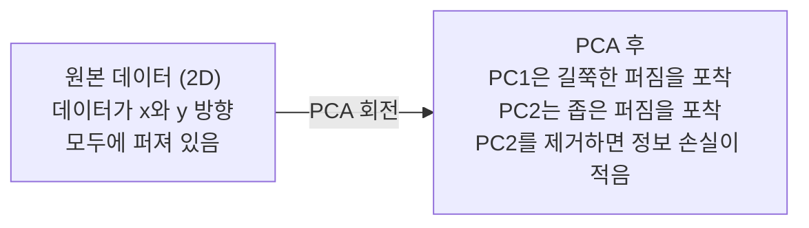

# 차원 축소(Dimensionality Reduction)

> 고차원 데이터는 구조를 가지고 있습니다. 올바른 각도에서 바라보면 발견할 수 있습니다.

**유형:** Build  
**언어:** Python  
**선수 지식:** Phase 1, 레슨 01 (선형 대수 직관), 02 (벡터, 행렬 & 연산), 03 (고유값 & 고유벡터), 06 (확률 & 분포)  
**소요 시간:** ~90분

## 학습 목표

- PCA를 직접 구현: 데이터 중심화, 공분산 행렬 계산, 고유값 분해, 투영
- 설명된 분산 비율과 엘보우 방법을 사용하여 주성분 개수 선택
- MNIST 숫자 시각화를 위한 PCA, t-SNE, UMAP 비교 및 트레이드오프 설명
- 표준 PCA로 처리할 수 없는 비선형 데이터 구조 분리를 위한 RBF 커널을 사용한 커널 PCA 적용

## 문제 정의

샘플당 784개의 특성을 가진 데이터셋이 있습니다. 아마도 손글씨 숫자의 픽셀 값일 수도 있고, 유전자 발현 수준일 수도 있으며, 사용자 행동 신호일 수도 있습니다. 784차원을 시각화할 수 없습니다. 플롯으로 나타낼 수도 없고, 심지어 생각하기도 어렵습니다.

하지만 그 784개 특성 중 대부분은 중복됩니다. 실제 정보는 훨씬 더 작은 공간에 존재합니다. 손글씨 "7"은 784개의 독립적인 숫자로 설명할 필요가 없습니다. 몇 가지 특성만 필요합니다: 획의 각도, 가로선 길이, 기울기 정도 등. 나머지는 노이즈일 뿐입니다.

차원 축소(dimensionality reduction)는 그 작은 공간을 찾아냅니다. 784차원 데이터를 2, 10, 50차원으로 압축하면서도 중요한 구조는 보존합니다.

## 개념

### 차원의 저주

고차원 공간은 직관적이지 않습니다. 차원이 커질수록 세 가지 문제가 발생합니다.

**거리가 의미를 잃습니다.** 고차원에서는 임의의 두 점 사이의 거리가 동일한 값으로 수렴합니다. 모든 점이 서로 비슷한 거리에 있으면 최근접 이웃 탐색이 작동하지 않습니다.

```
차원    평균 거리 비율 (임의의 점 간 최대/최소)
2      ~5.0
10     ~1.8
100    ~1.2
1000   ~1.02
```

**부피가 모서리에 집중됩니다.** d차원 단위 초입방체에는 2^d개의 모서리가 있습니다. 100차원에서는 거의 모든 부피가 중심에서 멀리 떨어진 모서리에 집중됩니다. 데이터 포인트는 가장자리로 퍼지고 모델은 내부 데이터를 학습하지 못합니다.

**지수적으로 더 많은 데이터가 필요합니다.** 공간에서 샘플 밀도를 유지하려면 2D에서 20D로 갈 때 10^18배 더 많은 데이터가 필요합니다. 충분한 데이터를 가질 수 없습니다. 차원을 줄이면 작업 가능한 데이터 밀도로 되돌릴 수 있습니다.

### PCA: 중요한 방향 찾기

주성분 분석(PCA)은 데이터가 가장 많이 변하는 축을 찾습니다. 좌표계를 회전시켜 첫 번째 축이 가장 큰 분산을 포착하고, 두 번째 축이 그 다음 분산을 포착하도록 합니다.

알고리즘:

```
1. 데이터 중심화        (각 특성에서 평균 빼기)
2. 공분산 계산         (특성들이 함께 움직이는 방식)
3. 고유값 분해         (주 방향 찾기)
4. 고유값 기준 정렬     (가장 큰 분산부터)
5. 투영               (상위 k개 고유벡터 유지, 나머지 제거)
```

왜 고유값 분해를 사용하나요? 공분산 행렬은 대칭이고 양의 준정부호입니다. 고유벡터는 특성 공간에서 직교하는 방향입니다. 고유값은 각 방향이 포착하는 분산의 양을 나타냅니다. 가장 큰 고유값을 가진 고유벡터는 최대 분산 방향(가장 길쭉한 방향)을 가리킵니다.



- **PCA 전:** 데이터 클라우드가 x와 y 축 모두에 걸쳐 대각선으로 퍼짐
- **PCA 후:** 좌표계가 회전되어 PC1은 최대 분산 방향(길쭉한 퍼짐)과 정렬되고 PC2는 최소 분산 방향(좁은 퍼짐)과 정렬됨
- **차원 축소:** PC2를 제거하면 데이터를 PC1에 투영하여 매우 적은 정보만 손실됨

### 설명 분산 비율

각 주성분은 전체 분산의 일부를 포착합니다. 설명 분산 비율은 그 양을 알려줍니다.

```
성분    고유값    설명 비율    누적
PC1    4.73      0.473        0.473
PC2    2.51      0.251        0.724
PC3    1.12      0.112        0.836
PC4    0.89      0.089        0.925
...
```

누적 설명 분산이 0.95에 도달하면 많은 성분이 정보의 95%를 포착한다는 것을 알 수 있습니다. 그 이후의 성분은 대부분 노이즈입니다.

### 성분 수 선택

세 가지 전략:

1. **임계값.** 분산의 90-95%를 설명하는 성분만 유지합니다.
2. **엘보우 방법.** 성분별 설명 분산을 플롯합니다. 급격한 감소 지점을 찾습니다.
3. **하류 작업 성능.** PCA를 전처리 단계로 사용합니다. k를 스윕하고 모델 정확도를 측정합니다. 정확도가 정체되는 지점이 최적의 k입니다.

### t-SNE: 이웃 보존

t-분포 확률적 이웃 임베딩(t-SNE)은 시각화를 위해 설계되었습니다. 고차원 데이터를 2D(또는 3D)로 매핑하면서 어떤 점들이 서로 가까운지 보존합니다.

직관: 원본 공간에서 점 쌍 간의 거리에 기반한 확률 분포를 계산합니다. 가까운 점은 높은 확률을, 먼 점은 낮은 확률을 가집니다. 그런 다음 동일한 확률 분포가 유지되는 2D 배열을 찾습니다. 784차원에서 이웃이었던 점들은 2D에서도 이웃으로 유지됩니다.

t-SNE의 주요 특성:
- 비선형. PCA가 할 수 없는 복잡한 매니폴드를 펼칠 수 있습니다.
- 확률적. 다른 실행은 다른 레이아웃을 생성합니다.
- 퍼플렉서티 매개변수는 고려할 이웃 수를 제어합니다 (일반적인 범위: 5-50).
- 출력에서 클러스터 간 거리는 의미가 없습니다. 클러스터 자체만 의미가 있습니다.
- 대규모 데이터셋에서 느림. 기본적으로 O(n^2)입니다.

### UMAP: 더 빠르고 전역 구조 보존

균일 매니폴드 근사 및 투영(UMAP)은 t-SNE와 유사하게 작동하지만 두 가지 장점이 있습니다:
- 더 빠름. 모든 쌍별 거리 계산 대신 근사 최근접 이웃 그래프를 사용합니다.
- 더 나은 전역 구조. 출력에서 클러스터 간 상대적 위치가 t-SNE보다 더 의미 있는 경향이 있습니다.

UMAP은 고차원 공간에서 가중치 그래프("퍼지 위상 표현")를 생성한 다음 이 그래프를 최대한 보존하는 저차원 레이아웃을 찾습니다.

주요 매개변수:
- `n_neighbors`: 지역 구조를 정의하는 이웃 수 (퍼플렉서티와 유사). 값이 높을수록 전역 구조를 더 보존합니다.
- `min_dist`: 출력에서 점들이 얼마나 밀집하게 배치되는지. 값이 낮을수록 더 밀집한 클러스터가 생성됩니다.

### 어떤 방법을 언제 사용할까

| 방법 | 사용 사례 | 보존 | 속도 |
|------|----------|------|------|
| PCA | 학습 전 전처리 | 전역 분산 | 빠름 (정확, 수백만 샘플 처리 가능) |
| PCA | 빠른 탐색적 시각화 | 선형 구조 | 빠름 |
| t-SNE | 출판용 2D 플롯 | 지역 이웃 | 느림 (< 10k 샘플 권장) |
| UMAP | 대규모 2D 시각화 | 지역 + 일부 전역 구조 | 중간 (수백만 처리 가능) |
| PCA | 모델용 특성 축소 | 분산 순위 특성 | 빠름 |
| t-SNE / UMAP | 클러스터 구조 이해 | 클러스터 분리 | 중간에서 느림 |

경험적 규칙: 전처리와 데이터 압축에는 PCA를 사용합니다. 2D로 구조를 시각화해야 할 때는 t-SNE 또는 UMAP을 사용합니다.

### 커널 PCA

표준 PCA는 선형 부분공간을 찾습니다. 좌표계를 회전하고 축을 제거합니다. 하지만 데이터가 비선형 매니폴드에 있다면 어떻게 할까요? 2D 원은 어떤 선으로도 분리할 수 없습니다. 표준 PCA는 도움이 되지 않습니다.

커널 PCA는 커널 함수로 유도된 고차원 특성 공간에서 PCA를 적용하지만, 해당 공간의 좌표를 명시적으로 계산하지 않습니다. 이는 커널 트릭으로, SVM의 아이디어와 동일합니다.

알고리즘:
1. 커널 행렬 K 계산 (K_ij = k(x_i, x_j))
2. 특성 공간에서 커널 행렬 중심화
3. 중심화된 커널 행렬 고유값 분해
4. 상위 고유벡터(1/sqrt(고유값)으로 스케일링)가 투영입니다

일반적인 커널 함수:

| 커널 | 수식 | 적합한 경우 |
|------|------|-------------|
| RBF (가우시안) | exp(-gamma * \|\|x - y\|\|^2) | 대부분의 비선형 데이터, 매끄러운 매니폴드 |
| 다항식 | (x . y + c)^d | 다항식 관계 |
| 시그모이드 | tanh(alpha * x . y + c) | 신경망 유사 매핑 |

표준 PCA와 커널 PCA 사용 시기:

| 기준 | 표준 PCA | 커널 PCA |
|------|----------|----------|
| 데이터 구조 | 선형 부분공간 | 비선형 매니폴드 |
| 속도 | O(min(n^2 d, d^2 n)) | O(n^2 d + n^3) |
| 해석 가능성 | 성분은 특성의 선형 조합 | 성분은 직접적인 특성 해석 불가 |
| 확장성 | 수백만 샘플 처리 가능 | 커널 행렬이 n x n, 메모리 제한 |
| 재구성 | 직접 역변환 가능 | 사전 이미지 근사 필요 |

대표적인 예: 2D 동심원. 두 개의 원이 서로 다른 반경에 있습니다. 표준 PCA는 두 원을 동일한 선에 투영하여 분류에 무의미합니다. RBF 커널을 사용한 커널 PCA는 내부 원과 외부 원을 서로 다른 영역으로 매핑하여 선형 분리가 가능하게 합니다.

### 재구성 오차

차원 축소의 품질은 어떻게 평가할까요? 784차원을 50차원으로 압축했을 때 무엇을 잃었나요?

재구성 오차 측정:
1. 데이터를 k차원으로 투영: X_reduced = X @ W_k
2. 재구성: X_hat = X_reduced @ W_k^T
3. MSE 계산: mean((X - X_hat)^2)

PCA의 경우 재구성 오차는 설명 분산과 다음과 같은 관계가 있습니다:

```
재구성 오차 = 포함되지 않은 고유값들의 합
총 분산 = 모든 고유값들의 합
손실 비율 = (제외된 고유값들의 합) / (모든 고유값들의 합)
```

각 성분의 설명 분산 비율은:

```
explained_ratio_k = eigenvalue_k / sum(all eigenvalues)
```

누적 설명 분산을 성분 수에 대해 플롯하면 "엘보우" 곡선이 생성됩니다. 적절한 성분 수는 다음 중 하나입니다:
- 곡선이 평평해지는 지점 (감소하는 수익)
- 누적 분산이 임계값(일반적으로 0.90 또는 0.95)을 넘는 지점
- 하류 작업 성능이 정체되는 지점

재구성 오차는 k 선택 외에도 유용합니다. 이상치 탐지에 사용할 수 있습니다: 재구성 오차가 높은 샘플은 학습된 부분공간에 맞지 않는 이상치입니다. 이는 프로덕션 시스템에서 PCA 기반 이상치 탐지의 기초입니다.

## 구축

### 1단계: 처음부터 시작하는 PCA

```python
import numpy as np

class PCA:
    def __init__(self, n_components):
        self.n_components = n_components
        self.components = None
        self.mean = None
        self.eigenvalues = None
        self.explained_variance_ratio_ = None

    def fit(self, X):
        self.mean = np.mean(X, axis=0)
        X_centered = X - self.mean

        cov_matrix = np.cov(X_centered, rowvar=False)

        eigenvalues, eigenvectors = np.linalg.eigh(cov_matrix)

        sorted_idx = np.argsort(eigenvalues)[::-1]
        eigenvalues = eigenvalues[sorted_idx]
        eigenvectors = eigenvectors[:, sorted_idx]

        self.components = eigenvectors[:, :self.n_components].T
        self.eigenvalues = eigenvalues[:self.n_components]
        total_var = np.sum(eigenvalues)
        self.explained_variance_ratio_ = self.eigenvalues / total_var

        return self

    def transform(self, X):
        X_centered = X - self.mean
        return X_centered @ self.components.T

    def fit_transform(self, X):
        self.fit(X)
        return self.transform(X)
```

### 2단계: 합성 데이터 테스트

```python
np.random.seed(42)
n_samples = 500

t = np.random.uniform(0, 2 * np.pi, n_samples)
x1 = 3 * np.cos(t) + np.random.normal(0, 0.2, n_samples)
x2 = 3 * np.sin(t) + np.random.normal(0, 0.2, n_samples)
x3 = 0.5 * x1 + 0.3 * x2 + np.random.normal(0, 0.1, n_samples)

X_synthetic = np.column_stack([x1, x2, x3])

pca = PCA(n_components=2)
X_reduced = pca.fit_transform(X_synthetic)

print(f"원본 형태: {X_synthetic.shape}")
print(f"축소 형태:  {X_reduced.shape}")
print(f"설명된 분산 비율: {pca.explained_variance_ratio_}")
print(f"포착된 총 분산: {sum(pca.explained_variance_ratio_):.4f}")
```

### 3단계: 2D MNIST 숫자

```python
from sklearn.datasets import fetch_openml

mnist = fetch_openml("mnist_784", version=1, as_frame=False, parser="auto")
X_mnist = mnist.data[:5000].astype(float)
y_mnist = mnist.target[:5000].astype(int)

pca_mnist = PCA(n_components=50)
X_pca50 = pca_mnist.fit_transform(X_mnist)
print(f"50개 구성 요소가 분산의 {sum(pca_mnist.explained_variance_ratio_):.2%}를 포착")

pca_2d = PCA(n_components=2)
X_pca2d = pca_2d.fit_transform(X_mnist)
print(f"2개 구성 요소가 분산의 {sum(pca_2d.explained_variance_ratio_):.2%}를 포착")
```

### 4단계: scikit-learn과 비교

```python
from sklearn.decomposition import PCA as SklearnPCA
from sklearn.manifold import TSNE

sklearn_pca = SklearnPCA(n_components=2)
X_sklearn_pca = sklearn_pca.fit_transform(X_mnist)

print(f"\n우리 PCA 설명 분산:     {pca_2d.explained_variance_ratio_}")
print(f"Scikit-learn PCA 설명 분산: {sklearn_pca.explained_variance_ratio_}")

diff = np.abs(np.abs(X_pca2d) - np.abs(X_sklearn_pca))
print(f"최대 절대 차이: {diff.max():.10f}")

tsne = TSNE(n_components=2, perplexity=30, random_state=42)
X_tsne = tsne.fit_transform(X_mnist)
print(f"\nt-SNE 출력 형태: {X_tsne.shape}")
```

### 5단계: UMAP 비교

```python
try:
    from umap import UMAP

    reducer = UMAP(n_components=2, n_neighbors=15, min_dist=0.1, random_state=42)
    X_umap = reducer.fit_transform(X_mnist)
    print(f"UMAP 출력 형태: {X_umap.shape}")
except ImportError:
    print("umap-learn 설치: pip install umap-learn")
```

## 사용 방법

분류기 전처리로서 PCA 활용:

```python
from sklearn.decomposition import PCA as SklearnPCA
from sklearn.linear_model import LogisticRegression
from sklearn.model_selection import train_test_split
from sklearn.metrics import accuracy_score

X_train, X_test, y_train, y_test = train_test_split(
    X_mnist, y_mnist, test_size=0.2, random_state=42
)

results = {}
for k in [10, 30, 50, 100, 200]:
    pca_k = SklearnPCA(n_components=k)
    X_tr = pca_k.fit_transform(X_train)
    X_te = pca_k.transform(X_test)

    clf = LogisticRegression(max_iter=1000, random_state=42)
    clf.fit(X_tr, y_train)
    acc = accuracy_score(y_test, clf.predict(X_te))
    var_captured = sum(pca_k.explained_variance_ratio_)
    results[k] = (acc, var_captured)
    print(f"k={k:>3d}  accuracy={acc:.4f}  variance={var_captured:.4f}")
```

성능은 784차원에 도달하기 훨씬 전에 정체기에 도달합니다. 그 정체기가 바로 운영 지점(operating point)입니다.

## Ship It

이 레슨은 다음을 생성합니다:
- `outputs/skill-dimensionality-reduction.md` - 주어진 작업에 적합한 차원 축소 기법 선택을 위한 스킬

## 연습 문제

1. PCA 클래스를 수정하여 `inverse_transform`을 지원하도록 구현하세요. 10, 50, 200개의 주성분으로 MNIST 숫자 데이터를 재구성하세요. 각 경우에 대한 재구성 오차(원본과의 평균 제곱 차이)를 출력하세요.

2. 동일한 MNIST 부분 집합에 대해 t-SNE를 실행하되, 퍼플렉서티(perplexity) 값을 5, 30, 100으로 설정하세요. 출력 결과가 어떻게 변하는지 설명하세요. 퍼플렉서티가 클러스터 밀집도에 어떤 영향을 미치는지 설명하세요.

3. 50개의 특성 중 5개만 유의미한 데이터셋을 생성하세요(`sklearn.datasets.make_classification` 사용). PCA를 적용하고 설명된 분산 곡선이 데이터가 효과적으로 5차원임을 올바르게 식별하는지 확인하세요.

## 주요 용어

| 용어 | 사람들이 말하는 것 | 실제 의미 |
|------|----------------|----------------------|
| 차원의 저주(Curse of dimensionality) | "너무 많은 특성" | 차원이 증가함에 따라 거리, 부피, 데이터 밀도가 모두 직관적으로 예상과 다르게 동작함. 모델은 이를 보상하기 위해 기하급수적으로 더 많은 데이터가 필요함. |
| PCA(Principal Component Analysis) | "차원 축소" | 좌표계를 회전시켜 축이 최대 분산 방향과 일치하도록 한 후, 분산이 낮은 축을 제거함. |
| 주성분(Principal component) | "중요한 방향" | 공분산 행렬(Covariance matrix)의 고유벡터(eigenvector). 데이터가 가장 많이 변하는 특성 공간의 방향. |
| 설명 분산 비율(Explained variance ratio) | "이 성분이 가진 정보량" | 하나의 주성분(Principal component)이 포착한 전체 분산의 비율. 상위 k개 비율을 합산하여 k개 성분이 보존하는 정보량을 확인. |
| 공분산 행렬(Covariance matrix) | "특성 간 상관관계" | 대칭 행렬로, (i,j) 항목은 특성 i와 j가 함께 움직이는 정도를 측정함. 대각선 항목은 개별 분산. |
| t-SNE(t-Distributed Stochastic Neighbor Embedding) | "그 군집 시각화" | 고차원 데이터를 2D로 매핑할 때 쌍별 이웃 확률을 보존하는 비선형 방법. 시각화에 적합하지만 전처리에는 부적합. |
| UMAP(Uniform Manifold Approximation and Projection) | "더 빠른 t-SNE" | 위상 데이터 분석(Topological data analysis) 기반의 비선형 방법. 지역적 및 일부 전역 구조를 보존함. t-SNE보다 확장성이 좋음. |
| 퍼플렉서티(Perplexity) | "t-SNE 조절 장치" | 각 데이터 포인트가 고려하는 유효 이웃 수를 제어함. 낮은 퍼플렉서티는 매우 지역적인 구조에 집중. 높은 퍼플렉서티는 더 넓은 패턴을 포착. |
| 매니폴드(Manifold) | "데이터가 존재하는 표면" | 고차원 공간에 매장된 저차원 표면. 3D에서 구겨진 종이 한 장은 2D 매니폴드.

## 추가 자료

- [주성분 분석(PCA) 튜토리얼](https://arxiv.org/abs/1404.1100) (Shlens) - PCA의 기초부터 명확한 유도 과정
- [t-SNE 효과적으로 사용하는 방법](https://distill.pub/2016/misread-tsne/) (Wattenberg et al.) - t-SNE의 함정과 매개변수 선택에 대한 대화형 가이드
- [UMAP 문서](https://umap-learn.readthedocs.io/) - UMAP 저자들의 이론 및 실용적 지침