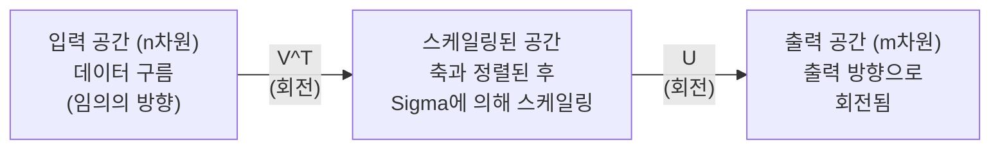
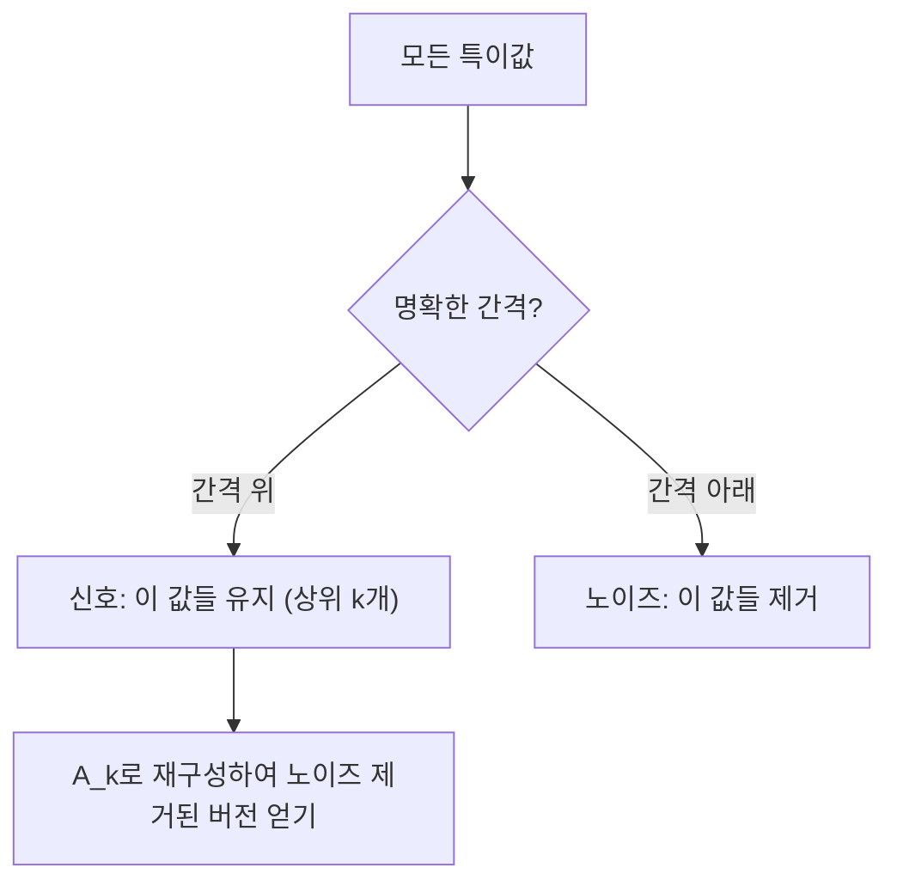

# 특이값 분해(Singular Value Decomposition)

> SVD는 선형 대수의 스위스 군용 칼입니다. 모든 행렬은 SVD를 가집니다. 모든 데이터 과학자는 SVD가 필요합니다.

**유형:** Build  
**언어:** Python, Julia  
**선수 지식:** Phase 1, 레슨 01 (선형 대수 직관), 02 (벡터 & 행렬 연산), 03 (행렬 변환)  
**소요 시간:** ~120분

## 학습 목표

- **거듭제곱법(power iteration)**을 통한 SVD 구현 및 **U**, **Sigma**, **V^T**의 기하학적 의미 설명  
- **절단 SVD(truncated SVD)**를 활용한 이미지 압축 및 압축 비율(compression ratio) 대 재구성 오차(reconstruction error) 측정  
- SVD를 통한 **무어-펜로즈 유사역행렬(Moore-Penrose pseudoinverse)** 계산 및 과결정(overdetermined) 최소제곱 시스템 해결  
- SVD를 **PCA**, 추천 시스템(잠재 요인, latent factors), NLP의 **잠재 의미 분석(Latent Semantic Analysis, LSA)**과 연결

## 문제 정의

1000x2000 행렬이 있습니다. 이 행렬은 사용자-영화 평점일 수도 있고, 문서-단어 빈도 표일 수도 있으며, 이미지의 픽셀 값일 수도 있습니다. 이 행렬을 압축하거나, 노이즈를 제거하거나, 숨겨진 구조를 찾거나, 최소 제곱 시스템을 해결해야 할 수 있습니다. 고유분해(eigendecomposition)는 정방 행렬에서만 작동합니다. 게다가 행렬이 완전한 선형 독립 고유벡터 집합을 가져야 합니다.

SVD(특이값 분해)는 모든 행렬에 적용할 수 있습니다. 어떤 형태든, 어떤 계수든 상관없이 조건이 필요 없습니다. SVD는 행렬이 공간에 미치는 기하학적 특성을 드러내는 세 가지 인수로 분해합니다. 이는 선형 대수에서 가장 일반적이며 가장 유용한 분해 방법입니다.

## 개념

### SVD가 기하학적으로 수행하는 작업

모든 행렬은 형태에 관계없이 회전, 스케일링, 회전이라는 세 가지 연산을 순차적으로 수행합니다. SVD는 이 분해를 명시적으로 나타냅니다.

```
A = U * Sigma * V^T

      m x n     m x m    m x n    n x n
     (임의의)  (회전)  (스케일링)  (회전)
```

임의의 행렬 A에 대해 SVD는 다음과 같이 분해합니다:
- V^T는 입력 공간(n차원)에서 벡터를 회전시킵니다.
- Sigma는 각 축을 따라 스케일링(늘이거나 압축)합니다.
- U는 결과를 출력 공간(m차원)으로 회전시킵니다.



이렇게 생각해 보세요. SVD에 행렬을 건네면, SVD는 다음과 같이 알려줍니다: "이 행렬은 입력의 구를 먼저 V^T로 회전시킨 다음, Sigma로 타원체로 늘인 후, U로 타원체를 회전시킵니다." 특이값은 타원체 축의 길이입니다.

### 전체 분해

m x n 크기의 행렬 A에 대해:

```
A = U * Sigma * V^T

여기서:
  U     는 m x m, 직교 행렬 (U^T U = I)
  Sigma 는 m x n, 대각 행렬 (대각선에 특이값)
  V     는 n x n, 직교 행렬 (V^T V = I)

특이값은 sigma_1 >= sigma_2 >= ... >= sigma_r > 0
여기서 r = rank(A)
```

U의 열(column)은 왼쪽 특이벡터(left singular vectors)라고 합니다. V의 열은 오른쪽 특이벡터(right singular vectors)라고 합니다. Sigma의 대각 항목은 특이값(singular values)입니다. 이들은 항상 음이 아니며, 관례적으로 내림차순으로 정렬됩니다.

### 왼쪽 특이벡터, 특이값, 오른쪽 특이벡터

SVD의 각 구성 요소는 고유한 기하학적 의미를 가집니다.

**오른쪽 특이벡터 (V의 열):** 이들은 입력 공간(R^n)에 대한 정규직교 기저(orthonormal basis)를 형성합니다. 행렬이 출력 공간에서 직교 방향으로 매핑하는 입력 공간의 방향입니다. 정의역(domain)에 대한 자연스러운 좌표계로 생각할 수 있습니다.

**특이값 (Sigma의 대각 항목):** 이들은 스케일링 계수입니다. i번째 특이값은 행렬이 i번째 오른쪽 특이벡터 방향으로 벡터를 얼마나 늘리는지 나타냅니다. 특이값이 0이면 행렬이 해당 방향을 완전히 압축합니다.

**왼쪽 특이벡터 (U의 열):** 이들은 출력 공간(R^m)에 대한 정규직교 기저를 형성합니다. i번째 왼쪽 특이벡터는 i번째 오른쪽 특이벡터가 (스케일링 후) 매핑되는 출력 공간의 방향입니다.

이들 간의 관계:

```
A * v_i = sigma_i * u_i

행렬 A는 i번째 오른쪽 특이벡터 v_i를
sigma_i만큼 스케일링하여 i번째 왼쪽 특이벡터 u_i로 매핑합니다.
```

이를 통해 임의의 행렬이 수행하는 작업을 좌표별로 파악할 수 있습니다.

### 외적(outer product) 형태

SVD는 랭크-1 행렬의 합으로 표현할 수 있습니다:

```
A = sigma_1 * u_1 * v_1^T + sigma_2 * u_2 * v_2^T + ... + sigma_r * u_r * v_r^T

각 항 sigma_i * u_i * v_i^T는 랭크-1 행렬(외적)입니다.
전체 행렬은 r개의 이러한 행렬의 합이며, r은 행렬의 랭크입니다.
```

이 형태는 저랭크 근사(low-rank approximation)의 기초가 됩니다. 각 항은 구조의 한 계층을 추가합니다. 첫 번째 항은 가장 중요한 패턴을 포착합니다. 두 번째 항은 다음으로 중요한 패턴을 포착합니다. 이와 같이 계속됩니다. 이 합을 잘라내면 주어진 랭크에서 가능한 최적의 근사를 얻을 수 있습니다.

```
랭크-1 근사:    A_1 = sigma_1 * u_1 * v_1^T
                  (주요 패턴 포착)

랭크-2 근사:    A_2 = sigma_1 * u_1 * v_1^T + sigma_2 * u_2 * v_2^T
                  (두 가지 주요 패턴 포착)

랭크-k 근사:    A_k = 상위 k개 항의 합
                  (Eckart-Young 정리에 따른 최적 근사)
```

### 고유값 분해(eigendecomposition)와의 관계

SVD와 고유값 분해는 깊이 연결되어 있습니다. A의 특이값과 벡터는 A^T A와 A A^T의 고유값과 고유벡터에서 직접 유도됩니다.

```
A^T A = V * Sigma^T * U^T * U * Sigma * V^T
      = V * Sigma^T * Sigma * V^T
      = V * D * V^T

여기서 D = Sigma^T * Sigma는 대각 행렬이며, 대각선에 sigma_i^2가 있습니다.

따라서:
- 오른쪽 특이벡터(V)는 A^T A의 고유벡터입니다.
- 특이값의 제곱(sigma_i^2)은 A^T A의 고유값입니다.

마찬가지로:
A A^T = U * Sigma * V^T * V * Sigma^T * U^T
      = U * Sigma * Sigma^T * U^T

따라서:
- 왼쪽 특이벡터(U)는 A A^T의 고유벡터입니다.
- A A^T의 고유값 역시 sigma_i^2입니다.
```

이 연결은 다음 세 가지를 알려줍니다:
1. 특이값은 항상 실수이며 음이 아닙니다(A^T A와 A A^T는 양의 준정부호 행렬이므로 고유값의 제곱근입니다).
2. A^T A의 고유값 분해를 통해 SVD를 계산할 수 있지만, 이는 조건수(condition number)를 제곱하여 수치 정밀도를 잃습니다. 전용 SVD 알고리즘은 이를 피합니다.
3. A가 정사각 행렬이고 대칭 양의 준정부호 행렬일 때, SVD와 고유값 분해는 동일한 것입니다.

### 절단 SVD: 저랭크 근사

Eckart-Young-Mirsky 정리에 따르면, A에의 최적 랭크-k 근사(Frobenius 노름과 스펙트럼 노름 모두에서)는 상위 k개 특이값과 해당 벡터만 유지하는 것입니다:

```
A_k = U_k * Sigma_k * V_k^T

여기서:
  U_k     는 m x k  (U의 첫 k개 열)
  Sigma_k 는 k x k  (Sigma의 왼쪽 상단 k x k 블록)
  V_k     는 n x k  (V의 첫 k개 열)

근사 오차 = sigma_{k+1}  (스펙트럼 노름에서)
          = sqrt(sigma_{k+1}^2 + ... + sigma_r^2)  (Frobenius 노름에서)
```

이것은 단지 "좋은" 근사가 아닙니다. 랭크 k에서 가능한 최적의 근사입니다. 다른 어떤 랭크-k 행렬도 A에 더 가깝지 않습니다.

| 구성 요소 | 상대적 크기 | 랭크-3 근사에 포함? |
|-----------|-------------|---------------------|
| sigma_1 | 가장 큼 | 예 |
| sigma_2 | 큼 | 예 |
| sigma_3 | 중간-큼 | 예 |
| sigma_4 | 중간 | 아니오 (오차) |
| sigma_5 | 중간-작음 | 아니오 (오차) |
| sigma_6 | 작음 | 아니오 (오차) |
| sigma_7 | 매우 작음 | 아니오 (오차) |
| sigma_8 | 매우 작음 | 아니오 (오차) |

상위 3개 유지: A_3는 세 개의 가장 큰 특이값을 포착합니다. 오차 = 나머지 값들(sigma_4부터 sigma_8까지).

특이값이 빠르게 감소하면 작은 k로도 행렬의 대부분을 포착할 수 있습니다. 특이값이 천천히 감소하면 행렬은 저랭크 구조가 없습니다.

### SVD를 이용한 이미지 압축

그레이스케일 이미지는 픽셀 강도의 행렬입니다. 800x600 이미지는 480,000개의 값을 가집니다. SVD를 사용하면 훨씬 적은 값으로 근사할 수 있습니다.

```
원본 이미지: 800 x 600 = 480,000개의 값

랭크 k인 SVD:
  U_k:      800 x k개의 값
  Sigma_k:  k개의 값
  V_k:      600 x k개의 값
  총합:    k * (800 + 600 + 1) = k * 1401개의 값

  k=10:   14,010개의 값   (원본의 2.9%)
  k=50:   70,050개의 값  (원본의 14.6%)
  k=100: 140,100개의 값  (원본의 29.2%)

  k가 작아질수록 압축 비율이 개선되지만,
  시각적 품질은 저하됩니다.
```

핵심 통찰: 자연 이미지는 특이값이 빠르게 감소합니다. 처음 몇 개의 특이값은 넓은 구조(형태, 그라데이션)를 포착합니다. 나중 특이값은 세부 사항과 노이즈를 포착합니다. 랭크 50에서 잘라내면 원본과 거의 동일한 이미지를 생성하면서 저장 공간을 85% 절약할 수 있습니다.

### 추천 시스템에서의 SVD

넷플릭스 상(Netflix Prize)으로 유명해졌습니다. 사용자-영화 평점 행렬에서 대부분의 항목이 누락되어 있습니다.

```
             영화1  영화2  영화3  영화4  영화5
  사용자1      [  5      ?       3       ?       1  ]
  사용자2      [  ?      4       ?       2       ?  ]
  사용자3      [  3      ?       5       ?       ?  ]
  사용자4      [  ?      ?       ?       4       3  ]

  ? = 알 수 없는 평점
```

아이디어: 이 평점 행렬은 저랭크입니다. 사용자들은 완전히 독립적인 취향을 가지지 않습니다. 소수의 잠재 요인(액션 vs. 드라마, 오래된 vs. 새로운, 지적인 vs. 직관적인)이 대부분의 선호도를 설명합니다.

(채워진) 평점 행렬에 대한 SVD는 다음과 같이 분해합니다:
- U: 잠재 요인 공간에서의 사용자 프로필
- Sigma: 각 잠재 요인의 중요도
- V^T: 잠재 요인 공간에서의 영화 프로필

사용자와 영화의 예측 평점은 사용자 프로필과 영화 프로필의 내적(특이값으로 가중치 적용)입니다. 저랭크 근사는 누락된 항목을 채웁니다.

실제로는 Simon Funk의 점진적 SVD나 ALS(alternating least squares)와 같은 변형을 사용하여 누락된 데이터를 직접 처리합니다. 하지만 핵심 아이디어는 동일합니다: SVD를 통한 잠재 요인 분해.

### NLP에서의 SVD: 잠재 의미 분석

잠재 의미 분석(LSA), 또는 잠재 의미 인덱싱(LSI)은 단어-문서 행렬에 SVD를 적용합니다.

```
             문서1   문서2   문서3   문서4
  "고양이"      [  3      0      1      0  ]
  "개"          [  2      0      0      1  ]
  "물고기"      [  0      4      1      0  ]
  "애완동물"    [  1      1      1      1  ]
  "바다"        [  0      3      0      0  ]

랭크 k=2인 SVD 후:

  각 문서는 2D "개념 공간"의 한 점이 됩니다.
  각 단어는 동일한 2D 공간의 한 점이 됩니다.
  유사한 주제에 대한 문서는 서로 가까이 클러스터됩니다.
  유사한 의미의 단어는 서로 가까이 클러스터됩니다.

  "고양이"와 "개"는 서로 가까이 위치합니다(육상 애완동물).
  "물고기"와 "바다"는 서로 가까이 위치합니다(수중 개념).
  문서1과 문서3은 유사한 주제를 공유하면 클러스터됩니다.
```

LSA는 원시 텍스트에서 의미적 유사성을 포착하는 최초의 성공적인 방법 중 하나였습니다. 동의어인 단어들이 유사한 문서에 나타나는 경향이 있어 SVD가 이들을 동일한 잠재 차원으로 그룹화하기 때문입니다. 현대의 단어 임베딩(Word2Vec, GloVe)은 이 아이디어의 후손으로 볼 수 있습니다.

### 노이즈 감소를 위한 SVD

노이즈가 있는 데이터는 상위 특이값에 신호가 집중되고, 노이즈는 모든 특이값에 분산됩니다. 잘라내면 노이즈 바닥을 제거할 수 있습니다.

**깨끗한 신호 특이값:**

| 구성 요소 | 크기 | 유형 |
|-----------|------|------|
| sigma_1 | 매우 큼 | 신호 |
| sigma_2 | 큼 | 신호 |
| sigma_3 | 중간 | 신호 |
| sigma_4 | 거의 0 | 무시할 수 있음 |
| sigma_5 | 거의 0 | 무시할 수 있음 |

**노이즈가 있는 신호 특이값 (노이즈가 전체에 추가됨):**

| 구성 요소 | 크기 | 유형 |
|-----------|------|------|
| sigma_1 | 매우 큼 | 신호 |
| sigma_2 | 큼 | 신호 |
| sigma_3 | 중간 | 신호 |
| sigma_4 | 작음 | 노이즈 |
| sigma_5 | 작음 | 노이즈 |
| sigma_6 | 작음 | 노이즈 |
| sigma_7 | 작음 | 노이즈 |



이것은 신호 처리, 과학적 측정, 데이터 정리에서 사용됩니다. 덧셈 노이즈로 손상된 행렬이 있을 때마다 절단 SVD는 신호와 노이즈를 분리하는 원리적인 방법입니다.

### SVD를 통한 의사역행렬(pseudoinverse)

무어-펜로즈 의사역행렬(Moore-Penrose pseudoinverse) A+는 행렬 역행렬을 비정사각 행렬과 특이 행렬로 일반화합니다. SVD는 이를 계산하는 것을 간단하게 합니다.

```
A = U * Sigma * V^T이면:

A+ = V * Sigma+ * U^T

여기서 Sigma+는 다음과 같이 형성됩니다:
  1. Sigma를 전치(행과 열 교환)
  2. 0이 아닌 각 대각 항목 sigma_i를 1/sigma_i로 대체
  3. 0은 그대로 유지

A (m x n)에 대해:      A+는 (n x m)
Sigma (m x n)에 대해:  Sigma+는 (n x m)
```

의사역행렬은 최소 제곱 문제를 해결합니다. Ax = b에 정확한 해가 없을 때(과결정 시스템), x = A+ b는 최소 제곱 해(||Ax - b||를 최소화)입니다.

```
과결정 시스템 (방정식 수 > 미지수 수):

  [1  1]         [3]
  [2  1] x   =   [5]       정확한 해는 존재하지 않습니다.
  [3  1]         [6]

  x_ls = A+ b = V * Sigma+ * U^T * b

  이는 제곱 잔차의 합을 최소화하는 x를 제공합니다.
  정규 방정식(A^T A)^(-1) A^T b와 동일한 결과이지만,
  수치적으로 더 안정적입니다.
```

### 수치적 안정성 장점

A^T A의 고유값 분해를 계산하면 특이값이 제곱됩니다(A^T A의 고유값은 sigma_i^2). 이는 조건수를 제곱하여 수치적 오차를 증폭시킵니다.

```
예시:
  A의 특이값: [1000, 1, 0.001]
  A의 조건수: 1000 / 0.001 = 10^6

  A^T A의 고유값: [10^6, 1, 10^{-6}]
  A^T A의 조건수: 10^6 / 10^{-6} = 10^{12}

  SVD 직접 계산: 조건수 10^6으로 작동
  A^T A를 통한 계산: 조건수 10^{12}으로 작동
                     (정밀도 6자리 손실)
```

현대 SVD 알고리즘(Golub-Kahan 양방향 반복)은 A에 직접 작동하며 A^T A를 형성하지 않습니다. 이것이 `np.linalg.svd(A)`를 `np.linalg.eig(A.T @ A)`보다 항상 선호해야 하는 이유입니다.

### PCA와의 연결

PCA는 중심화된 데이터에 대한 SVD입니다. 이것은 비유가 아닙니다. 문자 그대로 동일한 계산입니다.

```
데이터 행렬 X (n_samples x n_features), 중심화(평균 제거됨) 시:

공분산 행렬: C = (1/(n-1)) * X^T X

PCA는 C의 고유벡터를 찾습니다. 하지만:

  X = U * Sigma * V^T    (X의 SVD)

  X^T X = V * Sigma^2 * V^T

  C = (1/(n-1)) * V * Sigma^2 * V^T

따라서 주성분(principal components)은 정확히 오른쪽 특이벡터 V입니다.
각 성분의 설명된 분산(explained variance)은 sigma_i^2 / (n-1)입니다.

scikit-learn에서 PCA는 고유값 분해가 아닌 SVD를 사용하여 구현됩니다.
더 빠르고 수치적으로 안정적입니다.
```

이것은 10장에서 배운 차원 축소에 대한 모든 내용이 SVD로 구현된다는 것을 의미합니다. PCA는 머신러닝에서 SVD의 가장 일반적인 응용입니다.

## 구축

### 단계 1: 거듭제곱법을 사용한 SVD 직접 구현

아이디어: 가장 큰 특이값과 해당 벡터를 찾기 위해 A^T A(또는 A A^T)에 거듭제곱법을 적용합니다. 그런 다음 행렬을 축소(deflate)하고 다음 특이값에 대해 반복합니다.

```python
import numpy as np

def power_iteration(M, num_iters=100):
    n = M.shape[1]
    v = np.random.randn(n)
    v = v / np.linalg.norm(v)

    for _ in range(num_iters):
        Mv = M @ v
        v = Mv / np.linalg.norm(Mv)

    eigenvalue = v @ M @ v
    return eigenvalue, v

def svd_from_scratch(A, k=None):
    m, n = A.shape
    if k is None:
        k = min(m, n)

    sigmas = []
    us = []
    vs = []

    A_residual = A.copy().astype(float)

    for _ in range(k):
        AtA = A_residual.T @ A_residual
        eigenvalue, v = power_iteration(AtA, num_iters=200)

        if eigenvalue < 1e-10:
            break

        sigma = np.sqrt(eigenvalue)
        u = A_residual @ v / sigma

        sigmas.append(sigma)
        us.append(u)
        vs.append(v)

        A_residual = A_residual - sigma * np.outer(u, v)

    U = np.column_stack(us) if us else np.empty((m, 0))
    S = np.array(sigmas)
    V = np.column_stack(vs) if vs else np.empty((n, 0))

    return U, S, V
```

### 단계 2: NumPy와 테스트 및 비교

```python
np.random.seed(42)
A = np.random.randn(5, 4)

U_ours, S_ours, V_ours = svd_from_scratch(A)
U_np, S_np, Vt_np = np.linalg.svd(A, full_matrices=False)

print("우리의 특이값:", np.round(S_ours, 4))
print("NumPy 특이값:", np.round(S_np, 4))

A_reconstructed = U_ours @ np.diag(S_ours) @ V_ours.T
print(f"재구성 오차: {np.linalg.norm(A - A_reconstructed):.8f}")
```

### 단계 3: 이미지 압축 데모

```python
def compress_image_svd(image_matrix, k):
    U, S, Vt = np.linalg.svd(image_matrix, full_matrices=False)
    compressed = U[:, :k] @ np.diag(S[:k]) @ Vt[:k, :]
    return compressed

image = np.random.seed(42)
rows, cols = 200, 300
image = np.random.randn(rows, cols)

for k in [1, 5, 10, 20, 50]:
    compressed = compress_image_svd(image, k)
    error = np.linalg.norm(image - compressed) / np.linalg.norm(image)
    original_size = rows * cols
    compressed_size = k * (rows + cols + 1)
    ratio = compressed_size / original_size
    print(f"k={k:>3d}  오차={error:.4f}  저장공간={ratio:.1%}")
```

### 단계 4: 노이즈 감소

```python
np.random.seed(42)
clean = np.outer(np.sin(np.linspace(0, 4*np.pi, 100)),
                 np.cos(np.linspace(0, 2*np.pi, 80)))
noise = 0.3 * np.random.randn(100, 80)
noisy = clean + noise

U, S, Vt = np.linalg.svd(noisy, full_matrices=False)
denoised = U[:, :5] @ np.diag(S[:5]) @ Vt[:5, :]

print(f"노이즈 오차:    {np.linalg.norm(noisy - clean):.4f}")
print(f"노이즈 제거 오차: {np.linalg.norm(denoised - clean):.4f}")
print(f"개선율:    {(1 - np.linalg.norm(denoised - clean) / np.linalg.norm(noisy - clean)):.1%}")
```

### 단계 5: 의사역행렬

```python
A = np.array([[1, 1], [2, 1], [3, 1]], dtype=float)
b = np.array([3, 5, 6], dtype=float)

U, S, Vt = np.linalg.svd(A, full_matrices=False)
S_inv = np.diag(1.0 / S)
A_pinv = Vt.T @ S_inv @ U.T

x_svd = A_pinv @ b
x_lstsq = np.linalg.lstsq(A, b, rcond=None)[0]
x_pinv = np.linalg.pinv(A) @ b

print(f"SVD 의사역행렬 해:  {x_svd}")
print(f"np.linalg.lstsq 해:   {x_lstsq}")
print(f"np.linalg.pinv 해:    {x_pinv}")
```

## 사용 방법

전체 작동 데모는 `code/svd.py`에 있습니다. 실행하여 이미지 압축, 추천 시스템, 잠재 의미 분석, 노이즈 감소에 SVD가 적용되는 것을 확인하세요.

```bash
python svd.py
```

`code/svd.jl`에 있는 Julia 버전은 Julia의 기본 `svd()` 함수와 `LinearAlgebra` 패키지를 사용하여 동일한 개념을 보여줍니다.

```bash
julia svd.jl
```

## Ship It

이 레슨은 다음을 생성합니다:
- `outputs/skill-svd.md` - 실제 프로젝트에서 SVD를 언제 어떻게 적용할지 아는 기술(skill)

## 연습 문제

1. **전력 방법(power iteration) 없이 전체 SVD를 직접 구현**하세요. 대신 A^T A의 고유분해(eigendecomposition)를 계산하여 V와 특이값(singular values)을 구한 다음, U = A V Sigma^{-1}를 계산하세요. 전력 방법 버전과 NumPy와의 수치 정확도(numerical accuracy)를 비교하세요.

2. **실제 그레이스케일 이미지를 불러오세요(또는 그레이스케일로 변환)**. 랭크(rank) 1, 5, 10, 25, 50, 100으로 압축하세요. 각 랭크에 대해 압축 비율(compression ratio)과 상대 오차(relative error)를 계산하세요. 이미지가 시각적으로 허용 가능한 랭크를 찾으세요.

3. **소형 추천 시스템(recommendation system)을 구축**하세요. 10x8 사용자-영화 평점 행렬을 만들고 일부 알려진 항목을 채우세요. 결측값을 행 평균(row means)으로 채우세요. SVD를 계산하고 랭크-3 근사(rank-3 approximation)를 재구성하세요. 재구성된 행렬을 사용하여 결측 평점을 예측하세요. 예측값이 합리적인지 확인하세요.

4. **3개의 합성 주제(synthetic topics)를 가진 100x50 문서-단어 행렬(document-term matrix)을 생성**하세요. 각 주제에는 5개의 관련 단어(associated terms)가 있습니다. 노이즈를 추가하세요. SVD를 적용하고 상위 3개의 특이값(singular values)이 나머지보다 훨씬 큰지 확인하세요. 문서를 3D 잠재 공간(latent space)에 투영하고 동일한 주제의 문서가 클러스터링(clustering)되는지 확인하세요.

5. **깨끗한 저랭크 행렬(clean low-rank matrix, 랭크 3, 크기 50x40)을 생성**하고 다양한 수준의 가우시안 노이즈(Gaussian noise, sigma = 0.1, 0.5, 1.0, 2.0)를 추가하세요. 각 노이즈 수준에서 k를 1부터 40까지 스위핑(sweeping)하여 재구성 오차(reconstruction error)를 측정하고 깨끗한 행렬에 대한 최적의 절단 랭크(truncation rank)를 찾으세요. 노이즈 수준에 따라 최적 k가 어떻게 변하는지 그래프로 나타내세요.

## 주요 용어

| 용어 | 사람들이 말하는 것 | 실제 의미 |
|------|----------------|----------------------|
| SVD | "임의의 행렬 분해" | 행렬 A를 U Sigma V^T로 분해. U와 V는 직교 행렬이고 Sigma는 비음수 대각 성분을 가진 대각 행렬. 모든 형태의 행렬에 적용 가능. |
| 특이값 | "이 성분이 얼마나 중요한지" | Sigma의 i번째 대각 성분. 행렬이 i번째 주 방향으로 얼마나 늘어나는지 측정. 항상 비음수이며, 내림차순으로 정렬됨. |
| 좌특이벡터 | "출력 방향" | U의 열 벡터. i번째 우특이벡터가 (sigma_i로 스케일링된 후) 매핑되는 출력 공간의 방향. |
| 우특이벡터 | "입력 방향" | V의 열 벡터. 행렬이 (sigma_i로 스케일링된 후) i번째 좌특이벡터로 매핑하는 입력 공간의 방향. |
| 절단 SVD | "저랭크 근사" | 상위 k개 특이값과 해당 벡터만 유지. 원본 행렬에 대한 증명 가능한 최적 랭크-k 근사 생성 (Eckart-Young 정리). |
| 랭크 | "실제 차원성" | 0이 아닌 특이값의 개수. 행렬이 실제로 사용하는 독립적인 방향의 수를 나타냄. |
| 유사역행렬 | "일반화된 역행렬" | V Sigma+ U^T. 0이 아닌 특이값은 역수를 취하고, 0은 그대로 유지. 비정방행렬 또는 특이행렬에 대한 최소제곱 문제 해결. |
| 조건수 | "오차에 대한 민감도" | sigma_max / sigma_min. 큰 조건수는 작은 입력 변화가 큰 출력 변화를 유발함을 의미. SVD로 직접 확인 가능. |
| 잠재 요인 | "숨겨진 변수" | SVD로 발견된 저랭크 공간의 차원. 추천 시스템에서는 장르 선호도에 해당할 수 있고, NLP에서는 주제에 해당할 수 있음. |
| 프로베니우스 노름 | "행렬 전체 크기" | 모든 성분의 제곱합의 제곱근. 특이값 제곱합의 제곱근과 동일. 근사 오차 측정에 사용. |
| Eckart-Young 정리 | "SVD가 최적 압축 제공" | 목표 랭크 k에 대해, 절단 SVD는 모든 가능한 랭크-k 행렬 중 근사 오차를 최소화함. |
| 멱반복법 | "가장 큰 고유벡터 찾기" | 무작위 벡터에 행렬을 반복적으로 곱하고 정규화. 가장 큰 고유값을 가진 고유벡터로 수렴. 많은 SVD 알고리즘의 기본 구성 요소. |

## 추가 자료

- [Gilbert Strang: 선형대수와 그 응용, 7장](https://math.mit.edu/~gs/linearalgebra/) - 응용 사례를 포함한 SVD(특이값 분해)에 대한 철저한 설명
- [3Blue1Brown: SVD(특이값 분해)란?](https://www.youtube.com/watch?v=vSczTbgc8Rc) - SVD에 대한 기하학적 직관
- [특이값 분해(SVD)를 추천합니다](https://www.ams.org/publicoutreach/feature-column/fcarc-svd) - 미국 수학회(AMS)의 접근 가능한 개요
- [넷플릭스 상금과 행렬 분해](https://sifter.org/~simon/journal/20061211.html) - 추천 시스템을 위한 SVD(특이값 분해)에 대한 Simon Funk의 원본 블로그 글
- [잠재 의미 분석(Latent Semantic Analysis)](https://en.wikipedia.org/wiki/Latent_semantic_analysis) - SVD(특이값 분해)의 원본 NLP(자연어 처리) 응용
- [Trefethen과 Bau의 수치 선형대수](https://people.maths.ox.ac.uk/trefethen/text.html) - SVD(특이값 분해) 알고리즘과 수치적 특성 이해를 위한 표준 교재