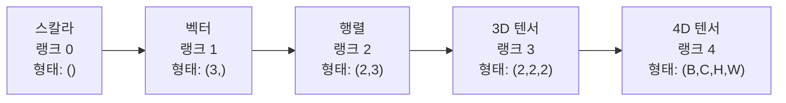
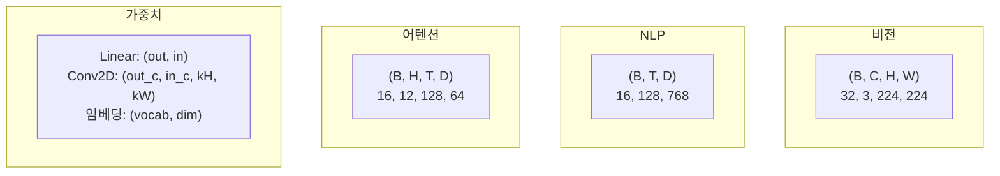
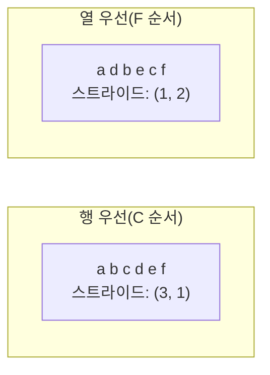
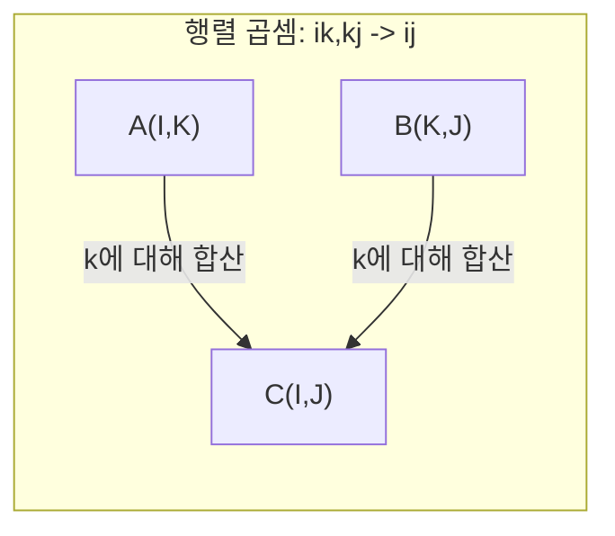

# 텐서 연산

> 텐서는 데이터와 딥러닝 사이의 공통 언어입니다. 모든 이미지, 모든 문장, 모든 그래디언트가 이를 통해 흐릅니다.

**유형:** 빌드  
**언어:** Python  
**선수 지식:** 1단계, 레슨 01 (선형 대수 직관), 02 (벡터, 행렬 및 연산)  
**소요 시간:** ~90분

## 학습 목표

- **텐서 클래스**를 직접 구현하여 **shape**, **strides**, **reshape**, **transpose**, **요소별 연산** 기능 추가  
- **브로드캐스팅 규칙**을 적용하여 데이터 복사 없이 다른 형태의 텐서 연산 수행  
- **내적(dot product)**, **행렬 곱셈(matrix multiplication)**, **외적(outer product)**, **배치 연산(batched operations)**을 위한 **einsum 표현식** 작성  
- **멀티헤드 어텐션(multi-head attention)**의 모든 단계에서 **정확한 텐서 형태(tensor shape)** 추적

## 문제

트랜스포머를 구축합니다. 순전파(forward pass)는 깔끔하게 보입니다. 실행했을 때 다음과 같은 오류가 발생합니다: `RuntimeError: mat1 and mat2 shapes cannot be multiplied (32x768 and 512x768)`. 형태(shape)를 뚫어져라 바라봅니다. 전치(transpose)를 시도합니다. 이제 `Expected 4D input (got 3D input)`이라는 오류가 발생합니다. `unsqueeze`를 추가합니다. 다른 것이 또 깨집니다.

형태 오류는 딥러닝 코드에서 가장 흔한 버그입니다. 개념적으로 어렵지는 않지만 — 각 연산에는 형태 계약(shape contract)이 있습니다 — 오류가 빠르게 증식합니다. 트랜스포머에는 수십 개의 리쉐이프(reshape), 전치(transpose), 브로드캐스트(broadcast)가 연쇄적으로 연결되어 있습니다. 하나의 잘못된 축(axis)이 오류 폭포를 일으킵니다. 더 나쁜 것은, 일부 형태 오류는 전혀 오류를 발생시키지 않는다는 것입니다. 이들은 잘못된 차원을 따라 브로드캐스트하거나 잘못된 축을 따라 합산하여 소리 없이 쓰레기 값을 생성합니다.

행렬은 두 집합 사이의 쌍별 관계(pairwise relationship)를 처리합니다. 실제 데이터는 2차원에 맞지 않습니다. 224x224 크기의 RGB 이미지 32개로 구성된 배치(batch)는 4D 텐서입니다: `(32, 3, 224, 224)`. 12개의 헤드를 가진 셀프 어텐션(self-attention) 또한 4D입니다: `(batch, heads, seq_len, head_dim)`. 임의의 차원 수에 일반화되는 데이터 구조가 필요하며, 모든 차원에 걸쳐 깔끔하게 조합되는 연산이 필요합니다. 그 구조가 바로 텐서(tensor)입니다. 텐서의 연산을 마스터하면 형태 오류는 아주 쉽게 디버깅할 수 있게 됩니다.

## 개념

### 텐서란 무엇인가

텐서는 균일한 데이터 타입을 가진 다차원 숫자 배열입니다. 차원 수는 **랭크**(또는 **순서**)입니다. 각 차원은 **축**입니다. **형태**는 각 축을 따라 크기를 나열한 튜플입니다.



총 요소 수 = 모든 크기의 곱. 형태 `(2, 3, 4)`는 `2 * 3 * 4 = 24`개의 요소를 가집니다.

### 딥러닝에서의 텐서 형태

다른 데이터 타입은 관례에 따라 특정 텐서 형태에 매핑됩니다.



PyTorch는 NCHW(채널 우선)를 사용합니다. TensorFlow는 기본적으로 NHWC(채널 마지막)를 사용합니다. 레이아웃 불일치는 무음 속도 저하 또는 오류를 유발합니다.

### 메모리 레이아웃 작동 방식

메모리의 2D 배열은 1D 바이트 시퀀스입니다. **스트라이드**는 각 축을 따라 한 단계 이동할 때 건너뛸 요소 수를 알려줍니다.



전치(transpose)는 데이터를 이동시키지 않습니다. 스트라이드를 교환하여 텐서를 **비연속적**으로 만듭니다. 즉, 행에 대한 요소가 더 이상 메모리에서 인접하지 않습니다.

### 브로드캐스팅 규칙

브로드캐스팅은 데이터 복사 없이 다른 형태의 텐서 연산을 가능하게 합니다. 오른쪽에서 형태를 정렬합니다. 두 차원은 같거나 하나가 1일 때 호환됩니다. 차원이 더 적은 텐서는 왼쪽에 1로 패딩됩니다.

```
텐서 A:     (8, 1, 6, 1)
텐서 B:        (7, 1, 5)
패딩된 B:     (1, 7, 1, 5)
결과:       (8, 7, 6, 5)
```

### Einsum: 범용 텐서 연산

아인슈타인 합산은 각 축에 문자를 할당합니다. 입력에는 있지만 출력에는 없는 축은 합산됩니다. 둘 다 있는 축은 유지됩니다.



주요 패턴: `i,i->` (내적), `i,j->ij` (외적), `ii->` (대각합), `ij->ji` (전치), `bij,bjk->bik` (배치 행렬 곱셈), `bhtd,bhsd->bhts` (어텐션 점수).

## 빌드하기

코드는 `code/tensors.py`에 있습니다. 각 단계는 해당 구현을 참조합니다.

### 1단계: 텐서 저장 및 스트라이드

텐서는 평탄한 숫자 목록과 형태 메타데이터를 저장합니다. 스트라이드는 다차원 인덱스를 평탄한 위치에 매핑하는 인덱싱 로직을 알려줍니다.

```python
class Tensor:
    def __init__(self, data, shape=None):
        if isinstance(data, (list, tuple)):
            self._data, self._shape = self._flatten_nested(data)
        elif isinstance(data, np.ndarray):
            self._data = data.flatten().tolist()
            self._shape = tuple(data.shape)
        else:
            self._data = [data]
            self._shape = ()

        if shape is not None:
            total = reduce(lambda a, b: a * b, shape, 1)
            if total != len(self._data):
                raise ValueError(
                    f"{len(self._data)}개 요소를 형태 {shape}로 재구성할 수 없음"
                )
            self._shape = tuple(shape)

        self._strides = self._compute_strides(self._shape)

    @staticmethod
    def _compute_strides(shape):
        if len(shape) == 0:
            return ()
        strides = [1] * len(shape)
        for i in range(len(shape) - 2, -1, -1):
            strides[i] = strides[i + 1] * shape[i + 1]
        return tuple(strides)
```

형태 `(3, 4)`의 경우 스트라이드는 `(4, 1)`입니다. 행을 하나 증가시키려면 4개 요소를 건너뛰고, 열을 하나 증가시키려면 1개 요소를 건너뜁니다.

### 2단계: 재구성, 축 제거, 축 추가

재구성은 요소 순서를 변경하지 않고 형태를 변경합니다. 총 요소 수는 동일해야 합니다. 한 차원에 `-1`을 사용하여 크기를 추론할 수 있습니다.

```python
t = Tensor(list(range(12)), shape=(2, 6))
r = t.reshape((3, 4))
r = t.reshape((-1, 3))
```

축 제거는 크기가 1인 축을 제거합니다. 축 추가는 축을 하나 삽입합니다. 배치 `(B, T, D)`에 바이어스 벡터 `(D,)`를 추가하려면 `(1, 1, D)`로 축 추가가 필요합니다.

```python
t = Tensor(list(range(6)), shape=(1, 3, 1, 2))
s = t.squeeze()
v = Tensor([1, 2, 3])
u = v.unsqueeze(0)
```

### 3단계: 전치 및 축 순서 변경

전치는 두 축을 교환합니다. 축 순서 변경은 모든 축의 순서를 재배열합니다. 이를 통해 NCHW와 NHWC 간 변환이 가능합니다.

```python
mat = Tensor(list(range(6)), shape=(2, 3))
tr = mat.transpose(0, 1)

t4d = Tensor(list(range(24)), shape=(1, 2, 3, 4))
perm = t4d.permute((0, 2, 3, 1))
```

전치 또는 축 순서 변경 후 텐서는 메모리에서 비연속적입니다. PyTorch에서 `view`는 비연속 텐서에서 실패합니다. `reshape`를 사용하거나 `.contiguous()`를 먼저 호출하세요.

### 4단계: 요소별 연산 및 축소

요소별 연산(덧셈, 곱셈, 뺄셈)은 각 요소에 독립적으로 적용되며 형태를 유지합니다. 축소(합, 평균, 최댓값)는 하나 이상의 축을 축소합니다.

```python
a = Tensor([[1, 2], [3, 4]])
b = Tensor([[10, 20], [30, 40]])
c = a + b
d = a * 2
s = a.sum(axis=0)
```

CNN의 전역 평균 풀링: `(B, C, H, W).mean(axis=[2, 3])`은 `(B, C)`를 생성합니다. NLP의 시퀀스 평균 풀링: `(B, T, D).mean(axis=1)`은 `(B, D)`를 생성합니다.

### 5단계: NumPy를 이용한 브로드캐스팅

`tensors.py`의 `demo_broadcasting_numpy()` 함수는 핵심 패턴을 보여줍니다.

```python
activations = np.random.randn(4, 3)
bias = np.array([0.1, 0.2, 0.3])
result = activations + bias

images = np.random.randn(2, 3, 4, 4)
scale = np.array([0.5, 1.0, 1.5]).reshape(1, 3, 1, 1)
result = images * scale

a = np.array([1, 2, 3]).reshape(-1, 1)
b = np.array([10, 20, 30, 40]).reshape(1, -1)
outer = a * b
```

브로드캐스팅을 통한 쌍별 거리 계산: `(M, 2)`를 `(M, 1, 2)`로, `(N, 2)`를 `(1, N, 2)`로 재구성한 후 뺄셈, 제곱, 마지막 축 합, 제곱근 계산. 결과: `(M, N)`.

### 6단계: 아인슈타인 합 표기(Einsum) 연산

`demo_einsum()` 및 `demo_einsum_gallery()` 함수는 모든 일반적인 패턴을 설명합니다.

```python
a = np.array([1.0, 2.0, 3.0])
b = np.array([4.0, 5.0, 6.0])
dot = np.einsum("i,i->", a, b)

A = np.array([[1, 2], [3, 4], [5, 6]], dtype=float)
B = np.array([[7, 8, 9], [10, 11, 12]], dtype=float)
matmul = np.einsum("ik,kj->ij", A, B)

batch_A = np.random.randn(4, 3, 5)
batch_B = np.random.randn(4, 5, 2)
batch_mm = np.einsum("bij,bjk->bik", batch_A, batch_B)
```

축약의 계산 비용은 모든 인덱스 크기(유지 및 합산)의 곱입니다. `bij,bjk->bik`에서 B=32, I=128, J=64, K=128인 경우: `32 * 128 * 64 * 128 = 33,554,432` 곱셈-덧셈.

### 7단계: Einsum을 통한 어텐션 메커니즘

`demo_attention_einsum()` 함수는 멀티헤드 어텐션을 종단간 구현합니다.

```python
B, H, T, D = 2, 4, 8, 16
E = H * D

X = np.random.randn(B, T, E)
W_q = np.random.randn(E, E) * 0.02

Q = np.einsum("bte,ek->btk", X, W_q)
Q = Q.reshape(B, T, H, D).transpose(0, 2, 1, 3)

scores = np.einsum("bhtd,bhsd->bhts", Q, K) / np.sqrt(D)
weights = softmax(scores, axis=-1)
attn_output = np.einsum("bhts,bhsd->bhtd", weights, V)

concat = attn_output.transpose(0, 2, 1, 3).reshape(B, T, E)
output = np.einsum("bte,ek->btk", concat, W_o)
```

모든 단계는 텐서 연산입니다: 투영(Einsum을 통한 행렬 곱셈), 헤드 분할(재구성 + 전치), 어텐션 점수(Einsum을 통한 배치 행렬 곱셈), 가중치 합(Einsum을 통한 배치 행렬 곱셈), 헤드 병합(전치 + 재구성), 출력 투영(Einsum을 통한 행렬 곱셈).

## 사용 방법

### 스크래치 vs NumPy

| 연산 | 스크래치(Tensor 클래스) | NumPy |
|---|---|---|
| 생성 | `Tensor([[1,2],[3,4]])` | `np.array([[1,2],[3,4]])` |
| 형태 변경 | `t.reshape((3,4))` | `a.reshape(3,4)` |
| 전치 | `t.transpose(0,1)` | `a.T` 또는 `a.transpose(0,1)` |
| 차원 제거 | `t.squeeze(0)` | `np.squeeze(a, 0)` |
| 합계 | `t.sum(axis=0)` | `a.sum(axis=0)` |
| 아인슈타인 합 | N/A | `np.einsum("ij,jk->ik", a, b)` |

### 스크래치 vs PyTorch

```python
import torch

t = torch.tensor([[1, 2, 3], [4, 5, 6]], dtype=torch.float32)
t.shape
t.stride()
t.is_contiguous()

t.reshape(3, 2)
t.unsqueeze(0)
t.transpose(0, 1)
t.transpose(0, 1).contiguous()

torch.einsum("ik,kj->ij", A, B)
```

PyTorch는 자동 미분(autograd), GPU 지원, 최적화된 BLAS 커널을 추가합니다. 형태 의미론은 동일합니다. 스크래치 버전을 이해한다면 PyTorch 형태 오류가 읽기 쉬워집니다.

### 모든 신경망 레이어를 텐서 연산으로

| 연산 | 텐서 형태 | 아인슈타인 합 |
|---|---|---|
| 선형 레이어 | `Y = X @ W.T + b` | `"bd,od->bo"` + 편향 |
| 어텐션 QKV | `Q = X @ W_q` | `"btd,dh->bth"` |
| 어텐션 점수 | `Q @ K.T / sqrt(d)` | `"bhtd,bhsd->bhts"` |
| 어텐션 출력 | `softmax(scores) @ V` | `"bhts,bhsd->bhtd"` |
| 배치 정규화 | `(X - mu) / sigma * gamma` | 요소별 연산 + 브로드캐스트 |
| 소프트맥스 | `exp(x) / sum(exp(x))` | 요소별 연산 + 축소 연산 |

## Ship It

이 레슨은 두 가지 재사용 가능한 프롬프트를 생성합니다:

1. **`outputs/prompt-tensor-shapes.md`** -- 텐서 형태 불일치 디버깅을 위한 체계적인 프롬프트. 모든 일반적인 연산(matmul, broadcast, cat, Linear, Conv2d, BatchNorm, softmax)에 대한 결정 테이블과 수정 조회 테이블을 포함합니다.

2. **`outputs/prompt-tensor-debugger.md`** -- 형태 오류가 작업을 차단할 때 AI 어시스턴트에 붙여넣을 수 있는 단계별 디버깅 프롬프트. 오류 메시지와 텐서 형태를 입력하면 정확한 수정 사항을 반환합니다.

## 연습 문제

1. **쉬움 -- Reshape 왕복.** 형태 `(2, 3, 4)`인 텐서를 `(6, 4)`로 변환한 후 `(24,)`로 변환하고 다시 `(2, 3, 4)`로 복원하세요. 각 단계에서 요소 순서가 유지되는지 확인하기 위해 평탄화된 데이터를 출력하세요.

2. **중간 -- 브로드캐스팅 구현.** `Tensor` 클래스에 `broadcast_to(shape)` 메서드를 추가하여 크기가 1인 차원을 목표 형태에 맞게 확장하세요. 그런 다음 `_elementwise_op`를 수정하여 연산 전에 자동으로 브로드캐스팅되도록 변경하세요. 형태 `(3, 1)`과 `(1, 4)`를 입력으로 사용하여 `(3, 4)` 출력을 생성하는지 테스트하세요.

3. **어려움 -- Einsum 직접 구현.** 최소한 다음 연산을 지원하는 기본 `einsum(subscripts, *tensors)` 함수를 구현하세요: 내적(`i,i->`), 행렬 곱셈(`ij,jk->ik`), 외적(`i,j->ij`), 전치(`ij->ji`). 서브스크립트 문자열을 파싱하고, 축소할 인덱스를 식별하며, 모든 인덱스 조합을 순회하세요. 결과를 `np.einsum`과 비교하세요.

4. **어려움 -- 어텐션(attention) 형태 추적기.** `batch_size`, `seq_len`, `embed_dim`, `num_heads`를 입력으로 받아 멀티헤드 어텐션의 모든 단계에서 정확한 형태를 출력하는 함수를 작성하세요: 입력, Q/K/V 투영, 헤드 분할, 어텐션 점수, 소프트맥스 가중치, 가중치 합, 헤드 병합, 출력 투영. `demo_attention_einsum()` 출력과 검증하세요.

## 주요 용어

| 용어 | 사람들이 말하는 것 | 실제 의미 |
|---|---|---|
| 텐서(Tensor) | "행렬이지만 더 많은 차원을 가진 것" | 균일한 타입과 정의된 형태(shape), 스트라이드(stride), 연산을 가진 다차원 배열 |
| 랭크(Rank) | "차원의 수" | 축의 개수. 행렬은 랭크 2를 가지며, 행렬 랭크(matrix rank)와 같지 않음 |
| 형태(Shape) | "텐서의 크기" | 각 축을 따라 크기를 나열한 튜플. `(2, 3)`은 2행, 3열을 의미 |
| 스트라이드(Stride) | "메모리가 어떻게 배치되는지" | 각 축을 따라 한 위치 앞으로 이동하기 위해 건너뛸 요소 수 |
| 브로드캐스팅(Broadcasting) | "형태가 다를 때 그냥 작동하는 것" | 엄격한 규칙 집합: 오른쪽부터 정렬, 차원은 같아야 하거나 둘 중 하나가 1이어야 함 |
| 연속적(Contiguous) | "텐서가 정상적인 것" | 논리적 레이아웃에서 간격이나 재정렬 없이 메모리에 순차적으로 저장된 요소 |
| 아인섬(Einsum) | "행렬 곱(matmul)을 멋지게 표현하는 방법" | 모든 텐서 축약(contraction), 외적(outer product), 추적(trace), 전치(transpose)를 한 줄로 표현하는 일반 표기법 |
| 뷰(View) | "리쉐이프(reshape)와 같은 것" | 동일한 메모리 버퍼를 공유하지만 다른 형태/스트라이드 메타데이터를 가진 텐서. 비연속적 데이터에서는 실패 |
| 축약(Contraction) | "인덱스를 따라 합산하는 것" | 텐서 간 공유 인덱스가 곱해지고 합산되어 더 낮은 랭크의 결과를 생성하는 일반 연산 |
| NCHW / NHWC | "PyTorch vs TensorFlow 형식" | 이미지 텐서의 메모리 레이아웃 규칙. NCHW는 채널(channel)을 공간 차원보다 앞에, NHWC는 뒤에 배치 |

## 추가 학습 자료

- [NumPy 브로드캐스팅](https://numpy.org/doc/stable/user/basics.broadcasting.html) -- 시각적 예제와 함께 제공되는 공식 규칙
- [PyTorch 텐서 뷰](https://pytorch.org/docs/stable/tensor_view.html) -- 뷰가 작동하는 경우와 복사가 발생하는 경우
- [einops](https://github.com/arogozhnikov/einops) -- 텐서 재구성을 가독성 있고 안전하게 만드는 라이브러리
- [일러스트레이티드 트랜스포머](https://jalammar.github.io/illustrated-transformer/) -- 어텐션을 통해 흐르는 텐서 형태 시각화
- [NumPy의 아인슈타인 합 표기법](https://numpy.org/doc/stable/reference/generated/numpy.einsum.html) -- 예제가 포함된 완전한 einsum 문서