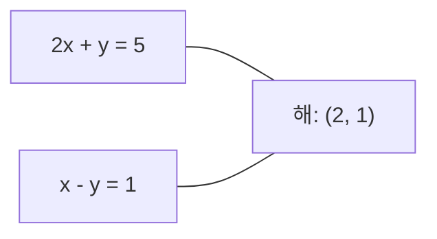
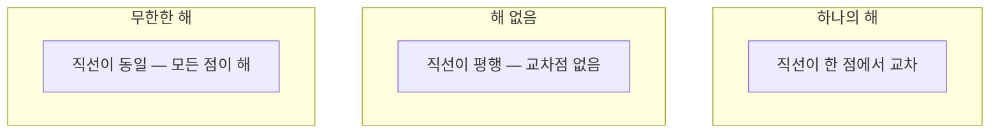

# 선형 시스템

> Ax = b를 푸는 것은 여전히 신경망을 구동하는 수학 역사상 가장 오래된 문제입니다.

**유형:** 구축
**언어:** Python
**선수 지식:** 1단계, 레슨 01 (선형 대수 직관), 02 (벡터와 행렬), 03 (행렬 변환)
**소요 시간:** ~120분

## 학습 목표

- 부분 피벗팅과 대치를 이용한 가우스 소거법(Gaussian elimination)으로 **Ax = b** 풀기
- **LU 분해**, **QR 분해**, **촐레스키 분해(Cholesky decomposition)**로 행렬을 분해하고 각각이 적절한 경우 설명하기
- 최소 제곱법(least squares)을 위한 정규 방정식(normal equations) 유도 및 선형 회귀(linear regression)와 릿지 회귀(ridge regression)와 연결하기
- 조건수(condition number)를 이용해 **병적 조건 시스템(ill-conditioned systems)**을 진단하고 정규화(regularization)를 적용해 안정화시키기

## 문제 정의

선형 회귀를 훈련할 때마다 선형 시스템을 풀게 됩니다. 최소제곱법(least-squares fit)을 계산할 때마다 선형 시스템을 풀게 됩니다. 신경망 레이어가 `y = Wx + b`를 계산할 때, 이는 선형 시스템의 한 쪽을 평가하는 것입니다. 정규화(regularization)를 추가하면 시스템을 수정하게 됩니다. 가우시안 프로세스(Gaussian processes)를 사용할 때는 행렬을 분해(factor)합니다. 마할라노비스 거리(Mahalanobis distance)를 위해 공분산 행렬을 역행렬로 계산할 때, 선형 시스템을 풀게 됩니다.

방정식 `Ax = b`는 모든 곳에 등장합니다. `A`는 알려진 계수 행렬입니다. `b`는 알려진 출력 벡터입니다. `x`는 찾고자 하는 미지수 벡터입니다. 선형 회귀에서 `A`는 데이터 행렬, `b`는 목표 벡터, `x`는 가중치 벡터입니다. 전체 모델은 다음과 같이 요약됩니다: `Ax`가 `b`에 가능한 한 가깝도록 `x`를 찾으세요.

이 강의에서는 해당 방정식을 풀기 위한 모든 주요 방법을 처음부터 구축합니다. 어떤 방법은 빠르고 다른 방법은 안정적인 이유, 어떤 방법은 정사각 시스템(square system)에만 작동하고 다른 방법은 과결정 시스템(overdetermined system)을 처리하는 이유, 그리고 행렬의 조건수(condition number)가 해의 의미를 결정하는지 여부를 이해하게 될 것입니다.

## 개념

### Ax = b의 기하학적 의미

선형 방정식 시스템은 기하학적 해석이 있습니다. 각 방정식은 초평면을 정의합니다. 해는 모든 초평면이 교차하는 점(또는 점들의 집합)입니다.

```
2x + y = 5          2D에서 두 직선.
x - y  = 1          x=2, y=1에서 교차.
```



세 가지 경우가 발생할 수 있습니다:



행렬 형태에서 "하나의 해"는 A가 가역임을 의미합니다. "해 없음"은 시스템이 불일치함을 의미합니다. "무한한 해"는 A에 영공간이 있음을 의미합니다. 대부분의 ML 문제는 "정확한 해 없음" 범주에 속합니다. 데이터 포인트(방정식)가 파라미터(미지수)보다 많기 때문입니다. 이때 최소 제곱법이 등장합니다.

### 열 그림 vs 행 그림

Ax = b를 읽는 두 가지 방법이 있습니다.

**행 그림.** A의 각 행은 하나의 방정식을 정의합니다. 각 방정식은 초평면입니다. 해는 이들이 모두 교차하는 지점입니다.

**열 그림.** A의 각 열은 벡터입니다. 질문은: A의 열들의 어떤 선형 결합이 b를 생성하는가?

```
A = | 2  1 |    b = | 5 |
    | 1 -1 |        | 1 |

행 그림: 2x + y = 5와 x - y = 1을 동시에 푼다.

열 그림: x1, x2를 찾아:
  x1 * [2, 1] + x2 * [1, -1] = [5, 1]
  2 * [2, 1] + 1 * [1, -1] = [4+1, 2-1] = [5, 1]   확인.
```

열 그림이 더 근본적입니다. b가 A의 열공간에 있으면 시스템은 해를 가집니다. 없으면 열공간에서 가장 가까운 점을 찾습니다. 그 점이 최소 제곱 해입니다.

### 가우스 소거법

가우스 소거법은 Ax = b를 상삼각 시스템 Ux = c로 변환한 후 후진 대입으로 풉니다. 가장 직접적인 방법입니다.

알고리즘:

```
1. 각 열 k (피벗 열)에 대해:
   a. 열 k에서 행 k 이하의 가장 큰 항목을 찾습니다 (부분 피벗).
   b. 그 행을 행 k와 교환합니다.
   c. 행 k 아래의 각 행 i에 대해:
      - 승수 m = A[i][k] / A[k][k] 계산
      - 행 i에서 m * 행 k를 뺍니다.
2. 후진 대입: 마지막 방정식부터 위로 풉니다.
```

예시:

```
원본:
| 2  1  1 | 8 |       R2 = R2 - (2)R1     | 2  1   1 |  8 |
| 4  3  3 |20 |  -->  R3 = R3 - (1)R1 --> | 0  1   1 |  4 |
| 2  3  1 |12 |                            | 0  2   0 |  4 |

                       R3 = R3 - (2)R2     | 2  1   1 |  8 |
                                       --> | 0  1   1 |  4 |
                                           | 0  0  -2 | -4 |

후진 대입:
  -2 * x3 = -4    -->  x3 = 2
  x2 + 2  = 4     -->  x2 = 2
  2*x1 + 2 + 2 = 8 --> x1 = 2
```

가우스 소거법은 O(n^3) 연산이 필요합니다. 1000x1000 시스템의 경우 약 10억 개의 부동소수점 연산이 필요합니다. 빠르지만, 같은 A로 여러 시스템을 풀어야 할 경우 더 나은 방법을 사용할 수 있습니다.

### 부분 피벗: 왜 중요한가

피벗 없이 가우스 소거법을 사용하면 실패하거나 잘못된 결과가 나올 수 있습니다. 피벗 요소가 0이면 0으로 나누게 됩니다. 작으면 반올림 오차가 증폭됩니다.

```
나쁜 피벗:                       부분 피벗 적용:
| 0.001  1 | 1.001 |            먼저 행 교환:
| 1      1 | 2     |            | 1      1 | 2     |
                                 | 0.001  1 | 1.001 |
m = 1/0.001 = 1000              m = 0.001/1 = 0.001
R2 = R2 - 1000*R1               R2 = R2 - 0.001*R1
| 0.001  1     | 1.001   |      | 1      1     | 2     |
| 0     -999   | -999.0  |      | 0      0.999 | 0.999 |

x2 = 1.000 (정답)            x2 = 1.000 (정답)
x1 = (1.001 - 1)/0.001          x1 = (2 - 1)/1 = 1.000 (정답)
   = 0.001/0.001 = 1.000        승수가 작아 안정적입니다.
```

제한된 정밀도의 부동소수점 연산에서 피벗을 사용하지 않으면 유효 숫자를 잃을 수 있습니다. 부분 피벗은 항상 가장 큰 피벗을 선택하여 오차 증폭을 최소화합니다.

### LU 분해

LU 분해는 A를 하삼각 행렬 L과 상삼각 행렬 U로 분해합니다: A = LU. L 행렬은 가우스 소거법의 승수를 저장합니다. U 행렬은 소거 결과입니다.

```
A = L @ U

| 2  1  1 |   | 1  0  0 |   | 2  1   1 |
| 4  3  3 | = | 2  1  0 | @ | 0  1   1 |
| 2  3  1 |   | 1  2  1 |   | 0  0  -2 |
```

왜 소거 대신 분해할까요? L과 U를 얻으면 새로운 b에 대해 Ax = b를 푸는 데 O(n^2)만 걸립니다:

```
Ax = b
LUx = b
y = Ux로 두면:
  Ly = b    (전진 대입, O(n^2))
  Ux = y    (후진 대입, O(n^2))
```

O(n^3) 비용은 분해 시 한 번 지불합니다. 이후 모든 해는 O(n^2)입니다. 같은 A로 1000개의 시스템을 풀어야 한다면 LU는 총 작업량을 1000/3으로 줄입니다.

부분 피벗을 사용하면 PA = LU가 됩니다. 여기서 P는 행 교환을 기록하는 치환 행렬입니다.

### QR 분해

QR 분해는 A를 직교 행렬 Q와 상삼각 행렬 R로 분해합니다: A = QR.

직교 행렬은 Q^T Q = I 성질을 가집니다. 열들은 직교 정규 벡터입니다. Q를 곱하면 길이와 각도가 보존됩니다.

```
A = Q @ R

Q의 열들은 직교 정규: Q^T Q = I
R은 상삼각 행렬

Ax = b를 풀기:
  QRx = b
  Rx = Q^T b    (Q^T를 곱하기만 하면 됨, 역행렬 필요 없음)
  후진 대입으로 x를 구함.
```

QR은 최소 제곱 문제 풀기에 LU보다 수치적으로 안정적입니다. 그람-슈미트 과정은 Q를 열 단위로 구성합니다:

```
A의 열들 a1, a2, ...이 주어졌을 때:

q1 = a1 / ||a1||

q2 = a2 - (a2 . q1) * q1        (q1에 대한 투영을 뺌)
q2 = q2 / ||q2||                (정규화)

q3 = a3 - (a3 . q1) * q1 - (a3 . q2) * q2
q3 = q3 / ||q3||

R[i][j] = qi . aj    for i <= j
```

각 단계는 이전 q 벡터들에 대한 성분을 제거하여 새로운 직교 방향을 남깁니다.

### 촐레스키 분해

A가 대칭(A = A^T)이고 양의 정부호(모든 고유값이 양수)일 때, A = L L^T로 분해할 수 있습니다. 여기서 L은 하삼각 행렬입니다. 이것이 촐레스키 분해입니다.

```
A = L @ L^T

| 4  2 |   | 2  0 |   | 2  1 |
| 2  5 | = | 1  2 | @ | 0  2 |

L[i][i] = sqrt(A[i][i] - sum(L[i][k]^2 for k < i))
L[i][j] = (A[i][j] - sum(L[i][k]*L[j][k] for k < j)) / L[j][j]    for i > j
```

촐레스키는 LU보다 두 배 빠르고 저장 공간도 절반만 필요합니다. 대칭 양의 정부호 행렬에만 적용되지만, 이런 행렬은 자주 등장합니다:

- 공분산 행렬은 대칭 양의 준정부호(정규화 시 양의 정부호)입니다.
- 가우시안 프로세스의 커널 행렬은 대칭 양의 정부호입니다.
- 볼록 함수의 헤시안은 최소점에서 대칭 양의 정부호입니다.
- A^T A는 항상 대칭 양의 준정부호입니다.

가우시안 프로세스에서 커널 행렬 K를 촐레스키로 분해한 후 K alpha = y를 풀어 예측 평균을 구합니다. 촐레스키 인수는 주변 우도(log det(K))도 제공합니다: log det(K) = 2 * sum(log(diag(L))).

### 최소 제곱법: Ax = b에 정확한 해가 없을 때

A가 m x n이고 m > n(방정식 > 미지수)이면 시스템은 과결정입니다. 정확한 해가 없습니다. 대신 제곱 오차를 최소화합니다:

```
minimize ||Ax - b||^2

이는 잔차 제곱합입니다:
  sum((A[i,:] @ x - b[i])^2 for i in range(m))
```

최소값은 정규 방정식을 만족합니다:

```
A^T A x = A^T b
```

유도: ||Ax - b||^2 = (Ax - b)^T (Ax - b) = x^T A^T A x - 2 x^T A^T b + b^T b. x에 대한 그래디언트를 0으로 설정: 2 A^T A x - 2 A^T b = 0.

```
원본 시스템 (과결정, 4개 방정식, 2개 미지수):
| 1  1 |         | 3 |
| 1  2 | x     = | 5 |       정확한 x는 없음.
| 1  3 |         | 6 |
| 1  4 |         | 8 |

정규 방정식:
A^T A = | 4  10 |    A^T b = | 22 |
        | 10 30 |            | 63 |

해: x = [1.5, 1.7]

이는 선형 회귀입니다. x[0]은 절편, x[1]은 기울기.
```

### 정규 방정식 = 선형 회귀

연결은 정확합니다. 선형 회귀에서 데이터 행렬 X는 샘플당 한 행, 특성당 한 열을 가집니다. 목표 벡터 y는 샘플당 한 항목을 가집니다. 가중치 벡터 w는 다음을 만족합니다:

```
X^T X w = X^T y
w = (X^T X)^(-1) X^T y
```

이는 선형 회귀의 닫힌 해입니다. `sklearn.linear_model.LinearRegression.fit()`은 이를 계산하거나 QR 또는 SVD를 통해 동등한 해를 구합니다.

행렬에 정규화 항 lambda * I를 추가하면 릿지 회귀가 됩니다:

```
(X^T X + lambda * I) w = X^T y
w = (X^T X + lambda * I)^(-1) X^T y
```

정규화는 행렬을 더 잘 조건화(정확하게 역행렬 계산 가능)하게 하고 가중치를 0으로 축소하여 과적합을 방지합니다. X^T X + lambda * I는 lambda > 0일 때 항상 대칭 양의 정부호이므로 촐레스키로 풀 수 있습니다.

### 의사 역행렬 (무어-펜로즈)

의사 역행렬 A+는 비제곱 및 특이 행렬에 대한 역행렬을 일반화합니다. 어떤 행렬 A에 대해:

```
x = A+ b

여기서 A+ = V Sigma+ U^T    (SVD로 계산)
```

Sigma+는 0이 아닌 특이값의 역수를 취하고 전치한 것입니다. A = U Sigma V^T이면 A+ = V Sigma+ U^T입니다.

```
A = U Sigma V^T        (SVD)

Sigma = | 5  0 |       Sigma+ = | 1/5  0  0 |
        | 0  2 |                | 0  1/2  0 |
        | 0  0 |

A+ = V Sigma+ U^T
```

의사 역행렬은 최소 노름 최소 제곱 해를 제공합니다. 시스템이:
- 하나의 해: A+ b가 해.
- 해 없음: A+ b가 최소 제곱 해.
- 무한한 해: A+ b가 최소 노름 해.

NumPy의 `np.linalg.lstsq`와 `np.linalg.pinv`는 내부적으로 SVD를 사용합니다.

### 조건수

조건수는 입력의 작은 변화에 대한 해의 민감도를 측정합니다. 행렬 A에 대해 조건수는:

```
kappa(A) = ||A|| * ||A^(-1)|| = sigma_max / sigma_min
```

여기서 sigma_max와 sigma_min은 가장 큰/작은 특이값입니다.

```
잘 조건화됨 (kappa ~ 1):        나쁜 조건 (kappa ~ 10^15):
b의 작은 변화 -->                b의 작은 변화 -->
x의 작은 변화                    x의 큰 변화

| 2  0 |   kappa = 2/1 = 2          | 1   1          |   kappa ~ 10^15
| 0  1 |   안전하게 풀 수 있음      | 1   1+10^(-15) |   해는 쓰레기
```

경험적 규칙:
- kappa < 100: 안전, 해는 정확.
- kappa ~ 10^k: 부동소수점 연산에서 약 k자리 정밀도 손실.
- kappa ~ 10^16 (float64): 해는 의미 없음. 행렬은 실질적으로 특이.

ML에서 나쁜 조건은 특성들이 거의 공선적일 때 발생합니다. 정규화(lambda * I 추가)는 조건수를 sigma_max / sigma_min에서 (sigma_max + lambda) / (sigma_min + lambda)로 개선합니다.

### 반복법: 켤레 기울기법

매우 큰 희소 시스템(수백만 미지수)의 경우 LU나 촐레스키 같은 직접법은 너무 비쌉니다. 반복법은 여러 반복에 걸쳐 추측을 개선하여 해를 근사합니다.

켤레 기울기법(CG)은 A가 대칭 양의 정부호일 때 Ax = b를 풉니다. 최대 n번(정확한 산술)의 반복으로 정확한 해를 찾지만, A의 고유값이 모여 있으면 훨씬 빨리 수렴합니다.

```
알고리즘 개요:
  x0 = 초기 추측 (보통 0)
  r0 = b - A x0           (잔차)
  p0 = r0                 (탐색 방향)

  k = 0, 1, 2, ...에 대해:
    alpha = (rk . rk) / (pk . A pk)
    x_{k+1} = xk + alpha * pk
    r_{k+1} = rk - alpha * A pk
    beta = (r_{k+1} . r_{k+1}) / (rk . rk)
    p_{k+1} = r_{k+1} + beta * pk
    if ||r_{k+1}|| < 허용오차: 종료
```

CG는 다음에 사용됩니다:
- 대규모 최적화 (뉴턴-CG 방법)
- PDE 이산화 풀이
- 커널 행렬이 너무 커서 분해할 수 없는 커널 방법
- 다른 반복 솔버를 위한 전처리

수렴 속도는 조건수에 의존합니다. 더 잘 조건화된 시스템은 더 빨리 수렴하므로 정규화가 도움이 됩니다.

### 전체 그림: 어떤 방법을 언제 사용할까

| 방법 | 요구 사항 | 비용 | 사용 사례 |
|--------|-------------|------|----------|
| 가우스 소거법 | 정사각, 비특이 A | O(n^3) | 정사각 시스템의 일회성 풀이 |
| LU 분해 | 정사각, 비특이 A | O(n^3) 분해 + O(n^2) 풀이 | 같은 A로 여러 번 풀이 |
| QR 분해 | 임의의 A (m >= n) | O(mn^2) | 최소 제곱, 수치적 안정성 |
| 촐레스키 | 대칭 양의 정부호 A | O(n^3/3) | 공분산 행렬, 가우시안 프로세스, 릿지 회귀 |
| 정규 방정식 | 과결정 (m > n) | O(mn^2 + n^3) | 선형 회귀 (작은 n) |
| SVD / 의사 역행렬 | 임의의 A | O(mn^2) | 계수 부족 시스템, 최소 노름 해 |
| 켤레 기울기법 | 대칭 양의 정부호, 희소 A | O(n * k * nnz) | 대규모 희소 시스템, k = 반복 횟수 |

### ML과의 연결

이 강의의 모든 방법은 실제 ML에 등장합니다:

**선형 회귀.** 닫힌 해는 정규 방정식 X^T X w = X^T y를 풉니다. 이는 촐레스키(n이 작을 때), QR(수치적 안정성 중요), SVD(행렬이 계수 부족일 수 있을 때)로 풀립니다.

**릿지 회귀.** X^T X에 lambda * I를 추가합니다. 정규화된 시스템 (X^T X + lambda * I) w = X^T y는 lambda > 0일 때 촐레스키로 항상 풀 수 있습니다. X^T X + lambda * I는 대칭 양의 정부호이기 때문입니다.

**가우시안 프로세스.** 예측 평균은 K alpha = y를 풀어야 합니다. 여기서 K는 커널 행렬입니다. K의 촐레스키 분해가 표준 접근법입니다. 주변 우도는 log det(K) = 2 sum(log(diag(L)))을 사용합니다.

**신경망 초기화.** 직교 초기화는 QR 분해를 사용하여 열들이 직교 정규인 가중치 행렬을 생성합니다. 이는 깊은 네트워크에서 신호 소멸을 방지합니다.

**전처리.** 대규모 최적화기는 켤레 기울기법 솔버를 위한 전처리기로 불완전 촐레스키 또는 불완전 LU를 사용합니다.

**특성 공학.** X^T X의 조건수는 특성들이 공선적인지 알려줍니다. kappa가 크면 특성을 제거하거나 정규화를 추가합니다.

## 구축 방법

### 1단계: 부분 피벗팅을 사용한 가우스 소거법

```python
import numpy as np

def gaussian_elimination(A, b):
    n = len(b)
    Ab = np.hstack([A.astype(float), b.reshape(-1, 1).astype(float)])

    for k in range(n):
        max_row = k + np.argmax(np.abs(Ab[k:, k]))
        Ab[[k, max_row]] = Ab[[max_row, k]]

        if abs(Ab[k, k]) < 1e-12:
            raise ValueError(f"행렬이 특이행렬이거나 피벗 {k}에서 거의 특이행렬입니다")

        for i in range(k + 1, n):
            m = Ab[i, k] / Ab[k, k]
            Ab[i, k:] -= m * Ab[k, k:]

    x = np.zeros(n)
    for i in range(n - 1, -1, -1):
        x[i] = (Ab[i, -1] - Ab[i, i+1:n] @ x[i+1:n]) / Ab[i, i]

    return x
```

### 2단계: LU 분해

```python
def lu_decompose(A):
    n = A.shape[0]
    L = np.eye(n)
    U = A.astype(float).copy()
    P = np.eye(n)

    for k in range(n):
        max_row = k + np.argmax(np.abs(U[k:, k]))
        if max_row != k:
            U[[k, max_row]] = U[[max_row, k]]
            P[[k, max_row]] = P[[max_row, k]]
            if k > 0:
                L[[k, max_row], :k] = L[[max_row, k], :k]

        for i in range(k + 1, n):
            L[i, k] = U[i, k] / U[k, k]
            U[i, k:] -= L[i, k] * U[k, k:]

    return P, L, U

def lu_solve(P, L, U, b):
    n = len(b)
    Pb = P @ b.astype(float)

    y = np.zeros(n)
    for i in range(n):
        y[i] = Pb[i] - L[i, :i] @ y[:i]

    x = np.zeros(n)
    for i in range(n - 1, -1, -1):
        x[i] = (y[i] - U[i, i+1:] @ x[i+1:]) / U[i, i]

    return x
```

### 3단계: 촐레스키 분해

```python
def cholesky(A):
    n = A.shape[0]
    L = np.zeros_like(A, dtype=float)

    for i in range(n):
        for j in range(i + 1):
            s = A[i, j] - L[i, :j] @ L[j, :j]
            if i == j:
                if s <= 0:
                    raise ValueError("행렬이 양의 정부호가 아닙니다")
                L[i, j] = np.sqrt(s)
            else:
                L[i, j] = s / L[j, j]

    return L
```

### 4단계: 정규 방정식을 통한 최소 제곱법

```python
def least_squares_normal(A, b):
    AtA = A.T @ A
    Atb = A.T @ b
    return gaussian_elimination(AtA, Atb)

def ridge_regression(A, b, lam):
    n = A.shape[1]
    AtA = A.T @ A + lam * np.eye(n)
    Atb = A.T @ b
    L = cholesky(AtA)
    y = np.zeros(n)
    for i in range(n):
        y[i] = (Atb[i] - L[i, :i] @ y[:i]) / L[i, i]
    x = np.zeros(n)
    for i in range(n - 1, -1, -1):
        x[i] = (y[i] - L.T[i, i+1:] @ x[i+1:]) / L.T[i, i]
    return x
```

### 5단계: 조건수

```python
def condition_number(A):
    U, S, Vt = np.linalg.svd(A)
    return S[0] / S[-1]
```

## 사용 방법

실제 데이터에 대한 선형 회귀와 릿지 회귀를 결합하는 방법:

```python
np.random.seed(42)
X_raw = np.random.randn(100, 3)
w_true = np.array([2.0, -1.0, 0.5])
y = X_raw @ w_true + np.random.randn(100) * 0.1

X = np.column_stack([np.ones(100), X_raw])

w_ols = least_squares_normal(X, y)
print(f"OLS 가중치 (직접 구현):    {w_ols}")

w_np = np.linalg.lstsq(X, y, rcond=None)[0]
print(f"OLS 가중치 (NumPy):   {w_np}")
print(f"최대 차이: {np.max(np.abs(w_ols - w_np)):.2e}")

w_ridge = ridge_regression(X, y, lam=1.0)
print(f"릿지 가중치 (직접 구현):  {w_ridge}")

from sklearn.linear_model import Ridge
ridge_sk = Ridge(alpha=1.0, fit_intercept=False)
ridge_sk.fit(X, y)
print(f"릿지 가중치 (scikit-learn): {ridge_sk.coef_}")
```

## Ship It

이 레슨은 다음을 생성합니다:
- `code/linear_systems.py`에 가우스 소거법, LU 분해, 촐레스키 분해, 최소 제곱법, 릿지 회귀의 처음부터 구현한 코드 포함
- 정규 방정식(normal equations)과 sklearn의 `LinearRegression`이 동일한 가중치(weights)를 생성함을 보여주는 작동 데모

> **참고**: 전문 용어는 한국어(영어) 형식으로 표기했습니다.  
> 예: 가중치(weights)

## 연습 문제

1. 가우스 소거법, LU 분해기, `np.linalg.solve`를 사용하여 시스템 `[[1,2,3],[4,5,6],[7,8,10]] x = [6, 15, 27]`을 풀어라. 세 방법 모두 부동소수점 허용 오차 내에서 동일한 답을 주는지 검증하라.

2. 50x3 랜덤 행렬 X와 목표값 y = X @ w_true + noise를 생성하라. 정규 방정식, QR 분해(`np.linalg.qr` 사용), SVD 분해(`np.linalg.svd` 사용), `np.linalg.lstsq`로 w를 구하라. 네 가지 해를 비교하라. X^T X의 조건수(condition number)를 측정하고 어떤 방법을 신뢰할지 설명하라.

3. 두 열을 거의 동일하게 만들어(예: 열 2 = 열 1 + 1e-10 * noise) 거의 특이 행렬(nearly singular matrix)을 생성하라. 이 행렬의 조건수를 계산하라. 정규화(0.01 * I 추가) 유무에 따라 Ax = b를 풀어라. 해와 잔차를 비교하고 정규화가 왜 도움이 되는지 설명하라.

4. 100x100 랜덤 대칭 양정부호 행렬에 대해 켤레 기울기법(conjugate gradient algorithm)을 구현하라. 허용 오차 1e-8까지 수렴하는 데 필요한 반복 횟수를 세어라. 이론적 최대 반복 횟수 n과 비교하라.

5. 대칭 양정부호 행렬 크기 10, 50, 200, 500에 대해 Cholesky 분해기, LU 분해기, `np.linalg.solve`의 실행 시간을 측정하라. 결과를 그래프로 그려라. Cholesky가 LU보다 대략 2배 빠른지 검증하라.

## 핵심 용어

| 용어 | 사람들이 말하는 표현 | 실제 의미 |
|------|----------------|----------------------|
| 선형 시스템(Linear system) | "x를 구하라" | 선형 방정식 집합 Ax = b. x를 찾는 것은 변환 A 하에서 출력 b를 생성하는 입력을 찾는 것. |
| 가우스 소거법(Gaussian elimination) | "행 축소" | 행 연산을 사용하여 대각선 아래 항목을 체계적으로 제거하여 상삼각 시스템을 생성하고, 역대입으로 해결. O(n^3). |
| 부분 피벗팅(Partial pivoting) | "안정성을 위해 행 교환" | k열에서 소거하기 전, 해당 열에서 절댓값이 가장 큰 행을 피벗 위치로 교환. 작은 수로 나누는 것을 방지. |
| LU 분해(LU decomposition) | "삼각행렬로 분해" | A = LU로 표현. L은 하삼각행렬(승수 저장), U는 상삼각행렬(소거된 행렬). O(n^3) 비용을 여러 해결에 분산. |
| QR 분해(QR decomposition) | "직교 분해" | A = QR로 표현. Q는 직교 열, R은 상삼각행렬. 최소 제곱 문제에 LU보다 안정적. |
| 촐레스키 분해(Cholesky decomposition) | "행렬의 제곱근" | 대칭 양정부호 행렬 A에 대해 A = LL^T. LU 비용의 절반. 공분산 행렬, 커널 행렬, 릿지 회귀에 사용. |
| 최소 제곱(Least squares) | "정확한 해가 불가능할 때 최적 적합" | 시스템이 과결정(m > n)일 때 잔차 제곱합 ||Ax - b||^2 최소화. |
| 정규 방정식(Normal equations) | "미적분학 단축키" | A^T A x = A^T b. ||Ax - b||^2의 그래디언트를 0으로 설정. 선형 회귀의 닫힌 형태 해. |
| 유사역행렬(Pseudoinverse) | "비정방 행렬에 대한 역행렬" | SVD를 통해 A+ = V Sigma+ U^T. 모든 행렬(정방/직사각형, 특이/비특이)에 대해 최소 노름 최소 제곱 해 제공. |
| 조건수(Condition number) | "이 답을 얼마나 신뢰할 수 있는가" | kappa = sigma_max / sigma_min. 입력 섭동에 대한 민감도 측정. log10(kappa)만큼의 정밀도 손실. |
| 릿지 회귀(Ridge regression) | "정규화된 최소 제곱" | (X^T X + lambda I) w = X^T y 해결. lambda I 추가는 조건 개선 및 가중치를 0으로 축소. 과적합 방지. |
| 켤레 기울기법(Conjugate gradient) | "큰 행렬에 대한 반복적 Ax=b 해법" | 대칭 양정부호 시스템을 위한 반복 해법. 최대 n단계 내 수렴. 희소 행렬에서 분해 비용이 너무 높을 때 실용적. |
| 과결정 시스템(Overdetermined system) | "매개변수보다 더 많은 데이터" | m-by-n 시스템에서 m > n. 정확한 해 없음. 최소 제곱이 최적 근사 제공. 모든 회귀 문제. |
| 역대입(Back substitution) | "아래에서 위로 해결" | 상삼각 시스템일 때 마지막 방정식부터 풀고 역순으로 대입. O(n^2). |
| 전향 대입(Forward substitution) | "위에서 아래로 해결" | 하삼각 시스템일 때 첫 방정식부터 풀고 순방향으로 대입. O(n^2). LU 해법의 L 단계에서 사용.

## 추가 학습 자료

- [MIT 18.06: 선형 대수학](https://ocw.mit.edu/courses/18-06-linear-algebra-spring-2010/) (Gilbert Strang) -- 선형 시스템과 행렬 분해에 대한 표준 강의
- [수치 선형 대수학](https://people.maths.ox.ac.uk/trefethen/text.html) (Trefethen & Bau) -- 수치적 안정성, 조건수, 알고리즘 실패 원인 이해를 위한 표준 참고서
- [행렬 계산](https://www.cs.cornell.edu/cv/GolubVanLoan4/golubandvanloan.htm) (Golub & Van Loan) -- 모든 행렬 알고리즘에 대한 백과사전식 참고서
- [3Blue1Brown: 역행렬](https://www.3blue1brown.com/lessons/inverse-matrices) -- 기하학적으로 \(Ax = b\)를 푸는 의미를 시각적으로 설명하는 자료