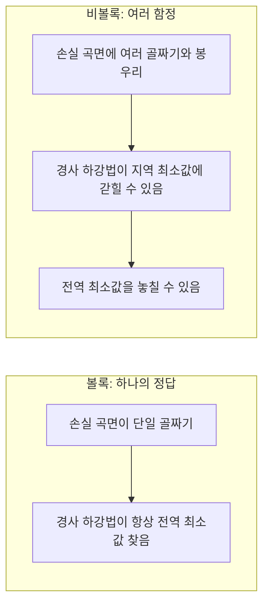
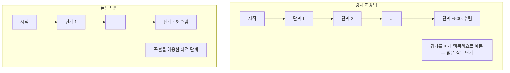
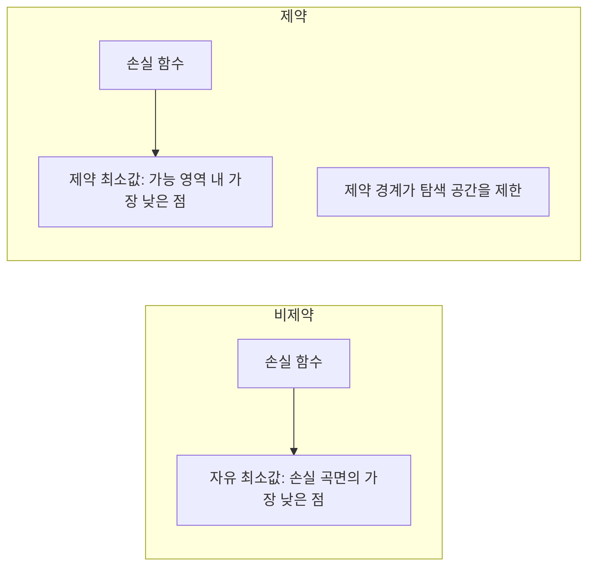
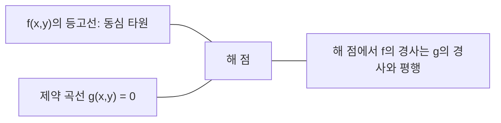

# 볼록 최적화(Convex Optimization)

> 볼록 문제는 하나의 골짜기를 가집니다. 신경망은 수백만 개의 골짜기를 가집니다. 이 차이를 아는 것이 중요합니다.

**유형:** Build  
**언어:** Python  
**선수 지식:** Phase 1, 강의 04 (ML을 위한 미적분학), 08 (최적화)  
**소요 시간:** ~90분

## 학습 목표

- 정의, 2차 도함수, 헤시안(Hessian) 기준을 사용하여 함수의 볼록성(convexity) 검증
- 뉴턴 방법(Newton's method) 구현 및 경사 하강법(gradient descent) 대비 2차 수렴(quadratic convergence) 특성 비교
- 라그랑주 승수(Lagrange multipliers)를 이용한 제약 최적화 문제 해결 및 KKT 조건 해석
- 신경망 손실 함수(loss function) 환경이 비볼록(non-convex)임에도 SGD가 우수한 해를 찾는 이유 설명

## 문제 정의

레슨 08에서는 경사 하강법(gradient descent), 모멘텀(momentum), 아담(Adam)을 배웠습니다. 이 옵티마이저들은 어떤 표면에서도 내리막길을 따라 이동합니다. 하지만 이들은 아무런 보장도 제공하지 않습니다. 비볼록(non-convex) 지형에서의 경사 하강법은 나쁜 국소 최소값(local minimum)에 갇히거나, 안장점(saddle point)에 붙들리거나, 영원히 진동할 수 있습니다. 그럼에도 불구하고 신경망은 비볼록하기 때문에 이를 사용했습니다.

하지만 머신러닝의 많은 문제들은 볼록(convex)합니다. 선형 회귀(linear regression), 로지스틱 회귀(logistic regression), 서포트 벡터 머신(SVMs), 라소(LASSO), 릿지 회귀(ridge regression) 등이 있습니다. 이러한 문제에는 더 강력한 방법이 존재합니다: 수학적 보장이 있는 최적화입니다. 볼록 문제는 정확히 하나의 골짜기를 가집니다. 내리막길을 따라 이동하는 어떤 알고리즘이든 전역 최소값(global minimum)에 도달합니다. 재시작도 필요 없고, 학습률 스케줄도 필요 없으며, 기도도 필요 없습니다.

볼록성(convexity)을 이해하는 것은 세 가지 이점을 제공합니다. 첫째, 문제가 쉬운 경우(볼록)와 어려운 경우(비볼록)를 구분할 수 있습니다. 둘째, 뉴턴 방법(Newton's method)과 같은 볼록 문제에 대한 더 빠른 도구를 사용할 수 있습니다. 셋째, 머신러닝 전반에 등장하는 개념들을 설명할 수 있습니다: 정규화(regularization)를 제약 조건으로 보는 시각, SVM에서의 쌍대성(duality), 그리고 딥러닝이 볼록성이 제공하는 모든 좋은 성질을 위반함에도 작동하는 이유 등입니다.

## 개념

### 볼록 집합

집합 S가 볼록 집합이라는 것은 S 내의 임의의 두 점에 대해, 그 두 점을 잇는 선분도 완전히 S 내에 있다는 것을 의미합니다.

| 볼록 집합 | 비볼록 집합 |
|---|---|
| **직사각형**: 내부의 임의의 두 점을 잇는 선분이 항상 내부에 있음 | **별/초승달 모양**: 두 내부 점을 잇는 선분이 집합 바깥으로 나갈 수 있음 |
| **삼각형**: 모든 내부 점에 대해 동일한 성질 성립 | **도넛/환형**: 구멍 때문에 일부 선분이 집합을 벗어남 |
| 임의의 두 점 사이의 선분이 집합 내에 완전히 포함됨 | 일부 점 쌍에 대해 선분이 집합을 벗어남 |

형식적 검증: S 내의 임의의 점 x, y와 [0, 1] 구간의 임의의 t에 대해, 점 tx + (1-t)y도 S에 속해야 합니다.

볼록 집합의 예:
- 직선, 평면, R^n 전체
- 공(구, 초구)
- 반공간: {x : a^T x <= b}
- 임의의 볼록 집합들의 교집합

비볼록 집합의 예:
- 도넛(환형)
- 서로 겹치지 않는 두 원의 합집합
- "움푹 패인 부분"이나 "구멍"이 있는 모든 집합

### 볼록 함수

함수 f가 볼록 함수라는 것은 정의역이 볼록 집합이며, 정의역 내의 임의의 두 점 x, y와 [0, 1] 구간의 임의의 t에 대해 다음 조건을 만족한다는 것을 의미합니다:

```
f(tx + (1-t)y) <= t*f(x) + (1-t)*f(y)
```

기하학적 의미: 그래프 상의 임의의 두 점을 잇는 선분이 그래프 위나 그 위에 위치합니다.

| 속성 | 볼록 함수 | 비볼록 함수 |
|---|---|---|
| **선분 테스트** | 그래프의 임의의 두 점을 잇는 선분이 곡선 **위 또는 그 위에** 있음 | 그래프의 일부 점을 잇는 선분이 곡선 **아래로** 내려감 |
| **형태** | 위로 볼록한 단일 골짜기 | 여러 봉우리와 골짜기가 혼재 |
| **지역 최소값** | 모든 지역 최소값이 전역 최소값 | 서로 다른 높이의 여러 지역 최소값 존재 가능 |

일반적인 볼록 함수:
- f(x) = x^2 (포물선)
- f(x) = |x| (절댓값)
- f(x) = e^x (지수 함수)
- f(x) = max(0, x) (ReLU, 조각별 선형)
- f(x) = -log(x) (x > 0인 경우, 음의 로그)
- 모든 선형 함수 f(x) = a^T x + b (볼록이면서 오목)

### 볼록성 검증

가장 쉬운 것부터 가장 엄밀한 것까지 세 가지 실용적 검증 방법.

**검증 1: 2차 도함수 테스트 (1차원).** 모든 x에 대해 f''(x) >= 0이면 f는 볼록 함수입니다.

- f(x) = x^2: f''(x) = 2 >= 0. 볼록.
- f(x) = x^3: f''(x) = 6x. x < 0일 때 음수. 비볼록.
- f(x) = e^x: f''(x) = e^x > 0. 볼록.

**검증 2: 헤시안 테스트 (다변수).** 모든 x에 대해 헤시안 행렬 H(x)가 양의 준정부호(positive semidefinite)이면 f는 볼록 함수입니다. 헤시안은 2차 편미분 계수로 구성된 행렬입니다.

**검증 3: 정의 테스트.** 부등식 f(tx + (1-t)y) <= t*f(x) + (1-t)*f(y)를 직접 확인합니다. 미분이 어려운 함수에 유용합니다.

### 볼록성이 중요한 이유

볼록 최적화의 중심 정리:

**볼록 함수의 경우, 모든 지역 최소값은 전역 최소값입니다.**

이는 경사 하강법이 갇히지 않음을 의미합니다. 어떤 내리막길을 따라가더라도 동일한 해에 도달합니다. 알고리즘은 최적해로 수렴함이 보장됩니다.



결과:
- 무작위 재시작 불필요
- 정교한 학습률 스케줄 불필요
- 수렴 증명 가능 (속도는 함수 특성에 따라 다름)
- 해가 유일함 (평탄한 영역 제외)

### ML에서의 볼록 vs 비볼록

| 문제 | 볼록? | 이유 |
|---------|---------|-----|
| 선형 회귀 (MSE) | 예 | 손실이 가중치에 대해 2차 |
| 로지스틱 회귀 | 예 | 로그 손실이 가중치에 대해 볼록 |
| SVM (힌지 손실) | 예 | 선형 함수들의 최대값 |
| LASSO (L1 회귀) | 예 | 볼록 함수들의 합은 볼록 |
| 릿지 회귀 (L2) | 예 | 2차 + 2차 = 볼록 |
| 신경망 (임의의 손실) | 아니오 | 비선형 활성화 함수가 비볼록 지형 생성 |
| k-평균 클러스터링 | 아니오 | 이산 할당 단계 |
| 행렬 분해 | 아니오 | 미지수의 곱 |

볼록 손실을 가진 선형 모델은 볼록합니다. 은닉층과 비선형 활성화 함수를 추가하는 순간 볼록성이 깨집니다.

### 헤시안 행렬

함수 f: R^n -> R의 헤시안 H는 n x n 행렬로, 2차 편미분 계수로 구성됩니다.

```
H[i][j] = d^2 f / (dx_i dx_j)
```

f(x, y) = x^2 + 3xy + y^2의 경우:

```
df/dx = 2x + 3y       d^2f/dx^2 = 2      d^2f/dxdy = 3
df/dy = 3x + 2y       d^2f/dydx = 3      d^2f/dy^2 = 2

H = [ 2  3 ]
    [ 3  2 ]
```

헤시안은 곡률을 나타냅니다:
- 모든 고유값이 양수: 모든 방향에서 위로 볼록 (해당 점에서 볼록)
- 모든 고유값이 음수: 모든 방향에서 아래로 볼록 (지역 최대)
- 부호가 혼합: 안장점 (일부 방향에서는 위로, 다른 방향에서는 아래로 볼록)
- 0인 고유값: 해당 방향에서 평탄 (퇴화)

볼록성을 위해 헤시안은 모든 점에서 양의 준정부호(모든 고유값 >= 0)여야 합니다.

### 뉴턴 방법

경사 하강법은 1차 정보(경사)를 사용합니다. 뉴턴 방법은 2차 정보(헤시안)를 사용합니다. 현재 점에서 2차 근사를 하고 그 2차 함수의 최소값으로 점프합니다.

```
업데이트 규칙:
  x_new = x - H^(-1) * gradient

경사 하강법과 비교:
  x_new = x - lr * gradient
```

뉴턴 방법은 스칼라 학습률을 역헤시안으로 대체합니다. 이는 지역 곡률에 따라 단계 크기와 방향을 자동으로 조정합니다.



장점:
- 최소값 근처에서 2차 수렴 (오차가 매 단계 제곱)
- 학습률 조정 불필요
- 스케일 불변 (문제 매개변수화 방식에 무관)

단점:
- 헤시안 계산에 O(n^2) 메모리, O(n^3) 역행렬 계산 비용
- 100만 개의 가중치를 가진 신경망의 경우, 10^12개의 항목과 10^18번의 연산
- 딥러닝에는 비실용적

### 제약 최적화

비제약 최적화: 모든 x에 대해 f(x)를 최소화.
제약 최적화: 제약 조건 하에서 f(x)를 최소화.

실제 문제는 제약 조건을 가집니다. 비용을 최소화하되 예산이 제한되어 있습니다. 오차를 최소화하되 모델 복잡도가 제한됩니다.



### 라그랑주 승수

라그랑주 승수법은 제약 문제를 비제약 문제로 변환합니다.

문제: g(x) = 0 하에서 f(x)를 최소화.

해결: 새로운 변수(라그랑주 승수 lambda)를 도입하고 비제약 문제를 풉니다:

```
L(x, lambda) = f(x) + lambda * g(x)
```

해에서는 L의 경사가 0입니다:

```
dL/dx = df/dx + lambda * dg/dx = 0
dL/dlambda = g(x) = 0
```

기하학적 직관: 제약 최소값에서 f의 경사는 제약 g의 경사와 평행해야 합니다. 평행하지 않다면 제약 표면을 따라 이동하여 f를 더 줄일 수 있습니다.



예: x + y = 1 하에서 f(x,y) = x^2 + y^2를 최소화.

```
L = x^2 + y^2 + lambda(x + y - 1)

dL/dx = 2x + lambda = 0  =>  x = -lambda/2
dL/dy = 2y + lambda = 0  =>  y = -lambda/2
dL/dlambda = x + y - 1 = 0

첫 두 식에서 x = y
대입: 2x = 1, 따라서 x = y = 0.5, lambda = -1
```

원점에서 직선 x + y = 1까지의 가장 가까운 점은 (0.5, 0.5)입니다.

### KKT 조건

카르슈-쿤-터커 조건은 라그랑주 승수법을 부등식 제약으로 확장합니다.

문제: g_i(x) <= 0 (i = 1, ..., m) 하에서 f(x)를 최소화.

KKT 조건 (최적성에 필요):

```
1. 정상성:    df/dx + sum(lambda_i * dg_i/dx) = 0
2. 프라이멀 실현 가능성:  g_i(x) <= 0  모든 i에 대해
3. 듀얼 실현 가능성:    lambda_i >= 0  모든 i에 대해
4. 상보적 여유:  lambda_i * g_i(x) = 0  모든 i에 대해
```

상보적 여유가 핵심입니다: 제약이 활성화(g_i = 0, 해가 경계에 있음)되거나 승수가 0(제약이 무관함)입니다. 해에 영향을 주지 않는 제약은 lambda = 0입니다.

KKT 조건은 SVM의 핵심입니다. 서포트 벡터는 제약이 활성화된 데이터 포인트(lambda > 0)입니다. 다른 모든 데이터 포인트는 lambda = 0이며 결정 경계에 영향을 주지 않습니다.

### 정규화를 제약 최적화로

L1 및 L2 정규화는 임의의 기법이 아닙니다. 제약 최적화 문제의 변형입니다.

**L2 정규화 (릿지):**

```
Loss(w)를 최소화, ||w||^2 <= t

동등한 비제약 형태:
Loss(w) + lambda * ||w||^2를 최소화
```

제약 ||w||^2 <= t는 공(2D에서는 원, 3D에서는 구)을 정의합니다. 해는 손실 등고선이 이 공에 처음 닿는 점입니다.

**L1 정규화 (LASSO):**

```
Loss(w)를 최소화, ||w||_1 <= t

동등한 비제약 형태:
Loss(w) + lambda * ||w||_1를 최소화
```

제약 ||w||_1 <= t는 다이아몬드(2D에서는 회전된 정사각형)를 정의합니다.

| 속성 | L2 제약 (원) | L1 제약 (다이아몬드) |
|---|---|---|
| **제약 형태** | 원(고차원에서는 구) | 다이아몬드(2D에서는 회전된 정사각형) |
| **손실 등고선이 닿는 위치** | 매끄러운 경계 — 원의 임의의 점 | 모서리 — 축과 정렬 |
| **해의 행동** | 가중치가 작지만 0이 아님 | 일부 가중치가 정확히 0 (희소) |
| **결과** | 가중치 축소 | 특성 선택 |

이것이 L1이 희소 모델(특성 선택)을 생성하는 반면 L2는 가중치를 축소만 하는 이유입니다. 다이아몬드는 축과 정렬된 모서리를 가집니다. 손실 등고선이 모서리에 닿을 가능성이 높아, 하나 이상의 가중치를 정확히 0으로 설정합니다.

### 쌍대성

모든 제약 최적화 문제(프라이멀)에는 동반자 문제(듀얼)가 있습니다. 볼록 문제의 경우 프라이멀과 듀얼은 동일한 최적값을 가집니다. 이를 강한 쌍대성라고 합니다.

라그랑주 듀얼 함수:

```
프라이멀: g(x) <= 0 하에서 f(x) 최소화
라그랑지안: L(x, lambda) = f(x) + lambda * g(x)
듀얼 함수: d(lambda) = min_x L(x, lambda)
듀얼 문제: lambda >= 0 하에서 d(lambda) 최대화
```

쌍대성이 중요한 이유:
- 듀얼 문제가 프라이멀보다 풀기 쉬운 경우가 있음
- SVM은 듀얼 형태로 풀리며, 문제는 데이터 포인트 간의 내적에 의존함 (커널 트릭 가능)
- 듀얼은 프라이멀 최적값에 대한 하한을 제공하여 해 품질 검증에 유용

특히 SVM의 경우:

```
프라이멀: 모든 i에 대해 y_i(w^T x_i + b) >= 1 하에서 마진 2/||w||를 최대화하는 w, b 찾기

듀얼:   sum(alpha_i) - 0.5 * sum_ij(alpha_i * alpha_j * y_i * y_j * x_i^T x_j) 최대화
        alpha_i >= 0 및 sum(alpha_i * y_i) = 0 하에서

듀얼은 내적 x_i^T x_j만 포함함.
x_i^T x_j를 K(x_i, x_j)로 대체하면 커널 트릭이 됨.
```

### 비볼록성에도 딥러닝이 작동하는 이유

신경망 손실 함수는 극도로 비볼록합니다. 고전적인 모든 측정 기준에 따르면 최적화는 실패해야 합니다. 그러나 확률적 경사 하강법은 신뢰성 있게 좋은 해를 찾습니다. 여러 요인이 이를 설명합니다.

**대부분의 지역 최소값은 충분히 좋음.** 고차원 공간에서 무작위 임계점(경사가 0인 점)은 압도적으로 안장점이며 지역 최소값이 아닙니다. 존재하는 소수의 지역 최소값은 전역 최소값에 가까운 손실 값을 가집니다. 매개변수 공간이 수백만 차원일 때 끔찍한 지역 최소값에 갇힐 확률은 극히 낮습니다.

**지역 최소값이 아닌 안장점이 진짜 장애물.** n개의 매개변수를 가진 함수에서 안장점은 양의 곡률과 음의 곡률 방향이 혼재합니다. 고차원에서 무작위 임계점이 모든 n개의 고유값이 양수(지역 최소값)일 확률은 대략 2^(-n)입니다. 거의 모든 임계점은 안장점입니다. SGD의 노이즈는 이를 탈출하는 데 도움을 줍니다.

**과매개변수화는 지형을 부드럽게 함.** 훈련 예제보다 더 많은 매개변수를 가진 네트워크는 더 부드럽고 연결된 손실 곡면을 가집니다. 더 넓은 네트워크는 나쁜 지역 최소값이 적습니다. 이는 직관적이지만 경험적으로 일관됩니다.

**손실 곡면 구조:**

| 속성 | 저차원 공간 | 고차원 공간 |
|---|---|---|
| **지형** | 많은 고립된 봉우리와 골짜기 | 부드럽게 연결된 골짜기 |
| **최소값** | 많은 고립된 지역 최소값 | 나쁜 지역 최소값 적음; 대부분 근사 최적 |
| **탐색** | 전역 최소값 찾기 어려움 | 많은 경로가 좋은 해로 이어짐 |
| **임계점** | 지역 최소값과 안장점 혼재 | 압도적으로 안장점, 지역 최소값 아님 |

**확률적 노이즈는 암시적 정규화 역할.** 미니배치 SGD의 노이즈는 날카로운 최소값에 정착하는 것을 방지합니다. 날카로운 최소값은 과적합되며, 평탄한 최소값은 일반화됩니다. 노이즈는 손실 곡면의 평탄한 영역으로 최적화를 편향시킵니다.

### 실제 2차 방법

순수 뉴턴 방법은 대규모 모델에 비실용적입니다. 여러 근사 기법을 통해 2차 정보를 활용할 수 있습니다.

**L-BFGS (제한 메모리 BFGS):** 최근 m개의 경사 차이를 사용해 역헤시안을 근사합니다. O(n^2) 대신 O(mn) 메모리를 사용합니다. 최대 ~10,000개의 매개변수를 가진 문제에 적합합니다. 고전적 ML(로지스틱 회귀, CRF)에서 사용되지만 딥러닝에는 적합하지 않습니다.

**자연 경사:** 표준 헤시안 대신 피셔 정보 행렬(로그 우도의 기대 헤시안)을 사용합니다. 이는 확률 분포의 기하학을 고려합니다. K-FAC(Kronecker-Factored Approximate Curvature)는 피셔 행렬을 크로네커 곱으로 근사하여 신경망에 실용적으로 만듭니다.

**헤시안-프리 최적화:** 켤레 경사를 사용해 Hx = g를 H를 형성하지 않고 풉니다. 자동 미분을 통해 O(n) 시간에 헤시안-벡터 곱을 계산할 수 있습니다.

**대각 근사:** Adam의 2차 모멘트는 헤시안 대각선의 대각 근사입니다. AdaHessian은 Hutchinson 추정량을 통해 실제 헤시안 대각선 요소를 사용합니다.

| 방법 | 메모리 | 단계별 비용 | 사용 시기 |
|--------|--------|--------------|-------------|
| 경사 하강법 | O(n) | O(n) | 대규모 모델의 기준 |
| 뉴턴 방법 | O(n^2) | O(n^3) | 소규모 볼록 문제 |
| L-BFGS | O(mn) | O(mn) | 중간 규모 볼록 문제 |
| Adam | O(n) | O(n) | 딥러닝 기본값 |
| K-FAC | O(n) | O(n) per layer | 대규모 배치 훈련 연구 |

## 구축

### 1단계: 볼록성 검사기

점 샘플링을 통해 볼록성을 경험적으로 테스트하는 함수를 구축합니다.

```python
import random
import math

def check_convexity(f, dim, bounds=(-5, 5), samples=1000):
    violations = 0
    for _ in range(samples):
        x = [random.uniform(*bounds) for _ in range(dim)]
        y = [random.uniform(*bounds) for _ in range(dim)]
        t = random.uniform(0, 1)
        mid = [t * xi + (1 - t) * yi for xi, yi in zip(x, y)]
        lhs = f(mid)
        rhs = t * f(x) + (1 - t) * f(y)
        if lhs > rhs + 1e-10:
            violations += 1
    return violations == 0, violations
```

### 2단계: 2D 뉴턴 방법

명시적 헤시안(Hessian)을 사용하는 뉴턴 방법을 구현합니다. 경사 하강법(gradient descent)과 수렴 속도를 비교합니다.

```python
def newtons_method(f, grad_f, hessian_f, x0, steps=50, tol=1e-12):
    x = list(x0)
    history = [x[:]]
    for _ in range(steps):
        g = grad_f(x)
        H = hessian_f(x)
        det = H[0][0] * H[1][1] - H[0][1] * H[1][0]
        if abs(det) < 1e-15:
            break
        H_inv = [
            [H[1][1] / det, -H[0][1] / det],
            [-H[1][0] / det, H[0][0] / det],
        ]
        dx = [
            H_inv[0][0] * g[0] + H_inv[0][1] * g[1],
            H_inv[1][0] * g[0] + H_inv[1][1] * g[1],
        ]
        x = [x[0] - dx[0], x[1] - dx[1]]
        history.append(x[:])
        if sum(gi ** 2 for gi in g) < tol:
            break
    return history
```

### 3단계: 라그랑주 승수법 해결기

라그랑주 함수에 대한 경사 하강법을 사용하여 제약 최적화 문제를 해결합니다.

```python
def lagrange_solve(f_grad, g_val, g_grad, x0, lr=0.01,
                   lr_lambda=0.01, steps=5000):
    x = list(x0)
    lam = 0.0
    history = []
    for _ in range(steps):
        fg = f_grad(x)
        gv = g_val(x)
        gg = g_grad(x)
        x = [
            xi - lr * (fgi + lam * ggi)
            for xi, fgi, ggi in zip(x, fg, gg)
        ]
        lam = lam + lr_lambda * gv
        history.append((x[:], lam, gv))
    return history
```

### 4단계: 1차 vs 2차 방법 비교

동일한 이차 함수(quadratic function)에 대해 경사 하강법과 뉴턴 방법을 실행합니다. 수렴까지 필요한 단계 수를 비교합니다.

```python
def quadratic(x):
    return 5 * x[0] ** 2 + x[1] ** 2

def quadratic_grad(x):
    return [10 * x[0], 2 * x[1]]

def quadratic_hessian(x):
    return [[10, 0], [0, 2]]
```

뉴턴 방법은 1단계 만에 수렴합니다(이차 함수에 대해 정확함). 반면 경사 하강법은 헤시안(Hessian)의 고유값(eigenvalue)이 5배 차이가 나므로 길쭉한 계곡(elongated valley)이 생성되어 수백 단계가 필요합니다.

## 사용 방법

볼록성 분석은 ML 모델과 솔버 선택 시 직접적으로 적용됩니다.

볼록 문제(로지스틱 회귀, SVM, LASSO)의 경우:
- 전용 솔버 사용 (liblinear, CVXPY, scipy.optimize.minimize with method='L-BFGS-B')
- 유일한 전역 해 기대
- 2차 방법이 실용적이고 빠름

비볼록 문제(신경망)의 경우:
- 1차 방법 사용 (SGD, Adam)
- 해가 초기화 및 무작위성에 의존함을 수용
- 과매개변수화, 노이즈, 학습률 스케줄링을 암시적 정규화로 사용
- 전역 최소값 탐색에 시간 낭비하지 말 것. 좋은 지역 최소값으로 충분

```python
from scipy.optimize import minimize

result = minimize(
    fun=lambda w: sum((y - X @ w) ** 2) + 0.1 * sum(w ** 2),
    x0=np.zeros(d),
    method='L-BFGS-B',
    jac=lambda w: -2 * X.T @ (y - X @ w) + 0.2 * w,
)
```

SVM의 경우 쌍대 형식을 통해 커널 트릭 사용 가능:

```python
from sklearn.svm import SVC

svm = SVC(kernel='rbf', C=1.0)
svm.fit(X_train, y_train)
print(f"서포트 벡터: {svm.n_support_}")
```

## 연습 문제

1. **볼록성 갤러리.** 다음 함수들을 체커로 테스트하여 볼록성을 확인하시오: f(x) = x^4, f(x) = sin(x), f(x,y) = x^2 + y^2, f(x,y) = x*y, f(x) = max(x, 0). 각 결과가 왜 타당한지 설명하시오.

2. **뉴턴 vs 경사 하강법 경쟁.** 시작점 (10, 10)에서 함수 f(x,y) = 50*x^2 + y^2에 대해 두 방법을 실행하시오. 손실 < 1e-10에 도달하기 위해 각각 몇 단계가 필요한지 확인하시오. 조건 수(헤시안 고유값 중 가장 큰 값과 가장 작은 값의 비율)가 증가할 때 경사 하강법에 어떤 현상이 발생하는지 설명하시오.

3. **라그랑주 승수 기하학.** 제약 조건 x + 2y = 4 하에서 f(x,y) = (x-3)^2 + (y-3)^2를 최소화하시오. 해에서 f의 그래디언트가 g의 그래디언트와 평행함을 확인하여 해를 검증하시오.

4. **정규화 제약.** L1-제약 최적화를 구현하시오: (x-3)^2 + (y-2)^2를 최소화하되 |x| + |y| <= 1을 만족해야 함. 해가 한 좌표가 0인 경우(다이아몬드 제약으로 인한 희소성)를 보여시오.

5. **헤시안 고유값 분석.** 로젠브록 함수의 헤시안을 (1,1)과 (-1,1)에서 계산하시오. 두 점에서 고유값을 계산하시오. 고유값이 최소점 근처와 멀리 떨어진 지점에서의 곡률에 대해 무엇을 알려주는지 설명하시오.

## 주요 용어

| 용어 | 의미 |
|------|------|
| 볼록 집합(Convex set) | 집합 내 임의의 두 점 사이의 선분이 집합 내부에 완전히 포함되는 집합 |
| 볼록 함수(Convex function) | 그래프 상 임의의 두 점 사이의 선분이 그래프 위 또는 위에 위치하는 함수. 동치적으로 헤시안(Hessian)이 모든 곳에서 반양정치(positive semidefinite) |
| 국소 최소점(Local minimum) | 주변 모든 점보다 낮은 값을 갖는 점. 볼록 함수의 경우 모든 국소 최소점은 전역 최소점 |
| 전역 최소점(Global minimum) | 함수 전체 정의역에서 가장 낮은 값을 갖는 점 |
| 헤시안 행렬(Hessian matrix) | 모든 2차 편미분으로 구성된 행렬. 곡률 정보를 인코딩 |
| 반양정치(Positive semidefinite) | 모든 고유값이 음수가 아닌 행렬. 다차원에서 "2차 미분 ≥ 0"의 개념 확장 |
| 조건수(Condition number) | 헤시안의 최대 고유값과 최소 고유값의 비율. 높은 조건수는 길쭉한 골짜기와 느린 경사하강법을 의미 |
| 뉴턴 방법(Newton's method) | 역헤시안을 사용하여 단계 방향과 크기를 결정하는 2차 최적화 방법. 최소점 근처에서 2차 수렴 |
| 라그랑주 승수(Lagrange multiplier) | 제약 최적화 문제를 비제약 문제로 변환하기 위해 도입되는 변수 |
| KKT 조건(KKT conditions) | 부등식 제약이 있는 최적성 필요 조건. 라그랑주 승수법을 일반화 |
| 상호 보완성(Complementary slackness) | 해에서 제약 조건이 활성화되거나 승수가 0. 둘 다 0이 아닌 경우는 없음 |
| 쌍대성(Duality) | 모든 제약 문제는 쌍대 문제를 가짐. 볼록 문제의 경우 둘 다 동일한 최적값을 가짐 |
| 강한 쌍대성(Strong duality) | 원문제(primal)와 쌍문제(dual)의 최적값이 동일. 슬레이터 조건(Slater's condition)을 만족하는 볼록 문제에서 성립 |
| L-BFGS(L-BFGS) | 전체 헤시안 대신 최근 m개의 그래디언트 차이를 저장하는 근사 2차 방법 |
| 안장점(Saddle point) | 그래디언트가 0이지만 일부 방향에서는 최소점, 다른 방향에서는 최대점인 지점 |
| 과매개변수화(Overparameterization) | 훈련 예제보다 더 많은 매개변수를 사용. 손실 함수의 지형을 부드럽게 하고 나쁜 국소 최소점을 줄임

## 추가 자료

- [Boyd & Vandenberghe: Convex Optimization](https://web.stanford.edu/~boyd/cvxbook/) - 표준 교재, 온라인에서 무료로 이용 가능
- [Bottou, Curtis, Nocedal: Optimization Methods for Large-Scale Machine Learning (2018)](https://arxiv.org/abs/1606.04838) - 볼록 최적화 이론과 딥러닝 실무의 연결
- [Choromanska et al.: The Loss Surfaces of Multilayer Networks (2015)](https://arxiv.org/abs/1412.0233) - 비볼록 신경망 손실 함수가 생각보다 나쁘지 않은 이유
- [Nocedal & Wright: Numerical Optimization](https://link.springer.com/book/10.1007/978-0-387-40065-5) - 뉴턴 방법(Newton's method), L-BFGS, 제약 최적화에 대한 종합 참고서