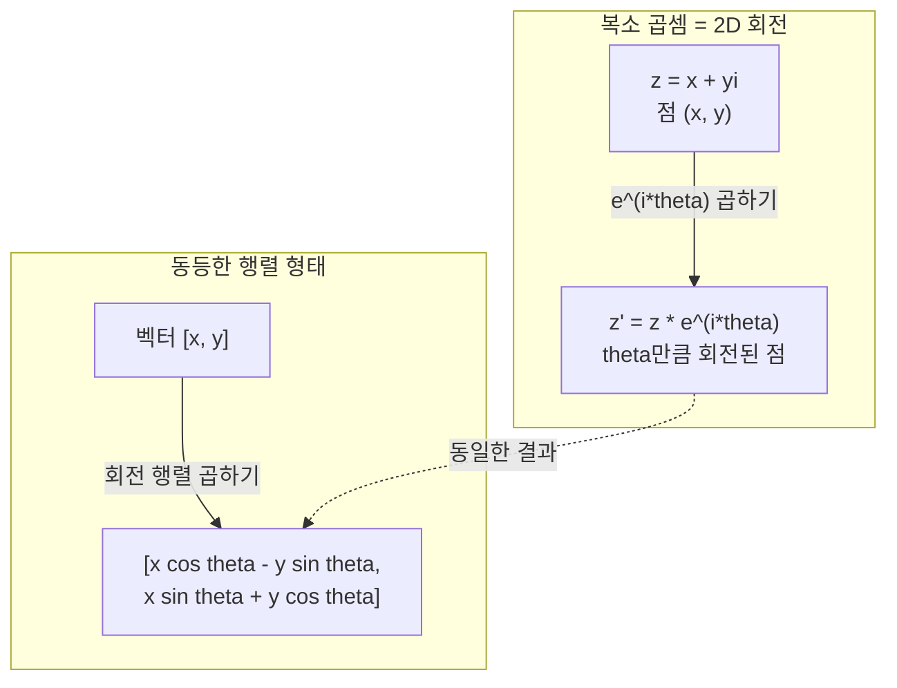
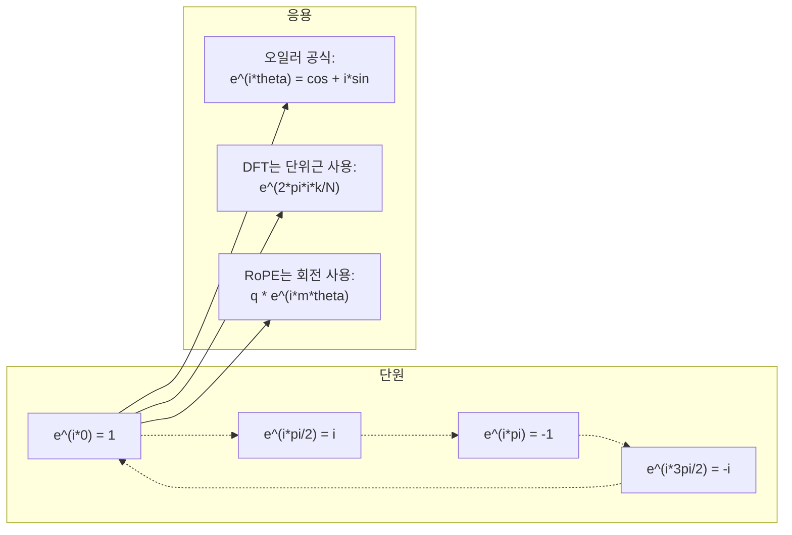

# AI를 위한 복소수

> -1의 제곱근은 허수가 아닙니다. 회전, 주파수, 신호 처리의 절반을 여는 열쇠입니다.

**유형:** 학습  
**언어:** Python  
**선수 지식:** 1단계, 레슨 01-04 (선형 대수, 미적분학)  
**소요 시간:** ~60분

## 학습 목표

- 직교좌표계 및 극좌표계 형태에서 복소수 연산(덧셈, 곱셈, 나눗셈, 켤레복소수) 수행
- 오일러 공식을 적용하여 복소수 지수 함수와 삼각함수 간 변환
- 단위근(roots of unity)을 이용한 이산 푸리에 변환(DFT) 구현
- 복소수 회전이 RoPE(Rotary Position Embedding) 및 트랜스포머의 사인파 위치 인코딩에 어떻게 활용되는지 설명

> **참고**: 전문 용어는 한국어(영어) 형식으로 표기 (예: 켤레복소수(complex conjugate), 단위근(roots of unity), 이산 푸리에 변환(Discrete Fourier Transform, DFT), 오일러 공식(Euler's formula))

## 문제 정의

푸리에 변환 논문을 펼치면 `i`가 도처에 등장합니다. 트랜스포머 위치 인코딩을 보면 다양한 주파수에서 `sin`과 `cos`를 볼 수 있는데, 이는 복소수 지수 함수의 실수부와 허수부에 해당합니다. 양자 컴퓨팅을 읽다 보면 모든 것이 복소수 벡터 공간으로 표현된다는 것을 알게 됩니다.

복소수는 추상적으로 느껴집니다. -1의 제곱근을 기반으로 한 수 체계는 수학적 트릭처럼 보일 수 있습니다. 하지만 이는 트릭이 아닙니다. 복소수야말로 회전과 진동을 표현하는 자연스러운 언어입니다. 어떤 것이 회전하거나, 진동하거나, 진동할 때마다 복소수가 바로 그 문제를 해결할 도구입니다.

복소수를 이해하지 못하면 이산 푸리에 변환(Discrete Fourier Transform)을 이해할 수 없습니다. FFT도 이해할 수 없습니다. 현대 언어 모델에서 RoPE(Rotary Position Embedding)가 어떻게 작동하는지 이해할 수 없습니다. 또한 원본 트랜스포머 논문에서 사인 곡선형 위치 인코딩이 왜 특정 주파수를 사용하는지 이해할 수 없습니다.

이 강의에서는 복소수 연산을 기초부터 구축하고, 이를 기하학과 연결하며, 머신러닝에서 복소수가 정확히 어디에 등장하는지 보여줍니다.

## 복소수의 개념

### 복소수는 무엇인가?

복소수는 실수부와 허수부 두 부분으로 구성됩니다.

```
z = a + bi

여기서:
  a는 실수부
  b는 허수부
  i는 허수 단위이며, i^2 = -1로 정의됨
```

이것이 전부입니다. 수직선을 평면으로 확장한 것입니다. 실수는 한 축에, 허수는 다른 축에 위치합니다. 모든 복소수는 이 평면의 한 점입니다.

### 복소수 연산

**덧셈.** 실수부를 더하고 허수부를 더합니다.

```
(a + bi) + (c + di) = (a + c) + (b + d)i

예: (3 + 2i) + (1 + 4i) = 4 + 6i
```

**곱셈.** 분배 법칙을 사용하고 i^2 = -1임을 기억합니다.

```
(a + bi)(c + di) = ac + adi + bci + bdi^2
                 = ac + adi + bci - bd
                 = (ac - bd) + (ad + bc)i

예: (3 + 2i)(1 + 4i) = 3 + 12i + 2i + 8i^2
                            = 3 + 14i - 8
                            = -5 + 14i
```

**켤레 복소수.** 허수부의 부호를 바꿉니다.

```
(a + bi)의 켤레 복소수 = a - bi
```

복소수와 그 켤레 복소수의 곱은 항상 실수입니다.

```
(a + bi)(a - bi) = a^2 + b^2
```

**나눗셈.** 분자와 분모에 분모의 켤레 복소수를 곱합니다.

```
(a + bi) / (c + di) = (a + bi)(c - di) / (c^2 + d^2)
```

이렇게 하면 분모에서 허수부가 제거되어 깔끔한 복소수를 얻습니다.

### 복소 평면

복소 평면은 모든 복소수를 2D 점에 매핑합니다. 수평축은 실수축, 수직축은 허수축입니다.

```
z = 3 + 2i는 점 (3, 2)에 대응
z = -1 + 0i는 실수축 위의 점 (-1, 0)에 대응
z = 0 + 4i는 허축 위의 점 (0, 4)에 대응
```

복소수는 동시에 점이자 원점에서 시작하는 벡터입니다. 이 이중 해석이 복소수를 기하학에 유용하게 만듭니다.

### 극형식

평면의 모든 점은 원점으로부터의 거리와 양의 실수축으로부터의 각도로 표현할 수 있습니다.

```
z = r * (cos(theta) + i*sin(theta))

여기서:
  r = |z| = sqrt(a^2 + b^2)     (크기 또는 모듈러스)
  theta = atan2(b, a)             (위상 또는 편각)
```

직교형식(a + bi)은 덧셈에 적합합니다. 극형식(r, theta)은 곱셈에 적합합니다.

**극형식에서의 곱셈.** 크기를 곱하고 각도를 더합니다.

```
z1 = r1 * e^(i*theta1)
z2 = r2 * e^(i*theta2)

z1 * z2 = (r1 * r2) * e^(i*(theta1 + theta2))
```

이것이 복소수가 회전에 완벽한 이유입니다. 크기가 1인 복소수로 곱하면 순수 회전이 됩니다.

### 오일러 공식

복소 지수 함수와 삼각 함수 사이의 다리 역할:

```
e^(i*theta) = cos(theta) + i*sin(theta)
```

이 공식은 이 수업에서 가장 중요한 공식입니다. theta = pi일 때:

```
e^(i*pi) = cos(pi) + i*sin(pi) = -1 + 0i = -1

따라서: e^(i*pi) + 1 = 0
```

5개의 기본 상수(e, i, pi, 1, 0)가 하나의 방정식으로 연결됩니다.

### 오일러 공식이 ML에 중요한 이유

오일러 공식은 `e^(i*theta)`가 theta가 변함에 따라 단위원을 따라 이동함을 나타냅니다. theta = 0일 때 (1, 0)에 위치합니다. theta = pi/2일 때 (0, 1)에 위치합니다. theta = pi일 때 (-1, 0)에 위치합니다. theta = 3*pi/2일 때 (0, -1)에 위치합니다. 완전한 회전은 theta = 2*pi입니다.

이는 복소 지수 함수가 회전임을 의미합니다. 그리고 회전은 신호 처리와 ML 도처에 있습니다.

### 2D 회전과의 연결

복소수 (x + yi)에 e^(i*theta)를 곱하면 점 (x, y)가 원점을 중심으로 각도 theta만큼 회전합니다.

```
복소 곱셈을 통한 회전:
  (x + yi) * (cos(theta) + i*sin(theta))
  = (x*cos(theta) - y*sin(theta)) + (x*sin(theta) + y*cos(theta))i

행렬 곱셈을 통한 회전:
  [cos(theta)  -sin(theta)] [x]   [x*cos(theta) - y*sin(theta)]
  [sin(theta)   cos(theta)] [y] = [x*sin(theta) + y*cos(theta)]
```

둘은 동일한 결과를 생성합니다. 복소 곱셈은 2D 회전입니다. 회전 행렬은 단지 행렬 표기법으로 쓴 복소 곱셈일 뿐입니다.



### 페이저와 회전하는 신호

복소 지수 e^(i*omega*t)는 각주파수 omega로 단위원을 따라 회전하는 점입니다. t가 증가함에 따라 점은 원을 그립니다.

이 회전점의 실수부는 cos(omega*t)입니다. 허수부는 sin(omega*t)입니다. 사인파 신호는 회전하는 복소수의 그림자입니다.

```
e^(i*omega*t) = cos(omega*t) + i*sin(omega*t)

실수부:      cos(omega*t)    -- 코사인 파
허수부:      sin(omega*t)    -- 사인 파
```

이것이 페이저 표현입니다. 흔들리는 사인파를 추적하는 대신 부드럽게 회전하는 화살표를 추적합니다. 위상 변화는 각도 오프셋이 됩니다. 진폭 변화는 크기 변화가 됩니다. 신호 추가는 벡터 추가가 됩니다.

### 단위근

N차 단위근은 단위원에 균일하게 분포된 N개의 점입니다.

```
w_k = e^(2*pi*i*k/N)    k = 0, 1, 2, ..., N-1
```

N = 4일 때 근은: 1, i, -1, -i (네 방향점)입니다.
N = 8일 때 네 방향점과 네 대각선 점이 추가됩니다.

단위근은 이산 푸리에 변환(DFT)의 기초입니다. DFT는 신호를 이 N개의 균일한 주파수 성분으로 분해합니다.

### DFT와의 연결

신호 x[0], x[1], ..., x[N-1]의 이산 푸리에 변환은:

```
X[k] = sum_{n=0}^{N-1} x[n] * e^(-2*pi*i*k*n/N)
```

각 X[k]는 신호가 k번째 단위근(주파수 k의 복소 사인파)과 얼마나 상관되는지를 측정합니다. DFT는 신호를 N개의 회전하는 페이저로 분해하고 각각의 진폭과 위상을 알려줍니다.

### i가 허수가 아닌 이유

"허수"라는 단어는 역사적 사고입니다. 데카르트가 경멸적으로 사용한 용어입니다. 하지만 i는 음수가 처음 등장했을 때 사람들이 거부했던 것처럼 허수적이지 않습니다. 음수는 "3에서 5를 빼면?"이라는 질문에 답합니다. 허수 단위 i는 "제곱하면 -1이 되는 수는?"이라는 질문에 답합니다.

더 유용하게: i는 90도 회전 연산자입니다. 실수에 i를 한 번 곱하면 허수축으로 90도 회전합니다. i를 다시 곱하면(i^2) 또 90도 회전하여 음의 실수 방향을 가리킵니다. 그래서 i^2 = -1입니다. 이는 신비로운 것이 아니라 두 번의 1/4회전이 합쳐진 반회전입니다.

이것이 복소수가 공학 도처에 있는 이유입니다. 회전하는 모든 것(전자기파, 양자 상태, 신호 진동, 위치 인코딩)은 복소수로 자연스럽게 설명됩니다.

### 복소 지수 vs 삼각 함수

오일러 공식 이전에는 엔지니어들이 신호를 A*cos(omega*t + phi)로 썼습니다. 진폭 A, 주파수 omega, 위상 phi입니다. 이 방법은 작동하지만 산술 연산이 복잡합니다. 서로 다른 위상을 가진 두 코사인을 더하려면 삼각 항등식이 필요합니다.

복소 지수를 사용하면 같은 신호가 A*e^(i*(omega*t + phi))가 됩니다. 두 신호를 더하는 것은 두 복소수를 더하는 것입니다. 곱셈(변조)은 크기를 곱하고 각도를 더하는 것입니다. 위상 변화는 각도 추가가 됩니다. 주파수 변화는 페이저 곱셈이 됩니다.

신호 처리 분야 전체가 복소 지수 표기로 전환한 이유는 수학이 더 깔끔하기 때문입니다. "실제 신호"는 항상 복소 표현의 실수부입니다. 허수부는 모든 대수를 자연스럽게 작동하도록 하는 부기(bookkeeping)로 따라옵니다.

### 트랜스포머와의 연결

**사인파 위치 인코딩** (원래 트랜스포머 논문):

```
PE(pos, 2i) = sin(pos / 10000^(2i/d))
PE(pos, 2i+1) = cos(pos / 10000^(2i/d))
```

사인과 코사인 쌍은 서로 다른 주파수의 복소 지수 함수의 실수부와 허수부입니다. 각 주파수는 위치 인코딩을 위한 다른 "해상도"를 제공합니다. 저주파는 천천히 변화(거친 위치)하고 고주파는 빠르게 변화(세밀한 위치)합니다. 함께 각 위치에 고유한 주파수 지문을 제공합니다.

**RoPE (회전 위치 임베딩)**는 이를 더 발전시킵니다. 쿼리와 키 벡터에 명시적으로 복소 회전 행렬을 곱합니다. 두 토큰 사이의 상대 위치는 회전 각도가 됩니다. 어텐션은 이 회전된 벡터를 사용하여 계산되며, 모델은 복소 곱셈을 통해 상대 위치에 민감해집니다.

| 연산 | 대수적 형태 | 기하학적 의미 |
|-----------|---------------|-------------------|
| 덧셈 | (a+c) + (b+d)i | 평면에서의 벡터 덧셈 |
| 곱셈 | (ac-bd) + (ad+bc)i | 회전 및 확대 |
| 켤레 복소수 | a - bi | 실수축에 대한 반사 |
| 크기 | sqrt(a^2 + b^2) | 원점으로부터의 거리 |
| 위상 | atan2(b, a) | 양의 실수축으로부터의 각도 |
| 나눗셈 | 켤레 복소수 곱하기 | 회전 역방향 및 재조정 |
| 거듭제곱 | r^n * e^(i*n*theta) | n번 회전, r^n으로 확대 |



## 구축

### 단계 1: 복소수 클래스

산술 연산, 크기, 위상, 직교 좌표계와 극좌표계 간 변환을 지원하는 복소수 클래스를 구축합니다.

```python
import math

class Complex:
    def __init__(self, real, imag=0.0):
        self.real = real
        self.imag = imag

    def __add__(self, other):
        return Complex(self.real + other.real, self.imag + other.imag)

    def __mul__(self, other):
        r = self.real * other.real - self.imag * other.imag
        i = self.real * other.imag + self.imag * other.real
        return Complex(r, i)

    def __truediv__(self, other):
        denom = other.real ** 2 + other.imag ** 2
        r = (self.real * other.real + self.imag * other.imag) / denom
        i = (self.imag * other.real - self.real * other.imag) / denom
        return Complex(r, i)

    def magnitude(self):
        return math.sqrt(self.real ** 2 + self.imag ** 2)

    def phase(self):
        return math.atan2(self.imag, self.real)

    def conjugate(self):
        return Complex(self.real, -self.imag)
```

### 단계 2: 극좌표 변환과 오일러 공식

```python
def to_polar(z):
    return z.magnitude(), z.phase()

def from_polar(r, theta):
    return Complex(r * math.cos(theta), r * math.sin(theta))

def euler(theta):
    return Complex(math.cos(theta), math.sin(theta))
```

검증: `euler(theta).magnitude()`는 항상 1.0이어야 합니다. `euler(0)`은 (1, 0)을 반환해야 합니다. `euler(pi)`는 (-1, 0)을 반환해야 합니다.

### 단계 3: 회전

점 (x, y)를 각도 theta만큼 회전시키는 것은 복소수 곱셈 하나입니다:

```python
point = Complex(3, 4)
rotated = point * euler(math.pi / 4)
```

크기는 그대로 유지됩니다. 각도만 변경됩니다.

### 단계 4: 복소수 산술 연산을 통한 DFT

```python
def dft(signal):
    N = len(signal)
    result = []
    for k in range(N):
        total = Complex(0, 0)
        for n in range(N):
            angle = -2 * math.pi * k * n / N
            total = total + Complex(signal[n], 0) * euler(angle)
        result.append(total)
    return result
```

이것은 O(N²) DFT입니다. 각 출력 X[k]는 신호 샘플에 단위 근을 곱한 합입니다.

### 단계 5: 역 DFT

역 DFT는 스펙트럼에서 원본 신호를 재구성합니다. 순방향 DFT와의 유일한 차이점은 지수의 부호 반전과 N으로 나누는 것입니다:

```python
def idft(spectrum):
    N = len(spectrum)
    result = []
    for n in range(N):
        total = Complex(0, 0)
        for k in range(N):
            angle = 2 * math.pi * k * n / N
            total = total + spectrum[k] * euler(angle)
        result.append(Complex(total.real / N, total.imag / N))
    return result
```

이것은 완벽한 재구성을 제공합니다. DFT를 적용한 후 IDFT를 적용하면 기계 정밀도 수준에서 원본 신호를 다시 얻을 수 있습니다. 정보가 손실되지 않습니다.

### 단계 6: 단위 근

```python
def roots_of_unity(N):
    return [euler(2 * math.pi * k / N) for k in range(N)]
```

두 가지 속성을 검증하세요:
- 모든 근의 크기는 정확히 1입니다.
- 모든 N개의 근의 합은 0입니다(대칭에 의해 상쇄됨).

이러한 속성들이 DFT를 가역적(invertible)으로 만듭니다. 단위 근은 주파수 영역의 직교 기저(orthogonal basis)를 형성합니다.

## 사용 방법

Python은 복소수 지원을 내장하고 있습니다. 리터럴 `j`는 허수 단위를 나타냅니다.

```python
z = 3 + 2j
w = 1 + 4j

print(z + w)
print(z * w)
print(abs(z))

import cmath
print(cmath.phase(z))
print(cmath.exp(1j * cmath.pi))
```

배열의 경우 NumPy가 복소수를 네이티브로 처리합니다:

```python
import numpy as np

z = np.array([1+2j, 3+4j, 5+6j])
print(np.abs(z))
print(np.angle(z))
print(np.conj(z))
print(np.real(z))
print(np.imag(z))

signal = np.sin(2 * np.pi * 5 * np.linspace(0, 1, 128))
spectrum = np.fft.fft(signal)
freqs = np.fft.fftfreq(128, d=1/128)
```

## Ship It

`code/complex_numbers.py`를 실행하여 `outputs/skill-complex-arithmetic.md`를 생성하세요.

## 연습 문제

1. **복소수 연산 손으로 계산하기.** (2 + 3i) * (4 - i)를 계산하고 코드로 검증하세요. 그런 다음 (5 + 2i) / (1 - 3i)를 계산하세요. 두 결과를 복소 평면에 표시하고, 곱셈이 첫 번째 수를 회전 및 스케일링했는지 확인하세요.

2. **회전 시퀀스.** 점 (1, 0)에서 시작하세요. e^(i*pi/6)을 12번 곱하세요. 12번 곱셈 후 (1, 0)으로 돌아오는지 확인하세요. 각 단계의 좌표를 출력하고 정12각형을 그리는지 확인하세요.

3. **알려진 신호의 DFT.** 32개 점으로 샘플링된 sin(2*pi*3*t)와 0.5*sin(2*pi*7*t)의 합을 나타내는 신호를 생성하세요. DFT를 실행하세요. 크기 스펙트럼에서 주파수 3과 7에 피크가 있고, 7의 피크 높이가 3의 절반인지 확인하세요.

4. **단위근 시각화.** 8차 단위근을 계산하세요. 그들이 0으로 합산되는지 확인하세요. 어떤 근에 원시근 e^(2*pi*i/8)을 곱하면 다음 근이 되는지 확인하세요.

5. **회전 행렬 동등성 검증.** 10개의 무작위 각도와 10개의 무작위 점에 대해, 복소수 곱셈이 2x2 회전 행렬과의 행렬-벡터 곱셈과 동일한 결과를 주는지 확인하세요. 최대 수치적 차이를 출력하세요.

## 주요 용어

| 용어 | 의미 |
|------|------|
| 복소수(Complex number) | 실수부 a, 허수부 b, 그리고 i² = -1을 만족하는 a + bi 형태의 수 |
| 허수 단위(Imaginary unit) | i² = -1로 정의되는 수 i. 철학적 의미의 '허상'이 아닌 회전 연산자 |
| 복소 평면(Complex plane) | x축이 실수, y축이 허수인 2D 평면. 아르강 평면(Argand plane)이라고도 함 |
| 크기(모듈러스)(Magnitude (modulus)) | 원점에서의 거리: sqrt(a² + b²). \|z\|로 표기 |
| 위상(편각)(Phase (argument)) | 양의 실수 축으로부터의 각도: atan2(b, a). arg(z)로 표기 |
| 켤레 복소수(Conjugate) | 실수 축에 대한 거울상: a + bi의 켤레는 a - bi |
| 극형식(Polar form) | a + bi 대신 r * e^(i*theta)로 표현. 곱셈 연산이 용이 |
| 오일러 공식(Euler's formula) | e^(i*theta) = cos(theta) + i*sin(theta). 지수 함수와 삼각 함수를 연결 |
| 페이서(Phasor) | 정현파 신호를 나타내는 회전하는 복소수 e^(i*omega*t) |
| 단위 원근의 근(Roots of unity) | k = 0부터 N-1까지 e^(2*pi*i*k/N)로 정의되는 N개의 복소수. 단위 원 위에 균일하게 분포 |
| 이산 푸리에 변환(DFT) | 신호를 복소 정현파 성분으로 분해하는 변환. 단위 원근의 근을 사용 |
| 회전 위치 임베딩(RoPE) | 복소수 곱셈을 이용해 트랜스포머 어텐션에 상대 위치를 인코딩하는 방법 |

## 추가 자료

- [오일러 공식의 시각적 소개](https://betterexplained.com/articles/intuitive-understanding-of-eulers-formula/) - 복잡한 표기 없이 기하학적 직관을 구축
- [Su et al.: RoFormer (2021)](https://arxiv.org/abs/2104.09864) - 복소수 회전을 사용한 Rotary Position Embedding을 소개한 논문
- [Vaswani et al.: Attention Is All You Need (2017)](https://arxiv.org/abs/1706.03762) - 사인/코사인 위치 인코딩을 포함한 원본 Transformer 논문
- [3Blue1Brown: 군 이론 입문자와 함께하는 오일러 공식](https://www.youtube.com/watch?v=mvmuCPvRoWQ) - 왜 \( e^{i*\pi} = -1 \)인지 시각적으로 설명
- [Needham: 시각적 복소해석학](https://global.oup.com/academic/product/visual-complex-analysis-9780198534464) - 기하학적 통찰이 가득한 복소수 최고의 시각적 해설
- [Strang: 선형대수학 입문, 10장](https://math.mit.edu/~gs/linearalgebra/) - 선형대수학 및 고유값 맥락에서 본 복소수