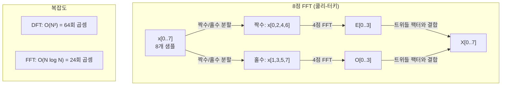
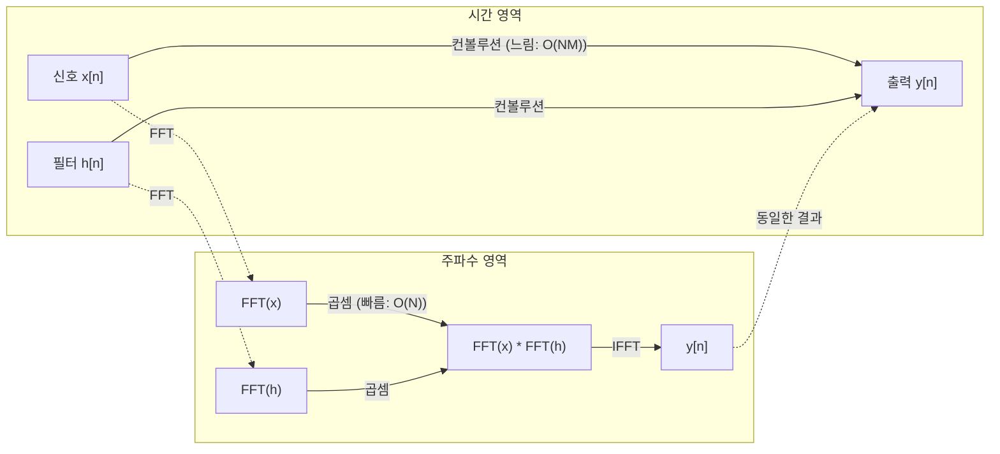

# 푸리에 변환

> 모든 신호는 사인파의 합이다. 푸리에 변환은 어떤 사인파들이 있는지 알려준다.

**유형:** Build  
**언어:** Python  
**선수 지식:** Phase 1, 레슨 01-04, 19 (복소수)  
**소요 시간:** ~90분

## 학습 목표

- DFT(이산 푸리에 변환)를 처음부터 구현하고 O(N log N) 쿨리-터키 FFT와 비교하여 검증
- 주파수 계수 해석: 신호에서 진폭(amplitude), 위상(phase), 파워 스펙트럼(power spectrum) 추출
- 컨볼루션 정리(convolution theorem) 적용: FFT 곱셈을 통한 컨볼루션 수행
- 푸리에 주파수 분해를 트랜스포머 위치 인코딩(positional encodings) 및 CNN 컨볼루션 레이어(convolution layers)와 연결

## 문제 정의

오디오 녹음은 시간에 따른 압력 측정값의 시퀀스입니다. 주식 가격은 일별 값의 시퀀스입니다. 이미지는 공간상의 픽셀 강도 그리드입니다. 이 모든 것은 시간 영역(또는 공간 영역)의 데이터입니다. 어떤 인덱스에 따라 값이 변화하는 것을 볼 수 있습니다.

하지만 많은 패턴은 시간 영역에서는 보이지 않습니다. 이 오디오 신호는 순수 음조인가 화음인가? 이 주식 가격에는 주간 주기가 있는가? 이 이미지에는 반복되는 질감이 있는가? 이러한 질문들은 주파수 내용과 관련된 것이며, 시간 영역에서는 이를 숨깁니다.

푸리에 변환(Fourier transform)은 데이터를 시간 영역에서 주파수 영역으로 변환합니다. 신호를 받아 다양한 주파수의 사인파로 분해합니다. 각 사인파는 진폭(강도)과 위상(시작점)을 가지며, 푸리에 변환은 이 두 가지를 모두 알려줍니다.

이것이 ML에 중요한 이유는 주파수 영역 사고가 모든 곳에 나타나기 때문입니다. 합성곱 신경망(Convolutional Neural Networks)은 주파수 영역에서 곱셈에 해당하는 합성곱을 수행합니다. 트랜스포머 위치 인코딩(Transformer positional encodings)은 위치 표현을 위해 주파수 분해를 사용합니다. 오디오 모델(음성 인식, 음악 생성)은 소리의 주파수 표현인 스펙트로그램(spectrogram)에서 작동합니다. 시계열 모델은 주기적 패턴을 찾습니다. 푸리에 변환을 이해하면 이 모든 것과 작업할 수 있는 어휘를 얻을 수 있습니다.

## 개념

### DFT 정의

N개의 샘플 x[0], x[1], ..., x[N-1]이 주어졌을 때, 이산 푸리에 변환(DFT)은 N개의 주파수 계수 X[0], X[1], ..., X[N-1]을 생성합니다:

```
X[k] = sum_{n=0}^{N-1} x[n] * e^(-2*pi*i*k*n/N)

for k = 0, 1, ..., N-1
```

각 X[k]는 복소수입니다. 크기 |X[k]|는 주파수 k의 진폭을 나타내고, 위상각 angle(X[k])는 해당 주파수의 위상 오프셋을 나타냅니다.

핵심 통찰: `e^(-2*pi*i*k*n/N)`은 주파수 k에서 회전하는 페이저(phasor)입니다. DFT는 신호와 N개의 등간격 주파수 간의 상관관계를 계산합니다. 신호에 주파수 k의 에너지가 포함되어 있으면 상관관계가 크고, 그렇지 않으면 0에 가깝습니다.

### 각 계수의 의미

**X[0]: DC 성분.** 모든 샘플의 합으로, 신호의 평균에 비례합니다. 신호의 상수(0Hz) 오프셋을 나타냅니다.

```
X[0] = sum_{n=0}^{N-1} x[n] * e^0 = 모든 샘플의 합
```

**1 <= k <= N/2인 X[k]: 양의 주파수.** X[k]는 N개 샘플당 k사이클의 주파수를 나타냅니다. k가 클수록 주파수가 높습니다(빠른 진동).

**X[N/2]: 나이퀴스트 주파수.** N개 샘플로 표현할 수 있는 가장 높은 주파수입니다. 이보다 높은 주파수는 에일리어싱(aliasing)이 발생합니다.

**N/2 < k < N인 X[k]: 음의 주파수.** 실수 신호의 경우 X[N-k] = conj(X[k])입니다. 음의 주파수는 양의 주파수의 거울 이미지입니다. 따라서 유용한 정보는 처음 N/2 + 1개의 계수에 포함됩니다.

### 역 DFT

역 DFT는 주파수 계수로부터 원래 신호를 복원합니다:

```
x[n] = (1/N) * sum_{k=0}^{N-1} X[k] * e^(2*pi*i*k*n/N)

for n = 0, 1, ..., N-1
```

순방향 DFT와의 차이점은 지수의 부호가 양수이며, 1/N 정규화 인자가 있다는 점입니다.

역 DFT는 완벽한 복원을 제공합니다. 정보가 손실되지 않습니다. 시간 영역에서 주파수 영역으로, 다시 시간 영역으로 변환해도 오류가 없습니다. DFT는 기저 변환(basis change)으로, 동일한 정보를 다른 좌표계에서 표현합니다.

### FFT: 고속화

위에서 정의한 DFT는 O(N²) 복잡도를 가집니다. N=100만일 때 10¹² 연산이 필요합니다.

고속 푸리에 변환(FFT)은 O(N log N) 복잡도로 동일한 결과를 계산합니다. N=100만일 때 약 2천만 연산이 필요합니다. 이로 인해 주파수 분석이 실용화되었습니다.

쿨리-터키 알고리즘(가장 일반적인 FFT)은 분할 정복(divide and conquer) 방식으로 동작합니다:

1. 신호를 짝수 인덱스와 홀수 인덱스로 분할합니다.
2. 각 절반에 대해 재귀적으로 DFT를 계산합니다.
3. "트위들 팩터" e^(-2*pi*i*k/N)를 사용하여 두 반쪽 DFT를 결합합니다.

```
X[k] = E[k] + e^(-2*pi*i*k/N) * O[k]          for k = 0, ..., N/2 - 1
X[k + N/2] = E[k] - e^(-2*pi*i*k/N) * O[k]    for k = 0, ..., N/2 - 1

where E = 짝수 인덱스 샘플의 DFT
      O = 홀수 인덱스 샘플의 DFT
```

대칭성으로 인해 각 재귀 레벨에서 O(N) 연산이 수행되고, log₂(N) 레벨이 존재합니다. 총 복잡도는 O(N log N)입니다.



FFT는 신호 길이가 2의 거듭제곱이어야 합니다. 실제로는 다음 2의 거듭제곱까지 0으로 패딩합니다.

### 스펙트럼 분석

**파워 스펙트럼**은 |X[k]|²로, 각 주파수 계수의 제곱 크기입니다. 각 주파수의 에너지를 보여줍니다.

**위상 스펙트럼**은 angle(X[k])로, 각 주파수의 위상 오프셋입니다. 대부분의 분석 작업에서는 파워 스펙트럼만 고려하고 위상은 무시합니다.

```
주파수 k의 파워:  P[k] = |X[k]|^2 = X[k].real^2 + X[k].imag^2
주파수 k의 위상:  phi[k] = atan2(X[k].imag, X[k].real)
```

### 주파수 해상도

DFT의 주파수 해상도는 샘플 수 N과 샘플링 레이트 fs에 따라 결정됩니다.

```
주파수 k의 주파수:      f_k = k * fs / N
주파수 해상도:    delta_f = fs / N
최대 주파수:       f_max = fs / 2  (나이퀴스트)
```

서로 가까운 두 주파수를 분해하려면 더 많은 샘플이 필요합니다. 고주파 성분을 포착하려면 더 높은 샘플링 레이트가 필요합니다.

### 컨볼루션 정리

이것은 신호 처리와 CNN에 직접적으로 관련된 가장 중요한 결과 중 하나입니다.

**시간 영역의 컨볼루션은 주파수 영역에서 점별 곱셈과 같습니다.**

```
x * h = IFFT(FFT(x) . FFT(h))

where *는 컨볼루션, .는 요소별 곱셈
```

중요성:

- 길이 N과 M의 두 신호를 직접 컨볼루션하면 O(N*M) 연산이 필요합니다.
- FFT 기반 컨볼루션은 O(N log N) 연산: 두 신호를 변환하고, 곱한 후 역변환합니다.
- 큰 커널의 경우 FFT 컨볼루션이 훨씬 빠릅니다.
- 이는 큰 수용 영역(receptive field)을 가진 컨볼루션 레이어에서 정확히 일어나는 과정입니다.

참고: DFT는 순환 컨볼루션(신호가 순환)을 계산합니다. 선형 컨볼루션(순환 없음)을 위해 두 신호를 N + M - 1 길이로 0 패딩한 후 계산합니다.



### 윈도우링

DFT는 신호가 주기적이라고 가정합니다. 즉, N개 샘플을 무한히 반복되는 신호의 한 주기로 취급합니다. 신호가 시작과 끝에서 같은 값을 가지지 않으면 경계에 불연속성이 생기고, 이는 고주파 성분으로 나타납니다. 이를 스펙트럼 누설(spectral leakage)이라고 합니다.

윈도우링은 DFT 계산 전에 신호 양 끝을 0으로 점진적으로 줄여 누설을 감소시킵니다.

일반적인 윈도우:

| 윈도우 | 형태 | 주엽 폭 | 측엽 레벨 | 사용 사례 |
|--------|-------|----------------|-----------------|----------|
| 직사각형 | 평탄 (윈도우 없음) | 가장 좁음 | 가장 높음 (-13 dB) | 신호가 정확히 N샘플 주기일 때 |
| 한(Hann) | 코사인 상승 | 보통 | 낮음 (-31 dB) | 일반적인 스펙트럼 분석 |
| 해밍(Hamming) | 수정된 코사인 | 보통 | 더 낮음 (-42 dB) | 오디오 처리, 음성 분석 |
| 블랙맨(Blackman) | 삼중 코사인 | 넓음 | 매우 낮음 (-58 dB) | 측엽 억제가 중요할 때 |

```
한 윈도우:    w[n] = 0.5 * (1 - cos(2*pi*n / (N-1)))
해밍 윈도우: w[n] = 0.54 - 0.46 * cos(2*pi*n / (N-1))
```

윈도우를 적용하려면 신호와 요소별(element-wise) 곱셈을 수행한 후 DFT를 계산합니다: `X = DFT(x * w)`.

### DFT 성질

| 성질 | 시간 영역 | 주파수 영역 |
|----------|-------------|-----------------|
| 선형성 | a*x + b*y | a*X + b*Y |
| 시간 이동 | x[n - k] | X[f] * e^(-2*pi*i*f*k/N) |
| 주파수 이동 | x[n] * e^(2*pi*i*f0*n/N) | X[f - f0] |
| 컨볼루션 | x * h | X * H (점별) |
| 곱셈 | x * h (점별) | X * H (순환 컨볼루션, 1/N 스케일링) |
| 파세발 정리 | sum \|x[n]\|^2 | (1/N) * sum \|X[k]\|^2 |
| 켤레 대칭성 (실수 입력) | x[n] 실수 | X[k] = conj(X[N-k]) |

파세발 정리는 두 영역에서 총 에너지가 동일함을 나타냅니다. 변환 과정에서 에너지는 보존됩니다.

### 위치 인코딩과의 연결

원래 트랜스포머는 사인/코사인 위치 인코딩을 사용합니다:

```
PE(pos, 2i)   = sin(pos / 10000^(2i/d_model))
PE(pos, 2i+1) = cos(pos / 10000^(2i/d_model))
```

각 차원 쌍(2i, 2i+1)은 서로 다른 주파수에서 진동합니다. 주파수는 고차원(0,1)에서 저차원(마지막 차원)까지 기하학적으로 배치됩니다. 이는 각 위치에 모든 주파수 대역에서 고유한 패턴을 제공합니다.

이 방식이 제공하는 주요 특성:

- **유일성:** 두 위치가 동일한 인코딩을 가지지 않습니다.
- **유계 값:** sin과 cos은 항상 [-1, 1] 범위입니다.
- **상대 위치:** 위치 p+k의 인코딩은 위치 p의 인코딩에 대한 선형 함수로 표현됩니다. 모델은 상대 위치에 주의를 기울일 수 있습니다.

### CNN과의 연결

컨볼루션 레이어는 입력에 학습된 필터(커널)를 슬라이딩하여 적용합니다. 수학적으로는 컨볼루션 연산입니다.

컨볼루션 정리에 따르면 이는 다음 과정과 동일합니다:
1. 입력에 FFT 적용
2. 커널에 FFT 적용
3. 주파수 영역에서 곱셈
4. 결과를 IFFT

표준 CNN 구현은 직접 컨볼루션(작은 3x3 커널에 더 빠름)을 사용합니다. 하지만 큰 커널이나 전역 컨볼루션의 경우 FFT 기반 접근법이 훨씬 빠릅니다. 일부 아키텍처(FNet 등)는 어텐션을 완전히 FFT로 대체하여 O(N²) 복잡도 대신 O(N log N) 복잡도로 경쟁력 있는 정확도를 달성합니다.

### 스펙트로그램과 단시간 푸리에 변환

단일 FFT는 전체 신호의 주파수 성분을 제공하지만, 해당 주파수가 언제 발생하는지는 알 수 없습니다. 주파수가 시간에 따라 증가하는 신호(치르프)와 모든 주파수가 동시에 존재하는 신호(화음)는 동일한 크기 스펙트럼을 가질 수 있습니다.

단시간 푸리에 변환(STFT)은 신호의 겹치는 창(window)에 대해 FFT를 계산하여 이 문제를 해결합니다. 결과는 스펙트로그램으로, 시간 축과 주파수 축을 가진 2D 표현입니다. 각 지점의 강도는 해당 시간에서의 주파수 에너지를 나타냅니다.

```
STFT 절차:
1. 창 크기 선택 (예: 1024 샘플)
2. 홉 크기 선택 (예: 256 샘플 -- 75% 겹침)
3. 각 창 위치에 대해:
   a. 창에 해당하는 세그먼트 추출
   b. 한/해밍 윈도우 적용
   c. FFT 계산
   d. 크기 스펙트럼을 스펙트로그램의 한 열로 저장
```

스펙트로그램은 오디오 ML 모델의 표준 입력 표현입니다. 음성 인식 모델(Whisper, DeepSpeech)은 멜-스펙트로그램을 사용합니다. 이는 주파수를 멜 스케일로 매핑하여 인간의 음높이 인지와 더 잘 일치시킵니다.

### 에일리어싱

신호가 fs/2(나이퀴스트 주파수) 이상의 주파수를 포함하면, 샘플링 레이트 fs에서 에일리어싱이 발생합니다. 100Hz로 샘플링된 90Hz 신호는 10Hz 신호와 동일하게 보입니다. 샘플만으로는 원래 90Hz를 복구할 수 없습니다.

```
예시:
  실제 신호: 90Hz 사인파
  샘플링 레이트: 100Hz
  관측 주파수: 100 - 90 = 10Hz

  100Hz 샘플링 레이트에서 90Hz 신호의 샘플은
  10Hz 신호의 샘플과 동일합니다.
  어떤 수학으로도 원래 90Hz를 복구할 수 없습니다.
```

이것이 아날로그-디지털 변환기에 나이퀴스트 이상의 주파수를 제거하는 안티-에일리어싱 필터가 포함되는 이유입니다. ML에서는 특징 맵을 다운샘플링할 때 적절한 저역 통과 필터링 없이 에일리어싱이 발생합니다. 일부 아키텍처는 안티-에일리어싱 풀링 레이어로 이 문제를 해결합니다.

### 제로 패딩은 해상도를 높이지 않습니다

일반적인 오해: FFT 전에 신호를 제로 패딩하면 주파수 해상도가 향상됩니다. 그렇지 않습니다. 제로 패딩은 기존 주파수 빈 사이를 보간하여 더 부드러운 스펙트럼을 제공합니다. 하지만 원래 샘플에 없던 주파수 세부 정보를 드러낼 수는 없습니다.

진정한 주파수 해상도는 관측 시간 T = N / fs에만 의존합니다. delta_f만큼 떨어진 두 주파수를 분해하려면 최소 T = 1 / delta_f 초의 데이터가 필요합니다. 제로 패딩은 이 기본 한계를 변경하지 않습니다.

## 구축 방법

### 1단계: 처음부터 시작하는 DFT

O(N^2) DFT는 정의에서 직접 유도됩니다.

```python
import math

class Complex:
    ...

def dft(x):
    N = len(x)
    result = []
    for k in range(N):
        total = Complex(0, 0)
        for n in range(N):
            angle = -2 * math.pi * k * n / N
            w = Complex(math.cos(angle), math.sin(angle))
            xn = x[n] if isinstance(x[n], Complex) else Complex(x[n])
            total = total + xn * w
        result.append(total)
    return result
```

### 2단계: 역 DFT

동일한 구조, 양의 지수, N으로 나누기.

```python
def idft(X):
    N = len(X)
    result = []
    for n in range(N):
        total = Complex(0, 0)
        for k in range(N):
            angle = 2 * math.pi * k * n / N
            w = Complex(math.cos(angle), math.sin(angle))
            total = total + X[k] * w
        result.append(Complex(total.real / N, total.imag / N))
    return result
```

### 3단계: FFT (Cooley-Tukey)

재귀적 FFT는 2의 거듭제곱 길이를 요구합니다. 짝수와 홀수로 분할, 재귀, 트위들 계수로 결합.

```python
def fft(x):
    N = len(x)
    if N <= 1:
        return [x[0] if isinstance(x[0], Complex) else Complex(x[0])]
    if N % 2 != 0:
        return dft(x)

    even = fft([x[i] for i in range(0, N, 2)])
    odd = fft([x[i] for i in range(1, N, 2)])

    result = [Complex(0)] * N
    for k in range(N // 2):
        angle = -2 * math.pi * k / N
        twiddle = Complex(math.cos(angle), math.sin(angle))
        t = twiddle * odd[k]
        result[k] = even[k] + t
        result[k + N // 2] = even[k] - t
    return result
```

### 4단계: 스펙트럼 분석 도우미

```python
def power_spectrum(X):
    return [xk.real ** 2 + xk.imag ** 2 for xk in X]

def convolve_fft(x, h):
    N = len(x) + len(h) - 1
    padded_N = 1
    while padded_N < N:
        padded_N *= 2

    x_padded = x + [0.0] * (padded_N - len(x))
    h_padded = h + [0.0] * (padded_N - len(h))

    X = fft(x_padded)
    H = fft(h_padded)

    Y = [xk * hk for xk, hk in zip(X, H)]

    y = idft(Y)
    return [y[n].real for n in range(N)]
```

## 사용 방법

실제 작업에는 고도로 최적화된 C 라이브러리를 기반으로 하는 numpy의 FFT를 사용하세요.

```python
import numpy as np

signal = np.sin(2 * np.pi * 5 * np.arange(256) / 256)
spectrum = np.fft.fft(signal)
freqs = np.fft.fftfreq(256, d=1/256)

power = np.abs(spectrum) ** 2

positive_freqs = freqs[:len(freqs)//2]
positive_power = power[:len(power)//2]
```

윈도우 적용 및 고급 스펙트럼 분석을 위해:

```python
from scipy.signal import windows, stft

window = windows.hann(256)
windowed = signal * window
spectrum = np.fft.fft(windowed)
```

컨볼루션(convolution)을 위해:

```python
from scipy.signal import fftconvolve

result = fftconvolve(signal, kernel, mode='full')
```

스펙트로그램(spectrogram)을 위해:

```python
from scipy.signal import stft

frequencies, times, Zxx = stft(signal, fs=sample_rate, nperseg=256)
spectrogram = np.abs(Zxx) ** 2
```

스펙트로그램 행렬은 (n_frequencies, n_time_frames) 형태를 가집니다. 각 열은 하나의 시간 윈도우에서의 파워 스펙트럼(power spectrum)입니다. 이것이 오디오 ML 모델이 입력으로 소비하는 데이터입니다.

## Ship It

`code/fourier.py`를 실행하여 `outputs/prompt-spectral-analyzer.md`를 생성하세요.

## 연습 문제

1. **순수 톤 식별.** 알 수 없는 주파수(1~50Hz 사이)의 단일 사인파로 구성된 신호를 생성하세요. 128Hz로 샘플링하여 1초 동안 기록합니다. DFT를 사용하여 주파수를 식별하고 정답이 일치하는지 확인하세요. 이제 표준편차 0.5의 가우시안 노이즈를 추가한 후 반복하세요. 노이즈가 스펙트럼에 어떤 영향을 미치나요?

2. **FFT vs DFT 검증.** 길이가 64인 무작위 신호를 생성하세요. DFT(O(N^2))와 FFT를 모두 계산하고 모든 계수가 1e-10 이내로 일치하는지 확인하세요. 길이가 256, 512, 1024, 2048인 신호에서 두 함수의 실행 시간을 측정하고 DFT 시간 대 FFT 시간 비율을 그래프로 그리세요.

3. **컨볼루션 정리 예시 증명.** 신호 x = [1, 2, 3, 4, 0, 0, 0, 0]와 필터 h = [1, 1, 1, 0, 0, 0, 0, 0]를 생성하세요. 중첩 루프를 사용하여 직접 원형 컨볼루션을 계산하세요. 그런 다음 FFT(변환, 곱셈, 역변환)를 통해 계산하고 결과가 일치하는지 확인하세요. 이제 적절한 제로 패딩을 적용하여 선형 컨볼루션을 수행하세요.

4. **윈도우 효과.** 10Hz와 12Hz(매우 가까운 주파수)의 두 사인파 합으로 구성된 신호를 생성하세요. 128Hz로 샘플링하여 1초 동안 기록합니다. 윈도우 없음, Hann 윈도우, Hamming 윈도우로 전력 스펙트럼을 계산하세요. 어떤 윈도우가 두 피크를 가장 쉽게 구분할 수 있게 하나요? 그 이유는 무엇인가요?

5. **위치 인코딩 분석.** d_model = 128 및 max_pos = 512에 대한 사인파 위치 인코딩을 생성하세요. 각 위치 쌍(p1, p2)에 대해 인코딩의 내적을 계산하세요. 내적이 절대 위치가 아닌 |p1 - p2|에만 의존함을 보여주세요. 거리가 증가함에 따라 내적은 어떻게 변하나요?

## 주요 용어

| 용어 | 의미 |
|------|------|
| DFT (이산 푸리에 변환) | N개의 시간 영역 샘플을 N개의 주파수 영역 계수로 변환. 각 계수는 해당 주파수의 복소 정현파와의 상관관계 |
| FFT (고속 푸리에 변환) | DFT를 계산하는 O(N log N) 알고리즘. Cooley-Tukey 알고리즘은 짝수/홀수 인덱스를 재귀적으로 분할 |
| 역 DFT | 주파수 계수로부터 시간 영역 신호를 재구성. DFT와 동일한 공식이지만 지수 부호 반전 및 1/N 스케일링 적용 |
| 주파수 빈 | DFT 출력의 각 인덱스 k는 k*fs/N Hz의 주파수를 나타냄. "빈"은 이산 주파수 슬롯 |
| DC 성분 | X[0], 제로 주파수 계수. 신호 평균값에 비례 |
| 나이퀴스트 주파수 | fs/2, 샘플링 레이트 fs에서 표현 가능한 최대 주파수. 이 이상의 주파수는 에일리어싱 발생 |
| 파워 스펙트럼 | \|X[k]\|^2, 각 주파수 계수의 제곱 크기. 주파수별 에너지 분포 표시 |
| 위상 스펙트럼 | angle(X[k]), 각 주파수 성분의 위상 오프셋. 분석에서 종종 무시됨 |
| 스펙트럼 누설 | 비주기 신호를 주기 신호로 취급할 때 발생하는 가짜 주파수 성분. 윈도우 적용으로 감소 |
| 윈도우 함수 | DFT 전에 적용되는 테이퍼링 함수(Hann, Hamming, Blackman)로 스펙트럼 누설 감소 |
| 트위들 팩터 | FFT 나비 연산에서 부분 DFT를 결합하는 데 사용되는 복소 지수 e^(-2*pi*i*k/N) |
| 컨볼루션 정리 | 시간 영역의 컨볼루션은 주파수 영역에서 점별 곱셈과 동일. 신호 처리 및 CNN의 기초 |
| 순환 컨볼루션 | 신호가 래핑되는 컨볼루션. DFT가 자연스럽게 계산하는 방식 |
| 선형 컨볼루션 | 래핑 없이 표준 컨볼루션 수행. DFT 전 제로 패딩으로 달성 |
| 파르세발 정리 | 푸리에 변환을 통해 총 에너지가 보존됨. sum \|x[n]\|^2 = (1/N) sum \|X[k]\|^2 |
| 에일리어싱 | 나이퀴스트 이상의 주파수가 샘플링 레이트 부족으로 저주파로 나타나는 현상 |

## 추가 자료

- [Cooley & Tukey: An Algorithm for the Machine Calculation of Complex Fourier Series (1965)](https://www.ams.org/journals/mcom/1965-19-090/S0025-5718-1965-0178586-1/) - 컴퓨팅을 변화시킨 최초의 FFT 논문
- [3Blue1Brown: But what is the Fourier Transform?](https://www.youtube.com/watch?v=spUNpyF58BY) - 푸리에 변환에 대한 최고의 시각적 설명
- [Lee-Thorp et al.: FNet: Mixing Tokens with Fourier Transforms (2021)](https://arxiv.org/abs/2105.03824) - 트랜스포머에서 자기 어텐션(self-attention)을 FFT로 대체
- [Smith: The Scientist and Engineer's Guide to Digital Signal Processing](http://www.dspguide.com/) - FFT, 윈도우링, 스펙트럼 분석을 심층적으로 다루는 무료 온라인 교재
- [Vaswani et al.: Attention Is All You Need (2017)](https://arxiv.org/abs/1706.03762) - 푸리에 주파수 분해에서 유도된 사인/코사인 위치 인코딩
- [Radford et al.: Whisper (2022)](https://arxiv.org/abs/2212.04356) - 입력 표현으로 멜-스펙트로그램을 사용하는 음성 인식 모델