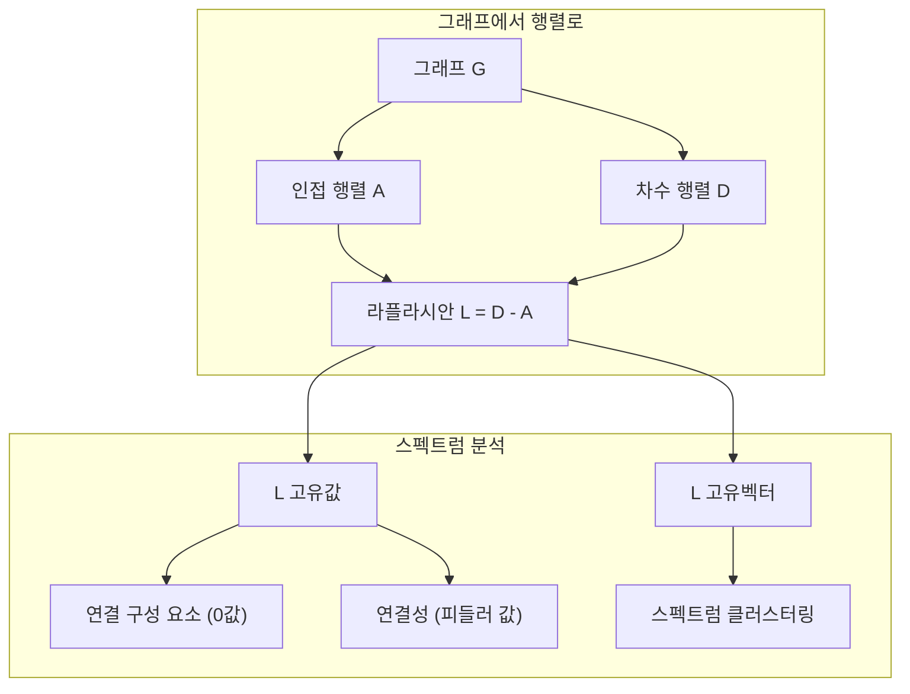
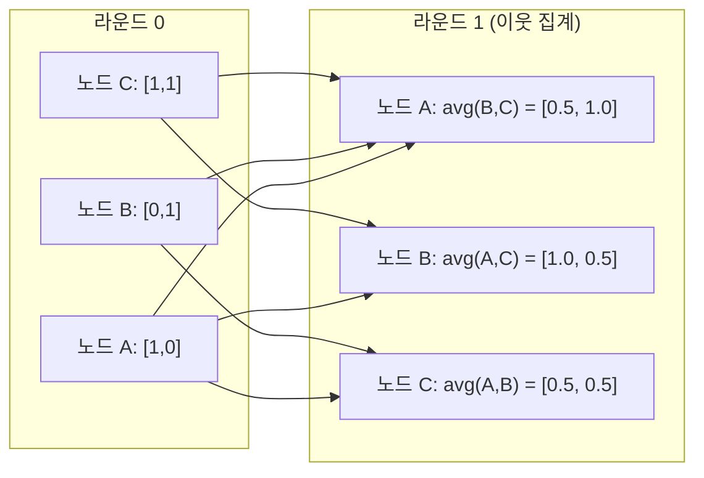

# 머신러닝을 위한 그래프 이론

> 그래프는 관계의 데이터 구조입니다. 데이터에 연결이 있다면 그래프 이론이 필요합니다.

**유형:** 구축(Build)
**언어:** Python
**선수 지식:** 1단계, 레슨 01-03 (선형 대수, 행렬)
**소요 시간:** ~90분

## 학습 목표

- 인접 행렬/리스트 표현을 사용하는 그래프 클래스를 구축하고 BFS(너비 우선 탐색) 및 DFS(깊이 우선 탐색) 탐색을 구현
- 그래프 라플라시안(Laplacian)을 계산하고 고유값(eigenvalues)을 사용하여 연결 성분(connected components)을 감지하고 노드 클러스터링
- 정규화된 인접 행렬 곱셈으로 GNN(그래프 신경망) 스타일의 메시지 전달(message passing) 한 라운드를 구현
- Fiedler 벡터를 사용하여 그래프를 분할하는 스펙트럴 클러스터링(spectral clustering) 적용

## 문제 정의

소셜 네트워크, 분자, 지식 베이스, 인용 네트워크, 도로 지도 — 이 모든 것은 그래프입니다. 전통적인 ML은 데이터를 평면 테이블로 처리합니다. 각 행은 독립적이며, 각 특징은 열입니다. 하지만 연결 구조가 중요한 경우 테이블은 실패합니다.

소셜 네트워크를 예로 들어보겠습니다. 어떤 사용자가 어떤 제품을 구매할지 예측하려고 합니다. 사용자의 구매 이력도 중요하지만, 친구들의 구매 이력이 더 중요할 수 있습니다. 연결 관계가 신호를 전달합니다.

또는 분자를 생각해 봅시다. 분자가 단백질에 결합하는지 예측하려고 합니다. 원자도 중요하지만, 실제로 중요한 것은 원자들이 서로 어떻게 결합되어 있는지입니다. 구조 자체가 데이터입니다.

그래프 신경망(GNN, Graph Neural Network)은 딥러닝에서 가장 빠르게 성장하는 분야입니다. 약물 발견, 소셜 추천, 사기 탐지, 지식 그래프 추론을 지원합니다. 모든 GNN은 동일한 기반인 기본 그래프 이론을 바탕으로 구축됩니다.

다음 네 가지가 필요합니다:
1. 그래프를 행렬로 표현하는 방법 (행렬 곱셈을 수행할 수 있도록)
2. 그래프 구조를 탐색하는 순회 알고리즘
3. 라플라시안(Laplacian) — 스펙트럼 그래프 이론에서 가장 중요한 행렬
4. 메시지 전달(message passing) — GNN을 작동시키는 연산

## 개념

### 그래프: 노드와 엣지

그래프 G = (V, E)는 정점(노드) V와 엣지 E로 구성됩니다. 각 엣지는 두 노드를 연결합니다.

**방향성 vs 무방향성.** 무방향 그래프에서 엣지 (u, v)는 u가 v에 연결되고 v도 u에 연결됨을 의미합니다. 방향 그래프(digraph)에서 엣지 (u, v)는 u가 v를 가리키지만 그 반대는 아닙니다.

**가중치 vs 비가중치.** 비가중치 그래프에서 엣지는 존재하거나 존재하지 않습니다. 가중치 그래프에서 각 엣지는 수치적 가중치(거리, 비용, 강도)를 가집니다.

| 그래프 유형 | 예시 |
|-----------|---------|
| 무방향, 비가중치 | 페이스북 친구 네트워크 |
| 방향, 비가중치 | 트위터 팔로우 네트워크 |
| 무방향, 가중치 | 도로 지도(거리) |
| 방향, 가중치 | 웹 페이지 링크(페이지랭크 점수) |

### 인접 행렬

인접 행렬 A는 핵심 표현 방식입니다. n개의 노드를 가진 그래프에 대해:

```
A[i][j] = 1    노드 i에서 노드 j로 엣지가 있는 경우
A[i][j] = 0    그 외
```

무방향 그래프에서 A는 대칭 행렬입니다: A[i][j] = A[j][i]. 가중치 그래프에서 A[i][j] = 엣지 (i, j)의 가중치입니다.

**예시 -- 삼각형:**

```
노드: 0, 1, 2
엣지: (0,1), (1,2), (0,2)

A = [[0, 1, 1],
     [1, 0, 1],
     [1, 1, 0]]
```

인접 행렬은 모든 GNN의 입력입니다. A에 대한 행렬 연산은 그래프에 대한 연산에 대응됩니다.

### 차수

노드의 차수는 연결된 엣지의 수입니다. 방향 그래프에서는 진입 차수(들어오는 엣지)와 진출 차수(나가는 엣지)가 있습니다.

차수 행렬 D는 대각 행렬입니다:

```
D[i][i] = 노드 i의 차수
D[i][j] = 0    i != j인 경우
```

삼각형 예시에서: D = diag(2, 2, 2) (모든 노드가 두 개의 다른 노드와 연결됨).

차수는 노드 중요도를 나타냅니다. 높은 차수 = 허브 노드. 네트워크의 차수 분포는 구조를 드러냅니다. 소셜 네트워크는 멱법칙(적은 허브, 많은 리프 노드)을 따릅니다. 랜덤 그래프는 포아송 분포 차수를 가집니다.

### BFS와 DFS

두 가지 기본 그래프 탐색 알고리즘입니다. 둘 다 필요합니다.

**너비 우선 탐색(BFS):** 모든 이웃을 먼저 탐색한 후 이웃의 이웃을 탐색합니다. 큐(FIFO)를 사용합니다.

```
노드 0에서 BFS:
  방문 0
  큐: [1, 2]        (0의 이웃)
  방문 1
  큐: [2, 3]        (1의 이웃 추가)
  방문 2
  큐: [3]           (2의 이웃은 이미 방문)
  방문 3
  큐: []            (완료)
```

BFS는 비가중치 그래프에서 최단 경로를 찾습니다. 시작 노드에서 어떤 노드까지의 거리는 해당 노드가 처음 발견된 BFS 레벨과 같습니다. 이것이 소셜 네트워크에서 홉 수 거리 계산에 BFS가 사용되는 이유입니다.

**깊이 우선 탐색(DFS):** 백트래킹하기 전에 가능한 한 깊이 탐색합니다. 스택(LIFO) 또는 재귀를 사용합니다.

```
노드 0에서 DFS:
  방문 0
  스택: [1, 2]        (0의 이웃)
  방문 2               (스택에서 팝)
  스택: [1, 3]         (2의 이웃 추가)
  방문 3               (스택에서 팝)
  스택: [1]
  방문 1               (스택에서 팝)
  스택: []             (완료)
```

DFS는 다음 용도로 유용합니다:
- 연결 요소 찾기 (방문하지 않은 노드에서 DFS 실행)
- 사이클 감지 (DFS 트리의 백 엣지)
- 위상 정렬 (DFS 종료 순서의 역순)

| 알고리즘 | 데이터 구조 | 찾는 것 | 사용 사례 |
|-----------|---------------|-------|----------|
| BFS | 큐 | 최단 경로 | 소셜 네트워크 거리, 지식 그래프 탐색 |
| DFS | 스택 | 구성 요소, 사이클 | 연결성, 위상 정렬 |

### 그래프 라플라시안

L = D - A. 스펙트럼 그래프 이론에서 가장 중요한 행렬입니다.

삼각형 예시:

```
D = [[2, 0, 0],    A = [[0, 1, 1],    L = [[2, -1, -1],
     [0, 2, 0],         [1, 0, 1],         [-1, 2, -1],
     [0, 0, 2]]         [1, 1, 0]]         [-1, -1,  2]]
```

라플라시안은 놀라운 특성을 가집니다:

1. **L은 양의 준정부호 행렬입니다.** 모든 고유값은 >= 0입니다.

2. **0 고유값의 개수는 연결 구성 요소 수와 같습니다.** 연결 그래프는 정확히 하나의 0 고유값을 가집니다. 3개의 분리된 구성 요소를 가진 그래프는 3개의 0 고유값을 가집니다.

3. **가장 작은 0이 아닌 고유값(피들러 값)은 연결성을 측정합니다.** 큰 피들러 값은 그래프가 잘 연결되었음을 의미합니다. 작은 피들러 값은 그래프에 병목 현상이 있음을 의미합니다.

4. **피들러 값의 고유벡터(피들러 벡터)는 최적의 분할을 드러냅니다.** 양의 값을 가진 노드는 한 그룹에, 음의 값을 가진 노드는 다른 그룹에 속합니다. 이것이 스펙트럼 클러스터링입니다.



### 스펙트럼 특성

인접 행렬과 라플라시안의 고유값은 탐색 없이도 구조적 특성을 드러냅니다.

**스펙트럼 클러스터링**은 다음과 같이 작동합니다:
1. 라플라시안 L 계산
2. L의 가장 작은 k개의 고유벡터 찾기 (연결 그래프의 경우 첫 번째 고유벡터는 모두 1이므로 제외)
3. 각 노드의 새로운 좌표로 고유벡터 사용
4. 해당 좌표에 k-평균 실행

왜 이것이 작동할까요? L의 고유벡터는 그래프 상에서 "가장 부드러운" 함수를 인코딩합니다. 잘 연결된 노드는 유사한 고유벡터 값을 얻습니다. 병목 현상으로 분리된 노드는 다른 값을 얻습니다. 고유벡터는 자연스럽게 클러스터를 분리합니다.

**랜덤 워크 연결.** 정규화된 라플라시안은 그래프 상의 랜덤 워크와 관련이 있습니다. 랜덤 워크의 정상 분포는 노드 차수에 비례합니다. 혼합 시간(워크가 수렴하는 속도)은 스펙트럼 갭에 따라 달라집니다.

### 메시지 전달

그래프 신경망(GNN)의 핵심 연산입니다. 각 노드는 이웃으로부터 메시지를 수집하고, 이를 집계한 후 자신의 상태를 업데이트합니다.

```
h_v^(k+1) = UPDATE(h_v^(k), AGGREGATE({h_u^(k) : u in neighbors(v)}))
```

가장 간단한 형태에서 AGGREGATE = 평균, UPDATE = 선형 변환 + 활성화 함수:

```
h_v^(k+1) = sigma(W * mean({h_u^(k) : u in neighbors(v)}))
```

이것은 행렬 곱셈의 다른 표현입니다. H가 모든 노드 특징 행렬이고 A가 인접 행렬일 때:

```
H^(k+1) = sigma(A_norm * H^(k) * W)
```

여기서 A_norm은 정규화된 인접 행렬(각 행의 합이 1)입니다.

한 번의 메시지 전달로 각 노드는 바로 이웃 정보를 "볼" 수 있습니다. 두 번의 전달로 이웃의 이웃을 볼 수 있습니다. K번의 전달은 각 노드에 K-홉 이웃 정보를 제공합니다.



### 개념과 ML 응용

| 개념 | ML 응용 |
|---------|---------------|
| 인접 행렬 | GNN 입력 표현 |
| 그래프 라플라시안 | 스펙트럼 클러스터링, 커뮤니티 탐지 |
| BFS/DFS | 지식 그래프 탐색, 경로 찾기 |
| 차수 분포 | 노드 중요도, 특징 공학 |
| 메시지 전달 | GNN 레이어(GCN, GAT, GraphSAGE) |
| L의 고유값 | 커뮤니티 탐지, 그래프 분할 |
| 스펙트럼 클러스터링 | 비지도 노드 그룹화 |
| 페이지랭크 | 노드 중요도, 웹 검색 |

## 직접 구현하기

### 1단계: 처음부터 시작하는 그래프 클래스

```python
class Graph:
    def __init__(self, n_nodes, directed=False):
        self.n = n_nodes
        self.directed = directed
        self.adj = {i: {} for i in range(n_nodes)}

    def add_edge(self, u, v, weight=1.0):
        self.adj[u][v] = weight
        if not self.directed:
            self.adj[v][u] = weight

    def neighbors(self, node):
        return list(self.adj[node].keys())

    def degree(self, node):
        return len(self.adj[node])

    def adjacency_matrix(self):
        import numpy as np
        A = np.zeros((self.n, self.n))
        for u in range(self.n):
            for v, w in self.adj[u].items():
                A[u][v] = w
        return A

    def degree_matrix(self):
        import numpy as np
        D = np.zeros((self.n, self.n))
        for i in range(self.n):
            D[i][i] = self.degree(i)
        return D

    def laplacian(self):
        return self.degree_matrix() - self.adjacency_matrix()
```

인접 리스트(`self.adj`)는 이웃을 효율적으로 저장합니다. 인접 행렬 변환은 모든 스펙트럼 연산이 NumPy를 필요로 하기 때문에 NumPy를 사용합니다.

### 2단계: BFS와 DFS

```python
from collections import deque

def bfs(graph, start):
    visited = set()
    order = []
    distances = {}
    queue = deque([(start, 0)])
    visited.add(start)
    while queue:
        node, dist = queue.popleft()
        order.append(node)
        distances[node] = dist
        for neighbor in graph.neighbors(node):
            if neighbor not in visited:
                visited.add(neighbor)
                queue.append((neighbor, dist + 1))
    return order, distances


def dfs(graph, start):
    visited = set()
    order = []
    stack = [start]
    while stack:
        node = stack.pop()
        if node in visited:
            continue
        visited.add(node)
        order.append(node)
        for neighbor in reversed(graph.neighbors(node)):
            if neighbor not in visited:
                stack.append(neighbor)
    return order
```

BFS는 O(1) `popleft`를 위해 deque(양방향 큐)를 사용합니다. DFS는 스택으로 리스트를 사용합니다. 둘 다 모든 노드를 정확히 한 번 방문하므로 시간 복잡도는 O(V + E)입니다.

### 3단계: 연결 성분과 라플라시안 고유값

```python
def connected_components(graph):
    visited = set()
    components = []
    for node in range(graph.n):
        if node not in visited:
            order, _ = bfs(graph, node)
            visited.update(order)
            components.append(order)
    return components


def laplacian_eigenvalues(graph):
    import numpy as np
    L = graph.laplacian()
    eigenvalues = np.linalg.eigvalsh(L)
    return eigenvalues
```

`eigvalsh`는 대칭 행렬용입니다. 라플라시안은 무방향 그래프에서 항상 대칭입니다. 고유값을 오름차순으로 반환하며, 0의 개수를 세면 연결 성분의 수를 알 수 있습니다.

### 4단계: 스펙트럴 클러스터링

```python
def spectral_clustering(graph, k=2):
    import numpy as np
    L = graph.laplacian()
    eigenvalues, eigenvectors = np.linalg.eigh(L)
    features = eigenvectors[:, 1:k+1]

    labels = np.zeros(graph.n, dtype=int)
    for i in range(graph.n):
        if features[i, 0] >= 0:
            labels[i] = 0
        else:
            labels[i] = 1
    return labels
```

k=2일 때, Fiedler 벡터의 부호로 그래프를 두 클러스터로 나눕니다. k>2일 때는 첫 k개의 고유벡터(자명한 상수 고유벡터 제외)에 k-평균을 적용합니다.

### 5단계: 메시지 전달

```python
def message_passing(graph, features, weight_matrix):
    import numpy as np
    A = graph.adjacency_matrix()
    row_sums = A.sum(axis=1, keepdims=True)
    row_sums[row_sums == 0] = 1
    A_norm = A / row_sums
    aggregated = A_norm @ features
    output = aggregated @ weight_matrix
    return output
```

이것은 GNN 메시지 전달의 한 라운드입니다. 각 노드의 새로운 특성은 가중치 행렬로 변환된 이웃 노드 특성의 가중 평균입니다. 여러 라운드를 쌓아 정보를 더 멀리 전파할 수 있습니다.

## 사용 방법

networkx와 numpy를 사용하면 동일한 작업을 한 줄로 처리할 수 있습니다:

```python
import networkx as nx
import numpy as np

G = nx.karate_club_graph()

A = nx.adjacency_matrix(G).toarray()
L = nx.laplacian_matrix(G).toarray()

eigenvalues = np.linalg.eigvalsh(L.astype(float))
print(f"가장 작은 고유값: {eigenvalues[:5]}")
print(f"연결된 컴포넌트 수: {nx.number_connected_components(G)}")

communities = nx.community.greedy_modularity_communities(G)
print(f"발견된 커뮤니티 수: {len(communities)}")

pr = nx.pagerank(G)
top_nodes = sorted(pr.items(), key=lambda x: x[1], reverse=True)[:5]
print(f"상위 5개 PageRank 노드: {top_nodes}")
```

networkx는 최적화된 C 백엔드로 모든 크기의 그래프를 처리합니다. 프로덕션 환경에서 사용하세요. 처음부터 구현한 코드는 networkx가 수행하는 작업을 이해하는 데 사용하세요.

### numpy 스펙트럼 분석

```python
import numpy as np

A = np.array([
    [0, 1, 1, 0, 0],
    [1, 0, 1, 0, 0],
    [1, 1, 0, 1, 0],
    [0, 0, 1, 0, 1],
    [0, 0, 0, 1, 0]
])

D = np.diag(A.sum(axis=1))
L = D - A

eigenvalues, eigenvectors = np.linalg.eigh(L)
print(f"고유값: {np.round(eigenvalues, 4)}")
print(f"Fiedler 값: {eigenvalues[1]:.4f}")
print(f"Fiedler 벡터: {np.round(eigenvectors[:, 1], 4)}")

fiedler = eigenvectors[:, 1]
group_a = np.where(fiedler >= 0)[0]
group_b = np.where(fiedler < 0)[0]
print(f"클러스터 A: {group_a}")
print(f"클러스터 B: {group_b}")
```

Fiedler 벡터가 핵심 작업을 수행합니다. 한 클러스터에서는 양의 값, 다른 클러스터에서는 음의 값을 가집니다. 반복적인 최적화가 필요 없이 고유값 분해 한 번으로 충분합니다.

## Ship It

이 레슨은 다음을 생성합니다:
- `outputs/skill-graph-analysis.md` -- 그래프 구조 데이터 분석을 위한 기술 참조 문서

## 연결 관계

| 개념 | 등장 위치 |
|---------|------------------|
| 인접 행렬(adjacency matrix) | GCN, GAT, GraphSAGE 입력 |
| 라플라시안(Laplacian) | 스펙트럴 클러스터링(spectral clustering), ChebNet 필터 |
| BFS(Breadth-First Search) | 지식 그래프 탐색, 최단 경로 쿼리 |
| 메시지 전달(message passing) | 모든 GNN 레이어, 신경망 메시지 전달 |
| 스펙트럴 갭(spectral gap) | 그래프 연결성, 랜덤 워크의 혼합 시간 |
| 차수 분포(degree distribution) | 멱법칙 네트워크(power-law networks), 노드 특성 공학 |
| 연결 성분(connected components) | 전처리, 비연결 그래프 처리 |
| 페이지랭크(PageRank) | 노드 중요도 순위, 어텐션 초기화 |

GNN(Graph Neural Networks)은 특별히 언급할 필요가 있습니다. GCN(Kipf & Welling, 2017)의 그래프 컨볼루션 연산은 자기 루프(self-loop)가 추가된 인접 행렬 A_hat = A + I를 사용합니다:

```text
H^(l+1) = sigma(D_hat^(-1/2) * A_hat * D_hat^(-1/2) * H^(l) * W^(l))
```

여기서 A_hat = A + I(자기 루프 추가 인접 행렬)이고, D_hat는 A_hat의 차수 행렬(degree matrix)입니다. 자기 루프는 각 노드가 집계(aggregation) 과정에서 자신의 특성을 포함하도록 보장합니다. 이는 대칭 정규화(symmetric normalization)가 적용된 메시지 전달(message passing)과 정확히 일치합니다. D_hat^(-1/2) * A_hat * D_hat^(-1/2)는 정규화된 인접 행렬입니다. 라플라시안(Laplacian)은 이 정규화가 L_sym = I - D^(-1/2) * A * D^(-1/2)와 관련이 있기 때문에 등장합니다. 라플라시안을 이해하는 것은 GCN이 작동하는 원리를 이해하는 것과 같습니다.

## 연습 문제

1. **PageRank를 처음부터 구현하세요.** 균일한 점수로 시작합니다. 각 단계에서: score(v) = (1-d)/n + d * sum(score(u)/out_degree(u)) (v를 가리키는 모든 u에 대해). d=0.85를 사용합니다. 수렴할 때까지 실행(변화량 < 1e-6). 작은 웹 그래프에서 테스트합니다.

2. **스펙트럴 클러스터링을 사용하여 커뮤니티 찾기.** 두 개의 명확하게 분리된 클러스터(예: 단일 간선으로 연결된 두 클리크)가 있는 그래프를 생성합니다. 스펙트럴 클러스터링을 실행하고 올바른 분할을 찾는지 확인합니다. 클러스터 간 간선을 추가할 때 어떤 현상이 발생하나요?

3. **가중치 그래프에서 최단 경로를 위한 다익스트라 알고리즘 구현.** 동일한 그래프에서 균일 가중치를 사용하는 BFS와 결과를 비교합니다.

4. **2계층 메시지 전달 네트워크 구축.** 서로 다른 가중치 행렬로 메시지 전달을 두 번 적용합니다. 2라운드 후 각 노드가 2-hop 이웃의 정보를 가지고 있음을 보여줍니다.

5. **실제 그래프 분석.** Karate Club 그래프(34개 노드, 78개 간선)를 사용합니다. 차수 분포, 라플라시안 고유값, 스펙트럴 클러스터링을 계산합니다. 스펙트럴 클러스터링 결과를 알려진 실제 분할(ground truth)과 비교합니다.

## 주요 용어

| 용어 | 사람들이 말하는 표현 | 실제 의미 |
|------|----------------|----------------------|
| 그래프(Graph) | "노드와 엣지" | 쌍별 관계를 인코딩하는 수학적 구조 G=(V,E) |
| 인접 행렬(Adjacency matrix) | "연결 테이블" | 노드 i와 j가 연결된 경우 A[i][j] = 1인 n x n 행렬 |
| 차수(Degree) | "노드의 연결 정도" | 노드에 닿은 엣지의 수 |
| 라플라시안(Laplacian) | "D 빼기 A" | L = D - A, 고유값이 그래프 구조를 드러내는 행렬 |
| 피들러 값(Fiedler value) | "대수적 연결성" | 그래프의 연결 정도를 측정하는 L의 0이 아닌 가장 작은 고유값 |
| BFS(Breadth-First Search) | "레벨별 탐색" | 더 깊이 가기 전에 모든 이웃을 방문하는 탐색 방식, 최단 경로 발견 |
| DFS(Depth-First Search) | "깊이 우선 탐색" | 한 경로를 끝까지 탐색한 후 되돌아가는 탐색 방식 |
| 메시지 전달(Message passing) | "노드들이 이웃과 대화" | 각 노드가 이웃으로부터 정보를 집계하는 과정, GNN의 핵심 |
| 스펙트럴 클러스터링(Spectral clustering) | "고유벡터로 클러스터링" | 그래프의 라플라시안 고유벡터를 사용해 분할하는 방법 |
| 연결 성분(Connected component) | "분리된 조각" | 모든 노드가 서로 도달 가능한 최대 부분 그래프 |

## 추가 자료

- **Kipf & Welling (2017)** -- "그래프 합성곱 네트워크를 이용한 준지도 분류(Semi-Supervised Classification with Graph Convolutional Networks)." 현대 GNN의 기반을 제시한 논문. 스펙트럼 그래프 합성곱이 메시지 전달로 단순화됨을 보여줌.
- **Spielman (2012)** -- "스펙트럼 그래프 이론(Spectral Graph Theory)" 강의 노트. 라플라시안(Laplacian), 스펙트럼 갭(spectral gap), 그래프 분할에 대한 권위 있는 입문서.
- **Hamilton (2020)** -- "그래프 표현 학습(Graph Representation Learning)." GNN의 기초부터 응용까지 다루는 교재.
- **Bronstein et al. (2021)** -- "기하학적 딥러닝: 그리드, 군, 그래프, 측지선, 게이지(Geometric Deep Learning: Grids, Groups, Graphs, Geodesics, and Gauges)." 통합 프레임워크 논문.
- **Veličković et al. (2018)** -- "그래프 어텐션 네트워크(Graph Attention Networks)." 어텐션 메커니즘을 메시지 전달에 확장.