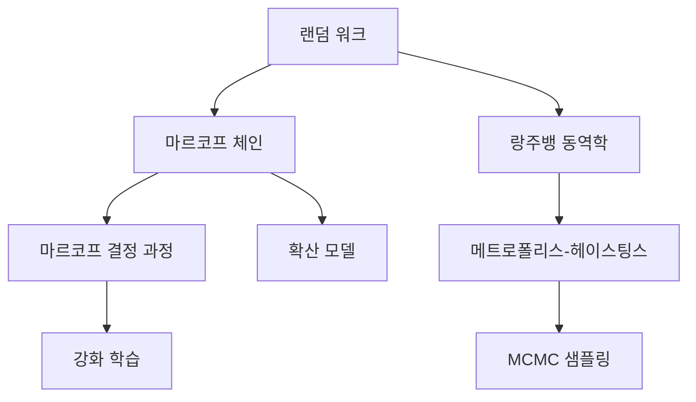
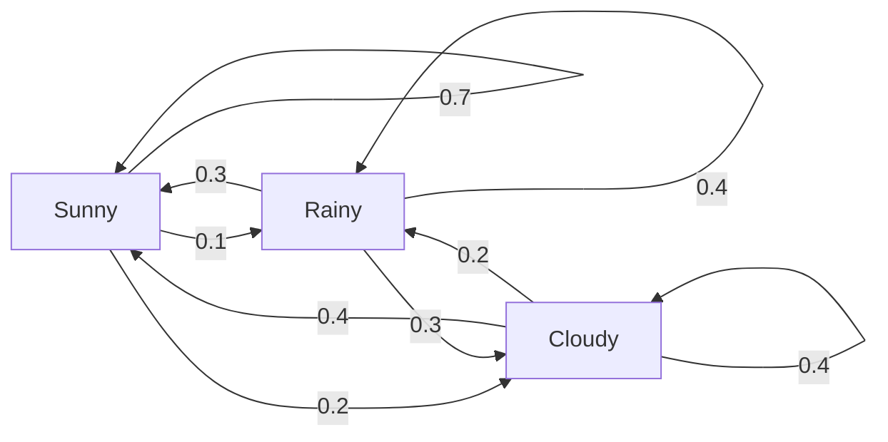
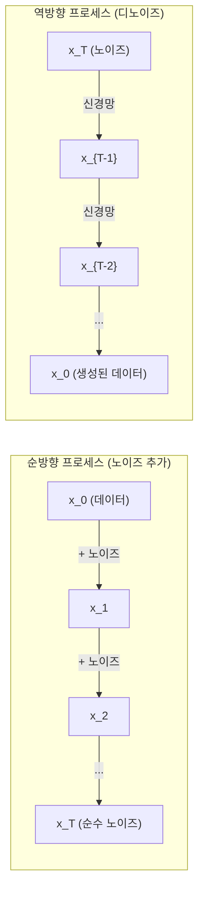

# 확률 과정(Stochastic Processes)

> 구조가 있는 무작위성. 랜덤 워크, 마르코프 체인(Markov chain), 확산 모델(diffusion model) 이면의 수학.

**유형:** 학습
**언어:** Python
**선수 지식:** 1단계, 레슨 06-07 (확률, 베이즈)
**소요 시간:** ~75분

## 학습 목표

- 1D 및 2D 랜덤 워크 시뮬레이션 및 변위의 sqrt(n) 스케일링 검증
- 마르코프 체인 시뮬레이터 구축 및 고유값 분해를 통한 정상 분포 계산
- 목표 분포 샘플링을 위한 메트로폴리스-헤이스팅스 MCMC 및 랑주뱅 동역학 구현
- 순방향 확산 과정을 브라운 운동과 연결하고 역과정이 데이터를 생성하는 방식 설명

## 문제 정의

많은 AI 시스템은 시간에 따라 진화하는 무작위성을 포함합니다. 정적 무작위성이 아닌, 각 단계가 이전 단계에 의존하는 구조화되고 순차적인 무작위성입니다.

언어 모델은 토큰을 하나씩 생성합니다. 각 토큰은 이전 컨텍스트에 의존합니다. 모델은 확률 분포를 출력하고, 이를 샘플링한 후 다음 단계로 이동합니다. 이는 확률적 과정입니다.

확산 모델은 이미지에 단계적으로 노이즈를 추가해 순수 정적 상태가 될 때까지 진행합니다. 그런 다음 이 과정을 역으로 수행해 단계적으로 노이즈를 제거하며 새로운 이미지를 생성합니다. 순방향 과정은 마르코프 체인(Markov chain)입니다. 역방향 과정은 학습된 마르코프 체인이 역방향으로 실행되는 것입니다.

강화 학습 에이전트는 환경에서 행동을 취합니다. 각 행동은 일정 확률로 새로운 상태를 유발합니다. 에이전트는 무작위 세계에서 무작위 정책을 따릅니다. 전체 과정은 마르코프 결정 과정(Markov decision process)입니다.

MCMC 샘플링(Markov Chain Monte Carlo) -- 베이지안 추론의 핵심 -- 은 정적 분포가 샘플링하려는 사후 분포와 같은 마르코프 체인을 구성합니다.

이 모든 것은 다음 4가지 기초 아이디어를 기반으로 합니다:
1. 랜덤 워크(Random walk) -- 가장 단순한 확률적 과정
2. 마르코프 체인(Markov chain) -- 전이 행렬(transition matrix)을 가진 구조화된 무작위성
3. 랑주뱅 동역학(Langevin dynamics) -- 노이즈가 포함된 경사 하강법
4. 메트로폴리스-헤이스팅스(Metropolis-Hastings) -- 임의의 분포에서 샘플링



## 개념

### 랜덤 워크

위치 0에서 시작합니다. 각 단계에서 공정한 동전을 던집니다. 앞면: 오른쪽(+1)으로 이동. 뒷면: 왼쪽(-1)으로 이동.

n단계 후 위치는 n개의 랜덤한 +/-1 값들의 합입니다. 기대 위치는 0입니다(워크는 편향되지 않음). 하지만 원점으로부터의 기대 거리는 sqrt(n)에 비례하여 증가합니다.

이는 직관에 반합니다. 워크는 공정하지만 -- 어느 방향으로도 드리프트가 없습니다. 하지만 시간이 지남에 따라 시작점에서 점점 더 멀어집니다. n단계 후 표준 편차는 sqrt(n)입니다.

```
Step 0:  Position = 0
Step 1:  Position = +1 or -1
Step 2:  Position = +2, 0, or -2
...
Step 100: Expected distance from origin ~ 10 (sqrt(100))
Step 10000: Expected distance from origin ~ 100 (sqrt(10000))
```

**2D**에서 워크는 위, 아래, 왼쪽, 오른쪽으로 동일한 확률로 이동합니다. 원점으로부터의 거리에도 동일한 sqrt(n) 스케일링이 적용됩니다. 경로는 프랙탈과 유사한 패턴을 그립니다.

**왜 sqrt(n)인가?** 각 단계는 +1 또는 -1로 동일한 확률입니다. n단계 후 위치 S_n = X_1 + X_2 + ... + X_n이며, 각 X_i는 +/-1입니다. 각 단계의 분산은 1이고, 단계들은 독립적이므로 Var(S_n) = n입니다. 표준 편차는 sqrt(n)입니다. 중심 극한 정리에 따라 S_n / sqrt(n)은 표준 정규 분포로 수렴합니다.

이 sqrt(n) 스케일링은 ML 전반에 나타납니다. SGD 노이즈는 1/sqrt(batch_size)로 스케일링됩니다. 임베딩 차원은 sqrt(d)로 스케일링됩니다. 제곱근은 독립적인 랜덤 추가의 서명입니다.

**브라운 운동과의 연결.** 단계 크기가 1/sqrt(n)이고 단위 시간당 n단계인 랜덤 워크를 고려합니다. n이 무한대로 갈 때, 워크는 브라운 운동 B(t)로 수렴합니다 -- 연속 시간 프로세스로 B(t)는 평균 0, 분산 t인 정규 분포를 따릅니다.

브라운 운동은 확산의 수학적 기초입니다. 유체 내 입자의 랜덤한 진동, 주가 변동, 그리고 결정적으로 확산 모델의 노이즈 프로세스를 모델링합니다.

**도박사의 파산.** 위치 k에서 시작하는 랜덤 워커, 흡수 장벽은 0과 N입니다. 0에 도달하기 전에 N에 도달할 확률은? 공정한 워크의 경우: P(도달 N) = k/N. 이는 놀랍도록 간단하고 우아합니다. 이는 마팅게일 이론과 연결됩니다 -- 공정한 랜덤 워크는 마팅게일입니다(기대 미래 값 = 현재 값).

### 마르코프 체인

마르코프 체인은 고정된 확률에 따라 상태 간 전이하는 시스템입니다. 핵심 속성: 다음 상태는 현재 상태에만 의존하며, 역사에는 의존하지 않습니다.

```
P(X_{t+1} = j | X_t = i, X_{t-1} = ...) = P(X_{t+1} = j | X_t = i)
```

이것이 마르코프 속성입니다. 전체 동역학을 전이 행렬 P로 설명할 수 있습니다:

```
P[i][j] = 상태 i에서 상태 j로 전이할 확률
```

P의 각 행의 합은 1입니다(어디론가 반드시 이동해야 함).

**예시 -- 날씨:**

```
상태: Sunny (0), Rainy (1), Cloudy (2)

P = [[0.7, 0.1, 0.2],    (맑음: 70% 맑음, 10% 비, 20% 흐림)
     [0.3, 0.4, 0.3],    (비: 30% 맑음, 40% 비, 30% 흐림)
     [0.4, 0.2, 0.4]]    (흐림: 40% 맑음, 20% 비, 40% 흐림)
```

어떤 상태에서든 시작합니다. 많은 전이 후 상태 분포는 정상 분포 pi로 수렴하며, pi * P = pi입니다. 이는 P의 왼쪽 고유벡터(고유값 1)입니다.

날씨 체인의 경우, 정상 분포는 [0.53, 0.18, 0.29]일 수 있습니다 -- 장기적으로 시작 상태와 무관하게 53%의 시간 동안 맑습니다.



**정상 분포 계산.** 두 가지 접근법이 있습니다:

1. **멱급수법**: 임의의 초기 분포를 P로 반복적으로 곱합니다. 충분한 반복 후 수렴합니다.
2. **고유값법**: P의 왼쪽 고유벡터(고유값 1)를 찾습니다. 이는 P^T의 고유값 1에 해당하는 고유벡터입니다.

두 접근법 모두 체인이 수렴 조건을 만족해야 합니다.

**수렴 조건.** 마르코프 체인이 유일한 정상 분포로 수렴하려면 다음을 만족해야 합니다:
- **기약성**: 모든 상태는 다른 모든 상태에서 도달 가능합니다
- **비주기성**: 체인은 고정된 주기로 순환하지 않습니다

ML에서 접하는 대부분의 체인은 두 조건을 모두 만족합니다.

**흡수 상태.** 한 번 진입하면 절대 떠나지 않는 상태입니다(P[i][i] = 1). 흡수 마르코프 체인은 종료 상태가 있는 프로세스를 모델링합니다 -- 끝나는 게임, 이탈한 고객, 종료 토큰에 도달한 토큰 시퀀스.

**혼합 시간.** 체인이 정상 분포에 "가까워질" 때까지 걸리는 단계 수입니다. 형식적으로, 정상 분포와의 총 변동 거리가 임계값 아래로 떨어질 때까지의 단계 수입니다. 빠른 혼합 = 적은 단계 필요. P의 스펙트럼 갭(1 - 두 번째 최대 고유값)이 혼합 시간을 제어합니다. 갭이 클수록 혼합이 빠릅니다.

### 언어 모델과의 연결

언어 모델의 토큰 생성은 대략 마르코프 프로세스입니다. 현재 컨텍스트가 주어졌을 때, 모델은 다음 토큰에 대한 분포를 출력합니다. 온도는 분포의 예리함을 제어합니다:

```
P(token_i) = exp(logit_i / temperature) / sum(exp(logit_j / temperature))
```

- Temperature = 1.0: 표준 분포
- Temperature < 1.0: 더 예리함(더 결정적)
- Temperature > 1.0: 더 평탄함(더 무작위적)
- Temperature -> 0: argmax(탐욕적)

Top-k 샘플링은 k개의 최고 확률 토큰으로 자릅니다. Top-p(뉴클레우스) 샘플링은 누적 확률이 p를 초과하는 가장 작은 토큰 집합으로 자릅니다. 둘 다 마르코프 전이 확률을 수정합니다.

### 브라운 운동

랜덤 워크의 연속 시간 극한입니다. 위치 B(t)는 세 가지 속성을 가집니다:
1. B(0) = 0
2. B(t) - B(s)는 t > s일 때 평균 0, 분산 t - s인 정규 분포를 따름
3. 겹치지 않는 구간의 증분은 독립

브라운 운동은 연속적이지만 어디에서도 미분 불가능합니다 -- 모든 스케일에서 진동합니다. 평면에서의 경로는 프랙탈 차원 2를 가집니다.

이산화 시뮬레이션에서는 브라운 운동을 다음과 같이 근사합니다:

```
B(t + dt) = B(t) + sqrt(dt) * z,    z ~ N(0, 1)
```

sqrt(dt) 스케일링은 중요합니다. 이는 랜덤 워크에 적용된 중심 극한 정리에서 비롯됩니다.

### 랑주뱅 동역학

경사 하강법은 함수의 최소값을 찾습니다. 랑주뱅 동역학은 exp(-U(x)/T)에 비례하는 확률 분포를 찾습니다. 여기서 U는 에너지 함수이고 T는 온도입니다.

```
x_{t+1} = x_t - dt * gradient(U(x_t)) + sqrt(2 * T * dt) * z_t
```

두 힘이 입자에 작용합니다:
1. **경사력** (-dt * gradient(U)): 저에너지로 밀어넣음(경사 하강법처럼)
2. **랜덤 힘** (sqrt(2*T*dt) * z): 무작위 방향으로 밀어넣음(탐색)

온도 T = 0에서는 순수 경사 하강법입니다. 높은 온도에서는 거의 랜덤 워크입니다. 적절한 온도에서 입자는 에너지 지형을 탐색하고 저에너지 영역에서 더 많은 시간을 보냅니다.

**확산 모델과의 연결.** 확산 모델의 순방향 프로세스는:

```
x_t = sqrt(alpha_t) * x_{t-1} + sqrt(1 - alpha_t) * noise
```

이는 데이터와 노이즈를 점진적으로 혼합하는 마르코프 체인입니다. 충분한 단계 후 x_T는 순수 가우시안 노이즈입니다.

역방향 프로세스 -- 노이즈에서 데이터로 -- 역시 마르코프 체인이지만, 전이 확률은 신경망에 의해 학습됩니다. 신경망은 각 단계에서 추가된 노이즈를 예측한 후 이를 제거합니다.



### MCMC: 마르코프 체인 몬테 카를로

때로는 (상수에 비례하는) 분포 p(x)를 평가할 수 있지만 직접 샘플링할 수 없는 경우가 있습니다. 베이지안 사후 분포가 대표적인 예입니다 -- 우도 × 사전 분포는 알지만 정규화 상수는 계산할 수 없습니다.

**메트로폴리스-헤이스팅스**는 정상 분포가 p(x)인 마르코프 체인을 구성합니다:

1. 어떤 위치 x에서 시작
2. 제안 분포 Q(x'|x)에서 새로운 위치 x'를 제안
3. 수용 비율 계산: a = p(x') * Q(x|x') / (p(x) * Q(x'|x))
4. 확률 min(1, a)로 x'를 수용. 그렇지 않으면 x에 머무름
5. 반복

Q가 대칭적이면(예: Q(x'|x) = Q(x|x') = N(x, sigma^2)), 비율은 a = p(x') / p(x)로 단순화됩니다. 확률의 비율만 필요하며, 정규화 상수는 상쇄됩니다.

체인은 약한 조건 하에서 p(x)로 수렴함이 보장됩니다. 하지만 제안이 너무 작으면(랜덤 워크) 또는 너무 크면(높은 거부율) 수렴이 느릴 수 있습니다. 제안 조정은 MCMC의 예술입니다.

**작동 원리.** 수용 비율은 상세 균형을 보장합니다: x에 있고 x'로 이동할 확률은 x'에 있고 x로 이동할 확률과 같습니다. 상세 균형은 p(x)가 체인의 정상 분포임을 의미합니다. 따라서 충분한 단계 후 샘플은 p(x)에서 나옵니다.

**실용적 고려사항:**
- **버른인**: 처음 N개 샘플을 버립니다. 체인은 시작점에서 정상 분포에 도달할 시간이 필요합니다.
- **얇게 자르기**: 자기상관을 줄이기 위해 k번째 샘플만 보관합니다.
- **다중 체인**: 다른 시작점에서 여러 체인을 실행합니다. 같은 분포로 수렴하면 수렴 증거가 됩니다.
- **수용률**: d차원에서 가우시안 제안의 경우, 최적 수용률은 약 23%입니다(Roberts & Rosenthal, 2001). 너무 높으면 체인이 거의 움직이지 않습니다. 너무 낮으면 모든 것을 거부합니다.

### AI의 확률적 프로세스

| 프로세스 | AI 응용 |
|---------|---------------|
| 랜덤 워크 | RL에서의 탐색, Node2Vec 임베딩 |
| 마르코프 체인 | 텍스트 생성, MCMC 샘플링 |
| 브라운 운동 | 확산 모델(순방향 프로세스) |
| 랑주뱅 동역학 | 점수 기반 생성 모델, SGLD |
| 마르코프 결정 프로세스 | 강화 학습 |
| 메트로폴리스-헤이스팅스 | 베이지안 추론, 사후 분포 샘플링 |

## 구축 방법

### 1단계: 랜덤 워크 시뮬레이터

```python
import numpy as np

def random_walk_1d(n_steps, seed=None):
    rng = np.random.RandomState(seed)
    steps = rng.choice([-1, 1], size=n_steps)
    positions = np.concatenate([[0], np.cumsum(steps)])
    return positions


def random_walk_2d(n_steps, seed=None):
    rng = np.random.RandomState(seed)
    directions = rng.choice(4, size=n_steps)
    dx = np.zeros(n_steps)
    dy = np.zeros(n_steps)
    dx[directions == 0] = 1   # 오른쪽
    dx[directions == 1] = -1  # 왼쪽
    dy[directions == 2] = 1   # 위
    dy[directions == 3] = -1  # 아래
    x = np.concatenate([[0], np.cumsum(dx)])
    y = np.concatenate([[0], np.cumsum(dy)])
    return x, y
```

1D 워크는 누적 합을 저장합니다. 각 단계는 +1 또는 -1입니다. n 단계 후 위치는 합입니다. 분산은 n에 선형적으로 증가하므로 표준 편차는 sqrt(n)으로 증가합니다.

### 2단계: 마르코프 체인

```python
class MarkovChain:
    def __init__(self, transition_matrix, state_names=None):
        self.P = np.array(transition_matrix, dtype=float)
        self.n_states = len(self.P)
        self.state_names = state_names or [str(i) for i in range(self.n_states)]

    def step(self, current_state, rng=None):
        if rng is None:
            rng = np.random.RandomState()
        probs = self.P[current_state]
        return rng.choice(self.n_states, p=probs)

    def simulate(self, start_state, n_steps, seed=None):
        rng = np.random.RandomState(seed)
        states = [start_state]
        current = start_state
        for _ in range(n_steps):
            current = self.step(current, rng)
            states.append(current)
        return states

    def stationary_distribution(self):
        eigenvalues, eigenvectors = np.linalg.eig(self.P.T)
        idx = np.argmin(np.abs(eigenvalues - 1.0))
        stationary = np.real(eigenvectors[:, idx])
        stationary = stationary / stationary.sum()
        return np.abs(stationary)
```

정상 분포는 고유값 1을 갖는 P의 왼쪽 고유벡터입니다. P^T의 고유벡터를 계산하여(전환하면 왼쪽 고유벡터가 오른쪽 고유벡터가 됨) 이를 찾습니다.

### 3단계: 랑주뱅 동역학

```python
def langevin_dynamics(grad_U, x0, dt, temperature, n_steps, seed=None):
    rng = np.random.RandomState(seed)
    x = np.array(x0, dtype=float)
    trajectory = [x.copy()]
    for _ in range(n_steps):
        noise = rng.randn(*x.shape)
        x = x - dt * grad_U(x) + np.sqrt(2 * temperature * dt) * noise
        trajectory.append(x.copy())
    return np.array(trajectory)
```

기울기는 x를 저에너지로 밀어냅니다. 노이즈는 갇히는 것을 방지합니다. 평형 상태에서 샘플 분포는 exp(-U(x)/temperature)에 비례합니다.

### 4단계: 메트로폴리스-헤이스팅스

```python
def metropolis_hastings(target_log_prob, proposal_std, x0, n_samples, seed=None):
    rng = np.random.RandomState(seed)
    x = np.array(x0, dtype=float)
    samples = [x.copy()]
    accepted = 0
    for _ in range(n_samples - 1):
        x_proposed = x + rng.randn(*x.shape) * proposal_std
        log_ratio = target_log_prob(x_proposed) - target_log_prob(x)
        if np.log(rng.rand()) < log_ratio:
            x = x_proposed
            accepted += 1
        samples.append(x.copy())
    acceptance_rate = accepted / (n_samples - 1)
    return np.array(samples), acceptance_rate
```

알고리즘은 새로운 점을 제안하고, 더 높은 확률을 가지는지 확인(또는 비율에 비례하는 확률로 수용)한 후 반복합니다. 수용률은 23-50% 사이여야 좋은 혼합을 보입니다.

## 사용 방법

실제 작업에서는 이러한 알고리즘을 위해 확립된 라이브러리를 사용합니다. 하지만 디버깅과 튜닝을 위해 메커니즘을 이해하는 것이 중요합니다.

```python
import numpy as np

rng = np.random.RandomState(42)
walk = np.cumsum(rng.choice([-1, 1], size=10000))
print(f"최종 위치: {walk[-1]}")
print(f"예상 거리: {np.sqrt(10000):.1f}")
print(f"실제 거리: {abs(walk[-1])}")
```

### 전이 행렬을 위한 NumPy

```python
import numpy as np

P = np.array([[0.7, 0.1, 0.2],
              [0.3, 0.4, 0.3],
              [0.4, 0.2, 0.4]])

distribution = np.array([1.0, 0.0, 0.0])
for _ in range(100):
    distribution = distribution @ P

print(f"정상 분포: {np.round(distribution, 4)}")
```

초기 분포를 P와 반복적으로 곱합니다. 충분한 반복 후에는 시작 위치와 관계없이 정상 분포로 수렴합니다. 이는 주요 왼쪽 고유벡터를 찾는 파워 방법입니다.

### 실제 프레임워크와의 연결

- **PyTorch 확산:** Hugging Face `diffusers`의 `DDPMScheduler`는 순방향 및 역방향 마르코프 체인을 구현합니다
- **NumPyro / PyMC:** 베이지안 추론을 위해 MCMC (NUTS 샘플러, 메트로폴리스-헤이스팅스를 개선한 방법)를 사용합니다
- **Gymnasium (RL):** 환경 단계 함수는 마르코프 결정 과정을 정의합니다

### 마르코프 체인 수렴 검증

```python
import numpy as np

P = np.array([[0.9, 0.1], [0.3, 0.7]])

eigenvalues = np.linalg.eigvals(P)
spectral_gap = 1 - sorted(np.abs(eigenvalues))[-2]
print(f"고유값: {eigenvalues}")
print(f"스펙트럼 갭: {spectral_gap:.4f}")
print(f"근사 혼합 시간: {1/spectral_gap:.1f} 단계")
```

스펙트럼 갭은 체인이 초기 상태를 얼마나 빨리 잊는지 알려줍니다. 갭이 0.2면 약 5단계, 0.01이면 약 100단계가 소요됩니다. 긴 시뮬레이션을 실행하기 전에 항상 이를 확인하세요. 혼합이 느린 체인은 계산 자원을 낭비합니다.

## Ship It

이 레슨은 다음을 생성합니다:
- `outputs/prompt-stochastic-process-advisor.md` -- 주어진 문제에 적용할 확률 과정 프레임워크를 식별하는 데 도움이 되는 프롬프트

## 연결 관계

| 개념 | 등장 위치 |
|---------|------------------|
| 랜덤 워크(random walk) | Node2Vec 그래프 임베딩, 강화 학습(RL)의 탐색 |
| 마르코프 체인(Markov chain) | LLM의 토큰 생성, MCMC 샘플링 |
| 브라운 운동(Brownian motion) | DDPM의 순방향 확산 과정, SDE 기반 모델 |
| 랑주뱅 동역학(Langevin dynamics) | 점수 기반 생성 모델, 확률적 경사 랑주뱅 동역학(SGLD) |
| 정상 분포(stationary distribution) | MCMC 수렴 목표, 페이지랭크(PageRank) |
| 메트로폴리스-헤이스팅스(Metropolis-Hastings) | 베이지안 사후 샘플링, 시뮬레이티드 어닐링 |
| 온도(temperature) | LLM 샘플링, 강화 학습(RL)의 볼츠만 탐색, 시뮬레이티드 어닐링 |
| 혼합 시간(mixing time) | MCMC의 수렴 속도, 스펙트럼 갭 분석 |
| 흡수 상태(absorbing state) | 시퀀스 종료 토큰, 강화 학습(RL)의 종료 상태 |
| 상세 균형(detailed balance) | MCMC 샘플러의 정확성 보장 |

확산 모델은 특별한 주의가 필요합니다. DDPM(Ho et al., 2020)은 순방향 마르코프 체인을 다음과 같이 정의합니다:

```
q(x_t | x_{t-1}) = N(x_t; sqrt(1-beta_t) * x_{t-1}, beta_t * I)
```

여기서 beta_t는 노이즈 스케줄입니다. T 단계 후 x_T는 대략 N(0, I)에 근접합니다. 역과정은 노이즈를 예측하는 신경망으로 파라미터화됩니다:

```
p_theta(x_{t-1} | x_t) = N(x_{t-1}; mu_theta(x_t, t), sigma_t^2 * I)
```

생성의 모든 단계는 학습된 마르코프 체인의 한 단계입니다. 마르코프 체인을 이해하는 것은 확산 모델이 어떻게 그리고 왜 데이터를 생성하는지 이해하는 것을 의미합니다.

SGLD(Stochastic Gradient Langevin Dynamics)는 미니배치 경사 하강법과 랑주뱅 노이즈를 결합합니다. 전체 그래디언트를 계산하는 대신 확률적 추정치를 사용하고 보정된 노이즈를 추가합니다. 학습률이 감소함에 따라 SGLD는 최적화에서 샘플링으로 전환됩니다. 즉, 신경망에서 불확실성 추정치를 무료로 얻을 수 있습니다. 이는 베이지안 사후 샘플을 근사하는 가장 간단한 방법 중 하나입니다.

이 모든 연결 관계의 핵심 통찰: 확률적 과정은 단순한 이론적 도구가 아닙니다. 현대 AI 시스템 내부의 계산 메커니즘입니다. LLM의 온도를 조정할 때 마르코프 체인을 조정하는 것입니다. 확산 모델을 훈련할 때 브라운 운동과 유사한 과정을 역전시키는 법을 학습하는 것입니다. 베이지안 추론을 실행할 때 사후 분포로 수렴하는 체인을 구성하는 것입니다.

## 연습 문제

1. **10000단계의 무작위 보행(random walk) 1000개를 시뮬레이션하세요.** 최종 위치의 분포를 플롯하세요. 평균이 0이고 표준편차가 sqrt(10000) = 100인 가우시안(Gaussian) 분포에 근사하는지 확인하세요.

2. **마르코프 체인(Markov chain)을 사용한 텍스트 생성기를 구축하세요.** 작은 말뭉치(corpus)에서 학습시키세요: 각 단어에 대해 다음 단어로의 전이를 카운트하세요. 전이 행렬(transition matrix)을 구축하세요. 체인에서 샘플링하여 새로운 문장을 생성하세요.

3. **메트로폴리스-헤이스팅스(Metropolis-Hastings)를 사용한 시뮬레이티드 어닐링(simulated annealing)을 구현하세요.** 높은 온도에서 시작하여(거의 모든 것을 수락) 점차 냉각시키며(개선 사항만 수락) 많은 지역 최소값(local minima)을 가진 함수의 최소값을 찾으세요.

4. **다양한 온도에서의 랑주뱅 동역학(Langevin dynamics)을 비교하세요.** 이중 우물 포텐셜(double-well potential) U(x) = (x^2 - 1)^2에서 샘플링하세요. 낮은 온도에서는 샘플이 한 우물에 모이고, 높은 온도에서는 두 우물 사이에 퍼집니다. 체인이 우물 사이를 혼합하는 임계 온도를 찾으세요.

5. **순방향 확산 과정(forward diffusion process)을 구현하세요.** 1D 신호(예: 사인파)로 시작하세요. 선형 노이즈 스케줄로 100단계에 걸쳐 점진적으로 노이즈를 추가하세요. 신호가 순수 노이즈로 어떻게 열화되는지 보여주세요. 그런 다음 과정을 역으로 되돌리는 간단한 노이즈 제거기(추정된 노이즈를 단순히 빼는 나이브한 방법이라도)를 구현하세요.

## 주요 용어

| 용어 | 사람들이 말하는 표현 | 실제 의미 |
|------|----------------|----------------------|
| 랜덤 워크(Random walk) | "동전 던지기 이동" | 각 단계에서 무작위 증분에 따라 위치가 변화하는 과정 |
| 마르코프 성질(Markov property) | "메모리 없음" | 미래는 과거가 아닌 현재 상태에만 의존함 |
| 전이 행렬(Transition matrix) | "확률 표" | P[i][j] = 상태 i에서 상태 j로 이동할 확률 |
| 정상 분포(Stationary distribution) | "장기 평균" | pi*P = pi를 만족하는 분포 pi — 체인의 평형 상태 |
| 브라운 운동(Brownian motion) | "무작위 진동" | 랜덤 워크의 연속 시간 극한, B(t) ~ N(0, t) |
| 랑주뱅 동역학(Langevin dynamics) | "노이즈가 있는 경사 하강법" | 결정적 기울기와 무작위 섭동을 결합한 업데이트 규칙 |
| MCMC | "목표 분포로 걷기" | 정상 분포가 원하는 분포인 마르코프 체인 구성 |
| 메트로폴리스-헤이스팅스(Metropolis-Hastings) | "제안 및 수락/거부" | 수용 비율을 사용해 수렴을 보장하는 MCMC 알고리즘 |
| 온도(Temperature) | "무작위성 조절기" | 탐색(exploration)과 활용(exploitation) 간 균형을 제어하는 매개변수 |
| 확산 과정(Diffusion process) | "노이즈 입력, 노이즈 출력" | 순방향: 점진적으로 노이즈 추가. 역방향: 점진적으로 노이즈 제거. 데이터 생성.

## 추가 읽기 자료

- **Ho, Jain, Abbeel (2020)** -- "Denoising Diffusion Probabilistic Models." 확산 모델 혁명을 시작한 DDPM 논문. 순방향 및 역방향 마르코프 체인(forward and reverse Markov chains)의 명확한 유도.
- **Song & Ermon (2019)** -- "Generative Modeling by Estimating Gradients of the Data Distribution." 샘플링을 위한 랑주뱅 동역학(Langevin dynamics) 기반 스코어 기반 접근법.
- **Roberts & Rosenthal (2004)** -- "General state space Markov chains and MCMC algorithms." MCMC가 언제, 왜 작동하는지에 대한 이론.
- **Norris (1997)** -- "Markov Chains." 표준 교재. 수렴(convergence), 정상 분포(stationary distributions), 도달 시간(hitting times) 등을 다룸.
- **Welling & Teh (2011)** -- "Bayesian Learning via Stochastic Gradient Langevin Dynamics." 확장 가능한 베이지안 추론을 위해 SGD와 랑주뱅 동역학을 결합.