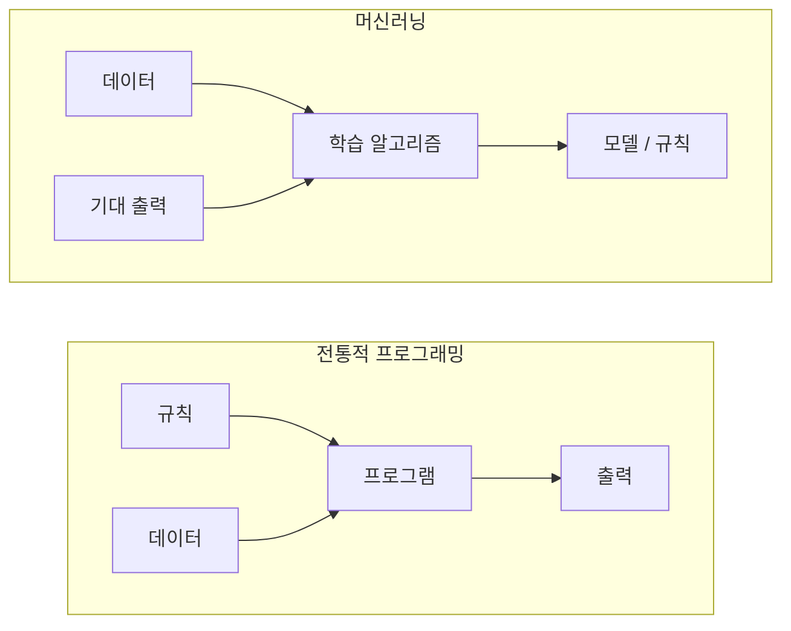
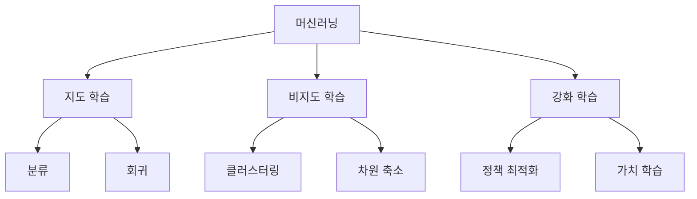
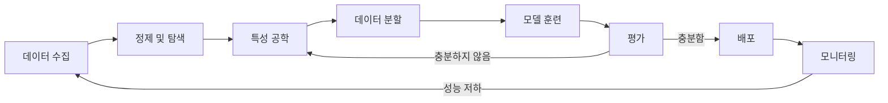
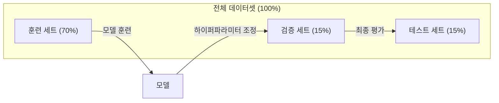
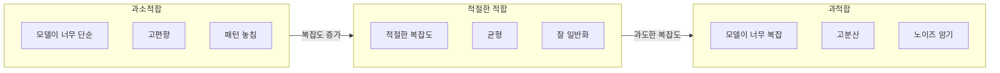
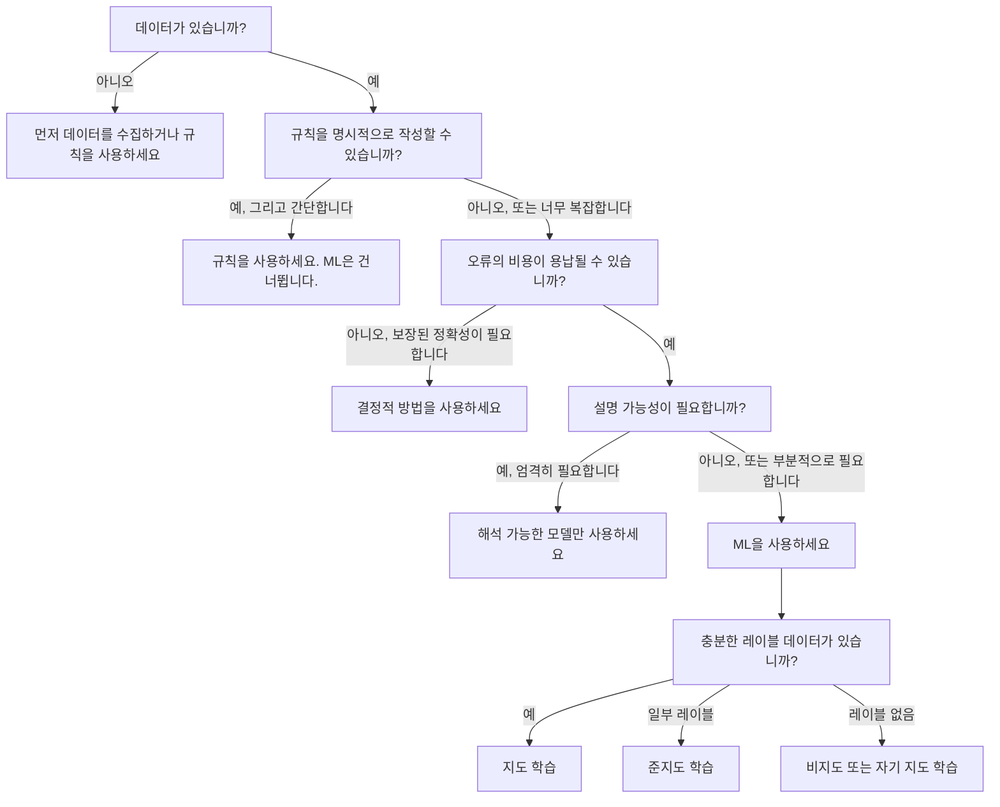

# 머신 러닝이란 무엇인가

> 머신 러닝은 규칙을 직접 작성하는 대신 컴퓨터가 데이터에서 패턴을 찾도록 가르치는 것입니다.

**유형:** Learn  
**언어:** Python  
**선수 지식:** Phase 1 (수학 기초)  
**소요 시간:** ~45분

## 학습 목표

- 지도 학습(supervised learning), 비지도 학습(unsupervised learning), 강화 학습(reinforcement learning)의 차이점을 설명하고 주어진 문제에 어떤 유형이 적용되는지 식별하기
- 최근접 중심점 분류기(nearest centroid classifier)를 처음부터 구현하고 무작위 기준선(random baseline)과 비교하여 평가하기
- 분류(classification)와 회귀(regression) 작업을 구분하고 각각에 적합한 손실 함수(loss function) 선택하기
- 주어진 비즈니스 문제가 ML에 적합한지 또는 결정적 규칙(deterministic rules)으로 더 잘 해결될 수 있는지 평가하기

## 문제 정의

스팸 필터를 구축하고 싶다고 가정해 보자. 전통적인 접근 방식은 수백 개의 규칙을 직접 작성하는 것이다. "이메일에 'FREE MONEY'가 포함되어 있으면 스팸으로 표시한다. 느낌표가 3개 이상 있으면 스팸으로 표시한다." 이런 식으로 몇 주 동안 규칙을 작성한다. 그런데 스팸 발송자가 문구를 변경하면 규칙이 깨진다. 더 많은 규칙을 추가한다. 이 과정은 끝없이 반복된다.

머신러닝은 이 방식을 뒤집는다. 규칙을 직접 작성하는 대신, 컴퓨터에 수천 개의 레이블이 지정된 이메일("스팸" 또는 "스팸 아님")을 제공하고 컴퓨터가 스스로 규칙을 찾아내도록 한다. 컴퓨터는 당신이 절대 생각해내지 못했을 패턴을 발견한다. 스팸 발송자가 전략을 변경하면 코드를 다시 작성하는 대신 새로운 데이터로 재학습시킨다.

"규칙 프로그래밍"에서 "데이터 기반 학습"으로의 전환이 머신러닝의 핵심이다. 모든 추천 엔진, 음성 비서, 자율주행차, 언어 모델이 이 방식으로 작동한다.

## 개념

### 규칙 아닌 데이터로부터 학습

전통적인 프로그래밍과 머신러닝은 반대 방향으로 문제를 해결합니다.



**전통적 프로그래밍**: 규칙을 작성합니다. 프로그램은 이를 데이터에 적용하여 출력을 생성합니다.

**머신러닝**: 데이터와 기대 출력을 제공합니다. 알고리즘이 규칙을 발견합니다.

학습에서 나온 "모델"은 규칙이며, 숫자(가중치, 파라미터)로 인코딩됩니다. 이는 본 적 없는 데이터에 대한 예측을 위해 본 예시를 일반화합니다.

### 머신러닝의 세 가지 유형



**지도 학습**: 입력-출력 쌍이 있습니다. 모델은 입력을 출력에 매핑하는 방법을 학습합니다.
- "고양이 또는 개로 레이블된 10,000장의 사진이 있습니다. 구분하는 방법을 학습하세요."
- "집 특징과 가격이 있습니다. 가격을 예측하는 방법을 학습하세요."

**비지도 학습**: 입력만 있습니다. 레이블이 없습니다. 모델은 스스로 구조를 찾습니다.
- "10,000명의 고객 구매 기록이 있습니다. 자연스러운 그룹을 찾으세요."
- "1,000차원 데이터 포인트가 있습니다. 구조를 유지하면서 2차원으로 축소하세요."

**강화 학습**: 에이전트가 환경에서 행동을 취하고 보상 또는 페널티를 받습니다. 총 보상을 최대화하는 전략(정책)을 학습합니다.
- "이 게임을 플레이하세요. 승리 시 +1, 패배 시 -1. 전략을 파악하세요."
- "이 로봇 팔을 제어하세요. 물체 집기 시 +1, 낭비된 초당 -0.01."

실제로 구축하는 대부분의 것은 지도 학습을 사용합니다. 비지도 학습은 전처리 및 탐색에 흔히 사용됩니다. 강화 학습은 게임 AI, 로봇공학, 언어 모델을 위한 RLHF를 구동합니다.

### 빅 쓰리 너머

위의 세 범주는 명확하지만, 실제 ML은 종종 경계를 흐립니다.

**준지도 학습**은 소량의 레이블 데이터와 대량의 레이블 없는 데이터를 사용합니다. 레이블된 의료 이미지 100장과 레이블 없는 이미지 100,000장이 있을 수 있습니다. 기법에는 다음이 포함됩니다:

- **레이블 전파**: 유사한 데이터 포인트를 연결하는 그래프를 구축합니다. 레이블은 레이블된 노드에서 그래프를 통해 레이블 없는 이웃으로 퍼집니다.
- **의사 레이블링**: 레이블 데이터로 모델을 훈련시킨 후, 레이블 없는 데이터에 대한 레이블을 예측하고 모든 데이터로 재훈련합니다. 모델은 자체 훈련 세트를 부트스트랩합니다.
- **일관성 정규화**: 모델은 입력과 약간 변형된 버전에 대해 동일한 예측을 해야 합니다. 이는 레이블 없이도 작동합니다.

**자기 지도 학습**은 데이터 자체에서 감독을 생성합니다. 인간의 레이블이 전혀 필요 없습니다. 모델은 데이터 구조로부터 자체 예측 작업을 생성합니다.

- **마스크 언어 모델링 (BERT)**: 문장에서 15%의 단어를 숨기고, 누락된 단어를 예측하도록 모델을 훈련시킵니다. "레이블"은 원본 텍스트에서 옵니다.
- **대조 학습 (SimCLR)**: 이미지를 가져와 두 가지 증강 버전을 만듭니다. 모델이 동일한 이미지에서 왔음을 인식하면서 다른 이미지의 증강 버전과 구별하도록 훈련시킵니다.
- **다음 토큰 예측 (GPT)**: 이전 모든 단어를 주고 다음 단어를 예측합니다. 모든 텍스트 문서가 훈련 예시가 됩니다.

이들은 빅 쓰리와 별개의 범주가 아닙니다. 지도 학습과 비지도 학습 아이디어를 결합한 전략입니다. 자기 지도 학습은 기술적으로 지도 학습이지만(모델이 무언가를 예측), 레이블은 인간이 아닌 자동으로 생성됩니다.

### 분류 vs 회귀

이들은 두 가지 주요 지도 학습 작업입니다.

| 측면 | 분류 | 회귀 |
|--------|---------------|------------|
| 출력 | 이산 범주 | 연속 숫자 |
| 예시 | "이 이메일이 스팸인가?" | "집 가격은 얼마일까?" |
| 출력 공간 | {고양이, 개, 새} | 임의의 실수 |
| 손실 함수 | 교차 엔트로피, 정확도 | 평균 제곱 오차, MAE |
| 결정 | 클래스 간 경계 | 데이터에 맞는 곡선 |

분류는 "어떤 범주인가?"에 답하고, 회귀는 "얼마나?"에 답합니다.

일부 문제는 두 가지 방식으로 구성할 수 있습니다. 주식이 상승할지 하락할지를 예측하는 것은 분류입니다. 정확한 가격을 예측하는 것은 회귀입니다.

### ML 워크플로우

모든 머신러닝 프로젝트는 알고리즘과 무관하게 동일한 파이프라인을 따릅니다.



**데이터 수집**: 원시 데이터를 모읍니다. 더 많은 데이터가 거의 항상 더 좋지만, 양보다 질이 중요합니다.

**정제 및 탐색**: 결측값 처리, 중복 제거, 분포 시각화, 이상치 발견. 이 단계는 종종 전체 프로젝트 시간의 60-80%를 차지합니다.

**특성 공학**: 원시 데이터를 모델이 사용할 수 있는 특성으로 변환합니다. 날짜를 요일별로 변환합니다. 수치형 열을 정규화합니다. 범주형 변수를 인코딩합니다. 좋은 특성은 화려한 알고리즘보다 더 중요합니다.

**데이터 분할**: 훈련, 검증, 테스트 세트로 나눕니다. 모델은 훈련 데이터로 훈련하고, 검증 데이터로 하이퍼파라미터를 조정하며, 테스트 데이터로 최종 성능을 보고합니다.

**모델 훈련**: 훈련 데이터를 알고리즘에 입력합니다. 알고리즘은 손실 함수를 최소화하기 위해 내부 파라미터를 조정합니다.

**평가**: 검증/테스트 데이터에서 성능을 측정합니다. 성능이 만족스럽지 않으면 다른 특성, 알고리즘, 하이퍼파라미터를 시도합니다.

**배포**: 모델을 프로덕션에 배치하여 새로운 데이터에 대한 예측을 수행합니다.

**모니터링**: 시간에 따른 성능을 추적합니다. 데이터 분포가 변경되고(데이터 드리프트), 모델이 저하됩니다. 성능이 떨어지면 재훈련합니다.

### 훈련, 검증, 테스트 분할

이것은 초보자가 가장 잘못 이해하는 중요한 개념입니다. 훈련 중에 본 적 없는 데이터로 모델을 평가해야 합니다. 그렇지 않으면 학습이 아닌 암기를 측정하는 것입니다.



| 분할 | 목적 | 사용 시기 | 일반적인 크기 |
|-------|---------|-----------|-------------|
| 훈련 | 모델이 이 데이터로부터 학습 | 훈련 중 | 60-80% |
| 검증 | 하이퍼파라미터 조정, 모델 비교 | 각 훈련 실행 후 | 10-20% |
| 테스트 | 최종 편향 없는 성능 추정 | 마지막에 한 번 | 10-20% |

테스트 세트는 신성합니다. 정확히 한 번 봅니다. 테스트 성능을 기준으로 모델을 계속 조정하면 테스트 세트로 훈련하는 것과 같으며, 보고된 숫자는 무의미합니다.

작은 데이터셋의 경우 k-폴드 교차 검증을 사용합니다: 데이터를 k개 부분으로 나누고, k-1개 부분으로 훈련하고 나머지 부분으로 검증하며, 회전하고 결과를 평균냅니다.

### 과적합 vs 과소적합



**과소적합**: 모델이 너무 단순하여 데이터의 패턴을 포착하지 못합니다. 곡선 관계를 맞추려는 직선. 훈련 오차가 높습니다. 테스트 오차도 높습니다.

**과적합**: 모델이 너무 복잡하여 훈련 데이터, 심지어 노이즈까지 암기합니다. 모든 훈련 지점을 통과하지만 새로운 데이터에서는 실패하는 구불구불한 곡선. 훈련 오차는 낮습니다. 테스트 오차는 높습니다.

**적절한 적합**: 모델이 노이즈를 암기하지 않고 실제 패턴을 포착합니다. 훈련 오차와 테스트 오차가 모두 합리적으로 낮습니다.

과적합의 징후:
- 훈련 정확도가 검증 정확도보다 훨씬 높음
- 모델이 훈련 데이터에서는 잘 수행하지만 새로운 데이터에서는 성능이 낮음
- 더 많은 훈련 데이터를 추가하면 성능이 향상됨(모델이 학습이 아닌 암기를 하고 있었음)

과적합 해결 방법:
- 더 많은 훈련 데이터 확보
- 모델 복잡도 감소(파라미터 수 감소, 더 단순한 아키텍처)
- 정규화(큰 가중치에 대한 페널티 추가)
- 드롭아웃(훈련 중 뉴런을 무작위로 0으로 만듦)
- 조기 종료(검증 오차가 증가하기 시작할 때 훈련 중단)

과소적합 해결 방법:
- 더 복잡한 모델 사용
- 더 많은 특성 추가
- 정규화 감소
- 더 오래 훈련

### 편향-분산 트레이드오프

이것은 과적합과 과소적합의 수학적 프레임워크입니다.

**편향**: 모델의 잘못된 가정으로 인한 오차. 진정한 관계가 비선형일 때 선형 모델은 고편향을 가집니다. 고편향은 과소적합을 유발합니다.

**분산**: 훈련 데이터의 작은 변동에 대한 민감도로 인한 오차. 고분산 모델은 데이터의 다른 부분집합으로 훈련될 때 매우 다른 예측을 제공합니다. 고분산은 과적합을 유발합니다.

| 모델 복잡도 | 편향 | 분산 | 결과 |
|-----------------|------|----------|--------|
| 너무 낮음(곡선 데이터에 대한 선형 모델) | 높음 | 낮음 | 과소적합 |
| 적절함 | 중간 | 중간 | 좋은 일반화 |
| 너무 높음(10개 포인트에 대한 20차 다항식) | 낮음 | 높음 | 과적합 |

총 오차 = 편향^2 + 분산 + 감소 불가능한 노이즈

감소 불가능한 노이즈(데이터 자체의 무작위성)는 줄일 수 없습니다. 편향^2 + 분산이 최소화되는 지점을 찾고자 합니다.

### 무료 점심은 없다 정리

모든 문제에 가장 잘 작동하는 단일 알고리즘은 없습니다. 한 문제 클래스에서 잘 작동하는 알고리즘은 다른 클래스에서 성능이 떨어집니다. 이것이 데이터 과학자가 여러 알고리즘을 시도하고 결과를 비교하는 이유입니다.

실제로 선택은 다음에 따라 달라집니다:
- 데이터의 양
- 특성의 수
- 관계가 선형인지 비선형인지
- 해석 가능성이 필요한지
- 얼마나 많은 계산 자원을 사용할 수 있는지

### 머신러닝을 사용하지 말아야 할 때

ML은 강력하지만 항상 적절한 도구는 아닙니다. 모델을 사용하기 전에 실제로 필요한지 질문하세요.

**ML을 사용하지 말아야 할 경우**:

- **규칙이 간단하고 명확하게 정의된 경우**. 세금 계산, 정렬 알고리즘, 단위 변환. 몇 개의 if-문장으로 로직을 작성할 수 있다면, 모델은 복잡성만 추가합니다.
- **데이터가 없거나 매우 적은 경우**. ML은 학습할 예시가 필요합니다. 10개의 데이터 포인트로는 의미 있는 것을 훈련할 수 없습니다. 먼저 데이터를 수집하세요.
- **틀렸을 때의 비용이 치명적이고 보장된 정확성이 필요한 경우**. 의료 투약 계산, 원자로 제어, 암호 검증. ML 모델은 확률적입니다. 때때로 틀릴 것입니다. "때때로 틀림"이 용납되지 않는다면 결정적 방법을 사용하세요.
- **조회 테이블이나 휴리스틱이 문제를 해결하는 경우**. 간단한 임계값이나 테이블이 99%의 경우를 커버한다면, ML 추가는 의미 있는 개선 없이 유지보수 비용만 증가시킵니다.
- **결정을 설명할 수 없고 설명 가능성이 필요한 경우**. 규제 산업(대출, 보험, 형사 사법)은 때때로 모든 결정이 완전히 설명 가능해야 합니다. 일부 ML 모델은 해석 가능합니다(선형 회귀, 작은 결정 트리). 대부분은 그렇지 않습니다.
- **문제가 재훈련보다 빠르게 변화하는 경우**. 규칙이 매일 바뀌고 재훈련에 일주일이 걸린다면, 모델은 항상 오래된 것입니다.

이 결정 플로우차트를 사용하세요:



## 빌드하기

`code/ml_intro.py`의 코드는 가장 간단한 ML 알고리즘인 최근접 중심점 분류기(nearest centroid classifier)를 처음부터 구현합니다. 이 코드는 핵심 아이디어를 보여줍니다: 데이터에서 학습한 후 새로운 데이터에 대해 예측합니다.

### 1단계: 처음부터 시작하는 최근접 중심점 분류기

최근접 중심점 분류기는 훈련 데이터에서 각 클래스의 중심(평균)을 계산합니다. 예측할 때는 각 새로운 점을 가장 가까운 중심을 가진 클래스에 할당합니다.

```python
class NearestCentroid:
    def fit(self, X, y):
        self.classes = np.unique(y)
        self.centroids = np.array([
            X[y == c].mean(axis=0) for c in self.classes
        ])

    def predict(self, X):
        distances = np.array([
            np.sqrt(((X - c) ** 2).sum(axis=1))
            for c in self.centroids
        ])
        return self.classes[distances.argmin(axis=0)]
```

이것이 전체 알고리즘입니다. `fit`은 두 평균을 계산합니다. `predict`는 거리를 계산합니다. 경사 하강법(gradient descent), 반복(iteration), 하이퍼파라미터(hyperparameters)가 없습니다.

### 2단계: 합성 데이터로 훈련하기

두 클래스가 약간 겹치는 2D 분류 데이터셋을 생성합니다. 중심점 분류기는 클래스 중심 사이에 선형 결정 경계를 그립니다.

```python
rng = np.random.RandomState(42)
X_class0 = rng.randn(100, 2) + np.array([1.0, 1.0])
X_class1 = rng.randn(100, 2) + np.array([-1.0, -1.0])
X = np.vstack([X_class0, X_class1])
y = np.array([0] * 100 + [1] * 100)
```

### 3단계: 베이스라인과 비교하기

모든 ML 모델은 단순한 베이스라인과 비교되어야 합니다. 여기서는 베이스라인이 무작위 클래스를 예측합니다. 만약 ML 모델이 무작위 추측보다 성능이 낮다면 문제가 있는 것입니다.

```python
baseline_preds = rng.choice([0, 1], size=len(y_test))
baseline_acc = np.mean(baseline_preds == y_test)
```

중심점 분류기는 이 깨끗한 데이터셋에서 약 90% 이상의 정확도를 얻어야 합니다. 무작위 베이스라인은 약 50%를 얻습니다.

### 이것이 중요한 이유

최근접 중심점 분류기는 매우 간단합니다. 하이퍼파라미터, 반복, 경사 하강법이 없습니다. 그러나 이 분류기는 기본적인 ML 패턴을 포착합니다:

1. **학습**: 훈련 데이터에서 표현(중심점)을 학습
2. **예측**: 해당 표현을 사용해 새로운 데이터 예측(가장 가까운 거리)
3. **평가**: 베이스라인(무작위 추측)과 비교

로지스틱 회귀(logistic regression)부터 트랜스포머(transformers)까지 모든 ML 알고리즘은 이 동일한 3단계 패턴을 따릅니다. 표현은 더 복잡해지지만 워크플로우는 동일합니다.

### 4단계: 중심점 분류기가 할 수 없는 것

최근접 중심점 분류기는 각 클래스가 단일 덩어리(blob)를 형성한다고 가정합니다. 선형 결정 경계를 그립니다. 다음 경우에 실패합니다:

- 클래스에 여러 클러스터가 있는 경우(예: 숫자 "1"은 여러 가지 방식으로 작성될 수 있음)
- 결정 경계가 비선형인 경우(예: 한 클래스가 다른 클래스를 감싸는 경우)
- 특징(feature)의 스케일이 매우 다른 경우(거리가 가장 큰 스케일의 특징에 의해 지배됨)

이러한 한계는 여러분이 배우게 될 다른 모든 알고리즘을 동기부여합니다. K-최근접 이웃(K-nearest neighbors)은 여러 클러스터를 처리합니다. 결정 트리(decision trees)는 비선형 경계를 처리합니다. 특징 스케일링(feature scaling)은 스케일 문제를 해결합니다. 각 레슨은 이전 알고리즘의 한계를 기반으로 구축됩니다.

## 사용 방법

sklearn은 `NearestCentroid`와 합성 데이터 생성기를 제공합니다:

```python
from sklearn.neighbors import NearestCentroid
from sklearn.datasets import make_classification
from sklearn.model_selection import train_test_split

X, y = make_classification(
    n_samples=500, n_features=2, n_redundant=0,
    n_clusters_per_class=1, random_state=42
)
X_train, X_test, y_train, y_test = train_test_split(X, y, test_size=0.3)

clf = NearestCentroid()
clf.fit(X_train, y_train)
print(f"정확도: {clf.score(X_test, y_test):.3f}")
```

## Ship It

이 레슨은 `outputs/prompt-ml-problem-framer.md`를 생성합니다. 이 파일은 모호한 비즈니스 문제를 구체적인 ML 작업으로 변환하는 프롬프트입니다. 문제 설명("이탈률 감소" 또는 "다음 분기 수요 예측")을 입력하면 학습 유형을 식별하고, 예측 대상을 정의하며, 후보 특성 목록을 작성하고, 성공 지표를 선택하며, 기준선을 설정하고, 데이터 누출 또는 클래스 불균형과 같은 위험 요소를 표시합니다. 모든 ML 프로젝트 시작 시 이를 사용하여 잘못된 솔루션을 구축하는 것을 방지하세요.

## 주요 용어

| 용어 | 사람들이 말하는 표현 | 실제 의미 |
|------|----------------|----------------------|
| 모델 | "AI" | 입력값을 출력값으로 매핑하는 학습 가능한 매개변수를 가진 수학적 함수 |
| 학습 | "AI를 가르치는 것" | 예측값이 알려진 출력값과 일치하도록 모델 매개변수를 조정하는 최적화 알고리즘 실행 |
| 특성 | "입력 열" | 모델이 예측에 사용하는 데이터의 측정 가능한 속성 |
| 레이블 | "정답" | 훈련 예시에 대한 알려진 출력값, 오차 신호 계산에 사용 |
| 하이퍼파라미터 | "조정하는 설정값" | 학습 과정을 제어하는 학습 전 설정된 매개변수 (학습률, 레이어 수) |
| 손실 함수 | "모델의 오류 정도" | 예측 출력과 실제 출력 사이의 차이를 측정하는 함수, 학습은 이를 최소화하려 함 |
| 과적합 | "테스트 데이터를 외웠어" | 모델이 일반적인 패턴 대신 훈련 데이터의 노이즈를 학습하여 새로운 데이터에서 실패 |
| 과소적합 | "아무것도 못 배웠어" | 모델이 데이터의 실제 패턴을 포착하기에는 너무 단순함 |
| 일반화 | "새로운 데이터에서도 작동해" | 훈련되지 않은 데이터에 대해 정확한 예측을 하는 모델의 능력 |
| 교차 검증 | "다른 데이터 조각으로 테스트" | 데이터를 반복적으로 훈련/테스트 폴드로 분할하고 결과를 평균화하여 더 견고한 성능 추정치 제공 |
| 정규화 | "가중치를 작게 유지" | 지나치게 복잡한 모델을 억제하는 손실 함수에 페널티 항 추가 |
| 데이터 드리프트 | "세상이 변했어" | 시간이 지남에 따라 입력 데이터의 통계적 분포가 변화하여 모델 성능 저하 |

## 연습 문제

1. 임의의 데이터셋(예: Iris, Titanic)을 선택하고 70/15/15 비율로 train/validation/test 세트로 분할하세요. 테스트 세트에서 하이퍼파라미터를 튜닝하면 안 되는 이유를 설명하세요.  
   - **정답 예시**: 테스트 세트는 모델 최종 평가를 위한 독립적인 기준입니다. 테스트 세트를 하이퍼파라미터 튜닝에 사용하면 데이터 누수(data leakage)가 발생하여 모델의 일반화 성능을 과대평가하게 됩니다. 이는 실제 배포 환경에서 성능 저하로 이어질 수 있습니다.

2. 실제 문제 3가지를 나열하고, 각각이 분류(classification), 회귀(regression), 클러스터링(clustering) 중 어디에 해당하는지, 그리고 지도 학습(supervised) 또는 비지도 학습(unsupervised)인지 식별하세요.  
   - **예시 1**:  
     - 문제: 이메일 스팸 여부 판단  
     - 유형: 분류 (지도 학습)  
   - **예시 2**:  
     - 문제: 주택 가격 예측  
     - 유형: 회귀 (지도 학습)  
   - **예시 3**:  
     - 문제: 고객 구매 패턴 그룹화  
     - 유형: 클러스터링 (비지도 학습)  

3. 어떤 모델이 훈련 데이터에서 99% 정확도를 달성했지만 테스트 데이터에서는 60% 정확도를 기록했습니다. 문제를 진단하고 이를 해결하기 위해 시도할 3가지 방법을 제시하세요.  
   - **진단**: 과적합(overfitting) 발생. 모델이 훈련 데이터에 지나치게 특화되어 일반화되지 못했습니다.  
   - **해결 방법**:  
     1. 정규화(regularization) 적용 (예: L1/L2 정규화)  
     2. 드롭아웃(dropout) 또는 데이터 증강(data augmentation) 사용  
     3. 모델 복잡도 감소 (예: 레이어/유닛 수 줄이기) 또는 조기 종료(early stopping) 적용

## 추가 학습 자료

- [통계적 학습 입문](https://www.statlearning.com/) - 실용적인 예제와 함께 모든 고전적 ML 방법을 다루는 무료 교재
- [Google의 머신러닝 크래시 코스](https://developers.google.com/machine-learning/crash-course) - ML 개념을 시각적으로 간결하게 소개하는 자료
- [Scikit-learn 사용자 가이드](https://scikit-learn.org/stable/user_guide.html) - Python에서 ML 구현을 위한 실용적인 참고 자료