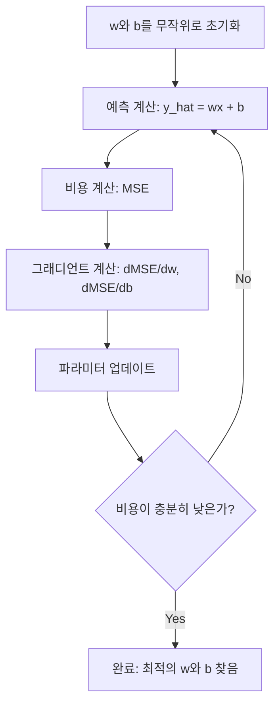

# 선형 회귀(Linear Regression)

> 선형 회귀는 데이터를 통해 최적의 직선을 그립니다. 이는 머신러닝의 "hello world"입니다.

**유형:** Build  
**언어:** Python  
**선수 지식:** Phase 1 (선형 대수, 미적분학, 최적화), Phase 2 Lesson 1  
**소요 시간:** ~90분

## 학습 목표

- 평균 제곱 오차(mean squared error)에 대한 경사 하강법(gradient descent) 업데이트 규칙을 유도하고 선형 회귀(linear regression)를 처음부터 구현
- 계산 복잡도(computational complexity)와 각 방법 사용 시기 측면에서 경사 하강법(gradient descent)과 정규 방정식(normal equation) 비교
- 특성 표준화(feature standardization)를 적용한 다중 선형 회귀(multiple linear regression) 모델 구축 및 학습된 가중치(learned weights) 해석
- 릿지 회귀(Ridge regression, L2 정규화)가 큰 가중치에 페널티를 부과하여 과적합(overfitting)을 방지하는 방식 설명

## 문제 정의

당신은 데이터(집 크기와 판매 가격)를 가지고 있습니다. 새로운 집의 크기를 기반으로 가격을 예측하려고 합니다. 산점도로 대략 추정할 수도 있지만, 공식이 필요합니다. 데이터에 가장 잘 맞는 직선을 찾아 어떤 크기든 입력하면 가격 예측을 얻을 수 있어야 합니다.

선형 회귀(Linear Regression)는 그 직선을 제공합니다. 더 중요한 것은, 선형 회귀가 전체 ML 학습 루프를 소개한다는 점입니다: 모델 정의, 비용 함수 정의, 파라미터 최적화. 모든 ML 알고리즘은 이 동일한 패턴을 따릅니다. 가장 간단한 사례로 여기서 마스터하면 어디서든 이를 알아볼 수 있을 것입니다.

이것은 단순한 문제만을 위한 것이 아닙니다. 선형 회귀는 수요 예측, A/B 테스트 분석, 금융 모델링, 그리고 모든 회귀 작업의 기준 모델(baseline)로 프로덕션 시스템에서 사용됩니다.

## 개념

### 모델

선형 회귀는 입력(x)과 출력(y) 사이의 선형 관계를 가정합니다:

```
y = wx + b
```

- `w` (가중치/기울기): x가 1 증가할 때 y의 변화량
- `b` (편향/절편): x = 0일 때 y의 값

여러 입력(특성)의 경우 다음과 같이 확장됩니다:

```
y = w1*x1 + w2*x2 + ... + wn*xn + b
```

또는 벡터 형태로: `y = w^T * x + b`

목표: 모든 훈련 예시에 대해 예측된 y가 실제 y에 최대한 가깝도록 w와 b의 값을 찾는 것.

### 비용 함수 (평균 제곱 오차)

"최대한 가깝게"를 어떻게 측정할까요? 예측 오차를 포착하는 단일 숫자가 필요합니다. 가장 일반적인 선택은 평균 제곱 오차(MSE)입니다:

```
MSE = (1/n) * sum((y_predicted - y_actual)^2)
```

왜 제곱을 사용할까요? 두 가지 이유가 있습니다. 첫째, 큰 오차를 작은 오차보다 더 강하게 패널티합니다(오차 10은 오차 1보다 100배 더 나쁩니다, 10배가 아님). 둘째, 제곱 함수는 모든 곳에서 매끄럽고 미분 가능하므로 최적화가 간단합니다.

비용 함수는 표면을 생성합니다. 단일 가중치 w와 편향 b에 대해 MSE 표면은 그릇 모양(볼록한 포물면)처럼 보입니다. 그릇의 가장 낮은 지점이 MSE가 최소인 지점입니다. 훈련은 그 지점을 찾는 것을 의미합니다.

### 경사 하강법

경사 하강법은 내리막 방향으로 단계를 밟으며 그릇의 바닥을 찾습니다.



그래디언트는 두 가지 정보를 제공합니다: 각 파라미터를 어떤 방향으로 이동해야 하는지, 그리고 얼마나 이동해야 하는지.

y_hat = wx + b에 대한 MSE의 경우:

```
dMSE/dw = (2/n) * sum((y_hat - y) * x)
dMSE/db = (2/n) * sum(y_hat - y)
```

업데이트 규칙:

```
w = w - learning_rate * dMSE/dw
b = b - learning_rate * dMSE/db
```

학습률은 단계 크기를 제어합니다. 너무 크면 최소값을 지나쳐 발산하고, 너무 작으면 훈련이 너무 오래 걸립니다. 일반적인 시작 값: 0.01, 0.001, 또는 0.0001.

### 정규 방정식 (닫힌 형식 해법)

선형 회귀의 경우, 반복 없이도 최적의 가중치를 제공하는 직접 공식이 있습니다:

```
w = (X^T * X)^(-1) * X^T * y
```

이 공식은 행렬을 역연산하여 한 단계로 w를 구합니다. 작은 데이터셋에는 완벽하게 작동합니다. 큰 데이터셋(수백만 행 또는 수천 특성)의 경우, 행렬 역연산이 특성 수의 세제곱(O(n^3))에 비례하므로 경사 하강법이 선호됩니다.

### 다중 선형 회귀

여러 특성이 있는 경우 모델은 다음과 같습니다:

```
y = w1*x1 + w2*x2 + ... + wn*xn + b
```

모든 것이 동일하게 작동합니다: MSE는 비용 함수이고, 경사 하강법은 모든 가중치를 동시에 업데이트합니다. 유일한 차이는 선 대신 초평면을 피팅한다는 것입니다.

특성 스케일링이 중요합니다. 한 특성이 0~1 범위이고 다른 특성이 0~1,000,000 범위라면, 비용 표면이 길쭉해져 경사 하강법이 어려움을 겪습니다. 훈련 전에 특성을 표준화(평균을 빼고 표준편차로 나누기)하세요.

### 다항 회귀

관계가 선형이 아닌 경우, 다항식 특성을 생성하여 선형 회귀를 사용할 수 있습니다:

```
y = w1*x + w2*x^2 + w3*x^3 + b
```

이것은 여전히 "선형" 회귀입니다. 모델이 가중치(w1, w2, w3)에 대해 선형이기 때문입니다. 단지 x의 비선형 특성을 사용할 뿐입니다.

고차 다항식은 더 복잡한 곡선을 피팅할 수 있지만 과적합 위험이 있습니다. 10차 다항식은 10개 점 데이터셋을 완벽히 통과하지만 새로운 데이터에서는 예측을 잘 못합니다.

### R-제곱 점수

MSE는 얼마나 틀렸는지 알려주지만, 이 값은 y의 스케일에 의존합니다. R-제곱(R²)은 스케일에 독립적인 측정값을 제공합니다:

```
R^2 = 1 - (잔차 제곱합) / (평균 편차 제곱합)
    = 1 - SS_res / SS_tot
```

- R² = 1.0: 완벽한 예측
- R² = 0.0: 모델이 매번 평균을 예측하는 것과 동일
- R² < 0.0: 모델이 평균 예측보다 나쁨

### 정규화 개요 (릿지 회귀)

많은 특성이 있을 때, 모델은 큰 가중치를 할당하여 과적합할 수 있습니다. 릿지 회귀(L2 정규화)는 패널티를 추가합니다:

```
비용 = MSE + lambda * sum(w_i^2)
```

패널티 항은 큰 가중치를 억제합니다. 하이퍼파라미터 lambda는 균형을 제어합니다: lambda가 클수록 가중치가 작아지고 정규화가 강해집니다. 이는 이후 수업에서 깊이 다룹니다. 지금은 이것이 존재하고 왜 도움이 되는지 알아두세요.

## 구축

### 1단계: 샘플 데이터 생성

```python
import random
import math

random.seed(42)

TRUE_W = 3.0
TRUE_B = 7.0
N_SAMPLES = 100

X = [random.uniform(0, 10) for _ in range(N_SAMPLES)]
y = [TRUE_W * x + TRUE_B + random.gauss(0, 2.0) for x in X]

print(f"생성된 샘플 수: {N_SAMPLES}개")
print(f"실제 관계식: y = {TRUE_W}x + {TRUE_B} (+ 노이즈)")
print(f"첫 5개 점: {[(round(X[i], 2), round(y[i], 2)) for i in range(5)]}")
```

### 2단계: 경사 하강법을 이용한 선형 회귀 구현

```python
class LinearRegression:
    def __init__(self, learning_rate=0.01):
        self.w = 0.0
        self.b = 0.0
        self.lr = learning_rate
        self.cost_history = []

    def predict(self, X):
        return [self.w * x + self.b for x in X]

    def compute_cost(self, X, y):
        predictions = self.predict(X)
        n = len(y)
        cost = sum((pred - actual) ** 2 for pred, actual in zip(predictions, y)) / n
        return cost

    def compute_gradients(self, X, y):
        predictions = self.predict(X)
        n = len(y)
        dw = (2 / n) * sum((pred - actual) * x for pred, actual, x in zip(predictions, y, X))
        db = (2 / n) * sum(pred - actual for pred, actual in zip(predictions, y))
        return dw, db

    def fit(self, X, y, epochs=1000, print_every=200):
        for epoch in range(epochs):
            dw, db = self.compute_gradients(X, y)
            self.w -= self.lr * dw
            self.b -= self.lr * db
            cost = self.compute_cost(X, y)
            self.cost_history.append(cost)
            if epoch % print_every == 0:
                print(f"  에포크 {epoch:4d} | 비용: {cost:.4f} | w: {self.w:.4f} | b: {self.b:.4f}")
        return self

    def r_squared(self, X, y):
        predictions = self.predict(X)
        y_mean = sum(y) / len(y)
        ss_res = sum((actual - pred) ** 2 for actual, pred in zip(y, predictions))
        ss_tot = sum((actual - y_mean) ** 2 for actual in y)
        return 1 - (ss_res / ss_tot)


print("=== 선형 회귀 학습 (경사 하강법) ===")
model = LinearRegression(learning_rate=0.005)
model.fit(X, y, epochs=1000, print_every=200)
print(f"\n학습 결과: y = {model.w:.4f}x + {model.b:.4f}")
print(f"실제 값:    y = {TRUE_W}x + {TRUE_B}")
print(f"결정 계수(R²): {model.r_squared(X, y):.4f}")
```

### 3단계: 정규 방정식 (닫힌 형식 해법)

```python
class LinearRegressionNormal:
    def __init__(self):
        self.w = 0.0
        self.b = 0.0

    def fit(self, X, y):
        n = len(X)
        x_mean = sum(X) / n
        y_mean = sum(y) / n
        numerator = sum((X[i] - x_mean) * (y[i] - y_mean) for i in range(n))
        denominator = sum((X[i] - x_mean) ** 2 for i in range(n))
        self.w = numerator / denominator
        self.b = y_mean - self.w * x_mean
        return self

    def predict(self, X):
        return [self.w * x + self.b for x in X]

    def r_squared(self, X, y):
        predictions = self.predict(X)
        y_mean = sum(y) / len(y)
        ss_res = sum((actual - pred) ** 2 for actual, pred in zip(y, predictions))
        ss_tot = sum((actual - y_mean) ** 2 for actual in y)
        return 1 - (ss_res / ss_tot)


print("\n=== 정규 방정식 (닫힌 형식) ===")
model_normal = LinearRegressionNormal()
model_normal.fit(X, y)
print(f"학습 결과: y = {model_normal.w:.4f}x + {model_normal.b:.4f}")
print(f"결정 계수(R²): {model_normal.r_squared(X, y):.4f}")
```

### 4단계: 다중 선형 회귀

```python
class MultipleLinearRegression:
    def __init__(self, n_features, learning_rate=0.01):
        self.weights = [0.0] * n_features
        self.bias = 0.0
        self.lr = learning_rate
        self.cost_history = []

    def predict_single(self, x):
        return sum(w * xi for w, xi in zip(self.weights, x)) + self.bias

    def predict(self, X):
        return [self.predict_single(x) for x in X]

    def compute_cost(self, X, y):
        predictions = self.predict(X)
        n = len(y)
        return sum((pred - actual) ** 2 for pred, actual in zip(predictions, y)) / n

    def fit(self, X, y, epochs=1000, print_every=200):
        n = len(y)
        n_features = len(X[0])
        for epoch in range(epochs):
            predictions = self.predict(X)
            errors = [pred - actual for pred, actual in zip(predictions, y)]
            for j in range(n_features):
                grad = (2 / n) * sum(errors[i] * X[i][j] for i in range(n))
                self.weights[j] -= self.lr * grad
            grad_b = (2 / n) * sum(errors)
            self.bias -= self.lr * grad_b
            cost = self.compute_cost(X, y)
            self.cost_history.append(cost)
            if epoch % print_every == 0:
                print(f"  에포크 {epoch:4d} | 비용: {cost:.4f}")
        return self

    def r_squared(self, X, y):
        predictions = self.predict(X)
        y_mean = sum(y) / len(y)
        ss_res = sum((actual - pred) ** 2 for actual, pred in zip(y, predictions))
        ss_tot = sum((actual - y_mean) ** 2 for actual in y)
        return 1 - (ss_res / ss_tot)


random.seed(42)
N = 100
X_multi = []
y_multi = []
for _ in range(N):
    size = random.uniform(500, 3000)
    bedrooms = random.randint(1, 5)
    age = random.uniform(0, 50)
    price = 50 * size + 10000 * bedrooms - 1000 * age + 50000 + random.gauss(0, 20000)
    X_multi.append([size, bedrooms, age])
    y_multi.append(price)


def standardize(X):
    n_features = len(X[0])
    means = [sum(X[i][j] for i in range(len(X))) / len(X) for j in range(n_features)]
    stds = []
    for j in range(n_features):
        variance = sum((X[i][j] - means[j]) ** 2 for i in range(len(X))) / len(X)
        stds.append(variance ** 0.5)
    X_scaled = []
    for i in range(len(X)):
        row = [(X[i][j] - means[j]) / stds[j] if stds[j] > 0 else 0 for j in range(n_features)]
        X_scaled.append(row)
    return X_scaled, means, stds


y_mean_val = sum(y_multi) / len(y_multi)
y_std_val = (sum((yi - y_mean_val) ** 2 for yi in y_multi) / len(y_multi)) ** 0.5
y_scaled = [(yi - y_mean_val) / y_std_val for yi in y_multi]

X_scaled, x_means, x_stds = standardize(X_multi)

print("\n=== 다중 선형 회귀 (3개 특성) ===")
print("특성: 집 크기, 침실 수, 건물 연식")
multi_model = MultipleLinearRegression(n_features=3, learning_rate=0.01)
multi_model.fit(X_scaled, y_scaled, epochs=1000, print_every=200)

print(f"\n가중치 (표준화): {[round(w, 4) for w in multi_model.weights]}")
print(f"편향 (표준화): {multi_model.bias:.4f}")
print(f"결정 계수(R²): {multi_model.r_squared(X_scaled, y_scaled):.4f}")
```

### 5단계: 다항식 회귀

```python
class PolynomialRegression:
    def __init__(self, degree, learning_rate=0.01):
        self.degree = degree
        self.weights = [0.0] * degree
        self.bias = 0.0
        self.lr = learning_rate

    def make_features(self, X):
        return [[x ** (d + 1) for d in range(self.degree)] for x in X]

    def predict(self, X):
        features = self.make_features(X)
        return [sum(w * f for w, f in zip(self.weights, row)) + self.bias for row in features]

    def fit(self, X, y, epochs=1000, print_every=200):
        features = self.make_features(X)
        n = len(y)
        for epoch in range(epochs):
            predictions = [sum(w * f for w, f in zip(self.weights, row)) + self.bias for row in features]
            errors = [pred - actual for pred, actual in zip(predictions, y)]
            for j in range(self.degree):
                grad = (2 / n) * sum(errors[i] * features[i][j] for i in range(n))
                self.weights[j] -= self.lr * grad
            grad_b = (2 / n) * sum(errors)
            self.bias -= self.lr * grad_b
            if epoch % print_every == 0:
                cost = sum(e ** 2 for e in errors) / n
                print(f"  에포크 {epoch:4d} | 비용: {cost:.6f}")
        return self

    def r_squared(self, X, y):
        predictions = self.predict(X)
        y_mean = sum(y) / len(y)
        ss_res = sum((actual - pred) ** 2 for actual, pred in zip(y, predictions))
        ss_tot = sum((actual - y_mean) ** 2 for actual in y)
        return 1 - (ss_res / ss_tot)


random.seed(42)
X_poly = [x / 10.0 for x in range(0, 50)]
y_poly = [0.5 * x ** 2 - 2 * x + 3 + random.gauss(0, 1.0) for x in X_poly]

x_max = max(abs(x) for x in X_poly)
X_poly_norm = [x / x_max for x in X_poly]
y_poly_mean = sum(y_poly) / len(y_poly)
y_poly_std = (sum((yi - y_poly_mean) ** 2 for yi in y_poly) / len(y_poly)) ** 0.5
y_poly_norm = [(yi - y_poly_mean) / y_poly_std for yi in y_poly]

print("\n=== 다항식 회귀 (2차 vs 5차) ===")
print("실제 관계식: y = 0.5x² - 2x + 3")

print("\n2차:")
poly2 = PolynomialRegression(degree=2, learning_rate=0.1)
poly2.fit(X_poly_norm, y_poly_norm, epochs=2000, print_every=500)
print(f"  결정 계수(R²): {poly2.r_squared(X_poly_norm, y_poly_norm):.4f}")

print("\n5차:")
poly5 = PolynomialRegression(degree=5, learning_rate=0.1)
poly5.fit(X_poly_norm, y_poly_norm, epochs=2000, print_every=500)
print(f"  결정 계수(R²): {poly5.r_squared(X_poly_norm, y_poly_norm):.4f}")

print("\n2차 모델은 실제 곡선에 잘 적합합니다. 5차 모델은 훈련 데이터에 약간 더 잘 적합하지만")
print("새로운 데이터에 대한 과적합 위험이 있습니다.")
```

### 6단계: 릿지 회귀 (L2 정규화)

```python
class RidgeRegression:
    def __init__(self, n_features, learning_rate=0.01, alpha=1.0):
        self.weights = [0.0] * n_features
        self.bias = 0.0
        self.lr = learning_rate
        self.alpha = alpha

    def predict_single(self, x):
        return sum(w * xi for w, xi in zip(self.weights, x)) + self.bias

    def predict(self, X):
        return [self.predict_single(x) for x in X]

    def fit(self, X, y, epochs=1000, print_every=200):
        n = len(y)
        n_features = len(X[0])
        for epoch in range(epochs):
            predictions = self.predict(X)
            errors = [pred - actual for pred, actual in zip(predictions, y)]
            mse = sum(e ** 2 for e in errors) / n
            reg_term = self.alpha * sum(w ** 2 for w in self.weights)
            cost = mse + reg_term
            for j in range(n_features):
                grad = (2 / n) * sum(errors[i] * X[i][j] for i in range(n))
                grad += 2 * self.alpha * self.weights[j]
                self.weights[j] -= self.lr * grad
            grad_b = (2 / n) * sum(errors)
            self.bias -= self.lr * grad_b
            if epoch % print_every == 0:
                print(f"  에포크 {epoch:4d} | 비용: {cost:.4f} | L2 페널티: {reg_term:.4f}")
        return self


print("\n=== 릿지 회귀 (L2 정규화) ===")
print("다중 회귀와 동일한 데이터, alpha=0.1")
ridge = RidgeRegression(n_features=3, learning_rate=0.01, alpha=0.1)
ridge.fit(X_scaled, y_scaled, epochs=1000, print_every=200)
print(f"\n릿지 가중치: {[round(w, 4) for w in ridge.weights]}")
print(f"일반 가중치: {[round(w, 4) for w in multi_model.weights]}")
print("릿지 가중치는 L2 페널티로 인해 0에 더 가깝게 축소됩니다.")
```

## 사용 방법

이제 실제 프로덕션에서 사용할 scikit-learn을 이용한 동일한 작업을 살펴보겠습니다.

```python
from sklearn.linear_model import LinearRegression as SklearnLR
from sklearn.linear_model import Ridge
from sklearn.preprocessing import PolynomialFeatures, StandardScaler
from sklearn.model_selection import train_test_split
from sklearn.metrics import mean_squared_error, r2_score
import numpy as np

np.random.seed(42)
X_sk = np.random.uniform(0, 10, (100, 1))
y_sk = 3.0 * X_sk.squeeze() + 7.0 + np.random.normal(0, 2.0, 100)

X_train, X_test, y_train, y_test = train_test_split(X_sk, y_sk, test_size=0.2, random_state=42)

lr = SklearnLR()
lr.fit(X_train, y_train)
y_pred = lr.predict(X_test)

print("=== Scikit-learn 선형 회귀(Linear Regression) ===")
print(f"계수(Coefficient) (w): {lr.coef_[0]:.4f}")
print(f"절편(Intercept) (b): {lr.intercept_:.4f}")
print(f"R-제곱(R-squared) (테스트): {r2_score(y_test, y_pred):.4f}")
print(f"평균 제곱 오차(MSE) (테스트): {mean_squared_error(y_test, y_pred):.4f}")

poly = PolynomialFeatures(degree=2, include_bias=False)
X_poly_sk = poly.fit_transform(X_train)
X_poly_test = poly.transform(X_test)

lr_poly = SklearnLR()
lr_poly.fit(X_poly_sk, y_train)
print(f"\n다항식(Polynomial) 차수 2 R-제곱: {r2_score(y_test, lr_poly.predict(X_poly_test)):.4f}")

scaler = StandardScaler()
X_train_scaled = scaler.fit_transform(X_train)
X_test_scaled = scaler.transform(X_test)

ridge = Ridge(alpha=1.0)
ridge.fit(X_train_scaled, y_train)
print(f"릿지(Ridge) R-제곱: {r2_score(y_test, ridge.predict(X_test_scaled)):.4f}")
print(f"릿지 계수: {ridge.coef_[0]:.4f}")
```

직접 구현한 버전과 scikit-learn은 동일한 결과를 생성합니다. 차이점은 scikit-learn이 엣지 케이스 처리, 수치적 안정성, 성능 최적화를 제공한다는 것입니다. 프로덕션에는 라이브러리를 사용하고, 내부 동작 이해를 위해 직접 구현한 버전을 사용하세요.

## Ship It

이 레슨은 다음을 생성합니다:
- `outputs/skill-regression.md` - 문제에 따라 적절한 회귀 접근법을 선택하는 기술(skill)

## 연습 문제

1. 배치 경사 하강법(batch gradient descent), 확률적 경사 하강법(stochastic gradient descent, SGD), 미니 배치 경사 하강법(mini-batch gradient descent)을 구현하세요. 동일한 데이터셋에서 수렴 속도를 비교하세요. 어떤 방법이 가장 빠르게 수렴하나요? 어떤 방법이 가장 부드러운 비용 곡선을 가지나요?

2. 3차 함수(y = ax³ + bx² + cx + d + noise)에서 데이터를 생성하세요. 1차, 3차, 10차 다항식을 피팅하세요. 훈련 R²와 테스트 R²를 비교하세요. 어떤 차수에서 과적합(overfitting)이 뚜렷해지기 시작하나요?

3. Lasso 회귀(L1 정규화: penalty = alpha * sum(|w_i|))를 구현하세요. 다중 특성 주택 데이터로 훈련하세요. Ridge와 비교하여 어떤 가중치가 0으로 수렴하는지 확인하세요. 왜 L1은 희소한(sparse) 해를 생성하는 반면 L2는 그렇지 않나요?

## 핵심 용어

| 용어 | 사람들이 말하는 것 | 실제 의미 |
|------|----------------|----------------------|
| 선형 회귀(Linear regression) | "데이터에 선을 그려" | 가중치(w)와 편향(b)을 찾아 wx+b와 실제 y 값 사이의 제곱 오차 합을 최소화하는 것 |
| 비용 함수(Cost function) | "모델이 얼마나 나쁜지" | 모델 파라미터를 예측 오차를 측정하는 단일 숫자로 매핑하는 함수, 최적화가 최소화하는 대상 |
| 평균 제곱 오차(Mean squared error) | "제곱 오차의 평균" | (1/n) * sum of (예측값 - 실제값)^2, 큰 오차에 비례적으로 패널티를 부여 |
| 경사 하강법(Gradient descent) | "언덕을 내려가다" | 편미분을 사용하여 비용 함수를 줄이는 방향으로 파라미터를 반복적으로 조정하는 것 |
| 학습률(Learning rate) | "스텝 크기" | 경사 하강법 단계마다 파라미터가 얼마나 변할지 제어하는 스칼라 값 |
| 정규 방정식(Normal equation) | "직접 풀어" | 반복 없이 최적 가중치를 제공하는 닫힌 형식의 해 w = (X^T X)^-1 X^T y |
| R-제곱(R-squared) | "적합도" | 모델이 설명하는 y의 분산 비율, 음의 무한대부터 1.0까지의 범위 |
| 특성 스케일링(Feature scaling) | "특성을 비교 가능하게 만들기" | 특성을 유사한 범위(예: 평균 0, 분산 1)로 변환하여 경사 하강법이 더 빠르게 수렴하도록 하는 것 |
| 정규화(Regularization) | "복잡성에 패널티 부여" | 가중치를 축소하는 항을 비용 함수에 추가하여 과적합을 방지하는 것 |
| 릿지 회귀(Ridge regression) | "L2 정규화" | MSE에 람다 * sum(w_i^2) 패널티가 추가된 선형 회귀 |
| 다항식 회귀(Polynomial regression) | "선형 수학으로 곡선 맞추기" | 다항식 특성(x, x^2, x^3, ...)에 대한 선형 회귀, 여전히 가중치에 대해 선형 |
| 과적합(Overfitting) | "훈련 데이터를 암기하다" | 훈련 데이터의 노이즈까지 맞추는 너무 복잡한 모델을 사용하여 새로운 데이터에서 실패하는 현상

## 추가 학습 자료

- [An Introduction to Statistical Learning (ISLR)](https://www.statlearning.com/) -- 무료 PDF, 3장과 6장에서 선형 회귀(linear regression)와 정규화(regularization)를 R 실습 예제와 함께 설명
- [The Elements of Statistical Learning (ESL)](https://hastie.su.domains/ElemStatLearn/) -- 무료 PDF, ISLR의 수학적 심화 버전으로 릿지(ridge)와 라소(lasso)를 심층적으로 다룸
- [Stanford CS229 Lecture Notes on Linear Regression](https://cs229.stanford.edu/main_notes.pdf) -- 앤드류 응(Andrew Ng)의 강의 노트로 정규 방정식(normal equation)과 경사 하강법(gradient descent)을 원리부터 유도
- [scikit-learn LinearRegression documentation](https://scikit-learn.org/stable/modules/linear_model.html) -- LinearRegression, Ridge, Lasso, ElasticNet에 대한 코드 예제와 실용적인 참고 자료