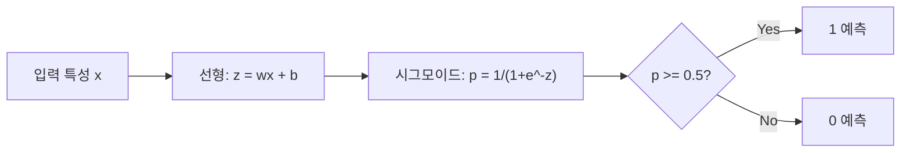
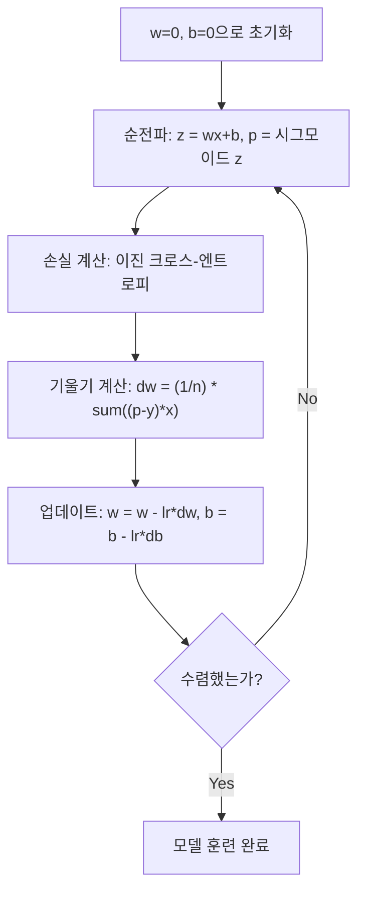

# 로지스틱 회귀(Logistic Regression)

> 로지스틱 회귀는 직선 형태의 선을 S-커브로 구부려 확률 기반으로 예/아니오 질문에 답합니다.

**유형:** 구축(Build)
**언어:** Python
**사전 요구 사항:** Phase 2 Lesson 1-2 (ML이란, 선형 회귀(Linear Regression))
**소요 시간:** ~90분

## 학습 목표

- 시그모이드(sigmoid) 함수와 이진 크로스엔트로피(binary cross-entropy) 손실을 사용하여 로지스틱 회귀(logistic regression)를 처음부터 구현
- 이진 분류(binary classification)를 위한 정밀도(precision), 재현율(recall), F1 점수(F1 score), 혼동 행렬(confusion matrix) 계산 및 해석
- 분류(classification)에서 MSE(평균 제곱 오차, Mean Squared Error)가 실패하는 이유와 이진 크로스엔트로피가 볼록한 비용 표면(convex cost surface)을 생성하는 이유 설명
- 다중 클래스 분류(multi-class classification)를 위한 소프트맥스 회귀(softmax regression) 모델 구축 및 임계값 조정(threshold tuning) 트레이드오프 평가

## 문제 정의

종양의 크기를 기반으로 악성인지 양성인지 예측하려고 합니다. 선형 회귀를 시도해 보았지만, 0.3, 1.7, -0.5와 같은 숫자를 출력합니다. 이 값들은 무엇을 의미할까요? 1.7은 "매우 악성"일까요? -0.5는 "매우 양성"일까요? 선형 회귀는 무제한 범위의 숫자를 출력합니다. 반면 분류는 0과 1 사이의 확률 값과 명확한 결정(예/아니오)이 필요합니다.

로지스틱 회귀는 이 문제를 해결합니다. 동일한 선형 결합(wx + b)을 시그모이드(sigmoid) 함수에 통과시켜 어떤 숫자든 (0, 1) 범위로 압축합니다. 출력은 확률 값이며, 임계값(일반적으로 0.5)을 설정해 최종 결정을 내립니다.

이것은 실무에서 가장 널리 사용되는 알고리즘 중 하나입니다. 이름과는 달리 로지스틱 회귀는 회귀 알고리즘이 아닌 분류 알고리즘입니다. 이름은 사용되는 로지스틱(시그모이드) 함수에서 유래했습니다.

## 개념

### 분류 문제에서 선형 회귀가 실패하는 이유

공부 시간을 기반으로 합격/불합격(1/0)을 예측한다고 상상해 보자. 선형 회귀는 데이터를 통과하는 직선을 맞춘다:

```
시간:  1   2   3   4   5   6   7   8   9   10
실제: 0   0   0   0   1   1   1   1   1   1
```

선형 회귀는 시간 1에서 -0.2, 시간 10에서 1.3과 같은 예측값을 생성할 수 있다. 이 값들은 확률이 아니다. 0 미만 또는 1 초과로 간다. 더 나쁜 것은, 이상치(예: 50시간 공부한 사람) 하나가 전체 직선을 끌어당겨 모든 사람의 예측을 바꿀 수 있다는 점이다.

분류에는 다음 조건을 만족하는 함수가 필요하다:
- 0과 1 사이의 값(확률) 출력
- 급격한 전환(결정 경계) 생성
- 경계에서 멀리 떨어진 이상치에 의해 왜곡되지 않음

### 시그모이드 함수

시그모이드 함수는 정확히 이 역할을 한다:

```
sigmoid(z) = 1 / (1 + e^(-z))
```

특징:
- z가 큰 양수일 때 sigmoid(z)는 1에 가까워짐
- z가 큰 음수일 때 sigmoid(z)는 0에 가까워짐
- z = 0일 때 sigmoid(z) = 0.5
- 출력은 항상 0과 1 사이
- 함수는 모든 곳에서 매끄럽고 미분 가능

도함수는 편리한 형태를 가진다: sigmoid'(z) = sigmoid(z) * (1 - sigmoid(z)). 이는 기울기 계산을 효율적으로 만든다.

### 로지스틱 회귀 = 선형 모델 + 시그모이드

모델은 z = wx + b를 계산한 후(선형 회귀와 동일) 시그모이드를 적용한다:



출력 p는 P(y=1 | x)로 해석되며, 입력이 클래스 1에 속할 확률이다. 결정 경계는 wx + b = 0인 지점이며, 이때 시그모이드 출력은 정확히 0.5가 된다.

### 이진 크로스-엔트로피 손실

로지스틱 회귀에는 MSE(평균 제곱 오차)를 사용할 수 없다. 시그모이드와 MSE 조합은 많은 지역 최소값을 가진 비볼록 비용 표면을 만든다. 대신 이진 크로스-엔트로피(로그 손실)를 사용한다:

```
손실 = -(1/n) * sum(y * log(p) + (1-y) * log(1-p))
```

이 공식이 작동하는 이유:
- y=1이고 p가 1에 가까울 때: log(1) = 0이므로 손실은 0에 가까움(정답, 낮은 비용)
- y=1이고 p가 0에 가까울 때: log(0)은 음의 무한대로 발산하므로 손실은 매우 큼(오답, 높은 비용)
- y=0이고 p가 0에 가까울 때: log(1) = 0이므로 손실은 0에 가까움(정답, 낮은 비용)
- y=0이고 p가 1에 가까울 때: log(0)은 음의 무한대로 발산하므로 손실은 매우 큼(오답, 높은 비용)

이 손실 함수는 로지스틱 회귀에 대해 볼록하며, 단일 전역 최소값을 보장한다.

### 로지스틱 회귀의 경사 하강법

시그모이드와 이진 크로스-엔트로피의 기울기는 깔끔한 형태를 가진다:

```
dL/dw = (1/n) * sum((p - y) * x)
dL/db = (1/n) * sum(p - y)
```

이들은 선형 회귀 기울기와 동일하게 보인다. 차이점은 p = sigmoid(wx + b)라는 점이다. 시그모이드가 비선형성을 도입하지만, 기울기 업데이트 규칙은 동일하다.



### 결정 경계

2D 입력(두 특성)의 경우, 결정 경계는 다음 방정식을 만족하는 선이다:

```
w1*x1 + w2*x2 + b = 0
```

한쪽 면의 점들은 1로 분류되고, 다른 쪽 면의 점들은 0으로 분류된다. 로지스틱 회귀는 항상 선형 결정 경계를 생성한다. 곡선 형태의 경계가 필요하면 다항식 특성을 추가하거나 비선형 모델을 사용해야 한다.

### 소프트맥스를 이용한 다중 클래스 분류

이진 로지스틱 회귀는 두 클래스를 처리한다. k개의 클래스에 대해서는 소프트맥스 함수를 사용한다:

```
softmax(z_i) = e^(z_i) / sum(e^(z_j) for all j)
```

각 클래스는 고유한 가중치 벡터를 가진다. 모델은 각 클래스에 대한 점수 z_i를 계산한 후, 소프트맥스는 점수를 합이 1인 확률로 변환한다. 예측 클래스는 가장 높은 확률을 가진 클래스이다.

손실 함수는 범주형 크로스-엔트로피가 된다:

```
손실 = -(1/n) * sum(sum(y_k * log(p_k)))
```

여기서 y_k는 참 클래스에 대해 1이고 나머지 클래스에 대해 0이다(원-핫 인코딩).

### 평가 지표

정확도만으로는 충분하지 않다. 95%가 음성, 5%가 양성인 데이터셋에서 항상 음성을 예측하는 모델은 95% 정확도를 가지지만 쓸모가 없다.

**혼동 행렬**:

| | 예측 양성 | 예측 음성 |
|---|---|---|
| 실제 양성 | 진양성(TP) | 위음성(FN) |
| 실제 음성 | 위양성(FP) | 진음성(TN) |

**정밀도**: 예측한 양성 중 실제 양성의 비율
```
정밀도 = TP / (TP + FP)
```

**재현율**(민감도): 실제 양성 중 올바르게 예측한 비율
```
재현율 = TP / (TP + FN)
```

**F1 점수**: 정밀도와 재현율의 조화 평균. 두 지표를 균형 있게 고려
```
F1 = 2 * (정밀도 * 재현율) / (정밀도 + 재현율)
```

우선순위:
- **정밀도**: 위양성이 비용일 때(스팸 필터, 정상 이메일을 차단하고 싶지 않음)
- **재현율**: 위음성이 비용일 때(암 검진, 종양을 놓치고 싶지 않음)
- **F1**: 단일 균형 지표가 필요할 때

## 구축

### 단계 1: 시그모이드 함수 및 데이터 생성

```python
import random
import math

def sigmoid(z):
    z = max(-500, min(500, z))
    return 1.0 / (1.0 + math.exp(-z))


random.seed(42)
N = 200
X = []
y = []

for _ in range(N // 2):
    X.append([random.gauss(2, 1), random.gauss(2, 1)])
    y.append(0)

for _ in range(N // 2):
    X.append([random.gauss(5, 1), random.gauss(5, 1)])
    y.append(1)

combined = list(zip(X, y))
random.shuffle(combined)
X, y = zip(*combined)
X = list(X)
y = list(y)

print(f"생성된 샘플 {N}개 (2개 클래스, 2개 특성)")
print(f"클래스 0 중심: (2, 2), 클래스 1 중심: (5, 5)")
print(f"처음 5개 샘플:")
for i in range(5):
    print(f"  특성: [{X[i][0]:.2f}, {X[i][1]:.2f}], 라벨: {y[i]}")
```

### 단계 2: 로지스틱 회귀 구현

```python
class LogisticRegression:
    def __init__(self, n_features, learning_rate=0.01):
        self.weights = [0.0] * n_features
        self.bias = 0.0
        self.lr = learning_rate
        self.loss_history = []

    def predict_proba(self, x):
        z = sum(w * xi for w, xi in zip(self.weights, x)) + self.bias
        return sigmoid(z)

    def predict(self, x, threshold=0.5):
        return 1 if self.predict_proba(x) >= threshold else 0

    def compute_loss(self, X, y):
        n = len(y)
        total = 0.0
        for i in range(n):
            p = self.predict_proba(X[i])
            p = max(1e-15, min(1 - 1e-15, p))
            total += y[i] * math.log(p) + (1 - y[i]) * math.log(1 - p)
        return -total / n

    def fit(self, X, y, epochs=1000, print_every=200):
        n = len(y)
        n_features = len(X[0])
        for epoch in range(epochs):
            dw = [0.0] * n_features
            db = 0.0
            for i in range(n):
                p = self.predict_proba(X[i])
                error = p - y[i]
                for j in range(n_features):
                    dw[j] += error * X[i][j]
                db += error
            for j in range(n_features):
                self.weights[j] -= self.lr * (dw[j] / n)
            self.bias -= self.lr * (db / n)
            loss = self.compute_loss(X, y)
            self.loss_history.append(loss)
            if epoch % print_every == 0:
                print(f"  에포크 {epoch:4d} | 손실: {loss:.4f} | 가중치: [{self.weights[0]:.3f}, {self.weights[1]:.3f}] | 편향: {self.bias:.3f}")
        return self

    def accuracy(self, X, y):
        correct = sum(1 for i in range(len(y)) if self.predict(X[i]) == y[i])
        return correct / len(y)


split = int(0.8 * N)
X_train, X_test = X[:split], X[split:]
y_train, y_test = y[:split], y[split:]

print("\n=== 로지스틱 회귀 학습 ===")
model = LogisticRegression(n_features=2, learning_rate=0.1)
model.fit(X_train, y_train, epochs=1000, print_every=200)

print(f"\n학습 정확도: {model.accuracy(X_train, y_train):.4f}")
print(f"테스트 정확도:  {model.accuracy(X_test, y_test):.4f}")
print(f"가중치: [{model.weights[0]:.4f}, {model.weights[1]:.4f}]")
print(f"편향: {model.bias:.4f}")
```

### 단계 3: 혼동 행렬 및 메트릭 구현

```python
class ClassificationMetrics:
    def __init__(self, y_true, y_pred):
        self.tp = sum(1 for t, p in zip(y_true, y_pred) if t == 1 and p == 1)
        self.tn = sum(1 for t, p in zip(y_true, y_pred) if t == 0 and p == 0)
        self.fp = sum(1 for t, p in zip(y_true, y_pred) if t == 0 and p == 1)
        self.fn = sum(1 for t, p in zip(y_true, y_pred) if t == 1 and p == 0)

    def accuracy(self):
        total = self.tp + self.tn + self.fp + self.fn
        return (self.tp + self.tn) / total if total > 0 else 0

    def precision(self):
        denom = self.tp + self.fp
        return self.tp / denom if denom > 0 else 0

    def recall(self):
        denom = self.tp + self.fn
        return self.tp / denom if denom > 0 else 0

    def f1(self):
        p = self.precision()
        r = self.recall()
        return 2 * p * r / (p + r) if (p + r) > 0 else 0

    def print_confusion_matrix(self):
        print(f"\n  혼동 행렬:")
        print(f"                  예측")
        print(f"                  양성   음성")
        print(f"  실제 양성     {self.tp:4d}  {self.fn:4d}")
        print(f"  실제 음성     {self.fp:4d}  {self.tn:4d}")

    def print_report(self):
        self.print_confusion_matrix()
        print(f"\n  정확도:  {self.accuracy():.4f}")
        print(f"  정밀도: {self.precision():.4f}")
        print(f"  재현율:    {self.recall():.4f}")
        print(f"  F1 점수:  {self.f1():.4f}")


y_pred_test = [model.predict(x) for x in X_test]
print("\n=== 분류 보고서 (테스트 세트) ===")
metrics = ClassificationMetrics(y_test, y_pred_test)
metrics.print_report()
```

### 단계 4: 결정 경계 분석

```python
print("\n=== 결정 경계 ===")
w1, w2 = model.weights
b = model.bias
print(f"결정 경계: {w1:.4f}*x1 + {w2:.4f}*x2 + {b:.4f} = 0")
if abs(w2) > 1e-10:
    print(f"x2에 대해 풀이:     x2 = {-w1/w2:.4f}*x1 + {-b/w2:.4f}")

print("\n경계 근처 샘플 예측:")
test_points = [
    [3.0, 3.0],
    [3.5, 3.5],
    [4.0, 4.0],
    [2.5, 2.5],
    [5.0, 5.0],
]
for point in test_points:
    prob = model.predict_proba(point)
    pred = model.predict(point)
    print(f"  [{point[0]}, {point[1]}] -> 확률={prob:.4f}, 클래스={pred}")
```

### 단계 5: 소프트맥스 다중 클래스 분류

```python
class SoftmaxRegression:
    def __init__(self, n_features, n_classes, learning_rate=0.01):
        self.n_features = n_features
        self.n_classes = n_classes
        self.lr = learning_rate
        self.weights = [[0.0] * n_features for _ in range(n_classes)]
        self.biases = [0.0] * n_classes

    def softmax(self, scores):
        max_score = max(scores)
        exp_scores = [math.exp(s - max_score) for s in scores]
        total = sum(exp_scores)
        return [e / total for e in exp_scores]

    def predict_proba(self, x):
        scores = [
            sum(self.weights[k][j] * x[j] for j in range(self.n_features)) + self.biases[k]
            for k in range(self.n_classes)
        ]
        return self.softmax(scores)

    def predict(self, x):
        probs = self.predict_proba(x)
        return probs.index(max(probs))

    def fit(self, X, y, epochs=1000, print_every=200):
        n = len(y)
        for epoch in range(epochs):
            grad_w = [[0.0] * self.n_features for _ in range(self.n_classes)]
            grad_b = [0.0] * self.n_classes
            total_loss = 0.0
            for i in range(n):
                probs = self.predict_proba(X[i])
                for k in range(self.n_classes):
                    target = 1.0 if y[i] == k else 0.0
                    error = probs[k] - target
                    for j in range(self.n_features):
                        grad_w[k][j] += error * X[i][j]
                    grad_b[k] += error
                true_prob = max(probs[y[i]], 1e-15)
                total_loss -= math.log(true_prob)
            for k in range(self.n_classes):
                for j in range(self.n_features):
                    self.weights[k][j] -= self.lr * (grad_w[k][j] / n)
                self.biases[k] -= self.lr * (grad_b[k] / n)
            if epoch % print_every == 0:
                print(f"  에포크 {epoch:4d} | 손실: {total_loss / n:.4f}")
        return self

    def accuracy(self, X, y):
        correct = sum(1 for i in range(len(y)) if self.predict(X[i]) == y[i])
        return correct / len(y)


random.seed(42)
X_3class = []
y_3class = []

centers = [(1, 1), (5, 1), (3, 5)]
for label, (cx, cy) in enumerate(centers):
    for _ in range(50):
        X_3class.append([random.gauss(cx, 0.8), random.gauss(cy, 0.8)])
        y_3class.append(label)

combined = list(zip(X_3class, y_3class))
random.shuffle(combined)
X_3class, y_3class = zip(*combined)
X_3class = list(X_3class)
y_3class = list(y_3class)

split_3 = int(0.8 * len(X_3class))
X_train_3 = X_3class[:split_3]
y_train_3 = y_3class[:split_3]
X_test_3 = X_3class[split_3:]
y_test_3 = y_3class[split_3:]

print("\n=== 다중 클래스 소프트맥스 회귀 (3개 클래스) ===")
softmax_model = SoftmaxRegression(n_features=2, n_classes=3, learning_rate=0.1)
softmax_model.fit(X_train_3, y_train_3, epochs=1000, print_every=200)
print(f"\n학습 정확도: {softmax_model.accuracy(X_train_3, y_train_3):.4f}")
print(f"테스트 정확도:  {softmax_model.accuracy(X_test_3, y_test_3):.4f}")

print("\n샘플 예측:")
for i in range(5):
    probs = softmax_model.predict_proba(X_test_3[i])
    pred = softmax_model.predict(X_test_3[i])
    print(f"  실제: {y_test_3[i]}, 예측: {pred}, 확률: [{', '.join(f'{p:.3f}' for p in probs)}]")
```

### 단계 6: 임계값 조정

```python
print("\n=== 임계값 조정 ===")
print("기본 임계값: 0.5. 임계값 조정은 정밀도와 재현율을 교환합니다.\n")

thresholds = [0.3, 0.4, 0.5, 0.6, 0.7]
print(f"{'임계값':>10} {'정확도':>10} {'정밀도':>10} {'재현율':>10} {'F1':>10}")
print("-" * 52)

for t in thresholds:
    y_pred_t = [1 if model.predict_proba(x) >= t else 0 for x in X_test]
    m = ClassificationMetrics(y_test, y_pred_t)
    print(f"{t:>10.1f} {m.accuracy():>10.4f} {m.precision():>10.4f} {m.recall():>10.4f} {m.f1():>10.4f}")
```

## 사용 방법

이제 scikit-learn을 사용한 동일한 작업을 살펴보겠습니다.

```python
from sklearn.linear_model import LogisticRegression as SklearnLR
from sklearn.metrics import accuracy_score, precision_score, recall_score, f1_score
from sklearn.metrics import confusion_matrix, classification_report
from sklearn.model_selection import train_test_split
from sklearn.preprocessing import StandardScaler
import numpy as np

np.random.seed(42)
X_0 = np.random.randn(100, 2) + [2, 2]
X_1 = np.random.randn(100, 2) + [5, 5]
X_sk = np.vstack([X_0, X_1])
y_sk = np.array([0] * 100 + [1] * 100)

X_tr, X_te, y_tr, y_te = train_test_split(X_sk, y_sk, test_size=0.2, random_state=42)

scaler = StandardScaler()
X_tr_sc = scaler.fit_transform(X_tr)
X_te_sc = scaler.transform(X_te)

lr = SklearnLR()
lr.fit(X_tr_sc, y_tr)
y_pred = lr.predict(X_te_sc)

print("=== Scikit-learn 로지스틱 회귀 ===")
print(f"정확도:  {accuracy_score(y_te, y_pred):.4f}")
print(f"정밀도: {precision_score(y_te, y_pred):.4f}")
print(f"재현율:    {recall_score(y_te, y_pred):.4f}")
print(f"F1:        {f1_score(y_te, y_pred):.4f}")
print(f"\n혼동 행렬:\n{confusion_matrix(y_te, y_pred)}")
print(f"\n분류 보고서:\n{classification_report(y_te, y_pred)}")
```

직접 구현한 버전은 동일한 결정 경계와 평가 지표를 생성합니다. Scikit-learn은 솔버 옵션(liblinear, lbfgs, saga), 자동 정규화, 다중 클래스 전략(one-vs-rest, multinomial), 수치적 안정성 최적화 등을 추가로 제공합니다.

## Ship It

이 레슨은 다음을 생성합니다:
- `code/logistic_regression.py` - 메트릭이 포함된 처음부터 구현하는 로지스틱 회귀(logistic regression)

## 연습 문제

1. 선형 분리가 불가능한 데이터셋(예: 두 개의 동심원)을 생성하세요. 로지스틱 회귀를 훈련시키고 실패를 관찰하세요. 그런 다음 다항식 특성(x1^2, x2^2, x1*x2)을 추가하고 다시 훈련하세요. 정확도가 향상됨을 보여주세요.
2. 3-클래스 소프트맥스 모델을 위한 다중 클래스 혼동 행렬을 구현하세요. 클래스별 정밀도(precision)와 재현율(recall)을 계산하세요. 어떤 클래스가 분류하기 가장 어려운지 확인하세요?
3. ROC 곡선을 처음부터 구축하세요. 0부터 1까지 100개의 임계값(threshold)에 대해 참 양성률(true positive rate)과 거짓 양성률(false positive rate)을 계산하세요. 사다리꼴 법칙(trapezoidal rule)을 사용하여 AUC(곡선 아래 면적)를 계산하세요.

## 주요 용어

| 용어 | 사람들이 말하는 표현 | 실제 의미 |
|------|----------------|----------------------|
| 로지스틱 회귀(Logistic regression) | "분류를 위한 회귀" | 시그모이드 함수를 뒤따르는 선형 모델로 클래스 확률을 출력 |
| 시그모이드 함수(Sigmoid function) | "S-곡선" | 모든 실수를 (0, 1) 범위로 매핑하는 함수 1/(1+e^(-z)) |
| 이진 교차 엔트로피(Binary cross-entropy) | "로그 손실(Log loss)" | -[y*log(p) + (1-y)*log(1-p)] 손실 함수로 확신하는 오답에 심한 페널티 부여 |
| 결정 경계(Decision boundary) | "구분선" | 모델 출력 확률이 0.5가 되는 표면으로 예측 클래스를 분리 |
| 소프트맥스(Softmax) | "다중 클래스 시그모이드" | 점수 벡터를 합이 1인 확률로 변환하는 함수 |
| 정밀도(Precision) | "선택된 것 중 관련 있는 비율" | TP / (TP + FP), 양성 예측 중 실제 양성인 비율 |
| 재현율(Recall) | "관련 있는 것 중 선택된 비율" | TP / (TP + FN), 실제 양성 중 모델이 올바르게 식별한 비율 |
| F1 점수(F1 score) | "균형 정확도" | 정밀도와 재현율의 조화 평균: 2*P*R / (P+R) |
| 혼동 행렬(Confusion matrix) | "오류 분석표" | 각 클래스 쌍에 대한 TP, TN, FP, FN 카운트를 보여주는 표 |
| 임계값(Threshold) | "기준값" | 모델이 클래스 1로 예측하는 확률 값 (기본값 0.5, 조정 가능) |
| 원-핫 인코딩(One-hot encoding) | "범주형 변수를 위한 이진 열" | 클래스 k를 k 위치에 1이 있고 나머지는 0인 벡터로 표현 |
| 범주형 교차 엔트로피(Categorical cross-entropy) | "다중 클래스 로그 손실" | 원-핫 인코딩 라벨을 사용하는 k 클래스용 이진 교차 엔트로피 확장 버전 |