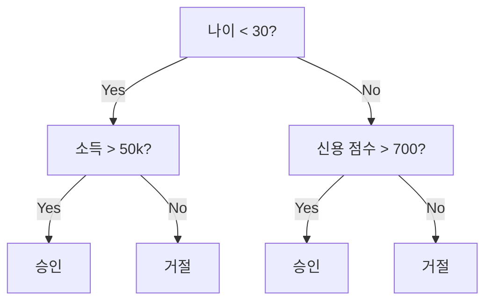
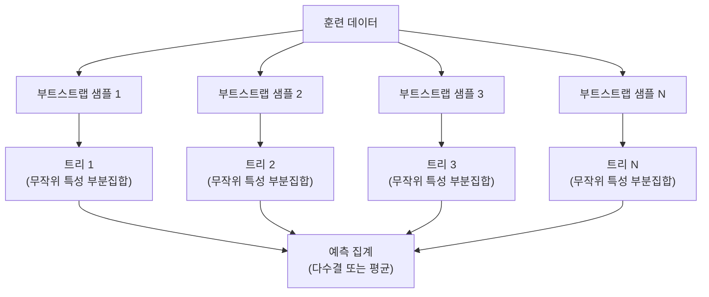

# 결정 트리(Decision Trees)와 랜덤 포레스트(Random Forests)

> 결정 트리는 단지 플로우차트일 뿐입니다. 하지만 그 숲은 ML에서 가장 강력한 도구 중 하나입니다.

**유형:** Build  
**언어:** Python  
**선수 지식:** Phase 1 (레슨 09 정보 이론, 06 확률)  
**소요 시간:** ~90분

## 학습 목표

- 지니 불순도(Gini impurity), 엔트로피(entropy), 정보 획득(information gain) 계산을 구현하여 최적의 결정 트리 분할 찾기
- 사전 가지치기 제어(최대 깊이(max depth), 최소 샘플 수(min samples))를 사용하여 결정 트리 분류기(decision tree classifier)를 처음부터 구축하기
- 부트스트랩 샘플링(bootstrap sampling)과 특성 무작위화(feature randomization)를 사용하여 랜덤 포레스트(random forest)를 구성하고, 분산(variance)을 줄이는 이유 설명하기
- MDI 특성 중요도(MDI feature importance)와 순열 중요도(permutation importance)를 비교하고, MDI가 편향(bias)되는 경우 식별하기

## 문제 정의

당신은 표 형식의 데이터를 가지고 있습니다. 행은 샘플, 열은 특성(feature)이며, 예측하고자 하는 목표(target) 열이 있습니다. 신경망 모델을 적용할 수도 있지만, 표 형식 데이터에서는 트리 기반 모델(결정 트리, 랜덤 포레스트, 그래디언트 부스팅 트리)이 딥러닝보다 일관되게 우수한 성능을 보입니다. 구조화된 데이터를 다루는 캐글(Kaggle) 경연에서는 트랜스포머가 아닌 XGBoost와 LightGBM이 주로 사용됩니다.

왜 그럴까요? 트리 기반 모델은 전처리 없이도 혼합 특성 유형(숫자형 및 범주형)을 처리할 수 있습니다. 특성 공학 없이도 비선형 관계를 다룰 수 있으며, 해석 가능성이 높습니다. 트리를 직접 살펴보면 예측이 왜 발생했는지 정확히 확인할 수 있습니다. 또한 여러 트리의 평균을 내는 랜덤 포레스트는 중간 규모 데이터셋에서 과적합에 매우 강합니다.

이 강의에서는 재귀적 분할을 이용해 결정 트리를 처음부터 구축하고, 이를 기반으로 랜덤 포레스트를 구현합니다. 분할 기준(지니 불순도(Gini impurity), 엔트로피(entropy), 정보 획득(information gain))의 수학적 원리를 구현하고, 약한 학습기(weak learner)의 앙상블이 어떻게 강력한 학습기가 되는지 이해하게 될 것입니다.

## 개념

### 결정 트리의 작동 방식

결정 트리는 예/아니오 질문을 연속적으로 하여 특성 공간을 직사각형 영역으로 분할합니다.



각 내부 노드는 특성을 임계값과 비교합니다. 각 리프 노드는 예측을 수행합니다. 새로운 데이터 포인트를 분류하려면 루트 노드에서 시작하여 리프 노드에 도달할 때까지 분기를 따라갑니다.

트리는 각 노드에서 데이터를 가장 잘 분리하는 특성과 임계값을 선택하여 위에서 아래로 구축됩니다. "가장 좋은" 분할은 분할 기준에 의해 정의됩니다.

### 분할 기준: 불순도 측정

각 노드에는 샘플 집합이 있습니다. 우리는 이들을 분할하여 결과 자식 노드가 가능한 한 "순수"하도록 만들고자 합니다. 즉, 각 자식 노드에 하나의 클래스가 대부분 포함되도록 합니다.

**지니 불순도(Gini impurity)**는 해당 노드의 클래스 분포에 따라 무작위로 선택된 샘플이 잘못 분류될 확률을 측정합니다.

```
Gini(S) = 1 - sum(p_k^2)

여기서 p_k는 집합 S에서 클래스 k의 비율입니다.
```

순수한 노드(모두 한 클래스)의 경우 지니 = 0입니다. 50/50 이진 분할의 경우 지니 = 0.5입니다. 낮을수록 좋습니다.

```
예시: 고양이 6마리, 개 4마리

Gini = 1 - (0.6^2 + 0.4^2) = 1 - (0.36 + 0.16) = 0.48
```

**엔트로피(Entropy)**는 노드의 정보량(무질서도)을 측정합니다. Phase 1 Lesson 09에서 다룹니다.

```
Entropy(S) = -sum(p_k * log2(p_k))
```

순수한 노드의 경우 엔트로피 = 0입니다. 50/50 이진 분할의 경우 엔트로피 = 1.0입니다. 낮을수록 좋습니다.

```
예시: 고양이 6마리, 개 4마리

Entropy = -(0.6 * log2(0.6) + 0.4 * log2(0.4))
        = -(0.6 * -0.737 + 0.4 * -1.322)
        = 0.442 + 0.529
        = 0.971 비트
```

**정보 이득(Information gain)**은 분할 후 불순도(엔트로피 또는 지니) 감소량입니다.

```
IG(S, feature, threshold) = Impurity(S) - weighted_avg(Impurity(S_left), Impurity(S_right))

여기서 가중치는 각 자식의 샘플 비율입니다.
```

탐욕 알고리즘(greedy algorithm)은 각 노드에서 모든 특성과 가능한 모든 임계값을 시도합니다. 정보 이득을 최대화하는 (특성, 임계값) 쌍을 선택합니다.

### 분할 작동 방식

현재 노드에 n개의 특성과 m개의 샘플이 있는 데이터셋의 경우:

1. 각 특성 j (j = 1 to n)에 대해:
   - 특성 j로 샘플을 정렬합니다.
   - 연속된 서로 다른 값 사이의 모든 중간값을 임계값으로 시도합니다.
   - 각 임계값에 대한 정보 이득을 계산합니다.
2. 가장 높은 정보 이득을 가진 특성과 임계값을 선택합니다.
3. 데이터를 왼쪽(특성 <= 임계값)과 오른쪽(특성 > 임계값)으로 분할합니다.
4. 각 자식에 대해 재귀적으로 반복합니다.

이 탐욕적 접근은 전역적으로 최적의 트리를 보장하지 않습니다. 최적의 트리를 찾는 것은 NP-난해 문제입니다. 하지만 탐욕적 분할은 실제로 잘 작동합니다.

### 중지 조건

중지 조건이 없으면 트리는 모든 리프가 순수해질 때까지(리프당 하나의 샘플) 성장합니다. 이는 훈련 데이터를 완벽하게 암기하지만 일반화는 매우 나쁩니다.

**사전 가지치기(Pre-pruning)**는 트리가 완전히 성장하기 전에 중지합니다:
- 최대 깊이: 트리가 설정된 깊이에 도달하면 분할 중지
- 리프당 최소 샘플 수: 노드에 k개 미만의 샘플이 있으면 중지
- 최소 정보 이득: 최상의 분할이 임계값보다 불순도를 덜 개선하면 중지
- 최대 리프 노드 수: 총 리프 수 제한

**사후 가지치기(Post-pruning)**는 전체 트리를 성장시킨 후 다듬습니다:
- 비용-복잡도 가지치기(scikit-learn에서 사용): 리프 수에 비례하는 페널티 추가. 페널티를 증가시켜 더 작은 트리 생성
- 감소 오차 가지치기: 검증 오차가 증가하지 않으면 서브트리 제거

사전 가지치기는 더 간단하고 빠릅니다. 사후 가지치기는 유용한 추가 분할을 조기에 중단하지 않기 때문에 종종 더 나은 트리를 생성합니다.

### 회귀를 위한 결정 트리

회귀의 경우 리프 예측은 해당 리프의 목표 값 평균입니다. 분할 기준도 변경됩니다:

**분산 감소(Variance reduction)**가 정보 이득을 대체합니다:

```
VR(S, feature, threshold) = Var(S) - weighted_avg(Var(S_left), Var(S_right))
```

분산을 가장 많이 줄이는 분할을 선택합니다. 트리는 입력 공간을 영역으로 분할하고 각 영역에서 상수(평균)를 예측합니다.

### 랜덤 포레스트: 앙상블의 힘

단일 결정 트리는 분산이 높습니다. 데이터의 작은 변화가 완전히 다른 트리를 생성할 수 있습니다. 랜덤 포레스트는 많은 트리의 평균을 내어 이를 해결합니다.



두 가지 무작위성이 트리를 다양하게 만듭니다:

**배깅(Bagging, 부트스트랩 집계):** 각 트리는 훈련 데이터에서 중복을 허용한 무작위 샘플인 부트스트랩 샘플로 훈련됩니다. 각 부트스트랩에는 원본 샘플의 약 63%가 포함되며(나머지는 검증용 아웃오브백 샘플), 이를 검증에 사용할 수 있습니다.

**특성 무작위화:** 각 분할에서 무작위 특성 부분집합만 고려합니다. 분류의 경우 기본값은 sqrt(n_features)입니다. 회귀의 경우 n_features/3입니다. 이는 모든 트리가 동일한 주요 특성에 분할되는 것을 방지합니다.

핵심 통찰: 상관관계가 낮은 많은 트리를 평균화하면 분산을 줄이면서 편향을 증가시키지 않습니다. 개별 트리는 평범할 수 있지만 앙상블은 강력합니다.

### 특성 중요도

랜덤 포레스트는 자연스럽게 특성 중요도 점수를 제공합니다. 가장 일반적인 방법:

**불순도 감소 평균(MDI, Mean Decrease in Impurity):** 각 특성에 대해 모든 트리와 해당 특성이 사용된 모든 노드에서 불순도 감소량을 합산합니다. 초기 분할에서 더 큰 불순도 감소를 생성하는 특성이 더 중요합니다.

```
importance(feature_j) = 모든 노드에서 특성_j가 사용된 경우 합산:
    (노드 샘플 수 / 전체 샘플 수) * 불순도 감소량
```

이 방법은 빠르지만(고속 훈련 중 계산) 고차원 특성과 많은 분할 지점이 있는 특성에 편향될 수 있습니다.

**순열 중요도(Permutation importance)**는 대안입니다: 하나의 특성 값을 섞고 모델의 정확도가 얼마나 떨어지는지 측정합니다. 더 신뢰할 수 있지만 느립니다.

### 트리가 신경망을 능가하는 경우

트리 및 포레스트는 표 형식 데이터에서 신경망을 압도합니다. 여러 이유:

| 요소 | 트리 | 신경망 |
|------|------|--------|
| 혼합 유형(숫자 + 범주형) | 기본 지원 | 인코딩 필요 |
| 소규모 데이터셋(< 10k 행) | 잘 작동 | 과적합 |
| 특성 상호작용 | 분할로 발견 | 아키텍처 설계 필요 |
| 해석 가능성 | 완전한 투명성 | 블랙박스 |
| 훈련 시간 | 수분 | 수시간 |
| 하이퍼파라미터 민감도 | 낮음 | 높음 |

신경망은 데이터에 공간적 또는 순차적 구조(이미지, 텍스트, 오디오)가 있을 때 우세합니다. 평면적인 특성 테이블의 경우 트리가 기본 선택입니다.

## 빌드하기

### 1단계: 지니 불순도와 엔트로피

두 분할 기준을 처음부터 구축하고 어떤 분할이 좋은지 동의하는 것을 검증합니다.

```python
import math

def gini_impurity(labels):
    n = len(labels)
    if n == 0:
        return 0.0
    counts = {}
    for label in labels:
        counts[label] = counts.get(label, 0) + 1
    return 1.0 - sum((c / n) ** 2 for c in counts.values())

def entropy(labels):
    n = len(labels)
    if n == 0:
        return 0.0
    counts = {}
    for label in labels:
        counts[label] = counts.get(label, 0) + 1
    return -sum(
        (c / n) * math.log2(c / n) for c in counts.values() if c > 0
    )
```

### 2단계: 최적의 분할 찾기

모든 특성과 모든 임계값을 시도합니다. 가장 높은 정보 이득을 반환하는 것을 반환합니다.

```python
def information_gain(parent_labels, left_labels, right_labels, criterion="gini"):
    measure = gini_impurity if criterion == "gini" else entropy
    n = len(parent_labels)
    n_left = len(left_labels)
    n_right = len(right_labels)
    if n_left == 0 or n_right == 0:
        return 0.0
    parent_impurity = measure(parent_labels)
    child_impurity = (
        (n_left / n) * measure(left_labels) +
        (n_right / n) * measure(right_labels)
    )
    return parent_impurity - child_impurity
```

### 3단계: DecisionTree 클래스 구축

재귀적 분할, 예측, 특성 중요도 추적.

```python
class DecisionTree:
    def __init__(self, max_depth=None, min_samples_split=2,
                 min_samples_leaf=1, criterion="gini",
                 max_features=None):
        self.max_depth = max_depth
        self.min_samples_split = min_samples_split
        self.min_samples_leaf = min_samples_leaf
        self.criterion = criterion
        self.max_features = max_features
        self.tree = None
        self.feature_importances_ = None

    def fit(self, X, y):
        self.n_features = len(X[0])
        self.feature_importances_ = [0.0] * self.n_features
        self.n_samples = len(X)
        self.tree = self._build(X, y, depth=0)
        total = sum(self.feature_importances_)
        if total > 0:
            self.feature_importances_ = [
                fi / total for fi in self.feature_importances_
            ]

    def predict(self, X):
        return [self._predict_one(x, self.tree) for x in X]
```

### 4단계: RandomForest 클래스 구축

부트스트랩 샘플링, 특성 무작위화, 다수결 투표.

```python
import random

class RandomForest:
    def __init__(self, n_trees=100, max_depth=None,
                 min_samples_split=2, max_features="sqrt",
                 criterion="gini"):
        self.n_trees = n_trees
        self.max_depth = max_depth
        self.min_samples_split = min_samples_split
        self.max_features = max_features
        self.criterion = criterion
        self.trees = []

    def fit(self, X, y):
        n = len(X)
        for _ in range(self.n_trees):
            indices = [random.randint(0, n - 1) for _ in range(n)]
            X_boot = [X[i] for i in indices]
            y_boot = [y[i] for i in indices]
            tree = DecisionTree(
                max_depth=self.max_depth,
                min_samples_split=self.min_samples_split,
                max_features=self.max_features,
                criterion=self.criterion,
            )
            tree.fit(X_boot, y_boot)
            self.trees.append(tree)

    def predict(self, X):
        all_preds = [tree.predict(X) for tree in self.trees]
        predictions = []
        for i in range(len(X)):
            votes = {}
            for preds in all_preds:
                v = preds[i]
                votes[v] = votes.get(v, 0) + 1
            predictions.append(max(votes, key=votes.get))
        return predictions
```

`code/trees.py`에서 모든 헬퍼 메서드가 포함된 완전한 구현을 확인하세요.

## 사용 방법

scikit-learn을 사용하면 랜덤 포레스트 훈련이 3줄로 가능합니다:

```python
from sklearn.ensemble import RandomForestClassifier
from sklearn.datasets import load_iris
from sklearn.model_selection import train_test_split

X, y = load_iris(return_X_y=True)
X_train, X_test, y_train, y_test = train_test_split(X, y, random_state=42)

rf = RandomForestClassifier(n_estimators=100, random_state=42)
rf.fit(X_train, y_train)
print(f"정확도: {rf.score(X_test, y_test):.4f}")
print(f"특성 중요도: {rf.feature_importances_}")
```

실제로 그래디언트 부스팅 트리(XGBoost, LightGBM, CatBoost)는 순차적으로 트리를 구성하며 각 트리가 이전 트리의 오류를 수정하기 때문에 랜덤 포레스트보다 성능이 우수한 경우가 많습니다. 하지만 랜덤 포레스트는 잘못 구성할 가능성이 적고 하이퍼파라미터 튜닝이 거의 필요하지 않습니다.

## Ship It

이 레슨은 `outputs/prompt-tree-interpreter.md`를 생성합니다. 이는 비즈니스 이해관계자를 위해 결정 트리 분할을 해석하는 프롬프트입니다. 훈련된 트리의 구조(깊이, 특성, 분할 임계값, 정확도)를 입력하면 모델을 평문 규칙으로 변환하고, 특성 중요도를 순위화하며, 과적합(overfitting) 또는 데이터 누수(leakage)를 식별하고, 다음 단계를 권장합니다. 코드를 읽지 못하는 사람에게 트리 기반 모델을 설명해야 할 때마다 사용하세요.

## 연습 문제

1. 3개의 클래스를 가진 2D 데이터셋에 단일 결정 트리(decision tree)를 학습시켜 보세요. 분할(split)을 수동으로 추적하고 직사각형 형태의 결정 경계(decision boundaries)를 그려보세요. max_depth=2와 max_depth=10일 때 경계를 비교해 보세요.

2. 회귀 트리(regression tree)를 위한 분산 감소(variance reduction) 분할 기준을 구현해 보세요. 200개 데이터 포인트에 대해 y = sin(x) + noise를 생성하고 회귀 트리를 학습시켜 보세요. 트리의 조각별 상수(piecewise-constant) 예측값을 실제 곡선과 함께 플롯으로 그려보세요.

3. 1, 5, 10, 50, 200개의 트리를 가진 랜덤 포레스트(random forest)를 구축해 보세요. 트리 개수에 따른 학습 정확도(training accuracy)와 테스트 정확도(test accuracy)를 플롯으로 그려보세요. 테스트 정확도는 정체되지만 감소하지 않는다는 점(과적합 저항)을 관찰해 보세요.

4. 5개의 서로 다른 데이터셋에서 지니 불순도(Gini impurity)와 엔트로피(entropy) 분할 기준을 비교해 보세요. 정확도와 트리 깊이를 측정해 보세요. 대부분의 경우 거의 동일한 결과가 나옵니다. 그 이유를 설명해 보세요.

5. 순열 중요도(permutation importance)를 구현해 보세요. 한 특성이 무작위 노이즈이지만 높은 카디널리티(high cardinality)를 가진 데이터셋에서 MDI 중요도(MDI importance)와 비교해 보세요. MDI는 노이즈 특성을 높게 평가하지만, 순열 중요도는 그렇지 않을 것입니다.

## 주요 용어

| 용어 | 사람들이 말하는 것 | 실제 의미 |
|------|----------------|----------------------|
| 결정 트리(Decision tree) | "예측을 위한 플로우차트" | if/else 분할 시퀀스를 학습하여 특징 공간을 직사각형 영역으로 분할하는 모델 |
| 지니 불순도(Gini impurity) | "노드의 혼합 정도" | 노드에서 무작위 샘플을 잘못 분류할 확률. 0 = 순수, 0.5 = 이진 최대 불순도 |
| 엔트로피(Entropy) | "노드의 무질서" | 노드의 정보량. 0 = 순수, 1.0 = 이진 최대 불확실성. 정보 이론에서 유래 |
| 정보 획득(Information gain) | "분할의 우수성" | 분할 후 불순도 감소량. 분할 선택을 위한 탐욕적 기준 |
| 사전 가지치기(Pre-pruning) | "트리를 일찍 중단" | 최대 깊이, 최소 샘플 수, 최소 획득 임계값 설정으로 트리 성장 조기 중단 |
| 사후 가지치기(Post-pruning) | "트리 성장 후 가지치기" | 전체 트리 성장 후 검증 성능 향상되지 않는 하위 트리 제거 |
| 배깅(Bagging) | "무작위 부분집합으로 학습" | 부트스트랩 집합. 각 모델을 다른 무작위 복원 샘플로 학습 |
| 랜덤 포레스트(Random forest) | "여러 트리의 집합" | 각 분할에서 무작위 특징 부분집합을 사용하는 부트스트랩 샘플로 학습된 결정 트리 앙상블 |
| 특징 중요도(MDI) | "중요한 특징" | 모든 트리와 노드에서 각 특징이 기여한 총 불순도 감소량 |
| 순열 중요도(Permutation importance) | "셔플 후 확인" | 특징 값을 무작위로 섞었을 때 정확도 하락. 노이즈 특징에 MDI보다 더 신뢰할 수 있음 |
| 분산 감소(Variance reduction) | "정보 획득의 회귀 버전" | 회귀 트리의 정보 획득 유사 개념. 목표 분산을 가장 많이 줄이는 분할 선택 |
| 부트스트랩 샘플(Bootstrap sample) | "반복 추출 무작위 샘플" | 원본 데이터셋에서 복원 추출로 얻은 무작위 샘플. 크기는 동일하지만 중복 존재 |

## 추가 자료

- [Breiman: 랜덤 포레스트(Random Forests) (2001)](https://link.springer.com/article/10.1023/A:1010933404324) - 원본 랜덤 포레스트 논문
- [Grinsztajn et al.: 왜 트리 기반 모델은 여전히 표 형식 데이터에서 딥러닝을 능가하는가? (2022)](https://arxiv.org/abs/2207.08815) - 표 형식 작업에서 트리 vs 신경망에 대한 엄밀한 비교
- [scikit-learn 결정 트리 문서](https://scikit-learn.org/stable/modules/tree.html) - 시각화 도구가 포함된 실용적인 가이드
- [XGBoost: 확장 가능한 트리 부스팅 시스템 (Chen & Guestrin, 2016)](https://arxiv.org/abs/1603.02754) - Kaggle에서 널리 사용되는 그래디언트 부스팅 논문