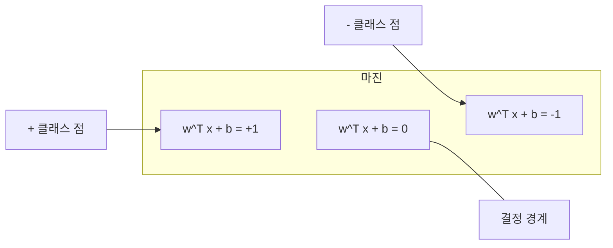
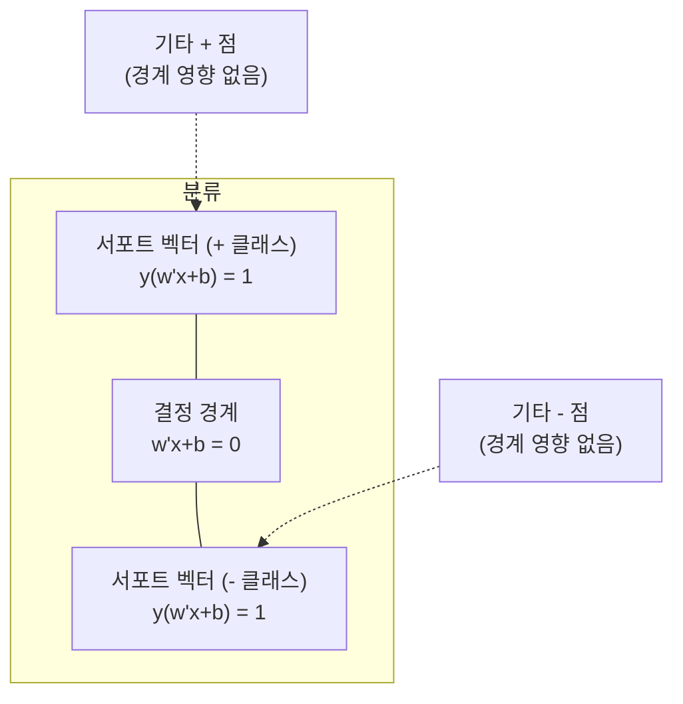
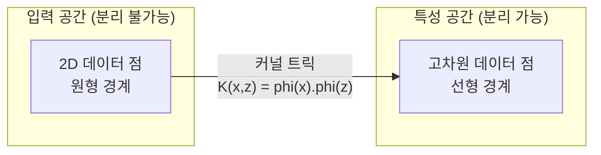

# 서포트 벡터 머신

> 두 클래스 사이의 가장 넓은 거리를 찾는 것. 이것이 전체 아이디어입니다.

**유형:** 구축
**언어:** Python
**선수 지식:** 1단계 (레슨 08 최적화, 14 노름과 거리, 18 볼록 최적화)
**소요 시간:** ~90분

## 학습 목표

- **힌지 손실(hinge loss)**과 **경사 하강법(gradient descent)**을 사용하여 **프라임럴 포뮬레이션(primal formulation)**에서 선형 SVM을 직접 구현
- **최대 마진 원리(maximum margin principle)** 설명 및 훈련된 모델에서 **서포트 벡터(support vectors)** 식별
- **선형(linear)**, **다항식(polynomial)**, **RBF 커널** 비교 및 **커널 트릭(kernel trick)**이 명시적 고차원 매핑을 피하는 방법 설명
- **C 파라미터(C parameter)**가 제어하는 **마진 폭(margin width)**과 **분류 오류(classification errors)** 간의 트레이드오프 평가

## 문제 정의

두 클래스의 데이터 포인트가 있고, 이를 분리하는 선(또는 초평면)을 그려야 합니다. 무한히 많은 선이 가능할 수 있습니다. 어떤 선을 선택해야 할까요?

가장 큰 마진(margin)을 가진 선을 선택해야 합니다. 마진은 결정 경계(decision boundary)와 각 측면의 가장 가까운 데이터 포인트 사이의 거리입니다. 더 넓은 마진은 분류기가 더 확신하며, 보이지 않는 데이터에 더 잘 일반화됨을 의미합니다.

이러한 직관은 머신러닝에서 가장 수학적으로 우아한 알고리즘 중 하나인 서포트 벡터 머신(Support Vector Machines, SVM)으로 이어집니다. SVM은 딥러닝 이전에 지배적인 분류 방법이었으며, 소규모 데이터셋, 고차원 데이터, 이론적 보장이 있는 원칙적이고 잘 이해된 모델이 필요한 문제에서 여전히 최선의 선택입니다.

SVM은 1단계(Phase 1)와 직접적으로 연결됩니다: 최적화는 볼록(convex)하며(레슨 18), 마진은 노름(norm)으로 측정되고(레슨 14), 커널 트릭(kernel trick)은 내적(dot product)을 활용하여 고차원 공간에서 계산하지 않고도 비선형 경계를 처리합니다.

## 개념

### 최대 마진 분류기

라벨이 y_i ∈ {-1, +1}이고 특성 벡터가 x_i인 선형 분리 가능 데이터가 주어졌을 때, 클래스를 분리하는 초평면 w^T x + b = 0을 찾고자 합니다.

점 x_i에서 초평면까지의 거리는 다음과 같습니다:

```
distance = |w^T x_i + b| / ||w||
```

올바르게 분류된 점에 대해: y_i * (w^T x_i + b) > 0. 마진은 초평면에서 가장 가까운 점까지의 거리의 두 배입니다.



최적화 문제:

```
최대화    2 / ||w||     (마진 너비)
제약 조건  y_i * (w^T x_i + b) >= 1  for all i
```

동등하게 (||w||^2 최소화가 최적화하기 더 쉬움):

```
최소화    (1/2) ||w||^2
제약 조건  y_i * (w^T x_i + b) >= 1  for all i
```

이것은 볼록 이차 계획법 문제입니다. 유일한 전역 해가 존재합니다. 마진 경계에 정확히 위치한 데이터 점들(y_i * (w^T x_i + b) = 1)이 서포트 벡터입니다. 이들은 결정 경계를 결정하는 유일한 점들입니다. 비-서포트 벡터 점을 이동하거나 제거해도 경계는 변하지 않습니다.

### 서포트 벡터: 중요한 소수



대부분의 훈련 점은 관련이 없습니다. 서포트 벡터만이 중요합니다. 이 때문에 SVM은 예측 시 메모리 효율적입니다: 전체 훈련 세트가 아닌 서포트 벡터만 저장하면 됩니다.

서포트 벡터의 수는 일반화 오차에 대한 상한을 제공합니다. 데이터셋 크기에 비해 서포트 벡터가 적을수록 일반화 성능이 더 좋습니다.

### 소프트 마진: C 파라미터로 노이즈 처리

실제 데이터는 거의 완벽하게 분리되지 않습니다. 일부 점은 경계의 잘못된 쪽이나 마진 내부에 있을 수 있습니다. 소프트 마진 공식은 슬랙 변수를 도입하여 위반을 허용합니다.

```
최소화    (1/2) ||w||^2 + C * sum(xi_i)
제약 조건  y_i * (w^T x_i + b) >= 1 - xi_i
            xi_i >= 0  for all i
```

슬랙 변수 xi_i는 점 i가 마진을 얼마나 위반하는지 측정합니다. C는 균형을 제어합니다:

| C 값 | 동작 |
|---------|----------|
| 큰 C | 위반을 크게 패널티. 좁은 마진, 적은 오분류. 과적합 |
| 작은 C | 더 많은 위반 허용. 넓은 마진, 많은 오분류. 과소적합 |

C는 정규화 강도이며, 역수 관계입니다. 큰 C = 적은 정규화. 작은 C = 많은 정규화.

### 힌지 손실: SVM 손실 함수

소프트 마진 SVM은 제약 없는 최적화로 다시 쓸 수 있습니다:

```
최소화    (1/2) ||w||^2 + C * sum(max(0, 1 - y_i * (w^T x_i + b)))
```

max(0, 1 - y_i * f(x_i)) 항은 힌지 손실입니다. 점이 마진 밖에서 올바르게 분류되면 0입니다. 마진 내부나 오분류일 때 선형입니다.

```
단일 점에 대한 힌지 손실:

loss
  |
  | \
  |  \
  |   \
  |    \
  |     \_______________
  |
  +-----|-----|-------->  y * f(x)
       0     1

y*f(x) >= 1 (올바르게 분류, 마진 밖)일 때 손실 0.
y*f(x) < 1일 때 선형 패널티.
```

로지스틱 손실(로지스틱 회귀)과 비교:

```
힌지:     max(0, 1 - y*f(x))          마진에서 급격한 차단
로지스틱:  log(1 + exp(-y*f(x)))        매끄럽고 절대 0이 아님
```

힌지 손실은 희소 해를 생성합니다(서포트 벡터만 0이 아닌 기여). 로지스틱 손실은 모든 데이터 점을 사용합니다. 이 때문에 SVM은 예측 시 더 메모리 효율적입니다.

### 경사 하강법으로 선형 SVM 훈련

제약된 QP를 풀지 않고 힌지 손실 + L2 정규화에 경사 하강법을 적용하여 선형 SVM을 훈련할 수 있습니다:

```
L(w, b) = (lambda/2) * ||w||^2 + (1/n) * sum(max(0, 1 - y_i * (w^T x_i + b)))
```

w에 대한 그래디언트:
  y_i * (w^T x_i + b) >= 1:  dL/dw = lambda * w
  y_i * (w^T x_i + b) < 1:   dL/dw = lambda * w - y_i * x_i

b에 대한 그래디언트:
  y_i * (w^T x_i + b) >= 1:  dL/db = 0
  y_i * (w^T x_i + b) < 1:   dL/db = -y_i
```

이것은 프라이멀 공식입니다. 에포크당 O(n * d) 시간이 소요되며, n은 샘플 수, d는 특성 수입니다. 대규모 희소 고차원 데이터(텍스트 분류)의 경우 빠릅니다.

### 듀얼 공식과 커널 트릭

SVM 문제의 라그랑주 듀얼(Phase 1 Lesson 18, KKT 조건)은 다음과 같습니다:

```
최대화    sum(alpha_i) - (1/2) * sum_ij(alpha_i * alpha_j * y_i * y_j * (x_i . x_j))
제약 조건  0 <= alpha_i <= C
            sum(alpha_i * y_i) = 0
```

듀얼은 데이터 점들 간의 내적 x_i . x_j만 포함합니다. 이것이 핵심 통찰입니다. 모든 내적을 커널 함수 K(x_i, x_j)로 대체하면 SVM은 변환을 명시적으로 계산하지 않고도 비선형 경계를 학습할 수 있습니다.

```
선형 커널:      K(x, z) = x . z
다항식 커널:  K(x, z) = (x . z + c)^d
RBF (가우시안):     K(x, z) = exp(-gamma * ||x - z||^2)
```

RBF 커널은 데이터를 무한 차원 공간으로 매핑합니다. 입력 공간에서 가까운 점들은 커널 값이 1에 가깝고, 먼 점들은 0에 가깝습니다. 임의의 매끄러운 결정 경계를 학습할 수 있습니다.



커널 트릭은 고차원 공간에서의 내적을 실제로 그 공간에 가지 않고도 계산합니다. D 차원에서 차수 d의 다항식 커널의 경우, 명시적 특성 공간은 O(D^d) 차원이지만 K(x, z)는 O(D) 시간에 계산됩니다.

### 회귀를 위한 SVM (SVR)

서포트 벡터 회귀는 데이터 주위에 폭 epsilon의 튜브를 맞춥니다. 튜브 내부의 점들은 손실이 0입니다. 튜브 외부의 점들은 선형 패널티를 받습니다.

```
최소화    (1/2) ||w||^2 + C * sum(xi_i + xi_i*)
제약 조건  y_i - (w^T x_i + b) <= epsilon + xi_i
            (w^T x_i + b) - y_i <= epsilon + xi_i*
            xi_i, xi_i* >= 0
```

epsilon 파라미터는 튜브 폭을 제어합니다. 넓은 튜브 = 적은 서포트 벡터 = 더 부드러운 적합. 좁은 튜브 = 많은 서포트 벡터 = 더 타이트한 적합.

### SVM이 딥러닝에 밀린 이유 (그리고 여전히 이기는 경우)

SVM은 1990년대 후반부터 2010년대 초반까지 ML을 지배했습니다. 딥러닝이 여러 이유로 이를 추월했습니다:

| 요소 | SVM | 딥러닝 |
|--------|------|---------------|
| 특성 공학 | 필요 | 특성 학습 |
| 확장성 | 커널에 O(n^2) ~ O(n^3) | SGD로 에포크당 O(n) |
| 이미지/텍스트/오디오 | 수작업 특성 필요 | 원시 데이터 학습 |
| 대규모 데이터셋 (>100k) | 느림 | 잘 확장 |
| GPU 가속 | 제한된 이점 | 엄청난 속도 향상 |

SVM이 여전히 이기는 경우:
- 소규모 데이터셋 (수백 ~ 수천 샘플)
- 고차원 희소 데이터 (TF-IDF 특성의 텍스트)
- 수학적 보장(마진 경계)이 필요할 때
- 훈련 시간이 최소화되어야 할 때 (선형 SVM은 매우 빠름)
- 명확한 마진 구조를 가진 이진 분류
- 이상 탐지 (원-클래스 SVM)

## 빌드하기

### 단계 1: 힌지 손실(Hinge loss)과 기울기(Gradient)

기반. 배치에 대한 힌지 손실과 그 기울기를 계산합니다.

```python
def hinge_loss(X, y, w, b):
    n = len(X)
    total_loss = 0.0
    for i in range(n):
        margin = y[i] * (dot(w, X[i]) + b)
        total_loss += max(0.0, 1.0 - margin)
    return total_loss / n
```

### 단계 2: 경사 하강법(Gradient Descent)을 통한 선형 SVM

정규화된 힌지 손실을 최소화하여 훈련합니다. QP 솔버가 필요 없습니다.

```python
class LinearSVM:
    def __init__(self, lr=0.001, lambda_param=0.01, n_epochs=1000):
        self.lr = lr
        self.lambda_param = lambda_param
        self.n_epochs = n_epochs
        self.w = None
        self.b = 0.0

    def fit(self, X, y):
        n_features = len(X[0])
        self.w = [0.0] * n_features
        self.b = 0.0

        for epoch in range(self.n_epochs):
            for i in range(len(X)):
                margin = y[i] * (dot(self.w, X[i]) + self.b)
                if margin >= 1:
                    self.w = [wj - self.lr * self.lambda_param * wj
                              for wj in self.w]
                else:
                    self.w = [wj - self.lr * (self.lambda_param * wj - y[i] * X[i][j])
                              for j, wj in enumerate(self.w)]
                    self.b -= self.lr * (-y[i])

    def predict(self, X):
        return [1 if dot(self.w, x) + self.b >= 0 else -1 for x in X]
```

### 단계 3: 커널 함수(Kernel functions)

선형(Linear), 다항식(Polynomial), RBF 커널을 구현합니다.

```python
def linear_kernel(x, z):
    return dot(x, z)

def polynomial_kernel(x, z, degree=3, c=1.0):
    return (dot(x, z) + c) ** degree

def rbf_kernel(x, z, gamma=0.5):
    diff = [xi - zi for xi, zi in zip(x, z)]
    return math.exp(-gamma * dot(diff, diff))
```

### 단계 4: 마진(Margin)과 서포트 벡터 식별

훈련 후 어떤 점들이 서포트 벡터인지 식별하고 마진 너비를 계산합니다.

```python
def find_support_vectors(X, y, w, b, tol=1e-3):
    support_vectors = []
    for i in range(len(X)):
        margin = y[i] * (dot(w, X[i]) + b)
        if abs(margin - 1.0) < tol:
            support_vectors.append(i)
    return support_vectors
```

전체 구현과 데모는 `code/svm.py`를 참조하세요.

## 사용 방법

scikit-learn을 사용할 때:

```python
from sklearn.svm import SVC, LinearSVC, SVR
from sklearn.preprocessing import StandardScaler
from sklearn.pipeline import Pipeline

clf = Pipeline([
    ("scaler", StandardScaler()),
    ("svm", SVC(kernel="rbf", C=1.0, gamma="scale")),
])
clf.fit(X_train, y_train)
print(f"정확도: {clf.score(X_test, y_test):.4f}")
print(f"서포트 벡터: {clf['svm'].n_support_}")
```

중요: SVM을 학습하기 전에 항상 특성(feature)을 스케일링하세요. SVM은 특성 크기에 민감합니다. 마진(margin)이 ||w||에 의존하기 때문에 스케일링되지 않은 특성은 기하학적 구조를 왜곡시킵니다.

대규모 데이터셋의 경우 `SVC`(쌍대 문제 풀이, O(n^2) ~ O(n^3)) 대신 `LinearSVC`(기본 문제 풀이, O(n) per epoch)를 사용하세요:

```python
from sklearn.svm import LinearSVC

clf = Pipeline([
    ("scaler", StandardScaler()),
    ("svm", LinearSVC(C=1.0, max_iter=10000)),
])
```

## 연습 문제

1. 2D 선형 분리 가능 데이터셋을 생성하세요. LinearSVM을 훈련시키고 서포트 벡터(support vectors)를 식별하세요. 서포트 벡터가 결정 경계(decision boundary)에 가장 가까운 점들임을 검증하세요.

2. 노이즈가 있는 데이터셋에서 C 값을 0.001부터 1000까지 변화시키세요. 각 C 값에 대한 결정 경계를 플롯하세요. 넓은 마진(underfitting)에서 좁은 마진(overfitting)으로의 전환을 관찰하세요.

3. 클래스 경계가 원형(선형 아님)인 데이터셋을 생성하세요. 선형 SVM이 실패함을 보이세요. RBF 커널 행렬(kernel matrix)을 계산하고, 커널 유도 특성 공간(kernel-induced feature space)에서 클래스가 분리 가능함을 보이세요.

4. 동일한 데이터셋에서 힌지 손실(hinge loss)과 로지스틱 손실(logistic loss)을 비교하세요. 선형 SVM과 로지스틱 회귀(logistic regression)를 훈련시키세요. 각 모델의 결정 경계에 기여하는 훈련 데이터 포인트 수를 비교하세요(서포트 벡터 vs 모든 포인트).

5. SVR(epsilon-insensitive loss)을 구현하세요. y = sin(x) + noise에 적합시키세요. 예측값 주변의 epsilon 튜브(epsilon tube)를 플롯하고, 서포트 벡터(튜브 바깥 점들)를 강조하세요.

## 주요 용어

| 용어 | 실제 의미 |
|------|-----------|
| 서포트 벡터(Support vectors) | 결정 경계에 가장 가까운 훈련 데이터 포인트. 초평면을 결정하는 유일한 점들 |
| 마진(Margin) | 결정 경계와 가장 가까운 서포트 벡터 사이의 거리. SVM은 이를 최대화함 |
| 힌지 손실(Hinge loss) | max(0, 1 - y*f(x)). 마진 바깥에서 올바르게 분류된 경우 0. 그 외에는 선형 페널티 적용 |
| C 파라미터(C parameter) | 마진 너비와 분류 오류 간의 트레이드오프. 큰 C는 좁은 마진, 작은 C는 넓은 마진 |
| 소프트 마진(Soft margin) | 슬랙 변수를 통해 마진 위반을 허용하는 SVM 공식. 분리 불가능한 데이터 처리 |
| 커널 트릭(Kernel trick) | 고차원 특성 공간에 명시적으로 매핑하지 않고 해당 공간에서의 내적을 계산 |
| 선형 커널(Linear kernel) | K(x, z) = x . z. 표준 내적과 동일. 선형 분리 가능한 데이터에 사용 |
| RBF 커널(RBF kernel) | K(x, z) = exp(-gamma * \|\|x-z\|\|^2). 무한 차원으로 매핑. 임의의 부드러운 경계 학습 |
| 다항식 커널(Polynomial kernel) | K(x, z) = (x . z + c)^d. 다항식 조합의 특성 공간으로 매핑 |
| 쌍대 문제(Dual formulation) | 데이터 포인트 간 내적에만 의존하는 SVM 문제의 재구성. 커널 사용 가능 |
| SVR(SVR) | 서포트 벡터 회귀. 데이터 주변에 입실론 튜브를 적합. 튜브 내 점은 손실 0 |
| 슬랙 변수(Slack variables) | xi_i: 마진 위반 정도를 측정. 마진 바깥에서 올바르게 분류된 점은 0 |
| 최대 마진(Maximum margin) | 각 클래스의 가장 가까운 점까지의 거리를 최대화하는 초평면 선택 원칙

## 추가 자료

- [Vapnik: The Nature of Statistical Learning Theory (1995)](https://link.springer.com/book/10.1007/978-1-4757-3264-1) - SVM과 통계적 학습 이론의 기초 텍스트
- [Cortes & Vapnik: Support-vector networks (1995)](https://link.springer.com/article/10.1007/BF00994018) - 최초의 SVM 논문
- [Platt: Sequential Minimal Optimization (1998)](https://www.microsoft.com/en-us/research/publication/sequential-minimal-optimization-a-fast-algorithm-for-training-support-vector-machines/) - SVM 학습을 실용적으로 만든 SMO 알고리즘
- [scikit-learn SVM 문서](https://scikit-learn.org/stable/modules/svm.html) - 구현 세부 사항이 포함된 실용 가이드
- [LIBSVM: A Library for Support Vector Machines](https://www.csie.ntu.edu.tw/~cjlin/libsvm/) - 대부분의 SVM 구현체 뒤에 있는 C++ 라이브러리