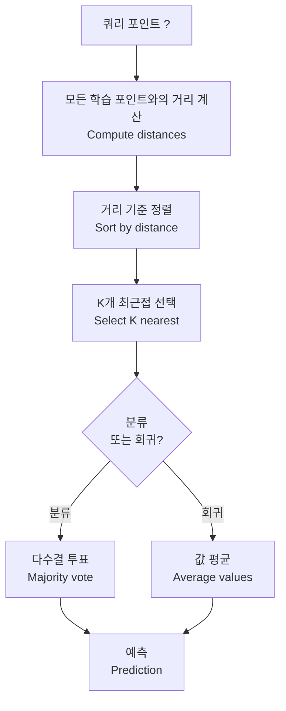
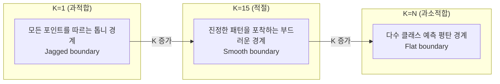
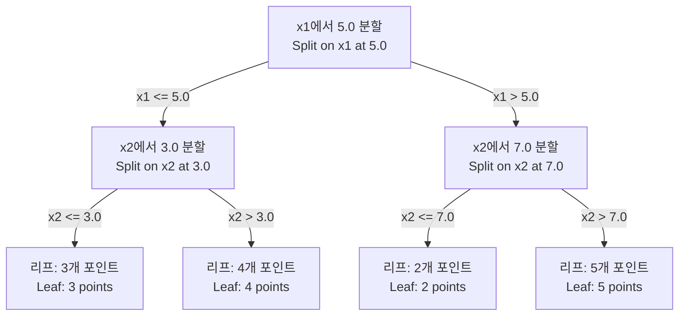

# K-최근접 이웃과 거리

> 모든 것을 저장하세요. 이웃을 보고 예측하세요. 실제로 작동하는 가장 간단한 알고리즘.

**유형:** 구축(Build)
**언어:** Python
**사전 요구 사항:** 1단계 (레슨 14 노름과 거리)
**소요 시간:** ~90분

## 학습 목표

- 구성 가능한 K와 거리 기반 가중치 투표를 사용하여 KNN 분류 및 회귀를 처음부터 구현
- L1, L2, 코사인(cosine), 민코프스키(Minkowski) 거리 메트릭 비교 및 주어진 데이터 유형에 적합한 메트릭 선택
- 차원의 저주(curse of dimensionality) 설명 및 고차원 공간에서 KNN 성능 저하 원인 증명
- 효율적인 최근접 이웃 탐색을 위한 KD-트리(KD-tree) 구축 및 브루트 포스(brute-force) 대비 성능 우위 분석 시점

## 문제 정의

데이터셋이 있습니다. 새로운 데이터 포인트가 도착합니다. 이를 분류하거나 값을 예측해야 합니다. 데이터로부터 파라미터를 학습(선형 회귀나 SVM과 같은)하는 대신, 새 포인트와 가장 가까운 K개의 훈련 포인트를 찾아 투표를 진행합니다.

이것이 K-최근접 이웃(KNN)입니다. 훈련 단계가 없습니다. 학습할 파라미터도 없습니다. 최소화할 손실 함수도 없습니다. 전체 훈련 세트를 저장하고 예측 시점에 거리를 계산합니다.

너무 단순해 보이지만, KNN은 많은 문제에서 놀랍도록 경쟁력 있는 성능을 보입니다. 특히 소규모에서 중규모 데이터셋에서 효과적이며, 이를 깊이 이해하면 다음과 같은 기본 개념을 알 수 있습니다: 거리 메트릭의 선택(Phase 1 Lesson 14와 연결), 차원의 저주, 게으른 학습(lazy learning)과 열성적인 학습(eager learning)의 차이.

KNN은 현대 AI에서도 다양한 이름으로 등장합니다. 벡터 데이터베이스는 임베딩에 대해 KNN 검색을 수행합니다. 검색 증강 생성(RAG)은 가장 가까운 K개의 문서 청크를 찾습니다. 추천 시스템은 유사한 사용자나 아이템을 찾습니다. 알고리즘은 동일하지만, 규모와 데이터 구조가 다릅니다.

## 개념

### KNN 작동 방식

라벨이 지정된 데이터 포인트와 새로운 쿼리 포인트가 주어졌을 때:

1. 쿼리와 데이터셋 내 모든 포인트 간 거리 계산
2. 거리 기준 정렬
3. 가장 가까운 K개 포인트 선택
4. 분류: K 이웃 중 다수결 투표
5. 회귀: K 이웃 값의 평균(또는 가중 평균)



이것이 전체 알고리즘입니다. 모델 적합(fitting)도, 경사 하강법(gradient descent)도, 에포크(epochs)도 없습니다.

### K 선택

K는 단일 하이퍼파라미터입니다. 편향-분산 트레이드오프를 제어합니다:

| K | 동작 |
|---|----------|
| K = 1 | 결정 경계가 모든 포인트를 따름. 학습 오차 0. 높은 분산. 과적합 |
| 작은 K (3-5) | 지역 구조에 민감. 복잡한 경계 포착 가능 |
| 큰 K | 부드러운 경계. 노이즈에 강건. 과소적합 가능성 |
| K = N | 모든 포인트에 대해 다수 클래스 예측. 최대 편향 |

일반적인 시작점은 N개 포인트에 대해 K = sqrt(N)입니다. 이진 분류에서는 동점 방지를 위해 홀수 K를 사용합니다.



### 거리 메트릭

거리 함수는 "근접"의 의미를 정의합니다. 다른 메트릭은 다른 이웃과 예측을 생성합니다.

**L2 (유클리드)**가 기본값입니다. 직선 거리입니다.

```
d(a, b) = sqrt(sum((a_i - b_i)^2))
```

특성 스케일에 민감합니다. L2 사용 전 항상 특성 표준화 필요.

**L1 (맨해튼)**은 절대 차이 합입니다. 차이를 제곱하지 않아 L2보다 이상치에 강건합니다.

```
d(a, b) = sum(|a_i - b_i|)
```

**코사인 거리**는 벡터 간 각도를 측정하며 크기는 무시합니다. 텍스트 및 임베딩 데이터에 필수적입니다.

```
d(a, b) = 1 - (a . b) / (||a|| * ||b||)
```

**민코프스키**는 매개변수 p로 L1과 L2를 일반화합니다.

```
d(a, b) = (sum(|a_i - b_i|^p))^(1/p)

p=1: 맨해튼
p=2: 유클리드
p->inf: 체비셰프 (최대 절대 차이)
```

사용할 메트릭은 데이터에 따라 다릅니다:

| 데이터 유형 | 최적 메트릭 | 이유 |
|-----------|------------|-----|
| 숫자 특성, 유사 스케일 | L2 (유클리드) | 기본값, 공간 데이터에 적합 |
| 숫자 특성, 이상치 존재 | L1 (맨해튼) | 강건성, 큰 차이 증폭 방지 |
| 텍스트 임베딩 | 코사인 | 크기는 노이즈, 방향이 의미 |
| 고차원 희소 데이터 | 코사인 또는 L1 | L2는 차원의 저주 영향 |
| 혼합 유형 | 커스텀 거리 | 특성 유형별 메트릭 결합 |

### 가중 KNN

표준 KNN은 모든 K 이웃에 동일한 가중치를 부여합니다. 하지만 거리 0.1인 이웃이 거리 5.0인 이웃보다 더 중요해야 합니다.

**거리 가중 KNN**은 각 이웃의 가중치를 거리의 역수로 설정합니다:

```
weight_i = 1 / (distance_i + epsilon)

분류: 가중 투표
회귀:     가중 평균 = sum(w_i * y_i) / sum(w_i)
```

epsilon은 쿼리 포인트가 학습 포인트와 정확히 일치할 때 0으로 나누는 것을 방지합니다.

가중 KNN은 K 선택에 덜 민감합니다. 먼 이웃은 기여도가 매우 낮기 때문입니다.

### 차원의 저주

KNN 성능은 고차원에서 저하됩니다. 이는 막연한 우려가 아닌 수학적 사실입니다.

**문제 1: 거리 수렴.** 차원이 증가할수록 최대 거리와 최소 거리의 비율이 1에 접근합니다. 모든 포인트가 쿼리로부터 "동일한" 거리에 있게 됩니다.

```
d 차원에서 무작위 균일 포인트에 대해:

d=2:    max_dist / min_dist = 크게 변동
d=100:  max_dist / min_dist ~ 1.01
d=1000: max_dist / min_dist ~ 1.001

모든 거리가 거의 같으면 "최근접"은 무의미합니다.
```

**문제 2: 부피 폭발.** 데이터의 고정 비율 내 K 이웃을 포착하려면 검색 반경을 특성 공간의 훨씬 큰 비율로 확장해야 합니다. 고차원에서의 "이웃"은 공간 대부분을 포함합니다.

**문제 3: 코너 지배.** d 차원 단위 초입방체에서 대부분의 부피는 중심이 아닌 코너 근처에 집중됩니다. 초입방체에 내접한 구는 d가 증가함에 따라 부피의 무시할 수 있는 부분만 포함합니다.

실용적 영향: KNN은 약 20-50개 특성까지 잘 작동합니다. 그 이상에서는 차원 축소(PCA, UMAP, t-SNE) 후 KNN 적용 또는 데이터의 내재적 저차원 구조를 활용하는 트리 기반 검색 구조를 사용해야 합니다.

### KD-트리: 빠른 최근접 이웃 검색

브루트포스 KNN은 쿼리마다 모든 학습 포인트와의 거리를 계산합니다. 이는 쿼리당 O(n * d)입니다. 대규모 데이터셋에서는 너무 느립니다.

KD-트리는 특성 축을 따라 공간을 재귀적으로 분할합니다. 각 레벨에서 중간값에서 하나의 차원을 기준으로 분할합니다.



최근접 이웃을 찾으려면 쿼리를 포함하는 리프까지 트리를 탐색한 후, 더 가까운 포인트가 있을 수 있는 인접 분할만 역추적하여 확인합니다.

평균 쿼리 시간: 저차원에서는 O(log n). 하지만 KD-트리는 고차원(d > 20)에서 O(n)으로 저하됩니다. 역추적 시 제거되는 분기가 점점 적어지기 때문입니다.

### 볼 트리: 중간 차원에 더 적합

볼 트리는 축 정렬 상자 대신 중첩된 초구(hypersphere)로 데이터를 분할합니다. 각 노드는 해당 서브트리의 모든 포인트를 포함하는 구(중심 + 반지름)를 정의합니다.

KD-트리 대비 장점:
- 중간 차원(최대 ~50)에서 더 잘 작동
- 축 정렬되지 않은 구조 처리
- 더 타이트한 경계 부피로 검색 시 더 많은 분기 제거

KD-트리와 볼 트리 모두 정확한 알고리즘입니다. 대규모 검색(수백만 포인트, 수백 차원)의 경우 근사 최근접 이웃 방법(HNSW, IVF, 곱 양자화)이 대신 사용됩니다. 이는 1단계 14과에서 다룹니다.

### 지연 학습 vs 적극 학습

KNN은 지연 학습자(lazy learner)입니다. 학습 시간에는 아무 작업도 하지 않고 예측 시간에 모든 작업을 수행합니다. 대부분의 다른 알고리즘(선형 회귀, SVM, 신경망)은 적극 학습자(eager learner)입니다. 학습 시간에 무거운 계산을 수행하여 컴팩트 모델을 구축한 후 예측은 빠르게 합니다.

| 측면 | 지연 학습 (KNN) | 적극 학습 (SVM, 신경망) |
|--------|------------|------------------------|
| 학습 시간 | O(1) 데이터 저장만 | O(n * 에포크) |
| 예측 시간 | 쿼리당 O(n * d) | O(d) 또는 O(파라미터) |
| 예측 시 메모리 | 전체 학습 세트 저장 | 모델 파라미터만 저장 |
| 새 데이터 적응 | 즉시 포인트 추가 | 모델 재학습 |
| 결정 경계 | 암시적, 실시간 계산 | 명시적, 학습 후 고정 |

지연 학습은 다음 경우에 이상적입니다:
- 데이터셋이 자주 변경(학습 없이 포인트 추가/제거)
- 매우 적은 쿼리에 대한 예측 필요
- 학습 시간 0
- 브루트포스 검색이 빠를 정도로 데이터셋이 작음

### 회귀를 위한 KNN

다수결 대신 KNN 회귀는 K 이웃의 타겟 값 평균을 사용합니다.

```
예측 = (1/K) * sum(K 최근접 이웃의 y_i)

또는 거리 가중치 적용:
예측 = sum(w_i * y_i) / sum(w_i)
여기서 w_i = 1 / distance_i
```

KNN 회귀는 조각별 상수(또는 가중치 적용 시 조각별 평활) 예측을 생성합니다. 학습 데이터 범위를 벗어난 외삽은 불가능합니다. 학습 타겟이 모두 0과 100 사이라면 KNN은 200을 절대 예측하지 않습니다.

## 구축 방법

### 1단계: 거리 함수

L1, L2, 코사인(cosine), 민코프스키(Minkowski) 거리를 구현합니다. 이는 Phase 1 Lesson 14와 직접 연결됩니다.

```python
import math

def l2_distance(a, b):
    return math.sqrt(sum((ai - bi) ** 2 for ai, bi in zip(a, b)))

def l1_distance(a, b):
    return sum(abs(ai - bi) for ai, bi in zip(a, b))

def cosine_distance(a, b):
    dot_val = sum(ai * bi for ai, bi in zip(a, b))
    norm_a = math.sqrt(sum(ai ** 2 for ai in a))
    norm_b = math.sqrt(sum(bi ** 2 for bi in b))
    if norm_a == 0 or norm_b == 0:
        return 1.0
    return 1.0 - dot_val / (norm_a * norm_b)

def minkowski_distance(a, b, p=2):
    if p == float('inf'):
        return max(abs(ai - bi) for ai, bi in zip(a, b))
    return sum(abs(ai - bi) ** p for ai, bi in zip(a, b)) ** (1 / p)
```

### 2단계: KNN 분류기와 회귀기

구성 가능한 K, 거리 메트릭, 선택적 거리 가중치를 갖춘 전체 KNN을 구축합니다.

```python
class KNN:
    def __init__(self, k=5, distance_fn=l2_distance, weighted=False,
                 task="classification"):
        self.k = k
        self.distance_fn = distance_fn
        self.weighted = weighted
        self.task = task
        self.X_train = None
        self.y_train = None

    def fit(self, X, y):
        self.X_train = X
        self.y_train = y

    def predict(self, X):
        return [self._predict_one(x) for x in X]
```

### 3단계: 효율적인 검색을 위한 KD-트리

각 차원의 중앙값을 기준으로 재귀적으로 분할하는 KD-트리를 처음부터 구축합니다.

```python
class KDTree:
    def __init__(self, X, indices=None, depth=0):
        # 데이터를 재귀적으로 분할
        self.axis = depth % len(X[0])
        # 현재 축의 중앙값을 기준으로 분할
        ...

    def query(self, point, k=1):
        # 리프 노드까지 이동 후 역추적
        ...
```

전체 구현 및 도우미 메서드, 데모는 `code/knn.py`를 참조하세요.

### 4단계: 특성 스케일링

KNN은 거리 계산이 특성 크기에 민감하기 때문에 특성 스케일링이 필요합니다. 0~1000 범위의 특성은 0~1 범위의 특성을 압도할 수 있습니다.

```python
def standardize(X):
    n = len(X)
    d = len(X[0])
    means = [sum(X[i][j] for i in range(n)) / n for j in range(d)]
    stds = [
        max(1e-10, (sum((X[i][j] - means[j]) ** 2 for i in range(n)) / n) ** 0.5)
        for j in range(d)
    ]
    return [[((X[i][j] - means[j]) / stds[j]) for j in range(d)] for i in range(n)], means, stds
```

## 사용 방법

scikit-learn을 사용하는 경우:

```python
from sklearn.neighbors import KNeighborsClassifier
from sklearn.preprocessing import StandardScaler
from sklearn.pipeline import Pipeline

clf = Pipeline([
    ("scaler", StandardScaler()),
    ("knn", KNeighborsClassifier(n_neighbors=5, metric="euclidean")),
])
clf.fit(X_train, y_train)
print(f"정확도: {clf.score(X_test, y_test):.4f}")
```

scikit-learn은 데이터셋이 충분히 크고 차원이 충분히 낮을 때 자동으로 KD-트리(KD-tree) 또는 볼 트리(ball tree)를 사용합니다. 고차원 데이터의 경우 브루트 포스(brute force)로 대체됩니다. `algorithm` 매개변수를 통해 이를 제어할 수 있습니다.

대규모 최근접 이웃 검색(수백만 개의 벡터)의 경우 FAISS, Annoy 또는 벡터 데이터베이스를 사용하세요:

```python
import faiss

index = faiss.IndexFlatL2(dimension)
index.add(embeddings)
distances, indices = index.search(query_vectors, k=5)
```

## 연습 문제

1. 3개의 클래스를 가진 2D 데이터셋에 KNN 분류기를 구현하세요. K=1, K=5, K=15, K=N일 때 결정 경계를 시각화하고, 과적합에서 과소적합으로의 전환을 관찰하세요.

2. 2, 5, 10, 50, 100, 500차원에서 각각 1000개의 무작위 점을 생성하세요. 각 차원마다 최대 쌍별 거리와 최소 쌍별 거리의 비율을 계산하세요. 비율 대 차원 수를 그래프로 그려 차원의 저주(curse of dimensionality)를 시각화하세요.

3. 텍스트 분류 문제(TF-IDF 벡터 사용)에서 KNN에 대해 L1, L2, 코사인 거리(cosine distance)를 비교하세요. 어떤 거리 척도가 가장 높은 정확도를 제공하나요? 왜 텍스트에서는 코사인 거리가 더 좋은 성능을 내나요?

4. KD-트리(KD-tree)를 구현하고 2D, 10D, 50D에서 1k, 10k, 100k 점 데이터셋에 대해 쿼리 시간을 측정하세요. 어떤 차원에서 KD-트리가 브루트 포스보다 느려지기 시작하나요?

5. y = sin(x) + noise에 대해 가중 KNN 회귀기를 구현하세요. K=3, 10, 30일 때 가중 KNN과 비가중 KNN을 비교하세요. 특히 큰 K에서 가중치가 더 부드러운 예측을 생성함을 보여주세요.

## 주요 용어

| 용어 | 실제 의미 |
|------|-----------|
| K-최근접 이웃(K-nearest neighbors) | 쿼리에 대해 가장 가까운 K개의 학습 포인트를 찾아 예측하는 비모수적 알고리즘 |
| 게으른 학습(Lazy learning) | 학습 시간에는 계산 없음. 모든 작업은 예측 시간에 발생. KNN이 대표적인 예시 |
| 적극적인 학습(Eager learning) | 학습 시간에 집약적인 계산을 통해 간결한 모델 구축. 대부분의 ML 알고리즘은 적극적 학습 |
| 차원의 저주(Curse of dimensionality) | 고차원에서는 거리가 수렴하고 이웃이 공간 대부분을 덮게 되어 KNN이 비효율적 |
| KD-트리(KD-tree) | 특징 축을 따라 공간을 재귀적으로 분할하는 이진 트리. 저차원에서 O(log n) 쿼리 가능 |
| 볼 트리(Ball tree) | 중첩된 초구(hypersphere)의 트리. 중간 차원(~50까지)에서 KD-트리보다 우수 |
| 가중치 KNN(Weighted KNN) | 거리에 반비례하는 가중치 적용. 가까운 이웃이 예측에 더 큰 영향 |
| 특징 스케일링(Feature scaling) | 특징을 비교 가능한 범위로 정규화. KNN 같은 거리 기반 방법에 필수 |
| 다수결(Majority vote) | K 이웃 중 가장 흔한 클래스를 세는 분류 방식 |
| 무차별 대입 검색(Brute force search) | 모든 학습 포인트와의 거리 계산. 쿼리당 O(n*d) 소요. 정확하지만 대규모 n에서 느림 |
| 근사 최근접 이웃(Approximate nearest neighbor) | HNSW, LSH, IVF 등의 알고리즘으로 정확한 검색보다 훨씬 빠르게 근사 이웃 탐색 |
| 보로노이 다이어그램(Voronoi diagram) | 각 영역이 다른 어떤 학습 포인트보다 한 포인트에 더 가까운 모든 점을 포함하는 공간 분할. K=1 KNN은 보로노이 경계 생성 |

## 추가 자료

- [Cover & Hart: 최근접 이웃 패턴 분류 (1967)](https://ieeexplore.ieee.org/document/1053964) - 베이즈 최적 분류기의 최대 2배 오차율을 갖는 KNN의 기초 논문
- [Friedman, Bentley, Finkel: 로그 기대 시간 내 최적 일치 탐색 알고리즘 (1977)](https://dl.acm.org/doi/10.1145/355744.355745) - 원본 KD-트리 논문
- [Beyer et al.: "최근접 이웃"이 의미 있는 경우는 언제인가? (1999)](https://link.springer.com/chapter/10.1007/3-540-49257-7_15) - 최근접 이웃에 대한 차원의 저주 공식 분석
- [scikit-learn 최근접 이웃 문서](https://scikit-learn.org/stable/modules/neighbors.html) - 알고리즘 선택 가이드 포함 실용 문서
- [FAISS: 효율적인 유사도 검색 라이브러리](https://github.com/facebookresearch/faiss) - 메타의 대규모 근사 최근접 이웃 검색 라이브러리