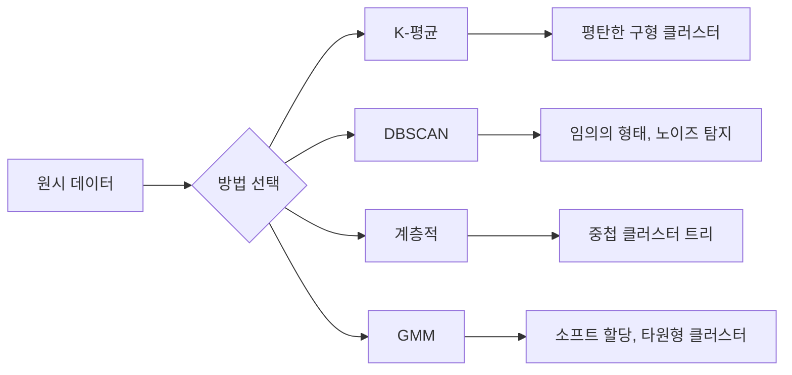

# 비지도 학습(Unsupervised Learning)

> 레이블 없음, 교사 없음. 알고리즘이 스스로 구조를 발견합니다.

**유형:** Build  
**언어:** Python  
**선수 지식:** Phase 1 (노름 & 거리, 확률 & 분포), Phase 2 레슨 1-6  
**소요 시간:** ~90분

## 학습 목표

- K-평균(K-Means), DBSCAN, 가우시안 혼합 모델(Gaussian Mixture Models)을 직접 구현하고 클러스터링 동작 비교
- 실루엣 점수(silhouette score)와 엘보우 방법(elbow method)을 사용하여 클러스터 품질 평가 및 최적 K 값 선택
- DBSCAN이 K-평균보다 우수한 경우 설명 및 비구형(non-spherical) 클러스터와 이상치(outlier) 처리 가능한 알고리즘 식별
- 클러스터링 방법을 활용한 이상 탐지(anomaly detection) 파이프라인 구축 및 정상 패턴에서 벗어난 데이터 포인트 식별

## 문제 정의

지금까지의 모든 ML 수업은 레이블이 지정된 데이터를 가정했습니다: "여기 입력이 있고, 여기 올바른 출력이 있습니다." 실제 세계에서는 레이블을 얻는 것이 비용이 많이 듭니다. 병원은 수백만 건의 환자 기록을 보유하고 있지만, 각 기록에 질병 범주를 수동으로 태깅한 사람은 없습니다. 전자상거래 사이트는 수백만 건의 사용자 세션을 보유하고 있지만, 고객 세그먼트를 수작업으로 레이블링한 사람은 없습니다. 보안 팀은 네트워크 로그를 보유하고 있지만, 모든 이상 현상을 표시한 사람은 없습니다.

비지도 학습은 무엇을 찾아야 할지 알려주지 않아도 패턴을 발견합니다. 유사한 데이터 포인트를 그룹화하고, 숨겨진 구조를 발견하며, 이상 현상을 표면화합니다. 지도 학습이 정답이 포함된 교과서로 학습하는 것이라면, 비지도 학습은 원시 데이터를 계속 관찰하다가 패턴이 스스로 드러나도록 하는 것입니다.

단, 레이블이 없으면 "옳다" 또는 "그르다"를 직접 측정할 수 없습니다. 알고리즘이 발견한 구조가 의미 있는지 평가하기 위해 다른 도구가 필요합니다.

## 개념

### 클러스터링: 유사한 것끼리 그룹화하기

클러스터링은 각 데이터 포인트를 그룹(클러스터)에 할당하여 같은 그룹 내 포인트들이 다른 그룹의 포인트들보다 서로 더 유사하도록 만듭니다. 여기서 핵심 질문은 항상 "유사하다"는 것이 무엇을 의미하는가입니다.



### K-평균: 핵심 알고리즘

K-평균은 데이터를 정확히 K개의 클러스터로 분할합니다. 각 클러스터에는 중심점(질량 중심)이 있으며, 모든 포인트는 가장 가까운 중심점에 속합니다.

로이드 알고리즘:

1. 초기 중심점으로 K개의 무작위 포인트 선택
2. 각 데이터 포인트를 가장 가까운 중심점에 할당
3. 할당된 포인트들의 평균으로 각 중심점 재계산
4. 할당이 변하지 않을 때까지 2-3단계 반복

목적 함수(관성)는 각 포인트에서 할당된 중심점까지의 제곱 거리 총합을 측정합니다. K-평균은 이를 최소화하지만 지역 최소값만 찾습니다. 다른 초기화는 다른 결과를 줄 수 있습니다.

### K 값 선택

두 가지 표준 방법:

**엘보우 방법:** K = 1, 2, 3, ..., n에 대해 K-평균 실행. 관성 대 K 그래프 작성. 클러스터 추가가 관성 감소를 크게 줄이지 않는 "엘보우" 지점 찾기.

**실루엣 점수:** 각 포인트에 대해 자체 클러스터와의 유사성(a)과 가장 가까운 다른 클러스터와의 유사성(b)을 측정. 실루엣 계수는 (b - a) / max(a, b)로, -1(잘못된 클러스터)에서 +1(잘 클러스터링됨) 사이 값. 모든 포인트의 평균을 전체 점수로 사용.

### DBSCAN: 밀도 기반 클러스터링

K-평균은 클러스터가 구형이라고 가정하고 K를 미리 선택해야 합니다. DBSCAN은 두 가지 가정을 하지 않습니다. 밀집 영역으로 분리된 클러스터를 찾습니다.

두 가지 파라미터:
- **eps**: 이웃 반경
- **min_samples**: 밀집 영역 형성에 필요한 최소 포인트 수

세 가지 포인트 유형:
- **코어 포인트**: eps 거리 내에 최소 min_samples 포인트 존재
- **경계 포인트**: 코어 포인트의 eps 거리 내에 있지만 자신은 코어 포인트가 아님
- **노이즈 포인트**: 코어/경계 포인트 아님. 이상치입니다.

DBSCAN은 서로 eps 거리 내에 있는 코어 포인트들을 같은 클러스터로 연결합니다. 경계 포인트는 근처 코어 포인트의 클러스터에 합류합니다. 노이즈 포인트는 어떤 클러스터에도 속하지 않습니다.

장점: 임의의 형태 클러스터 탐지, 자동 클러스터 수 결정, 이상치 식별. 단점: 밀도가 다른 클러스터에서 성능 저하.

### 계층적 클러스터링

중첩된 클러스터의 트리(덴드로그램)를 생성합니다.

병합(agglomerative, 상향식):
1. 각 포인트를 개별 클러스터로 시작
2. 가장 가까운 두 클러스터 병합
3. 하나의 클러스터만 남을 때까지 반복
4. 원하는 수준에서 덴드로그램을 잘라 K 클러스터 획득

클러스터 간 "가까움" 측정 방법:
- **단일 연결**: 두 클러스터의 임의의 두 포인트 간 최소 거리
- **완전 연결**: 두 클러스터의 임의의 두 포인트 간 최대 거리
- **평균 연결**: 모든 포인트 쌍의 평균 거리
- **워드 방법**: 클러스터 내 분산 증가를 최소화하는 병합

### 가우시안 혼합 모델(GMM)

K-평균은 하드 할당(포인트가 정확히 하나의 클러스터에 속함)을 제공합니다. GMM은 소프트 할당(각 포인트가 각 클러스터에 속할 확률)을 제공합니다.

GMM은 데이터가 K개의 가우시안 분포(각 분포별 평균/공분산)에서 생성되었다고 가정합니다. 기대값 최대화(EM) 알고리즘은 다음을 반복합니다:

- **E-단계**: 각 포인트가 각 가우시안에 속할 확률 계산
- **M-단계**: 데이터 우도 최대화를 위해 각 가우시안의 평균, 공분산, 혼합 가중치 업데이트

GMM은 타원형 클러스터(K-평균의 구형 클러스터 대비)를 모델링할 수 있으며, 중첩 클러스터를 자연스럽게 처리합니다.

### 어떤 방법을 언제 사용할까

| 방법 | 적합한 경우 | 피해야 할 경우 |
|--------|----------|------------|
| K-평균 | 대규모 데이터셋, 구형 클러스터, 알려진 K | 불규칙한 형태, 이상치 존재 |
| DBSCAN | 알려지지 않은 K, 임의의 형태, 이상치 탐지 | 밀도 변화, 매우 높은 차원 |
| 계층적 | 소규모 데이터셋, 덴드로그램 필요, 알려지지 않은 K | 대규모 데이터셋(O(n²) 메모리) |
| GMM | 중첩 클러스터, 소프트 할당 필요 | 매우 큰 데이터셋, 너무 많은 차원 |

### 클러스터링을 통한 이상치 탐지

클러스터링은 자연스럽게 이상치 탐지를 지원합니다:
- **K-평균**: 어떤 중심점에서도 먼 포인트는 이상치
- **DBSCAN**: 노이즈 포인트는 정의상 이상치
- **GMM**: 모든 가우시안에서 낮은 확률을 가진 포인트는 이상치

## 직접 구현하기

### 1단계: 처음부터 시작하는 K-평균

```python
import math
import random


def euclidean_distance(a, b):
    return math.sqrt(sum((ai - bi) ** 2 for ai, bi in zip(a, b)))


def kmeans(data, k, max_iterations=100, seed=42):
    random.seed(seed)
    n_features = len(data[0])

    centroids = random.sample(data, k)

    for iteration in range(max_iterations):
        clusters = [[] for _ in range(k)]
        assignments = []

        for point in data:
            distances = [euclidean_distance(point, c) for c in centroids]
            nearest = distances.index(min(distances))
            clusters[nearest].append(point)
            assignments.append(nearest)

        new_centroids = []
        for cluster in clusters:
            if len(cluster) == 0:
                new_centroids.append(random.choice(data))
                continue
            centroid = [
                sum(point[j] for point in cluster) / len(cluster)
                for j in range(n_features)
            ]
            new_centroids.append(centroid)

        if all(
            euclidean_distance(old, new) < 1e-6
            for old, new in zip(centroids, new_centroids)
        ):
            print(f"  반복 {iteration + 1}에서 수렴")
            break

        centroids = new_centroids

    return assignments, centroids
```

### 2단계: 엘보우 방법과 실루엣 점수

```python
def compute_inertia(data, assignments, centroids):
    total = 0.0
    for point, cluster_id in zip(data, assignments):
        total += euclidean_distance(point, centroids[cluster_id]) ** 2
    return total


def silhouette_score(data, assignments):
    n = len(data)
    if n < 2:
        return 0.0

    clusters = {}
    for i, c in enumerate(assignments):
        clusters.setdefault(c, []).append(i)

    if len(clusters) < 2:
        return 0.0

    scores = []
    for i in range(n):
        own_cluster = assignments[i]
        own_members = [j for j in clusters[own_cluster] if j != i]

        if len(own_members) == 0:
            scores.append(0.0)
            continue

        a = sum(euclidean_distance(data[i], data[j]) for j in own_members) / len(own_members)

        b = float("inf")
        for cluster_id, members in clusters.items():
            if cluster_id == own_cluster:
                continue
            avg_dist = sum(euclidean_distance(data[i], data[j]) for j in members) / len(members)
            b = min(b, avg_dist)

        if max(a, b) == 0:
            scores.append(0.0)
        else:
            scores.append((b - a) / max(a, b))

    return sum(scores) / len(scores)


def find_best_k(data, max_k=10):
    print("엘보우 방법:")
    inertias = []
    for k in range(1, max_k + 1):
        assignments, centroids = kmeans(data, k)
        inertia = compute_inertia(data, assignments, centroids)
        inertias.append(inertia)
        print(f"  K={k}: 관성={inertia:.2f}")

    print("\n실루엣 점수:")
    for k in range(2, max_k + 1):
        assignments, centroids = kmeans(data, k)
        score = silhouette_score(data, assignments)
        print(f"  K={k}: 실루엣={score:.4f}")

    return inertias
```

### 3단계: 처음부터 시작하는 DBSCAN

```python
def dbscan(data, eps, min_samples):
    n = len(data)
    labels = [-1] * n
    cluster_id = 0

    def region_query(point_idx):
        neighbors = []
        for i in range(n):
            if euclidean_distance(data[point_idx], data[i]) <= eps:
                neighbors.append(i)
        return neighbors

    visited = [False] * n

    for i in range(n):
        if visited[i]:
            continue
        visited[i] = True

        neighbors = region_query(i)

        if len(neighbors) < min_samples:
            labels[i] = -1
            continue

        labels[i] = cluster_id
        seed_set = list(neighbors)
        seed_set.remove(i)

        j = 0
        while j < len(seed_set):
            q = seed_set[j]

            if not visited[q]:
                visited[q] = True
                q_neighbors = region_query(q)
                if len(q_neighbors) >= min_samples:
                    for nb in q_neighbors:
                        if nb not in seed_set:
                            seed_set.append(nb)

            if labels[q] == -1:
                labels[q] = cluster_id

            j += 1

        cluster_id += 1

    return labels
```

### 4단계: 가우시안 혼합 모델 (EM 알고리즘)

```python
def gmm(data, k, max_iterations=100, seed=42):
    random.seed(seed)
    n = len(data)
    d = len(data[0])

    indices = random.sample(range(n), k)
    means = [list(data[i]) for i in indices]
    variances = [1.0] * k
    weights = [1.0 / k] * k

    def gaussian_pdf(x, mean, variance):
        d = len(x)
        coeff = 1.0 / ((2 * math.pi * variance) ** (d / 2))
        exponent = -sum((xi - mi) ** 2 for xi, mi in zip(x, mean)) / (2 * variance)
        return coeff * math.exp(max(exponent, -500))

    for iteration in range(max_iterations):
        responsibilities = []
        for i in range(n):
            probs = []
            for j in range(k):
                probs.append(weights[j] * gaussian_pdf(data[i], means[j], variances[j]))
            total = sum(probs)
            if total == 0:
                total = 1e-300
            responsibilities.append([p / total for p in probs])

        old_means = [list(m) for m in means]

        for j in range(k):
            r_sum = sum(responsibilities[i][j] for i in range(n))
            if r_sum < 1e-10:
                continue

            weights[j] = r_sum / n

            for dim in range(d):
                means[j][dim] = sum(
                    responsibilities[i][j] * data[i][dim] for i in range(n)
                ) / r_sum

            variances[j] = sum(
                responsibilities[i][j]
                * sum((data[i][dim] - means[j][dim]) ** 2 for dim in range(d))
                for i in range(n)
            ) / (r_sum * d)
            variances[j] = max(variances[j], 1e-6)

        shift = sum(
            euclidean_distance(old_means[j], means[j]) for j in range(k)
        )
        if shift < 1e-6:
            print(f"  GMM 반복 {iteration + 1}에서 수렴")
            break

    assignments = []
    for i in range(n):
        assignments.append(responsibilities[i].index(max(responsibilities[i])))

    return assignments, means, weights, responsibilities
```

### 5단계: 테스트 데이터 생성 및 모든 알고리즘 실행

```python
def make_blobs(centers, n_per_cluster=50, spread=0.5, seed=42):
    random.seed(seed)
    data = []
    true_labels = []
    for label, (cx, cy) in enumerate(centers):
        for _ in range(n_per_cluster):
            x = cx + random.gauss(0, spread)
            y = cy + random.gauss(0, spread)
            data.append([x, y])
            true_labels.append(label)
    return data, true_labels


def make_moons(n_samples=200, noise=0.1, seed=42):
    random.seed(seed)
    data = []
    labels = []
    n_half = n_samples // 2
    for i in range(n_half):
        angle = math.pi * i / n_half
        x = math.cos(angle) + random.gauss(0, noise)
        y = math.sin(angle) + random.gauss(0, noise)
        data.append([x, y])
        labels.append(0)
    for i in range(n_half):
        angle = math.pi * i / n_half
        x = 1 - math.cos(angle) + random.gauss(0, noise)
        y = 1 - math.sin(angle) - 0.5 + random.gauss(0, noise)
        data.append([x, y])
        labels.append(1)
    return data, labels


if __name__ == "__main__":
    centers = [[2, 2], [8, 3], [5, 8]]
    data, true_labels = make_blobs(centers, n_per_cluster=50, spread=0.8)

    print("=== 3개 블롭에 대한 K-평균 ===")
    assignments, centroids = kmeans(data, k=3)
    print(f"  중심점: {[[round(c, 2) for c in cent] for cent in centroids]}")
    sil = silhouette_score(data, assignments)
    print(f"  실루엣 점수: {sil:.4f}")

    print("\n=== 엘보우 방법 ===")
    find_best_k(data, max_k=6)

    print("\n=== 3개 블롭에 대한 DBSCAN ===")
    db_labels = dbscan(data, eps=1.5, min_samples=5)
    n_clusters = len(set(db_labels) - {-1})
    n_noise = db_labels.count(-1)
    print(f"  {n_clusters}개 클러스터 발견, {n_noise}개 노이즈 점")

    print("\n=== 3개 블롭에 대한 GMM ===")
    gmm_assignments, gmm_means, gmm_weights, _ = gmm(data, k=3)
    print(f"  평균: {[[round(m, 2) for m in mean] for mean in gmm_means]}")
    print(f"  가중치: {[round(w, 3) for w in gmm_weights]}")
    gmm_sil = silhouette_score(data, gmm_assignments)
    print(f"  실루엣 점수: {gmm_sil:.4f}")

    print("\n=== 달 모양 데이터(비구형 클러스터)에 대한 DBSCAN ===")
    moon_data, moon_labels = make_moons(n_samples=200, noise=0.1)
    moon_db = dbscan(moon_data, eps=0.3, min_samples=5)
    n_moon_clusters = len(set(moon_db) - {-1})
    n_moon_noise = moon_db.count(-1)
    print(f"  {n_moon_clusters}개 클러스터 발견, {n_moon_noise}개 노이즈 점")

    print("\n=== 달 모양 데이터에 대한 K-평균(구형 클러스터가 아니므로 실패) ===")
    moon_km, moon_centroids = kmeans(moon_data, k=2)
    moon_sil = silhouette_score(moon_data, moon_km)
    print(f"  실루엣 점수: {moon_sil:.4f}")
    print("  K-평균은 달 모양 데이터를 잘 분리하지 못함(구형 클러스터가 아니기 때문)")

    print("\n=== DBSCAN을 이용한 이상치 탐지 ===")
    anomaly_data = list(data)
    anomaly_data.append([20.0, 20.0])
    anomaly_data.append([-5.0, -5.0])
    anomaly_data.append([15.0, 0.0])
    anomaly_labels = dbscan(anomaly_data, eps=1.5, min_samples=5)
    anomalies = [
        anomaly_data[i]
        for i in range(len(anomaly_labels))
        if anomaly_labels[i] == -1
    ]
    print(f"  {len(anomalies)}개 이상치 탐지")
    for a in anomalies[-3:]:
        print(f"    점 {[round(v, 2) for v in a]}")
```

## 사용 방법

scikit-learn에서는 동일한 알고리즘을 한 줄로 구현할 수 있습니다:

```python
from sklearn.cluster import KMeans, DBSCAN, AgglomerativeClustering
from sklearn.mixture import GaussianMixture
from sklearn.metrics import silhouette_score as sklearn_silhouette

km = KMeans(n_clusters=3, random_state=42).fit(data)
db = DBSCAN(eps=1.5, min_samples=5).fit(data)
agg = AgglomerativeClustering(n_clusters=3).fit(data)
gmm_model = GaussianMixture(n_components=3, random_state=42).fit(data)
```

직접 구현한 버전들은 이러한 라이브러리가 정확히 어떤 계산을 수행하는지 보여줍니다. K-Means는 할당과 재계산 단계를 반복합니다. DBSCAN은 밀집된 시드(seed)에서 클러스터를 성장시킵니다. GMM은 기대값(Expectation)과 최대화(Maximization) 단계를 번갈아 수행합니다. 라이브러리 버전들은 수치적 안정성, 더 스마트한 초기화(K-Means++), GPU 가속 등을 추가하지만 핵심 로직은 동일합니다.

## Ship It

이 레슨은 K-Means, DBSCAN, GMM의 작동 구현을 처음부터 만들어 봅니다. 클러스터링 코드는 더 고급 비지도 학습 방법의 기반으로 재사용될 수 있습니다.

## 연습 문제

1. K-Means++ 초기화 구현: 무작위 중심점 선택 대신 첫 번째 중심점은 무작위로 선택하고, 이후 각 중심점은 기존 가장 가까운 중심점과의 제곱 거리에 비례하는 확률로 선택합니다. 무작위 초기화와 수렴 속도를 비교하세요.
2. 코드에 계층적 병합 클러스터링 추가: Ward 연결 방법을 구현하고 덴드로그램(병합 작업의 중첩 리스트)을 생성합니다. 다른 수준에서 덴드로그램을 잘라 K-Means 결과와 비교하세요.
3. 간단한 이상치 탐지 파이프라인 구축: 동일한 데이터에 대해 DBSCAN과 GMM을 실행하고, 두 방법 모두 이상치로 판단한 점(DBSCAN의 노이즈, GMM의 낮은 확률)을 플래그 처리합니다. 중복 영역을 측정하고 방법론이 불일치하는 경우에 대해 논의하세요.

## 주요 용어

| 용어 | 사람들이 말하는 것 | 실제 의미 |
|------|----------------|----------------------|
| 클러스터링(Clustering) | "유사한 것들을 그룹화하는 것" | 특정 거리 측정 기준에 따라 데이터 내 그룹 간 유사성보다 그룹 내 유사성이 더 높은 부분집합으로 분할하는 것 |
| 중심점(Centroid) | "클러스터의 중심" | 클러스터에 할당된 모든 점의 평균; K-평균(K-Means)에서 클러스터 대표값으로 사용 |
| 관성(Inertia) | "클러스터가 얼마나 조밀한지" | 각 점에서 할당된 중심점까지의 제곱 거리의 합; 값이 낮을수록 조밀도가 높음 |
| 실루엣 점수(Silhouette score) | "클러스터가 얼마나 잘 분리되었는지" | 각 점에 대해 (b - a) / max(a, b) 계산. 여기서 a는 클러스터 내 평균 거리, b는 가장 가까운 다른 클러스터 평균 거리 |
| 코어 포인트(Core point) | "밀집 영역의 점" | DBSCAN에서 eps 거리 내에 최소 min_samples 개수의 이웃을 가진 점 |
| EM 알고리즘(EM algorithm) | "소프트 K-평균" | 기대값-최대화(Expectation-Maximization): 반복적으로 멤버십 확률 계산(E-단계)과 분포 매개변수 업데이트(M-단계) 수행 |
| 덴드로그램(Dendrogram) | "클러스터의 트리" | 계층적 클러스터링에서 클러스터가 병합된 순서와 거리를 보여주는 트리 다이어그램 |
| 이상치(Anomaly) | "아웃라이어" | DBSCAN에서 노이즈로 식별되거나 GMM에서 낮은 확률로 식별되는, 예상 패턴과 일치하지 않는 데이터 포인트 |

## 추가 학습 자료

- [Stanford CS229 - 비지도 학습](https://cs229.stanford.edu/notes2022fall/main_notes.pdf) - 앤드류 응의 클러스터링 및 EM 알고리즘 강의 노트
- [scikit-learn 클러스터링 가이드](https://scikit-learn.org/stable/modules/clustering.html) - 시각적 예제와 함께 제공되는 모든 클러스터링 알고리즘의 실용적 비교
- [DBSCAN 원본 논문 (Ester et al., 1996)](https://www.aaai.org/Papers/KDD/1996/KDD96-037.pdf) - 밀도 기반 클러스터링을 최초로 소개한 논문