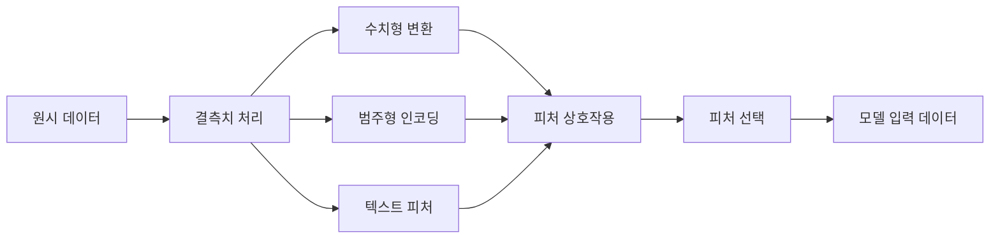

# 특성 공학 및 선택

> 좋은 특성 하나는 데이터 포인트 천 개와 맞먹는다.

**유형:** 구축
**언어:** Python
**선수 지식:** 1단계 (ML을 위한 통계, 선형 대수), 2단계 레슨 1-7
**소요 시간:** ~90분

## 학습 목표

- 수치 변환(표준화, 최소-최대 스케일링, 로그 변환, 비닝)을 구현하고 각각이 적절한 경우를 설명
- 범주형 특성에 대한 원-핫(one-hot), 레이블(label), 타겟 인코딩(target encoding)을 구축하고 타겟 인코딩의 데이터 누수 위험을 식별
- TF-IDF 벡터라이저를 처음부터 구성하고 텍스트 분류에서 원시 단어 빈도보다 우수한 성능을 보이는 이유 설명
- 차원 축소를 위해 필터 기반 특성 선택(분산 임계값, 상관관계, 상호 정보)을 적용

## 전문 용어 설명
- **표준화(standardization)**: 평균 0, 표준편차 1로 조정
- **최소-최대 스케일링(min-max scaling)**: 값을 [0,1] 범위로 변환
- **원-핫 인코딩(one-hot encoding)**: 범주형 변수를 이진 벡터로 표현
- **타겟 인코딩(target encoding)**: 범주를 목표 변수의 평균값으로 대체
- **TF-IDF(Term Frequency-Inverse Document Frequency)**: 문서 내 단어 중요도를 가중치로 계산
- **데이터 누수(data leakage)**: 훈련 외 정보가 모델에 노출되는 현상
- **상호 정보(mutual information)**: 변수와 목표 변수 간 정보량 기반 상관관계 측정

> 구현 시 주의사항: 타겟 인코딩은 반드시 교차 검증 폴드 내에서 계산해야 데이터 누수를 방지할 수 있음. TF-IDF 구현 시 스무딩(smoothing) 기법 적용 필요.

## 문제

데이터셋이 있습니다. 알고리즘을 선택합니다. 학습을 진행합니다. 결과는 그저 그렇습니다. 더 복잡한 알고리즘을 시도합니다. 여전히 그저 그렇습니다. 하이퍼파라미터 튜닝에 일주일을 소비합니다. 약간의 개선이 있습니다.

그런 다음 누군가가 원시 데이터를 더 나은 특성으로 변환하고, 간단한 로지스틱 회귀가 튜닝된 그래디언트 부스팅 앙상블을 능가합니다.

이런 일은 끊임없이 발생합니다. 전통적인 ML에서 데이터의 표현 방식은 알고리즘 선택보다 더 중요합니다. "평방 피트"와 "침실 개수"를 특성으로 사용하는 주택 가격 모델은 아무리 정교한 학습 알고리즘을 사용하더라도 "주소를 원시 문자열로 입력"하는 모델보다 성능이 좋습니다. 알고리즘은 주어진 데이터만으로 작동할 수 있습니다.

특성 공학(feature engineering)은 원시 데이터를 모델이 패턴을 더 쉽게 발견할 수 있는 표현으로 변환하는 과정입니다. 특성 선택(feature selection)은 신호(signal) 없이 노이즈(noise)만 추가하는 특성을 제거하는 과정입니다. 이 두 가지는 전통적인 ML에서 가장 높은 영향력을 발휘하는 활동입니다.

## 개념

## 피처 파이프라인



## 수치형 피처

원시 숫자는 거의 모델 입력 준비 상태가 아닙니다. 일반적인 변환 방법:

**스케일링:** 피처를 동일한 범위로 조정하여 거리 기반 알고리즘(K-평균, KNN, SVM)이 모든 피처를 동등하게 처리하도록 합니다. 최소-최대 스케일링은 [0, 1]로 매핑합니다. 표준화(z-점수)는 평균=0, 표준편차=1로 매핑합니다.

**로그 변환:** 오른쪽으로 치우친 분포(소득, 인구, 단어 수)를 압축합니다. 곱셈 관계를 덧셈 관계로 변환합니다.

**비닝:** 연속 값을 범주로 변환합니다. 피처와 타겟 간 관계가 비선형이지만 단계적(예: 연령대)일 때 유용합니다.

**다항식 피처:** x², x³, x1*x2 항을 생성합니다. 선형 모델이 비선형 관계를 포착할 수 있게 하지만 피처 수가 증가하는 단점이 있습니다.

## 범주형 피처

모델은 숫자를 필요로 합니다. 범주는 인코딩이 필요합니다.

**원-핫 인코딩:** 각 범주에 대해 이진 열을 생성합니다. "색상 = 빨강/파랑/초록"은 is_red, is_blue, is_green 세 열로 변환됩니다. 저차원 피처에 효과적이지만 범주가 많을 경우 차원이 폭발적으로 증가합니다.

**라벨 인코딩:** 각 범주를 정수로 매핑합니다: 빨강=0, 파랑=1, 초록=2. 거짓 순서(모델이 초록 > 파랑 > 빨강으로 인식할 수 있음)를 도입합니다. 개별 값에서 분할하는 트리 기반 모델에만 적합합니다.

**타겟 인코딩:** 각 범주를 해당 범주의 타겟 변수 평균으로 대체합니다. 강력하지만 데이터 누수 위험이 높습니다. 반드시 훈련 데이터에서만 계산하고 테스트 데이터에 적용해야 합니다.

## 텍스트 피처

**카운트 벡터라이저:** 문서 내 각 단어의 등장 횟수를 셉니다. "the cat sat on the mat"은 {the: 2, cat: 1, sat: 1, on: 1, mat: 1}로 변환됩니다.

**TF-IDF:** 단어 빈도-역문서 빈도. 문서 간 고유성에 따라 단어에 가중치를 부여합니다. "the" 같은 일반 단어는 낮은 가중치를, 희귀하고 독특한 단어는 높은 가중치를 받습니다.

```
TF(단어, 문서) = 문서 내 단어 등장 횟수 / 문서 내 총 단어 수
IDF(단어) = log(전체 문서 수 / 단어를 포함하는 문서 수)
TF-IDF = TF * IDF
```

## 결측치

실제 데이터에는 결측치가 있습니다. 전략:

- **행 삭제:** 결측치가 드물고 무작위일 때만 사용
- **평균/중앙값 대체:** 단순하며 분포 형태를 유지(중앙값은 이상치에 더 강건)
- **최빈값 대체:** 범주형 피처에 사용
- **표시 열 추가:** 대체 전 "was_this_missing"이라는 이진 열을 추가합니다. 데이터 결측 자체가 정보를 가질 수 있음
- **전방/후방 채우기:** 시계열 데이터에 사용

## 피처 상호작용

때로는 조합에서 관계가 나타납니다. "키"와 "체중" 단독보다 "BMI = 체중 / 키²"가 더 예측력이 높습니다. 피처 상호작용은 피처 공간을 확장하므로 도메인 지식을 활용해 적절한 조합을 선택해야 합니다.

## 피처 선택

더 많은 피처가 항상 좋은 것은 아닙니다. 관련 없는 피처는 노이즈를 추가하고 훈련 시간을 늘리며 과적합을 유발할 수 있습니다.

**필터 방법(모델 전):**
- 상관관계: 서로 높은 상관관계를 가진 피처(중복) 제거
- 상호 정보량: 피처를 알 때 타겟에 대한 불확실성이 얼마나 감소하는지 측정
- 분산 임계값: 거의 변하지 않는 피처 제거

**래퍼 방법(모델 기반):**
- L1 정규화(라쏘): 관련 없는 피처 가중치를 정확히 0으로 만듦
- 재귀적 피처 제거: 훈련 후 가장 중요도가 낮은 피처 제거, 반복

**선택이 중요한 이유:** 10개의 좋은 피처를 가진 모델은 일반적으로 10개의 좋은 피처와 90개의 노이즈 피처를 가진 모델보다 성능이 우수합니다. 노이즈 피처는 일반화되지 않는 훈련 데이터 패턴에 과적합할 기회를 제공합니다.

## 구축

## 1단계: 처음부터 시작하는 수치 변환

```python
import math


def min_max_scale(values):
    min_val = min(values)
    max_val = max(values)
    if max_val == min_val:
        return [0.0] * len(values)
    return [(v - min_val) / (max_val - min_val) for v in values]


def standardize(values):
    n = len(values)
    mean = sum(values) / n
    variance = sum((v - mean) ** 2 for v in values) / n
    std = math.sqrt(variance) if variance > 0 else 1.0
    return [(v - mean) / std for v in values]


def log_transform(values):
    return [math.log(v + 1) for v in values]


def bin_values(values, n_bins=5):
    min_val = min(values)
    max_val = max(values)
    bin_width = (max_val - min_val) / n_bins
    if bin_width == 0:
        return [0] * len(values)
    result = []
    for v in values:
        bin_idx = int((v - min_val) / bin_width)
        bin_idx = min(bin_idx, n_bins - 1)
        result.append(bin_idx)
    return result


def polynomial_features(row, degree=2):
    n = len(row)
    result = list(row)
    if degree >= 2:
        for i in range(n):
            result.append(row[i] ** 2)
        for i in range(n):
            for j in range(i + 1, n):
                result.append(row[i] * row[j])
    return result
```

## 2단계: 처음부터 시작하는 범주형 인코딩

```python
def one_hot_encode(values):
    categories = sorted(set(values))
    cat_to_idx = {cat: i for i, cat in enumerate(categories)}
    n_cats = len(categories)

    encoded = []
    for v in values:
        row = [0] * n_cats
        row[cat_to_idx[v]] = 1
        encoded.append(row)

    return encoded, categories


def label_encode(values):
    categories = sorted(set(values))
    cat_to_int = {cat: i for i, cat in enumerate(categories)}
    return [cat_to_int[v] for v in values], cat_to_int


def target_encode(feature_values, target_values, smoothing=10):
    global_mean = sum(target_values) / len(target_values)

    category_stats = {}
    for feat, target in zip(feature_values, target_values):
        if feat not in category_stats:
            category_stats[feat] = {"sum": 0.0, "count": 0}
        category_stats[feat]["sum"] += target
        category_stats[feat]["count"] += 1

    encoding = {}
    for cat, stats in category_stats.items():
        cat_mean = stats["sum"] / stats["count"]
        weight = stats["count"] / (stats["count"] + smoothing)
        encoding[cat] = weight * cat_mean + (1 - weight) * global_mean

    return [encoding[v] for v in feature_values], encoding
```

## 3단계: 처음부터 시작하는 텍스트 특성

```python
def count_vectorize(documents):
    vocab = {}
    idx = 0
    for doc in documents:
        for word in doc.lower().split():
            if word not in vocab:
                vocab[word] = idx
                idx += 1

    vectors = []
    for doc in documents:
        vec = [0] * len(vocab)
        for word in doc.lower().split():
            vec[vocab[word]] += 1
        vectors.append(vec)

    return vectors, vocab


def tfidf(documents):
    n_docs = len(documents)

    vocab = {}
    idx = 0
    for doc in documents:
        for word in doc.lower().split():
            if word not in vocab:
                vocab[word] = idx
                idx += 1

    doc_freq = {}
    for doc in documents:
        seen = set()
        for word in doc.lower().split():
            if word not in seen:
                doc_freq[word] = doc_freq.get(word, 0) + 1
                seen.add(word)

    vectors = []
    for doc in documents:
        words = doc.lower().split()
        word_count = len(words)
        tf_map = {}
        for word in words:
            tf_map[word] = tf_map.get(word, 0) + 1

        vec = [0.0] * len(vocab)
        for word, count in tf_map.items():
            tf = count / word_count
            idf = math.log(n_docs / doc_freq[word])
            vec[vocab[word]] = tf * idf
        vectors.append(vec)

    return vectors, vocab
```

## 4단계: 처음부터 시작하는 결측값 대체

```python
def impute_mean(values):
    present = [v for v in values if v is not None]
    if not present:
        return [0.0] * len(values), 0.0
    mean = sum(present) / len(present)
    return [v if v is not None else mean for v in values], mean


def impute_median(values):
    present = sorted(v for v in values if v is not None)
    if not present:
        return [0.0] * len(values), 0.0
    n = len(present)
    if n % 2 == 0:
        median = (present[n // 2 - 1] + present[n // 2]) / 2
    else:
        median = present[n // 2]
    return [v if v is not None else median for v in values], median


def impute_mode(values):
    present = [v for v in values if v is not None]
    if not present:
        return values, None
    counts = {}
    for v in present:
        counts[v] = counts.get(v, 0) + 1
    mode = max(counts, key=counts.get)
    return [v if v is not None else mode for v in values], mode


def add_missing_indicator(values):
    return [0 if v is not None else 1 for v in values]
```

## 5단계: 처음부터 시작하는 특성 선택

```python
def correlation(x, y):
    n = len(x)
    mean_x = sum(x) / n
    mean_y = sum(y) / n
    cov = sum((xi - mean_x) * (yi - mean_y) for xi, yi in zip(x, y)) / n
    std_x = math.sqrt(sum((xi - mean_x) ** 2 for xi in x) / n)
    std_y = math.sqrt(sum((yi - mean_y) ** 2 for yi in y) / n)
    if std_x == 0 or std_y == 0:
        return 0.0
    return cov / (std_x * std_y)


def mutual_information(feature, target, n_bins=10):
    feat_min = min(feature)
    feat_max = max(feature)
    bin_width = (feat_max - feat_min) / n_bins if feat_max != feat_min else 1.0
    feat_binned = [
        min(int((f - feat_min) / bin_width), n_bins - 1) for f in feature
    ]

    n = len(feature)
    target_classes = sorted(set(target))

    feat_bins = sorted(set(feat_binned))
    p_feat = {}
    for b in feat_bins:
        p_feat[b] = feat_binned.count(b) / n

    p_target = {}
    for t in target_classes:
        p_target[t] = target.count(t) / n

    mi = 0.0
    for b in feat_bins:
        for t in target_classes:
            joint_count = sum(
                1 for fb, tv in zip(feat_binned, target) if fb == b and tv == t
            )
            p_joint = joint_count / n
            if p_joint > 0:
                mi += p_joint * math.log(p_joint / (p_feat[b] * p_target[t]))

    return mi


def variance_threshold(features, threshold=0.01):
    n_features = len(features[0])
    n_samples = len(features)
    selected = []

    for j in range(n_features):
        col = [features[i][j] for i in range(n_samples)]
        mean = sum(col) / n_samples
        var = sum((v - mean) ** 2 for v in col) / n_samples
        if var >= threshold:
            selected.append(j)

    return selected


def remove_correlated(features, threshold=0.9):
    n_features = len(features[0])
    n_samples = len(features)

    to_remove = set()
    for i in range(n_features):
        if i in to_remove:
            continue
        col_i = [features[r][i] for r in range(n_samples)]
        for j in range(i + 1, n_features):
            if j in to_remove:
                continue
            col_j = [features[r][j] for r in range(n_samples)]
            corr = abs(correlation(col_i, col_j))
            if corr >= threshold:
                to_remove.add(j)

    return [i for i in range(n_features) if i not in to_remove]
```

## 6단계: 전체 파이프라인 및 데모

```python
import random


def make_housing_data(n=200, seed=42):
    random.seed(seed)
    data = []
    for _ in range(n):
        sqft = random.uniform(500, 5000)
        bedrooms = random.choice([1, 2, 3, 4, 5])
        age = random.uniform(0, 50)
        neighborhood = random.choice(["downtown", "suburbs", "rural"])
        has_pool = random.choice([True, False])

        sqft_with_missing = sqft if random.random() > 0.05 else None
        age_with_missing = age if random.random() > 0.08 else None

        price = (
            50 * sqft
            + 20000 * bedrooms
            - 1000 * age
            + (50000 if neighborhood == "downtown" else 10000 if neighborhood == "suburbs" else 0)
            + (15000 if has_pool else 0)
            + random.gauss(0, 20000)
        )

        data.append({
            "sqft": sqft_with_missing,
            "bedrooms": bedrooms,
            "age": age_with_missing,
            "neighborhood": neighborhood,
            "has_pool": has_pool,
            "price": price,
        })
    return data


if __name__ == "__main__":
    data = make_housing_data(200)

    print("=== 원시 데이터 샘플 ===")
    for row in data[:3]:
        print(f"  {row}")

    sqft_raw = [d["sqft"] for d in data]
    age_raw = [d["age"] for d in data]
    prices = [d["price"] for d in data]

    print("\n=== 결측값 처리 ===")
    sqft_missing = sum(1 for v in sqft_raw if v is None)
    age_missing = sum(1 for v in age_raw if v is None)
    print(f"  sqft 결측: {sqft_missing}/{len(sqft_raw)}")
    print(f"  age 결측: {age_missing}/{len(age_raw)}")

    sqft_indicator = add_missing_indicator(sqft_raw)
    age_indicator = add_missing_indicator(age_raw)
    sqft_imputed, sqft_fill = impute_median(sqft_raw)
    age_imputed, age_fill = impute_mean(age_raw)
    print(f"  sqft 중앙값으로 대체: {sqft_fill:.0f}")
    print(f"  age 평균으로 대체: {age_fill:.1f}")

    print("\n=== 수치 변환 ===")
    sqft_scaled = standardize(sqft_imputed)
    age_scaled = min_max_scale(age_imputed)
    sqft_log = log_transform(sqft_imputed)
    age_binned = bin_values(age_imputed, n_bins=5)
    print(f"  sqft 표준화: 평균={sum(sqft_scaled)/len(sqft_scaled):.4f}, 표준편차={math.sqrt(sum(v**2 for v in sqft_scaled)/len(sqft_scaled)):.4f}")
    print(f"  age 최소-최대: [{min(age_scaled):.2f}, {max(age_scaled):.2f}]")
    print(f"  age 구간: {sorted(set(age_binned))}")

    print("\n=== 범주형 인코딩 ===")
    neighborhoods = [d["neighborhood"] for d in data]

    ohe, ohe_cats = one_hot_encode(neighborhoods)
    print(f"  원-핫 범주: {ohe_cats}")
    print(f"  샘플 인코딩: {neighborhoods[0]} -> {ohe[0]}")

    le, le_map = label_encode(neighborhoods)
    print(f"  라벨 인코딩 맵: {le_map}")

    te, te_map = target_encode(neighborhoods, prices, smoothing=10)
    print(f"  타겟 인코딩: {({k: round(v) for k, v in te_map.items()})}")

    print("\n=== 텍스트 특성 ===")
    descriptions = [
        "수영장이 있는 대형 현대식 주택",
        "도심 근처 작은 아늑한 별장",
        "넓은 마당이 있는 가족용 주택",
        "전망 좋은 도심 아파트",
        "시골 지역의 러스틱 캐빈",
    ]
    cv, cv_vocab = count_vectorize(descriptions)
    print(f"  어휘 크기: {len(cv_vocab)}")
    print(f"  문서 0 비영 특성: {sum(1 for v in cv[0] if v > 0)}")

    tf, tf_vocab = tfidf(descriptions)
    print(f"  TF-IDF 어휘 크기: {len(tf_vocab)}")
    top_words = sorted(tf_vocab.keys(), key=lambda w: tf[0][tf_vocab[w]], reverse=True)[:3]
    print(f"  문서 0 상위 TF-IDF 단어: {top_words}")

    print("\n=== 다항식 특성 ===")
    sample_row = [sqft_scaled[0], age_scaled[0]]
    poly = polynomial_features(sample_row, degree=2)
    print(f"  입력: {[round(v, 4) for v in sample_row]}")
    print(f"  다항식: {[round(v, 4) for v in poly]}")
    print(f"  특성: [x1, x2, x1^2, x2^2, x1*x2]")

    print("\n=== 특성 선택 ===")
    feature_matrix = [
        [sqft_scaled[i], age_scaled[i], float(sqft_indicator[i]), float(age_indicator[i])]
        + ohe[i]
        for i in range(len(data))
    ]

    print(f"  총 특성: {len(feature_matrix[0])}")

    surviving_var = variance_threshold(feature_matrix, threshold=0.01)
    print(f"  분산 임계값(0.01) 이후: {len(surviving_var)} 특성 유지")

    surviving_corr = remove_correlated(feature_matrix, threshold=0.9)
    print(f"  상관 관계 필터(0.9) 이후: {len(surviving_corr)} 특성 유지")

    binary_prices = [1 if p > sum(prices) / len(prices) else 0 for p in prices]
    print("\n  타겟과의 상호 정보량:")
    feature_names = ["sqft", "age", "sqft_결측", "age_결측"] + [f"neigh_{c}" for c in ohe_cats]
    for j in range(len(feature_matrix[0])):
        col = [feature_matrix[i][j] for i in range(len(feature_matrix))]
        mi = mutual_information(col, binary_prices, n_bins=10)
        print(f"    {feature_names[j]}: MI={mi:.4f}")

    print("\n  가격과의 상관 관계:")
    for j in range(len(feature_matrix[0])):
        col = [feature_matrix[i][j] for i in range(len(feature_matrix))]
        corr = correlation(col, prices)
        print(f"    {feature_names[j]}: r={corr:.4f}")
```

## 사용 방법

scikit-learn에서는 이러한 변환들을 조합 가능한 파이프라인으로 구성할 수 있습니다:

```python
from sklearn.preprocessing import StandardScaler, OneHotEncoder, PolynomialFeatures
from sklearn.impute import SimpleImputer
from sklearn.feature_extraction.text import TfidfVectorizer
from sklearn.feature_selection import mutual_info_classif, VarianceThreshold
from sklearn.compose import ColumnTransformer
from sklearn.pipeline import Pipeline

numeric_pipe = Pipeline([
    ("imputer", SimpleImputer(strategy="median")),
    ("scaler", StandardScaler()),
])

categorical_pipe = Pipeline([
    ("encoder", OneHotEncoder(sparse_output=False)),
])

preprocessor = ColumnTransformer([
    ("num", numeric_pipe, ["sqft", "age"]),
    ("cat", categorical_pipe, ["neighborhood"]),
])
```

직접 구현한 버전들은 각 변환 내부에서 정확히 어떤 작업이 일어나는지 보여줍니다. 라이브러리 버전들은 에지 케이스 처리, 희소 행렬 지원, 파이프라인 조합 기능을 추가하지만, 수학적 원리는 동일합니다.

## Ship It

이 레슨은 다음을 생성합니다:
- `outputs/prompt-feature-engineer.md` - 원시 데이터에서 체계적으로 특성을 엔지니어링하기 위한 프롬프트

## 연습 문제

1. 수치형 변환에 로버스트 스케일링(mean과 standard deviation 대신 median과 interquartile range 사용)을 추가하세요. 극단적인 이상치가 있는 데이터에서 표준 스케일링과 비교하세요.
2. Leave-one-out 타겟 인코딩을 구현하세요: 각 행에 대해 해당 행의 타겟 값을 제외한 타겟 평균을 계산하세요. 순진(naive) 타겟 인코딩과 비교하여 과적합(overfitting)이 어떻게 감소하는지 보여주세요.
3. 분산 임계값(variance threshold), 상관 관계 필터링(correlation filtering), 상호 정보(mutual information) 순위 지정을 결합한 자동화된 특성 선택(feature selection) 파이프라인을 구축하세요. 주택 데이터셋에 적용하고 모든 특성(all features) 대 선택된 특성(selected features)을 사용한 모델 성능(단순 선형 회귀 사용)을 비교하세요.

## 주요 용어

| 용어 | 사람들이 말하는 표현 | 실제 의미 |
|------|----------------|----------------------|
| 특성 공학(Feature engineering) | "새로운 열(컬럼) 만들기" | 원시 데이터를 모델이 패턴을 인식할 수 있는 표현으로 변환 |
| 표준화(Standardization) | "정규화하기" | 평균을 빼고 표준편차로 나누어 특성의 평균을 0, 표준편차를 1로 조정 |
| 원-핫 인코딩(One-hot encoding) | "더미 변수 만들기" | 범주별로 하나의 이진 열 생성, 각 행에서 정확히 하나의 열만 1이 되도록 구성 |
| 타겟 인코딩(Target encoding) | "정답을 사용해 인코딩하기" | 각 범주를 해당 범주의 평균 타겟 값으로 대체, 과적합 방지를 위한 스무딩 적용 |
| TF-IDF(TF-IDF) | "고급 단어 카운트" | 단어 빈도(Term Frequency)에 문서 역빈도(Inverse Document Frequency)를 곱한 값: 코퍼스 내에서 얼마나 독특한 단어인지 가중치 부여 |
| 대체(Imputation) | "빈칸 채우기" | 결측값을 추정값(평균, 중앙값, 최빈값 또는 모델 예측값)으로 대체 |
| 특성 선택(Feature selection) | "나쁜 열 버리기" | 노이즈나 중복성을 추가하는 특성 제거, 타겟에 대한 신호를 가진 특성만 유지 |
| 상호 정보량(Mutual information) | "한 가지가 다른 것에 대해 알려주는 정도" | 변수 X를 관찰함으로써 변수 Y에 대한 불확실성이 감소하는 정도를 측정하는 지표 |
| 데이터 누수(Data leakage) | "실수로 부정행위하기" | 예측 시점에 사용할 수 없는 정보를 훈련에 사용하여 지나치게 낙관적인 결과 도출 |

## 추가 자료

- [특성 공학 및 선택 (Max Kuhn & Kjell Johnson)](http://www.feat.engineering/) - 특성 공학의 전체 영역을 다루는 무료 온라인 도서
- [scikit-learn 전처리 가이드](https://scikit-learn.org/stable/modules/preprocessing.html) - 모든 표준 변환에 대한 실용적인 참고 자료
- [타겟 인코딩 올바르게 수행하기 (Micci-Barreca, 2001)](https://dl.acm.org/doi/10.1145/507533.507538) - 스무딩을 적용한 타겟 인코딩에 대한 원본 논문