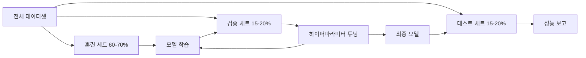

# 모델 평가

> 모델은 측정 방법에 따라 그 가치가 결정됩니다.

**유형:** 구축
**언어:** Python
**사전 요구 사항:** 1단계(확률 및 분포, ML을 위한 통계), 2단계 레슨 1-8
**소요 시간:** ~90분

## 학습 목표

- K-겹 및 계층적 K-겹 교차 검증(K-fold, stratified K-fold cross-validation)을 직접 구현하고, 불균형 데이터에서 계층화(stratification)가 중요한 이유를 설명
- 정밀도(precision), 재현율(recall), F1 점수(F1), AUC-ROC, 회귀 메트릭(MSE, RMSE, MAE, R-squared)을 직접 계산
- 학습 곡선(learning curves)을 해석하여 모델이 고편향(high bias) 또는 고분산(high variance) 문제를 겪는지 진단
- 데이터 누수(data leakage), 잘못된 메트릭 선택, 테스트 세트 오염(test set contamination)을 포함한 일반적인 평가 오류 식별

## 문제 정의

모델을 훈련시켰습니다. 데이터에서 95% 정확도를 기록했습니다. 좋은 결과일까요?

아마도. 아닐 수도 있습니다. 데이터의 95%가 한 클래스에 속한다면, 항상 해당 클래스만 예측하는 모델도 95% 정확도를 기록하지만 전혀 유용하지 않습니다. 훈련에 사용한 동일한 데이터로 평가했다면, 모델이 답을 단순히 암기했을 뿐이므로 95%라는 수치는 의미가 없습니다. 데이터셋에 시간 요소가 포함되어 있고 분할 전 무작위로 섞었다면, 모델이 과거 예측을 위해 미래 데이터를 사용할 수도 있습니다.

모델 평가는 대부분의 ML 프로젝트가 실패하는 지점입니다. 잘못된 지표는 나쁜 모델을 좋아 보이게 만들고, 잘못된 분할은 모델이 부정행위를 하게 하며, 잘못된 비교는 더 나쁜 모델을 선택하게 합니다. 평가를 올바르게 하는 것은 선택 사항이 아닙니다. 이는 실제 데이터에서 작동하는 모델과 배포 즉시 실패하는 모델 사이의 차이입니다.

## 개념

### 훈련, 검증, 테스트



세 가지 분할, 세 가지 목적:

- **훈련 세트**: 모델이 이 데이터로 학습합니다. 훈련 중에 이 예시를 봅니다.
- **검증 세트**: 하이퍼파라미터 튜닝과 모델 선택에 사용됩니다. 모델은 이 데이터로 훈련하지 않지만, 결정에 영향을 받습니다.
- **테스트 세트**: 최종 성능을 보고하기 위해 마지막에 정확히 한 번 사용됩니다. 테스트 성능을 보고 모델을 변경하면 더 이상 테스트 세트가 아닙니다. 두 번째 검증 세트가 됩니다.

테스트 세트는 보고된 성능이 모델이 실제로 본 적 없는 데이터에서 어떻게 수행될지 보장하는 홀드아웃입니다.

### K-폴드 교차 검증

작은 데이터셋에서는 단일 훈련/검증 분할이 데이터를 낭비하고 노이즈가 있는 추정치를 제공합니다. K-폴드 교차 검증은 모든 데이터를 훈련과 검증에 사용합니다:

```mermaid
flowchart TB
    subgraph Fold1["폴드 1"]
        direction LR
        V1["검증"] --- T1a["훈련"] --- T1b["훈련"] --- T1c["훈련"] --- T1d["훈련"]
    end
    subgraph Fold2["폴드 2"]
        direction LR
        T2a["훈련"] --- V2["검증"] --- T2b["훈련"] --- T2c["훈련"] --- T2d["훈련"]
    end
    subgraph Fold3["폴드 3"]
        direction LR
        T3a["훈련"] --- T3b["훈련"] --- V3["검증"] --- T3c["훈련"] --- T3d["훈련"]
    end
    subgraph Fold4["폴드 4"]
        direction LR
        T4a["훈련"] --- T4b["훈련"] --- T4c["훈련"] --- V4["검증"] --- T4d["훈련"]
    end
    subgraph Fold5["폴드 5"]
        direction LR
        T5a["훈련"] --- T5b["훈련"] --- T5c["훈련"] --- T5d["훈련"] --- V5["검증"]
    end
    Fold1 --> R["점수 평균"]
    Fold2 --> R
    Fold3 --> R
    Fold4 --> R
    Fold5 --> R
```



1. 데이터를 K개의 동일한 크기의 폴드로 분할
2. 각 폴드에 대해 K-1개 폴드로 훈련하고 나머지 폴드로 검증
3. K개의 검증 점수를 평균

K=5 또는 K=10이 표준 선택입니다. 모든 데이터 포인트는 정확히 한 번 검증에 사용됩니다. 평균 점수는 단일 분할보다 더 안정적인 추정치입니다.

**계층적 K-폴드**: 각 폴드에서 클래스 분포를 보존합니다. 데이터셋이 70% 클래스 A, 30% 클래스 B라면 각 폴드도 대략 같은 비율을 가집니다. 이는 불균형 데이터셋에서 무작위 분할이 소수 클래스를 한 폴드에 몰아넣는 것을 방지합니다.

### 분류 메트릭

**혼동 행렬**: 기반. 이진 분류의 경우:

|  | 예측 양성 | 예측 음성 |
|--|---|---|
| 실제 양성 | 진양성(TP) | 위음성(FN) |
| 실제 음성 | 위양성(FP) | 진음성(TN) |

이 행렬에서 다른 모든 메트릭이 파생됩니다:

- **정확도** = (TP + TN) / (TP + TN + FP + FN). 올바른 예측의 비율. 클래스가 불균형할 때 오해의 소지가 있습니다.
- **정밀도** = TP / (TP + FP). 양성으로 예측된 것 중 실제 양성인 비율. 위양성이 비용일 때 사용 (예: 스팸 필터가 실제 이메일을 스팸으로 표시).
- **재현율** (민감도) = TP / (TP + FN). 실제 양성 중 포착한 비율. 위음성이 비용일 때 사용 (예: 암 검진에서 종양 놓침).
- **F1 점수** = 2 * 정밀도 * 재현율 / (정밀도 + 재현율). 정밀도와 재현율의 조화 평균. 둘 중 하나가 우세하지 않을 때 균형을 맞춥니다.
- **AUC-ROC**: 수신자 조작 특성 곡선 아래 면적. 다양한 분류 임계값에서 진양성률 대 위양성률을 플롯합니다. AUC = 0.5는 무작위 추측, AUC = 1.0은 완벽한 분리. 임계값 독립적: 모델이 양성과 음성을 얼마나 잘 순위 매기는지 측정합니다. 선택한 임계값과 무관합니다.

### 회귀 메트릭

- **MSE** (평균 제곱 오차) = mean((y_true - y_pred)^2). 큰 오차에 제곱으로 페널티. 이상치에 민감합니다.
- **RMSE** (평균 제곱근 오차) = sqrt(MSE). 목표 변수와 동일한 단위. MSE보다 해석이 쉽습니다.
- **MAE** (평균 절대 오차) = mean(|y_true - y_pred|). 모든 오차를 선형으로 처리. MSE보다 이상치에 강건합니다.
- **R-제곱** = 1 - SS_res / SS_tot, 여기서 SS_res = sum((y_true - y_pred)^2), SS_tot = sum((y_true - y_mean)^2). 모델이 설명하는 분산의 비율. R^2 = 1.0은 완벽. R^2 = 0.0은 모델이 항상 평균을 예측하는 것과 같습니다. R^2는 모델이 평균보다 나쁠 때 음수가 될 수 있습니다.

### 학습 곡선

훈련 세트 크기에 따른 훈련 및 검증 점수를 플롯:

- **고편향(과소적합)**: 두 곡선이 낮은 점수로 수렴. 더 많은 데이터는 도움이 되지 않습니다. 더 복잡한 모델이 필요합니다.
- **고분산(과적합)**: 훈련 점수는 높지만 검증 점수는 훨씬 낮습니다. 두 곡선 간 격차가 큽니다. 더 많은 데이터가 도움이 됩니다.

### 검증 곡선

하이퍼파라미터에 따른 훈련 및 검증 점수를 플롯:

- 낮은 복잡도: 두 점수 모두 낮음 (과소적합)
- 적절한 복잡도: 두 점수가 높고 가까움
- 높은 복잡도: 훈련 점수는 높지만 검증 점수는 하락 (과적합)

최적의 하이퍼파라미터 값은 검증 점수가 최고점일 때입니다.

### 일반적인 평가 실수

**데이터 누수**: 테스트 세트 정보가 훈련으로 유입. 예: 분할 전 전체 데이터셋에 스케일러 적합, 시계열 예측에서 미래 데이터 포함, 목표 변수에서 파생된 특성 사용. 항상 분할 후 전처리합니다.

**클래스 불균형**: 거래의 99%는 정상, 1%는 사기. 항상 "정상"을 예측하는 모델은 99% 정확도를 얻습니다. 정밀도, 재현율, F1, 또는 AUC-ROC를 사용합니다.

**잘못된 메트릭**: 재현율을 최적화해야 할 때 정확도를 최적화 (의료 진단), 또는 데이터에 이상치가 많을 때 RMSE를 최적화 (MAE 사용).

**계층적 분할 미사용**: 불균형 데이터에서 무작위 분할은 검증 폴드에 소수 클래스가 거의 없게 하여 불안정한 추정치를 제공합니다.

**너무 자주 테스트**: 테스트 성능을 보고 조정할 때마다 테스트 세트에 과적합됩니다. 테스트 세트는 단일 사용입니다.

## 빌드하기

### 단계 1: 훈련/검증/테스트 분할

```python
import random
import math


def train_val_test_split(X, y, train_ratio=0.6, val_ratio=0.2, seed=42):
    random.seed(seed)
    n = len(X)
    indices = list(range(n))
    random.shuffle(indices)

    train_end = int(n * train_ratio)
    val_end = int(n * (train_ratio + val_ratio))

    train_idx = indices[:train_end]
    val_idx = indices[train_end:val_end]
    test_idx = indices[val_end:]

    X_train = [X[i] for i in train_idx]
    y_train = [y[i] for i in train_idx]
    X_val = [X[i] for i in val_idx]
    y_val = [y[i] for i in val_idx]
    X_test = [X[i] for i in test_idx]
    y_test = [y[i] for i in test_idx]

    return X_train, y_train, X_val, y_val, X_test, y_test
```

### 단계 2: K-겹 및 계층화 K-겹 교차 검증

```python
def kfold_split(n, k=5, seed=42):
    random.seed(seed)
    indices = list(range(n))
    random.shuffle(indices)

    fold_size = n // k
    folds = []

    for i in range(k):
        start = i * fold_size
        end = start + fold_size if i < k - 1 else n
        val_idx = indices[start:end]
        train_idx = indices[:start] + indices[end:]
        folds.append((train_idx, val_idx))

    return folds


def stratified_kfold_split(y, k=5, seed=42):
    random.seed(seed)

    class_indices = {}
    for i, label in enumerate(y):
        class_indices.setdefault(label, []).append(i)

    for label in class_indices:
        random.shuffle(class_indices[label])

    folds = [{"train": [], "val": []} for _ in range(k)]

    for label, indices in class_indices.items():
        fold_size = len(indices) // k
        for i in range(k):
            start = i * fold_size
            end = start + fold_size if i < k - 1 else len(indices)
            val_part = indices[start:end]
            train_part = indices[:start] + indices[end:]
            folds[i]["val"].extend(val_part)
            folds[i]["train"].extend(train_part)

    return [(f["train"], f["val"]) for f in folds]


def cross_validate(X, y, model_fn, k=5, metric_fn=None, stratified=False):
    n = len(X)

    if stratified:
        folds = stratified_kfold_split(y, k)
    else:
        folds = kfold_split(n, k)

    scores = []
    for train_idx, val_idx in folds:
        X_train = [X[i] for i in train_idx]
        y_train = [y[i] for i in train_idx]
        X_val = [X[i] for i in val_idx]
        y_val = [y[i] for i in val_idx]

        model = model_fn()
        model.fit(X_train, y_train)
        predictions = [model.predict(x) for x in X_val]

        if metric_fn:
            score = metric_fn(y_val, predictions)
        else:
            score = sum(1 for yt, yp in zip(y_val, predictions) if yt == yp) / len(y_val)
        scores.append(score)

    return scores
```

### 단계 3: 혼동 행렬 및 분류 메트릭

```python
def confusion_matrix(y_true, y_pred):
    tp = sum(1 for yt, yp in zip(y_true, y_pred) if yt == 1 and yp == 1)
    tn = sum(1 for yt, yp in zip(y_true, y_pred) if yt == 0 and yp == 0)
    fp = sum(1 for yt, yp in zip(y_true, y_pred) if yt == 0 and yp == 1)
    fn = sum(1 for yt, yp in zip(y_true, y_pred) if yt == 1 and yp == 0)
    return tp, tn, fp, fn


def accuracy(y_true, y_pred):
    tp, tn, fp, fn = confusion_matrix(y_true, y_pred)
    total = tp + tn + fp + fn
    return (tp + tn) / total if total > 0 else 0.0


def precision(y_true, y_pred):
    tp, tn, fp, fn = confusion_matrix(y_true, y_pred)
    return tp / (tp + fp) if (tp + fp) > 0 else 0.0


def recall(y_true, y_pred):
    tp, tn, fp, fn = confusion_matrix(y_true, y_pred)
    return tp / (tp + fn) if (tp + fn) > 0 else 0.0


def f1_score(y_true, y_pred):
    p = precision(y_true, y_pred)
    r = recall(y_true, y_pred)
    return 2 * p * r / (p + r) if (p + r) > 0 else 0.0


def roc_curve(y_true, y_scores):
    thresholds = sorted(set(y_scores), reverse=True)
    tpr_list = []
    fpr_list = []

    total_positives = sum(y_true)
    total_negatives = len(y_true) - total_positives

    for threshold in thresholds:
        y_pred = [1 if s >= threshold else 0 for s in y_scores]
        tp = sum(1 for yt, yp in zip(y_true, y_pred) if yt == 1 and yp == 1)
        fp = sum(1 for yt, yp in zip(y_true, y_pred) if yt == 0 and yp == 1)

        tpr = tp / total_positives if total_positives > 0 else 0.0
        fpr = fp / total_negatives if total_negatives > 0 else 0.0

        tpr_list.append(tpr)
        fpr_list.append(fpr)

    return fpr_list, tpr_list, thresholds


def auc_roc(y_true, y_scores):
    fpr_list, tpr_list, _ = roc_curve(y_true, y_scores)

    pairs = sorted(zip(fpr_list, tpr_list))
    fpr_sorted = [p[0] for p in pairs]
    tpr_sorted = [p[1] for p in pairs]

    area = 0.0
    for i in range(1, len(fpr_sorted)):
        width = fpr_sorted[i] - fpr_sorted[i - 1]
        height = (tpr_sorted[i] + tpr_sorted[i - 1]) / 2
        area += width * height

    return area
```

### 단계 4: 회귀 메트릭

```python
def mse(y_true, y_pred):
    n = len(y_true)
    return sum((yt - yp) ** 2 for yt, yp in zip(y_true, y_pred)) / n


def rmse(y_true, y_pred):
    return math.sqrt(mse(y_true, y_pred))


def mae(y_true, y_pred):
    n = len(y_true)
    return sum(abs(yt - yp) for yt, yp in zip(y_true, y_pred)) / n


def r_squared(y_true, y_pred):
    mean_y = sum(y_true) / len(y_true)
    ss_res = sum((yt - yp) ** 2 for yt, yp in zip(y_true, y_pred))
    ss_tot = sum((yt - mean_y) ** 2 for yt in y_true)
    if ss_tot == 0:
        return 0.0
    return 1.0 - ss_res / ss_tot
```

### 단계 5: 학습 곡선

```python
def learning_curve(X, y, model_fn, metric_fn, train_sizes=None, val_ratio=0.2, seed=42):
    random.seed(seed)
    n = len(X)
    indices = list(range(n))
    random.shuffle(indices)

    val_size = int(n * val_ratio)
    val_idx = indices[:val_size]
    pool_idx = indices[val_size:]

    X_val = [X[i] for i in val_idx]
    y_val = [y[i] for i in val_idx]

    if train_sizes is None:
        train_sizes = [int(len(pool_idx) * r) for r in [0.1, 0.2, 0.4, 0.6, 0.8, 1.0]]

    train_scores = []
    val_scores = []

    for size in train_sizes:
        subset = pool_idx[:size]
        X_train = [X[i] for i in subset]
        y_train = [y[i] for i in subset]

        model = model_fn()
        model.fit(X_train, y_train)

        train_pred = [model.predict(x) for x in X_train]
        val_pred = [model.predict(x) for x in X_val]

        train_scores.append(metric_fn(y_train, train_pred))
        val_scores.append(metric_fn(y_val, val_pred))

    return train_sizes, train_scores, val_scores
```

### 단계 6: 테스트를 위한 간단한 분류기 및 전체 데모

```python
class SimpleLogistic:
    def __init__(self, lr=0.1, epochs=100):
        self.lr = lr
        self.epochs = epochs
        self.weights = None
        self.bias = 0.0

    def sigmoid(self, z):
        z = max(-500, min(500, z))
        return 1.0 / (1.0 + math.exp(-z))

    def fit(self, X, y):
        n_features = len(X[0])
        self.weights = [0.0] * n_features
        self.bias = 0.0

        for _ in range(self.epochs):
            for xi, yi in zip(X, y):
                z = sum(w * x for w, x in zip(self.weights, xi)) + self.bias
                pred = self.sigmoid(z)
                error = yi - pred
                for j in range(n_features):
                    self.weights[j] += self.lr * error * xi[j]
                self.bias += self.lr * error

    def predict_proba(self, x):
        z = sum(w * xi for w, xi in zip(self.weights, x)) + self.bias
        return self.sigmoid(z)

    def predict(self, x):
        return 1 if self.predict_proba(x) >= 0.5 else 0


class SimpleLinearRegression:
    def __init__(self, lr=0.001, epochs=200):
        self.lr = lr
        self.epochs = epochs
        self.weights = None
        self.bias = 0.0

    def fit(self, X, y):
        n_features = len(X[0])
        self.weights = [0.0] * n_features
        self.bias = 0.0
        n = len(X)

        for _ in range(self.epochs):
            for xi, yi in zip(X, y):
                pred = sum(w * x for w, x in zip(self.weights, xi)) + self.bias
                error = yi - pred
                for j in range(n_features):
                    self.weights[j] += self.lr * error * xi[j] / n
                self.bias += self.lr * error / n

    def predict(self, x):
        return sum(w * xi for w, xi in zip(self.weights, x)) + self.bias


def standardize(values):
    n = len(values)
    mean = sum(values) / n
    var = sum((v - mean) ** 2 for v in values) / n
    std = math.sqrt(var) if var > 0 else 1.0
    return [(v - mean) / std for v in values], mean, std


def make_classification_data(n=300, seed=42):
    random.seed(seed)
    X = []
    y = []
    for _ in range(n):
        x1 = random.gauss(0, 1)
        x2 = random.gauss(0, 1)
        label = 1 if (x1 + x2 + random.gauss(0, 0.5)) > 0 else 0
        X.append([x1, x2])
        y.append(label)
    return X, y


def make_regression_data(n=200, seed=42):
    random.seed(seed)
    X = []
    y = []
    for _ in range(n):
        x1 = random.uniform(0, 10)
        x2 = random.uniform(0, 5)
        target = 3 * x1 + 2 * x2 + random.gauss(0, 2)
        X.append([x1, x2])
        y.append(target)
    return X, y


def make_imbalanced_data(n=300, minority_ratio=0.05, seed=42):
    random.seed(seed)
    X = []
    y = []
    for _ in range(n):
        if random.random() < minority_ratio:
            x1 = random.gauss(3, 0.5)
            x2 = random.gauss(3, 0.5)
            label = 1
        else:
            x1 = random.gauss(0, 1)
            x2 = random.gauss(0, 1)
            label = 0
        X.append([x1, x2])
        y.append(label)
    return X, y


if __name__ == "__main__":
    X_clf, y_clf = make_classification_data(300)

    print("=== 훈련/검증/테스트 분할 ===")
    X_train, y_train, X_val, y_val, X_test, y_test = train_val_test_split(X_clf, y_clf)
    print(f"  훈련: {len(X_train)}, 검증: {len(X_val)}, 테스트: {len(X_test)}")
    print(f"  훈련 클래스 분포: {sum(y_train)}/{len(y_train)} 양성")
    print(f"  검증 클래스 분포: {sum(y_val)}/{len(y_val)} 양성")

    model = SimpleLogistic(lr=0.1, epochs=200)
    model.fit(X_train, y_train)

    print("\n=== 분류 메트릭 ===")
    y_pred = [model.predict(x) for x in X_test]
    tp, tn, fp, fn = confusion_matrix(y_test, y_pred)
    print(f"  혼동 행렬: TP={tp}, TN={tn}, FP={fp}, FN={fn}")
    print(f"  정확도:  {accuracy(y_test, y_pred):.4f}")
    print(f"  정밀도: {precision(y_test, y_pred):.4f}")
    print(f"  재현율:    {recall(y_test, y_pred):.4f}")
    print(f"  F1 점수:  {f1_score(y_test, y_pred):.4f}")

    y_scores = [model.predict_proba(x) for x in X_test]
    auc = auc_roc(y_test, y_scores)
    print(f"  AUC-ROC:   {auc:.4f}")

    print("\n=== K-겹 교차 검증 (K=5) ===")
    cv_scores = cross_validate(
        X_clf, y_clf,
        model_fn=lambda: SimpleLogistic(lr=0.1, epochs=200),
        k=5,
        metric_fn=accuracy,
    )
    mean_cv = sum(cv_scores) / len(cv_scores)
    std_cv = math.sqrt(sum((s - mean_cv) ** 2 for s in cv_scores) / len(cv_scores))
    print(f"  폴드 점수: {[round(s, 4) for s in cv_scores]}")
    print(f"  평균: {mean_cv:.4f} (+/- {std_cv:.4f})")

    print("\n=== 계층화 K-겹 교차 검증 (K=5) ===")
    strat_scores = cross_validate(
        X_clf, y_clf,
        model_fn=lambda: SimpleLogistic(lr=0.1, epochs=200),
        k=5,
        metric_fn=accuracy,
        stratified=True,
    )
    strat_mean = sum(strat_scores) / len(strat_scores)
    strat_std = math.sqrt(sum((s - strat_mean) ** 2 for s in strat_scores) / len(strat_scores))
    print(f"  폴드 점수: {[round(s, 4) for s in strat_scores]}")
    print(f"  평균: {strat_mean:.4f} (+/- {strat_std:.4f})")

    print("\n=== 불균형 데이터: 정확도가 속이는 이유 ===")
    X_imb, y_imb = make_imbalanced_data(300, minority_ratio=0.05)
    positives = sum(y_imb)
    print(f"  클래스 분포: {positives} 양성, {len(y_imb) - positives} 음성 ({positives/len(y_imb)*100:.1f}% 양성)")

    always_negative = [0] * len(y_imb)
    print(f"  항상 음성 기준선:")
    print(f"    정확도:  {accuracy(y_imb, always_negative):.4f}")
    print(f"    정밀도: {precision(y_imb, always_negative):.4f}")
    print(f"    재현율:    {recall(y_imb, always_negative):.4f}")
    print(f"    F1 점수:  {f1_score(y_imb, always_negative):.4f}")

    X_tr_i, y_tr_i, X_v_i, y_v_i, X_te_i, y_te_i = train_val_test_split(X_imb, y_imb)
    model_imb = SimpleLogistic(lr=0.5, epochs=500)
    model_imb.fit(X_tr_i, y_tr_i)
    y_pred_imb = [model_imb.predict(x) for x in X_te_i]
    print(f"\n  불균형 데이터에 훈련된 모델:")
    print(f"    정확도:  {accuracy(y_te_i, y_pred_imb):.4f}")
    print(f"    정밀도: {precision(y_te_i, y_pred_imb):.4f}")
    print(f"    재현율:    {recall(y_te_i, y_pred_imb):.4f}")
    print(f"    F1 점수:  {f1_score(y_te_i, y_pred_imb):.4f}")

    print("\n=== 회귀 메트릭 ===")
    X_reg, y_reg = make_regression_data(200)

    col0 = [x[0] for x in X_reg]
    col1 = [x[1] for x in X_reg]
    col0_s, m0, s0 = standardize(col0)
    col1_s, m1, s1 = standardize(col1)
    X_reg_scaled = [[col0_s[i], col1_s[i]] for i in range(len(X_reg))]

    X_tr_r, y_tr_r, X_v_r, y_v_r, X_te_r, y_te_r = train_val_test_split(X_reg_scaled, y_reg)
    reg_model = SimpleLinearRegression(lr=0.01, epochs=500)
    reg_model.fit(X_tr_r, y_tr_r)
    y_pred_r = [reg_model.predict(x) for x in X_te_r]

    print(f"  MSE:       {mse(y_te_r, y_pred_r):.4f}")
    print(f"  RMSE:      {rmse(y_te_r, y_pred_r):.4f}")
    print(f"  MAE:       {mae(y_te_r, y_pred_r):.4f}")
    print(f"  R-제곱:    {r_squared(y_te_r, y_pred_r):.4f}")

    mean_baseline = [sum(y_tr_r) / len(y_tr_r)] * len(y_te_r)
    print(f"\n  평균 기준선:")
    print(f"    MSE:       {mse(y_te_r, mean_baseline):.4f}")
    print(f"    R-제곱:    {r_squared(y_te_r, mean_baseline):.4f}")

    print("\n=== 학습 곡선 ===")
    sizes, train_sc, val_sc = learning_curve(
        X_clf, y_clf,
        model_fn=lambda: SimpleLogistic(lr=0.1, epochs=200),
        metric_fn=accuracy,
    )
    print(f"  {'크기':>6} {'훈련':>8} {'검증':>8}")
    for s, tr, va in zip(sizes, train_sc, val_sc):
        print(f"  {s:>6} {tr:>8.4f} {va:>8.4f}")

    print("\n=== 통계적 모델 비교 ===")
    model_a_scores = cross_validate(
        X_clf, y_clf,
        model_fn=lambda: SimpleLogistic(lr=0.1, epochs=100),
        k=5, metric_fn=accuracy,
    )
    model_b_scores = cross_validate(
        X_clf, y_clf,
        model_fn=lambda: SimpleLogistic(lr=0.1, epochs=500),
        k=5, metric_fn=accuracy,
    )
    diffs = [a - b for a, b in zip(model_a_scores, model_b_scores)]
    mean_diff = sum(diffs) / len(diffs)
    std_diff = math.sqrt(sum((d - mean_diff) ** 2 for d in diffs) / len(diffs))
    t_stat = mean_diff / (std_diff / math.sqrt(len(diffs))) if std_diff > 0 else 0.0
    print(f"  모델 A (100 에포크) 평균: {sum(model_a_scores)/len(model_a_scores):.4f}")
    print(f"  모델 B (500 에포크) 평균: {sum(model_b_scores)/len(model_b_scores):.4f}")
    print(f"  평균 차이: {mean_diff:.4f}")
    print(f"  대응 t-통계량: {t_stat:.4f}")
    print(f"  (|t| > 2.78 for 유의성 p<0.05 with df=4)")
```

## 사용 방법

scikit-learn에서는 평가가 워크플로에 내장되어 있습니다:

```python
from sklearn.model_selection import cross_val_score, StratifiedKFold, learning_curve
from sklearn.metrics import (
    accuracy_score, precision_score, recall_score, f1_score,
    roc_auc_score, confusion_matrix, mean_squared_error, r2_score,
)
from sklearn.linear_model import LogisticRegression

model = LogisticRegression()
scores = cross_val_score(model, X, y, cv=StratifiedKFold(5), scoring="f1")
```

처음부터 구현하는 버전은 교차 검증이 정확히 어떻게 동작하는지(마법 없이 for-루프와 인덱스 추적만 사용), 각 메트릭이 어떻게 계산되는지(TP/FP/TN/FN을 단순히 카운트), 그리고 층화(Stratification)가 왜 중요한지(각 폴드에서 클래스 비율 유지) 보여줍니다. 라이브러리 버전은 병렬 처리, 더 많은 평가 옵션, 파이프라인과의 통합 기능을 추가합니다.

## Ship It

이 레슨은 다음을 생성합니다:
- `outputs/skill-evaluation.md` - 분류 및 회귀 모델의 평가 전략을 다루는 기술 문서

## 연습 문제

1. 정밀도-재현율 곡선 구현: 다양한 임계값에서 정밀도 vs 재현율을 플롯하세요. 평균 정밀도(PR 곡선 아래 면적)를 계산하세요. 불균형 데이터셋에서 PR 곡선과 ROC 곡선을 비교하고, 각각 어떤 경우에 더 유익한지 설명하세요.  
   - **전문 용어**: 정밀도(precision), 재현율(recall), 임계값(threshold), 평균 정밀도(average precision), ROC 곡선(ROC curve), 불균형 데이터셋(imbalanced dataset)

2. 중첩 교차 검증 구현: 외부 루프는 모델 성능을 평가하고, 내부 루프는 하이퍼파라미터를 튜닝하세요. 검증 데이터가 평가에 누출되지 않도록 두 모델을 공정하게 비교하는 데 사용하세요.  
   - **전문 용어**: 중첩 교차 검증(nested cross-validation), 하이퍼파라미터(hyperparameter), 검증 데이터(validation data)

3. 순열 검정 구현: 레이블을 섞고 재학습한 후 성능을 측정하세요. 100번 반복하여 귀무가설 분포를 구축하세요. 관측된 모델 성능에 대한 p-value를 계산하세요.  
   - **전문 용어**: 순열 검정(permutation test), 귀무가설(null hypothesis), p-value, 레이블(label)

## 주요 용어

| 용어 | 사람들이 말하는 표현 | 실제 의미 |
|------|----------------|----------------------|
| 과적합(overfitting) | "훈련 데이터를 암기한다" | 모델이 훈련 데이터의 노이즈를 포착하여 훈련 데이터에서는 잘 작동하지만 새로운 데이터에서는 성능이 떨어짐 |
| 교차 검증(cross-validation) | "다른 부분집합에서 테스트한다" | 데이터의 어떤 부분을 검증에 사용할지 체계적으로 순환하며, 모든 순환에서 결과를 평균화함 |
| 정밀도(precision) | "예측한 양성 중 몇 개가 맞는가" | TP / (TP + FP): 양성 예측 중 실제로 양성인 비율 |
| 재현율(recall) | "실제 양성 중 몇 개를 찾았는가" | TP / (TP + FN): 실제 양성 중 올바르게 식별된 비율 |
| AUC-ROC | "모델이 클래스를 얼마나 잘 구분하는가" | 0.5(무작위)부터 1.0(완벽)까지 모든 임계값에서 진양성률 대 거짓양성률 곡선의 면적 |
| 결정 계수(R-squared) | "얼마나 분산을 설명하는가" | 1 - (잔차 제곱합 / 총 제곱합): 모델이 포착한 목표 변수의 분산 비율 |
| 데이터 누수(data leakage) | "모델이 부정행위를 했다" | 예측 시점에 사용할 수 없는 정보를 훈련에 사용하여 낙관적인 평가 결과를 초래함 |
| 학습 곡선(learning curve) | "더 많은 데이터로 성능이 어떻게 변하는가" | 훈련 및 검증 점수를 훈련 세트 크기에 따라 그린 플롯으로 과소적합 또는 과적합을 나타냄 |
| 계층화 분할(stratified split) | "클래스 비율을 균형 있게 유지한다" | 전체 데이터셋과 동일한 각 클래스 비율을 유지하도록 데이터를 분할함 |

## 추가 자료

- [scikit-learn 모델 선택 가이드](https://scikit-learn.org/stable/model_selection.html) - 교차 검증, 메트릭, 하이퍼파라미터 튜닝에 대한 종합 참고 자료
- [정확도 그 이상: 정밀도와 재현율 (Google ML 크래시 코스)](https://developers.google.com/machine-learning/crash-course/classification/precision-and-recall) - 인터랙티브 예제와 함께 명확한 설명
- [모델 선택을 위한 교차 검증 절차 조사 (Arlot & Celisse, 2010)](https://projecteuclid.org/journals/statistics-surveys/volume-4/issue-none/A-survey-of-cross-validation-procedures-for-model-selection/10.1214/09-SS054.full) - 다양한 교차 검증 전략의 적용 시기와 이유에 대한 엄밀한 분석