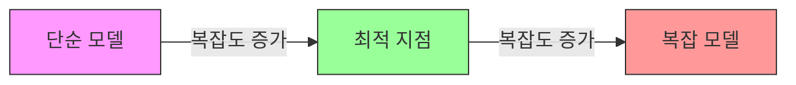
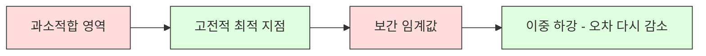
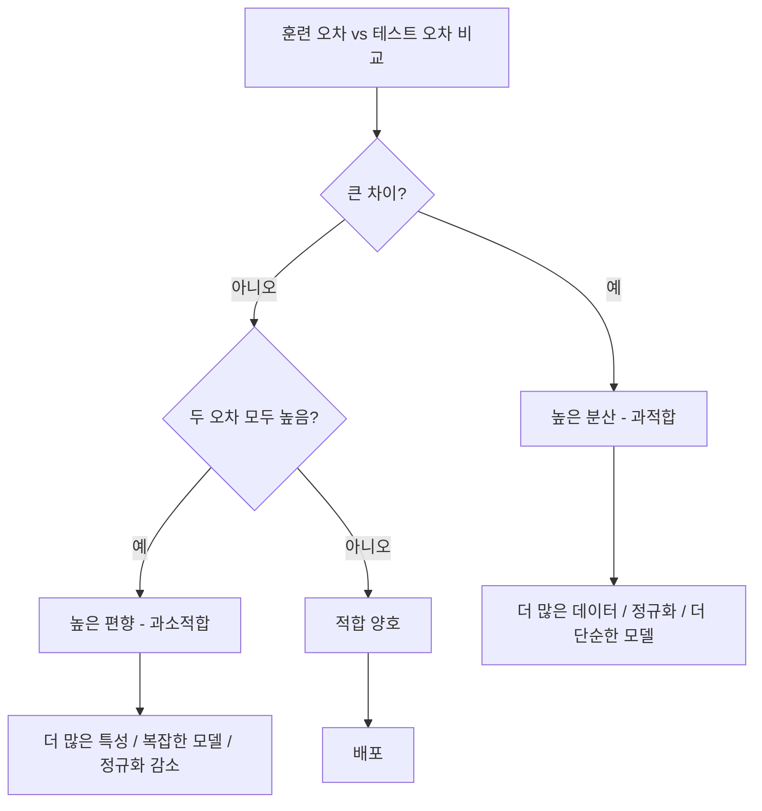
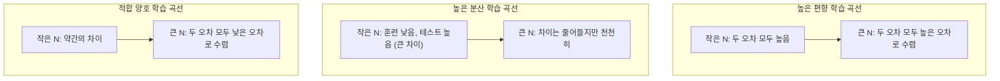
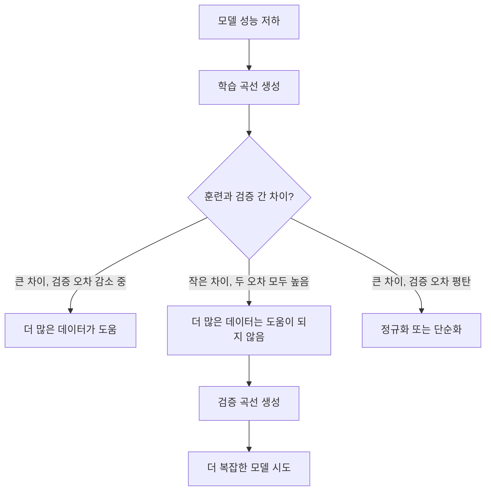

# 편향-분산 트레이드오프

> 모든 모델 오차는 편향, 분산, 노이즈 중 하나에서 비롯됩니다. 처음 두 가지만 제어할 수 있습니다.

**유형:** 학습  
**언어:** Python  
**선수 지식:** 2단계, 레슨 01-09 (ML 기초, 회귀, 분류, 평가)  
**소요 시간:** ~75분

## 학습 목표

- 예상 예측 오차의 편향-분산 분해를 유도하고, 환원 불가능한 노이즈(irreducible noise)의 역할을 설명
- 훈련 및 테스트 오차 패턴을 사용하여 모델이 고편향(high bias) 또는 고분산(high variance) 문제를 겪는지 진단
- 정규화 기법(L1, L2, 드롭아웃(dropout), 조기 종료(early stopping))이 편향과 분산을 어떻게 교환하는지 설명
- 복잡도가 증가하는 모델들에 걸쳐 편향-분산 트레이드오프를 시각화하는 실험 구현

## 문제 정의

모델을 훈련시켰습니다. 테스트 데이터에서 일부 오차가 발생합니다. 이 오차는 어디에서 오는 것일까요?

모델이 너무 단순하다면(예: 곡선형 데이터셋에 선형 회귀 적용), 실제 패턴을 지속적으로 놓칩니다. 이는 **편향(bias)** 입니다. 반면 모델이 너무 복잡하다면(예: 15개 데이터 포인트에 20차 다항식 적용), 훈련 데이터에는 완벽하게 적합되지만 새로운 데이터에서는 완전히 다른 예측을 내놓습니다. 이는 **분산(variance)** 입니다.

고정된 모델 용량에서 편향과 분산을 동시에 최소화할 수 없습니다. 편향을 줄이면 분산이 증가하고, 분산을 줄이면 편향이 증가합니다. 이 트레이드오프를 이해하는 것은 머신러닝에서 가장 유용한 진단 기술입니다. 이를 통해 모델을 더 복잡하게 할지 단순화할지, 더 많은 데이터를 수집할지 더 나은 특징을 공학적으로 설계할지, 정규화를 강화할지 완화할지 결정할 수 있습니다.

## 개념

### 편향: 체계적 오차

편향은 모델의 평균 예측값이 실제 값과 얼마나 떨어져 있는지를 측정합니다. 동일한 분포에서 추출한 여러 훈련 세트로 동일한 모델을 훈련하고 예측값을 평균화했을 때, 편향은 그 평균과 실제 값 사이의 차이입니다.

높은 편향은 모델이 실제 패턴을 포착하기에는 너무 경직되어 있음을 의미합니다. 포물선에 직선을 맞추면 데이터가 아무리 많아도 곡선을 항상 놓칩니다. 이는 과소적합(underfitting)입니다.

```
높은 편향 (과소적합):
  모델은 항상 대략 같은 잘못된 값을 예측합니다.
  훈련 오차: 높음
  테스트 오차: 높음
  두 오차 간 차이: 작음
```

### 분산: 훈련 데이터 민감도

분산은 다른 데이터 하위 집합으로 훈련할 때 예측값이 얼마나 변하는지를 측정합니다. 훈련 세트의 작은 변화가 모델에 큰 변화를 일으키면 분산이 높습니다.

높은 분산은 모델이 훈련 데이터의 노이즈를 맞추고 있음을 의미합니다. 20차 다항식은 모든 훈련 포인트를 통과하지만 그 사이에서 심하게 진동합니다. 이는 과적합(overfitting)입니다.

```
높은 분산 (과적합):
  모델은 훈련 데이터를 완벽하게 맞추지만 새로운 데이터에서는 실패합니다.
  훈련 오차: 낮음
  테스트 오차: 높음
  두 오차 간 차이: 큼
```

### 오차 분해

제곱 오차 하에서 어떤 점 x에 대한 예상 예측 오차는 정확히 다음과 같이 분해됩니다:

```
예상 오차 = 편향^2 + 분산 + 제거 불가능한 노이즈

여기서:
  편향^2   = (E[f_hat(x)] - f(x))^2
  분산 = E[(f_hat(x) - E[f_hat(x)])^2]
  노이즈    = E[(y - f(x))^2]             (시그마^2)
```

- `f(x)`는 실제 함수
- `f_hat(x)`는 모델의 예측
- `E[...]`는 다른 훈련 세트에 대한 기대값
- `y`는 관측된 레이블 (실제 함수 + 노이즈)

노이즈 항은 제거할 수 없습니다. 어떤 모델도 노이즈가 있는 데이터에서 시그마^2보다 더 나은 성능을 낼 수 없습니다. 편향^2와 분산 사이의 적절한 균형을 찾는 것이 목표입니다.

### 모델 복잡도 vs 오차



고전적인 U자형 곡선:

| 복잡도 | 편향 | 분산 | 총 오차 |
|-----------|------|----------|-------------|
| 너무 낮음 | 높음 | 낮음 | 높음 (과소적합) |
| 적당함 | 보통 | 보통 | 최저 |
| 너무 높음 | 낮음 | 높음 | 높음 (과적합) |

### 정규화: 편향-분산 제어

정규화는 분산을 줄이기 위해 의도적으로 편향을 증가시킵니다. 모델이 노이즈를 추적하지 못하도록 제약을 가합니다.

- **L2 (릿지):** 모든 가중치를 0으로 축소합니다. 모든 특성을 유지하지만 영향력을 줄입니다.
- **L1 (라소):** 일부 가중치를 정확히 0으로 만듭니다. 특성 선택을 수행합니다.
- **드롭아웃:** 훈련 중 뉴런을 무작위로 비활성화합니다. 중복 표현을 강제합니다.
- **조기 종료:** 모델이 훈련 데이터를 완전히 맞추기 전에 훈련을 중단합니다.

정규화 강도(람다, 드롭아웃 비율, 에포크 수)는 편향-분산 곡선에서 어디에 위치할지 직접 제어합니다. 정규화가 강할수록 편향은 증가하고 분산은 감소합니다.

### 이중 하강: 현대적 관점

고전 이론은 다음과 같이 말합니다: 최적 지점 이후에는 복잡도 증가가 항상 해롭습니다. 하지만 2019년 이후 연구에서는 예상치 못한 현상이 발견되었습니다. 모델 용량을 훈련 데이터를 완벽하게 맞출 수 있는 지점(보간 임계값)을 훨씬 넘어서 계속 증가시키면 테스트 오차가 다시 감소할 수 있습니다.



이 "이중 하강" 현상은 훈련 예제보다 훨씬 많은 매개변수를 가진 대규모 신경망(overparameterized neural networks)이 여전히 잘 일반화되는 이유를 설명합니다. 고전적인 편향-분산 트레이드오프는 틀리지 않았지만, 현대 영역에서는 불완전합니다.

이중 하강에 대한 주요 관찰:
- 선형 모델, 결정 트리, 신경망에서 발생
- 보간 영역에서 더 많은 데이터가 오히려 성능을 저하시킬 수 있음(샘플 기반 이중 하강)
- 더 많은 훈련 에포크도 이를 유발할 수 있음(에포크 기반 이중 하강)
- 정규화는 피크를 완화하지만 제거하지는 못함

왜 이런 현상이 발생할까요? 보간 임계값에서 모델은 모든 훈련 포인트를 맞출 수 있는 최소한의 용량을 가집니다. 모든 포인트를 통과하는 매우 특정한 해로 강제되며, 데이터의 작은 변동이 적합에 큰 변화를 일으킵니다. 여기서 분산이 최고점에 도달합니다. 임계값을 넘어서면 모델은 데이터를 완벽하게 맞추는 여러 가능한 해를 가집니다. 학습 알고리즘(예: 암시적 정규화를 가진 경사 하강법)은 이들 중 가장 단순한 해를 선택하는 경향이 있습니다. 과매개변수화된 모델이 일반화되는 이유는 이러한 단순한 해에 대한 암시적 편향 때문입니다.

| 영역 | 매개변수 vs 샘플 | 동작 |
|--------|----------------------|----------|
| 과소매개변수화 | p << n | 고전적 트레이드오프 적용 |
| 보간 임계값 | p ~ n | 분산 최고점, 테스트 오차 급증 |
| 과매개변수화 | p >> n | 암시적 정규화 작동, 테스트 오차 감소 |

실용적 목적: 신경망이나 대규모 트리 앙상블을 사용한다면 보간 임계값에서 멈추지 마세요. 임계값 훨씬 아래(명시적 정규화 사용) 또는 훨씬 위(임계값 초과)로 이동하세요. 가장 나쁜 위치는 임계값 바로 그 지점입니다.

### 모델 진단



| 증상 | 진단 | 해결책 |
|---------|-----------|-----|
| 높은 훈련 오차, 높은 테스트 오차 | 편향 | 더 많은 특성, 복잡한 모델, 정규화 감소 |
| 낮은 훈련 오차, 높은 테스트 오차 | 분산 | 더 많은 데이터, 정규화, 더 단순한 모델, 드롭아웃 |
| 낮은 훈련 오차, 낮은 테스트 오차 | 적합 양호 | 배포 |
| 훈련 오차 감소, 테스트 오차 증가 | 과적합 진행 중 | 조기 종료 |

### 실용적 전략

**편향이 문제일 때:**
- 다항식 또는 상호작용 특성 추가
- 더 유연한 모델 사용(선형 대신 트리 앙상블)
- 정규화 강도 감소
- 더 오래 훈련(아직 수렴하지 않은 경우)

**분산이 문제일 때:**
- 더 많은 훈련 데이터 확보
- 배깅(랜덤 포레스트) 사용
- 정규화 증가(더 높은 람다, 더 많은 드롭아웃)
- 특성 선택(잡음 많은 특성 제거)
- 교차 검증으로 조기 발견

### 앙상블 방법과 분산 감소

앙상블 방법은 분산과 싸우는 가장 실용적인 도구입니다.

**배깅(Bootstrap Aggregating)**은 훈련 데이터의 다른 부트스트랩 샘플로 여러 모델을 훈련한 후 예측값을 평균화합니다. 개별 모델은 분산이 높지만 평균은 분산이 훨씬 낮습니다. 랜덤 포레스트는 결정 트리에 배깅을 적용한 것입니다.

수학적 원리: N개의 독립적인 예측을 평균화하면 각 예측의 분산이 시그마^2일 때 평균의 분산은 시그마^2 / N입니다. 모델들은 완전히 독립적이지 않으므로(모두 유사한 데이터를 봄) 감소율은 1/N보다 작지만 여전히 상당합니다.

**부스팅**은 순차적으로 모델을 구축하며, 각 새로운 모델은 지금까지 앙상블의 오차에 집중함으로써 편향을 감소시킵니다. 그래디언트 부스팅과 AdaBoost가 대표적인 예입니다. 부스팅은 모델을 너무 많이 추가하면 과적합될 수 있으므로 조기 종료 또는 정규화가 필요합니다.

| 방법 | 주요 효과 | 편향 변화 | 분산 변화 |
|--------|---------------|-------------|-----------------|
| 배깅 | 분산 감소 | 변화 없음 | 감소 |
| 부스팅 | 편향 감소 | 감소 | 증가 가능 |
| 스태킹 | 둘 다 감소 | 메타 러너에 따라 다름 | 기본 모델에 따라 다름 |
| 드롭아웃 | 암시적 배깅 | 약간 증가 | 감소 |

**실용적 규칙:** 기본 모델의 분산이 높다면(깊은 트리, 고차 다항식) 배깅을 사용하세요. 기본 모델의 편향이 높다면(얕은 스텀프, 단순 선형 모델) 부스팅을 사용하세요.

### 학습 곡선

학습 곡선은 훈련 세트 크기에 따른 훈련 및 검증 오차를 플롯합니다. 단일 훈련/테스트 비교와 달리 학습 곡선은 모델의 궤적을 보여주고 더 많은 데이터가 도움이 될지 알려줍니다.



해석 방법:

| 시나리오 | 훈련 오차 | 검증 오차 | 차이 | 의미 | 해결책 |
|----------|---------------|-----------------|-----|---------------|------------|
| 높은 편향 | 높음 | 높음 | 작음 | 모델이 패턴을 포착하지 못함 | 더 많은 특성, 복잡한 모델, 정규화 감소 |
| 높은 분산 | 낮음 | 높음 | 큼 | 모델이 훈련 데이터를 암기함 | 더 많은 데이터, 정규화, 더 단순한 모델 |
| 적합 양호 | 보통 | 보통 | 작음 | 모델이 잘 일반화됨 | 배포 |
| 높은 분산, 개선 중 | 낮음 | 더 많은 데이터로 감소 | 줄어듦 | 데이터가 해결할 수 있는 분산 문제 | 더 많은 데이터 수집 |
| 높은 편향, 평탄 | 높음 | 높고 평탄 | 작고 평탄 | 더 많은 데이터는 도움이 되지 않음 | 모델 아키텍처 변경 |

중요한 통찰: 두 곡선이 모두 평탄화되고 차이는 작지만 오차가 높다면 더 많은 데이터는 무의미합니다. 더 나은 모델이 필요합니다. 차이가 크고 여전히 줄어들고 있다면 더 많은 데이터가 도움이 됩니다.

### 학습 곡선 생성 방법

두 가지 접근 방식이 있습니다:

**접근 방식 1: 훈련 세트 크기 변동, 모델 고정.** 모델과 하이퍼파라미터를 일정하게 유지합니다. 훈련 데이터의 점점 더 큰 하위 집합으로 훈련합니다. 각 크기에서 훈련 오차와 검증 오차를 측정합니다. 이는 표준 학습 곡선입니다.

**접근 방식 2: 모델 복잡도 변동, 데이터 고정.** 데이터를 일정하게 유지합니다. 복잡도 매개변수(다항식 차수, 트리 깊이, 레이어 수)를 스윕합니다. 각 복잡도에서 훈련 오차와 검증 오차를 측정합니다. 이는 검증 곡선이며 편향-분산 트레이드오프를 직접 보여줍니다.

두 접근 방식은 서로 보완적입니다. 첫 번째는 더 많은 데이터가 도움이 될지 알려줍니다. 두 번째는 다른 모델이 도움이 될지 알려줍니다. 다음 단계에 대한 결정을 내리기 전에 둘 다 실행하세요.



## 구축 방법

`code/bias_variance.py`의 코드는 편향-분산 분해 실험을 전체적으로 실행합니다. 단계별 접근 방식은 다음과 같습니다.

### 1단계: 알려진 함수에서 합성 데이터 생성

가우시안 노이즈가 포함된 `f(x) = sin(1.5x) + 0.5x`를 사용합니다. 실제 함수를 알면 정확한 편향과 분산을 계산할 수 있습니다.

```python
def true_function(x):
    return np.sin(1.5 * x) + 0.5 * x

def generate_data(n_samples=30, noise_std=0.5, x_range=(-3, 3), seed=None):
    rng = np.random.RandomState(seed)
    x = rng.uniform(x_range[0], x_range[1], n_samples)
    y = true_function(x) + rng.normal(0, noise_std, n_samples)
    return x, y
```

### 2단계: 부트스트랩 샘플링 및 다항식 피팅

각 다항식 차수에 대해 여러 부트스트랩 훈련 세트를 생성하고 다항식을 피팅한 후 고정된 테스트 그리드에서의 예측을 기록합니다. 이를 통해 각 테스트 포인트에서 예측 분포를 얻을 수 있습니다.

```python
def fit_polynomial(x_train, y_train, degree, lam=0.0):
    X = np.column_stack([x_train ** d for d in range(degree + 1)])
    if lam > 0:
        penalty = lam * np.eye(X.shape[1])
        penalty[0, 0] = 0
        w = np.linalg.solve(X.T @ X + penalty, X.T @ y_train)
    else:
        w = np.linalg.lstsq(X, y_train, rcond=None)[0]
    return w
```

200개의 서로 다른 부트스트랩 샘플에 대해 피팅합니다. 각 부트스트랩 샘플은 동일한 기본 분포에서 추출되지만 다른 데이터 포인트를 포함합니다.

### 3단계: 편향², 분산 분해 계산

각 테스트 포인트에서 200개의 예측 세트를 사용하여 정의를 기반으로 직접 분해를 계산할 수 있습니다:

```python
mean_pred = predictions.mean(axis=0)
bias_sq = np.mean((mean_pred - y_true) ** 2)
variance = np.mean(predictions.var(axis=0))
total_error = np.mean(np.mean((predictions - y_true) ** 2, axis=1))
```

- `mean_pred`는 부트스트랩 샘플에서 추정된 E[f_hat(x)]입니다.
- `bias_sq`는 평균 예측과 실제 값 사이의 제곱 차이입니다.
- `variance`는 부트스트랩 샘플 간 예측의 평균 분산입니다.
- `total_error`는 편향² + 분산 + 노이즈와 대략 같아야 합니다.

### 4단계: 학습 곡선

학습 곡선은 모델 복잡도를 고정한 상태에서 훈련 세트 크기를 변화시킵니다. 모델이 데이터 부족인지 용량 부족인지 확인할 수 있습니다.

```python
def demo_learning_curves():
    sizes = [10, 15, 20, 30, 50, 75, 100, 150, 200, 300]
    degree = 5

    for n in sizes:
        train_errors = []
        test_errors = []
        for seed in range(50):
            x_train, y_train = generate_data(n_samples=n, seed=seed * 100)
            w = fit_polynomial(x_train, y_train, degree)
            train_pred = predict_polynomial(x_train, w)
            train_mse = np.mean((train_pred - y_train) ** 2)
            test_pred = predict_polynomial(x_test, w)
            test_mse = np.mean((test_pred - y_test) ** 2)
            train_errors.append(train_mse)
            test_errors.append(test_mse)
        # 실행 평균을 통해 학습 곡선 포인트를 얻습니다.
```

고분산 모델(작은 데이터에서의 차수 5)의 경우:
- 훈련 오류는 낮게 시작하여 더 많은 데이터로 인해 암기화가 어려워지면 증가합니다.
- 테스트 오류는 높게 시작하여 모델이 더 많은 신호를 얻으면서 감소합니다.
- 데이터 증가로 인해 격차가 줄어듭니다.

고편향 모델(차수 1)의 경우, 두 오류 모두 빠르게 동일한 높은 값으로 수렴하며 더 많은 데이터가 도움이 되지 않습니다.

### 5단계: 정규화 스윕

코드에는 `demo_regularization_sweep()`도 포함되어 있으며, 고정 차수 다항식(차수 15)을 사용하고 Ridge 정규화 강도를 0.001에서 100까지 변화시킵니다. 이는 모델 복잡도를 변화시키는 대신 제약 강도를 변화시키는 다른 각도에서 편향-분산 트레이드오프를 보여줍니다.

```python
def demo_regularization_sweep():
    alphas = [0.001, 0.005, 0.01, 0.05, 0.1, 0.5, 1.0, 5.0, 10.0, 50.0, 100.0]
    for alpha in alphas:
        results = bias_variance_decomposition([15], lam=alpha)
        r = results[15]
        print(f"alpha={alpha:.3f}  bias={r['bias_sq']:.4f}  var={r['variance']:.4f}")
```

낮은 알파에서는 차수 15 다항식이 거의 제약 없이 작동합니다. 각 부트스트랩 샘플의 노이즈를 추적하기 때문에 분산이 우세합니다. 높은 알파에서는 페널티가 매우 강력하여 모델이 사실상 상수 함수에 가까워집니다. 편향이 우세합니다. 최적의 알파는 이 두 극단 사이에 위치합니다.

이는 다항식 차수를 변화시킬 때 나타나는 U-곡선과 동일하지만, 이산적인 조절 대신 연속적인 조절로 제어됩니다. 실제로 정규화는 특성 집합을 변경하지 않고도 세밀한 제어가 가능하기 때문에 트레이드오프를 제어하는 데 선호되는 방법입니다.

## 사용 방법

sklearn은 부트스트랩 루프를 작성하지 않고도 이러한 진단을 자동화할 수 있는 `learning_curve`와 `validation_curve`를 제공합니다.

### 검증 곡선: 모델 복잡도 탐색

```python
from sklearn.model_selection import validation_curve
from sklearn.pipeline import make_pipeline
from sklearn.preprocessing import PolynomialFeatures
from sklearn.linear_model import Ridge

degrees = list(range(1, 16))
train_scores_all = []
val_scores_all = []

for d in degrees:
    pipe = make_pipeline(PolynomialFeatures(d), Ridge(alpha=0.01))
    train_scores, val_scores = validation_curve(
        pipe, X, y, param_name="polynomialfeatures__degree",
        param_range=[d], cv=5, scoring="neg_mean_squared_error"
    )
    train_scores_all.append(-train_scores.mean())
    val_scores_all.append(-val_scores.mean())
```

이를 통해 편향-분산 트레이드오프 곡선을 직접 얻을 수 있습니다. 검증 점수가 훈련 점수에 비해 가장 나쁜 지점에서는 분산이 우세합니다. 둘 다 나쁜 경우에는 편향이 우세합니다.

### 학습 곡선: 훈련 세트 크기 탐색

```python
from sklearn.model_selection import learning_curve

pipe = make_pipeline(PolynomialFeatures(5), Ridge(alpha=0.01))
train_sizes, train_scores, val_scores = learning_curve(
    pipe, X, y, train_sizes=np.linspace(0.1, 1.0, 10),
    cv=5, scoring="neg_mean_squared_error"
)
train_mse = -train_scores.mean(axis=1)
val_mse = -val_scores.mean(axis=1)
```

`train_mse`와 `val_mse`를 `train_sizes`에 대해 플롯합니다. 이 모양은 모델에 대한 모든 정보를 알려줍니다.

### 정규화 강도 탐색과 교차 검증

```python
from sklearn.model_selection import cross_val_score

alphas = [0.001, 0.01, 0.1, 1.0, 10.0, 100.0]
for alpha in alphas:
    pipe = make_pipeline(PolynomialFeatures(10), Ridge(alpha=alpha))
    scores = cross_val_score(pipe, X, y, cv=5, scoring="neg_mean_squared_error")
    print(f"alpha={alpha:>7.3f}  MSE={-scores.mean():.4f} +/- {scores.std():.4f}")
```

이것은 고정된 모델 복잡도에 대해 정규화 강도를 탐색합니다. 동일한 편향-분산 트레이드오프를 확인할 수 있습니다: 낮은 알파는 높은 분산을, 높은 알파는 높은 편향을 의미합니다.

### 종합 진단 워크플로우

실제 작업에서는 다음과 같은 순서로 진단을 수행합니다:

1. 모델을 훈련합니다. 훈련 및 테스트 오차를 계산합니다.
2. 둘 다 높다면 편향 문제가 있습니다. 4단계로 건너뜁니다.
3. 훈련 오차는 낮지만 테스트 오차가 높다면 분산 문제가 있습니다. 학습 곡선을 생성하여 더 많은 데이터가 도움이 되는지 확인합니다. 도움이 되지 않는다면 정규화를 적용합니다.
4. 주요 복잡도 매개변수를 탐색하는 검증 곡선을 생성합니다. 최적의 지점을 찾습니다.
5. 최적 지점에서 학습 곡선을 생성합니다. 격차가 여전히 크다면 더 많은 데이터 또는 정규화가 필요합니다.
6. `cross_val_score`를 사용하여 다양한 알파 값으로 Ridge/Lasso를 시도합니다. 교차 검증 오차가 가장 낮은 알파를 선택합니다.

대부분의 테이블 형식 데이터셋에 대해 이 과정은 10-15분의 계산 시간이 소요되며, 추측에 소요되는 시간을 절약할 수 있습니다.

## Ship It

이 레슨은 다음을 생성합니다: `outputs/prompt-model-diagnostics.md`

## 연습 문제

1. `noise_std=0` (노이즈 없음)으로 분해(decomposition)를 실행해 보세요. 불가분 오차(irreducible error) 항은 어떻게 되나요? 최적 복잡도(optimal complexity)는 변하나요?

2. 훈련 세트 크기를 30에서 300으로 늘려 보세요. 이것이 분산(variance) 성분에 어떤 영향을 미치나요? 최적 다항식 차수(optimal polynomial degree)가 이동하나요?

3. 실험에 L2 정규화(Ridge 회귀)를 추가해 보세요. 고정된 고차 다항식(차수 15)에 대해 lambda를 0부터 100까지 변화시키며 편향(bias)^2과 분산(variance)을 lambda의 함수로 플롯하세요.

4. 진짜 함수(true function)를 다항식에서 `sin(x)`로 변경해 보세요. 편향-분산 분해(bias-variance decomposition)는 어떻게 변하나요? 여전히 명확한 최적 차수(optimal degree)가 존재하나요?

5. 간단한 부트스트랩 어그리게이팅(bagging) 래퍼를 구현해 보세요: 부트스트랩 샘플로 10개의 모델을 훈련하고 예측값을 평균화하세요. 이것이 편향(bias)을 크게 증가시키지 않으면서 분산(variance)을 감소시킴을 보여주세요.

## 주요 용어

| 용어 | 사람들이 말하는 것 | 실제 의미 |
|------|----------------|----------------------|
| 편향(Bias) | "모델이 너무 단순하다" | 잘못된 가정으로 인한 체계적 오차. 평균 모델 예측과 실제 값 사이의 차이. |
| 분산(Variance) | "모델이 과적합된다" | 훈련 데이터에 대한 민감도로 인한 오차. 다른 훈련 세트에서 예측이 얼마나 변하는지. |
| 감소 불가능한 오차(Irreducible error) | "데이터의 노이즈" | 실제 데이터 생성 과정의 무작위성으로 인한 오차. 어떤 모델도 제거할 수 없음. |
| 과소적합(Underfitting) | "충분히 학습하지 못한다" | 모델이 높은 편향을 가짐. 훈련 데이터에서도 실제 패턴을 놓침. |
| 과적합(Overfitting) | "데이터를 암기한다" | 모델이 높은 분산을 가짐. 일반화되지 않는 훈련 데이터의 노이즈까지 맞춤. |
| 정규화(Regularization) | "모델을 제약한다" | 모델 복잡도를 줄이기 위한 패널티 추가. 편향을 희생하여 분산을 낮춤. |
| 이중 하강(Double descent) | "더 많은 매개변수가 도움이 될 수 있다" | 모델 용량이 보간 임계값을 훨씬 초과할 때 테스트 오차가 다시 감소. |
| 모델 복잡도(Model complexity) | "모델이 얼마나 유연한지" | 임의의 패턴을 맞추는 모델의 능력. 아키텍처, 특성 또는 정규화로 제어됨.

## 추가 자료

- [Hastie, Tibshirani, Friedman: Elements of Statistical Learning, Ch. 7](https://hastie.su.domains/ElemStatLearn/) -- 편향-분산 분해에 대한 권위 있는 설명
- [Belkin et al., Reconciling modern machine learning practice and the bias-variance trade-off (2019)](https://arxiv.org/abs/1812.11118) -- 이중 하강(double descent) 논문
- [Nakkiran et al., Deep Double Descent (2019)](https://arxiv.org/abs/1912.02292) -- 에포크(epoch) 및 샘플(sample)별 이중 하강
- [Scott Fortmann-Roe: Understanding the Bias-Variance Tradeoff](http://scott.fortmann-roe.com/docs/BiasVariance.html) -- 명확한 시각적 설명