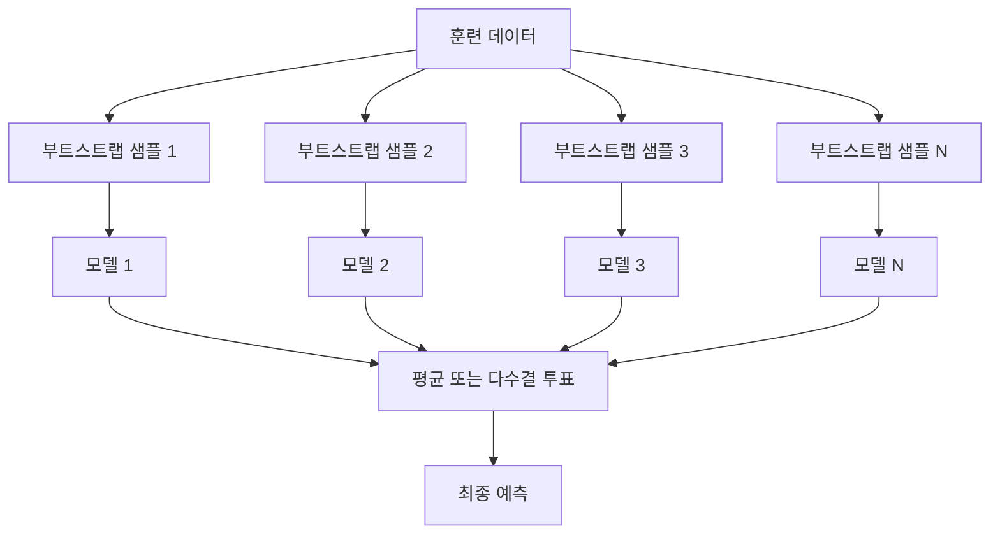
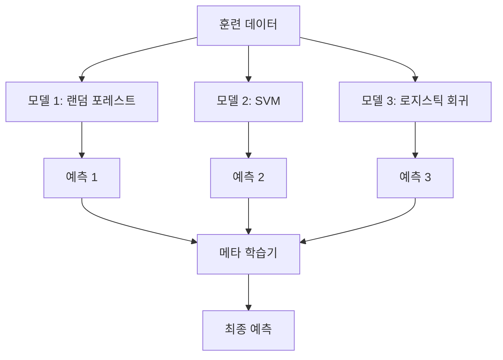

# 앙상블 방법

> 올바르게 결합된 약한 학습기 그룹은 강한 학습기가 됩니다. 이는 비유가 아닙니다. 정리(theorem)입니다.

**유형:** 구축(Build)
**언어:** Python
**선수 지식:** 2단계, 10강 (편향-분산 트레이드오프)
**소요 시간:** ~120분

## 학습 목표

- AdaBoost와 그래디언트 부스팅(gradient boosting)을 처음부터 구현하고, 부스팅이 어떻게 순차적으로 편향(bias)을 줄이는지 설명
- 배깅(bagging) 앙상블을 구축하고, 평균화가 어떻게 상관관계가 없는 모델들의 분산(variance)을 줄이면서 편향은 증가시키지 않는지 증명
- 배깅, 부스팅, 스태킹(stacking)이 각각 어떤 오류(error) 요소를 대상으로 하는지 비교
- 앙상블 다양성(ensemble diversity)을 평가하고, 다수결 투표(majority voting) 정확도가 더 많은 독립적인 약한 학습기(weak learners)와 함께 개선되는 이유 설명

## 문제 정의

단일 결정 트리(decision tree)는 훈련 속도가 빠르고 해석이 쉽지만 과적합(overfitting)되기 쉽습니다. 단일 선형 모델(linear model)은 복잡한 결정 경계(decision boundary)에서 과소적합(underfitting)됩니다. 완벽한 모델 아키텍처(model architecture)를 설계하기 위해 며칠을 소비할 수도 있습니다. 또는 여러 불완전한 모델을 결합하여 개별적으로보다 더 나은 결과를 얻을 수도 있습니다.

앙상블 방법(ensemble methods)은 바로 이 작업을 수행합니다. 이들은 테이블 형식 데이터(tabular data)에 대한 캐글(Kaggle) 경연에서 우승하는 가장 신뢰할 수 있는 기법이며, 대부분의 프로덕션 ML 시스템을 구동하고, 편향-분산 트레이드오프(bias-variance tradeoff)를 실제로 보여줍니다. 배깅(bagging)은 분산을 줄이고, 부스팅(boosting)은 편향을 줄입니다. 스태킹(stacking)은 어떤 입력에 대해 어떤 모델을 신뢰할지 학습합니다.

## 개념

### 앙상블이 작동하는 이유

N개의 독립적인 분류기가 있고, 각각의 정확도가 p > 0.5라고 가정해보자. 다수결 투표의 정확도는 다음과 같다:

```
P(다수결 정답) = k > N/2에 대해 C(N,k) * p^k * (1-p)^(N-k)의 합
```

60% 정확도를 가진 21개의 분류기의 경우 다수결 정확도는 약 74%이다. 101개의 분류기로는 84%까지 상승한다. 모델들이 서로 다른 오류를 만들 때 오류들이 상쇄된다.

핵심 요구사항은 **다양성**이다. 모든 모델이 동일한 오류를 만들면 앙상블은 도움이 되지 않는다. 앙상블은 다음과 같은 방법으로 다양한 모델을 생성한다:

- 다른 훈련 데이터 서브셋 (배깅)
- 다른 특성 서브셋 (랜덤 포레스트)
- 순차적 오류 수정 (부스팅)
- 다른 모델 패밀리 (스태킹)

### 배깅 (부트스트랩 집합)

배깅은 각 모델을 훈련 데이터의 다른 부트스트랩 샘플로 훈련시켜 다양성을 생성한다.



부트스트랩 샘플은 원본 데이터에서 복원 추출로 생성되며, 원본과 같은 크기이다. 각 부트스트랩 샘플에는 약 63.2%의 고유 샘플이 포함되며, 나머지 36.8%(아웃-오브-백 샘플)는 무료 검증 세트를 제공한다.

배깅은 분산을 줄이면서 편향을 크게 증가시키지 않는다. 각 개별 트리는 부트스트랩 샘플에 과적합되지만, 과적합이 각 트리마다 다르기 때문에 평균을 내면 노이즈가 상쇄된다.

**랜덤 포레스트**는 배깅에 추가적인 변형을 적용한 것이다: 각 분할 시 무작위 특성 서브셋만 고려한다. 이는 트리 간 다양성을 더욱 강화한다. 분류 문제에서는 일반적으로 `sqrt(n_features)`, 회귀 문제에서는 `n_features / 3`개의 후보 특성을 사용한다.

### 부스팅 (순차적 오류 수정)

부스팅은 모델을 순차적으로 훈련시킨다. 각 새로운 모델은 이전 모델들이 잘못 예측한 샘플에 집중한다.


부스팅은 편향을 줄인다. 각 새로운 모델은 현재 앙상블의 체계적 오류를 수정한다. 최종 예측은 모든 모델의 가중치 합이며, 더 나은 모델은 더 높은 가중치를 받는다.

단점: 부스팅은 너무 많은 라운드를 실행하면 과적합될 수 있다. 더 어려운 예제(일부 노이즈일 수 있음)에 계속 적합하기 때문이다.

### AdaBoost

AdaBoost(Adaptive Boosting)는 최초의 실용적인 부스팅 알고리즘이다. 일반적으로 결정 스텀프(깊이 1 트리)와 같은 약한 학습기를 사용한다.

알고리즘:

```
1. 샘플 가중치 초기화: w_i = 1/N (모든 i에 대해)

2. t = 1부터 T까지 반복:
   a. 가중치 데이터로 약한 학습기 h_t 훈련
   b. 가중치 오류 계산:
      err_t = sum(w_i * I(h_t(x_i) != y_i)) / sum(w_i)
   c. 모델 가중치 계산:
      alpha_t = 0.5 * ln((1 - err_t) / err_t)
   d. 샘플 가중치 업데이트:
      w_i = w_i * exp(-alpha_t * y_i * h_t(x_i))
   e. 가중치 정규화 (합이 1이 되도록)

3. 최종 예측: H(x) = sign(sum(alpha_t * h_t(x)))
```

오류가 적은 모델은 더 높은 alpha를 받는다. 잘못 분류된 샘플은 가중치가 증가하여 다음 모델이 이에 집중한다.

### 그래디언트 부스팅

그래디언트 부스팅은 부스팅을 임의의 손실 함수로 일반화한다. 샘플 재가중 대신, 각 새로운 모델을 현재 앙상블의 잔차(손실의 음의 그래디언트)에 적합시킨다.

```
1. 초기화: F_0(x) = argmin_c sum(L(y_i, c))

2. t = 1부터 T까지 반복:
   a. 의사 잔차 계산:
      r_i = -dL(y_i, F_{t-1}(x_i)) / dF_{t-1}(x_i)
   b. 잔차 r_i에 트리 h_t 적합
   c. 최적 스텝 크기 찾기:
      gamma_t = argmin_gamma sum(L(y_i, F_{t-1}(x_i) + gamma * h_t(x_i)))
   d. 업데이트:
      F_t(x) = F_{t-1}(x) + 학습률 * gamma_t * h_t(x)

3. 최종 예측: F_T(x)
```

제곱 오차 손실의 경우 의사 잔차는 실제 잔차와 같다: `r_i = y_i - F_{t-1}(x_i)`. 각 트리는 이전 앙상블의 오류를 문자 그대로 적합한다.

학습률(shrinkage)은 각 트리의 기여도를 제어한다. 작은 학습률은 더 많은 트리를 필요로 하지만 일반화 성능이 더 좋다. 일반적인 값: 0.01~0.3.

### XGBoost: 테이블 형식 데이터에서 지배적인 이유

XGBoost(eXtreme Gradient Boosting)는 그래디언트 부스팅에 엔지니어링 최적화를 추가하여 빠르고 정확하며 과적합에 강한 모델이다:

- **정규화 목적 함수:** 리프 가중치에 L1 및 L2 페널티를 적용하여 개별 트리가 지나치게 확신하지 않도록 방지
- **2차 근사:** 손실의 1차 및 2차 미분을 사용하여 더 나은 분할 결정 제공
- **희소성 인식 분할:** 각 분할에서 결측치에 대한 최적 방향을 학습하여 결측치를 기본적으로 처리
- **열 서브샘플링:** 랜덤 포레스트와 같이 각 분할에서 특성을 샘플링하여 다양성 확보
- **가중 양자화 스케치:** 분산 데이터에서 연속 특성에 대한 분할 지점을 효율적으로 찾음
- **캐시 인식 블록 구조:** CPU 캐시 라인에 최적화된 메모리 레이아웃

테이블 형식 데이터의 경우 XGBoost(및 후속 모델인 LightGBM)는 신경망보다 일관되게 우수한 성능을 보인다. 이는 당분간 변하지 않을 것이다. 데이터가 행과 열로 구성된 테이블에 맞는다면 그래디언트 부스팅부터 시작해보자.

### 스태킹 (메타 학습)

스태킹은 여러 기본 모델의 예측값을 메타 학습기의 특성으로 사용한다.



메타 학습기는 어떤 입력에 대해 어떤 기본 모델을 신뢰할지 학습한다. 랜덤 포레스트가 특정 영역에서 더 좋고 SVM이 다른 영역에서 더 좋다면, 메타 학습기는 이에 따라 라우팅하는 방법을 학습한다.

데이터 누수를 방지하기 위해 기본 모델 예측은 훈련 세트에 대한 교차 검증을 통해 생성해야 한다. 기본 모델과 메타 특성을 동일한 데이터로 훈련시키면 안 된다.

### 보팅

가장 간단한 앙상블. 예측을 직접 결합한다.

- **하드 보팅:** 클래스 레이블에 대한 다수결 투표.
- **소프트 보팅:** 예측된 확률의 평균을 내고, 가장 높은 평균 확률을 가진 클래스 선택. 일반적으로 신뢰도 정보를 사용하기 때문에 더 나은 성능을 보인다.

## 구축 단계

### 1단계: 결정 스텀프(기반 학습자)

`code/ensembles.py`의 코드는 모든 것을 처음부터 구현합니다. 결정 스텀프로 시작합니다: 단일 분할을 가진 트리입니다.

```python
class DecisionStump:
    def __init__(self):
        self.feature_idx = None
        self.threshold = None
        self.polarity = 1
        self.alpha = None

    def fit(self, X, y, weights):
        n_samples, n_features = X.shape
        best_error = float("inf")

        for f in range(n_features):
            thresholds = np.unique(X[:, f])
            for thresh in thresholds:
                for polarity in [1, -1]:
                    pred = np.ones(n_samples)
                    pred[polarity * X[:, f] < polarity * thresh] = -1
                    error = np.sum(weights[pred != y])
                    if error < best_error:
                        best_error = error
                        self.feature_idx = f
                        self.threshold = thresh
                        self.polarity = polarity

    def predict(self, X):
        n = X.shape[0]
        pred = np.ones(n)
        idx = self.polarity * X[:, self.feature_idx] < self.polarity * self.threshold
        pred[idx] = -1
        return pred
```

### 2단계: 처음부터 구현하는 AdaBoost

```python
class AdaBoostScratch:
    def __init__(self, n_estimators=50):
        self.n_estimators = n_estimators
        self.stumps = []
        self.alphas = []

    def fit(self, X, y):
        n = X.shape[0]
        weights = np.full(n, 1 / n)

        for _ in range(self.n_estimators):
            stump = DecisionStump()
            stump.fit(X, y, weights)
            pred = stump.predict(X)

            err = np.sum(weights[pred != y])
            err = np.clip(err, 1e-10, 1 - 1e-10)

            alpha = 0.5 * np.log((1 - err) / err)
            weights *= np.exp(-alpha * y * pred)
            weights /= weights.sum()

            stump.alpha = alpha
            self.stumps.append(stump)
            self.alphas.append(alpha)

    def predict(self, X):
        total = sum(a * s.predict(X) for a, s in zip(self.alphas, self.stumps))
        return np.sign(total)
```

### 3단계: 처음부터 구현하는 Gradient Boosting

```python
class GradientBoostingScratch:
    def __init__(self, n_estimators=100, learning_rate=0.1, max_depth=3):
        self.n_estimators = n_estimators
        self.lr = learning_rate
        self.max_depth = max_depth
        self.trees = []
        self.initial_pred = None

    def fit(self, X, y):
        self.initial_pred = np.mean(y)
        current_pred = np.full(len(y), self.initial_pred)

        for _ in range(self.n_estimators):
            residuals = y - current_pred
            tree = SimpleRegressionTree(max_depth=self.max_depth)
            tree.fit(X, residuals)
            update = tree.predict(X)
            current_pred += self.lr * update
            self.trees.append(tree)

    def predict(self, X):
        pred = np.full(X.shape[0], self.initial_pred)
        for tree in self.trees:
            pred += self.lr * tree.predict(X)
        return pred
```

### 4단계: sklearn과 비교

이 코드는 처음부터 구현한 AdaBoostClassifier와 GradientBoostingClassifier가 sklearn의 `AdaBoostClassifier` 및 `GradientBoostingClassifier`와 유사한 정확도를 생성하는지 확인하고, 모든 방법을 나란히 비교합니다.

## 사용 방법

### 각 방법 사용 시기

| 방법 | 감소 효과 | 최적 사용 사례 | 주의 사항 |
|--------|---------|----------|---------------|
| 배깅 / 랜덤 포레스트(Bagging / Random Forest) | 분산(Variance) | 노이즈가 많은 데이터, 많은 특성(features) | 편향(Bias) 감소에는 도움 안 됨 |
| 아다부스트(AdaBoost) | 편향(Bias) | 깨끗한 데이터, 단순한 기본 학습기(base learners) | 이상치(outliers) 및 노이즈에 민감 |
| 그래디언트 부스팅(Gradient Boosting) | 편향(Bias) | 테이블 형식 데이터(tabular data), 경연(competitions) | 학습 속도 느림, 튜닝 없이 과적합(overfitting) 쉬움 |
| XGBoost / LightGBM | 둘 다(Both) | 프로덕션 테이블 형식 ML | 많은 하이퍼파라미터(hyperparameters) |
| 스태킹(Stacking) | 둘 다(Both) | 마지막 1-2% 정확도 향상 | 복잡함, 메타 학습기(meta-learner) 과적합 위험 |
| 보팅(Voting) | 분산(Variance) | 다양한 모델 빠른 결합 | 모델들이 다양할 때만 효과적 |

### 테이블 형식 데이터를 위한 프로덕션 스택

대부분의 테이블 형식 예측 문제에 대해 시도할 순서는 다음과 같습니다:

1. **LightGBM 또는 XGBoost** 기본 파라미터로 시작
2. `n_estimators`, `learning_rate`, `max_depth`, `min_child_weight` 튜닝
3. 마지막 0.5%가 필요하면 3-5개의 다양한 모델로 스태킹 앙상블 구축
4. 전체 과정에서 교차 검증(cross-validation) 사용

테이블 형식 데이터에 대한 신경망(neural networks)은 지속적인 연구 시도에도 불구하고 그래디언트 부스팅보다 거의 항상 성능이 낮습니다. TabNet, NODE 및 유사 아키텍처는 가끔 비슷한 성능을 내지만 잘 튜닝된 XGBoost를 이기지는 못합니다.

## Ship It

이 레슨은 `outputs/prompt-ensemble-selector.md`를 생성합니다. 이 프롬프트는 주어진 데이터셋에 적합한 앙상블 방법을 선택하는 데 도움을 줍니다. 데이터(크기, 특징 유형, 노이즈 수준, 클래스 균형)와 해결하려는 문제에 대해 설명하면, 프롬프트가 결정 체크리스트를 안내하고, 방법을 추천하며, 시작 하이퍼파라미터를 제안하고, 해당 방법의 일반적인 실수에 대해 경고합니다. 또한 전체 선택 가이드가 포함된 `outputs/skill-ensemble-builder.md`도 생성합니다.

## 연습 문제

1. AdaBoost 구현을 수정하여 각 라운드 후 훈련 정확도를 추적하세요. 정확도 대 추정기 수를 그래프로 그리세요. 언제 수렴하나요?

2. 회귀 트리에 무작위 특성 부분 추출을 추가하여 처음부터 랜덤 포레스트를 구현하세요. `max_features=sqrt(n_features)`로 100개의 트리를 훈련하고 예측을 평균화하세요. 단일 트리와 비교하여 분산 감소를 평가하세요.

3. 그래디언트 부스팅 구현에 조기 종료를 추가하세요: 각 라운드 후 검증 손실을 추적하고 10회 연속 개선되지 않을 때 중지하세요. 실제로 필요한 트리 수는 몇 개인가요?

4. 로지스틱 회귀, 결정 트리, k-최근접 이웃 3개의 기본 모델과 로지스틱 회귀 메타 러너로 스태킹 앙상블을 구축하세요. 5-폴드 교차 검증을 사용하여 메타 특성을 생성하세요. 각 기본 모델 단독과 비교하세요.

5. 기본 매개변수로 XGBoost를 동일한 데이터셋에 실행하세요. 자체 구현 그래디언트 부스팅과 정확도를 비교하세요. 둘 다 시간을 측정하세요. 속도 차이는 얼마나 큰가요?

## 주요 용어

| 용어 | 사람들이 말하는 것 | 실제 의미 |
|------|----------------|----------------------|
| 배깅(Bagging) | "무작위 부분집합으로 학습" | 부트스트랩 집계: 부트스트랩 샘플로 모델을 학습시키고 예측을 평균화하여 분산 감소 |
| 부스팅(Boosting) | "어려운 예시에 집중" | 순차적으로 모델을 학습시키고, 각 모델이 현재까지의 앙상블 오류를 수정하도록 하여 편향 감소 |
| 에이다부스트(AdaBoost) | "데이터 재가중" | 샘플 가중치 업데이트를 통한 부스팅; 분류 오류 발생 샘플은 다음 학습기에서 가중치 증가 |
| 그래디언트 부스팅(Gradient boosting) | "잔차 적합" | 손실 함수의 음의 그래디언트에 각 새 모델을 적합시키는 부스팅 |
| XGBoost | "캐글 무기" | 정규화, 2차 최적화, 시스템 수준의 속도 트릭을 적용한 그래디언트 부스팅 |
| 스태킹(Stacking) | "모델 위에 모델" | 기본 모델의 예측값을 메타 학습기의 입력 특성으로 사용 |
| 랜덤 포레스트(Random forest) | "많은 무작위 트리" | 결정 트리를 사용한 배깅, 각 분할 시 무작위 특성 부분 추출로 다양성 추가 |
| 앙상블 다양성(Ensemble diversity) | "다른 실수를 하게 하라" | 앙상블이 개별 모델보다 개선되려면 모델들의 오류가 상관없어야 함 |
| 아웃오브백 오류(Out-of-bag error) | "무료 검증" | 부트스트랩 추출에 포함되지 않은 샘플(~36.8%)이 홀드아웃 없이 검증 세트 역할 수행 |

## 추가 학습 자료

- [Schapire & Freund: 부스팅: 기초와 알고리즘](https://mitpress.mit.edu/9780262526036/) -- AdaBoost 창시자들의 저서
- [Friedman: 탐욕적 함수 근사: 그래디언트 부스팅 머신 (2001)](https://statweb.stanford.edu/~jhf/ftp/trebst.pdf) -- 원본 그래디언트 부스팅 논문
- [Chen & Guestrin: XGBoost (2016)](https://arxiv.org/abs/1603.02754) -- XGBoost 논문
- [Wolpert: 스태킹 일반화 (1992)](https://www.sciencedirect.com/science/article/abs/pii/S0893608005800231) -- 원본 스태킹 논문
- [scikit-learn 앙상블 방법](https://scikit-learn.org/stable/modules/ensemble.html) -- 실용적 참고 자료