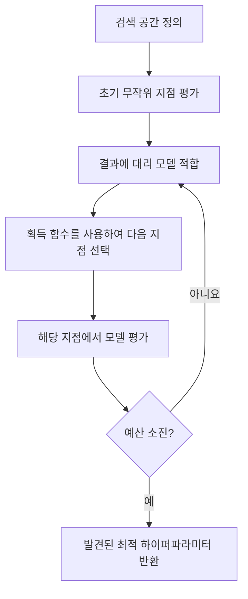
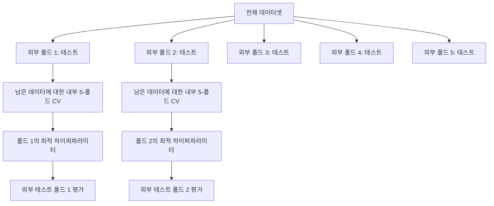

# 하이퍼파라미터 튜닝

> 하이퍼파라미터는 훈련 시작 전에 조절하는 조절 장치입니다. 이를 잘 조정하는 것이 평범한 모델과 훌륭한 모델의 차이입니다.

**유형:** 빌드  
**언어:** Python  
**선수 지식:** 2단계, 11강 (앙상블 방법)  
**소요 시간:** ~90분

## 학습 목표

- 그리드 서치(grid search), 랜덤 서치(random search), 베이지안 최적화(Bayesian optimization)를 직접 구현하고 샘플 효율성(sample efficiency)을 비교
- 대부분의 하이퍼파라미터(hyperparameter)가 낮은 유효 차원(effective dimensionality)을 가질 때 랜덤 서치가 그리드 서치보다 성능이 우수한 이유 설명
- 서로게이트 모델(surrogate model)과 획득 함수(acquisition function)를 사용하여 탐색을 안내하는 베이지안 최적화 루프 구축
- 적절한 교차 검증(cross-validation)을 통해 검증 세트(validation set)에 대한 과적합(overfitting)을 피하는 하이퍼파라미터 튜닝 전략 설계

## 문제 정의

당신의 그래디언트 부스팅 모델에는 학습률(learning rate), 트리 개수(number of trees), 최대 깊이(max depth), 리프당 최소 샘플 수(min samples per leaf), 서브샘플 비율(subsample ratio), 컬럼 샘플 비율(column sample ratio)이라는 6개의 하이퍼파라미터가 있습니다. 각각 5개의 합리적인 값을 가진다면, 그리드 서치의 경우 5^6 = 15,625개의 조합이 생성됩니다. 각 조합당 10초의 학습 시간이 소요된다면, 모든 조합을 시도하는 데 43시간의 컴퓨팅 리소스가 필요합니다.

그리드 서치는 명백한 접근법이지만 확장성 측면에서는 최악의 방법입니다. 랜덤 서치는 더 적은 컴퓨팅 리소스로 더 나은 성능을 제공합니다. 베이지안 최적화(Bayesian optimization)는 과거 평가 결과를 학습하여 더욱 효율적으로 작동합니다. 어떤 전략을 사용할지, 그리고 실제로 중요한 하이퍼파라미터가 무엇인지 아는 것은 GPU 시간을 며칠씩 절약하는 데 도움이 됩니다.

## 개념

### 파라미터 vs 하이퍼파라미터

파라미터는 학습 중에 학습됩니다(가중치, 편향, 분할 임계값). 하이퍼파라미터는 학습이 시작되기 전에 설정되며 학습 방식을 제어합니다.

| 하이퍼파라미터 | 제어 대상 | 일반적인 범위 |
|---------------|-----------------|---------------|
| 학습률(learning rate) | 업데이트 단계 크기 | 0.001 ~ 1.0 |
| 트리/에포크 수(number of trees/epochs) | 학습 시간 | 10 ~ 10,000 |
| 최대 깊이(max depth) | 모델 복잡도 | 1 ~ 30 |
| 정규화(lambda) | 과적합(overfitting) 방지 | 0.0001 ~ 100 |
| 배치 크기(batch size) | 그래디언트 추정 노이즈 | 16 ~ 512 |
| 드롭아웃 비율(dropout rate) | 드롭된 뉴런 비율 | 0.0 ~ 0.5 |

### 그리드 서치(Grid Search)

그리드 서치는 지정된 모든 값 조합을 평가합니다. 철저하고 이해하기 쉽지만 하이퍼파라미터 수에 따라 지수적으로 확장됩니다.

```
2개 하이퍼파라미터 그리드:

  학습률(learning_rate): [0.01, 0.1, 1.0]
  최대 깊이(max_depth):     [3, 5, 7]

  평가 횟수: 3 x 3 = 9 조합

  (0.01, 3)  (0.01, 5)  (0.01, 7)
  (0.1,  3)  (0.1,  5)  (0.1,  7)
  (1.0,  3)  (1.0,  5)  (1.0,  7)
```

그리드 서치의 근본적인 문제점: 하나의 하이퍼파라미터만 중요하고 다른 하이퍼파라미터는 중요하지 않다면 대부분의 평가가 낭비됩니다. 9번의 평가에서 중요한 파라미터의 고유한 값은 3개만 얻습니다.

### 랜덤 서치(Random Search)

랜덤 서치는 그리드 대신 분포에서 하이퍼파라미터를 샘플링합니다. 동일한 9번의 평가 예산으로 각 하이퍼파라미터의 9개 고유 값을 얻습니다.

```mermaid
flowchart LR
    subgraph 그리드 서치(Grid Search)
        G1[3개 고유 학습률]
        G2[3개 고유 최대 깊이]
        G3[총 9회 평가]
    end

    subgraph 랜덤 서치(Random Search)
        R1[9개 고유 학습률]
        R2[9개 고유 최대 깊이]
        R3[총 9회 평가]
    end
```

랜덤 서치가 그리드 서치를 능가하는 이유(Bergstra & Bengio, 2012):

- 대부분의 하이퍼파라미터는 효과적인 차원이 낮습니다. 일반적으로 6개 하이퍼파라미터 중 1-2개만 특정 문제에 중요합니다.
- 그리드 서치는 중요하지 않은 차원에 평가를 낭비합니다.
- 랜덤 서치는 동일한 예산으로 중요한 차원을 더 밀집하게 탐색합니다.
- 60번의 무작위 시행에서 검색 공간 내 최적점 근처(5% 이내) 지점을 찾을 확률이 95%입니다.

### 베이지안 최적화(Bayesian Optimization)

랜덤 서치는 결과를 무시합니다. 높은 학습률이 발산을 유발하거나 깊이 3이 깊이 10보다 일관되게 성능이 좋다는 것을 학습하지 않습니다. 베이지안 최적화는 과거 평가 결과를 사용하여 다음에 탐색할 위치를 결정합니다.



두 가지 주요 구성 요소:

**대리 모델(Surrogate model):** 평가하기 저렴한 모델(일반적으로 가우시안 프로세스)로 비싼 목적 함수를 근사합니다. 검색 공간의 모든 지점에서 예측값과 불확실성 추정치를 제공합니다.

**획득 함수(Acquisition function):** 다음 평가 지점을 결정하기 위해 활용(알려진 좋은 지점 근처 탐색)과 탐색(불확실성이 높은 지점 탐색)을 균형 있게 조정합니다. 일반적인 선택 사항:

- **기대 개선(Expected Improvement, EI):** 현재 최적점 대비 이 지점에서 기대할 수 있는 개선량?
- **상신 신뢰 구간(Upper Confidence Bound, UCB):** 예측값 + 불확실성의 배수. 높은 UCB는 유망하거나 미탐색 영역을 의미합니다.
- **개선 확률(Probability of Improvement, PI):** 이 지점이 현재 최적점을 능가할 확률은?

베이지안 최적화는 일반적으로 랜덤 서치보다 2-5배 적은 평가로 더 나은 하이퍼파라미터를 찾습니다. 대리 모델 적합 오버헤드는 실제 모델 학습에 비해 무시할 수 있습니다.

### 조기 종료(Early Stopping)

모든 학습 실행이 완료될 필요는 없습니다. 10 에포크 후 구성이 명백히 나쁘다면 중단하고 다음으로 넘어갑니다. 이는 하이퍼파라미터 탐색 맥락에서 조기 종료입니다.

전략:
- **인내 기반(Patience-based):** N 연속 에포크 동안 검증 손실이 개선되지 않으면 중단
- **중간 프루닝(Median pruning):** 동일한 단계에서 완료된 시행의 중간값보다 중간 결과가 나쁘면 중단
- **하이퍼밴드(Hyperband):** 많은 구성에 작은 예산을 할당한 후 상위 1/3을 선택하고 예산을 점진적으로 증가시킵니다

하이퍼밴드는 특히 효과적입니다. 1 에포크로 81개 구성을 시작한 후 상위 1/3을 유지하고 3 에포크를 할당하고, 다시 상위 1/3을 유지하는 과정을 반복합니다. 이는 전체 예산으로 모든 구성을 평가하는 것보다 10-50배 빠르게 좋은 구성을 찾습니다.

### 학습률 스케줄러(Learning Rate Schedulers)

학습률은 거의 항상 가장 중요한 하이퍼파라미터입니다. 고정된 값을 유지하는 대신 스케줄러는 학습 중에 이를 조정합니다.

| 스케줄러 | 수식 | 사용 시기 |
|-----------|---------|-------------|
| 단계 감소(step decay) | N 에포크마다 0.1배 감소 | 클래식 CNN 학습 |
| 코사인 감소(cosine annealing) | lr * 0.5 * (1 + cos(pi * t / T)) | 현대적 기본값 |
| 워밍업 + 감소(warmup + decay) | 선형 증가 후 코사인 감소 | 트랜스포머 |
| 원 사이클(one-cycle) | 한 사이클 동안 증가 후 감소 | 빠른 수렴 |
| 플래토 감소(reduce on plateau) | 메트릭이 정체될 때 감소 | 안전한 기본값 |

### 하이퍼파라미터 중요도

모든 하이퍼파라미터가 동일하게 중요하지는 않습니다. 랜덤 포레스트(Probst et al., 2019) 및 그래디언트 부스팅 연구는 일관된 패턴을 보여줍니다:

**높은 중요도:**
- 학습률(learning rate) (항상 먼저 튜닝)
- 추정기/에포크 수(number of estimators / epochs) (튜닝 대신 조기 종료 사용)
- 정규화 강도(regularization strength)

**중간 중요도:**
- 최대 깊이/레이어 수(max depth / number of layers)
- 리프당 최소 샘플 수/가중치 감소(min samples per leaf / weight decay)
- 서브샘플 비율(subsample ratio)

**낮은 중요도:**
- 최대 특성(max features) (랜덤 포레스트용)
- 특정 활성화 함수 선택
- 배치 크기(batch size) (합리적인 범위 내)

중요한 하이퍼파라미터부터 튜닝하고 나머지는 기본값으로 둡니다.

### 실용적인 전략

```mermaid
flowchart TD
    A[기본값으로 시작] --> B[거친 랜덤 서치: 20-50회 시행]
    B --> C[중요한 하이퍼파라미터 식별]
    C --> D[세부 랜덤 또는 베이지안 서치: 50-100회 시행(좁혀진 공간)]
    D --> E[최적 하이퍼파라미터로 최종 모델]
    E --> F[전체 학습 데이터로 재학습]
```

구체적인 워크플로우:

1. **라이브러리 기본값으로 시작.** 경험 많은 실무자가 선택한 값으로 종종 80% 수준까지 도달합니다.
2. **거친 랜덤 서치.** 넓은 범위, 20-50회 시행. 조기 종료를 사용하여 나쁜 실행을 빠르게 중단합니다.
3. **결과 분석.** 어떤 하이퍼파라미터가 성능과 상관관계가 있는가? 검색 공간을 좁힙니다.
4. **세부 서치.** 좁혀진 공간에서 베이지안 최적화 또는 집중 랜덤 서치. 50-100회 시행.
5. **발견된 최적 하이퍼파라미터로 전체 학습 데이터 재학습.**

### 교차 검증 통합

단일 검증 분할에서 하이퍼파라미터를 튜닝하는 것은 위험합니다. 최적 하이퍼파라미터가 특정 검증 폴드에 과적합될 수 있습니다. 중첩 교차 검증은 두 개의 루프를 사용하여 이를 해결합니다:

- **외부 루프(평가):** 데이터를 train+val과 test로 분할. 편향되지 않은 성능 보고.
- **내부 루프(튜닝):** train+val을 train과 val로 분할. 최적 하이퍼파라미터 찾기.



각 외부 폴드는 독립적으로 자체 최적 하이퍼파라미터를 찾습니다. 외부 점수는 일반화 성능에 대한 편향되지 않은 추정치입니다.

Scikit-learn 사용 예:

```python
from sklearn.model_selection import cross_val_score, GridSearchCV
from sklearn.ensemble import GradientBoostingRegressor

inner_cv = GridSearchCV(
    GradientBoostingRegressor(),
    param_grid={
        "learning_rate": [0.01, 0.05, 0.1],
        "max_depth": [2, 3, 5],
        "n_estimators": [50, 100, 200],
    },
    cv=5,
    scoring="neg_mean_squared_error",
)

outer_scores = cross_val_score(
    inner_cv, X, y, cv=5, scoring="neg_mean_squared_error"
)

print(f"중첩 교차 검증 MSE: {-outer_scores.mean():.4f} +/- {outer_scores.std():.4f}")
```

이는 비용이 많이 듭니다(5 외부 폴드 x 5 내부 폴드 x 27 그리드 포인트 = 675 모델 적합). 하지만 신뢰할 수 있는 성능 추정치를 제공합니다. 논문 결과 보고 또는 의사 결정의 중요성이 높을 때 사용합니다.

### 실용적인 팁

**학습률부터 시작.** 그래디언트 기반 방법에 항상 가장 중요한 하이퍼파라미터입니다. 나쁜 학습률은 다른 모든 요소를 무의미하게 만듭니다. 다른 하이퍼파라미터는 기본값으로 고정하고 먼저 학습률을 스윕합니다.

**학습률과 정규화에 로그 균일 분포 사용.** 0.001과 0.01의 차이는 0.1과 1.0의 차이만큼 중요합니다. 선형 검색은 큰 끝에서 예산을 낭비합니다.

**n_estimators 튜닝 대신 조기 종료 사용.** 부스팅 및 신경망의 경우 n_estimators 또는 에포크를 높게 설정하고 조기 종료가 중지 시점을 결정하도록 합니다. 이렇게 하면 검색에서 하나의 하이퍼파라미터가 제거됩니다.

**예산 할당.** 튜닝 예산의 60%를 상위 2개 중요 하이퍼파라미터에 할당합니다. 나머지 40%는 다른 모든 항목에 할당합니다. 상위 2개가 성능 변동의 대부분을 차지합니다.

**규모 고려.** 배치 크기는 로그 스케일로 검색하지 않습니다(16, 32, 64는 적합). 학습률은 항상 로그 스케일로 검색합니다. 하이퍼파라미터가 모델에 미치는 영향에 맞게 검색 분포를 조정합니다.

| 모델 유형 | 상위 하이퍼파라미터 | 권장 검색 | 예산 |
|-----------|--------------------|--------------------|--------|
| 랜덤 포레스트 | n_estimators, max_depth, min_samples_leaf | 랜덤 서치, 50회 시행 | 낮음(빠른 학습) |
| 그래디언트 부스팅 | learning_rate, n_estimators, max_depth | 베이지안, 100회 시행 + 조기 종료 | 중간 |
| 신경망 | learning_rate, weight_decay, batch_size | 베이지안 또는 랜덤, 100+회 시행 | 높음(느린 학습) |
| SVM | C, gamma (RBF 커널) | 로그 스케일 그리드, 25-50회 시행 | 낮음(2개 파라미터) |
| 라소/릿지 | alpha | 로그 스케일 1D 검색, 20회 시행 | 매우 낮음 |
| XGBoost | learning_rate, max_depth, subsample, colsample | 베이지안, 100-200회 시행 + 조기 종료 | 중간 |

**의심이 들 때는:** 하이퍼파라미터 수의 2배 시행으로 랜덤 서치(예: 6개 하이퍼파라미터 = 최소 12+회 시행). 50회 시행으로 랜덤 서치가 신중하게 설계된 그리드 서치를 능가하는 경우가 많다는 사실에 놀랄 것입니다.

## 구축 방법

### 1단계: 처음부터 시작하는 그리드 서치

`code/tuning.py`의 코드는 그리드 서치, 랜덤 서치, 간단한 베이지안 옵티마이저를 처음부터 구현합니다.

```python
def grid_search(model_fn, param_grid, X_train, y_train, X_val, y_val):
    keys = list(param_grid.keys())
    values = list(param_grid.values())
    best_score = -float("inf")
    best_params = None
    n_evals = 0

    for combo in itertools.product(*values):
        params = dict(zip(keys, combo))
        model = model_fn(**params)
        model.fit(X_train, y_train)
        score = evaluate(model, X_val, y_val)
        n_evals += 1

        if score > best_score:
            best_score = score
            best_params = params

    return best_params, best_score, n_evals
```

### 2단계: 처음부터 시작하는 랜덤 서치

```python
def random_search(model_fn, param_distributions, X_train, y_train,
                  X_val, y_val, n_iter=50, seed=42):
    rng = np.random.RandomState(seed)
    best_score = -float("inf")
    best_params = None

    for _ in range(n_iter):
        params = {k: sample(v, rng) for k, v in param_distributions.items()}
        model = model_fn(**params)
        model.fit(X_train, y_train)
        score = evaluate(model, X_val, y_val)

        if score > best_score:
            best_score = score
            best_params = params

    return best_params, best_score, n_iter
```

### 3단계: 베이지안 최적화 (간소화된 버전)

핵심 아이디어: 관측된 (하이퍼파라미터, 점수) 쌍에 가우시안 프로세스를 피팅한 후, 획득 함수를 사용하여 다음에 탐색할 위치를 결정합니다.

```python
class SimpleBayesianOptimizer:
    def __init__(self, search_space, n_initial=5):
        self.search_space = search_space
        self.n_initial = n_initial
        self.X_observed = []
        self.y_observed = []

    def _kernel(self, x1, x2, length_scale=1.0):
        dists = np.sum((x1[:, None, :] - x2[None, :, :]) ** 2, axis=2)
        return np.exp(-0.5 * dists / length_scale ** 2)

    def _fit_gp(self, X_new):
        X_obs = np.array(self.X_observed)
        y_obs = np.array(self.y_observed)
        y_mean = y_obs.mean()
        y_centered = y_obs - y_mean

        K = self._kernel(X_obs, X_obs) + 1e-4 * np.eye(len(X_obs))
        K_star = self._kernel(X_new, X_obs)

        L = np.linalg.cholesky(K)
        alpha = np.linalg.solve(L.T, np.linalg.solve(L, y_centered))
        mu = K_star @ alpha + y_mean

        v = np.linalg.solve(L, K_star.T)
        var = 1.0 - np.sum(v ** 2, axis=0)
        var = np.maximum(var, 1e-6)

        return mu, var

    def _expected_improvement(self, mu, var, best_y):
        sigma = np.sqrt(var)
        z = (mu - best_y) / (sigma + 1e-10)
        ei = sigma * (z * norm_cdf(z) + norm_pdf(z))
        return ei

    def suggest(self):
        if len(self.X_observed) < self.n_initial:
            return sample_random(self.search_space)

        candidates = [sample_random(self.search_space) for _ in range(500)]
        X_cand = np.array([to_vector(c) for c in candidates])
        mu, var = self._fit_gp(X_cand)
        ei = self._expected_improvement(mu, var, max(self.y_observed))
        return candidates[np.argmax(ei)]

    def observe(self, params, score):
        self.X_observed.append(to_vector(params))
        self.y_observed.append(score)
```

GP 서포트는 각 후보 지점에서 두 가지를 제공합니다: 예측 점수(mu)와 불확실성(var). 기대 개선(Expected Improvement)은 이 둘을 균형 있게 고려합니다: 모델이 높은 점수를 예측하거나 불확실성이 높은 지점을 선호합니다. 초기에는 대부분의 지점에서 불확실성이 높아 탐색(exploration)을 수행하고, 후기에는 가장 유망한 영역에 집중(exploitation)합니다.

### 4단계: 모든 방법 비교

동일한 합성 목적 함수에서 세 가지 방법을 실행하고 비교합니다. 이 비교는 모델 학습 없이 직접 목적 함수를 호출하는 간소화된 래퍼를 사용하므로, 위의 모델 기반 구현과는 API가 다릅니다:

```python
def synthetic_objective(params):
    lr = params["learning_rate"]
    depth = params["max_depth"]
    return -(np.log10(lr) + 2) ** 2 - (depth - 4) ** 2 + 10

param_grid = {
    "learning_rate": [0.001, 0.01, 0.1, 1.0],
    "max_depth": [2, 3, 4, 5, 6, 7, 8],
}

grid_best = None
grid_score = -float("inf")
grid_history = []
for combo in itertools.product(*param_grid.values()):
    params = dict(zip(param_grid.keys(), combo))
    score = synthetic_objective(params)
    grid_history.append((params, score))
    if score > grid_score:
        grid_score = score
        grid_best = params

param_dist = {
    "learning_rate": ("log_float", 0.001, 1.0),
    "max_depth": ("int", 2, 8),
}

rand_best = None
rand_score = -float("inf")
rand_history = []
rng = np.random.RandomState(42)
for _ in range(28):
    params = {k: sample(v, rng) for k, v in param_dist.items()}
    score = synthetic_objective(params)
    rand_history.append((params, score))
    if score > rand_score:
        rand_score = score
        rand_best = params

optimizer = SimpleBayesianOptimizer(param_dist, n_initial=5)
bayes_history = []
for _ in range(28):
    params = optimizer.suggest()
    score = synthetic_objective(params)
    optimizer.observe(params, score)
    bayes_history.append((params, score))
bayes_score = max(s for _, s in bayes_history)

print(f"{'Method':<20} {'Best Score':>12} {'Evaluations':>12}")
print("-" * 50)
print(f"{'Grid Search':<20} {grid_score:>12.4f} {len(grid_history):>12}")
print(f"{'Random Search':<20} {rand_score:>12.4f} {len(rand_history):>12}")
print(f"{'Bayesian Opt':<20} {bayes_score:>12.4f} {len(bayes_history):>12}")
```

동일한 예산으로 베이지안 최적화는 일반적으로 가장 빠르게 최고 점수를 찾습니다. 왜냐하면 명백히 나쁜 영역에서 평가를 낭비하지 않기 때문입니다. 랜덤 서치는 그리드 서치보다 더 넓은 영역을 탐색합니다. 그리드 서치는 하이퍼파라미터가 매우 적고 철저한 탐색이 가능할 때만 승리합니다.

## 사용 방법

### 실제 Optuna 활용

Optuna는 본격적인 하이퍼파라미터 튜닝을 위한 권장 라이브러리입니다. 가지치기(pruning), 분산 검색, 시각화를 기본 지원합니다.

```python
import optuna

def objective(trial):
    lr = trial.suggest_float("learning_rate", 1e-4, 1e-1, log=True)
    n_est = trial.suggest_int("n_estimators", 50, 500)
    max_depth = trial.suggest_int("max_depth", 2, 10)

    model = GradientBoostingRegressor(
        learning_rate=lr,
        n_estimators=n_est,
        max_depth=max_depth,
    )
    model.fit(X_train, y_train)
    return mean_squared_error(y_val, model.predict(X_val))

study = optuna.create_study(direction="minimize")
study.optimize(objective, n_trials=100)

print(f"Best params: {study.best_params}")
print(f"Best MSE: {study.best_value:.4f}")
```

주요 Optuna 기능:
- `suggest_float(..., log=True)`: 로그 스케일로 검색에 적합한 파라미터(학습률, 정규화)
- `suggest_int`: 정수 파라미터
- `suggest_categorical`: 이산 선택
- 중간 성능 저하 시 조기 중단을 위한 내장 `MedianPruner`
- 분석을 위한 `study.trials_dataframe()`

### 가지치기를 활용한 Optuna

가지치기는 유망하지 않은 시도를 조기에 중단하여 계산 비용을 절약합니다. 다음은 사용 패턴입니다:

```python
import optuna
from sklearn.model_selection import cross_val_score

def objective(trial):
    params = {
        "learning_rate": trial.suggest_float("lr", 1e-4, 0.5, log=True),
        "max_depth": trial.suggest_int("max_depth", 2, 10),
        "n_estimators": trial.suggest_int("n_estimators", 50, 500),
        "subsample": trial.suggest_float("subsample", 0.5, 1.0),
    }

    model = GradientBoostingRegressor(**params)
    scores = cross_val_score(model, X_train, y_train, cv=3,
                             scoring="neg_mean_squared_error")
    mean_score = -scores.mean()

    trial.report(mean_score, step=0)
    if trial.should_prune():
        raise optuna.TrialPruned()

    return mean_score

pruner = optuna.pruners.MedianPruner(n_startup_trials=10, n_warmup_steps=5)
study = optuna.create_study(direction="minimize", pruner=pruner)
study.optimize(objective, n_trials=200)
```

`MedianPruner`는 중간 값이 동일 단계의 완료된 모든 시도의 중앙값보다 나쁜 경우 시도를 중단합니다. 가지치기를 위해서는 중간 메트릭을 보고하기 위해 `trial.report()`를 호출하고, 중단 여부를 확인하기 위해 `trial.should_prune()`을 호출해야 합니다. `n_startup_trials=10`은 가지치기가 시작되기 전에 최소 10개의 시도가 완전히 완료되도록 보장합니다. 이는 일반적으로 총 계산 비용의 40-60%를 절약합니다.

### sklearn의 내장 튜너

빠른 실험을 위해 sklearn은 `GridSearchCV`, `RandomizedSearchCV`, `HalvingRandomSearchCV`를 제공합니다:

```python
from sklearn.model_selection import RandomizedSearchCV
from scipy.stats import loguniform, randint

param_dist = {
    "learning_rate": loguniform(1e-4, 0.5),
    "max_depth": randint(2, 10),
    "n_estimators": randint(50, 500),
}

search = RandomizedSearchCV(
    GradientBoostingRegressor(),
    param_dist,
    n_iter=100,
    cv=5,
    scoring="neg_mean_squared_error",
    random_state=42,
    n_jobs=-1,
)
search.fit(X_train, y_train)
print(f"Best params: {search.best_params_}")
print(f"Best CV MSE: {-search.best_score_:.4f}")
```

학습률 및 정규화에는 scipy의 `loguniform`을, 정수 하이퍼파라미터에는 `randint`를 사용합니다. `n_jobs=-1` 플래그는 모든 CPU 코어에 걸쳐 병렬화합니다.

### 하이퍼파라미터 튜닝의 일반적인 실수

**전처리를 통한 데이터 누수.** 교차 검증 전에 전체 데이터셋에 대해 스케일러를 피팅하면 검증 폴드의 정보가 학습 데이터로 누출됩니다. 항상 `Pipeline` 내부에 전처리를 넣어 학습 폴드에만 피팅되도록 해야 합니다.

**검증 세트에 대한 과적합.** 수천 번의 시도를 실행하면 검증 세트에 대해 효과적으로 학습이 이루어집니다. 최종 성능 추정을 위해 중첩 교차 검증을 사용하거나, 튜닝 중에 절대 건드리지 않는 별도의 테스트 세트를 보유해야 합니다.

**너무 좁은 범위 검색.** 최적 값이 검색 공간의 경계에 있다면 충분히 넓게 검색하지 않은 것입니다. 최적 값이 범위 밖에 있을 수 있습니다. 항상 최적 파라미터가 경계에 있는지 확인하세요.

**상호작용 효과 무시.** 부스팅에서 학습률과 추정기 수는 강하게 상호작용합니다. 낮은 학습률은 더 많은 추정기를 필요로 합니다. 독립적으로 튜닝하면 함께 튜닝하는 것보다 결과가 나빠집니다.

**반복적 모델에 대한 조기 중단 미사용.** 그래디언트 부스팅 및 신경망의 경우, `n_estimators` 또는 에포크를 높은 값으로 설정하고 조기 중단을 사용하세요. 이는 반복 횟수를 하이퍼파라미터로 튜닝하는 것보다 엄격하게 더 좋습니다.

## 연습 문제

1. 동일한 총 예산(예: 50회 평가)으로 그리드 서치와 랜덤 서치를 실행하세요. 발견된 최고 점수를 비교하세요. 다른 시드(seed)로 실험을 10회 반복하세요. 랜덤 서치가 몇 번 승리하나요?

2. Hyperband를 직접 구현하세요. 81개의 구성으로 시작하고, 각각 1에포크 동안 훈련하세요. 매 라운드마다 상위 1/3을 유지하고 예산을 3배로 늘리세요. 전체 계산량(모든 구성에 대한 에포크 합계)을 전체 예산으로 81개 구성을 실행하는 경우와 비교하세요.

3. 레슨 11의 그래디언트 부스팅 구현에 학습률 스케줄러(코사인 어닐링)를 추가하세요. 고정 학습률과 비교하여 성능이 향상되나요?

4. Optuna를 사용하여 실제 데이터셋(예: sklearn의 유방암 데이터셋)에서 RandomForestClassifier를 튜닝하세요. `optuna.visualization.plot_param_importances(study)`를 사용하여 가장 중요한 하이퍼파라미터를 확인하세요. 이 레슨의 중요도 순위와 일치하나요?

5. 간단한 획득 함수(Expected Improvement)를 구현하고 탐색(exploration) 대 활용(exploitation)을 보여주세요. 대리 모델(surrogate model)의 평균과 불확실성을 플롯하고, EI가 다음에 평가할 위치를 표시하세요.

## 주요 용어

| 용어 | 사람들이 말하는 표현 | 실제 의미 |
|------|----------------|----------------------|
| 하이퍼파라미터(Hyperparameter) | "선택하는 설정값" | 학습 전에 설정되는 값으로, 데이터로부터 학습되지 않으며 학습 과정을 제어 |
| 그리드 서치(Grid search) | "모든 조합 시도" | 지정된 파라미터 그리드에 대한 완전 탐색. 비용이 기하급수적으로 증가 |
| 랜덤 서치(Random search) | "무작위로 샘플링" | 분포에서 하이퍼파라미터를 샘플링. 그리드 서치보다 중요한 차원을 더 잘 탐색 |
| 베이지안 최적화(Bayesian optimization) | "스마트 탐색" | 목적 함수의 대리 모델을 사용하여 다음 평가 지점을 결정, 탐색과 활용 균형 |
| 대리 모델(Surrogate model) | "저렴한 근사 모델" | 관측된 평가 결과로부터 비용이 많이 드는 목적 함수를 근사하는 모델(보통 가우시안 프로세스) |
| 획득 함수(Acquisition function) | "다음에 탐색할 위치" | 기대 개선과 불확실성을 균형 있게 고려하여 후보 지점을 점수화. EI(Expected Improvement)와 UCB(Upper Confidence Bound)가 일반적 |
| 조기 종료(Early stopping) | "시간 낭비 그만" | 검증 성능이 더 이상 개선되지 않을 때 학습을 조기 종료 |
| 하이퍼밴드(Hyperband) | "설정을 위한 토너먼트 대진표" | 적응형 자원 할당: 작은 예산으로 많은 설정 시작, 최고 성능 설정을 유지하며 예산 증가 |
| 학습률 스케줄러(Learning rate scheduler) | "학습 중 lr 변경" | 더 나은 수렴을 위해 학습 과정 중 학습률을 조정하는 함수 |

## 추가 자료

- [Bergstra & Bengio: 하이퍼파라미터 최적화를 위한 무작위 탐색 (2012)](https://jmlr.org/papers/v13/bergstra12a.html) -- 무작위 탐색이 그리드 탐색보다 우수함을 보여준 논문
- [Snoek et al., 머신러닝 알고리즘의 실용적 베이지안 최적화 (2012)](https://arxiv.org/abs/1206.2944) -- ML을 위한 베이지안 최적화
- [Li et al., Hyperband: 새로운 밴딧 기반 접근법 (2018)](https://jmlr.org/papers/v18/16-558.html) -- Hyperband 논문
- [Optuna: 차세대 하이퍼파라미터 최적화 프레임워크](https://arxiv.org/abs/1907.10902) -- Optuna 논문
- [Probst et al., 튜닝 가능성: 하이퍼파라미터의 중요성 (2019)](https://jmlr.org/papers/v20/18-444.html) -- 어떤 하이퍼파라미터가 중요한가