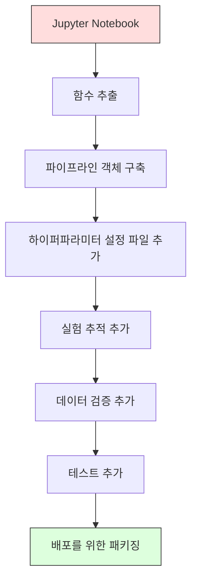

# ML 파이프라인

> 모델은 제품이 아니다. 파이프라인이 제품이다. 파이프라인은 원시 데이터부터 배포된 예측까지 모든 것을 포함하며, 모든 단계는 재현 가능해야 한다.

**유형:** 구축
**언어:** Python
**사전 요구 사항:** 2단계, 12강 (하이퍼파라미터 튜닝)
**소요 시간:** ~120분

## 학습 목표

- 결측치 대체(imputation), 스케일링(scaling), 인코딩(encoding), 모델 학습을 하나의 재현 가능한 객체로 연결하는 ML 파이프라인을 처음부터 구축
- 데이터 누수(data leakage) 시나리오를 식별하고, 파이프라인이 훈련 데이터에만 변환기(transformer)를 피팅(fitting)하여 이를 방지하는 방법 설명
- 수치형(numeric) 및 범주형(categorical) 특성에 서로 다른 전처리를 적용하는 ColumnTransformer 구성
- 파이프라인 직렬화(serialization) 구현 및 동일한 피팅된 파이프라인이 훈련과 프로덕션에서 동일한 결과를 생성함을 입증

## 문제

데이터를 로드하고, 결측값을 중앙값(median)으로 채우고, 특성(scale features)을 스케일링하며, 모델을 훈련하고 정확도를 출력하는 노트북이 있습니다. 이 노트북은 작동합니다. 그리고 이를 배포합니다.

한 달 후, 누군가가 모델을 재훈련했을 때 다른 결과가 나옵니다. 중앙값은 테스트 데이터를 포함한 전체 데이터셋에서 계산되었습니다(데이터 누수(data leakage)). 스케일링 파라미터가 저장되지 않아 추론 시 다른 통계값이 사용됩니다. 특성 공학(feature engineering) 코드가 훈련과 서빙 간에 복사-붙여넣기되었고, 복사본들이 서로 달라졌습니다. 범주형 열에 프로덕션에서 본 적 없는 새로운 값이 추가되었지만, 인코더(encoder)는 이를 처리할 수 없습니다.

이 문제들은 가상의 시나리오가 아닙니다. ML 시스템이 프로덕션에서 실패하는 가장 흔한 이유들입니다. 파이프라인(pipeline)은 모든 변환 단계를 하나의 순서화된 재현 가능한 객체로 패키징하여 이러한 문제들을 모두 해결합니다.

## 개념

### 파이프라인(PIPELINE)이란?

파이프라인은 데이터 변환의 순서화된 시퀀스에 모델을 추가한 것입니다. 각 단계는 이전 단계의 출력을 입력으로 받습니다. 전체 파이프라인은 학습 데이터에 대해 한 번 적합(fit)됩니다. 추론 시에는 동일한 적합된 파이프라인이 새로운 데이터를 변환하고 예측을 생성합니다.


파이프라인은 다음을 보장합니다:
- 변환은 학습 데이터에만 적합됨 (누출 없음)
- 추론 시에도 동일한 변환이 적용됨
- 전체 객체를 직렬화하여 하나의 아티팩트로 배포 가능
- 교차 검증은 폴드마다 파이프라인을 적용하여 미묘한 누출을 방지

### 데이터 누출(DATA LEAKAGE): 소리 없는 살인자

데이터 누출은 테스트 세트 또는 미래 데이터의 정보가 학습을 오염시킬 때 발생합니다. 파이프라인은 가장 일반적인 형태의 누출을 방지합니다.

**누출 발생 (잘못된 예):**
```python
X = df.drop("target", axis=1)
y = df["target"]

scaler = StandardScaler()
X_scaled = scaler.fit_transform(X)

X_train, X_test = X_scaled[:800], X_scaled[800:]
y_train, y_test = y[:800], y[800:]
```

스케일러가 테스트 데이터를 보았습니다. 평균과 표준편차에 테스트 샘플이 포함됩니다. 이는 정확도 추정치를 부풀립니다.

**올바른 예:**
```python
X_train, X_test = X[:800], X[800:]

scaler = StandardScaler()
X_train_scaled = scaler.fit_transform(X_train)
X_test_scaled = scaler.transform(X_test)
```

파이프라인을 사용하면 이를 고려할 필요가 없습니다. 파이프라인이 자동으로 처리합니다.

### sklearn 파이프라인

sklearn의 `Pipeline`은 변환기와 추정기를 연결합니다. `.fit()`, `.predict()`, `.score()`를 노출하며 모든 단계를 순서대로 적용합니다.

```python
from sklearn.pipeline import Pipeline
from sklearn.preprocessing import StandardScaler
from sklearn.linear_model import LogisticRegression

pipe = Pipeline([
    ("scaler", StandardScaler()),
    ("model", LogisticRegression()),
])

pipe.fit(X_train, y_train)
predictions = pipe.predict(X_test)
```

`pipe.fit(X_train, y_train)`을 호출하면:
1. 스케일러가 X_train에 대해 `fit_transform` 호출
2. 모델이 스케일링된 X_train에 대해 `fit` 호출

`pipe.predict(X_test)`를 호출하면:
1. 스케일러가 X_test에 대해 `transform` (fit_transform이 아님) 호출
2. 모델이 스케일링된 X_test에 대해 `predict` 호출

스케일러는 학습 중에 테스트 데이터를 절대 보지 않습니다. 이것이 핵심입니다.

### ColumnTransformer: 다른 열에 대한 다른 파이프라인

실제 데이터셋에는 서로 다른 전처리가 필요한 수치형 및 범주형 열이 있습니다. `ColumnTransformer`가 이를 처리합니다.

```python
from sklearn.compose import ColumnTransformer
from sklearn.preprocessing import StandardScaler, OneHotEncoder
from sklearn.impute import SimpleImputer

numeric_pipe = Pipeline([
    ("impute", SimpleImputer(strategy="median")),
    ("scale", StandardScaler()),
])

categorical_pipe = Pipeline([
    ("impute", SimpleImputer(strategy="most_frequent")),
    ("encode", OneHotEncoder(handle_unknown="ignore")),
])

preprocessor = ColumnTransformer([
    ("num", numeric_pipe, ["age", "income", "score"]),
    ("cat", categorical_pipe, ["city", "gender", "plan"]),
])

full_pipeline = Pipeline([
    ("preprocess", preprocessor),
    ("model", GradientBoostingClassifier()),
])
```

OneHotEncoder의 `handle_unknown="ignore"`는 프로덕션에 중요합니다. 새로운 범주(모델이 본 적 없는 도시)가 나타나면 충돌하지 않고 영벡터를 생성합니다.

### 실험 추적

파이프라인은 학습을 재현 가능하게 하지만, 실험 간 어떤 하이퍼파라미터가 사용되었는지, 어떤 데이터셋 버전인지, 메트릭은 무엇이었는지, 어떤 코드가 실행되었는지 등을 추적해야 합니다.

**MLflow**는 가장 일반적인 오픈소스 솔루션입니다:

```python
import mlflow

with mlflow.start_run():
    mlflow.log_param("max_depth", 5)
    mlflow.log_param("n_estimators", 100)
    mlflow.log_param("learning_rate", 0.1)

    pipe.fit(X_train, y_train)
    accuracy = pipe.score(X_test, y_test)

    mlflow.log_metric("accuracy", accuracy)
    mlflow.sklearn.log_model(pipe, "model")
```

모든 실행은 파라미터, 메트릭, 아티팩트, 전체 모델과 함께 기록됩니다. 실행을 비교하고, 어떤 실험이든 재현하며, 어떤 모델 버전이든 배포할 수 있습니다.

**Weights & Biases (wandb)**는 호스팅된 대시보드로 동일한 기능을 제공합니다:

```python
import wandb

wandb.init(project="my-pipeline")
wandb.config.update({"max_depth": 5, "n_estimators": 100})

pipe.fit(X_train, y_train)
accuracy = pipe.score(X_test, y_test)

wandb.log({"accuracy": accuracy})
```

### 모델 버전 관리

실험 추적 후에는 모델 버전을 관리해야 합니다. 어떤 모델이 프로덕션에 있는지, 스테이징에 있는지, 지난주 모델은 무엇인지 등.

MLflow의 모델 레지스트리는 다음을 제공합니다:
- **버전 추적:** 저장된 모든 모델은 버전 번호를 가짐
- **단계 전환:** "스테이징", "프로덕션", "아카이브"
- **승인 워크플로우:** 모델은 명시적으로 프로덕션으로 승격되어야 함
- **롤백:** 이전 버전으로 즉시 전환 가능

### DVC를 이용한 데이터 버전 관리

코드는 git으로 버전 관리됩니다. 데이터도 버전 관리되어야 하지만, git은 대용량 파일을 처리할 수 없습니다. DVC(Data Version Control)가 이를 해결합니다.

```
dvc init
dvc add data/training.csv
git add data/training.csv.dvc data/.gitignore
git commit -m "학습 데이터 추적"
dvc push
```

DVC는 실제 데이터를 원격 저장소(S3, GCS, Azure)에 저장하고, 해시를 기록하는 작은 `.dvc` 파일을 git에 유지합니다. git 커밋을 체크아웃할 때 `dvc checkout`은 사용된 정확한 데이터를 복원합니다.

이는 모든 git 커밋이 코드와 데이터를 모두 고정(pin)함을 의미합니다. 완전한 재현성이 보장됩니다.

### 재현 가능한 실험

재현 가능한 실험은 다음 네 가지가 필요합니다:

1. **고정된 난수 시드:** numpy, random, 프레임워크(torch, sklearn)의 시드 설정
2. **고정된 의존성:** 정확한 버전이 명시된 requirements.txt 또는 poetry.lock
3. **버전 관리된 데이터:** DVC 또는 유사 도구
4. **설정 파일:** 모든 하이퍼파라미터를 설정 파일에 명시, 하드코딩 금지

```python
import numpy as np
import random

def set_seed(seed=42):
    random.seed(seed)
    np.random.seed(seed)
    try:
        import torch
        torch.manual_seed(seed)
        torch.cuda.manual_seed_all(seed)
        torch.backends.cudnn.deterministic = True
    except ImportError:
        pass
```

### 노트북에서 프로덕션 파이프라인으로



일반적인 진행 과정:

1. **노트북 탐색:** 빠른 실험, 시각화, 특성 아이디어
2. **함수 추출:** 전처리, 특성 공학, 평가를 모듈로 이동
3. **파이프라인 구축:** 변환을 sklearn Pipeline 또는 사용자 정의 클래스로 연결
4. **설정 관리:** 모든 하이퍼파라미터를 YAML/JSON 설정 파일로 이동
5. **실험 추적:** MLflow 또는 wandb 로깅 추가
6. **데이터 검증:** 학습 전 스키마, 분포, 결측치 패턴 확인
7. **테스트:** 변환기 단위 테스트, 전체 파이프라인 통합 테스트
8. **배포:** 파이프라인 직렬화, API(FastAPI, Flask)로 래핑, 컨테이너화

### 일반적인 파이프라인 실수

| 실수 | 왜 나쁜가 | 해결 방법 |
|---------|-------------|-----|
| 분할 전 전체 데이터에 적합 | 데이터 누출 | 교차 검증과 함께 Pipeline 사용 |
| 파이프라인 외부에서의 특성 공학 | 학습 시와 서빙 시 다른 변환 | 모든 변환을 Pipeline에 포함 |
| 알 수 없는 범주 처리 안 함 | 새로운 값으로 인한 프로덕션 충돌 | OneHotEncoder(handle_unknown="ignore") |
| 하드코딩된 열 이름 | 스키마 변경 시 깨짐 | 설정 파일에서 열 이름 목록 사용 |
| 데이터 검증 없음 | 나쁜 데이터에 대한 예측 오류 | 예측 전 스키마 검사 추가 |
| 학습/서빙 불일치 | 프로덕션에서 다른 특성 사용 | 학습과 서빙에 동일한 Pipeline 객체 사용

## 빌드하기

`code/pipeline.py`의 코드는 처음부터 완전한 ML 파이프라인을 구축합니다:

### 1단계: 커스텀 트랜스포머

```python
class CustomTransformer:
    def __init__(self):
        self.means = None
        self.stds = None

    def fit(self, X):
        self.means = np.mean(X, axis=0)
        self.stds = np.std(X, axis=0)
        self.stds[self.stds == 0] = 1.0
        return self

    def transform(self, X):
        return (X - self.means) / self.stds

    def fit_transform(self, X):
        return self.fit(X).transform(X)
```

### 2단계: 처음부터 만드는 파이프라인

```python
class PipelineFromScratch:
    def __init__(self, steps):
        self.steps = steps

    def fit(self, X, y=None):
        X_current = X.copy()
        for name, step in self.steps[:-1]:
            X_current = step.fit_transform(X_current)
        name, model = self.steps[-1]
        model.fit(X_current, y)
        return self

    def predict(self, X):
        X_current = X.copy()
        for name, step in self.steps[:-1]:
            X_current = step.transform(X_current)
        name, model = self.steps[-1]
        return model.predict(X_current)
```

### 3단계: 파이프라인을 통한 교차 검증

이 코드는 파이프라인을 사용한 교차 검증이 데이터 누수를 방지하는 방법을 보여줍니다: 스케일러는 각 폴드의 학습 데이터에 대해 별도로 적합됩니다.

### 4단계: `scikit-learn`을 활용한 완전한 프로덕션 파이프라인

`ColumnTransformer`, 여러 전처리 경로, 모델을 포함한 완전한 파이프라인으로, 적절한 교차 검증과 실험 로깅을 통해 학습됩니다.

## Ship It

이 레슨은 다음을 생성합니다:
- `outputs/prompt-ml-pipeline.md` -- ML 파이프라인 구축 및 디버깅을 위한 기술 문서
- `code/pipeline.py` -- sklearn을 통한 처음부터 완성하는 전체 파이프라인 코드

## 연습 문제

1. 3개의 숫자형 컬럼과 2개의 범주형 컬럼을 가진 데이터셋을 처리하는 파이프라인을 구축하세요. `ColumnTransformer`를 사용하여 숫자형에는 중앙값 대체(median imputation) + 스케일링(scaling)을, 범주형에는 최빈값 대체(most-frequent imputation) + 원-핫 인코딩(one-hot encoding)을 적용하세요. 5-폴드 교차 검증으로 학습시키세요.

2. 의도적으로 데이터 누수를 발생시키세요: 분할 전에 전체 데이터셋에 대해 스케일러(scaler)를 학습시킵니다. 교차 검증 점수(누수 발생)와 파이프라인 교차 검증 점수(정상)를 비교하세요. 차이는 얼마나 큰가요?

3. `joblib.dump`로 파이프라인을 직렬화하세요. 별도의 스크립트에서 로드하여 예측을 실행하세요. 예측 결과가 동일한지 확인하세요.

4. 파이프라인에 사용자 정의 변환기를 추가하여 가장 중요한 두 숫자형 컬럼에 대해 2차 다항식 특성(polynomial features)을 생성하세요. 이 변환기는 파이프라인의 어디에 위치해야 할까요?

5. 파이프라인에 대해 MLflow 추적을 설정하세요. 서로 다른 하이퍼파라미터로 5번의 실험을 실행하세요. MLflow UI(`mlflow ui`)를 사용하여 실행 결과를 비교하고 최적의 모델을 선택하세요.

## Key Terms

| Term | What people say | What it actually means |
|------|----------------|----------------------|
| Pipeline | "변환과 모델의 체인" | 데이터 누출을 방지하기 위해 하나의 단위로 적용되는 피팅된 변환기와 모델의 순서화된 시퀀스 |
| Data leakage | "테스트 정보가 훈련에 유출됨" | 훈련 세트 외부의 정보를 사용하여 모델을 구축하고 성능 추정치를 부풀리는 것 |
| ColumnTransformer | "열별 다른 전처리" | 서로 다른 열 하위 집합에 다른 파이프라인을 적용하고 결과를 결합 |
| Experiment tracking | "실행 로그 기록" | 모든 훈련 실행에 대한 매개변수, 메트릭, 아티팩트, 코드 버전을 기록 |
| MLflow | "모델 추적 및 배포" | 실험 추적, 모델 레지스트리, 배포를 위한 오픈 소스 플랫폼 |
| DVC | "데이터를 위한 Git" | 대용량 데이터 파일을 위한 버전 관리 시스템, 해시는 git에 저장하고 데이터는 원격 저장소에 저장 |
| Model registry | "모델 버전 카탈로그" | 스테이지 레이블(스테이징, 프로덕션, 보관됨)로 모델 버전을 추적하는 시스템 |
| Training/serving skew | "노트북에서는 작동했어" | 훈련 시와 추론 시 데이터 처리 방식의 차이로 인한 무음 오류 |
| Reproducibility | "같은 코드, 같은 결과" | 동일한 코드, 데이터, 구성에서 동일한 결과를 얻을 수 있는 능력

## 추가 자료

- [scikit-learn Pipeline 문서](https://scikit-learn.org/stable/modules/compose.html) -- 공식 파이프라인 참조
- [MLflow 문서](https://mlflow.org/docs/latest/index.html) -- 실험 추적 및 모델 레지스트리
- [DVC 문서](https://dvc.org/doc) -- 데이터 버전 관리
- [Sculley et al., Hidden Technical Debt in Machine Learning Systems (2015)](https://papers.nips.cc/paper/2015/hash/86df7dcfd896fcaf2674f757a2463eba-Abstract.html) -- ML 시스템 복잡성에 대한 기초 논문
- [Google ML 모범 사례: Rules of ML](https://developers.google.com/machine-learning/guides/rules-of-ml) -- 실용적인 프로덕션 ML 조언