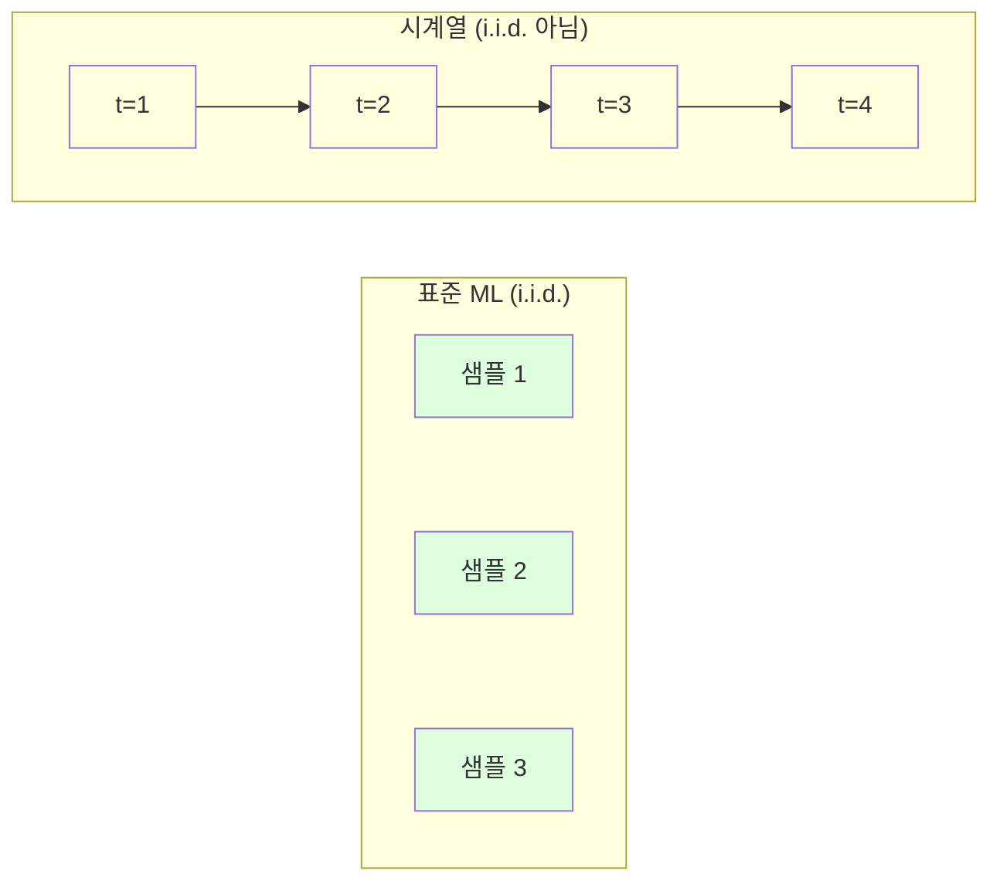
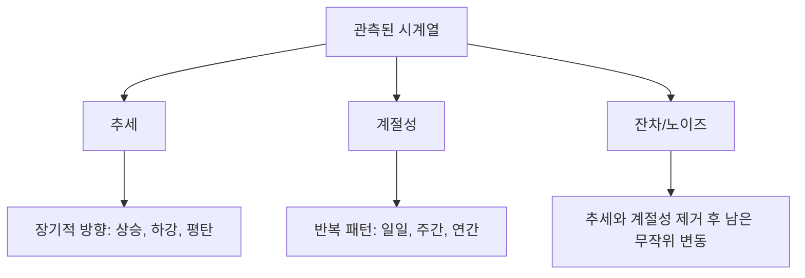
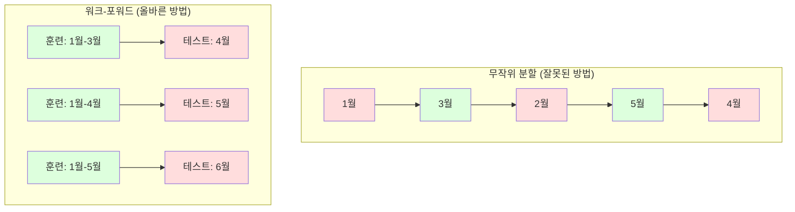

# 시계열 기초

> 과거 성과는 미래 결과를 예측할 수 있다 — 단, 정상성(stationarity)을 먼저 확인해야 한다.

**유형:** Build  
**언어:** Python  
**선수 지식:** Phase 2, Lessons 01-09  
**소요 시간:** ~90분

## 학습 목표

- 시계열을 추세(trend), 계절성(seasonality), 잔차(residual) 성분으로 분해하고 정상성(stationarity) 검정을 수행
- 시계열을 지도 학습 문제로 변환하기 위해 지연 특성(lag features) 및 이동 통계량(rolling statistics)을 구현
- 미래 데이터가 훈련에 누출되는 것을 방지하는 워크포워드 검증(walk-forward validation) 프레임워크 구축
- 시계열에 무작위 훈련/테스트 분할이 왜 무효한지 설명하고, 적절한 시간 기반 분할과의 성능 차이 입증

## 문제 정의

시간에 따라 정렬된 데이터가 있습니다. 일일 매출, 시간별 온도, 분당 CPU 사용량, 주간 주가 등이 그 예입니다. 다음 값, 다음 주, 다음 분기의 값을 예측하고 싶습니다.

표준 ML 도구킷(랜덤 train/test 분할, 교차 검증, 특성 행렬 입력, 예측 출력)을 사용하려고 합니다. 하지만 모든 단계가 잘못되었습니다.

시계열 데이터는 표준 ML이 의존하는 가정을 무너뜨립니다. 샘플들은 독립적이지 않습니다. 오늘의 온도는 어제의 온도에 의존합니다. 랜덤 분할은 미래 정보를 과거로 유출시킵니다. 백테스트에서 훌륭해 보이는 특성들은 시간이 지남에 따라 변화하는 패턴에 의존하기 때문에 실제 운영 환경에서는 실패합니다.

랜덤 교차 검증으로 95% 정확도를 달성한 모델이 시간 기반 평가를 적용하면 55% 정확도를 보일 수 있습니다. 이 차이는 단순한 기술적 문제가 아닙니다. 이는 논문에서만 작동하는 모델과 실제 운영 환경에서 작동하는 모델의 차이입니다.

이 강의에서는 시간 데이터의 고유한 특성, 모델을 정직하게 평가하는 방법, 그리고 표준 ML 모델이 처리할 수 있는 특성으로 시계열을 변환하는 기본 원리를 다룹니다.

## 개념

### 시계열 데이터의 특징

표준 ML은 i.i.d. (독립적이고 동일한 분포)를 가정합니다. 각 샘플은 다른 샘플과 독립적으로 동일한 분포에서 추출됩니다. 시계열 데이터는 이 두 가정을 모두 위반합니다:

- **독립적이지 않음.** 오늘의 주식 가격은 어제의 가격에 의존합니다. 이번 주 매출은 지난 주 매출과 상관관계가 있습니다.
- **동일한 분포가 아님.** 시간에 따라 분포가 변화합니다. 12월의 매출은 3월의 매출과 다르게 보입니다.

이러한 위반은 사소한 것이 아닙니다. 이는 피처 생성 방법, 모델 평가 방법, 그리고 작동하는 알고리즘을 변화시킵니다.



표준 ML에서는 샘플이 교환 가능합니다. 샘플 순서를 바꿔도 아무 영향이 없습니다. 시계열 데이터에서는 순서가 모든 것입니다. 순서를 바꾸면 신호가 파괴됩니다.

### 시계열 데이터의 구성 요소

모든 시계열 데이터는 다음 요소들의 조합입니다:



- **추세(Trend):** 장기적인 방향. 연간 10% 성장하는 매출. 상승하는 지구 온도.
- **계절성(Seasonality):** 고정된 간격으로 반복되는 패턴. 12월에 급증하는 소매 매출. 7월에 최고치를 기록하는 에어컨 사용량.
- **잔차(Residual):** 추세와 계절성을 제거한 후 남은 것. 잔차가 백색 잡음처럼 보인다면, 분해가 신호를 포착한 것입니다.

### 정상성(Stationarity)

시계열 데이터가 정상(stationary)하다는 것은 통계적 특성(평균, 분산, 자기상관)이 시간에 따라 변하지 않는다는 것을 의미합니다. 대부분의 예측 방법은 정상성을 가정합니다.

**중요성:** 비정상 시계열은 평균이 표류합니다. 1월 데이터로 학습한 모델은 2월에 나타날 다른 평균을 학습하게 되어 체계적으로 오류를 발생시킵니다.

**확인 방법:** 롤링 평균과 롤링 표준편차를 윈도우 단위로 계산합니다. 이들이 표류하면 비정상 시계열입니다.

**해결 방법:** 차분(Differencing). 원시 값을 모델링하는 대신 연속 값 간의 변화를 모델링합니다:

```
diff[t] = value[t] - value[t-1]
```

1차 차분으로 정상성이 달성되지 않으면 2차 차분을 적용합니다. 대부분의 실제 데이터는 최대 2회의 차분으로 충분합니다.

**예시:**

원본 시계열: [100, 102, 106, 112, 120]  
1차 차분: [2, 4, 6, 8] (여전히 상승 추세)  
2차 차분: [2, 2, 2] (정상)

원본 시계열은 2차 추세를 가졌습니다. 1차 차분은 선형 추세로 변환했고, 2차 차분은 평탄하게 만들었습니다. 실제로는 2회 이상의 차분이 거의 필요하지 않습니다.

**공식적 검정:** Augmented Dickey-Fuller (ADF) 검정은 정상성 검정의 표준 통계 방법입니다. 귀무가설은 "시계열은 비정상이다"입니다. p-값이 0.05 미만이면 귀무가설을 기각하고 정상성을 결론짓습니다. ADF를 직접 구현하지는 않지만(점근적 분포 표가 필요함), 코드에서 롤링 통계 접근법은 실용적인 시각적 확인을 제공합니다.

### 자기상관(Autocorrelation)

자기상관은 시간 t의 값이 t-k(과거 k단계)의 값과 얼마나 상관되는지를 측정합니다. 자기상관 함수(ACF)는 각 시차 k에 대한 상관관계를 플롯합니다.

**ACF가 알려주는 것:**
- 시계열이 얼마나 과거를 기억하는지. ACF가 시차 5 이후 0으로 떨어지면 5단계 이상의 값은 무관합니다.
- 계절성 존재 여부. ACF가 시차 12(월별 데이터)에서 피크를 보이면 연간 계절성이 있습니다.
- 생성할 시차 피처 수. ACF가 무시할 수 있을 정도로 작아지는 시차까지 사용합니다.

**PACF(Partial Autocorrelation Function)**는 간접 상관관계를 제거합니다. 오늘 값이 3일 전 값과 상관있는 것이 어제 값과의 상관관계 때문이라면, 시차 3의 PACF는 0이지만 ACF는 0이 아닙니다.

### 시차 피처: 시계열을 지도 학습으로 변환

표준 ML 모델은 피처 행렬 X와 타겟 y가 필요합니다. 시계열 데이터는 단일 열의 값을 제공합니다. 시차 피처가 이 간극을 메웁니다.

시계열 [10, 12, 14, 13, 15]에서 시차-1과 시차-2 피처를 생성합니다:

| lag_2 | lag_1 | target |
|-------|-------|--------|
| 10    | 12    | 14     |
| 12    | 14    | 13     |
| 14    | 13    | 15     |

이제 표준 회귀 문제가 되었습니다. 어떤 ML 모델(선형 회귀, 랜덤 포레스트, 그래디언트 부스팅)이든 시차로부터 타겟을 예측할 수 있습니다.

추가 생성 가능한 피처:
- **롤링 통계량:** 최근 k개 값의 평균, 표준편차, 최소, 최대
- **캘린더 피처:** 요일, 월, 휴일 여부, 주말 여부
- **차분 값:** 이전 단계로부터의 변화량
- **확장 통계량:** 누적 평균, 누적 합계
- **비율 피처:** 현재 값 / 롤링 평균 (최근 평균으로부터의 거리)
- **상호작용 피처:** lag_1 * 요일 (요일별 모멘텀 효과)

**시차 수 결정:** 자기상관 함수를 사용합니다. ACF가 시차 10까지 유의미하면 최소 10개 시차를 사용합니다. 주간 계절성이 있다면 시차 7(및 14)을 포함합니다. 더 많은 시차는 모델에 더 많은 역사를 제공하지만, 과적합 위험도 증가시킵니다.

**타겟 정렬 함정.** 시차 피처를 생성할 때 타겟은 시간 t의 값이어야 하며, 모든 피처는 시간 t-1 또는 그 이전의 값을 사용해야 합니다. 실수로 시간 t의 값을 피처로 포함하면 완벽한 예측자가 생기지만, 완전히 쓸모없는 모델이 됩니다. 이는 시계열 피처 엔지니어링에서 가장 흔한 오류입니다.

### 워크-포워드 검증(Walk-Forward Validation)

이 레슨에서 가장 중요한 개념입니다. 표준 k-폴드 교차 검증은 샘플을 무작위로 훈련/테스트에 할당합니다. 시계열 데이터에서는 이 방법이 미래 정보를 누출합니다.



워크-포워드 검증:
1. 시간 t까지의 데이터로 훈련
2. 시간 t+1(또는 t+1~t+k의 다단계) 예측
3. 윈도우를 앞으로 이동
4. 반복

각 테스트 폴드는 훈련 데이터 이후의 데이터만 포함합니다. 미래 정보 누출이 없어 배포 시 모델 성능을 정직하게 추정할 수 있습니다.

**확장 윈도우(Expanding window):** 모든 과거 데이터를 훈련에 사용합니다(윈도우가 커짐). 오래된 데이터가 여전히 관련이 있다고 믿을 때 사용합니다. **슬라이딩 윈도우(Sliding window):** 고정 크기의 훈련 윈도우를 사용합니다(윈도우가 이동). 세상이 변해서 오래된 데이터가 방해가 될 때 사용합니다.

### ARIMA 직관

ARIMA는 고전적인 시계열 모델입니다. 세 가지 구성 요소가 있습니다:

- **AR (자기회귀):** 과거 값으로부터 예측. AR(p)는 최근 p개 값을 사용합니다.
- **I (적분):** 정상성 달성을 위한 차분. I(d)는 d회 차분을 적용합니다.
- **MA (이동 평균):** 과거 예측 오류로부터 예측. MA(q)는 최근 q개 오류를 사용합니다.

ARIMA(p, d, q)는 이 세 가지를 결합합니다. ACF/PACF 분석이나 자동화된 탐색(auto-ARIMA)을 기반으로 p, d, q를 선택합니다.

ARIMA를 직접 구현하지는 않습니다(이 레슨 범위를 벗어나는 수치 최적화가 필요함). 핵심 통찰은 각 구성 요소의 역할을 이해하여 ARIMA 결과를 해석하고 언제 사용할지 아는 것입니다.

### 어떤 방법을 사용할 것인가

| 접근법 | 적합한 경우 | 계절성 처리 | 외부 피처 처리 |
|----------|---------|-------------------|------------------------|
| 시차 피처 + ML | 많은 외부 피처가 있는 테이블 형식 데이터 | 캘린더 피처로 처리 | 가능 |
| ARIMA | 단일 변수 시계열, 단기 예측 | SARIMA 변형 | 제한적 (ARIMAX) |
| 지수 평활 | 단순한 추세 + 계절성 | 가능 (Holt-Winters) | 불가능 |
| Prophet | 비즈니스 예측, 휴일 반영 | 가능 (푸리에 항) | 제한적 |
| 신경망 (LSTM, Transformer) | 긴 시퀀스, 많은 시계열 | 학습 가능 | 가능 |

대부분의 실제 문제에서는 시차 피처 + 그래디언트 부스팅이 가장 강력한 시작점입니다. 외부 피처를 자연스럽게 처리하고, 정상성이 필요하지 않으며, 디버깅이 쉽습니다.

### 예측 범위와 전략

단일 단계 예측은 한 단계 앞을 예측합니다. 다단계 예측은 여러 단계를 예측합니다. 세 가지 전략이 있습니다:

**재귀적(반복적):** 한 단계 예측 후 예측값을 다음 단계 입력으로 사용. 간단하지만 오류가 누적됩니다. 각 예측은 이전 예측을 사용하므로 실수가 증폭됩니다.

**직접적:** 각 예측 범위에 대해 별도의 모델을 훈련. 모델-1은 t+1을, 모델-5는 t+5를 예측. 오류 누적은 없지만 각 모델은 훈련 샘플이 적고 정보를 공유하지 않습니다.

**다중 출력:** 모든 범위를 동시에 출력하는 단일 모델을 훈련. 범위 간 정보를 공유하지만 다중 출력을 지원하는 모델(또는 사용자 정의 손실 함수)이 필요합니다.

대부분의 실제 문제에서는 단기 범위(1-5단계)에는 재귀적 전략을, 장기 범위에는 직접적 전략을 사용합니다.

### 시계열 데이터의 흔한 실수

| 실수 | 발생 원인 | 해결 방법 |
|---------|---------------|-----------|
| 무작위 훈련/테스트 분할 | 표준 ML 습관 | 워크-포워드 또는 시간 기반 분할 사용 |
| 미래 피처 사용 | 실수로 시간 t의 피처 포함 | 모든 피처의 시간적 정렬 감사 |
| 계절성에 과적합 | 모델이 캘린더 패턴 암기 | 테스트 세트에 완전한 계절 주기 제외 |
| 규모 변화 무시 | 매출은 두 배가 되지만 패턴은 유지 | 절댓값 대신 백분율 변화 모델링 |
| 너무 많은 시차 피처 | "더 많은 역사가 더 좋다" | ACF로 관련 시차 결정 |
| 차분 미적용 | "모델이 알아서 처리할 것" | 트리 모델은 추세 처리 가능; 선형 모델은 정상성 필요 |

## 구축

`code/time_series.py`의 코드는 핵심 구성 요소를 처음부터 구현합니다.

### 지연 특성 생성기(Lag Feature Creator)

```python
def make_lag_features(series, n_lags):
    n = len(series)
    X = np.full((n, n_lags), np.nan)
    for lag in range(1, n_lags + 1):
        X[lag:, lag - 1] = series[:-lag]
    valid = ~np.isnan(X).any(axis=1)
    return X[valid], series[valid]
```

이것은 1D 시계열을 각 행에 마지막 `n_lags` 값을 특성으로, 현재 값을 타겟으로 하는 특성 행렬로 변환합니다.

### 워크포워드 교차 검증(Walk-Forward Cross-Validation)

```python
def walk_forward_split(n_samples, n_splits=5, min_train=50):
    assert min_train < n_samples, "min_train must be less than n_samples"
    step = max(1, (n_samples - min_train) // n_splits)
    for i in range(n_splits):
        train_end = min_train + i * step
        test_end = min(train_end + step, n_samples)
        if train_end >= n_samples:
            break
        yield slice(0, train_end), slice(train_end, test_end)
```

각 분할은 훈련 데이터가 테스트 데이터보다 엄격하게 이전이 되도록 보장합니다. 훈련 윈도우는 각 폴드마다 확장됩니다.

### 단순 자기회귀 모델(Simple Autoregressive Model)

순수 AR 모델은 지연 특성에 대한 선형 회귀입니다:

```python
class SimpleAR:
    def __init__(self, n_lags=5):
        self.n_lags = n_lags
        self.weights = None
        self.bias = None

    def fit(self, series):
        X, y = make_lag_features(series, self.n_lags)
        # 정규 방정식(normal equations)을 통해 해결
        X_b = np.column_stack([np.ones(len(X)), X])
        theta = np.linalg.lstsq(X_b, y, rcond=None)[0]
        self.bias = theta[0]
        self.weights = theta[1:]
        return self
```

이것은 개념적으로 레슨 02의 선형 회귀와 동일하지만, 동일한 변수의 시간 지연 버전에 적용됩니다.

### 정상성 확인(Stationarity Check)

코드는 롤링 통계를 계산하여 정상성을 시각적 및 수치적으로 평가합니다:

```python
def check_stationarity(series, window=50):
    rolling_mean = np.array([
        series[max(0, i - window):i].mean()
        for i in range(1, len(series) + 1)
    ])
    rolling_std = np.array([
        series[max(0, i - window):i].std()
        for i in range(1, len(series) + 1)
    ])
    return rolling_mean, rolling_std
```

롤링 평균이 드리프트하거나 롤링 표준편차가 변하면 시계열이 비정상적입니다. 차분을 적용하고 다시 확인합니다.

코드는 또한 시계열의 전반부와 후반부를 비교하여 정상성을 확인합니다. 평균이 표준편차의 절반 이상 차이가 나거나 분산 비율이 2배를 초과하면 비정상 시계열로 플래그됩니다.

### 자기상관(Autocorrelation)

```python
def autocorrelation(series, max_lag=20):
    n = len(series)
    mean = series.mean()
    var = series.var()
    acf = np.zeros(max_lag + 1)
    for k in range(max_lag + 1):
        cov = np.mean((series[:n-k] - mean) * (series[k:] - mean))
        acf[k] = cov / var if var > 0 else 0
    return acf
```

## 사용 방법

sklearn에서는 모든 회귀 모델에 지연 특성(lag features)을 직접 사용할 수 있습니다:

```python
from sklearn.linear_model import Ridge
from sklearn.ensemble import GradientBoostingRegressor

X, y = make_lag_features(series, n_lags=10)

for train_idx, test_idx in walk_forward_split(len(X)):
    model = Ridge(alpha=1.0)
    model.fit(X[train_idx], y[train_idx])
    predictions = model.predict(X[test_idx])
```

ARIMA의 경우 statsmodels를 사용합니다:

```python
from statsmodels.tsa.arima.model import ARIMA

model = ARIMA(train_series, order=(5, 1, 2))
fitted = model.fit()
forecast = fitted.forecast(steps=30)
```

`time_series.py` 코드는 두 접근 방식을 모두 시연하며 워크포워드 검증(walk-forward validation)을 통해 비교합니다.

### sklearn TimeSeriesSplit

sklearn은 워크포워드 검증을 구현하는 `TimeSeriesSplit`을 제공합니다:

```python
from sklearn.model_selection import TimeSeriesSplit

tscv = TimeSeriesSplit(n_splits=5)
for train_index, test_index in tscv.split(X):
    X_train, X_test = X[train_index], X[test_index]
    y_train, y_test = y[train_index], y[test_index]
    model.fit(X_train, y_train)
    score = model.score(X_test, y_test)
```

이는 직접 구현한 `walk_forward_split`과 동일하지만 sklearn의 교차 검증 프레임워크에 통합되어 있습니다. `cross_val_score`와 함께 사용할 수 있습니다:

```python
from sklearn.model_selection import cross_val_score

scores = cross_val_score(model, X, y, cv=TimeSeriesSplit(n_splits=5))
print(f"평균 점수: {scores.mean():.4f} +/- {scores.std():.4f}")
```

### 평가 지표

시계열 예측은 회귀 지표를 사용하지만 시간 인식 컨텍스트를 고려합니다:

- **MAE (Mean Absolute Error):** |y_true - y_pred|의 평균. 원본 단위로 해석하기 쉬움. "평균적으로 예측이 3.2도 벗어납니다."
- **RMSE (Root Mean Squared Error):** 평균 제곱 오차의 제곱근. MAE보다 큰 오차에 더 큰 패널티를 부여. 큰 오차가 여러 작은 오차보다 더 나쁜 경우 사용.
- **MAPE (Mean Absolute Percentage Error):** |오차 / 실제값| * 100의 평균. 스케일 독립적, 다른 시리즈 간 비교에 유용. 하지만 실제값이 0일 때 정의되지 않음.
- **순진 기준선(Naive baseline) 비교:** 항상 단순한 기준선과 비교. 계절적 순진 기준선은 한 기간 전(어제, 지난주)의 값을 예측. 모델이 순진 기준선을 이기지 못하면 문제가 있는 것.

### 롤링 특성

코드는 지연 특성에 7일 및 14일 윈도우의 롤링 통계(평균, 표준편차, 최소, 최대)를 추가하는 방법을 보여줍니다. 이는 지연 특성만으로는 포착할 수 없는 최근 추세와 변동성에 대한 정보를 모델에 제공합니다.

예를 들어, 롤링 평균이 상승하면 상승 추세를 시사합니다. 롤링 표준편차가 증가하면 변동성이 커지고 있음을 나타냅니다. 이러한 패턴은 트리 기반 모델은 학습할 수 있지만 선형 모델은 학습할 수 없습니다.

## Ship It

이 레슨은 다음을 생성합니다:
- `outputs/prompt-time-series-advisor.md` -- 시계열 문제 프레이밍을 위한 프롬프트
- `code/time_series.py` -- 지연 특성(lag features), 워크포워드 검증(walk-forward validation), AR 모델, 정상성 검증(stationarity checks)

### 반드시 이겨야 하는 베이스라인

모델 구축 전에 베이스라인을 설정하세요:

1. **마지막 값(지속성, persistence).** 내일은 오늘과 같을 것이라고 예측합니다. 많은 시계열에서 이 베이스라인을 이기기가 의외로 어렵습니다.
2. **계절성 나이브(seasonal naive).** 오늘은 지난주(또는 작년) 같은 날과 같을 것이라고 예측합니다. 모델이 이 베이스라인을 이기지 못한다면, 계절성 이상의 유용한 패턴을 학습하지 못한 것입니다.
3. **이동 평균(moving average).** 최근 k개 값의 평균을 예측합니다. 노이즈는 완화하지만 갑작스러운 변화는 포착하지 못합니다.

만약 복잡한 ML 모델이 계절성 나이브 베이스라인에 진다면 버그가 있는 것입니다. 가장 흔한 원인: 특성의 미래 누출(future leakage), 잘못된 평가 방법, 또는 시계열이 실제로 무작위적이고 예측 불가능한 경우입니다.

### 실용적인 팁

1. **플롯으로 시작하세요.** 모델링 전에 원시 시계열을 플롯하세요. 추세, 계절성, 이상치, 구조적 변화(행동의 갑작스러운 변화)를 찾으세요. 30초의 시각적 검사가 자동화된 1시간 분석보다 더 많은 정보를 줄 수 있습니다.

2. **차분(differencing) 먼저, 모델링은 나중.** 시계열에 명확한 추세가 있다면 지연 특성 생성 전에 차분하세요. 트리 기반 모델은 추세를 처리할 수 있지만 선형 모델은 처리할 수 없으며, 차분은 절대 해롭지 않습니다.

3. **최소 한 번의 완전한 계절 주기를 테스트 세트로 분리하세요.** 주간 계절성이 있다면 테스트 세트에 최소 1주일이 필요합니다. 월간 계절성이라면 최소 1개월이 필요합니다. 그렇지 않으면 모델이 계절 패턴을 포착했는지 평가할 수 없습니다.

4. **프로덕션에서 모니터링하세요.** 시간이 지남에 따라 세상이 변하므로 시계열 모델은 성능이 저하됩니다. 예측 오차를 롤링 기반으로 추적하세요. 오차가 증가하기 시작하면 최근 데이터로 모델을 재학습시키세요.

5. **체제 변화(regime change)에 주의하세요.** 팬데믹 이전 데이터로 학습한 모델은 팬데믹 이후 행동을 예측하지 못합니다. 알려진 체제 변화 지표를 특성으로 포함하거나, 오래된 데이터를 잊는 슬라이딩 윈도우를 사용하세요.

6. **왜곡된 계열은 로그 변환하세요.** 매출, 가격, 카운트는 종종 우측으로 왜곡됩니다. 로그 변환은 분산을 안정화하고 곱셈 패턴을 덧셈 패턴으로 만들어 선형 모델이 처리할 수 있게 합니다. 로그 공간에서 예측한 후 지수 변환하여 원래 단위로 되돌리세요.

## 연습 문제

1. **정상성 실험.** 선형 추세가 있는 시계열을 생성합니다. 롤링 통계량으로 정상성을 확인합니다. 1차 차분을 적용합니다. 다시 확인합니다. 2차 추세에는 몇 번의 차분이 필요한가요?

2. **지연 선택.** 계절성 시계열(주기=7)에 대해 ACF를 계산합니다. 어떤 지연(lag)에서 자기상관이 가장 높은가요? 해당 지연만 사용하여 지연 특성(연속적 지연이 아님)을 생성합니다. 지연 1~7을 사용하는 것과 비교해 정확도가 향상되나요?

3. **워크포워드 vs 랜덤 분할.** 지연 특성에 대해 릿지 회귀(Ridge regression)를 훈련시킵니다. 랜덤 80/20 분할과 워크포워드 검증으로 평가합니다. 랜덤 분할이 성능을 얼마나 과대평가하나요?

4. **특성 공학.** 지연 특성에 롤링 평균(창=7), 롤링 표준편차(창=7), 요일(day-of-week) 특성을 추가합니다. 워크포워드 검증을 사용해 이 추가 특성 유무에 따른 정확도를 비교합니다.

5. **다단계 예측.** AR 모델을 수정하여 1단계가 아닌 5단계 앞을 예측합니다. 두 전략을 비교합니다: (a) 1단계 예측 후 예측값을 다음 단계 입력으로 사용(순환적 방법), (b) 각 예측 범위(horizon)마다 별도 모델 훈련(직접 방법). 어떤 방법이 더 정확한가요?

## 주요 용어

| 용어 | 사람들이 말하는 것 | 실제 의미 |
|------|----------------|----------------------|
| 정상성(Stationarity) | "시간에 따라 통계가 변하지 않음" | 평균, 분산, 자기상관 구조가 시간에 따라 일정한 시계열 |
| 차분(Differencing) | "연속된 값 빼기" | 추세 제거 및 정상성 달성을 위해 y[t] - y[t-1] 계산 |
| 자기상관(ACF) | "시계열이 자기 자신과 상관되는 정도" | 시차(lag)에 따른 시계열과 지연된 자기 자신 간의 상관 관계 |
| 부분 자기상관(PACF) | "직접 상관만" | 더 짧은 모든 시차의 영향을 제거한 후 lag k에서의 자기상관 |
| 시차 특성(Lag features) | "과거 값을 입력으로 사용" | y[t] 예측을 위해 y[t-1], y[t-2], ..., y[t-k]를 특성으로 사용 |
| 워크포워드 검증(Walk-forward validation) | "시간 순서를 존중하는 교차 검증" | 훈련 데이터가 항상 테스트 데이터보다 시간적으로 앞서는 평가 방식 |
| ARIMA | "고전적인 시계열 모델" | 자기회귀(AR), 차분(I), 이동평균(MA)을 결합한 모델 |
| 계절성(Seasonality) | "반복되는 달력 패턴" | 일별, 주별, 연별 등 달력 주기에 묶인 예측 가능한 주기 |
| 추세(Trend) | "장기적인 방향" | 시간에 따라 지속적으로 증가하거나 감소하는 시리즈 수준 |
| 확장 창(Expanding window) | "모든 역사 사용" | 각 폴드마다 훈련 세트가 증가하는 워크포워드 검증 |
| 슬라이딩 창(Sliding window) | "고정 크기 역사" | 고정된 길이의 훈련 창이 앞으로 이동하는 워크포워드 검증

## 추가 자료

- [Hyndman and Athanasopoulos, Forecasting: Principles and Practice (3rd ed.)](https://otexts.com/fpp3/) -- 시계열 예측을 위한 최고의 무료 교재
- [scikit-learn Time Series Split](https://scikit-learn.org/stable/modules/generated/sklearn.model_selection.TimeSeriesSplit.html) -- sklearn의 워크포워드 분할기
- [statsmodels ARIMA docs](https://www.statsmodels.org/stable/generated/statsmodels.tsa.arima.model.ARIMA.html) -- 진단 기능이 포함된 ARIMA 구현
- [Makridakis et al., The M5 Competition (2022)](https://www.sciencedirect.com/science/article/pii/S0169207021001874) -- ML 방법 대 통계 방법을 보여주는 대규모 예측 경연 대회