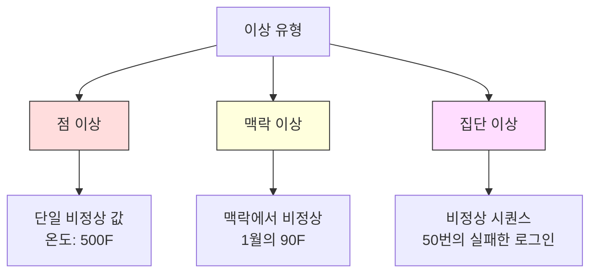
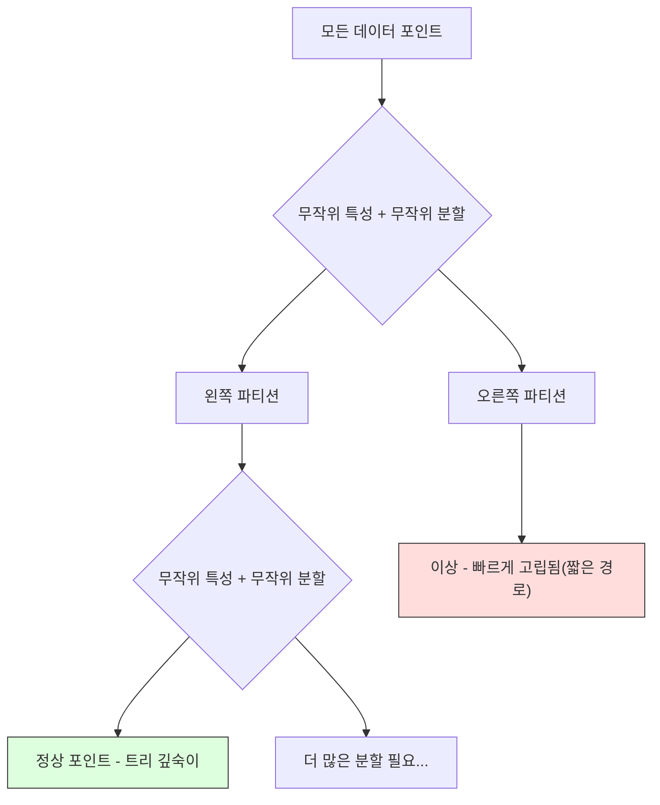
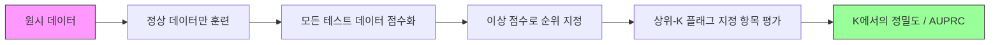

# 이상 감지(Anomaly Detection)

> 정상은 정의하기 쉽다. 비정상은 맞지 않는 모든 것이다.

**유형:** Build
**언어:** Python
**선수 지식:** Phase 2, Lessons 01-09
**소요 시간:** ~75분

## 학습 목표

- Z-점수, IQR, Isolation Forest 이상 탐지 방법을 처음부터 구현
- 점 이상(point), 맥락 이상(contextual), 집단 이상(collective)을 구분하고 각각에 적합한 탐지 방법 선택
- 이상 탐지가 이상 분류(classifying anomalies)가 아닌 정상 데이터 모델링(modeling normal data)으로 접근하는 이유 설명
- 비지도 이상 탐지와 지도 분류(supervised classification) 비교 및 새로운 이상 탐지 범위(novel anomaly coverage)와 정밀도(precision) 간 트레이드오프 평가

## 문제 정의

신용카드가 뉴욕에서 오후 2시에 사용된 후 2:05pm에 도쿄에서 사용됩니다. 공장 센서가 정상 범위인 80-120도일 때 150도를 기록합니다. 일일 평균 200회인 서버가 초당 50,000개의 요청을 보냅니다.

이것들은 이상 현상입니다. 이를 발견하는 것은 중요합니다. 사기는 수십억 달러의 손실을 초래합니다. 장비 고장은 가동 중단을 유발합니다. 네트워크 침입은 데이터 유출로 이어집니다.

문제점: 이상 현상에 대한 레이블된 예시를 거의 가지고 있지 않습니다. 사기는 거래의 0.1%를 차지합니다. 장비 고장은 1년에 몇 번 발생합니다. "이상" 클래스에 학습할 내용이 거의 없기 때문에 표준 분류기를 훈련시킬 수 없습니다. 일부 레이블이 있더라도, 지금까지 본 이상 현상만이 미래에 마주칠 유일한 유형은 아닙니다. 내일의 사기 수법은 오늘의 것과 다르게 나타납니다.

이상 탐지는 문제를 뒤집어 해결합니다. 비정상적인 것을 학습하는 대신 정상적인 것을 학습합니다. 정상에서 벗어난 모든 것은 의심스러운 것으로 간주됩니다. 이 방법은 레이블 없이도 작동하며, 새로운 유형의 이상 현상에 적응하고, 대규모 데이터셋에 확장 가능합니다.

## 개념

### 이상 유형

모든 이상이 동일하지는 않습니다:

- **점 이상(Point anomalies).** 맥락과 무관하게 비정상적인 단일 데이터 포인트. 500도의 온도 측정값. 일반적으로 50달러를 지출하는 계좌에서 발생한 50,000달러 거래.
- **맥락 이상(Contextual anomalies).** 주어진 맥락에서 비정상적인 데이터 포인트. 여름의 90도는 정상이지만 겨울에는 이상입니다. 동일한 값이지만 다른 맥락.
- **집단 이상(Collective anomalies).** 개별 포인트는 정상일 수 있지만 그룹으로서 비정상적인 데이터 포인트 시퀀스. 5번의 로그인 실패는 정상이지만 연속으로 50번은 무차별 대입 공격입니다.

대부분의 방법은 점 이상을 탐지합니다. 맥락 이상은 시간 또는 위치 특성이 필요합니다. 집단 이상은 시퀀스 인식 방법이 필요합니다.



### 비지도 학습 프레임워크

표준 분류에서는 두 클래스 모두에 대한 레이블이 있습니다. 이상 탐지에서는 일반적으로 다음 세 가지 상황 중 하나가 발생합니다:

1. **완전 비지도 학습(Fully unsupervised).** 레이블이 전혀 없습니다. 모든 데이터에 탐지기를 적합시키고 이상이 "정상" 모델을 오염시키지 않을 정도로 드물기를 바랍니다.
2. **준지도 학습(Semi-supervised).** 정상 데이터만 있는 깨끗한 데이터셋이 있습니다. 이 깨끗한 데이터셋에 적합시키고 나머지를 점수화합니다. 가능한 경우 가장 강력한 설정입니다.
3. **약한 지도 학습(Weakly supervised).** 몇 개의 레이블된 이상이 있습니다. 평가용으로만 사용하고 훈련에는 사용하지 않습니다. 비지도 학습을 훈련한 후 레이블된 부분집합에서 정밀도/재현율을 측정합니다.

핵심 통찰: 이상 탐지는 분류와 근본적으로 다릅니다. 두 클래스 사이의 결정 경계가 아닌 정상 데이터의 분포를 모델링합니다.

### 지도 학습 vs 비지도 학습: 트레이드오프

레이블된 이상이 있다면 훈련에 사용할지(지도 학습 분류) 아니면 평가용으로만 사용할지(비지도 학습 탐지) 결정해야 합니다.

**지도 학습(분류로 처리):**
- 이전에 본 정확한 유형의 이상을 포착
- 알려진 이상 유형에 대한 높은 정밀도
- 새로운 이상 유형은 완전히 놓침
- 새로운 이상 유형이 나타날 때 재훈련 필요
- 충분한 이상 예제 필요(종종 너무 적음)

**비지도 학습(정상 모델링, 편차 플래그 지정):**
- 새로운 유형을 포함한 정상에서 벗어난 모든 편차 포착
- 레이블된 이상 필요 없음
- 높은 오탐률(모든 비정상적인 것이 나쁜 것은 아님)
- 분포 변화에 더 강건

실제로 최상의 시스템은 둘을 결합합니다: 광범위한 커버리지를 위한 비지도 탐지, 알려진 고우선순위 이상 유형을 위한 지도 모델, 모호한 사례를 위한 인간 검토.

### Z-점수 방법

가장 간단한 접근법입니다. 각 특성의 평균과 표준편차를 계산합니다. 평균에서 k 표준편차 이상 떨어진 포인트를 플래그 지정합니다.

```text
z_score = (x - mean) / std
|z_score| > threshold이면 이상
```

기본 임계값은 3.0입니다(가우시안 분포에서 정상 데이터의 99.7%가 3 표준편차 내에 있음).

**강점:** 간단합니다. 빠릅니다. 해석 가능("이 값은 정상에서 4.5 표준편차 벗어남").

**약점:** 데이터가 정규 분포를 따른다고 가정합니다. 훈련 데이터의 이상치에 민감합니다(이상치가 평균을 이동시키고 표준편차를 부풀려 탐지를 더 어렵게 만듦). 다중 모드 분포에서 실패합니다.

**잘 작동하는 경우:** 데이터가 대략 종 모양인 단일 특성 모니터링. 서버 응답 시간, 제조 허용 오차, 안정적인 기준선을 가진 센서 측정값.

**실패하는 경우:** 다중 클러스터 데이터(두 사무실 위치의 서로 다른 기준 온도), 왜곡된 데이터(1000달러는 드물지만 이상은 아닌 거래 금액), 훈련 세트에 이상치가 있는 데이터.

### IQR 방법

Z-점수보다 더 강건합니다. 평균과 표준편차 대신 사분위 범위를 사용합니다.

```
Q1 = 25번째 백분위수
Q3 = 75번째 백분위수
IQR = Q3 - Q1
하한 = Q1 - factor * IQR
상한 = Q3 + factor * IQR
x < 하한 또는 x > 상한이면 이상
```

기본 factor는 1.5입니다.

**강점:** 이상치에 강건합니다(백분위수는 극단값의 영향을 받지 않음). 왜곡된 분포에서 작동합니다. 정규성 가정 없음.

**약점:** 단변량만 가능(특성별로 독립적으로 적용). 특성을 함께 고려할 때만 비정상적인 이상치를 탐지할 수 없음(각 특성에서는 정상일 수 있지만 결합 공간에서는 이상일 수 있음).

**실용적 참고사항:** IQR의 1.5 factor는 상자 그림의 수염(whiskers)에 해당합니다. 수염 밖의 포인트는 잠재적 이상치입니다. 1.5 대신 3.0을 사용하면 탐지기가 더 보수적이 됩니다(플래그 지정 감소, 오탐 감소). 적절한 factor는 오경보에 대한 허용 오차에 따라 다릅니다.

### 고립 숲(Isolation Forest)

핵심 통찰: 이상은 드물고 다릅니다. 데이터의 무작위 분할에서 이상은 분리하기 더 쉽습니다 — 나머지와 분리되기까지 더 적은 무작위 분할이 필요합니다.



**작동 방식:**
1. 많은 무작위 트리(고립 숲)를 구축합니다.
2. 각 노드에서 무작위 특성과 특성의 최소값과 최대값 사이의 무작위 분할 값을 선택합니다.
3. 모든 포인트가 고립될 때까지(각각의 리프에) 분할을 계속합니다.
4. 이상은 모든 트리에서 평균 경로 길이가 더 짧습니다.

**작동 이유:** 정상 포인트는 밀집 영역에 있습니다. 이웃으로부터 하나를 고립시키려면 많은 무작위 분할이 필요합니다. 이상은 희소 영역에 있습니다. 하나 또는 두 개의 무작위 분할로 고립시킬 수 있습니다.

이상 점수는 모든 트리에 걸친 평균 경로 길이를 정규화한 값입니다:

```
score(x) = 2^(-average_path_length(x) / c(n))
```

여기서 `c(n)`은 n개 샘플에 대한 기대 경로 길이입니다. 점수가 1에 가까우면 이상입니다. 0.5에 가까우면 정상입니다. 0에 가까우면 매우 정상(밀집 클러스터 깊숙이)입니다.

**강점:** 분포 가정 없음. 고차원에서 작동. 확장성 좋음(샘플 크기의 서브선형 — 각 트리는 데이터의 일부만 사용). 혼합 특성 유형 처리.

**약점:** 밀집 영역의 이상치에서 어려움을 겪음(가림 효과). 많은 특성이 관련이 없을 때 무작위 분할이 덜 효과적입니다.

**주요 하이퍼파라미터:**
- `n_estimators`: 트리 수. 100이면 보통 충분합니다. 더 많은 트리는 더 안정적인 점수를 제공하지만 계산 속도가 느려집니다.
- `max_samples`: 트리당 샘플 수. 원래 논문에서 기본값은 256입니다. 작은 값은 개별 트리의 정확도를 낮추지만 다양성을 높입니다. 서브샘플링이 고립 숲을 빠르게 만드는 요소입니다 — 각 트리는 데이터의 일부만 봅니다.
- `contamination`: 예상되는 이상 비율. 임계값 설정에만 사용됩니다. 점수 자체에는 영향을 주지 않습니다.

### 지역 이상 인자(LOF)

LOF는 포인트 주변의 지역 밀도를 이웃의 밀도와 비교합니다. 밀집 영역으로 둘러싸인 희소 영역의 포인트는 이상입니다.

**작동 방식:**
1. 각 포인트에 대해 k개의 최근접 이웃을 찾습니다.
2. 지역 도달 가능성 밀도(이웃의 밀도)를 계산합니다.
3. 각 포인트의 밀도를 이웃의 밀도와 비교합니다.
4. 포인트의 밀도가 이웃보다 훨씬 낮으면 이상치입니다.

**LOF 점수:**
- LOF가 1.0에 가까우면 이웃과 밀도가 유사함(정상)
- LOF가 1.0보다 크면 이웃보다 밀도가 낮음(잠재적 이상)
- LOF가 1.0보다 훨씬 크면(예: 2.0+) 밀도가 현저히 낮음(이상 가능성 높음)

"지역" 부분이 중요합니다. 1000개의 포인트로 구성된 밀집 클러스터와 50개의 포인트로 구성된 희소 클러스터가 있는 데이터셋을 고려해 보세요. 희소 클러스터의 가장자리에 있는 포인트는 전역적으로는 특이하지 않습니다 — 50개의 이웃이 있습니다. 하지만 바로 이웃들이 자신보다 밀도가 높다면 지역적으로 특이합니다. LOF는 전역 방법이 놓치는 이러한 뉘앙스를 포착합니다.

**강점:** 지역 이상 탐지(이웃에서는 특이하지만 전역적으로는 아닐 수 있는 포인트). 서로 다른 밀도의 클러스터에서 작동.

**약점:** 대규모 데이터셋에서 느림(순진한 구현 시 O(n^2)). k 선택에 민감. 매우 고차원에서는 잘 작동하지 않음(차원의 저주가 거리 계산에 영향을 줌).

### 비교

| 방법 | 가정 | 속도 | 고차원 처리 | 지역 이상 탐지 |
|--------|------------|-------|-------------------|------------------------|
| Z-점수 | 정규 분포 | 매우 빠름 | 예(특성별) | 아니오 |
| IQR | 없음(특성별) | 매우 빠름 | 예(특성별) | 아니오 |
| 고립 숲 | 없음 | 빠름 | 예 | 부분적 |
| LOF | 거리가 의미 있음 | 느림 | 잘 못함 | 예 |

### 평가 과제

이상 탐지기 평가는 분류기 평가보다 어렵습니다:

- **극심한 클래스 불균형.** 0.1% 이상에서 "정상"으로 예측하면 99.9% 정확도입니다. 정확도는 쓸모없음.
- **AUROC는 오해의 소지가 있음.** 심한 불균형에서 AUROC는 실용적인 임계값에서 대부분의 이상을 놓치더라도 좋아 보일 수 있습니다.
- **더 나은 지표:** Precision@k(상위 k 플래그 지정 항목 중 실제 이상 비율), AUPRC(정밀도-재현율 곡선 아래 면적), 고정된 오탐률에서의 재현율.



### 이상 탐지 파이프라인

실제로 이상 탐지는 다음 워크플로를 따릅니다:

1. **기준 데이터 수집.** 이상(또는 매우 적은 이상)이 없는 기간이 이상적입니다.
2. **특성 공학.** 원시 특성 및 파생 특성(롤링 통계, 시간 특성, 비율).
3. **탐지기 훈련.** 기준 데이터에 적합. 모델은 "정상"이 어떻게 생겼는지 학습합니다.
4. **새 데이터 점수화.** 각 새 관측값에 이상 점수를 부여합니다.
5. **임계값 선택.** 점수 임계값을 선택합니다. 이는 비즈니스 결정입니다: 높은 임계값은 오탐을 줄이지만 놓치는 이상이 늘어납니다.
6. **경고 및 조사.** 플래그 지정된 항목은 인간 검토 또는 자동 응답으로 이동합니다.
7. **피드백 수집.** 플래그 지정된 항목이 실제 이상인지 오탐인지 기록합니다. 이 데이터를 사용하여 탐지기를 평가하고 시간이 지남에 따라 임계값을 조정합니다.

파이프라인은 결코 "완료"되지 않습니다. 데이터 분포가 변하고, 새로운 이상 유형이 나타나며, 임계값 조정이 필요합니다. 이상 탐지를 일회성 모델이 아닌 살아있는 시스템으로 취급하세요.

## 구현 방법

`code/anomaly_detection.py`의 코드는 Z-점수, IQR, Isolation Forest를 처음부터 구현합니다.

### Z-점수 탐지기

```python
def zscore_detect(X, threshold=3.0):
    mean = X.mean(axis=0)
    std = X.std(axis=0)
    std[std == 0] = 1.0
    z = np.abs((X - mean) / std)
    return z.max(axis=1) > threshold
```

간단하고 벡터화된 구현입니다. 어떤 특성(feature)이라도 임계값을 초과하면 이상치로 표시합니다.

### IQR 탐지기

```python
def iqr_detect(X, factor=1.5):
    q1 = np.percentile(X, 25, axis=0)
    q3 = np.percentile(X, 75, axis=0)
    iqr = q3 - q1
    iqr[iqr == 0] = 1.0
    lower = q1 - factor * iqr
    upper = q3 + factor * iqr
    outside = (X < lower) | (X > upper)
    return outside.any(axis=1)
```

### Isolation Forest 처음부터 구현

처음부터 구현한 Isolation Forest는 특성 공간을 무작위로 분할하는 격리 트리를 구축합니다:

```python
class IsolationTree:
    def __init__(self, max_depth):
        self.max_depth = max_depth

    def fit(self, X, depth=0):
        n, p = X.shape
        if depth >= self.max_depth or n <= 1:
            self.is_leaf = True
            self.size = n
            return self
        self.is_leaf = False
        self.feature = np.random.randint(p)
        x_min = X[:, self.feature].min()
        x_max = X[:, self.feature].max()
        if x_min == x_max:
            self.is_leaf = True
            self.size = n
            return self
        self.threshold = np.random.uniform(x_min, x_max)
        left_mask = X[:, self.feature] < self.threshold
        self.left = IsolationTree(self.max_depth).fit(X[left_mask], depth + 1)
        self.right = IsolationTree(self.max_depth).fit(X[~left_mask], depth + 1)
        return self
```

데이터 포인트를 격리하는 데 필요한 경로 길이가 이상 점수를 결정합니다. 짧은 경로는 더 큰 이상치를 의미합니다.

`IsolationForest` 클래스는 여러 트리를 래핑합니다:

```python
class IsolationForest:
    def __init__(self, n_estimators=100, max_samples=256, seed=42):
        self.n_estimators = n_estimators
        self.max_samples = max_samples

    def fit(self, X):
        sample_size = min(self.max_samples, X.shape[0])
        max_depth = int(np.ceil(np.log2(sample_size)))
        for _ in range(self.n_estimators):
            idx = rng.choice(X.shape[0], size=sample_size, replace=False)
            tree = IsolationTree(max_depth=max_depth)
            tree.fit(X[idx])
            self.trees.append(tree)

    def anomaly_score(self, X):
        avg_path = average path length across all trees
        scores = 2.0 ** (-avg_path / c(max_samples))
        return scores
```

정규화 인자 `c(n)`은 n개의 요소를 가진 이진 검색 트리에서 실패한 검색의 예상 경로 길이입니다. 이는 `2 * H(n-1) - 2*(n-1)/n`과 같으며, 여기서 `H`는 조화수입니다. 이 정규화는 서로 다른 크기의 데이터셋 간에 점수를 비교할 수 있도록 합니다.

### 데모 시나리오

코드는 여러 테스트 시나리오를 생성합니다:

1. **이상치가 있는 단일 클러스터.** 중심에서 멀리 떨어진 이상치가 주입된 2D 가우시안 클러스터. 모든 방법이 여기서 작동해야 합니다.
2. **다중 모드 데이터.** 크기와 밀도가 다른 세 개의 클러스터. 클러스터 사이의 포인트는 이상치입니다. Z-점수는 특성별 범위가 넓어 어려움을 겪습니다.
3. **고차원 데이터.** 50개의 특성, 하지만 이상치는 그 중 5개에서만 차이가 납니다. 방법이 특성 부분집합에서 이상치를 찾을 수 있는지 테스트합니다.

각 데모는 정밀도, 재현율, F1, Precision@k를 사용하여 모든 방법을 비교합니다.

## 사용 방법

sklearn(라이브러리 구현, 처음부터 구현하지 않음)을 사용하는 경우:

```python
from sklearn.ensemble import IsolationForest
from sklearn.neighbors import LocalOutlierFactor

iso = IsolationForest(n_estimators=100, contamination=0.05, random_state=42)
iso.fit(X_train)
predictions = iso.predict(X_test)

lof = LocalOutlierFactor(n_neighbors=20, contamination=0.05, novelty=True)
lof.fit(X_train)
predictions = lof.predict(X_test)
```

`contamination`은 예상되는 이상치 비율을 설정합니다. 올바르게 설정하는 것이 중요합니다. 너무 낮으면 이상치를 놓치고, 너무 높으면 오탐이 발생합니다.

`anomaly_detection.py`의 코드는 동일한 데이터에서 처음부터 구현한 방법과 sklearn을 비교합니다.

### sklearn Contamination 파라미터

sklearn의 `contamination` 파라미터는 연속적인 이상치 점수를 이진 예측으로 변환하는 임계값을 결정합니다. 이 파라미터는 기본 점수에는 영향을 주지 않습니다.

```python
iso_5 = IsolationForest(contamination=0.05)
iso_10 = IsolationForest(contamination=0.10)
```

두 모델 모두 동일한 이상치 점수를 생성합니다. 하지만 `iso_5`는 상위 5%를 이상치로 표시하고 `iso_10`은 상위 10%를 표시합니다. 실제 이상치 비율을 모르는 경우(일반적으로 모름), contamination을 "auto"로 설정하고 원시 점수를 직접 사용하세요. 거짓 양성과 거짓 음성 간의 비용 절충에 따라 임계값을 직접 설정하세요.

### One-Class SVM

알아둘 만한 또 다른 비지도 이상치 탐지기입니다. One-Class SVM은 고차원 특성 공간에서 정상 데이터 주위에 경계를 맞추는 방식으로 작동합니다(커널 트릭 사용).

```python
from sklearn.svm import OneClassSVM

oc_svm = OneClassSVM(kernel="rbf", gamma="auto", nu=0.05)
oc_svm.fit(X_train)
predictions = oc_svm.predict(X_test)
```

`nu` 파라미터는 이상치 비율을 근사합니다. One-Class SVM은 소규모에서 중간 규모 데이터셋에서 잘 작동하지만 매우 큰 데이터에는 확장되지 않습니다(커널 행렬이 이차적으로 증가함).

### 오토인코더 접근법(미리보기)

오토인코더는 데이터를 압축하고 재구성하는 방법을 학습하는 신경망입니다. 정상 데이터로 훈련합니다. 테스트 시, 오토인코더는 정상 패턴만 재구성하도록 학습했기 때문에 이상치는 재구성 오차가 높습니다.

이것은 3단계(딥러닝)에서 다루지만, 원리는 동일합니다: 정상을 모델링하고, 벗어나는 것을 이상치로 표시합니다.

### 앙상블 이상치 탐지

앙상블 방법이 분류 성능을 향상시키는 것처럼(레슨 11), 여러 이상치 탐지기를 결합하면 탐지 성능이 향상됩니다. 가장 간단한 접근법:

1. 여러 탐지기(Z-점수, IQR, Isolation Forest, LOF) 실행
2. 각 탐지기의 점수를 [0, 1]로 정규화
3. 정규화된 점수의 평균 계산
4. 평균 점수에서 임계값을 초과하는 지점을 이상치로 표시

이 방법은 거짓 양성을 줄입니다. 서로 다른 방법들은 서로 다른 실패 모드를 가지기 때문입니다. 네 가지 방법 모두에서 이상치로 표시된 지점은 거의 확실히 이상치입니다. 하나의 방법에서만 이상치로 표시된 지점은 해당 방법의 특이점일 수 있습니다.

더 정교한 앙상블은 각 탐지기의 추정 신뢰도(유효성 검사 세트에서 측정된, 알려진 이상치가 있는 경우)로 가중치를 부여합니다.

### 프로덕션 고려사항

1. **임계값 드리프트.** 데이터 분포가 변하면 고정된 임계값은 구식이 됩니다. 이상치 점수의 분포를 모니터링하고 주기적으로 조정하세요.
2. **경고 피로.** 너무 많은 오탐은 운영자가 주의를 기울이지 않게 만듭니다. 높은 임계값(적은 수의 신뢰할 수 있는 경고)으로 시작하고 신뢰가 쌓이면 낮추세요.
3. **앙상블 접근법.** 프로덕션에서는 여러 탐지기를 결합하세요. 여러 방법이 동의하는 경우에만 이상치로 표시합니다. 이는 거짓 양성을 크게 줄입니다.
4. **특성 공학.** 원시 특성만으로는 부족합니다. 롤링 통계량, 비율, 마지막 이벤트 이후 시간, 도메인 특화 특성을 추가하세요. 좋은 특성 세트는 탐지기 선택보다 더 중요합니다.
5. **피드백 루프.** 운영자가 표시된 항목을 조사하고 확인하거나 기각할 때, 이 정보를 시스템에 피드백하세요. 시간이 지남에 따라 레이블된 데이터를 축적하여 탐지기를 평가하고 개선하세요.

## Ship It

이 레슨은 다음을 생성합니다:
- `outputs/skill-anomaly-detector.md` -- 적절한 탐지기 선택을 위한 결정 기술
- `code/anomaly_detection.py` -- Z-점수(Z-score), IQR, Isolation Forest를 처음부터 구현, sklearn 비교 포함

### 임계값 선택

이상 점수(anomaly score)는 연속적입니다. 이진 결정을 내리려면 임계값이 필요합니다. 이는 기술적 결정이 아닌 비즈니스 결정입니다.

두 가지 시나리오를 고려하세요:
- **사기 탐지(Fraud detection).** 사기를 놓치는 것은 비용이 큽니다(청구 취소, 고객 신뢰 하락). 오탐(false alarm)은 인간 분석가가 5분간 조사하는 비용을 발생시킵니다. 더 많은 사기를 잡기 위해 임계값을 낮게 설정하고, 더 많은 오탐을 수용합니다.
- **장비 유지보수(Equipment maintenance).** 오탐은 $50,000의 불필요한 정지 비용을 의미합니다. 실패를 놓치면 $500,000의 수리 비용이 발생합니다. 이 비용들을 균형 있게 고려하여 임계값을 설정합니다.

두 경우 모두 최적의 임계값은 오탐(false positive)과 미탐(false negative) 간의 비용 비율에 따라 달라집니다. 다양한 임계값에서의 정밀도(precision)와 재현율(recall)을 플롯하고, 비용 함수를 겹쳐 그린 후 최소 비용 지점을 선택합니다.

### 프로덕션 확장

프로덕션 환경에서 실시간 이상 탐지를 위한 방법:

1. **배치 학습, 온라인 스코어링.** 최근 정상 데이터에 대해 주기적으로(매일, 매주) 모델을 학습시킵니다. 새로운 관측치가 도착할 때마다 점수를 매깁니다.
2. **특징 계산 일치.** 30일간의 롤링 통계(rolling statistics)로 학습했다면, 새로운 관측치에 대한 특징 계산을 위해 30일간의 히스토리(history)가 필요합니다. 필요한 히스토리를 버퍼링합니다.
3. **점수 분포 모니터링.** 시간에 따른 이상 점수 분포를 추적합니다. 중앙값 점수가 상승하면 데이터가 변경되었거나 모델이 오래된 것일 수 있습니다.
4. **설명 가능성(Explainability).** 이상을 표시할 때 이유를 설명합니다. Z-점수: "특징 X가 정상 대비 4.2 표준 편차만큼 높습니다." Isolation Forest: "이 지점은 평균 3.1번의 분할에서 고립되었습니다(정상 지점은 8.5번 소요)."

## 연습 문제

1. **임계값 조정.** Z-점수 검출기를 사용하여 임계값을 1.0에서 5.0까지 0.5 단계로 변화시키며 실행합니다. 각 임계값에서 정밀도(precision)와 재현율(recall)을 플롯으로 나타내세요. 데이터에 대한 최적의 임계값은 어디인가요?

2. **다변량 이상치.** 각 특징(feature) 개별로 보면 정상이지만 조합 시 이상치인 2D 데이터를 생성합니다 (예: 주 군집 대각선(main cluster diagonal)에서 멀리 떨어진 점들). 특징별 Z-점수는 이를 놓치지만 Isolation Forest는 잡아내는 것을 보여주세요.

3. **LOF 직접 구현.** k-최근접 이웃(k-nearest neighbors)을 사용하여 Local Outlier Factor(LOF)를 직접 구현합니다. 동일한 데이터에 대해 sklearn의 LocalOutlierFactor와 비교하세요. k=10과 k=50을 사용할 때, k 선택이 결과에 어떤 영향을 미치나요?

4. **스트리밍 이상치 탐지.** Z-점수 검출기를 스트리밍 환경에 맞게 수정합니다: 새로운 데이터 포인트가 도착할 때마다 Welford의 온라인 알고리즘을 사용하여 이동 평균(running mean)과 분산(variance)을 업데이트합니다. 동일한 데이터에 대해 배치(batch) Z-점수와 비교하세요.

5. **실제 데이터 평가.** 알려진 이상치가 포함된 데이터셋(예: Kaggle의 신용카드 사기 데이터)을 사용합니다. 정밀도@100(precision@100), 정밀도@500(precision@500), AUPRC(Area Under Precision-Recall Curve)를 사용하여 네 가지 방법(Z-점수, Isolation Forest, LOF, 스트리밍 Z-점수)을 평가합니다. 어떤 방법이 가장 효과적입니까? 그 이유는 무엇인가요?

## 주요 용어

| 용어 | 사람들이 말하는 표현 | 실제 의미 |
|------|----------------|----------------------|
| 이상치(Anomaly) | "Outlier, unusual point" | 정상 데이터의 예상 패턴에서 크게 벗어난 데이터 포인트 |
| 점 이상치(Point anomaly) | "A single weird value" | 맥락과 관계없이 그 자체로 특이한 개별 관측값 |
| 맥락 이상치(Contextual anomaly) | "Normal value, wrong context" | 맥락(시간, 위치 등)에 따라 특이한 관측값이지만 다른 맥락에서는 정상일 수 있음 |
| 고립 숲(Isolation Forest) | "Random splits to find outliers" | 정상 포인트보다 더 적은 분할로 이상치를 고립시키는 무작위 트리 앙상블 |
| 지역 이상치 계수(Local Outlier Factor) | "Compare density to neighbors" | 이웃들의 밀도에 비해 지역 밀도가 현저히 낮은 포인트를 플래그하는 방법 |
| Z-점수(Z-score) | "Standard deviations from mean" | (x - 평균) / 표준편차, 표준 편차 단위로 중심에서의 거리를 측정 |
| 사분위 범위(IQR) | "Interquartile range" | Q3 - Q1, 데이터의 중간 50% 확산을 측정하며 강건한 이상치 탐지에 사용 |
| 오염도(Contamination) | "Expected fraction of anomalies" | 탐지기에 데이터의 몇 %를 이상치로 플래그해야 하는지 알려주는 하이퍼파라미터 |
| 상위 k 정밀도(Precision@k) | "Of the top k flags, how many are real" | 가장 의심스러운 k개 포인트에서만 계산된 정밀도, 불균형 이상치 탐지에 유용 |
| 정밀도-재현율 곡선 아래 면적(AUPRC) | "Area under precision-recall curve" | 모든 임계값에서 정밀도-재현율 성능을 요약하는 지표, 불균형 데이터에 AUROC보다 우수 |

## 추가 자료

- [Liu et al., Isolation Forest (2008)](https://cs.nju.edu.cn/zhouzh/zhouzh.files/publication/icdm08b.pdf) -- Isolation Forest 논문 원본
- [Breunig et al., LOF: Identifying Density-Based Local Outliers (2000)](https://dl.acm.org/doi/10.1145/342009.335388) -- LOF 논문 원본
- [scikit-learn 이상치 탐지 문서](https://scikit-learn.org/stable/modules/outlier_detection.html) -- 모든 sklearn 이상치 탐지기 개요
- [Chandola et al., 이상치 탐지: 조사 연구 (2009)](https://dl.acm.org/doi/10.1145/1541880.1541882) -- 이상치 탐지 방법에 대한 종합적 조사
- [Goldstein and Uchida, 비지도 이상치 탐지 알고리즘 비교 평가 (2016)](https://journals.plos.org/plosone/article?id=10.1371/journal.pone.0152173) -- 실제 데이터셋에서 10가지 방법 경험적 비교