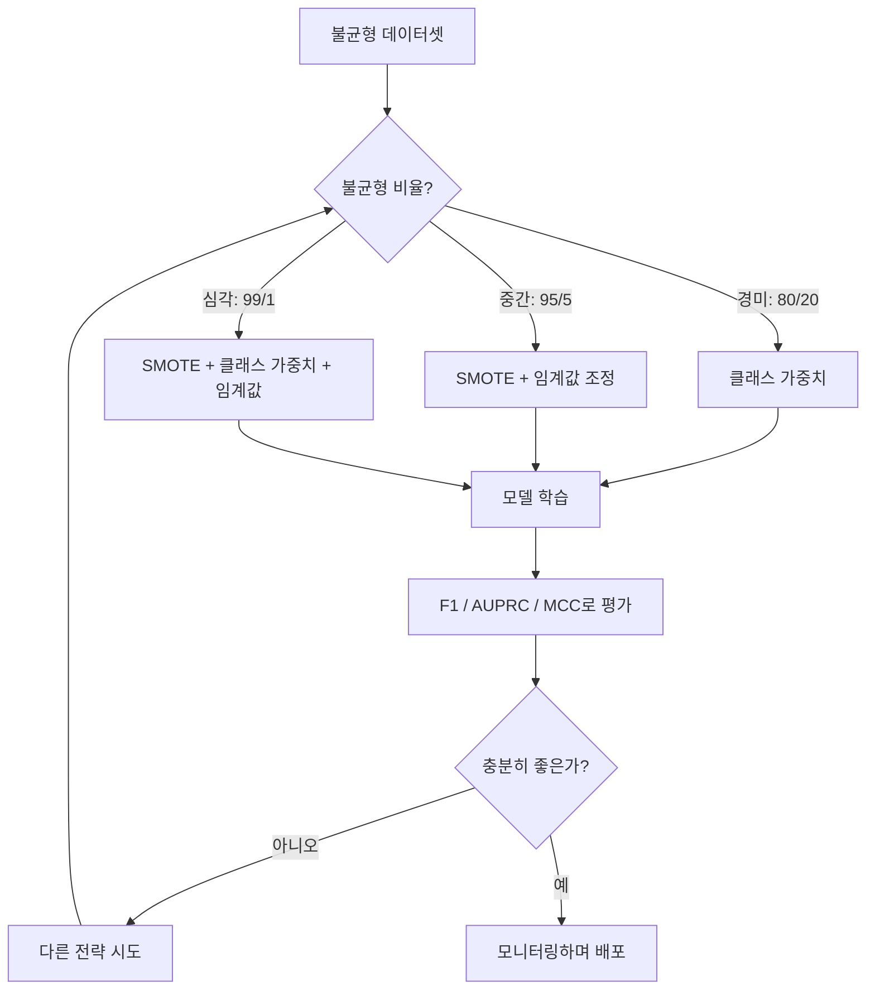
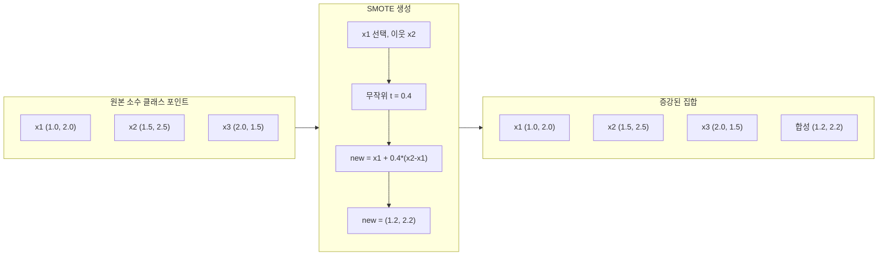
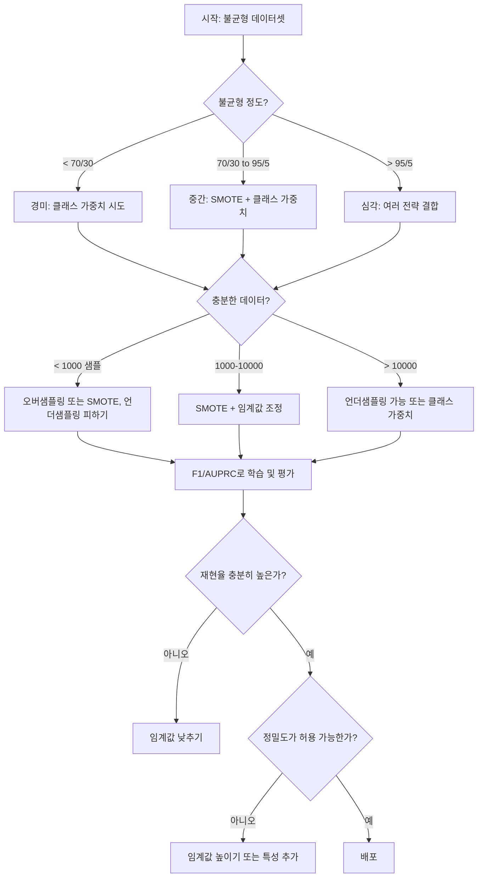
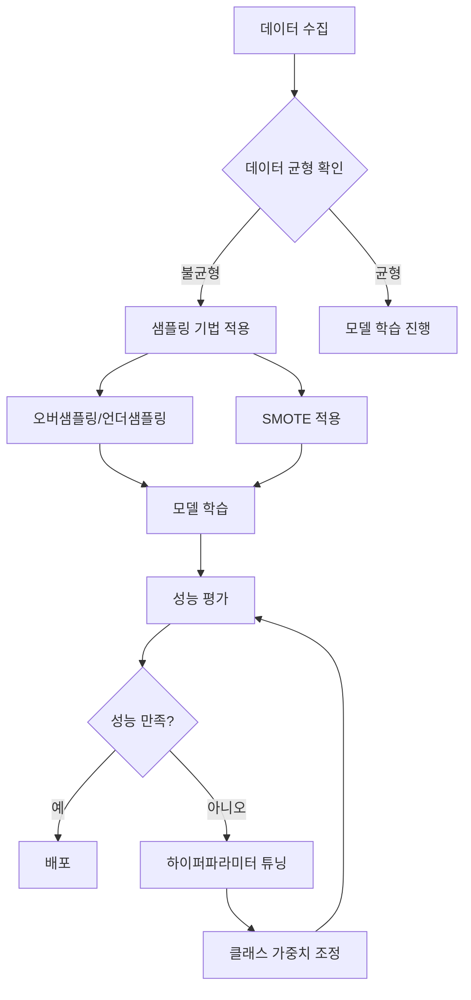

# 불균형 데이터 처리

> 데이터의 99%가 "정상"일 때, 정확도는 거짓입니다.

**유형:** 구축
**언어:** Python
**사전 요구 사항:** 2단계, 레슨 01-09 (특히 평가 지표)
**소요 시간:** ~90분

## 학습 목표

- SMOTE를 직접 구현하고, 합성 오버샘플링이 무작위 복제와 어떻게 다른지 설명
- 정확도 대신 F1, AUPRC, Matthews 상관 계수를 사용하여 불균형 분류기 평가
- 클래스 가중치, 임계값 조정, 리샘플링 전략 비교 및 주어진 불균형 비율에 적합한 접근법 선택
- SMOTE, 클래스 가중치, 임계값 최적화를 결합한 완전한 불균형 데이터 파이프라인 구축

> **전문 용어 설명**  
> - **SMOTE(Synthetic Minority Over-sampling Technique)**: 소수 클래스 합성 오버샘플링 기법  
> - **AUPRC(Area Under Precision-Recall Curve)**: 정밀도-재현율 곡선 아래 면적  
> - **Matthews 상관 계수(MCC)**: 불균형 데이터에 강건한 분류 평가 지표 (0.26~0.45: 약함, 0.45~0.65: 보통, 0.65~0.85: 강함, 0.85~1: 거의 완벽)  
> - **임계값 조정(Threshold Tuning)**: 분류기의 결정 임계값을 최적화하여 불균형 문제 완화

## 문제

사기 탐지 모델을 구축합니다. 99.9% 정확도를 달성합니다. 기뻐합니다. 그런데 모든 거래에 대해 "사기 아님"으로 예측한다는 사실을 깨닫습니다.

이것은 버그가 아닙니다. 단 0.1%의 거래만 사기인 상황에서 가장 합리적인 행동입니다. 모델은 항상 다수 클래스를 예측하면 전체 오류가 최소화됨을 학습합니다. 기술적으로는 정확하지만 전혀 유용하지 않습니다.

이 문제는 실제 분류가 중요한 모든 곳에서 발생합니다. 질병 진단: 1% 양성률. 네트워크 침입: 0.01% 공격. 제조 결함: 0.5% 불량품. 스팸 필터링: 20% 스팸. 이탈 예측: 5% 이탈자. 소수 클래스가 더 중요할수록 더 드물게 나타나는 경향이 있습니다.

정확도는 모든 올바른 예측을 동등하게 취급하기 때문에 실패합니다. 정상 거래를 올바르게 분류하고 사기를 올바르게 탐지하는 것 모두 정확도 1점으로 계산됩니다. 하지만 사기 탐지는 모델이 존재하는 유일한 이유입니다. 희귀하지만 중요한 클래스에 주의를 기울이도록 강제하는 평가 지표, 기법, 훈련 전략이 필요합니다.

## 개념

### 정확도가 실패하는 이유

990개의 음성 샘플과 10개의 양성 샘플로 구성된 1000개 샘플의 데이터셋이 있다고 가정합니다. 항상 음성으로 예측하는 모델:

|  | 예측 양성 | 예측 음성 |
|--|---|---|
| 실제 양성 | 0 (TP) | 10 (FN) |
| 실제 음성 | 0 (FP) | 990 (TN) |

정확도 = (0 + 990) / 1000 = 99.0%

이 모델은 사기, 질병, 결함을 전혀 탐지하지 못합니다. 하지만 정확도는 99%라고 나타냅니다. 이것이 불균형 문제에서 정확도가 위험한 이유입니다.

### 더 나은 평가 지표

**정밀도(Precision)** = TP / (TP + FP). 양성으로 예측된 것 중 실제 양성은 얼마나 되는가? 높은 정밀도는 거짓 경보가 적음을 의미합니다.

**재현율(Recall)** = TP / (TP + FN). 실제 양성 중 얼마나 탐지했는가? 높은 재현율은 놓친 양성이 적음을 의미합니다.

**F1 점수(F1 Score)** = 2 * 정밀도 * 재현율 / (정밀도 + 재현율). 조화 평균입니다. 산술 평균보다 정밀도와 재현율의 극단적인 불균형을 더 강하게 패널티합니다.

**F-베타 점수(F-beta Score)** = (1 + beta^2) * 정밀도 * 재현율 / (beta^2 * 정밀도 + 재현율). 베타 > 1이면 재현율이 더 중요합니다. 베타 < 1이면 정밀도가 더 중요합니다. F2는 사기 탐지에서 흔히 사용됩니다(거짓 경보보다 사기를 놓치는 것이 더 나쁨).

**AUPRC**(정밀도-재현율 곡선 아래 면적). AUC-ROC와 유사하지만 불균형 데이터에 더 많은 정보를 제공합니다. 무작위 분류기의 AUPRC는 양성 클래스 비율과 같습니다(ROC처럼 0.5가 아님). 따라서 개선 사항을 더 쉽게 확인할 수 있습니다.

**매튜스 상관 계수(Matthews Correlation Coefficient)** = (TP * TN - FP * FN) / sqrt((TP+FP)(TP+FN)(TN+FP)(TN+FN)). 범위는 -1에서 +1입니다. 모델이 두 클래스 모두에서 잘 수행할 때만 높은 점수를 줍니다. 클래스 크기가 매우 다를 때도 균형을 유지합니다.

위의 "항상 음성 예측" 모델의 경우: 정밀도 = 0/0(정의되지 않음, 일반적으로 0으로 설정), 재현율 = 0/10 = 0, F1 = 0, MCC = 0. 이러한 지표들은 모델이 쓸모없음을 올바르게 식별합니다.

### 불균형 데이터 파이프라인



### SMOTE: 합성 소수 클래스 오버샘플링 기법

무작위 오버샘플링은 기존 소수 클래스 샘플을 복제합니다. 이는 작동하지만 모델이 동일한 점을 반복적으로 보기 때문에 과적합 위험이 있습니다.

SMOTE는 복사가 아닌 그럴듯한 새로운 합성 소수 클래스 샘플을 생성합니다. 알고리즘:

1. 각 소수 클래스 샘플 x에 대해 다른 소수 클래스 샘플 중 k-최근접 이웃을 찾습니다.
2. 무작위로 하나의 이웃을 선택합니다.
3. x와 그 이웃 사이의 선분 상에 새로운 샘플을 생성합니다.

공식: `new_sample = x + random(0, 1) * (neighbor - x)`

이는 실제 소수 클래스 포인트 사이를 보간하여 기존 데이터를 복사하지 않고 동일한 특성 공간 영역에 샘플을 생성합니다.



### 샘플링 전략 비교

**무작위 오버샘플링**: 다수 클래스 수와 일치하도록 소수 클래스 샘플을 복제합니다.
- 장점: 간단하고 정보 손실이 없음
- 단점: 정확한 복제로 인한 과적합, 학습 시간 증가

**무작위 언더샘플링**: 소수 클래스 수와 일치하도록 다수 클래스 샘플을 제거합니다.
- 장점: 빠른 학습, 간단함
- 단점: 잠재적으로 유용한 다수 클래스 데이터 손실, 높은 분산

**SMOTE**: 보간을 통해 합성 소수 클래스 샘플을 생성합니다.
- 장점: 새로운 데이터 포인트 생성, 무작위 오버샘플링 대비 과적합 감소
- 단점: 결정 경계 근처에 노이즈 샘플 생성 가능, 다수 클래스 분포 고려 안 함

| 전략 | 데이터 변경 | 위험 | 사용 시기 |
|----------|-------------|------|-------------|
| 오버샘플링 | 소수 클래스 복제 | 과적합 | 소규모 데이터셋, 중간 정도의 불균형 |
| 언더샘플링 | 다수 클래스 제거 | 정보 손실 | 대규모 데이터셋, 빠른 학습 원할 때 |
| SMOTE | 합성 소수 클래스 추가 | 경계 노이즈 | 중간 정도의 불균형, k-NN을 위한 충분한 소수 클래스 샘플 |

### 클래스 가중치

데이터를 변경하는 대신 모델이 오류를 처리하는 방식을 변경합니다. 소수 클래스를 잘못 분류하는 데 더 높은 가중치를 할당합니다.

950개의 음성 샘플과 50개의 양성 샘플이 있는 이진 문제의 경우:
- 음성 클래스 가중치 = n_samples / (2 * n_negative) = 1000 / (2 * 950) = 0.526
- 양성 클래스 가중치 = n_samples / (2 * n_positive) = 1000 / (2 * 50) = 10.0

양성 클래스는 19배 더 높은 가중치를 받습니다. 양성 샘플 하나를 잘못 분류하면 음성 샘플 19개를 잘못 분류하는 것과 같은 비용이 듭니다. 모델은 소수 클래스에 주의를 기울여야 합니다.

로지스틱 회귀에서 이는 손실 함수를 수정합니다:

```
weighted_loss = -sum(w_i * [y_i * log(p_i) + (1-y_i) * log(1-p_i)])
```

여기서 w_i는 샘플 i의 클래스에 따라 달라집니다.

클래스 가중치는 기대값에서 오버샘플링과 수학적으로 동일하지만 새로운 데이터 포인트를 생성하지 않습니다. 따라서 더 빠르고 복제된 샘플의 과적합 위험을 피할 수 있습니다.

### 임계값 조정

대부분의 분류기는 확률을 출력합니다. 기본 임계값은 0.5입니다: P(양성) >= 0.5이면 양성으로 예측합니다. 하지만 0.5는 임의적입니다. 클래스가 불균형할 때 최적의 임계값은 보통 훨씬 낮습니다.

과정:
1. 모델 학습
2. 검증 세트에서 예측 확률 얻기
3. 0.0에서 1.0까지 임계값 스윕
4. 각 임계값에서 F1(또는 선택한 지표) 계산
5. 지표를 최대화하는 임계값 선택


모델이 사기 거래에 대해 P(사기) = 0.15를 출력할 수 있습니다. 임계값 0.5에서는 사기로 분류되지 않지만, 임계값 0.10에서는 올바르게 탐지됩니다. 확률 보정보다 순위가 더 중요합니다. 사기가 비사기보다 높은 확률을 갖는다면 이를 분리할 임계값이 존재합니다.

### 비용 민감 학습

클래스 가중치의 일반화입니다. 균일한 비용 대신 특정 오분류 비용을 할당합니다:

| | 양성 예측 | 음성 예측 |
|--|---|---|
| 실제 양성 | 0 (정확) | C_FN = 100 |
| 실제 음성 | C_FP = 1 | 0 (정확) |

사기 거래를 놓치는 것(FN)은 거짓 경보(FP)보다 100배 더 큰 비용이 듭니다. 모델은 총 오류 수가 아닌 총 비용을 최적화합니다.

실제 비용을 추정할 수 있을 때 가장 원칙적인 접근법입니다. 놓친 암 진단은 거짓 경보로 인한 추가 생검과 매우 다른 비용을 가집니다. 이러한 비용을 명시적으로 만들면 올바른 트레이드오프가 강제됩니다.

### 결정 흐름도



## 구축 방법

### 1단계: 불균형 데이터셋 생성

```python
import numpy as np


def make_imbalanced_data(n_majority=950, n_minority=50, seed=42):
    rng = np.random.RandomState(seed)

    X_maj = rng.randn(n_majority, 2) * 1.0 + np.array([0.0, 0.0])
    X_min = rng.randn(n_minority, 2) * 0.8 + np.array([2.5, 2.5])

    X = np.vstack([X_maj, X_min])
    y = np.concatenate([np.zeros(n_majority), np.ones(n_minority)])

    shuffle_idx = rng.permutation(len(y))
    return X[shuffle_idx], y[shuffle_idx]
```

### 2단계: SMOTE 구현

```python
def euclidean_distance(a, b):
    return np.sqrt(np.sum((a - b) ** 2))


def find_k_neighbors(X, idx, k):
    distances = []
    for i in range(len(X)):
        if i == idx:
            continue
        d = euclidean_distance(X[idx], X[i])
        distances.append((i, d))
    distances.sort(key=lambda x: x[1])
    return [d[0] for d in distances[:k]]


def smote(X_minority, k=5, n_synthetic=100, seed=42):
    rng = np.random.RandomState(seed)
    n_samples = len(X_minority)
    k = min(k, n_samples - 1)
    synthetic = []

    for _ in range(n_synthetic):
        idx = rng.randint(0, n_samples)
        neighbors = find_k_neighbors(X_minority, idx, k)
        neighbor_idx = neighbors[rng.randint(0, len(neighbors))]
        t = rng.random()
        new_point = X_minority[idx] + t * (X_minority[neighbor_idx] - X_minority[idx])
        synthetic.append(new_point)

    return np.array(synthetic)
```

### 3단계: 랜덤 오버샘플링 및 언더샘플링

```python
def random_oversample(X, y, seed=42):
    rng = np.random.RandomState(seed)
    classes, counts = np.unique(y, return_counts=True)
    max_count = counts.max()

    X_resampled = list(X)
    y_resampled = list(y)

    for cls, count in zip(classes, counts):
        if count < max_count:
            cls_indices = np.where(y == cls)[0]
            n_needed = max_count - count
            chosen = rng.choice(cls_indices, size=n_needed, replace=True)
            X_resampled.extend(X[chosen])
            y_resampled.extend(y[chosen])

    X_out = np.array(X_resampled)
    y_out = np.array(y_resampled)
    shuffle = rng.permutation(len(y_out))
    return X_out[shuffle], y_out[shuffle]


def random_undersample(X, y, seed=42):
    rng = np.random.RandomState(seed)
    classes, counts = np.unique(y, return_counts=True)
    min_count = counts.min()

    X_resampled = []
    y_resampled = []

    for cls in classes:
        cls_indices = np.where(y == cls)[0]
        chosen = rng.choice(cls_indices, size=min_count, replace=False)
        X_resampled.extend(X[chosen])
        y_resampled.extend(y[chosen])

    X_out = np.array(X_resampled)
    y_out = np.array(y_resampled)
    shuffle = rng.permutation(len(y_out))
    return X_out[shuffle], y_out[shuffle]
```

### 4단계: 클래스 가중치 적용 로지스틱 회귀

```python
def sigmoid(z):
    return 1.0 / (1.0 + np.exp(-np.clip(z, -500, 500)))


def logistic_regression_weighted(X, y, weights, lr=0.01, epochs=200):
    n_samples, n_features = X.shape
    w = np.zeros(n_features)
    b = 0.0

    for _ in range(epochs):
        z = X @ w + b
        pred = sigmoid(z)
        error = pred - y
        weighted_error = error * weights

        gradient_w = (X.T @ weighted_error) / n_samples
        gradient_b = np.mean(weighted_error)

        w -= lr * gradient_w
        b -= lr * gradient_b

    return w, b


def compute_class_weights(y):
    classes, counts = np.unique(y, return_counts=True)
    n_samples = len(y)
    n_classes = len(classes)
    weight_map = {}
    for cls, count in zip(classes, counts):
        weight_map[cls] = n_samples / (n_classes * count)
    return np.array([weight_map[yi] for yi in y])
```

### 5단계: 임계값 조정

```python
def find_optimal_threshold(y_true, y_probs, metric="f1"):
    best_threshold = 0.5
    best_score = -1.0

    for threshold in np.arange(0.05, 0.96, 0.01):
        y_pred = (y_probs >= threshold).astype(int)
        tp = np.sum((y_pred == 1) & (y_true == 1))
        fp = np.sum((y_pred == 1) & (y_true == 0))
        fn = np.sum((y_pred == 0) & (y_true == 1))

        if metric == "f1":
            precision = tp / (tp + fp) if (tp + fp) > 0 else 0.0
            recall = tp / (tp + fn) if (tp + fn) > 0 else 0.0
            score = 2 * precision * recall / (precision + recall) if (precision + recall) > 0 else 0.0
        elif metric == "recall":
            score = tp / (tp + fn) if (tp + fn) > 0 else 0.0
        elif metric == "precision":
            score = tp / (tp + fp) if (tp + fp) > 0 else 0.0

        if score > best_score:
            best_score = score
            best_threshold = threshold

    return best_threshold, best_score
```

### 6단계: 평가 함수

```python
def confusion_matrix_values(y_true, y_pred):
    tp = np.sum((y_pred == 1) & (y_true == 1))
    tn = np.sum((y_pred == 0) & (y_true == 0))
    fp = np.sum((y_pred == 1) & (y_true == 0))
    fn = np.sum((y_pred == 0) & (y_true == 1))
    return tp, tn, fp, fn


def compute_metrics(y_true, y_pred):
    tp, tn, fp, fn = confusion_matrix_values(y_true, y_pred)
    accuracy = (tp + tn) / (tp + tn + fp + fn)
    precision = tp / (tp + fp) if (tp + fp) > 0 else 0.0
    recall = tp / (tp + fn) if (tp + fn) > 0 else 0.0
    f1 = 2 * precision * recall / (precision + recall) if (precision + recall) > 0 else 0.0

    denom = np.sqrt(float((tp + fp) * (tp + fn) * (tn + fp) * (tn + fn)))
    mcc = (tp * tn - fp * fn) / denom if denom > 0 else 0.0

    return {
        "정확도": accuracy,
        "정밀도": precision,
        "재현율": recall,
        "F1 점수": f1,
        "MCC": mcc,
    }
```

### 7단계: 모든 접근법 비교

```python
X, y = make_imbalanced_data(950, 50, seed=42)
split = int(0.8 * len(y))
X_train, X_test = X[:split], X[split:]
y_train, y_test = y[:split], y[split:]

# 베이스라인: 처리 없음
w_base, b_base = logistic_regression_weighted(
    X_train, y_train, np.ones(len(y_train)), lr=0.1, epochs=300
)
probs_base = sigmoid(X_test @ w_base + b_base)
preds_base = (probs_base >= 0.5).astype(int)

# 오버샘플링
X_over, y_over = random_oversample(X_train, y_train)
w_over, b_over = logistic_regression_weighted(
    X_over, y_over, np.ones(len(y_over)), lr=0.1, epochs=300
)
preds_over = (sigmoid(X_test @ w_over + b_over) >= 0.5).astype(int)

# SMOTE
minority_mask = y_train == 1
X_minority = X_train[minority_mask]
synthetic = smote(X_minority, k=5, n_synthetic=len(y_train) - 2 * int(minority_mask.sum()))
X_smote = np.vstack([X_train, synthetic])
y_smote = np.concatenate([y_train, np.ones(len(synthetic))])
w_sm, b_sm = logistic_regression_weighted(
    X_smote, y_smote, np.ones(len(y_smote)), lr=0.1, epochs=300
)
preds_smote = (sigmoid(X_test @ w_sm + b_sm) >= 0.5).astype(int)

# 클래스 가중치
sample_weights = compute_class_weights(y_train)
w_cw, b_cw = logistic_regression_weighted(
    X_train, y_train, sample_weights, lr=0.1, epochs=300
)
probs_cw = sigmoid(X_test @ w_cw + b_cw)
preds_cw = (probs_cw >= 0.5).astype(int)

# 임계값 조정 (테스트 세트가 아닌 검증 세트에서 조정)
probs_val = sigmoid(X_val @ w_cw + b_cw)
best_thresh, best_f1 = find_optimal_threshold(y_val, probs_val, metric="f1")
preds_thresh = (probs_cw >= best_thresh).astype(int)
```

코드 파일은 이 모든 내용을 단일 스크립트에서 실행하고 결과를 출력합니다.

## 사용 방법

scikit-learn과 imbalanced-learn을 사용하면 이러한 기법들은 한 줄로 구현할 수 있습니다:

```python
from sklearn.linear_model import LogisticRegression
from sklearn.metrics import classification_report, f1_score
from sklearn.model_selection import train_test_split
from imblearn.over_sampling import SMOTE
from imblearn.under_sampling import RandomUnderSampler
from imblearn.pipeline import Pipeline

X_train, X_test, y_train, y_test = train_test_split(X, y, stratify=y)

model_weighted = LogisticRegression(class_weight="balanced")
model_weighted.fit(X_train, y_train)
print(classification_report(y_test, model_weighted.predict(X_test)))

smote = SMOTE(random_state=42)
X_resampled, y_resampled = smote.fit_resample(X_train, y_train)
model_smote = LogisticRegression()
model_smote.fit(X_resampled, y_resampled)
print(classification_report(y_test, model_smote.predict(X_test)))

pipeline = Pipeline([
    ("smote", SMOTE()),
    ("model", LogisticRegression(class_weight="balanced")),
])
pipeline.fit(X_train, y_train)
print(classification_report(y_test, pipeline.predict(X_test)))
```

처음부터 구현하는 방법들은 각 기법이 정확히 무엇을 하는지 보여줍니다. SMOTE는 소수 클래스에 대한 k-최근접 이웃(k-NN) 보간법일 뿐입니다. 클래스 가중치는 손실 함수에 곱해집니다. 임계값 조정은 컷오프 값을 순회하는 for-루프입니다. 마법은 없습니다.

## Ship It

이 레슨은 다음을 생성합니다:
- `outputs/skill-imbalanced-data.md` -- 불균형 분류 문제 처리 결정 체크리스트



## 연습 문제

1. **경계선-SMOTE**: SMOTE 구현을 수정하여 결정 경계 근처에 있는 소수 클래스 포인트(가장 가까운 k개 이웃에 다수 클래스 샘플이 포함된 경우)에 대해서만 합성 샘플을 생성하도록 합니다. 클래스가 겹치는 데이터셋에서 표준 SMOTE와 결과를 비교합니다.

2. **비용 행렬 최적화**: 비용 행렬을 매개변수로 하는 비용 민감 학습을 구현합니다. 비용 행렬을 입력받아 기대 비용을 최소화하는 최적의 예측을 반환하는 함수를 만듭니다. 다양한 비용 비율(1:10, 1:100, 1:1000)로 테스트하고 정밀도-재현율 트레이드오프가 어떻게 변화하는지 그래프로 나타냅니다.

3. **임계값 보정**: Platt 스케일링(모델의 원시 출력에 로지스틱 회귀를 적합하여 보정된 확률을 생성)을 구현합니다. 보정 전후의 정밀도-재현율 곡선을 비교합니다. 보정이 순위(AUC는 동일하게 유지)는 변경하지 않으면서 확률을 더 의미 있게 만든다는 것을 보여줍니다.

4. **균형 배깅 앙상블**: 여러 모델을 훈련시키며, 각 모델은 균형 잡힌 부트스트랩 샘플(모든 소수 클래스 + 다수 클래스의 무작위 부분 집합)로 학습합니다. 예측값을 평균화합니다. 이 접근법을 SMOTE를 사용한 단일 모델과 비교합니다. 성능과 실행 간 분산을 모두 측정합니다.

5. **불균형 비율 실험**: 균형 잡힌 데이터셋을 가져와 점진적으로 불균형 비율을 증가시킵니다(50/50, 70/30, 90/10, 95/5, 99/1). 각 비율에 대해 SMOTE 사용 여부와 함께 모델을 훈련시킵니다. 두 접근법에 대해 F1 점수 대 불균형 비율 그래프를 그립니다. 어떤 비율에서 SMOTE가 의미 있는 차이를 만들기 시작하는지 확인합니다.

## 주요 용어

| 용어 | 사람들이 말하는 것 | 실제 의미 |
|------|----------------|----------------------|
| 클래스 불균형 | "한 클래스에 샘플이 훨씬 많다" | 데이터셋의 클래스 분포가 크게 편향되어 모델이 다수 클래스를 선호하게 됨 |
| SMOTE | "합성 오버샘플링" | 기존 소수 클래스 샘플과 그 k-최근접 소수 클래스 이웃 사이에서 보간하여 새로운 소수 클래스 샘플 생성 |
| 클래스 가중치 | "드문 클래스에 대한 오류를 더 비싸게 만든다" | 손실 함수(loss function)에 클래스별 가중치를 곱하여 모델이 소수 클래스 오분류를 더 강하게 패널티 부여 |
| 임계값 조정 | "결정 경계 이동" | 기본값 0.5에서 원하는 메트릭을 최적화하는 값으로 분류 확률 기준값 변경 |
| 정밀도-재현율 트레이드오프 | "둘 다 가질 수 없다" | 임계값을 낮추면 더 많은 양성 샘플 포착(높은 재현율)이 되지만 더 많은 거짓 양성 발생(낮은 정밀도), 그 반대도 성립 |
| AUPRC | "PR 곡선 아래 면적" | 정밀도-재현율 곡선을 단일 숫자로 요약; 클래스가 심하게 불균형할 때 AUC-ROC보다 더 많은 정보 제공 |
| 매튜스 상관 계수 | "균형 잡힌 메트릭" | 예측 라벨과 실제 라벨 간의 상관관계로, 모델이 두 클래스 모두에서 잘 수행할 때만 높은 점수 생성 |
| 비용 민감 학습 | "다른 실수는 다른 비용이 든다" | 실제 오분류 비용을 훈련 목표에 통합하여 모델이 오류 수가 아닌 총 비용을 최적화하도록 함 |
| 랜덤 오버샘플링 | "소수 클래스 복제" | 클래스 수를 균형 있게 만들기 위해 소수 클래스 샘플 반복; 간단하지만 복제된 포인트에 과적합(overfitting) 위험 있음

## 추가 자료

- [SMOTE: Synthetic Minority Over-sampling Technique (Chawla et al., 2002)](https://arxiv.org/abs/1106.1813) -- 불균형 학습 분야에서 가장 많이 인용되는 원본 SMOTE 논문
- [Learning from Imbalanced Data (He & Garcia, 2009)](https://ieeexplore.ieee.org/document/5128907) -- 샘플링, 비용 민감, 알고리즘 접근법을 포괄하는 종합 조사 논문
- [imbalanced-learn 문서](https://imbalanced-learn.org/stable/) -- SMOTE 변형, 언더샘플링 전략, 파이프라인 통합 기능을 제공하는 Python 라이브러리
- [The Precision-Recall Plot Is More Informative than the ROC Plot (Saito & Rehmsmeier, 2015)](https://journals.plos.org/plosone/article?id=10.1371/journal.pone.0118432) -- 불균형 문제에서 ROC 곡선 대신 PR 곡선을 선호해야 하는 경우와 이유 설명