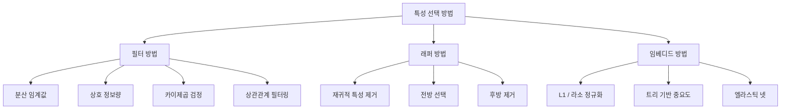
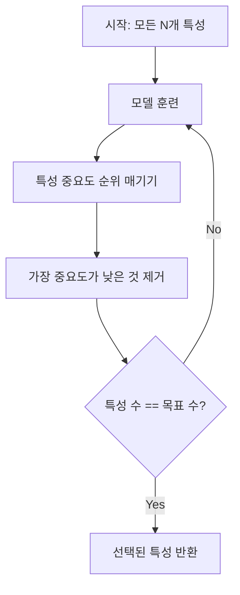
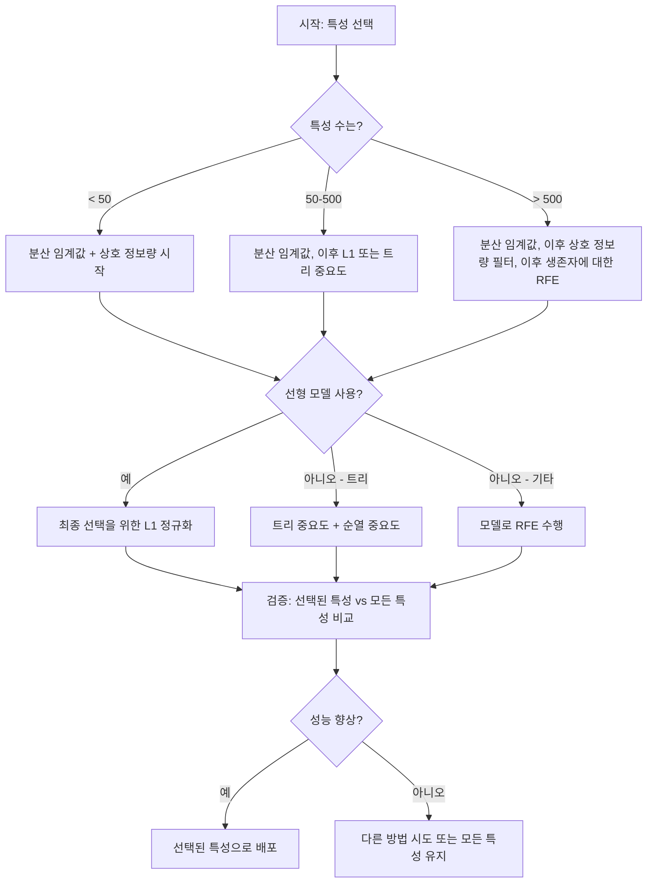

# 특징 선택(Feature Selection)

> 더 많은 특징이 더 좋은 것은 아니다. 올바른 특징이 더 좋다.

**유형:** 구축(Build)
**언어:** Python
**선수 지식:** 2단계, 레슨 01-09, 08 (특징 공학)
**소요 시간:** ~75분

## 학습 목표

- 필터 방법(분산 임계값, 상호 정보, 카이제곱)과 래퍼 방법(RFE, 전진 선택)을 처음부터 구현
- 상호 정보가 상관관계에서 놓치는 비선형 특성-타겟 관계를 포착하는 이유 설명
- L1 정규화(임베디드 선택)와 RFE(래퍼 선택) 비교 및 계산적 트레이드오프 평가
- 여러 방법을 결합한 특성 선택 파이프라인 구축 및 홀드아웃 데이터에서 향상된 일반화 성능 입증

> **전문 용어 설명**  
> - 분산 임계값(variance threshold): 분산이 특정 값 미만인 특성 제거  
> - 상호 정보(mutual information): 변수 간 정보 공유량 측정  
> - 카이제곱(chi-squared): 범주형 특성-타겟 간 독립성 검정  
> - RFE(Recursive Feature Elimination): 재귀적 특성 제거  
> - 전진 선택(forward selection): 최적 특성 부분집합 탐색  
> - L1 정규화(L1 regularization): 가중치 절댓값 패널티 적용  
> - 임베디드 선택(embedded selection): 모델 학습 과정에서 특성 선택  
> - 일반화(generalization): 미확인 데이터에 대한 모델 성능

## 문제

500개의 피처(feature)가 있습니다. 모델은 느리게 훈련되고, 지속적으로 과적합(overfitting)되며, 아무도 모델이 무엇을 학습했는지 설명할 수 없습니다. 성능을 개선하기를 바라며 더 많은 피처를 추가합니다. 상황은 더 악화됩니다.

이것은 차원의 저주(curse of dimensionality)가 작용하는 사례입니다. 피처 수가 증가함에 따라 피처 공간의 부피가 폭발적으로 증가합니다. 데이터 포인트는 희소해지고, 포인트 간 거리는 수렴합니다. 모델은 실제 패턴을 찾기 위해 기하급수적으로 더 많은 데이터를 필요로 합니다. 노이즈 피처(noise feature)가 신호 피처(signal feature)를 압도합니다. 과적합이 기본 상태가 됩니다.

피처 선택(feature selection)은 해결책입니다. 노이즈를 제거하세요. 중복성을 제거하세요. 타겟(target)에 대한 실제 정보를 담고 있는 피처만 유지하세요. 결과적으로 훈련 속도가 빨라지고, 일반화 성능이 향상되며, 실제로 설명 가능한 모델을 얻을 수 있습니다.

목표는 모든 가능한 정보를 사용하는 것이 아닙니다. 올바른 정보를 사용하는 것입니다.

## 개념

### 특성 선택 방법의 세 가지 범주

모든 특성 선택 방법은 다음 세 가지 범주 중 하나에 속합니다:



**필터 방법**은 통계적 측정값을 사용하여 각 특성을 독립적으로 점수화합니다. 모델을 사용하지 않습니다. 빠르지만 특성 간 상호작용을 놓칩니다.

**래퍼 방법**은 특성 부분집합을 평가하기 위해 모델을 훈련시킵니다. 모델 성능을 점수로 사용합니다. 더 나은 결과를 제공하지만 모델을 여러 번 재훈련해야 하므로 비용이 많이 듭니다.

**임베디드 방법**은 모델 훈련의 일부로 특성을 선택합니다. L1 정규화는 가중치를 0으로 만듭니다. 결정 트리는 가장 유용한 특성에서 분할합니다. 선택은 별도의 단계가 아닌 적합 과정에서 발생합니다.

### 분산 임계값

가장 간단한 필터입니다. 특성이 샘플 간에 거의 변하지 않으면 거의 정보를 제공하지 않습니다.

1000개 샘플 중 999개에서 0.0인 특성을 생각해 보세요. 분산은 0에 가깝습니다. 어떤 모델도 이를 사용하여 클래스를 구분할 수 없습니다. 제거하세요.

```
variance(x) = mean((x - mean(x))^2)
```

임계값(예: 0.01)을 설정합니다. 분산이 임계값 미만인 모든 특성을 제거합니다. 이는 목표 변수를 전혀 보지 않고 상수 또는 거의 상수인 특성을 제거합니다.

사용 시기: 다른 방법 이전의 전처리 단계로. 거의 비용이 들지 않으면서 명백히 쓸모없는 특성을 잡아냅니다.

제한 사항: 분산이 높아도 순수한 노이즈일 수 있습니다. 분산 임계값은 필요하지만 충분하지는 않습니다.

### 상호 정보량

상호 정보량은 특성 X의 값을 아는 것이 목표 Y에 대한 불확실성을 얼마나 줄이는지 측정합니다.

```
I(X; Y) = sum_x sum_y p(x, y) * log(p(x, y) / (p(x) * p(y)))
```

X와 Y가 독립적이면 p(x, y) = p(x) * p(y)이므로 로그 항은 0이고 I(X; Y) = 0입니다. X가 Y에 대해 더 많은 정보를 제공할수록 상호 정보량은 높아집니다.

상관관계 대비 주요 장점: 상호 정보량은 비선형 관계를 포착합니다. 특성이 목표와 상관관계는 0이지만 관계가 2차 또는 주기적일 경우 상호 정보량이 높을 수 있습니다.

연속 특성의 경우 먼저 빈(bin)으로 이산화합니다(히스토그램 기반 추정). 빈의 수는 추정에 영향을 줍니다. 너무 적으면 정보를 잃고, 너무 많으면 노이즈가 추가됩니다. 일반적인 선택: sqrt(n) 빈 또는 스터지스 규칙(1 + log2(n)).


### 재귀적 특성 제거(RFE)

RFE는 래퍼 방법입니다. 모델의 자체 특성 중요도를 사용하여 반복적으로 특성을 제거합니다:

1. 모든 특성으로 모델 훈련
2. 중요도(선형 모델의 계수, 트리의 불순도 감소)로 특성 순위 매기기
3. 가장 중요도가 낮은 특성 제거
4. 원하는 특성 수가 남을 때까지 반복



RFE는 모델이 남아 있는 모든 특성을 함께 보기 때문에 특성 간 상호작용을 고려합니다. 하나의 특성을 제거하면 다른 특성의 중요도가 바뀝니다. 이는 필터 방법보다 더 철저합니다.

비용: 모델을 N - 목표 횟수만큼 훈련합니다. 500개 특성과 목표 10개라면 490번 훈련합니다. 비용이 많이 드는 모델의 경우 느립니다. 한 번에 여러 특성을 제거하여 속도를 높일 수 있습니다(예: 매 라운드 하위 10% 제거).

### L1(라소) 정규화

L1 정규화는 손실 함수에 가중치의 절댓값을 추가합니다:

```
loss = 예측 오차 + alpha * sum(|w_i|)
```

alpha 매개변수는 특성을 얼마나 공격적으로 제거할지 제어합니다. alpha가 높을수록 더 많은 가중치가 정확히 0이 됩니다.

왜 정확히 0인가? L1 페널티는 가중치 공간에서 다이아몬드 모양의 제약 영역을 만듭니다. 최적해는 이 다이아몬드의 모서리에 위치하는 경향이 있어 하나 이상의 가중치가 0이 됩니다. L2 정규화(릿지)는 원형 제약을 만들어 가중치가 줄어들지만 0에 거의 도달하지 않습니다.

이것은 임베디드 특성 선택입니다: 모델은 훈련 중에 어떤 특성을 무시할지 학습합니다. 가중치가 0인 특성은 효과적으로 제거됩니다.

장점: 단일 훈련 실행, 상관된 특성 처리(하나를 선택하고 나머지는 0으로 만듦), 대부분의 선형 모델 구현에 내장됨.

제한 사항: 선형 모델에만 적용 가능. 비선형 특성 중요도를 포착할 수 없습니다.

### 트리 기반 특성 중요도

결정 트리와 그 앙상블(랜덤 포레스트, 그래디언트 부스팅)은 자연스럽게 특성을 순위 매깁니다. 모든 분할은 불순도(분류 시 지니 또는 엔트로피, 회귀 시 분산)를 줄입니다. 더 큰 불순도 감소를 생성하는 특성이 더 중요합니다.

T개의 트리를 가진 랜덤 포레스트의 경우:

```
importance(feature_j) = (1/T) * sum over all trees of
    sum over all nodes splitting on feature_j of
        (샘플 수 * 불순도 감소량)
```

이는 각 특성에 대한 정규화된 중요도 점수를 제공합니다. 비선형 관계와 특성 간 상호작용을 자동으로 처리합니다.

주의: 트리 기반 중요도는 고유 값이 많은 특성(높은 카디널리티)에 편향됩니다. 무작위 ID 열은 모든 샘플을 완벽하게 분할하므로 중요하게 나타납니다. 순열 중요도를 사용하여 검증하세요.

### 순열 중요도

모델에 구애받지 않는 방법:

1. 모델을 훈련하고 검증 데이터에서 기준 성능 기록
2. 각 특성에 대해: 값을 무작위로 섞고 성능 하락 측정
3. 성능 하락이 클수록 특성이 더 중요

특성을 섞어도 성능에 영향이 없으면 모델은 해당 특성에 의존하지 않습니다. 성능이 크게 떨어지면 그 특성이 중요합니다.

순열 중요도는 트리 기반 중요도의 카디널리티 편향을 피합니다. 하지만 느립니다: 안정성을 위해 여러 번 반복되는 특성당 전체 평가가 필요합니다.

### 비교 표

| 방법 | 유형 | 속도 | 비선형 | 특성 간 상호작용 |
|--------|------|-------|-----------|---------------------|
| 분산 임계값 | 필터 | 매우 빠름 | 아니오 | 아니오 |
| 상호 정보량 | 필터 | 빠름 | 예 | 아니오 |
| 상관관계 필터링 | 필터 | 빠름 | 아니오 | 아니오 |
| RFE | 래퍼 | 느림 | 모델에 따라 다름 | 예 |
| L1 / 라소 | 임베디드 | 빠름 | 아니오(선형) | 아니오 |
| 트리 중요도 | 임베디드 | 중간 | 예 | 예 |
| 순열 중요도 | 모델-불가지론적 | 느림 | 예 | 예 |

### 결정 흐름도



## 구축 방법

### 1단계: 알려진 특성 구조를 가진 합성 데이터 생성

```python
import numpy as np


def make_feature_selection_data(n_samples=500, seed=42):
    rng = np.random.RandomState(seed)

    x1 = rng.randn(n_samples)
    x2 = rng.randn(n_samples)
    x3 = rng.randn(n_samples)
    x4 = x1 + 0.1 * rng.randn(n_samples)
    x5 = x2 + 0.1 * rng.randn(n_samples)

    informative = np.column_stack([x1, x2, x3, x4, x5])

    correlated = np.column_stack([
        x1 * 0.9 + 0.1 * rng.randn(n_samples),
        x2 * 0.8 + 0.2 * rng.randn(n_samples),
        x3 * 0.7 + 0.3 * rng.randn(n_samples),
        x1 * 0.5 + x2 * 0.5 + 0.1 * rng.randn(n_samples),
        x2 * 0.6 + x3 * 0.4 + 0.1 * rng.randn(n_samples),
    ])

    noise = rng.randn(n_samples, 10) * 0.5

    X = np.hstack([informative, correlated, noise])
    y = (2 * x1 - 1.5 * x2 + x3 + 0.5 * rng.randn(n_samples) > 0).astype(int)

    feature_names = (
        [f"info_{i}" for i in range(5)]
        + [f"corr_{i}" for i in range(5)]
        + [f"noise_{i}" for i in range(10)]
    )

    return X, y, feature_names
```

우리는 실제 정답을 알고 있습니다: 특성 0-4는 정보 제공 특성(3과 4는 0과 1의 상관 복사본), 특성 5-9는 정보 제공 특성과 상관 관계가 있으며, 특성 10-19는 순수 노이즈입니다. 좋은 선택 방법은 0-4를 가장 높은 순위로, 10-19를 가장 낮은 순위로 매겨야 합니다.

### 2단계: 분산 임계값

```python
def variance_threshold(X, threshold=0.01):
    variances = np.var(X, axis=0)
    mask = variances > threshold
    return mask, variances
```

### 3단계: 상호 정보량(이산형)

```python
def discretize(x, n_bins=10):
    min_val, max_val = x.min(), x.max()
    if max_val == min_val:
        return np.zeros_like(x, dtype=int)
    bin_edges = np.linspace(min_val, max_val, n_bins + 1)
    binned = np.digitize(x, bin_edges[1:-1])
    return binned


def mutual_information(X, y, n_bins=10):
    n_samples, n_features = X.shape
    mi_scores = np.zeros(n_features)

    y_vals, y_counts = np.unique(y, return_counts=True)
    p_y = y_counts / n_samples

    for f in range(n_features):
        x_binned = discretize(X[:, f], n_bins)
        x_vals, x_counts = np.unique(x_binned, return_counts=True)
        p_x = dict(zip(x_vals, x_counts / n_samples))

        mi = 0.0
        for xv in x_vals:
            for yi, yv in enumerate(y_vals):
                joint_mask = (x_binned == xv) & (y == yv)
                p_xy = np.sum(joint_mask) / n_samples
                if p_xy > 0:
                    mi += p_xy * np.log(p_xy / (p_x[xv] * p_y[yi]))
        mi_scores[f] = mi

    return mi_scores
```

### 4단계: 재귀적 특성 제거

```python
def simple_logistic_importance(X, y, lr=0.1, epochs=100):
    n_samples, n_features = X.shape
    w = np.zeros(n_features)
    b = 0.0

    for _ in range(epochs):
        z = X @ w + b
        pred = 1.0 / (1.0 + np.exp(-np.clip(z, -500, 500)))
        error = pred - y
        w -= lr * (X.T @ error) / n_samples
        b -= lr * np.mean(error)

    return w, b


def rfe(X, y, n_features_to_select=5, lr=0.1, epochs=100):
    n_total = X.shape[1]
    remaining = list(range(n_total))
    rankings = np.ones(n_total, dtype=int)
    rank = n_total

    while len(remaining) > n_features_to_select:
        X_subset = X[:, remaining]
        w, _ = simple_logistic_importance(X_subset, y, lr, epochs)
        importances = np.abs(w)

        least_idx = np.argmin(importances)
        original_idx = remaining[least_idx]
        rankings[original_idx] = rank
        rank -= 1
        remaining.pop(least_idx)

    for idx in remaining:
        rankings[idx] = 1

    selected_mask = rankings == 1
    return selected_mask, rankings
```

### 5단계: L1 특성 선택

```python
def soft_threshold(w, alpha):
    return np.sign(w) * np.maximum(np.abs(w) - alpha, 0)


def l1_feature_selection(X, y, alpha=0.1, lr=0.01, epochs=500):
    n_samples, n_features = X.shape
    w = np.zeros(n_features)
    b = 0.0

    for _ in range(epochs):
        z = X @ w + b
        pred = 1.0 / (1.0 + np.exp(-np.clip(z, -500, 500)))
        error = pred - y

        gradient_w = (X.T @ error) / n_samples
        gradient_b = np.mean(error)

        w -= lr * gradient_w
        w = soft_threshold(w, lr * alpha)
        b -= lr * gradient_b

    selected_mask = np.abs(w) > 1e-6
    return selected_mask, w
```

### 6단계: 트리 기반 중요도(간단한 결정 트리)

```python
def gini_impurity(y):
    if len(y) == 0:
        return 0.0
    classes, counts = np.unique(y, return_counts=True)
    probs = counts / len(y)
    return 1.0 - np.sum(probs ** 2)


def best_split(X, y, feature_idx):
    values = np.unique(X[:, feature_idx])
    if len(values) <= 1:
        return None, -1.0

    best_threshold = None
    best_gain = -1.0
    parent_gini = gini_impurity(y)
    n = len(y)

    for i in range(len(values) - 1):
        threshold = (values[i] + values[i + 1]) / 2.0
        left_mask = X[:, feature_idx] <= threshold
        right_mask = ~left_mask

        n_left = np.sum(left_mask)
        n_right = np.sum(right_mask)

        if n_left == 0 or n_right == 0:
            continue

        gain = parent_gini - (n_left / n) * gini_impurity(y[left_mask]) - (n_right / n) * gini_impurity(y[right_mask])

        if gain > best_gain:
            best_gain = gain
            best_threshold = threshold

    return best_threshold, best_gain


def tree_importance(X, y, n_trees=50, max_depth=5, seed=42):
    rng = np.random.RandomState(seed)
    n_samples, n_features = X.shape
    importances = np.zeros(n_features)

    for _ in range(n_trees):
        sample_idx = rng.choice(n_samples, size=n_samples, replace=True)
        feature_subset = rng.choice(n_features, size=max(1, int(np.sqrt(n_features))), replace=False)

        X_boot = X[sample_idx]
        y_boot = y[sample_idx]

        tree_imp = _build_tree_importance(X_boot, y_boot, feature_subset, max_depth)
        importances += tree_imp

    total = importances.sum()
    if total > 0:
        importances /= total

    return importances


def _build_tree_importance(X, y, feature_subset, max_depth, depth=0):
    n_features = X.shape[1]
    importances = np.zeros(n_features)

    if depth >= max_depth or len(np.unique(y)) <= 1 or len(y) < 4:
        return importances

    best_feature = None
    best_threshold = None
    best_gain = -1.0

    for f in feature_subset:
        threshold, gain = best_split(X, y, f)
        if gain > best_gain:
            best_gain = gain
            best_feature = f
            best_threshold = threshold

    if best_feature is None or best_gain <= 0:
        return importances

    importances[best_feature] += best_gain * len(y)

    left_mask = X[:, best_feature] <= best_threshold
    right_mask = ~left_mask

    importances += _build_tree_importance(X[left_mask], y[left_mask], feature_subset, max_depth, depth + 1)
    importances += _build_tree_importance(X[right_mask], y[right_mask], feature_subset, max_depth, depth + 1)

    return importances
```

### 7단계: 모든 방법 실행 및 비교

코드 파일은 동일한 합성 데이터셋에 대해 5가지 방법을 모두 실행하고 각 방법이 선택하는 특성을 보여주는 비교 표를 출력합니다.

## 사용 방법

scikit-learn에서는 특성 선택이 파이프라인에 내장되어 있습니다:

```python
from sklearn.feature_selection import (
    VarianceThreshold,
    mutual_info_classif,
    RFE,
    SelectFromModel,
)
from sklearn.linear_model import Lasso, LogisticRegression
from sklearn.ensemble import RandomForestClassifier

vt = VarianceThreshold(threshold=0.01)
X_filtered = vt.fit_transform(X)

mi_scores = mutual_info_classif(X, y)
top_k = np.argsort(mi_scores)[-10:]

rfe_selector = RFE(LogisticRegression(), n_features_to_select=10)
rfe_selector.fit(X, y)
X_rfe = rfe_selector.transform(X)

lasso_selector = SelectFromModel(Lasso(alpha=0.01))
lasso_selector.fit(X, y)
X_lasso = lasso_selector.transform(X)

rf = RandomForestClassifier(n_estimators=100)
rf.fit(X, y)
importances = rf.feature_importances_
```

처음부터 구현하는 방법들은 각 메서드 내부에서 실제로 일어나는 과정을 정확히 보여줍니다. 분산 임계값(Variance Threshold)은 단순히 `var(X, axis=0)`을 계산하고 마스크를 적용하는 것입니다. 상호 정보(Mutual Information)는 분할표(contingency table)에서 결합 및 주변 빈도를 세는 것입니다. RFE(Recursive Feature Elimination)는 모델을 훈련시키고, 순위를 매기고, 특성을 제거하는 반복 과정입니다. L1은 소프트 임계값(soft-thresholding) 단계가 포함된 경사 하강법(gradient descent)입니다. 트리 중요도(Tree Importance)는 분할(impurity reduction) 과정에서 불순도 감소를 누적합니다. 마법은 없습니다 — 통계와 반복문이 있을 뿐입니다.

scikit-learn 버전은 견고성(예: `mutual_info_classif`는 빈 카운팅 대신 k-NN 밀도 추정 사용), 속도(C 구현), 파이프라인 통합을 추가합니다.

## Ship It

이 레슨에서는 다음을 생성합니다:
- `outputs/skill-feature-selector.md` -- 적절한 특성 선택 방법을 선택하기 위한 빠른 참조 결정 트리

## 연습 문제

1. **전진 선택(Forward selection)**: RFE(Recursive Feature Elimination)의 반대 방식을 구현합니다. 0개의 특성(feature)으로 시작합니다. 각 단계에서 모델 성능을 가장 크게 향상시키는 특성을 추가합니다. 특성 추가가 더 이상 도움이 되지 않을 때 중단합니다. 선택된 특성을 RFE 결과와 비교합니다. 어떤 방법이 더 빠른가요? 어떤 방법이 더 나은 결과를 제공하나요?

2. **안정성 선택(Stability selection)**: L1 특성 선택을 50회 실행합니다. 매번 데이터의 무작위 80% 부분 표본(subsample)을 사용하고, 약간 다른 alpha 값을 적용합니다. 각 특성이 선택된 빈도를 카운트합니다. 80% 이상의 실행에서 선택된 특성은 "안정적"입니다. 안정적인 특성과 단일 실행 L1 선택 결과를 비교합니다. 어떤 방법이 더 신뢰할 수 있나요?

3. **다중공선성 감지(Multicollinearity detection)**: 모든 특성에 대한 상관 행렬(correlation matrix)을 계산합니다. 상관 임계값(예: 0.9)을 입력으로 받아, 높은 상관성을 가진 각 쌍에서 하나의 특성을 제거하는 함수를 구현합니다(타겟과의 상호 정보량(mutual information)이 더 높은 특성을 유지). 합성 데이터셋에서 테스트하고, 중복된 상관 특성이 제거되는지 확인합니다.

4. **특성 선택 파이프라인(Feature selection pipeline)**: 분산 임계값(variance threshold), 상호 정보량 필터(mutual information filter), RFE를 단일 파이프라인으로 연결합니다. 먼저 분산이 거의 없는 특성을 제거하고, 상호 정보량 기준 상위 50%를 유지한 후, 남은 특성에 대해 RFE를 실행합니다. 이 파이프라인을 모든 특성에 대해 단독으로 RFE를 실행한 경우와 비교합니다. 파이프라인이 더 빠른가요? 정확도는 동등한가요?

5. **순열 중요도(Permutation importance) 구현**: 순열 중요도를 처음부터 구현합니다. 각 특성에 대해 10번 값을 섞고, F1 점수의 평균 감소량을 측정합니다. 트리 기반 중요도(tree-based importance) 순위와 비교합니다. 순위가 다른 경우를 찾고 그 이유를 설명합니다(힌트: 상관된 특성).

## 주요 용어

| 용어 | 사람들이 말하는 것 | 실제 의미 |
|------|----------------|----------------------|
| 필터 방법(Filter method) | "특징을 독립적으로 점수화" | 모델 훈련 없이 통계적 측정값을 사용해 특징을 순위 매기는 특징 선택 접근법. 각 특징을 독립적으로 평가 |
| 래퍼 방법(Wrapper method) | "모델을 사용해 특징 선택" | 모델을 훈련하고 성능을 선택 기준으로 사용해 특징 부분집합을 평가하는 특징 선택 접근법 |
| 임베디드 방법(Embedded method) | "모델이 훈련 중 특징을 선택" | 모델 적합 과정의 일부로 발생하는 특징 선택. 예: L1 정규화가 가중치를 0으로 유도 |
| 상호 정보(Mutual information) | "한 변수가 다른 변수에 대해 알려주는 정보량" | X에 대한 지식을 바탕으로 Y에 대한 불확실성이 감소하는 정도를 측정하는 지표. 선형 및 비선형 종속성 모두 포착 |
| 재귀적 특징 제거(Recursive Feature Elimination) | "훈련, 순위 매기기, 가지치기, 반복" | 모델을 훈련하고 가장 중요하지 않은 특징을 제거한 후 목표 특징 수에 도달할 때까지 반복하는 반복적 래퍼 방법 |
| L1 / 라소 정규화(L1 / Lasso regularization) | "특징을 제거하는 페널티" | 손실 함수에 절댓값 가중치 합을 추가해 중요하지 않은 특징 가중치를 정확히 0으로 유도 |
| 분산 임계값(Variance threshold) | "상수 특징 제거" | 샘플 간 분산이 지정된 임계값 미만인 특징을 제거. 정보를 전혀 제공하지 않는 특징 필터링 |
| 특징 중요도(Feature importance) | "가장 중요한 특징은 무엇인가" | 각 특징이 모델 예측에 기여하는 정도를 나타내는 점수. 트리에서는 분할 이득, 선형 모델에서는 계수 크기로 계산 |
| 순열 중요도(Permutation importance) | "섞어서 피해 측정" | 각 특징의 값을 무작위로 섞어 모델 성능 하락 정도를 측정함으로써 특징 중요도 평가 |
| 차원의 저주(Curse of dimensionality) | "너무 많은 특징, 부족한 데이터" | 특징 추가 시 특징 공간의 부피가 기하급수적으로 증가해 데이터가 희소해지고 거리 개념이 무의미해지는 현상

## 추가 자료

- [변수 및 특성 선택 소개 (Guyon & Elisseeff, 2003)](https://jmlr.org/papers/v3/guyon03a.html) -- 특성 선택 방법에 대한 기초 조사 논문, 여전히 널리 참조됨
- [scikit-learn 특성 선택 가이드](https://scikit-learn.org/stable/modules/feature_selection.html) -- 코드 예제와 함께 필터, 래퍼, 임베딩 방법에 대한 실용적인 참고 자료
- [안정성 선택 (Meinshausen & Buhlmann, 2010)](https://arxiv.org/abs/0809.2932) -- 서브샘플링과 특성 선택을 결합하여 강건하고 재현 가능한 결과 제공
- [기본 랜덤 포레스트 중요도의 주의점 (Strobl et al., 2007)](https://bmcbioinformatics.biomedcentral.com/articles/10.1186/1471-2105-8-25) -- 트리 기반 중요도의 기수 편향성 문제를 실증하고 대안으로 조건부 중요도 제안