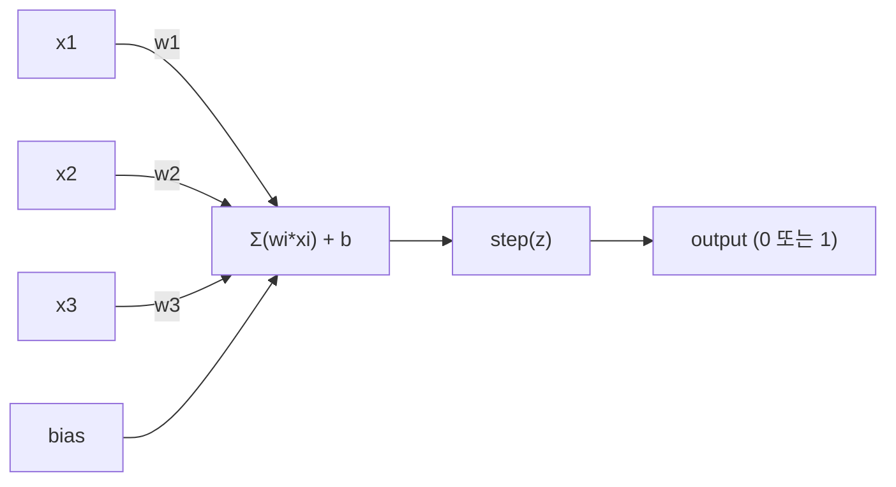
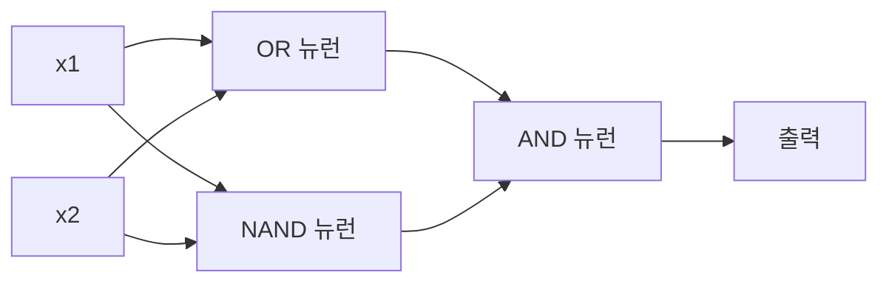

# 퍼셉트론(Perceptron)

> 퍼셉트론은 신경망의 원자입니다. 이를 분해하면 가중치(weights), 편향(bias), 그리고 결정(decision)을 찾을 수 있습니다.

**유형:** Build  
**언어:** Python  
**선수 지식:** 1단계 (선형 대수 직관)  
**소요 시간:** ~60분

## 학습 목표

- 가중치 업데이트 규칙과 계단 활성화 함수를 포함하여 Python에서 퍼셉트론을 처음부터 구현
- 단일 퍼셉트론이 선형 분리 가능한 문제만 해결할 수 있는 이유를 설명하고 XOR 실패 사례 시연
- OR, NAND, AND 게이트를 조합하여 다층 퍼셉트론을 구성하여 XOR 문제 해결
- 시그모이드 활성화 함수와 역전파를 사용하여 XOR을 자동으로 학습하는 2계층 네트워크 훈련

## 문제 정의

벡터와 내적(dot product)을 알고 있습니다. 행렬(matrix)이 입력을 출력으로 변환한다는 것도 알고 있습니다. 하지만 기계는 어떻게 *어떤 변환을 사용할지* 학습할까요?

퍼셉트론(perceptron)이 이 질문에 답합니다. 퍼셉트론은 가장 간단한 학습 기계입니다: 입력을 받고, 가중치(weights)를 곱한 후 편향(bias)을 더해 이진 결정(binary decision)을 만듭니다. 그리고 조정합니다. 그게 전부입니다. 지금까지 만들어진 모든 신경망(neural network)은 이 아이디어를 층층이 쌓아 올린 것입니다.

퍼셉트론을 이해하는 것은 코드에서 "학습"이 실제로 무엇을 의미하는지 이해하는 것입니다: 출력이 현실과 일치할 때까지 숫자를 조정하는 것.

## 개념

### 하나의 뉴런, 하나의 결정

퍼셉트론(perceptron)은 n개의 입력을 받아 각각에 가중치(weight)를 곱한 후 합산하고, 편향(bias)을 더한 다음 활성화 함수(activation function)를 통과시킵니다.



계단 함수(step function)는 다음과 같이 동작합니다: 가중치 합 + 편향이 0 이상이면 1을 출력하고, 그렇지 않으면 0을 출력합니다.

```
step(z) = 1  if z >= 0
           0  if z < 0
```

이것은 선형 분류기(linear classifier)입니다. 가중치와 편향은 입력 공간을 두 영역으로 나누는 선(2D) 또는 초평면(high-dimensional space)을 정의합니다.

### 결정 경계(Decision Boundary)

두 개의 입력에 대해 퍼셉트론은 2D 공간에 선을 그립니다:

```
  x2
  ┤
  │  Class 1        /
  │    (0)          /
  │                /
  │               / w1·x1 + w2·x2 + b = 0
  │              /
  │             /     Class 2
  │            /        (1)
  ┼───────────/──────────── x1
```

선 한쪽 영역은 0을 출력하고, 다른 쪽은 1을 출력합니다. 학습은 이 선을 이동시켜 클래스를 정확히 분리할 때까지 진행됩니다.

### 학습 규칙(Learning Rule)

퍼셉트론 학습 규칙은 다음과 같습니다:

```
각 훈련 샘플 (x, y_true)에 대해:
    y_pred = predict(x)
    error = y_true - y_pred

    각 가중치에 대해:
        w_i = w_i + 학습률(learning_rate) * error * x_i
    bias = bias + 학습률(learning_rate) * error
```

예측이 정확하면 error = 0이 되어 아무것도 변하지 않습니다. 0을 예측했지만 1이어야 할 경우 가중치가 증가하고, 1을 예측했지만 0이어야 할 경우 가중치가 감소합니다. 학습률은 각 조정 크기를 제어합니다.

### XOR 문제

여기서 한계가 드러납니다. 다음 논리 게이트를 살펴보십시오:

```
AND 게이트:           OR 게이트:            XOR 게이트:
x1  x2  out         x1  x2  out         x1  x2  out
0   0   0           0   0   0           0   0   0
0   1   0           0   1   1           0   1   1
1   0   0           1   0   1           1   0   1
1   1   1           1   1   1           1   1   0
```

AND와 OR은 선형 분리가 가능하지만, XOR은 불가능합니다. 단일 선으로 [0,1]과 [1,0]을 [0,0]과 [1,1]에서 분리할 수 없습니다.

```
AND (분리 가능):        XOR (분리 불가능):

  x2                      x2
  1 ┤  0     1            1 ┤  1     0
    │     /                 │
  0 ┤  0 / 0              0 ┤  0     1
    ┼──/──────── x1         ┼──────────── x1
       선 가능!              단일 선 불가능!
```

이것은 근본적인 한계입니다. 단일 퍼셉트론은 선형 분리 가능한 문제만 해결할 수 있습니다. Minsky와 Papert는 1969년 이를 증명했고, 이로 인해 신경망 연구가 10년간 침체되었습니다.

해결책: 퍼셉트론을 층(layer)으로 쌓습니다. 다층 퍼셉트론(multi-layer perceptron)은 두 개의 선형 결정을 결합해 비선형 결정을 만들어 XOR 문제를 해결할 수 있습니다.

## 구축

### 단계 1: 퍼셉트론(Perceptron) 클래스

```python
class Perceptron:
    def __init__(self, n_inputs, learning_rate=0.1):
        self.weights = [0.0] * n_inputs
        self.bias = 0.0
        self.lr = learning_rate

    def predict(self, inputs):
        total = sum(w * x for w, x in zip(self.weights, inputs))
        total += self.bias
        return 1 if total >= 0 else 0

    def train(self, training_data, epochs=100):
        for epoch in range(epochs):
            errors = 0
            for inputs, target in training_data:
                prediction = self.predict(inputs)
                error = target - prediction
                if error != 0:
                    errors += 1
                    for i in range(len(self.weights)):
                        self.weights[i] += self.lr * error * inputs[i]
                    self.bias += self.lr * error
            if errors == 0:
                print(f"Epoch {epoch + 1}에서 수렴 완료")
                return
        print(f"{epochs} 에포크 후에도 수렴하지 않음")
```

### 단계 2: 논리 게이트 학습

```python
and_data = [
    ([0, 0], 0),
    ([0, 1], 0),
    ([1, 0], 0),
    ([1, 1], 1),
]

or_data = [
    ([0, 0], 0),
    ([0, 1], 1),
    ([1, 0], 1),
    ([1, 1], 1),
]

not_data = [
    ([0], 1),
    ([1], 0),
]

print("=== AND 게이트 ===")
p_and = Perceptron(2)
p_and.train(and_data)
for inputs, _ in and_data:
    print(f"  {inputs} -> {p_and.predict(inputs)}")

print("\n=== OR 게이트 ===")
p_or = Perceptron(2)
p_or.train(or_data)
for inputs, _ in or_data:
    print(f"  {inputs} -> {p_or.predict(inputs)}")

print("\n=== NOT 게이트 ===")
p_not = Perceptron(1)
p_not.train(not_data)
for inputs, _ in not_data:
    print(f"  {inputs} -> {p_not.predict(inputs)}")
```

### 단계 3: XOR 실패 관찰

```python
xor_data = [
    ([0, 0], 0),
    ([0, 1], 1),
    ([1, 0], 1),
    ([1, 1], 0),
]

print("\n=== XOR 게이트 (단일 퍼셉트론) ===")
p_xor = Perceptron(2)
p_xor.train(xor_data, epochs=1000)
for inputs, expected in xor_data:
    result = p_xor.predict(inputs)
    status = "OK" if result == expected else "오류"
    print(f"  {inputs} -> {result} (예상 {expected}) {status}")
```

절대 수렴하지 않습니다. 이는 단일 퍼셉트론이 XOR을 학습할 수 없다는 확실한 증거입니다.

### 단계 4: 두 계층으로 XOR 해결

해결책: XOR = (x1 OR x2) AND NOT (x1 AND x2). 세 개의 퍼셉트론을 결합합니다:



```python
def xor_network(x1, x2):
    or_neuron = Perceptron(2)
    or_neuron.weights = [1.0, 1.0]
    or_neuron.bias = -0.5

    nand_neuron = Perceptron(2)
    nand_neuron.weights = [-1.0, -1.0]
    nand_neuron.bias = 1.5

    and_neuron = Perceptron(2)
    and_neuron.weights = [1.0, 1.0]
    and_neuron.bias = -1.5

    hidden1 = or_neuron.predict([x1, x2])
    hidden2 = nand_neuron.predict([x1, x2])
    output = and_neuron.predict([hidden1, hidden2])
    return output


print("\n=== XOR 게이트 (다층 네트워크) ===")
for inputs, expected in xor_data:
    result = xor_network(inputs[0], inputs[1])
    print(f"  {inputs} -> {result} (예상 {expected})")
```

네 가지 경우 모두 정확합니다. 퍼셉트론을 계층으로 쌓으면 단일 퍼셉트론이 생성할 수 없는 결정 경계를 만들 수 있습니다.

### 단계 5: 두 계층 네트워크 학습

단계 4에서는 가중치를 수동으로 연결했습니다. XOR에는 작동하지만, 미리 올바른 가중치를 모르는 실제 문제에는 적용할 수 없습니다. 해결책: 계단 함수를 시그모이드(sigmoid)로 대체하고 역전파(backpropagation)를 통해 가중치를 자동으로 학습합니다.

```python
class TwoLayerNetwork:
    def __init__(self, learning_rate=0.5):
        import random
        random.seed(0)
        self.w_hidden = [[random.uniform(-1, 1), random.uniform(-1, 1)] for _ in range(2)]
        self.b_hidden = [random.uniform(-1, 1), random.uniform(-1, 1)]
        self.w_output = [random.uniform(-1, 1), random.uniform(-1, 1)]
        self.b_output = random.uniform(-1, 1)
        self.lr = learning_rate

    def sigmoid(self, x):
        import math
        x = max(-500, min(500, x))
        return 1.0 / (1.0 + math.exp(-x))

    def forward(self, inputs):
        self.inputs = inputs
        self.hidden_outputs = []
        for i in range(2):
            z = sum(w * x for w, x in zip(self.w_hidden[i], inputs)) + self.b_hidden[i]
            self.hidden_outputs.append(self.sigmoid(z))
        z_out = sum(w * h for w, h in zip(self.w_output, self.hidden_outputs)) + self.b_output
        self.output = self.sigmoid(z_out)
        return self.output

    def train(self, training_data, epochs=10000):
        for epoch in range(epochs):
            total_error = 0
            for inputs, target in training_data:
                output = self.forward(inputs)
                error = target - output
                total_error += error ** 2

                d_output = error * output * (1 - output)

                saved_w_output = self.w_output[:]
                hidden_deltas = []
                for i in range(2):
                    h = self.hidden_outputs[i]
                    hd = d_output * saved_w_output[i] * h * (1 - h)
                    hidden_deltas.append(hd)

                for i in range(2):
                    self.w_output[i] += self.lr * d_output * self.hidden_outputs[i]
                self.b_output += self.lr * d_output

                for i in range(2):
                    for j in range(len(inputs)):
                        self.w_hidden[i][j] += self.lr * hidden_deltas[i] * inputs[j]
                    self.b_hidden[i] += self.lr * hidden_deltas[i]
```

```python
net = TwoLayerNetwork(learning_rate=2.0)
net.train(xor_data, epochs=10000)
for inputs, expected in xor_data:
    result = net.forward(inputs)
    predicted = 1 if result >= 0.5 else 0
    print(f"  {inputs} -> {result:.4f} (반올림: {predicted}, 예상 {expected})")
```

단계 4와의 두 가지 주요 차이점:  
1. 시그모이드 함수가 계단 함수를 대체합니다. 매끄러워서 그래디언트가 존재합니다.  
2. `train` 메서드는 출력층에서 은닉층으로 오차를 역전파하며, 오차에 대한 기여도에 비례하여 모든 가중치를 조정합니다. 이것이 20줄로 구현한 역전파입니다.  

이것이 레슨 03으로 가는 다리입니다. `d_output`과 `hidden_deltas`의 수학적 배경은 네트워크 그래프에 적용된 연쇄 법칙(chain rule)입니다. 다음 레슨에서 제대로 유도할 것입니다.

## 사용 방법

방금 직접 구현한 모든 내용이 하나의 임포트에 담겨 있습니다:

```python
from sklearn.linear_model import Perceptron as SkPerceptron
import numpy as np

X = np.array([[0,0],[0,1],[1,0],[1,1]])
y = np.array([0, 0, 0, 1])

clf = SkPerceptron(max_iter=100, tol=1e-3)
clf.fit(X, y)
print([clf.predict([x])[0] for x in X])
```

단 5줄입니다. 30줄로 구성된 `Perceptron` 클래스도 동일한 작업을 수행합니다. scikit-learn 버전은 수렴 검사, 여러 손실 함수, 희소 입력 지원을 추가했지만, 핵심 루프는 동일합니다: 가중치 합, 계단 함수, 오류 시 가중치 업데이트.

실제 차이는 규모에서 나타납니다. 프로덕션 네트워크에서 변경되는 사항:

- 계단 함수가 시그모이드(sigmoid), ReLU 또는 다른 부드러운 활성화 함수로 대체됨
- 가중치는 역전파(backpropagation)를 통해 자동 학습됨 (레슨 03)
- 레이어가 더 깊어짐: 3, 10, 100+ 레이어
- 동일한 원리가 유지됨: 각 레이어는 이전 레이어 출력으로부터 새로운 특성 생성

단일 퍼셉트론은 직선만 그릴 수 있습니다. 이를 쌓으면 어떤 모양도 그릴 수 있습니다.

## Ship It

이 레슨에서는 다음을 생성합니다:
- `outputs/skill-perceptron.md` - 단일 계층 vs 다층 아키텍처가 필요한 경우를 다루는 기술 문서

## 연습 문제

1. NAND 게이트(범용 게이트 - 모든 논리 회로는 NAND로 구성 가능)에 대해 퍼셉트론을 학습시켜 보세요. 가중치와 편향이 유효한 결정 경계를 형성하는지 검증하세요.
2. 각 에포크마다 결정 경계(w1*x1 + w2*x2 + b = 0)를 추적하도록 퍼셉트론 클래스를 수정하세요. AND 게이트 학습 중 선이 어떻게 이동하는지 출력해 보세요.
3. 3개의 입력 중 최소 2개가 1일 때만 1을 출력하는(다수결 함수) 3-입력 퍼셉트론을 구축하세요. 이 함수는 선형 분리가 가능한가요? 그 이유는 무엇인가요?

## 주요 용어

| 용어 | 사람들이 말하는 것 | 실제 의미 |
|------|----------------|----------------------|
| 퍼셉트론(Perceptron) | "가짜 뉴런" | 선형 분류기: 입력과 가중치의 내적에 편향을 더한 후 계단 함수를 통과시킴 |
| 가중치(Weight) | "입력의 중요도" | 각 입력의 결정 기여도를 조절하는 승수 |
| 편향(Bias) | "임계값" | 결정 경계를 이동시키는 상수, 입력이 0일 때도 퍼셉트론이 활성화되도록 함 |
| 활성화 함수(Activation function) | "값을 압축하는 것" | 가중합 이후에 적용되는 함수 - 퍼셉트론은 계단 함수, 현대 네트워크는 시그모이드/ReLU 사용 |
| 선형 분리 가능(Linearly separable) | "그들 사이에 선을 그을 수 있다" | 단일 초평면으로 클래스를 완벽하게 분리할 수 있는 데이터셋 |
| XOR 문제(XOR problem) | "퍼셉트론이 할 수 없는 것" | 단일 계층 네트워크가 비선형 분리 가능 함수를 학습할 수 없음을 증명하는 사례 |
| 결정 경계(Decision boundary) | "분류기가 전환되는 지점" | 입력 공간을 두 클래스로 나누는 초평면 w*x + b = 0 |
| 다층 퍼셉트론(Multi-layer perceptron) | "진짜 신경망" | 층별로 쌓인 퍼셉트론, 각 층의 출력이 다음 층의 입력으로 전달됨 |

## 추가 자료

- Frank Rosenblatt, "The Perceptron: A Probabilistic Model for Information Storage and Organization in the Brain" (1958) -- 모든 것을 시작한 원본 논문
- Minsky & Papert, "Perceptrons" (1969) -- XOR 문제가 단일 계층 네트워크로 해결 불가능함을 증명하고 10년간 퍼셉트론 연구를 중단시킨 책
- Michael Nielsen, "Neural Networks and Deep Learning", Chapter 1 (http://neuralnetworksanddeeplearning.com/) -- 무료 온라인 자료, 퍼셉트론이 네트워크로 구성되는 과정을 가장 잘 시각화한 설명