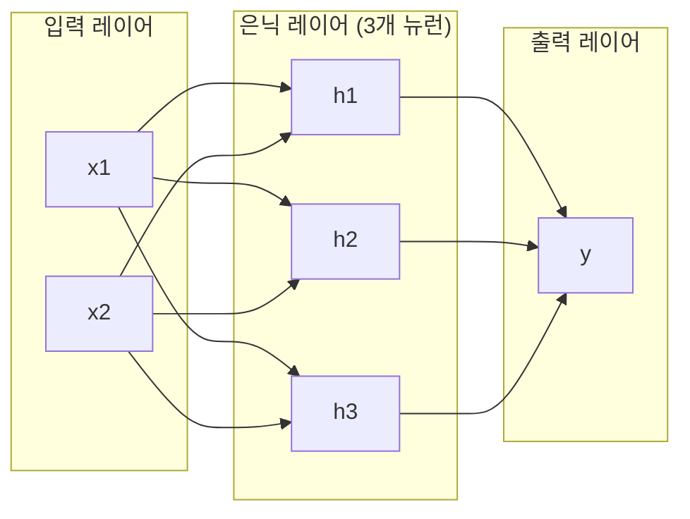
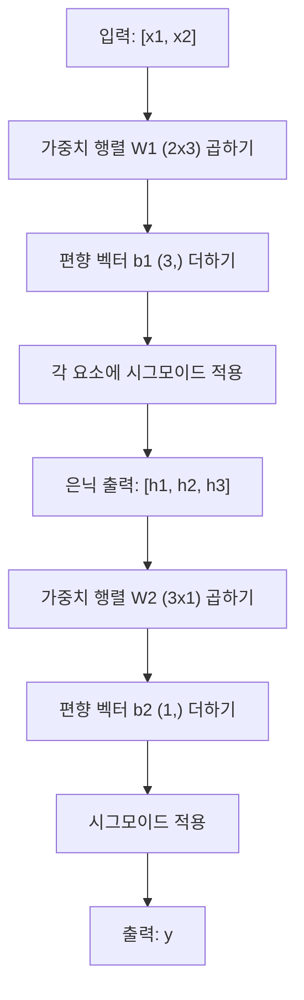

# 다층 네트워크와 순전파

> 하나의 뉴런은 직선을 그린다. 이들을 쌓으면 무엇이든 그릴 수 있다.

**유형:** 구축
**언어:** Python
**선수 지식:** 1단계(수학 기초), 03.01강(퍼셉트론)
**소요 시간:** ~90분

## 학습 목표

- **완전한 순전파를 수행하는 Layer 및 Network 클래스를 사용하여 처음부터 다층 네트워크 구축**
- **네트워크 각 레이어를 통해 행렬 차원을 추적하고 형태 불일치 식별**
- **비선형 활성화 함수 쌓기가 네트워크가 곡선 결정 경계를 학습하는 방법 설명**
- **수작업으로 조정된 시그모이드 가중치를 사용한 2-2-1 아키텍처로 XOR 문제 해결**

## 문제 정의

단일 뉴런은 선 그리기 기계입니다. 그게 전부입니다. 데이터를 통과하는 하나의 직선. 이미지 인식, 언어 이해, 바둑 게임 등 모든 실제 AI 문제는 곡선을 필요로 합니다. 뉴런을 층(layer)으로 쌓는 것이 곡선을 얻는 방법입니다.

1969년, 민스키(Minsky)와 페이퍼트(Papert)는 이 한계가 치명적이라는 것을 증명했습니다: 단일 층 네트워크는 XOR을 학습할 수 없습니다. "학습에 어려움을 겪는다"가 아니라 수학적으로 불가능합니다. XOR 진리표는 [0,1]과 [1,0]을 한쪽에, [0,0]과 [1,1]을 다른 쪽에 배치합니다. 어떤 단일 선도 이들을 분리할 수 없습니다.

이것은 10년 이상 신경망 연구 자금을 중단시켰습니다. 해결책은 사후적으로는 명백했습니다: 단일 층 사용을 중단하라. 뉴런을 층으로 쌓으라. 첫 번째 층이 입력 공간을 새로운 특징(feature)으로 분할하고, 두 번째 층이 그 특징들을 단일 선으로는 만들 수 없는 결정으로 결합하게 하라.

그 쌓임이 다층 네트워크입니다. 현재 운영 중인 모든 딥러닝 모델의 기반입니다. 순전파(forward pass) - 데이터가 입력층부터 은닉층을 거쳐 출력층으로 흐르는 과정 - 은 다른 어떤 것이 작동하기 전에 구축해야 할 첫 번째 요소입니다.

## 개념

### 레이어: 입력, 은닉, 출력

다층 네트워크는 세 가지 유형의 레이어를 가집니다:

**입력 레이어** -- 실제 레이어는 아닙니다. 원시 데이터를 보유합니다. 두 개의 특성은 두 개의 입력 노드를 의미합니다. 여기서는 계산이 발생하지 않습니다.

**은닉 레이어** -- 작업이 발생하는 곳입니다. 각 뉴런은 이전 레이어의 모든 출력을 받아 가중치와 편향(bias)을 적용한 후 활성화 함수(activation function)를 통과시킵니다. "은닉"이라는 이름은 훈련 데이터에서 이 값을 직접 볼 수 없기 때문입니다.

**출력 레이어** -- 최종 답변입니다. 이진 분류의 경우 시그모이드(sigmoid)를 사용하는 하나의 뉴런, 다중 클래스의 경우 클래스당 하나의 뉴런을 사용합니다.



이것은 2-3-1 네트워크입니다. 2개의 입력, 3개의 은닉 뉴런, 1개의 출력. 모든 연결은 가중치를 가지며, 모든 뉴런(입력 제외)은 편향을 가집니다.

각 레이어는 은닉 상태(hidden state)라고 불리는 숫자 벡터를 생성합니다. 텍스트의 경우 은닉 상태는 차원을 증가시킵니다 — 단어를 768개의 숫자로 인코딩하여 의미론적 의미를 포착합니다. 이미지의 경우 차원을 감소시킵니다 — 수백만 개의 픽셀을 관리 가능한 표현으로 압축합니다. 은닉 상태가 학습이 일어나는 곳입니다.

### 뉴런과 활성화 함수

각 뉴런은 세 가지 작업을 수행합니다:

1. 모든 입력에 해당 가중치를 곱합니다
2. 모든 곱을 합산하고 편향을 더합니다
3. 합을 활성화 함수에 통과시킵니다

현재 활성화 함수는 시그모이드(sigmoid)입니다:

```
sigmoid(z) = 1 / (1 + e^(-z))
```

시그모이드는 모든 숫자를 (0, 1) 범위로 압축합니다. 큰 양수 입력은 1로, 큰 음수 입력은 0으로, 0은 0.5로 매핑됩니다. 이 부드러운 곡선이 학습을 가능하게 합니다 — 퍼셉트론(perceptron)의 하드 스텝과 달리 시그모이드는 모든 곳에서 기울기(gradient)를 가집니다.

### 순전파: 데이터 흐름

순전파는 입력 데이터를 네트워크를 통해 레이어별로 출력까지 밀어냅니다. 순전파 중에는 학습이 발생하지 않습니다. 순수한 계산입니다: 곱하기, 더하기, 활성화, 반복.



각 레이어에서는 세 가지 연산이 순차적으로 발생합니다:

```
z = W * input + b       (선형 변환)
a = sigmoid(z)           (활성화)
```

한 레이어의 출력은 다음 레이어의 입력이 됩니다. 이것이 순전파의 전부입니다.

### 행렬 차원

차원 추적은 딥러닝에서 가장 중요한 디버깅 기술입니다. 2-3-1 네트워크 예시:

| 단계 | 연산 | 차원 | 결과 형태 |
|------|-----------|------------|-------------|
| 입력 | x | -- | (2,) |
| 은닉 선형 | W1 * x + b1 | W1: (3, 2), b1: (3,) | (3,) |
| 은닉 활성화 | sigmoid(z1) | -- | (3,) |
| 출력 선형 | W2 * h + b2 | W2: (1, 3), b2: (1,) | (1,) |
| 출력 활성화 | sigmoid(z2) | -- | (1,) |

규칙: k번째 레이어의 가중치 행렬 W는 (레이어 k의 뉴런 수, 레이어 k-1의 뉴런 수) 형태를 가집니다. 행은 현재 레이어와 일치하고, 열은 이전 레이어와 일치합니다. 형태가 맞지 않으면 버그가 있습니다.

### 보편적 근사 정리

1989년 George Cybenko는 놀라운 사실을 증명했습니다: 단일 은닉 레이어와 충분한 뉴런을 가진 신경망은 임의의 연속 함수를 원하는 정확도로 근사할 수 있습니다.

이것은 항상 하나의 은닉 레이어가 최선이라는 의미는 아닙니다. 이론적으로 가능하다는 뜻입니다. 실제로 더 깊은 네트워크(더 많은 레이어, 레이어당 더 적은 뉴런)는 얕은-넓은 네트워크보다 훨씬 적은 총 파라미터로 동일한 함수를 학습합니다. 이것이 딥러닝이 작동하는 이유입니다.

직관: 은닉 레이어의 각 뉴런은 하나의 "범프" 또는 특성을 학습합니다. 적절한 위치에 배치된 충분한 범프는 모든 매끄러운 곡선을 근사할 수 있습니다. 더 많은 뉴런, 더 많은 범프, 더 나은 근사.


### 조합 가능성

신경망은 조합 가능합니다. 쌓거나, 연결하거나, 병렬로 실행할 수 있습니다. Whisper 모델은 오디오를 처리하는 인코더 네트워크와 텍스트를 생성하는 별도의 디코더 네트워크를 사용합니다. 현대 LLM(Large Language Model)은 디코더만 사용합니다. BERT는 인코더만, T5는 인코더-디코더입니다. 아키텍처 선택이 모델의 기능을 정의합니다.

## 구축

순수 Python. NumPy 없음. 모든 행렬 연산을 처음부터 작성.

### 1단계: 시그모이드 활성화

```python
import math

def sigmoid(x):
    x = max(-500.0, min(500.0, x))
    return 1.0 / (1.0 + math.exp(-x))
```

[-500, 500]으로의 클램핑은 오버플로를 방지합니다. `math.exp(500)`은 크지만 유한합니다. `math.exp(1000)`은 무한대입니다.

### 2단계: 레이어 클래스

딥러닝에서 가장 중요한 연산은 행렬 곱셈입니다. 모든 레이어, 모든 어텐션 헤드, 모든 순전파(forward pass) — 모두 행렬 곱셈으로 이루어집니다. 선형 레이어는 입력 벡터를 받아 가중치 행렬과 곱한 후 편향 벡터를 더합니다: y = Wx + b. 이 단일 방정식이 신경망의 90% 계산을 차지합니다.

레이어는 가중치 행렬과 편향 벡터를 보유합니다. 순전파(forward) 메서드는 입력 벡터를 받아 활성화된 출력을 반환합니다.

```python
class Layer:
    def __init__(self, n_inputs, n_neurons, weights=None, biases=None):
        if weights is not None:
            self.weights = weights
        else:
            import random
            self.weights = [
                [random.uniform(-1, 1) for _ in range(n_inputs)]
                for _ in range(n_neurons)
            ]
        if biases is not None:
            self.biases = biases
        else:
            self.biases = [0.0] * n_neurons

    def forward(self, inputs):
        self.last_input = inputs
        self.last_output = []
        for neuron_idx in range(len(self.weights)):
            z = sum(
                w * x for w, x in zip(self.weights[neuron_idx], inputs)
            )
            z += self.biases[neuron_idx]
            self.last_output.append(sigmoid(z))
        return self.last_output
```

가중치 행렬은 (n_neurons, n_inputs) 형태를 가집니다. 각 행은 모든 입력에 대한 하나의 뉴런 가중치입니다. 순전파 메서드는 뉴런을 순회하며 가중 합과 편향을 계산하고 시그모이드를 적용한 결과를 수집합니다.

### 3단계: 네트워크 클래스

네트워크는 레이어 목록입니다. 순전파는 레이어들을 연결합니다: 레이어 k의 출력이 레이어 k+1의 입력으로 들어갑니다.

```python
class Network:
    def __init__(self, layers):
        self.layers = layers

    def forward(self, inputs):
        current = inputs
        for layer in self.layers:
            current = layer.forward(current)
        return current
```

이것이 순전파의 전부입니다. 4줄의 로직입니다. 데이터가 입력되어 모든 레이어를 통과한 후 출력됩니다.

### 4단계: 수작업 가중치 XOR

레슨 01에서 OR, NAND, AND 퍼셉트론을 결합하여 XOR을 해결했습니다. 이제 Layer와 Network 클래스로 동일한 작업을 수행합니다. 2-2-1 아키텍처: 2개 입력, 2개 은닉 뉴런, 1개 출력.

```python
hidden = Layer(
    n_inputs=2,
    n_neurons=2,
    weights=[[20.0, 20.0], [-20.0, -20.0]],
    biases=[-10.0, 30.0],
)

output = Layer(
    n_inputs=2,
    n_neurons=1,
    weights=[[20.0, 20.0]],
    biases=[-30.0],
)

xor_net = Network([hidden, output])

xor_data = [
    ([0, 0], 0),
    ([0, 1], 1),
    ([1, 0], 1),
    ([1, 1], 0),
]

for inputs, expected in xor_data:
    result = xor_net.forward(inputs)
    predicted = 1 if result[0] >= 0.5 else 0
    print(f"  {inputs} -> {result[0]:.6f} (반올림: {predicted}, 기대값: {expected})")
```

큰 가중치(20, -20)는 시그모이드를 계단 함수처럼 동작하게 합니다. 첫 번째 은닉 뉴런은 OR을 근사하고, 두 번째는 NAND를 근사합니다. 출력 뉴런은 이들을 결합하여 XOR을 구현합니다.

### 5단계: 원 분류

더 어려운 문제: 원점 중심 반지름 0.5의 원 내부/외부 2D 점 분류. 이는 곡선 결정 경계를 필요로 하며 단일 퍼셉트론으로는 불가능합니다.

```python
import random
import math

random.seed(42)

data = []
for _ in range(200):
    x = random.uniform(-1, 1)
    y = random.uniform(-1, 1)
    label = 1 if (x * x + y * y) < 0.25 else 0
    data.append(([x, y], label))

circle_net = Network([
    Layer(n_inputs=2, n_neurons=8),
    Layer(n_inputs=8, n_neurons=1),
])
```

무작위 가중치로는 네트워크가 잘 분류하지 못합니다. 하지만 순전파는 여전히 실행됩니다. 이것이 핵심입니다 — 순전파는 단순 계산입니다. 올바른 가중치를 학습하는 것은 역전파(backpropagation)이며, 레슨 03에서 다룹니다.

```python
correct = 0
for inputs, expected in data:
    result = circle_net.forward(inputs)
    predicted = 1 if result[0] >= 0.5 else 0
    if predicted == expected:
        correct += 1

print(f"무작위 가중치 정확도: {correct}/{len(data)} ({100*correct/len(data):.1f}%)")
```

무작위 가중치는 낮은 정확도를 보입니다 — 종종 다수 클래스 추측보다 나쁩니다. 훈련(레슨 03) 후 8개 은닉 뉴런을 가진 이 아키텍처는 내부와 외부를 구분하는 곡선 경계를 그릴 수 있습니다.

## 사용 방법

PyTorch는 위의 모든 작업을 단 4줄로 수행합니다:

```python
import torch
import torch.nn as nn

model = nn.Sequential(
    nn.Linear(2, 8),
    nn.Sigmoid(),
    nn.Linear(8, 1),
    nn.Sigmoid(),
)

x = torch.tensor([[0.0, 0.0], [0.0, 1.0], [1.0, 0.0], [1.0, 1.0]])
output = model(x)
print(output)
```

`nn.Linear(2, 8)`은 레이어 클래스 역할을 합니다: (8, 2) 형태의 가중치 행렬과 (8,) 형태의 편향 벡터를 가집니다. `nn.Sigmoid()`는 요소별로 적용되는 시그모이드 함수입니다. `nn.Sequential`은 네트워크 클래스 역할을 합니다: 레이어들을 순서대로 연결합니다.

차이점은 속도와 규모입니다. PyTorch는 GPU에서 실행되며, 수백만 개의 샘플 배치를 처리하고 역전파(backpropagation)를 위한 기울기를 자동으로 계산합니다. 하지만 순전파(forward pass) 로직은 방금 직접 구현한 것과 동일합니다.

## Ship It

이 레슨은 네트워크 아키텍처 설계를 위한 재사용 가능한 프롬프트를 생성합니다:

- `outputs/prompt-network-architect.md`

주어진 문제에 대해 몇 개의 레이어, 각 레이어당 몇 개의 뉴런, 어떤 활성화 함수를 사용할지 결정해야 할 때 사용하세요.

## 연습 문제

1. 2-4-2-1 네트워크(은닉층 2개)를 구축하고 XOR 데이터에 대해 무작위 가중치로 순전파를 실행합니다. 중간 은닉층 출력을 인쇄하여 각 레이어에서 표현이 어떻게 변환되는지 확인합니다.

2. 원 분류기(circle classifier)의 은닉층 크기를 8에서 2로, 다시 32로 변경합니다. 매번 무작위 가중치로 순전파를 실행합니다. 은닉 뉴런 수가 출력 범위나 분포를 변경시키나요? 그 이유는 무엇인가요?

3. Network 클래스에 `count_parameters` 메서드를 구현하여 총 학습 가능한 가중치와 편향 수를 반환하도록 합니다. 784-256-128-10 네트워크(클래식 MNIST 아키텍처)에서 테스트합니다. 이 네트워크의 파라미터 수는 얼마인가요?

4. 3-4-4-2 네트워크에 대한 순전파를 구축합니다. RGB 색상 값(0-1 정규화)을 입력으로 제공하고 두 출력을 관찰합니다. 이는 두 클래스를 가진 간단한 색상 분류기의 아키텍처입니다.

5. 시그모이드(sigmoid)를 "누수 계단(leaky step)" 함수로 대체합니다: z < 0이면 0.01 * z를, 그렇지 않으면 1.0을 반환합니다. 4단계에서 사용한 동일한 수동 조정 가중치로 XOR 데이터에 순전파를 실행합니다. 여전히 작동하나요? 왜 부드러운 시그모이드가 급격한 절단보다 선호되나요?

## 주요 용어

| 용어 | 사람들이 말하는 표현 | 실제 의미 |
|------|----------------|----------------------|
| 순전파(forward pass) | "모델을 실행한다" | 입력을 모든 레이어에 통과시켜 -- 가중치와 곱하고, 편향을 더한 후 활성화 -- 출력을 생성하는 과정 |
| 은닉층(hidden layer) | "중간 부분" | 입력과 출력 사이에 위치하며, 데이터에서 직접 관찰되지 않는 값을 갖는 모든 레이어 |
| 다층 네트워크(multi-layer network) | "심층 신경망" | 뉴런 레이어들이 순차적으로 쌓여 있고, 각 레이어의 출력이 다음 레이어의 입력으로 사용되는 구조 |
| 활성화 함수(activation function) | "비선형성" | 선형 변환 후에 적용되어 결정 경계에 곡선을 도입하는 함수 |
| 시그모이드(sigmoid) | "S-곡선" | sigma(z) = 1/(1+e^(-z)), 모든 실수를 (0,1) 범위로 압축하며, 모든 곳에서 매끄럽고 미분 가능 |
| 가중치 행렬(weight matrix) | "파라미터" | (현재_레이어_뉴런_수, 이전_레이어_뉴런_수) 형태의 행렬 W로, 학습 가능한 연결 강도를 포함 |
| 편향 벡터(bias vector) | "오프셋" | 행렬 곱 이후에 더해지는 벡터로, 모든 입력이 0일 때도 뉴런이 활성화될 수 있게 함 |
| 범용 근사(universal approximation) | "신경망은 무엇이든 학습할 수 있다" | 충분한 뉴런을 가진 단일 은닉층은 모든 연속 함수를 근사할 수 있지만, "충분한"은 수십억을 의미할 수 있음 |
| 선형 변환(linear transformation) | "행렬 곱 단계" | z = W * x + b, 활성화 이전의 계산으로, 입력을 새로운 공간으로 매핑 |
| 결정 경계(decision boundary) | "분류기가 전환되는 지점" | 네트워크 출력이 분류 임계값을 넘는 입력 공간의 표면 |

## 추가 자료

- Michael Nielsen, "Neural Networks and Deep Learning", 1-2장 (http://neuralnetworksanddeeplearning.com/) -- 순전파(forward pass)와 네트워크 구조에 대한 가장 명확한 무료 설명, 대화형 시각화 포함
- Cybenko, "Approximation by Superpositions of a Sigmoidal Function" (1989) -- 최초의 범용 근사 정리(universal approximation theorem) 논문, 놀랍게도 읽기 쉬움
- 3Blue1Brown, "But what is a neural network?" (https://www.youtube.com/watch?v=aircAruvnKk) -- 20분 분량의 시각적 설명, 레이어(layer), 가중치(weight), 순전파에 대한 올바른 정신 모델 구축
- Goodfellow, Bengio, Courville, "Deep Learning", 6장 (https://www.deeplearningbook.org/) -- 다층 네트워크(multi-layer network)에 대한 표준 참고서, 온라인 무료 제공