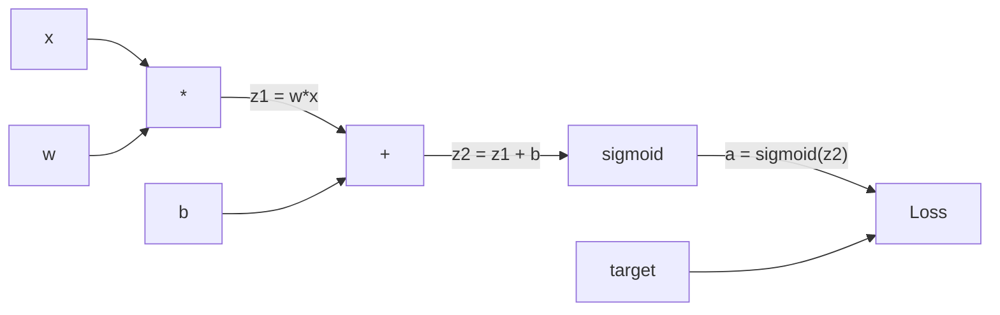
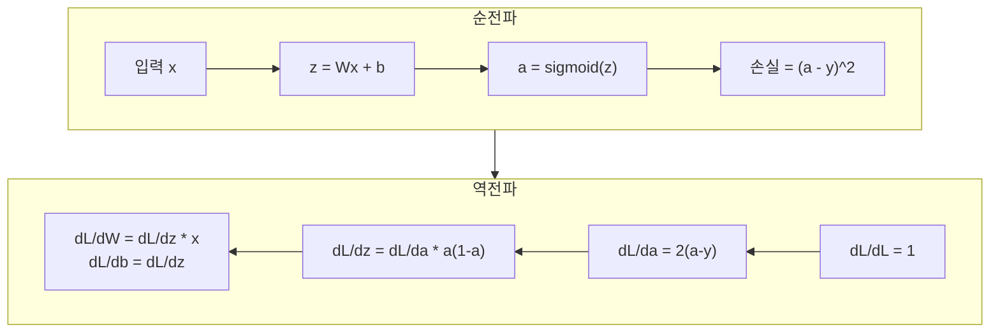
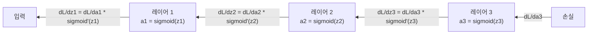

# 역전파(Backpropagation) 처음부터 구현하기

> 역전파(backpropagation)는 학습을 가능하게 하는 알고리즘입니다. 이것이 없다면 신경망은 단지 비싼 난수 생성기에 불과합니다.

**유형:** 구현
**언어:** Python
**선수 지식:** Lesson 03.02 (다층 신경망)
**소요 시간:** ~120분

## 학습 목표

- 계산 그래프를 구성하고 위상 정렬을 통해 기울기를 계산하는 값 기반(value-based) autograd 엔진 구현
- 연쇄 법칙(chain rule)을 사용하여 덧셈(addition), 곱셈(multiplication), 시그모이드(sigmoid)의 역전파(backward pass) 유도
- 직접 구현한 역전파(backpropagation) 엔진만을 사용하여 XOR 및 원형 분류(circle classification) 작업에 다층 신경망(multi-layer network) 훈련
- 깊은 시그모이드(sigmoid) 네트워크에서 소실 기울기(vanishing gradient) 문제 식별 및 기울기가 지수적으로 감소하는 이유 설명

## 문제

당신의 네트워크는 768개의 입력과 3072개의 출력을 가진 단일 은닉층을 가지고 있습니다. 이는 2,359,296개의 가중치(weights)를 의미합니다. 이 네트워크가 잘못된 예측을 했습니다. 어떤 가중치가 오류를 일으켰을까요? 각 가중치를 개별적으로 테스트하려면 230만 번의 순전파(forward pass)가 필요합니다. 역전파(backpropagation)는 단일 역전파(backward pass)로 230만 개의 기울기(gradient)를 모두 계산합니다. 이는 최적화가 아니라, 학습 가능한 것과 불가능한 것의 차이입니다.

순진한 접근법: 하나의 가중치를 선택하고, 아주 작은 양만큼 조정한 후 순전파를 다시 실행하여 손실(loss)이 증가했는지 감소했는지 측정합니다. 이를 통해 해당 가중치의 기울기를 얻을 수 있습니다. 이제 네트워크의 모든 가중치에 대해 이 과정을 반복합니다. 수천 번의 학습 단계와 수백만 개의 데이터 포인트를 곱하면, 유용한 모델을 학습시키기 위해 지질학적 시간이 필요하게 됩니다.

역전파는 이 문제를 해결합니다. 단일 순전파와 단일 역전파만으로 모든 기울기를 계산할 수 있습니다. 이 트릭은 미적분학의 연쇄 법칙(chain rule)을 계산 그래프(computational graph)에 체계적으로 적용한 것입니다. 이것이 딥러닝을 실용적으로 만든 알고리즘입니다. 역전파가 없었다면, 우리는 여전히 장난감 수준의 문제에 머물러 있었을 것입니다.

## 개념

### 네트워크에 적용된 연쇄 법칙

Phase 01, Lesson 05에서 연쇄 법칙(chain rule)을 보았습니다. 간단히 복습하면, y = f(g(x))일 때 dy/dx = f'(g(x)) * g'(x)입니다. 체인을 따라 미분값을 곱합니다.

신경망에서 "체인"은 입력부터 손실까지의 연산 순서입니다. 각 레이어는 가중치를 적용하고 편향을 더한 후 활성화 함수를 통과시킵니다. 손실 함수는 최종 출력과 타겟을 비교합니다. 역전파(backpropagation)는 이 체인을 역추적하여 각 연산이 오차에 기여한 정도를 계산합니다.

### 계산 그래프

모든 순전파(forward pass)는 그래프를 구성합니다. 각 노드는 연산(곱셈, 덧셈, 시그모이드)이고, 각 엣지는 값을 전달하고 기울기를 역방향으로 전달합니다.



순전파: 값은 왼쪽에서 오른쪽으로 흐릅니다. x와 w는 z1 = w*x를 생성합니다. b를 더해 z2를 얻습니다. 시그모이드 함수는 활성화 a를 출력합니다. 손실 함수를 사용해 a와 타겟 y를 비교합니다.

역전파: 기울기는 오른쪽에서 왼쪽으로 흐릅니다. dL/da(활성화에 따른 손실 변화)로 시작합니다. da/dz2(시그모이드 미분값)를 곱해 dL/dz2를 얻습니다. 이는 dL/db(z2 = z1 + b이므로 dL/dz2와 동일)와 dL/dz1로 분기됩니다. 이후 dL/dw = dL/dz1 * x, dL/dx = dL/dz1 * w가 됩니다.

그래프의 모든 노드는 역전파 시 하나의 역할을 수행합니다: 상위로부터 전달된 기울기를 받아 지역 미분값과 곱한 후 하위로 전달합니다.

### 순전파 vs 역전파



순전파는 모든 중간값(z, a, 각 레이어의 입력)을 저장합니다. 역전파는 이 저장된 값을 사용해 기울기를 계산합니다. 이는 역전파의 핵심인 메모리-계산 트레이드오프입니다. 메모리(활성화 값 저장)를 희생해 계산 속도(백만 번의 패스 대신 한 번의 패스)를 얻습니다.

### 네트워크를 통한 기울기 흐름

3층 네트워크의 경우 기울기는 모든 레이어를 통과하며 연쇄됩니다:



각 레이어에서 기울기는 시그모이드 미분값과 곱해집니다. 시그모이드 미분값은 a * (1 - a)이며, 최대값은 0.25(a = 0.5일 때)입니다. 3층 깊이에서는 기울기가 최대 0.25^3 = 0.0156까지 감소합니다. 10층 깊이에서는 0.25^10 = 0.000001이 됩니다.

### 소실 기울기(Vanishing Gradients)

이것이 소실 기울기 문제입니다. 시그모이드는 출력을 0과 1 사이로 압축합니다. 미분값은 항상 0.25 미만입니다. 충분한 시그모이드 레이어를 쌓으면 기울기는 사라집니다. 초기 레이어는 거의 학습되지 않는데, 이는 거의 0에 가까운 기울기를 받기 때문입니다.

```
sigmoid(z):     출력 범위 [0, 1]
sigmoid'(z):    최대값 0.25 (z = 0에서)

5층 이후:   기울기 * 0.25^5 = 원래 기울기의 0.001배
10층 이후:  기울기 * 0.25^10 = 원래 기울기의 0.000001배
```

이것이 깊은 시그모이드 네트워크를 거의 훈련시킬 수 없는 이유입니다. 해결책인 ReLU와 그 변형들은 Lesson 04에서 다룹니다. 지금은 역전파가 완벽하게 작동한다는 점을 이해하세요. 문제는 역전파가 처리하는 대상입니다.

### 2층 네트워크의 기울기 유도

입력 x, 시그모이드 활성화 함수를 가진 은닉층, 시그모이드 활성화 함수를 가진 출력층, MSE 손실 함수를 가진 네트워크의 구체적인 수학:

순전파:
```
z1 = W1 * x + b1
a1 = sigmoid(z1)
z2 = W2 * a1 + b2
a2 = sigmoid(z2)
L = (a2 - y)^2
```

역전파(연쇄 법칙 단계적 적용):
```
dL/da2 = 2(a2 - y)
da2/dz2 = a2 * (1 - a2)
dL/dz2 = dL/da2 * da2/dz2 = 2(a2 - y) * a2 * (1 - a2)

dL/dW2 = dL/dz2 * a1
dL/db2 = dL/dz2

dL/da1 = dL/dz2 * W2
da1/dz1 = a1 * (1 - a1)
dL/dz1 = dL/da1 * da1/dz1

dL/dW1 = dL/dz1 * x
dL/db1 = dL/dz1
```

모든 기울기는 손실부터 역추적된 지역 미분값들의 곱입니다. 이것이 역전파의 전부입니다.

## 구축 방법

### 단계 1: 값 노드

우리의 계산에서 모든 숫자는 Value가 됩니다. Value는 데이터, 기울기, 그리고 생성 방법(역방향 기울기 계산 방법)을 저장합니다.

```python
class Value:
    def __init__(self, data, children=(), op=''):
        self.data = data
        self.grad = 0.0
        self._backward = lambda: None
        self._children = set(children)
        self._op = op

    def __repr__(self):
        return f"Value(data={self.data:.4f}, grad={self.grad:.4f})"
```

아직 기울기는 없습니다(0.0). 아직 역전파 함수도 없습니다(no-op). `_children`은 이 Value를 생성한 Value들을 추적하여 나중에 그래프를 위상 정렬할 수 있도록 합니다.

### 단계 2: 역전파 함수가 있는 연산

각 연산은 새로운 Value를 생성하고 기울기가 역방향으로 흐르는 방식을 정의합니다.

```python
def __add__(self, other):
    other = other if isinstance(other, Value) else Value(other)
    out = Value(self.data + other.data, (self, other), '+')

    def _backward():
        self.grad += out.grad
        other.grad += out.grad

    out._backward = _backward
    return out

def __mul__(self, other):
    other = other if isinstance(other, Value) else Value(other)
    out = Value(self.data * other.data, (self, other), '*')

    def _backward():
        self.grad += other.data * out.grad
        other.grad += self.data * out.grad

    out._backward = _backward
    return out
```

덧셈의 경우: d(a+b)/da = 1, d(a+b)/db = 1. 따라서 두 입력 모두 출력의 기울기를 직접 받습니다.

곱셈의 경우: d(a*b)/da = b, d(a*b)/db = a. 각 입력은 다른 값의 기울기에 출력 기울기를 곱한 값을 받습니다.

`+=`는 매우 중요합니다. 하나의 Value가 여러 연산에 사용될 수 있습니다. 기울기는 모든 경로에서 오는 기울기의 합입니다.

### 단계 3: 시그모이드와 손실 함수

```python
import math

def sigmoid(self):
    x = self.data
    x = max(-500, min(500, x))
    s = 1.0 / (1.0 + math.exp(-x))
    out = Value(s, (self,), 'sigmoid')

    def _backward():
        self.grad += (s * (1 - s)) * out.grad

    out._backward = _backward
    return out
```

시그모이드 미분: 시그모이드(x) * (1 - 시그모이드(x)). 순전파 중에 시그모이드(x) = s를 계산했으므로 재사용합니다. 추가 작업이 필요 없습니다.

```python
def mse_loss(predicted, target):
    diff = predicted + Value(-target)
    return diff * diff
```

단일 출력에 대한 MSE: (예측값 - 목표값)^2. 뺄셈을 음수로 표현된 Value의 덧셈으로 표현합니다.

### 단계 4: 역전파

위상 정렬은 노드를 올바른 순서로 처리하도록 보장합니다. 노드의 기울기가 완전히 누적된 후에 해당 노드를 통해 기울기를 전파합니다.

```python
def backward(self):
    topo = []
    visited = set()

    def build_topo(v):
        if v not in visited:
            visited.add(v)
            for child in v._children:
                build_topo(child)
            topo.append(v)

    build_topo(self)
    self.grad = 1.0
    for v in reversed(topo):
        v._backward()
```

손실에서 시작합니다(기울기 = 1.0, dL/dL = 1). 정렬된 그래프를 역방향으로 이동합니다. 각 노드의 `_backward`는 자식 노드들에게 기울기를 전달합니다.

### 단계 5: 레이어와 네트워크

```python
import random

class Neuron:
    def __init__(self, n_inputs):
        scale = (2.0 / n_inputs) ** 0.5
        self.weights = [Value(random.uniform(-scale, scale)) for _ in range(n_inputs)]
        self.bias = Value(0.0)

    def __call__(self, x):
        act = sum((wi * xi for wi, xi in zip(self.weights, x)), self.bias)
        return act.sigmoid()

    def parameters(self):
        return self.weights + [self.bias]


class Layer:
    def __init__(self, n_inputs, n_outputs):
        self.neurons = [Neuron(n_inputs) for _ in range(n_outputs)]

    def __call__(self, x):
        out = [n(x) for n in self.neurons]
        return out[0] if len(out) == 1 else out

    def parameters(self):
        params = []
        for n in self.neurons:
            params.extend(n.parameters())
        return params


class Network:
    def __init__(self, sizes):
        self.layers = []
        for i in range(len(sizes) - 1):
            self.layers.append(Layer(sizes[i], sizes[i + 1]))

    def __call__(self, x):
        for layer in self.layers:
            x = layer(x)
            if not isinstance(x, list):
                x = [x]
        return x[0] if len(x) == 1 else x

    def parameters(self):
        params = []
        for layer in self.layers:
            params.extend(layer.parameters())
        return params

    def zero_grad(self):
        for p in self.parameters():
            p.grad = 0.0
```

뉴런은 입력을 받아 가중치 합 + 바이어스를 계산하고 시그모이드를 적용합니다. 가중치 초기화는 sqrt(2/n_inputs)로 스케일링하여 깊은 네트워크에서 시그모이드 포화 현상을 방지합니다. 레이어는 뉴런들의 리스트입니다. 네트워크는 레이어들의 리스트입니다. `parameters()` 메서드는 모든 학습 가능한 Value를 수집하여 업데이트할 수 있도록 합니다.

### 단계 6: XOR 학습

```python
random.seed(42)
net = Network([2, 4, 1])

xor_data = [
    ([0.0, 0.0], 0.0),
    ([0.0, 1.0], 1.0),
    ([1.0, 0.0], 1.0),
    ([1.0, 1.0], 0.0),
]

learning_rate = 1.0

for epoch in range(1000):
    total_loss = Value(0.0)
    for inputs, target in xor_data:
        x = [Value(i) for i in inputs]
        pred = net(x)
        loss = mse_loss(pred, target)
        total_loss = total_loss + loss

    net.zero_grad()
    total_loss.backward()

    for p in net.parameters():
        p.data -= learning_rate * p.grad

    if epoch % 100 == 0:
        print(f"Epoch {epoch:4d} | Loss: {total_loss.data:.6f}")

print("\nXOR 결과:")
for inputs, target in xor_data:
    x = [Value(i) for i in inputs]
    pred = net(x)
    print(f"  {inputs} -> {pred.data:.4f} (예상 {target})")
```

손실이 감소하는 것을 확인하세요. 무작위 예측에서 올바른 XOR 출력으로, 역전파가 기울기를 계산하고 가중치를 올바른 방향으로 조정합니다.

### 단계 7: 원 분류

레슨 02에서는 원 분류를 위해 가중치를 수동으로 조정했습니다. 이제 네트워크가 스스로 학습하도록 합니다.

```python
random.seed(7)

def generate_circle_data(n=100):
    data = []
    for _ in range(n):
        x1 = random.uniform(-1.5, 1.5)
        x2 = random.uniform(-1.5, 1.5)
        label = 1.0 if x1 * x1 + x2 * x2 < 1.0 else 0.0
        data.append(([x1, x2], label))
    return data

circle_data = generate_circle_data(80)

circle_net = Network([2, 8, 1])
learning_rate = 0.5

for epoch in range(2000):
    random.shuffle(circle_data)
    total_loss_val = 0.0
    for inputs, target in circle_data:
        x = [Value(i) for i in inputs]
        pred = circle_net(x)
        loss = mse_loss(pred, target)
        circle_net.zero_grad()
        loss.backward()
        for p in circle_net.parameters():
            p.data -= learning_rate * p.grad
        total_loss_val += loss.data

    if epoch % 200 == 0:
        correct = 0
        for inputs, target in circle_data:
            x = [Value(i) for i in inputs]
            pred = circle_net(x)
            predicted_class = 1.0 if pred.data > 0.5 else 0.0
            if predicted_class == target:
                correct += 1
        accuracy = correct / len(circle_data) * 100
        print(f"Epoch {epoch:4d} | Loss: {total_loss_val:.4f} | 정확도: {accuracy:.1f}%")
```

여기서는 온라인 SGD를 사용합니다. 전체 배치를 누적하는 대신 각 샘플 후에 가중치를 업데이트합니다. 이는 대칭성을 더 빠르게 깨고 전체 손실 함수에서 시그모이드 포화 현상을 방지합니다. 매 에포크마다 데이터를 섞어 네트워크가 순서를 외우지 않도록 합니다.

수동 조정이 필요 없습니다. 네트워크는 스스로 원형 결정 경계를 발견합니다. 이것이 역전파의 힘입니다. 아키텍처, 손실 함수, 데이터를 정의하면 알고리즘이 가중치를 찾아냅니다.

## 사용 방법

PyTorch는 위의 모든 작업을 몇 줄로 수행합니다. 핵심 아이디어는 동일합니다. 자동 미분(autograd)은 순전파(forward pass) 중에 계산 그래프를 구축하고, 역전파(backward pass) 시 이를 추적하여 기울기를 계산합니다.

```python
import torch
import torch.nn as nn

model = nn.Sequential(
    nn.Linear(2, 4),
    nn.Sigmoid(),
    nn.Linear(4, 1),
    nn.Sigmoid(),
)
optimizer = torch.optim.SGD(model.parameters(), lr=1.0)
criterion = nn.MSELoss()

X = torch.tensor([[0,0],[0,1],[1,0],[1,1]], dtype=torch.float32)
y = torch.tensor([[0],[1],[1],[0]], dtype=torch.float32)

for epoch in range(1000):
    pred = model(X)
    loss = criterion(pred, y)
    optimizer.zero_grad()
    loss.backward()
    optimizer.step()

print("PyTorch XOR Results:")
with torch.no_grad():
    for i in range(4):
        pred = model(X[i])
        print(f"  {X[i].tolist()} -> {pred.item():.4f} (expected {y[i].item()})")
```

`loss.backward()`는 `total_loss.backward()`에 해당합니다. `optimizer.step()`은 수동으로 수행하는 `p.data -= lr * p.grad`와 동일하며, `optimizer.zero_grad()`는 `net.zero_grad()`와 같습니다. 동일한 알고리즘이지만 산업 수준의 구현이 제공됩니다. PyTorch는 GPU 가속, 혼합 정밀도, 기울기 체크포인팅 및 수백 가지 레이어 유형을 처리합니다. 하지만 역전파 과정은 동일한 계산 그래프에 적용되는 연쇄 법칙(chain rule)과 동일합니다.

훈련(training)은 순전파를 실행한 후 역전파를 수행하고 가중치를 업데이트합니다. 추론(inference)은 순전파만 실행합니다. 기울기 계산도 없고 가중치 업데이트도 없습니다. 이 구분은 추론이 실제 서비스에서 발생하는 작업이기 때문에 중요합니다. Claude나 GPT 같은 API를 호출할 때는 추론을 실행하는 것입니다. 프롬프트가 네트워크를 통해 순전파되고, 반대쪽에서 토큰이 출력됩니다. 가중치는 변경되지 않습니다. 역전파를 이해하는 것은 해당 네트워크의 모든 가중치를 형성하는 데 영향을 미쳤기 때문에 중요합니다.

## Ship It

이 레슨은 다음을 생성합니다:
- `outputs/prompt-gradient-debugger.md` -- 모든 신경망에서 기울기 문제(소실, 폭주, NaN)를 진단하기 위한 재사용 가능한 프롬프트

## 연습 문제

1. Value 클래스에 `__sub__` 메서드(연산: a - b = a + (-1 * b))를 추가하세요. 그런 다음 `__neg__` 메서드를 구현하세요. (a - b)^2와 같은 간단한 표현식에 대해 수동 계산과 비교하여 그래디언트가 올바른지 검증하세요.

2. Value에 `relu` 메서드(출력: max(0, x), 도함수: x > 0이면 1, 아니면 0)를 추가하세요. 은닉층에서 시그모이드(sigmoid)를 ReLU로 대체하고 XOR 데이터셋으로 다시 학습시켜 보세요. 수렴 속도를 비교하세요. 더 빠른 학습이 관찰될 것입니다 — 이는 Lesson 04의 사전 미리보기입니다.

3. Value에 정수 제곱을 위한 `__pow__` 메서드를 구현하세요. 이를 사용하여 `mse_loss`를 `(predicted - target) ** 2` 표현식으로 대체하세요. 그래디언트가 원래 구현과 일치하는지 검증하세요.

4. 학습 루프에 그래디언트 클리핑(gradient clipping)을 추가하세요: `backward()` 호출 후 모든 그래디언트를 [-1, 1] 범위로 클리핑하세요. 더 깊은 네트워크(4+ 층, 시그모이드 활성화)를 학습시키고 클리핑 적용 여부에 따른 손실 곡선을 비교하세요. 이는 폭주 그래디언트(exploding gradients)에 대한 첫 번째 방어 수단입니다.

5. 시각화 도구를 구축하세요: XOR 학습 후 네트워크의 모든 파라미터 그래디언트를 출력하세요. 어떤 층에서 그래디언트가 가장 작은지 식별하세요. 이는 개념 섹션에서 읽은 소실 그래디언트(vanishing gradient) 문제를 보여줍니다.

## 핵심 용어

| 용어 | 사람들이 말하는 표현 | 실제 의미 |
|------|----------------|----------------------|
| 역전파(backpropagation) | "네트워크가 학습한다" | 계산 그래프를 통해 연쇄 법칙을 역방향으로 적용하여 모든 가중치에 대한 dL/dw를 계산하는 알고리즘 |
| 계산 그래프(computational graph) | "네트워크 구조" | 노드는 연산이고 간선은 값(순전파)과 그래디언트(역전파)를 전달하는 방향 비순환 그래프 |
| 연쇄 법칙(chain rule) | "도함수를 곱한다" | y = f(g(x))일 때, dy/dx = f'(g(x)) * g'(x) -- 역전파의 수학적 기반 |
| 그래디언트(gradient) | "가장 가파른 상승 방향" | 손실 함수에 대한 매개변수의 편미분 -- 해당 매개변수를 어떻게 변경해야 손실을 줄일 수 있는지 알려줌 |
| 소실 그래디언트(vanishing gradient) | "심층 네트워크가 학습하지 못한다" | 시그모이드와 같은 포화 활성화 함수를 사용하는 레이어를 통해 전파될 때 그래디언트가 지수적으로 감소 |
| 순전파(forward pass) | "네트워크 실행" | 각 레이어의 연산을 순차적으로 적용하여 입력으로부터 출력을 계산하고 중간 값을 저장 |
| 역전파(backward pass) | "그래디언트 계산" | 계산 그래프를 역방향으로 탐색하며 연쇄 법칙을 사용해 각 노드의 그래디언트를 누적 |
| 학습률(learning rate) | "학습 속도" | 가중치 업데이트 시 단계 크기를 제어하는 스칼라 값: w_new = w_old - lr * 그래디언트 |
| 위상 정렬(topological sort) | "올바른 순서" | 각 노드가 의존하는 모든 노드 이후에 나타나도록 그래프 노드를 정렬 -- 그래디언트가 완전히 누적된 후 전파되도록 보장 |
| 오토그래드(autograd) | "자동 미분" | 순전파 계산 중에 계산 그래프를 구성하고 그래디언트를 자동으로 계산하는 시스템 -- PyTorch 엔진이 수행하는 작업 |

## 추가 자료

- Rumelhart, Hinton & Williams, "오류를 역전파(backpropagation)하여 표현 학습" (1986) -- 역전파(backpropagation)를 주류로 만들고 다층 네트워크 학습을 가능하게 한 논문
- 3Blue1Brown, "신경망(Neural Networks)" 시리즈 (https://www.youtube.com/playlist?list=PLZHQObOWTQDNU6R1_67000Dx_ZCJB-3pi) -- 역전파(backpropagation)와 네트워크를 통한 기울기(gradient) 흐름에 대한 최고의 시각적 설명