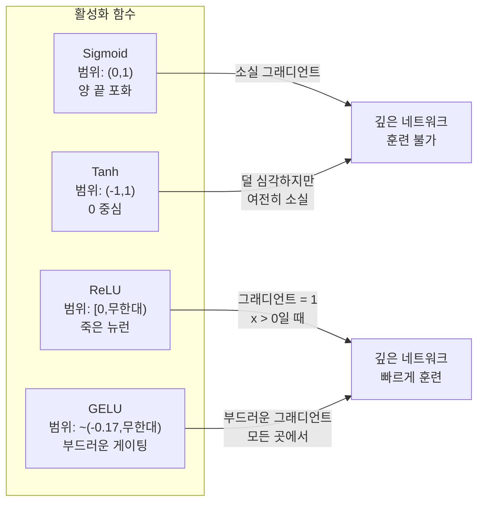
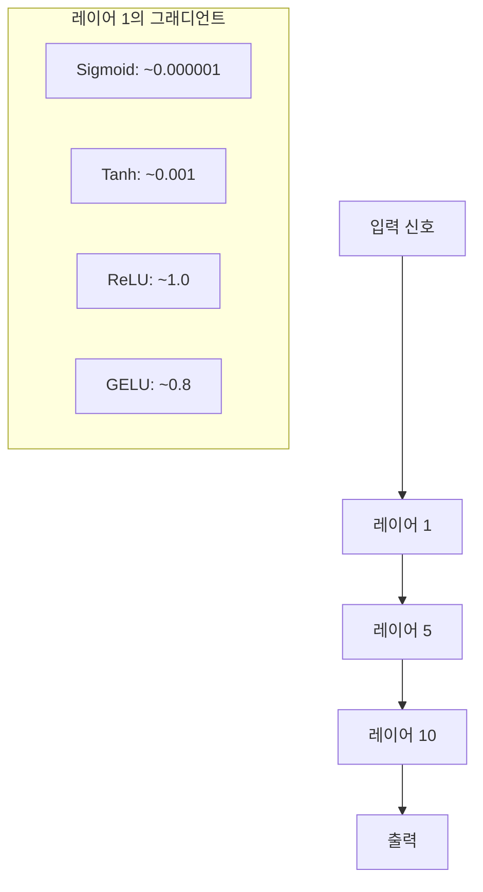
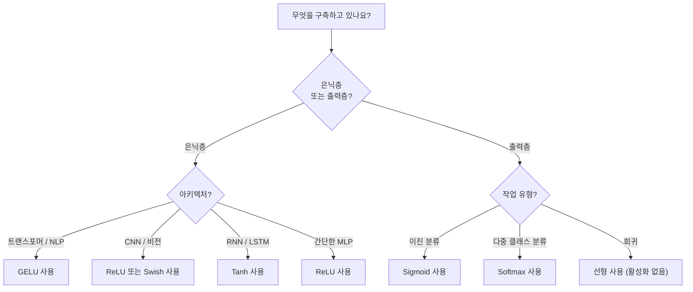

# 활성화 함수(Activation Functions)

> 비선형성이 없다면 100층 네트워크도 화려한 행렬 곱셈에 불과합니다. 활성화 함수는 신경망이 곡선 형태로 사고할 수 있게 하는 게이트입니다.

**유형:** Build  
**언어:** Python  
**선수 지식:** Lesson 03.03 (역전파(Backpropagation))  
**소요 시간:** ~75분

## 학습 목표

- 시그모이드(sigmoid), 하이퍼볼릭 탄젠트(tanh), ReLU(Rectified Linear Unit), 리키 ReLU(Leaky ReLU), GELU(Gaussian Error Linear Unit), Swish, 소프트맥스(softmax) 및 그 도함수를 처음부터 구현
- 다양한 활성화 함수를 사용하여 10개 이상의 레이어를 통과하며 활성화 크기를 측정하여 소실 기울기(vanishing gradient) 문제 진단
- ReLU 네트워크에서 죽은 뉴런(dead neurons) 감지 및 GELU가 이러한 실패 모드를 피하는 이유 설명
- 주어진 아키텍처(트랜스포머(transformer), CNN, RNN, 출력 레이어)에 적합한 활성화 함수 선택

## 문제

두 개의 선형 변환을 쌓아보자: y = W2(W1x + b1) + b2. 이를 전개하면 y = W2W1x + W2b1 + b2가 된다. 이는 단순히 y = Ax + c — 단일 선형 변환과 동일하다. 아무리 많은 선형 레이어를 쌓아도 결과는 하나의 행렬 곱셈으로 축소된다. 100층 네트워크는 단일 레이어와 동일한 표현 능력만 가진다.

이는 단순한 이론적 호기심이 아니다. 깊은 선형 네트워크는 XOR 문제를 학습할 수 없고, 나선형 데이터셋을 분류할 수 없으며, 얼굴을 인식할 수도 없다는 것을 의미한다. 활성화 함수(activation function)가 없다면 깊이는 환상에 불과하다.

활성화 함수는 선형성을 깨뜨린다. 각 레이어의 출력을 비선형 함수를 통해 왜곡시켜, 네트워크가 결정 경계를 구부리고 임의의 함수를 근사하며 실제로 학습할 수 있는 능력을 부여한다. 하지만 잘못된 활성화 함수를 선택하면 기울기가 0으로 소멸하거나(시그모이드 함수를 깊은 네트워크에 사용), 무한대로 발산하거나(제한 없는 활성화 함수와 신중한 초기화 없이 사용), 뉴런이 영구적으로 죽을 수 있다(큰 음의 편향이 있는 ReLU). 활성화 함수의 선택은 네트워크가 학습할지 여부를 직접적으로 결정한다.

## 개념

### 비선형성이 필요한 이유

행렬 곱셈은 조합 가능합니다. 벡터에 행렬 A를 곱한 후 행렬 B를 곱하는 것은 AB를 곱하는 것과 동일합니다. 이는 10개의 선형 레이어를 쌓는 것이 하나의 큰 행렬을 사용하는 단일 선형 레이어와 수학적으로 동등함을 의미합니다. 모든 파라미터, 모든 깊이 — 낭비됩니다. 체인을 끊을 무언가가 필요합니다. 활성화 함수가 바로 그 역할을 합니다.

증명은 다음과 같습니다. 선형 레이어는 f(x) = Wx + b를 계산합니다. 두 개를 쌓으면:

```
레이어 1: h = W1 * x + b1
레이어 2: y = W2 * h + b2
```

대입하면:

```
y = W2 * (W1 * x + b1) + b2
y = (W2 * W1) * x + (W2 * b1 + b2)
y = A * x + c
```

단일 레이어입니다. 레이어 사이에 비선형 활성화 함수 g()를 삽입하면:

```
h = g(W1 * x + b1)
y = W2 * h + b2
```

이제 대입이 불가능합니다. W2 * g(W1 * x + b1) + b2는 단일 선형 변환으로 축소할 수 없습니다. 네트워크는 비선형 함수를 표현할 수 있습니다. 활성화 함수가 있는 추가 레이어마다 표현 능력이 증가합니다.

### 시그모이드

신경망 최초의 활성화 함수입니다.

```
sigmoid(x) = 1 / (1 + e^(-x))
```

출력 범위: (0, 1). 매끄럽고 미분 가능하며, 모든 실수를 확률 유사 값으로 매핑합니다.

도함수는 다음과 같습니다:

```
sigmoid'(x) = sigmoid(x) * (1 - sigmoid(x))
```

이 도함수의 최대값은 0.25이며 x = 0에서 발생합니다. 역전파에서 그래디언트는 레이어를 통과하며 곱해집니다. 시그모이드 10개 레이어는 그래디언트가 최대 0.25를 10번 곱하게 됩니다:

```
0.25^10 = 0.000000953674
```

원래 신호의 백만 분의 1 미만입니다. 이는 소실 그래디언트 문제입니다. 초기 레이어의 그래디언트가 너무 작아져 가중치가 거의 업데이트되지 않습니다. 네트워크는 학습하는 것처럼 보이지만 — 후반 레이어에서 손실이 감소하지만 — 첫 레이어는 고정됩니다. 깊은 시그모이드 네트워크는 훈련되지 않습니다.

추가 문제: 시그모이드 출력은 항상 양수(0~1)이므로 가중치의 그래디언트 부호가 항상 같습니다. 이는 경사 하강법 중 지그재그를 유발합니다.

### 하이퍼볼릭 탄젠트(Tanh)

시그모이드의 중심화된 버전입니다.

```
tanh(x) = (e^x - e^(-x)) / (e^x + e^(-x))
```

출력 범위: (-1, 1). 0 중심화되어 지그재그 문제를 해결합니다.

도함수는 다음과 같습니다:

```
tanh'(x) = 1 - tanh(x)^2
```

최대 도함수는 x = 0에서 1.0입니다 — 시그모이드보다 4배 우수합니다. 하지만 소실 그래디언트 문제는 여전히 존재합니다. 큰 양수 또는 음수 입력에 대해 도함수는 0에 가까워집니다. 10개 레이어는 여전히 그래디언트를 약화시키지만 덜 공격적입니다.

### ReLU: 획기적인 발전

Rectified Linear Unit. 2010년 Nair와 Hinton에 의해 딥러닝에 대중화되었으며(함수 자체는 Fukushima의 1969년 연구에서 유래), 모든 것을 바꿨습니다.

```
relu(x) = max(0, x)
```

출력 범위: [0, 무한대). 도함수는 매우 간단합니다:

```
relu'(x) = 1  if x > 0
            0  if x <= 0
```

양수 입력에 대해 소실 그래디언트가 없습니다. 그래디언트는 정확히 1로 그대로 전달됩니다. 이것이 깊은 네트워크가 훈련 가능해진 이유입니다 — ReLU는 레이어를 통과하는 그래디언트 크기를 보존합니다.

하지만 실패 모드가 있습니다: 죽은 뉴런 문제입니다. 뉴런의 가중치 입력이 항상 음수라면(큰 음수 편향 또는 불운한 가중치 초기화 때문에), 출력은 항상 0이고 그래디언트도 항상 0이며 업데이트되지 않습니다. 영구적으로 죽은 것입니다. 실제로 ReLU 네트워크에서 10~40%의 뉴런이 훈련 중 죽을 수 있습니다.

### 리키 ReLU

죽은 뉴런 문제에 대한 가장 간단한 해결책입니다.

```
leaky_relu(x) = x        if x > 0
                alpha * x if x <= 0
```

여기서 alpha는 일반적으로 0.01인 작은 상수입니다. 음수 측에 0 대신 작은 기울기를 주어 죽은 뉴런도 그래디언트 신호를 받아 복구할 수 있습니다.

### GELU: 현대적인 기본값

Gaussian Error Linear Unit. 2016년 Hendrycks와 Gimpel이 제안했습니다. BERT, GPT 및 대부분의 현대 트랜스포머의 기본 활성화 함수입니다.

```
gelu(x) = x * Phi(x)
```

여기서 Phi(x)는 표준 정규 분포의 누적 분포 함수입니다. 실제로 사용되는 근사식:

```
gelu(x) ~= 0.5 * x * (1 + tanh(sqrt(2/pi) * (x + 0.044715 * x^3)))
```

GELU는 모든 곳에서 매끄럽고, 작은 음수 값을 허용하며(ReLU는 0으로 강제 클리핑), 확률적 해석을 제공합니다: 가우시안 분포 하에서 입력이 양수일 가능성에 따라 가중치를 부여합니다. 이 부드러운 게이팅은 트랜스포머 아키텍처에서 ReLU보다 우수한 그래디언트 흐름을 제공하고 죽은 뉴런 문제를 완전히 피합니다.

### Swish / SiLU

2017년 Ramachandran 등이 자동 탐색을 통해 발견한 자기 게이팅 활성화 함수입니다.

```
swish(x) = x * sigmoid(x)
```

Swish는 공식적으로 x * sigmoid(x)입니다. Google은 활성화 함수 공간에 대한 자동 탐색을 통해 발견했습니다 — 신경망이 신경망의 일부를 설계하는 것입니다.

GELU와 마찬가지로 매끄럽고 비단조적이며 작은 음수 값을 허용합니다. 차이는 미묘합니다: Swish는 게이팅에 시그모이드를 사용하고 GELU는 가우시안 CDF를 사용합니다. 실제로 성능은 거의 동일합니다. Swish는 EfficientNet 및 일부 비전 모델에서 사용됩니다. GELU는 언어 모델에서 우세합니다.

### 소프트맥스: 출력 활성화 함수

은닉층에는 사용되지 않습니다. 소프트맥스는 원시 점수(로짓) 벡터를 확률 분포로 변환합니다.

```
softmax(x_i) = e^(x_i) / sum(e^(x_j) for all j)
```

모든 출력은 0과 1 사이입니다. 모든 출력의 합은 1입니다. 이는 다중 클래스 분류를 위한 표준 최종 활성화 함수입니다. 가장 큰 로짓이 가장 높은 확률을 얻지만, argmax와 달리 소프트맥스는 미분 가능하며 상대적 신뢰도 정보를 보존합니다.

### 형태 비교



### 그래디언트 흐름 비교



### 어떤 활성화 함수를 사용할까



## 구축 단계

### 단계 1: 도함수 포함 모든 활성화 함수 구현

각 함수는 단일 float를 입력으로 받아 float를 반환합니다. 각 도함수 함수는 동일한 입력을 받아 기울기(gradient)를 반환합니다.

```python
import math

def sigmoid(x):
    x = max(-500, min(500, x))
    return 1.0 / (1.0 + math.exp(-x))

def sigmoid_derivative(x):
    s = sigmoid(x)
    return s * (1 - s)

def tanh_act(x):
    return math.tanh(x)

def tanh_derivative(x):
    t = math.tanh(x)
    return 1 - t * t

def relu(x):
    return max(0.0, x)

def relu_derivative(x):
    return 1.0 if x > 0 else 0.0

def leaky_relu(x, alpha=0.01):
    return x if x > 0 else alpha * x

def leaky_relu_derivative(x, alpha=0.01):
    return 1.0 if x > 0 else alpha

def gelu(x):
    return 0.5 * x * (1 + math.tanh(math.sqrt(2 / math.pi) * (x + 0.044715 * x ** 3)))

def gelu_derivative(x):
    phi = 0.5 * (1 + math.erf(x / math.sqrt(2)))
    pdf = math.exp(-0.5 * x * x) / math.sqrt(2 * math.pi)
    return phi + x * pdf

def swish(x):
    return x * sigmoid(x)

def swish_derivative(x):
    s = sigmoid(x)
    return s + x * s * (1 - s)

def softmax(xs):
    max_x = max(xs)
    exps = [math.exp(x - max_x) for x in xs]
    total = sum(exps)
    return [e / total for e in exps]
```

### 단계 2: 기울기 소멸 영역 시각화

-5에서 5까지 100개의 균일한 지점에서 기울기(gradient)를 계산합니다. 각 활성화 함수의 기울기가 0에 가까운 영역을 텍스트 히스토그램으로 표시합니다.

```python
def gradient_scan(name, derivative_fn, start=-5, end=5, n=100):
    step = (end - start) / n
    near_zero = 0
    healthy = 0
    for i in range(n):
        x = start + i * step
        g = derivative_fn(x)
        if abs(g) < 0.01:
            near_zero += 1
        else:
            healthy += 1
    pct_dead = near_zero / n * 100
    print(f"{name:15s}: {healthy:3d} healthy, {near_zero:3d} near-zero ({pct_dead:.0f}% dead zone)")

gradient_scan("Sigmoid", sigmoid_derivative)
gradient_scan("Tanh", tanh_derivative)
gradient_scan("ReLU", relu_derivative)
gradient_scan("Leaky ReLU", leaky_relu_derivative)
gradient_scan("GELU", gelu_derivative)
gradient_scan("Swish", swish_derivative)
```

### 단계 3: 기울기 소멸 실험

시그모이드(sigmoid) vs ReLU를 사용하여 N개의 레이어를 통해 신호를 순전파합니다. 활성화 크기가 어떻게 변하는지 측정합니다.

```python
import random

def vanishing_gradient_experiment(activation_fn, name, n_layers=10, n_inputs=5):
    random.seed(42)
    values = [random.gauss(0, 1) for _ in range(n_inputs)]

    print(f"\n{name} through {n_layers} layers:")
    for layer in range(n_layers):
        weights = [random.gauss(0, 1) for _ in range(n_inputs)]
        z = sum(w * v for w, v in zip(weights, values))
        activated = activation_fn(z)
        magnitude = abs(activated)
        bar = "#" * int(magnitude * 20)
        print(f"  Layer {layer+1:2d}: magnitude = {magnitude:.6f} {bar}")
        values = [activated] * n_inputs

vanishing_gradient_experiment(sigmoid, "Sigmoid")
vanishing_gradient_experiment(relu, "ReLU")
vanishing_gradient_experiment(gelu, "GELU")
```

### 단계 4: 죽은 뉴런 감지기

ReLU 네트워크를 생성하고 무작위 입력을 통과시켜 어떤 뉴런이 절대 활성화되지 않는지 카운트합니다.

```python
def dead_neuron_detector(n_inputs=5, hidden_size=20, n_samples=1000):
    random.seed(0)
    weights = [[random.gauss(0, 1) for _ in range(n_inputs)] for _ in range(hidden_size)]
    biases = [random.gauss(0, 1) for _ in range(hidden_size)]

    fire_counts = [0] * hidden_size

    for _ in range(n_samples):
        inputs = [random.gauss(0, 1) for _ in range(n_inputs)]
        for neuron_idx in range(hidden_size):
            z = sum(w * x for w, x in zip(weights[neuron_idx], inputs)) + biases[neuron_idx]
            if relu(z) > 0:
                fire_counts[neuron_idx] += 1

    dead = sum(1 for c in fire_counts if c == 0)
    rarely_fire = sum(1 for c in fire_counts if 0 < c < n_samples * 0.05)
    healthy = hidden_size - dead - rarely_fire

    print(f"\nDead Neuron Report ({hidden_size} neurons, {n_samples} samples):")
    print(f"  Dead (never fired):     {dead}")
    print(f"  Barely alive (<5%):     {rarely_fire}")
    print(f"  Healthy:                {healthy}")
    print(f"  Dead neuron rate:       {dead/hidden_size*100:.1f}%")

    for i, c in enumerate(fire_counts):
        status = "DEAD" if c == 0 else "WEAK" if c < n_samples * 0.05 else "OK"
        bar = "#" * (c * 40 // n_samples)
        print(f"  Neuron {i:2d}: {c:4d}/{n_samples} fires [{status:4s}] {bar}")

dead_neuron_detector()
```

### 단계 5: 훈련 비교 - 시그모이드 vs ReLU vs GELU

동일한 2계층 네트워크를 원 데이터 세트(원 내부 점 = 클래스 1, 외부 = 클래스 0)에 대해 세 가지 다른 활성화 함수로 훈련시킵니다. 수렴 속도를 비교합니다.

```python
def make_circle_data(n=200, seed=42):
    random.seed(seed)
    data = []
    for _ in range(n):
        x = random.uniform(-2, 2)
        y = random.uniform(-2, 2)
        label = 1.0 if x * x + y * y < 1.5 else 0.0
        data.append(([x, y], label))
    return data


class ActivationNetwork:
    def __init__(self, activation_fn, activation_deriv, hidden_size=8, lr=0.1):
        random.seed(0)
        self.act = activation_fn
        self.act_d = activation_deriv
        self.lr = lr
        self.hidden_size = hidden_size

        self.w1 = [[random.gauss(0, 0.5) for _ in range(2)] for _ in range(hidden_size)]
        self.b1 = [0.0] * hidden_size
        self.w2 = [random.gauss(0, 0.5) for _ in range(hidden_size)]
        self.b2 = 0.0

    def forward(self, x):
        self.x = x
        self.z1 = []
        self.h = []
        for i in range(self.hidden_size):
            z = self.w1[i][0] * x[0] + self.w1[i][1] * x[1] + self.b1[i]
            self.z1.append(z)
            self.h.append(self.act(z))

        self.z2 = sum(self.w2[i] * self.h[i] for i in range(self.hidden_size)) + self.b2
        self.out = sigmoid(self.z2)
        return self.out

    def backward(self, target):
        error = self.out - target
        d_out = error * self.out * (1 - self.out)

        for i in range(self.hidden_size):
            d_h = d_out * self.w2[i] * self.act_d(self.z1[i])
            self.w2[i] -= self.lr * d_out * self.h[i]
            for j in range(2):
                self.w1[i][j] -= self.lr * d_h * self.x[j]
            self.b1[i] -= self.lr * d_h
        self.b2 -= self.lr * d_out

    def train(self, data, epochs=200):
        losses = []
        for epoch in range(epochs):
            total_loss = 0
            correct = 0
            for x, y in data:
                pred = self.forward(x)
                self.backward(y)
                total_loss += (pred - y) ** 2
                if (pred >= 0.5) == (y >= 0.5):
                    correct += 1
            avg_loss = total_loss / len(data)
            accuracy = correct / len(data) * 100
            losses.append(avg_loss)
            if epoch % 50 == 0 or epoch == epochs - 1:
                print(f"    Epoch {epoch:3d}: loss={avg_loss:.4f}, accuracy={accuracy:.1f}%")
        return losses


data = make_circle_data()

configs = [
    ("Sigmoid", sigmoid, sigmoid_derivative),
    ("ReLU", relu, relu_derivative),
    ("GELU", gelu, gelu_derivative),
]

results = {}
for name, act_fn, act_d_fn in configs:
    print(f"\n=== Training with {name} ===")
    net = ActivationNetwork(act_fn, act_d_fn, hidden_size=8, lr=0.1)
    losses = net.train(data, epochs=200)
    results[name] = losses

print("\n=== Final Loss Comparison ===")
for name, losses in results.items():
    print(f"  {name:10s}: start={losses[0]:.4f} -> end={losses[-1]:.4f} (improvement: {(1 - losses[-1]/losses[0])*100:.1f}%)")
```

## 사용 방법

PyTorch는 다음 기능들을 함수형(functional)과 모듈(module) 형태로 모두 제공합니다:

```python
import torch
import torch.nn as nn
import torch.nn.functional as F

x = torch.randn(4, 10)

relu_out = F.relu(x)
gelu_out = F.gelu(x)
sigmoid_out = torch.sigmoid(x)
swish_out = F.silu(x)

logits = torch.randn(4, 5)
probs = F.softmax(logits, dim=1)

model = nn.Sequential(
    nn.Linear(10, 64),
    nn.GELU(),
    nn.Linear(64, 32),
    nn.GELU(),
    nn.Linear(32, 5),
)
```

트랜스포머의 은닉층: GELU. CNN의 은닉층: ReLU. 분류 작업의 출력층: 소프트맥스(softmax). 회귀 작업의 출력층: 없음(선형). 확률 출력층: 시그모이드(sigmoid). 기본값부터 시작하세요. 확실한 근거가 있을 때만 변경하세요.

RNN과 LSTM은 은닉 상태에 tanh를, 게이트에 시그모이드를 사용하지만, 오늘날 새로 구축한다면 RNN을 사용하지 않을 가능성이 높습니다. ReLU 네트워크에서 뉴런이 죽는다면 GELU로 전환하세요. 특별한 이유가 없다면 Leaky ReLU를 선택하지 마세요. GELU는 죽은 뉴런 문제를 해결하면서 더 나은 그래디언트 흐름을 제공합니다.

## Ship It

이 레슨은 다음을 생성합니다:
- `outputs/prompt-activation-selector.md` -- 어떤 아키텍처에든 적합한 활성화 함수(activation function)를 선택하는 데 도움이 되는 재사용 가능한 프롬프트(prompt)

## 연습 문제

1. 음수 기울기(alpha)가 학습 가능한 파라미터인 Parametric ReLU (PReLU)를 구현하세요. 원(circle) 데이터셋에서 훈련하고 고정된 Leaky ReLU와 비교하세요.

2. 10개 대신 50개 레이어로 소실 기울기(vanishing gradient) 실험을 실행하세요. 시그모이드(sigmoid), 탄젠트 하이퍼볼릭(tanh), ReLU, GELU에 대해 각 레이어에서의 기울기 크기를 플롯하세요. 각 활성화 함수의 신호가 어느 레이어에서 효과적으로 0에 도달하나요?

3. ELU(Exponential Linear Unit)를 구현하세요:  
   - `elu(x) = x` (if `x > 0`)  
   - `elu(x) = alpha * (e^x - 1)` (if `x <= 0`)  
   동일한 네트워크에서 ReLU와 비교하여 죽은 뉴런(dead neuron) 비율을 분석하세요.

4. 훈련 중에 실행되는 "기울기 건강 모니터"를 구축하세요:  
   - 각 에포크마다 각 레이어의 평균 기울기 크기를 계산합니다.  
   - 어떤 레이어의 기울기가 0.001 미만으로 떨어지거나 100을 초과할 때 경고를 출력하세요.

5. 훈련 비교를 수정하여 원(circle) 대신 레슨 01의 XOR 데이터셋을 사용하세요. XOR에서 어떤 활성화 함수가 가장 빠르게 수렴하나요? 왜 이 결과가 원 데이터셋 결과와 다른가요?

## 주요 용어

| 용어 | 사람들이 말하는 것 | 실제 의미 |
|------|----------------|----------------------|
| 활성화 함수(activation function) | "비선형 부분" | 각 뉴런의 출력에 적용되는 함수로, 선형성을 깨뜨려 네트워크가 비선형 매핑을 학습할 수 있게 함 |
| 소실 기울기(vanishing gradient) | "깊은 네트워크에서 기울기가 사라짐" | 활성화 함수의 도함수가 1보다 작을 때 기울기가 층을 통과하며 기하급수적으로 축소되어 초기 층이 학습되지 않음 |
| 폭발 기울기(exploding gradient) | "기울기가 폭발함" | 유효 승수가 1을 초과할 때 기울기가 층을 통과하며 기하급수적으로 증가하여 불안정한 학습 발생 |
| 죽은 뉴런(dead neuron) | "학습을 멈춘 뉴런" | 입력이 영구적으로 음수인 ReLU 뉴런으로, 출력과 기울기가 0이 됨 |
| 시그모이드(sigmoid) | "값을 0-1로 압축" | 로지스틱 함수 1/(1+e^-x), 역사적으로 중요하지만 깊은 네트워크에서 소실 기울기 문제 유발 |
| ReLU | "음수를 0으로 클리핑" | max(0, x) -- 기울기 크기를 보존하여 딥러닝을 실용적으로 만든 활성화 함수 |
| GELU | "트랜스포머 활성화 함수" | 가우시안 오차 선형 유닛(Gaussian Error Linear Unit), 입력을 양수일 확률에 따라 가중하는 부드러운 활성화 함수 |
| Swish/SiLU | "자기 게이팅 ReLU" | x * sigmoid(x), 자동화된 탐색을 통해 발견되었으며 EfficientNet에서 사용 |
| 소프트맥스(softmax) | "점수를 확률로 변환" | 로짓 벡터를 (0,1) 범위의 확률 분포로 정규화하며 모든 값의 합이 1이 됨 |
| 리키 ReLU(leaky ReLU) | "죽지 않는 ReLU" | max(alpha*x, x) (alpha는 0.01과 같이 작음), 작은 음수 기울기를 허용하여 죽은 뉴런 방지 |
| 포화(saturation) | "시그모이드의 평탄한 부분" | 활성화 함수의 도함수가 0에 가까워지는 영역으로, 기울기 흐름 차단 |
| 로짓(logit) | "소프트맥스 이전의 원시 점수" | 소프트맥스 또는 시그모이드 적용 전 최종 층의 정규화되지 않은 출력

## 추가 자료

- Nair & Hinton, "Rectified Linear Units Improve Restricted Boltzmann Machines" (2010) -- ReLU(ReLU)를 소개하고 심층 신경망 학습을 가능하게 한 논문
- Hendrycks & Gimpel, "Gaussian Error Linear Units (GELUs)" (2016) -- 트랜스포머(Transformer)의 기본 활성화 함수가 된 GELU(GELU)를 소개한 논문
- Ramachandran et al., "Searching for Activation Functions" (2017) -- 자동화된 탐색을 통해 Swish(Swish)를 발견하고, 활성화 함수 설계가 자동화될 수 있음을 보여준 연구
- Glorot & Bengio, "Understanding the difficulty of training deep feedforward neural networks" (2010) -- 소실/폭발 기울기(vanishing/exploding gradients) 문제를 진단하고 Xavier 초기화(Xavier initialization)를 제안한 논문
- Goodfellow, Bengio, Courville, "Deep Learning" Chapter 6.3 (https://www.deeplearningbook.org/) -- 은닉 유닛(hidden units)과 활성화 함수(activation functions)에 대한 엄밀한 분석 제공