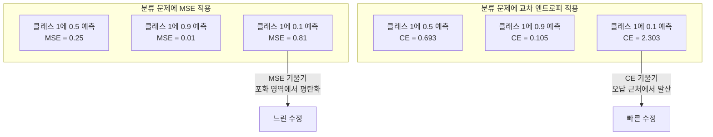
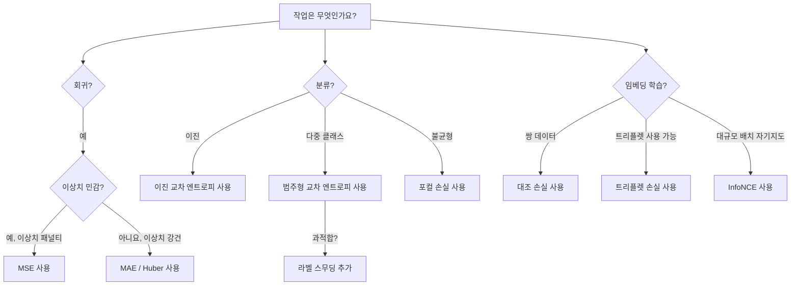
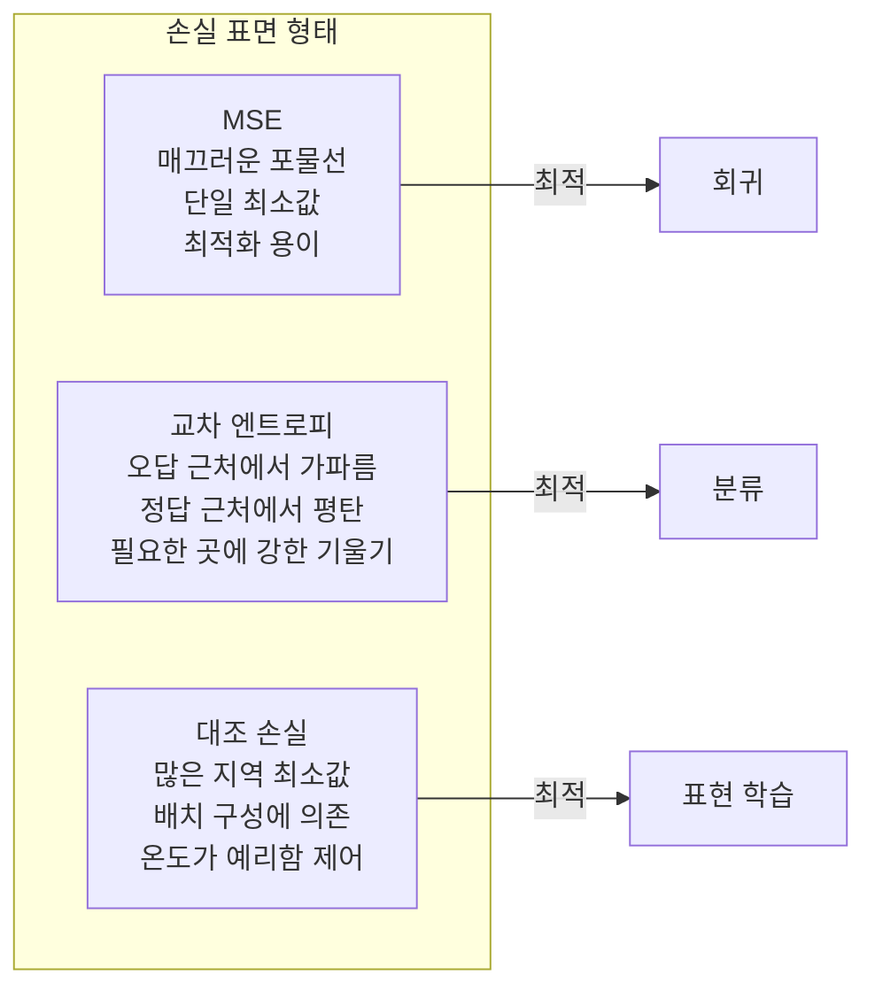

# 손실 함수(Loss Functions)

> 네트워크가 예측을 수행합니다. 실제 값(ground truth)은 다른 값을 나타냅니다. 얼마나 틀렸나요? 그 숫자가 손실(loss)입니다. 잘못된 손실 함수를 선택하면 모델이 완전히 잘못된 목표를 최적화하게 됩니다.

**유형:** Build  
**언어:** Python  
**선수 지식:** 레슨 03.04 (활성화 함수(Activation Functions))  
**소요 시간:** ~75분

## 학습 목표

- MSE(평균 제곱 오차), 이진 교차 엔트로피, 범주형 교차 엔트로피, 대비 손실(InfoNCE)을 직접 구현하고 각각의 기울기(gradient) 계산
- "모든 것에 대해 0.5를 예측"하는 실패 모드를 통해 분류 문제에서 MSE가 실패하는 이유 설명
- 교차 엔트로피에 라벨 스무딩(label smoothing) 적용 및 과신 예측(overconfident predictions) 방지 방법 설명
- 회귀(regression), 이진 분류(binary classification), 다중 클래스 분류(multi-class classification), 임베딩 학습(embedding learning) 작업에 적합한 손실 함수 선택

## 문제

분류 문제에서 MSE(평균 제곱 오차)를 최소화하는 모델은 모든 입력에 대해 0.5를 자신 있게 예측합니다. 이는 손실 함수를 최소화하는 것이지만, 동시에 쓸모없습니다.

손실 함수는 모델이 실제로 최적화하는 유일한 요소입니다. 정확도, F1 점수, 관리자에게 보고하는 어떤 지표도 아닙니다. 옵티마이저는 손실 함수의 기울기(gradient)를 계산하고 가중치를 조정하여 해당 값을 줄입니다. 손실 함수가 관심 있는 사항을 포착하지 못하면, 모델은 수학적으로 가장 저렴한 방법을 찾아 이를 만족시킬 것입니다. 그리고 그 방법은 거의 항상 원하는 결과가 아닙니다.

구체적인 예시를 들어보겠습니다. 이진 분류 작업이 있고, 두 클래스가 50/50으로 분포되어 있습니다. 손실 함수로 MSE를 사용하면 모델은 모든 입력에 대해 0.5를 예측합니다. 평균 MSE는 0.25로, 실제로 아무것도 학습하지 않은 상태에서 가능한 최소값입니다. 이 모델은 판별 능력이 전혀 없지만, 기술적으로는 손실 함수를 최소화한 것입니다. 교차 엔트로피(cross-entropy)로 전환하면 동일한 모델이 예측을 0 또는 1로 밀어붙이게 됩니다. 왜냐하면 -log(0.5) = 0.693은 끔찍한 손실 값인 반면, -log(0.99) = 0.01은 자신 있는 정답 예측을 보상하기 때문입니다. 손실 함수 선택은 학습하는 모델과 지표를 조작하는 모델 사이의 차이를 만듭니다.

더 나쁜 경우도 있습니다. 자기 지도 학습(self-supervised learning)에서는 레이블이 없습니다. 대조 손실(contrastive loss)은 학습 신호를 완전히 정의합니다: 무엇이 유사한지, 무엇이 다른지, 그리고 모델이 이들을 얼마나 강하게 분리해야 하는지. 대조 손실을 잘못 설계하면 임베딩(embedding)이 단일 점으로 붕괴됩니다. 모든 입력이 동일한 벡터로 매핑되는 것입니다. 기술적으로는 손실이 0이지만, 완전히 쓸모없습니다.

## 개념

### 평균 제곱 오차(MSE, Mean Squared Error)

회귀의 기본 손실 함수. 예측과 실제 값의 제곱 차이를 계산하고 모든 샘플에 대해 평균을 구합니다.

```
MSE = (1/n) * sum((y_pred - y_true)^2)
```

제곱의 중요성: 큰 오차에 대해 2차적으로 패널티를 부과합니다. 오차 2는 오차 1보다 4배, 오차 10은 100배의 비용이 듭니다. 이로 인해 MSE는 이상치에 민감합니다. 단 하나의 크게 틀린 예측이 손실을 지배할 수 있습니다.

실제 사례: 모델이 대부분의 주택 가격을 $10,000 오차 범위 내에서 예측하지만 한 저택에 대해 $200,000 오차가 발생하면, MSE는 그 저택의 오차를 적극적으로 수정하려 하며, 이로 인해 나머지 99개 주택 예측 성능이 저하될 수 있습니다.

예측값에 대한 MSE의 기울기:

```
dMSE/dy_pred = (2/n) * (y_pred - y_true)
```

오차에 대해 선형적입니다. 큰 오차는 큰 기울기를 생성합니다. 이는 회귀 문제에서는 장점(큰 오차는 큰 수정이 필요)이지만, 분류 문제에서는 단점(확신하는 오답에 대해 지수적이 아닌 선형 패널티)입니다.

### 교차 엔트로피 손실(Cross-Entropy Loss)

분류 문제의 손실 함수. 정보 이론에 기반하며, 예측 확률 분포와 실제 분포 사이의 발산을 측정합니다.

**이진 교차 엔트로피(BCE, Binary Cross-Entropy):**

```
BCE = -(y * log(p) + (1 - y) * log(1 - p))
```

여기서 y는 실제 라벨(0 또는 1), p는 예측 확률입니다.

-log(p)의 작동 방식: 실제 라벨이 1이고 p = 0.99로 예측하면 손실은 -log(0.99) = 0.01입니다. p = 0.01로 예측하면 손실은 -log(0.01) = 4.6입니다. 이 460배 차이가 교차 엔트로피의 핵심입니다. 확신하는 오답에 대해 극심한 패널티를 부과하면서, 확신하는 정답에 대해서는 거의 패널티를 주지 않습니다.

기울기는 다음과 같습니다:

```
dBCE/dp = -(y/p) + (1-y)/(1-p)
```

y = 1이고 p가 0에 가까우면 기울기는 -1/p로 음의 무한대에 가까워집니다. 모델은 큰 신호를 받아 실수를 수정합니다. p가 1에 가까우면 기울기는 매우 작습니다. 이미 정확하므로 수정할 필요가 없습니다.

**범주형 교차 엔트로피(CCE, Categorical Cross-Entropy):**

원-핫 인코딩된 타겟을 사용하는 다중 클래스 분류를 위한 손실 함수입니다.

```
CCE = -sum(y_i * log(p_i))
```

실제 클래스만 손실에 기여합니다(다른 모든 y_i는 0이기 때문). 10개 클래스가 있고 정답 클래스의 확률이 0.1(무작위 추측)이면 손실은 -log(0.1) = 2.3입니다. 정답 클래스 확률이 0.9이면 손실은 -log(0.9) = 0.105입니다. 모델은 확률 질량을 정답에 집중하도록 학습합니다.

### 분류 문제에서 MSE가 실패하는 이유



MSE 기울기는 예측이 0 또는 1에 가까울 때 시그모이드 포화로 인해 평탄해집니다. 교차 엔트로피 기울기는 이를 보상합니다. -log가 시그모이드의 평탄한 영역을 상쇄하여, 가장 필요한 곳에서 강한 기울기를 제공합니다.

### 라벨 스무딩(Label Smoothing)

표준 원-핫 라벨은 "이것은 100% 클래스 3이고 다른 클래스는 0%"라고 주장합니다. 이는 강한 주장입니다. 라벨 스무딩은 이를 완화합니다:

```
smooth_label = (1 - alpha) * one_hot + alpha / num_classes
```

alpha = 0.1, 클래스 수 = 10인 경우: [0, 0, 1, 0, ...] 대신 [0.01, 0.01, 0.91, 0.01, ...]가 타겟이 됩니다. 모델은 1.0 대신 0.91을 목표로 합니다.

작동 원리: 소프트맥스를 통해 정확히 1.0을 출력하려는 모델은 로짓을 무한대로 밀어내야 합니다. 이는 과적합을 유발하고, 일반화 성능을 저하시키며, 분포 변화에 취약하게 만듭니다. 라벨 스무딩은 타겟을 0.9(alpha=0.1)로 제한하여 로짓을 합리적인 범위로 유지합니다. GPT와 대부분의 현대 모델은 라벨 스무딩 또는 그 변형을 사용합니다.

### 대조 손실(Contrastive Loss)

라벨이 없습니다. 클래스도 없습니다. 단지 입력 쌍과 "이것들이 유사한가 다른가?"라는 질문만 있습니다.

**SimCLR 스타일 대조 손실(NT-Xent / InfoNCE):**

하나의 이미지를 가져옵니다. 두 가지 증강된 뷰(크롭, 회전, 색상 왜곡)를 생성합니다. 이들은 "양성 쌍"이며, 유사한 임베딩을 가져야 합니다. 배치 내 다른 모든 이미지는 "음성 쌍"이며, 다른 임베딩을 가져야 합니다.

```
L = -log(exp(sim(z_i, z_j) / tau) / sum(exp(sim(z_i, z_k) / tau)))
```

여기서 sim()은 코사인 유사도, z_i와 z_j는 양성 쌍, 합은 모든 음성 쌍에 대해 계산되며, tau(온도)는 분포의 예리함을 제어합니다. 낮은 온도는 더 어려운 음성 샘플을 의미하며, 더 공격적인 분리를 유도합니다.

실제 사례: 배치 크기 256은 양성 쌍당 255개의 음성 샘플을 의미합니다. 온도 tau = 0.07(SimCLR 기본값). 손실은 유사도에 대한 소프트맥스처럼 작동합니다. 양성 쌍의 유사도가 256개 옵션 중 가장 높기를 원합니다.

**트리플렛 손실(Triplet Loss):**

앵커, 양성(동일 클래스), 음성(서로 다른 클래스) 세 입력을 사용합니다.

```
L = max(0, d(anchor, positive) - d(anchor, negative) + margin)
```

마진(일반적으로 0.2-1.0)은 양성과 음성 거리 사이의 최소 간격을 강제합니다. 음성이 이미 충분히 멀리 있으면 손실은 0입니다. 즉, 기울기와 업데이트가 없습니다. 이는 훈련 효율성을 높이지만, 앵커에 가까운 어려운 음성 샘플을 선택하는 신중한 트리플렛 마이닝이 필요합니다.

### 포컬 손실(Focal Loss)

불균형 데이터셋을 위한 손실 함수. 표준 교차 엔트로피는 모든 정확히 분류된 예제를 동일하게 취급합니다. 포컬 손실은 쉬운 예제를 약화시킵니다:

```
FL = -alpha * (1 - p_t)^gamma * log(p_t)
```

여기서 p_t는 실제 클래스의 예측 확률, gamma는 집중도를 제어합니다. gamma = 0이면 표준 교차 엔트로피입니다. gamma = 2(기본값)일 때:

- 쉬운 예제(p_t = 0.9): 가중치 = (0.1)^2 = 0.01. 효과적으로 무시됩니다.
- 어려운 예제(p_t = 0.1): 가중치 = (0.9)^2 = 0.81. 전체 기울기 신호가 유지됩니다.

포컬 손실은 Lin 등이 객체 감지를 위해 도입했습니다. 후보 영역의 99%가 배경(쉬운 음성)인 경우, 포컬 손실 없이는 모델이 쉬운 배경 예제에 압도되어 객체를 감지하지 못합니다. 포컬 손실을 사용하면 모델은 중요한 어렵고 애매한 사례에 용량을 집중합니다.

### 손실 함수 결정 트리



### 손실 함수 지형



## 구축 방법

### 1단계: MSE와 그 기울기

```python
def mse(predictions, targets):
    n = len(predictions)
    total = 0.0
    for p, t in zip(predictions, targets):
        total += (p - t) ** 2
    return total / n

def mse_gradient(predictions, targets):
    n = len(predictions)
    grads = []
    for p, t in zip(predictions, targets):
        grads.append(2.0 * (p - t) / n)
    return grads
```

### 2단계: 이진 교차 엔트로피

`log(0)` 문제는 실제로 발생합니다. 모델이 양성 예제에 대해 정확히 0을 예측하면 `log(0)`은 음의 무한대가 됩니다. 클리핑은 이를 방지합니다.

```python
import math

def binary_cross_entropy(predictions, targets, eps=1e-15):
    n = len(predictions)
    total = 0.0
    for p, t in zip(predictions, targets):
        p_clipped = max(eps, min(1 - eps, p))
        total += -(t * math.log(p_clipped) + (1 - t) * math.log(1 - p_clipped))
    return total / n

def bce_gradient(predictions, targets, eps=1e-15):
    grads = []
    for p, t in zip(predictions, targets):
        p_clipped = max(eps, min(1 - eps, p))
        grads.append(-(t / p_clipped) + (1 - t) / (1 - p_clipped))
    return grads
```

### 3단계: 소프트맥스를 사용한 범주형 교차 엔트로피

소프트맥스는 원시 로짓을 확률로 변환합니다. 그런 다음 원-핫 타겟에 대한 교차 엔트로피를 계산합니다.

```python
def softmax(logits):
    max_val = max(logits)
    exps = [math.exp(x - max_val) for x in logits]
    total = sum(exps)
    return [e / total for e in exps]

def categorical_cross_entropy(logits, target_index, eps=1e-15):
    probs = softmax(logits)
    p = max(eps, probs[target_index])
    return -math.log(p)

def cce_gradient(logits, target_index):
    probs = softmax(logits)
    grads = list(probs)
    grads[target_index] -= 1.0
    return grads
```

소프트맥스 + 교차 엔트로피의 기울기는 아름답게 단순화됩니다: 참 클래스에 대해서는 (예측 확률 - 1), 다른 모든 클래스에 대해서는 (예측 확률)입니다. 이 우아한 단순화는 우연이 아닙니다. 소프트맥스와 교차 엔트로피가 짝을 이루는 이유입니다.

### 4단계: 라벨 스무딩

```python
def label_smoothed_cce(logits, target_index, num_classes, alpha=0.1, eps=1e-15):
    probs = softmax(logits)
    loss = 0.0
    for i in range(num_classes):
        if i == target_index:
            smooth_target = 1.0 - alpha + alpha / num_classes
        else:
            smooth_target = alpha / num_classes
        p = max(eps, probs[i])
        loss += -smooth_target * math.log(p)
    return loss
```

### 5단계: 대조 손실(단순화된 InfoNCE)

```python
def cosine_similarity(a, b):
    dot = sum(x * y for x, y in zip(a, b))
    norm_a = math.sqrt(sum(x * x for x in a))
    norm_b = math.sqrt(sum(x * x for x in b))
    if norm_a < 1e-10 or norm_b < 1e-10:
        return 0.0
    return dot / (norm_a * norm_b)

def contrastive_loss(anchor, positive, negatives, temperature=0.07):
    sim_pos = cosine_similarity(anchor, positive) / temperature
    sim_negs = [cosine_similarity(anchor, neg) / temperature for neg in negatives]

    max_sim = max(sim_pos, max(sim_negs)) if sim_negs else sim_pos
    exp_pos = math.exp(sim_pos - max_sim)
    exp_negs = [math.exp(s - max_sim) for s in sim_negs]
    total_exp = exp_pos + sum(exp_negs)

    return -math.log(max(1e-15, exp_pos / total_exp))
```

### 6단계: 분류에서 MSE vs 교차 엔트로피

레슨 04의 동일한 네트워크(원 데이터셋)를 두 손실 함수로 훈련시켜 보세요. 교차 엔트로피가 더 빠르게 수렴하는 것을 확인할 수 있습니다.

```python
import random

def sigmoid(x):
    x = max(-500, min(500, x))
    return 1.0 / (1.0 + math.exp(-x))

def make_circle_data(n=200, seed=42):
    random.seed(seed)
    data = []
    for _ in range(n):
        x = random.uniform(-2, 2)
        y = random.uniform(-2, 2)
        label = 1.0 if x * x + y * y < 1.5 else 0.0
        data.append(([x, y], label))
    return data


class LossComparisonNetwork:
    def __init__(self, loss_type="bce", hidden_size=8, lr=0.1):
        random.seed(0)
        self.loss_type = loss_type
        self.lr = lr
        self.hidden_size = hidden_size

        self.w1 = [[random.gauss(0, 0.5) for _ in range(2)] for _ in range(hidden_size)]
        self.b1 = [0.0] * hidden_size
        self.w2 = [random.gauss(0, 0.5) for _ in range(hidden_size)]
        self.b2 = 0.0

    def forward(self, x):
        self.x = x
        self.z1 = []
        self.h = []
        for i in range(self.hidden_size):
            z = self.w1[i][0] * x[0] + self.w1[i][1] * x[1] + self.b1[i]
            self.z1.append(z)
            self.h.append(max(0.0, z))

        self.z2 = sum(self.w2[i] * self.h[i] for i in range(self.hidden_size)) + self.b2
        self.out = sigmoid(self.z2)
        return self.out

    def backward(self, target):
        if self.loss_type == "mse":
            d_loss = 2.0 * (self.out - target)
        else:
            eps = 1e-15
            p = max(eps, min(1 - eps, self.out))
            d_loss = -(target / p) + (1 - target) / (1 - p)

        d_sigmoid = self.out * (1 - self.out)
        d_out = d_loss * d_sigmoid

        for i in range(self.hidden_size):
            d_relu = 1.0 if self.z1[i] > 0 else 0.0
            d_h = d_out * self.w2[i] * d_relu
            self.w2[i] -= self.lr * d_out * self.h[i]
            for j in range(2):
                self.w1[i][j] -= self.lr * d_h * self.x[j]
            self.b1[i] -= self.lr * d_h
        self.b2 -= self.lr * d_out

    def compute_loss(self, pred, target):
        if self.loss_type == "mse":
            return (pred - target) ** 2
        else:
            eps = 1e-15
            p = max(eps, min(1 - eps, pred))
            return -(target * math.log(p) + (1 - target) * math.log(1 - p))

    def train(self, data, epochs=200):
        losses = []
        for epoch in range(epochs):
            total_loss = 0.0
            correct = 0
            for x, y in data:
                pred = self.forward(x)
                self.backward(y)
                total_loss += self.compute_loss(pred, y)
                if (pred >= 0.5) == (y >= 0.5):
                    correct += 1
            avg_loss = total_loss / len(data)
            accuracy = correct / len(data) * 100
            losses.append((avg_loss, accuracy))
            if epoch % 50 == 0 or epoch == epochs - 1:
                print(f"    Epoch {epoch:3d}: loss={avg_loss:.4f}, accuracy={accuracy:.1f}%")
        return losses
```

## 사용 방법

PyTorch는 수치적 안정성이 내장된 모든 표준 손실 함수를 제공합니다:

```python
import torch
import torch.nn as nn
import torch.nn.functional as F

predictions = torch.tensor([0.9, 0.1, 0.7], requires_grad=True)
targets = torch.tensor([1.0, 0.0, 1.0])

mse_loss = F.mse_loss(predictions, targets)
bce_loss = F.binary_cross_entropy(predictions, targets)

logits = torch.randn(4, 10)
labels = torch.tensor([3, 7, 1, 9])
ce_loss = F.cross_entropy(logits, labels)
ce_smooth = F.cross_entropy(logits, labels, label_smoothing=0.1)
```

`F.cross_entropy`(F.nll_loss에 수동 소프트맥스 추가가 아님)를 사용하세요. 이는 로그-소프트맥스와 음의 로그 우도를 하나의 수치적으로 안정적인 연산으로 결합합니다. 소프트맥스를 별도로 적용한 후 로그를 취하는 것은 덜 안정적입니다. 큰 지수 값의 뺄셈에서 정밀도를 잃게 됩니다.

대조 학습(contrastive learning)의 경우, 대부분의 팀은 `lightly` 또는 `pytorch-metric-learning`과 같은 커스텀 구현이나 라이브러리를 사용합니다. 핵심 루프는 항상 동일합니다: 쌍별 유사도 계산, 긍정 및 부정 샘플에 대한 소프트맥스 생성, 역전파(backpropagation) 수행.

## Ship It

이 레슨은 다음을 생성합니다:
- `outputs/prompt-loss-function-selector.md` -- 적절한 손실 함수(loss function) 선택을 위한 재사용 가능한 프롬프트(prompt)
- `outputs/prompt-loss-debugger.md` -- 손실 곡선(loss curve)이 이상하게 보일 때 사용하는 진단용 프롬프트(prompt)

## 연습 문제

1. 작은 오차에 대해서는 MSE(평균 제곱 오차), 큰 오차에 대해서는 MAE(평균 절대 오차)를 사용하는 Huber 손실(smooth L1 loss)을 구현하세요. 훈련 타겟의 5%에 무작위 노이즈(이상치)가 추가된 상태에서 MSE와 Huber 손실을 비교하여 y = sin(x)를 예측하는 회귀 네트워크를 학습시키세요. 최종 테스트 오차를 비교하세요.

2. 이진 분류 훈련 루프에 포컬 손실(focal loss)을 추가하세요. 불균형 데이터셋(클래스 0 90%, 클래스 1 10%)을 생성하세요. 200 에포크 후 소수 클래스 재현율(recall)에서 표준 BCE(이진 교차 엔트로피)와 포컬 손실(gamma=2)을 비교하세요.

3. 반-하드 네거티브 마이닝(semi-hard negative mining)을 사용한 트리플렛 손실(triplet loss)을 구현하세요. 5개 클래스를 위한 2D 임베딩 데이터를 생성하세요. 각 앵커(anchor)에 대해 포지티브(positive)보다 멀지만 가장 가까운 네거티브(semi-hard)를 찾으세요. 무작위 트리플렛 선택과 수렴 속도를 비교하세요.

4. MSE와 교차 엔트로피(cross-entropy) 비교를 실행하되, 훈련 중 각 레이어의 그래디언트 크기(gradient magnitude)를 추적하세요. 에포크별 평균 그래디언트 노름(norm)을 플롯하세요. 모델이 가장 불확실할 때 초기 에포크에서 교차 엔트로피가 더 큰 그래디언트를 생성함을 확인하세요.

5. KL 발산(KL divergence) 손실을 구현하고, 참 분포가 원-핫(one-hot)일 때 KL(true || predicted)을 최소화하는 것이 교차 엔트로피와 동일한 그래디언트를 생성함을 검증하세요. 그런 다음 "참" 분포가 교사 모델(teacher model)의 소프트맥스 출력에서 나오는 소프트 타겟(soft targets)(예: 지식 증류)을 시도해 보세요.

## 주요 용어

| 용어 | 사람들이 말하는 것 | 실제 의미 |
|------|----------------|----------------------|
| 손실 함수(loss function) | "모델이 얼마나 틀렸는지" | 예측값과 타겟을 스칼라 값으로 매핑하는 미분 가능한 함수. 최적화기가 최소화함 |
| MSE | "평균 제곱 오차" | 예측값과 타겟 간 제곱 차이의 평균. 큰 오차에 대해 2차적으로 페널티를 줌 |
| 크로스 엔트로피(cross-entropy) | "분류 손실" | -log(p)를 사용하여 예측 확률 분포와 실제 분포 간 차이를 측정 |
| 이진 크로스 엔트로피(binary cross-entropy) | "BCE" | 두 클래스에 대한 크로스 엔트로피: -(y*log(p) + (1-y)*log(1-p)) |
| 라벨 스무딩(label smoothing) | "타겟 부드럽게 만들기" | 과신 방지 및 일반화 개선을 위해 0/1 타겟을 부드러운 값(예: 0.1/0.9)으로 대체 |
| 대조 손실(contrastive loss) | "끌어당기고 밀어내기" | 유사한 쌍은 가깝게, 유사하지 않은 쌍은 임베딩 공간에서 멀리 배치하여 표현 학습 |
| InfoNCE | "CLIP/SimCLR 손실" | 유사도 점수에 대한 정규화된 온도 스케일링 크로스 엔트로피. 대조 학습을 분류로 처리 |
| 포컬 손실(focal loss) | "불균형 데이터 해결사" | (1-p_t)^gamma로 가중치를 준 크로스 엔트로피. 쉬운 예시의 영향을 줄이고 어려운 예시에 집중 |
| 트리플렛 손실(triplet loss) | "앵커-양성-음성" | 임베딩 공간에서 앵커가 양성 샘플에 음성 샘플보다 최소 마진만큼 더 가깝도록 유도 |
| 온도(temperature) | "예리함 조절기" | 로짓/유사도에 대한 스칼라 제수. 결과 분포의 뾰족함을 제어. 낮을수록 분포가 더 뾰족해짐 |

## 추가 자료

- Lin et al., "Focal Loss for Dense Object Detection" (2017) -- 객체 감지에서 극심한 클래스 불균형 문제를 해결하기 위한 포컬 손실(focal loss) 제안 (RetinaNet)
- Chen et al., "A Simple Framework for Contrastive Learning of Visual Representations" (SimCLR, 2020) -- NT-Xent 손실(loss)을 사용한 현대적 대조 학습(contrastive learning) 파이프라인 정의
- Szegedy et al., "Rethinking the Inception Architecture" (2016) -- 정규화(regularization) 기법으로 라벨 스무딩(label smoothing) 제안, 현재 대부분의 대형 모델에서 표준으로 사용
- Hinton et al., "Distilling the Knowledge in a Neural Network" (2015) -- 소프트 타겟(soft targets)과 KL 발산(KL divergence) 기반 지식 증류(knowledge distillation), 모델 압축의 기초 연구