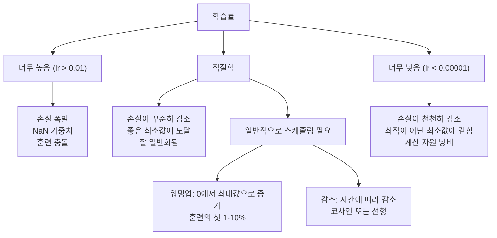
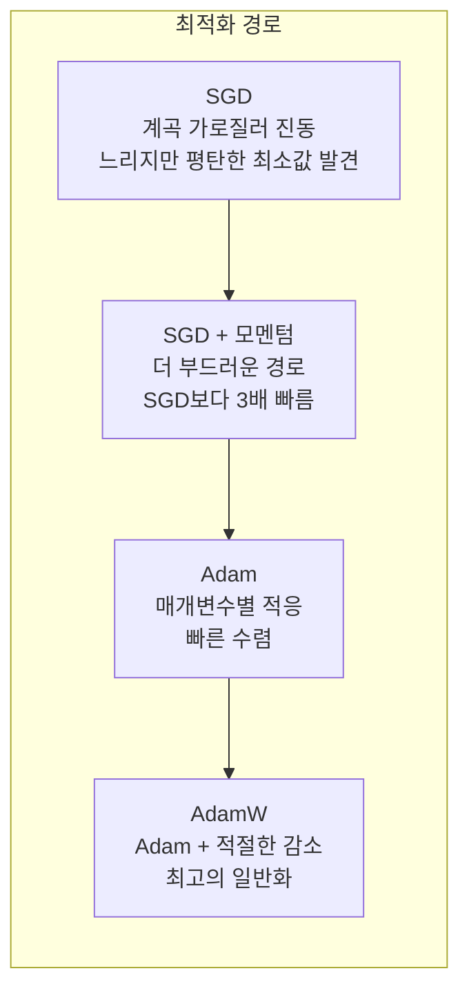
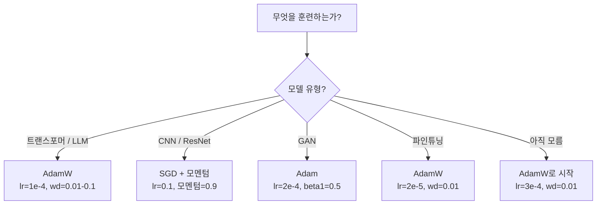

# 옵티마이저(Optimizers)

> 경사 하강법(gradient descent)은 어떤 방향으로 이동해야 할지 알려줍니다. 하지만 얼마나 멀리 또는 빠르게 이동해야 할지는 말해주지 않습니다. SGD는 나침반입니다. Adam은 교통 데이터가 있는 GPS입니다.

**유형:** Build  
**언어:** Python  
**사전 요구 사항:** Lesson 03.05 (손실 함수)  
**소요 시간:** ~75분

## 학습 목표

- Python에서 SGD, 모멘텀이 적용된 SGD, Adam, AdamW 옵티마이저를 직접 구현
- Adam의 편향 보정(bias correction)이 초기 훈련 단계에서 0으로 초기화된 모멘트 추정치를 어떻게 보완하는지 설명
- 동일한 작업에서 L2 정규화를 적용한 Adam보다 AdamW가 더 나은 일반화 성능을 보이는 이유 증명
- 트랜스포머(transformers), CNN, GAN, 파인튜닝(fine-tuning)에 적합한 옵티마이저와 기본 하이퍼파라미터 선택

## 문제 정의

기울기를 계산했습니다. 손실 함수(loss function)를 줄이기 위해 가중치 #4,721을 0.003만큼 감소시켜야 한다는 것을 알고 있습니다. 하지만 0.003은 어떤 단위인가요? 어떤 스케일로 조정되어야 하나요? 그리고 1번째 스텝과 1,000번째 스텝에서 동일한 양을 이동해야 할까요?

기본 경사 하강법(Vanilla Gradient Descent)은 모든 스텝에서 모든 파라미터에 동일한 학습률(learning rate)을 적용합니다: `w = w - lr * gradient`. 이는 실제로 신경망 학습을 어렵게 만드는 세 가지 문제를 발생시킵니다.

첫 번째, 진동(oscillation)입니다. 손실 곡면은 거의 매끄러운 그릇 모양처럼 형성되지 않습니다. 길고 좁은 계곡과 비슷합니다. 기울기(gradient)는 계곡을 가로지르는 방향(가파른 방향)을 가리키며, 계곡을 따라(완만한 방향)가 아닙니다. 경사 하강법은 좁은 차원에서 앞뒤로 진동하면서 유용한 차원에서는 아주 작은 진전을 이룹니다. 이런 현상을 본 적이 있을 것입니다: 손실이 빠르게 감소하다가 정체되는데, 이는 모델이 수렴했기 때문이 아니라 진동하고 있기 때문입니다.

두 번째, 모든 파라미터에 동일한 학습률을 적용하는 것은 잘못되었습니다. 일부 가중치는 큰 업데이트가 필요합니다(초기 과적합(underfitting) 단계에 있음). 다른 가중치는 아주 작은 업데이트가 필요합니다(최적값 근처에 있음). 전자에 적합한 학습률은 후자를 파괴하고, 그 반대도 마찬가지입니다.

세 번째, 안장점(saddle point)입니다. 고차원에서는 기울기가 거의 0에 가까운 광활한 평탄한 영역이 손실 곡면에 존재합니다. 기본 SGD(Stochastic Gradient Descent)는 이러한 영역을 기울기 속도로 통과하는데, 이는 사실상 0입니다. 모델이 멈춘 것처럼 보입니다. 실제로 멈춘 것은 아니며, 평탄한 영역 너머에 유용한 하강 경로가 있습니다. 하지만 SGD에는 이를 돌파할 메커니즘이 없습니다.

Adam은 이 세 가지 문제를 모두 해결합니다. 파라미터마다 두 가지 지수 이동 평균(exponential moving average)을 유지합니다 — 평균 기울기(모멘텀, momentum, 진동 처리)와 평균 제곱 기울기(적응형 학습률, adaptive rate, 서로 다른 스케일 처리). 처음 몇 스텝에 대한 편향 보정(bias correction)과 결합되면, 기본 하이퍼파라미터로 80%의 문제에 작동하는 단일 옵티마이저를 제공합니다. 이 강의에서는 나머지 20%의 문제에서 Adam이 언제, 왜 실패하는지 정확히 이해할 수 있도록 처음부터 구축합니다.

## 개념

### 확률적 경사 하강법(SGD, Stochastic Gradient Descent)

가장 간단한 옵티마이저입니다. 미니 배치에서 기울기를 계산하고 반대 방향으로 이동합니다.

```
w = w - lr * gradient
```

"확률적"은 전체 데이터셋 대신 무작위 부분 집합(미니 배치)을 사용해 기울기를 추정한다는 의미입니다. 이 노이즈는 실제로 유용합니다 — 날카로운 지역 최소값에서 탈출하는 데 도움이 됩니다. 하지만 노이즈는 진동도 유발합니다.

학습률(learning rate)이 유일한 조절 매개변수입니다. 너무 높으면: 손실이 발산합니다. 너무 낮으면: 훈련이 영원히 걸립니다. 최적값은 아키텍처, 데이터, 배치 크기, 훈련 단계에 따라 달라집니다. 현대 네트워크에서 기본 SGD의 일반적인 값은 0.01에서 0.1 사이입니다. 하지만 단일 훈련 실행 내에서도 이상적인 학습률은 변합니다.

### 모멘텀(Momentum)

"언덕을 굴러 내려가는 공" 비유는 진부하지만 정확합니다. 기울기만으로 이동하는 대신, 과거 기울기를 누적하는 속도를 유지합니다.

```
m_t = beta * m_{t-1} + gradient
w = w - lr * m_t
```

베타(일반적으로 0.9)는 얼마나 많은 역사를 유지할지 제어합니다. 베타 = 0.9일 때, 모멘텀은 대략 최근 10개 기울기의 평균입니다(1 / (1 - 0.9) = 10).

이것이 진동을 해결하는 방법: 같은 방향을 가리키는 기울기는 누적됩니다. 방향이 바뀌는 기울기는 상쇄됩니다. 좁은 계곡에서 "가로" 성분은 매 단계마다 부호가 바뀌며 감쇠됩니다. "세로" 성분은 일관되게 유지되며 증폭됩니다. 결과적으로 유용한 방향으로 부드럽게 가속됩니다.

실제 수치: 조건이 나쁜 손실 함수에서 SGD만 사용하면 10,000단계가 걸릴 수 있습니다. 모멘텀(베타=0.9)을 적용한 SGD는 일반적으로 같은 문제에서 3,000-5,000단계가 소요됩니다. 속도 향상은 미미하지 않습니다.

### RMSProp

실제로 작동하는 최초의 매개변수별 적응형 학습률 방법입니다. 힌튼이 Coursera 강의에서 제안했으며(공식적으로 출판되지 않음).

```
s_t = beta * s_{t-1} + (1 - beta) * gradient^2
w = w - lr * gradient / (sqrt(s_t) + epsilon)
```

s_t는 제곱 기울기의 이동 평균을 추적합니다. 지속적으로 큰 기울기를 가진 매개변수는 큰 수로 나누어집니다(효과적인 학습률이 작아짐). 작은 기울기를 가진 매개변수는 작은 수로 나누어집니다(효과적인 학습률이 커짐).

이것은 "모든 매개변수에 대한 단일 학습률" 문제를 해결합니다. 이미 큰 업데이트를 받고 있는 가중치는 목표에 가까울 가능성이 높습니다 — 속도를 줄입니다. 작은 업데이트를 받고 있는 가중치는 훈련이 부족할 수 있습니다 — 속도를 높입니다.

엡실론(일반적으로 1e-8)은 매개변수가 업데이트되지 않았을 때 0으로 나누는 것을 방지합니다.

### Adam: 모멘텀 + RMSProp

Adam은 두 아이디어를 결합합니다. 매개변수당 두 개의 지수 이동 평균을 유지합니다:

```
m_t = beta1 * m_{t-1} + (1 - beta1) * gradient        (첫 번째 모멘트: 평균)
v_t = beta2 * v_{t-1} + (1 - beta2) * gradient^2       (두 번째 모멘트: 분산)
```

**편향 보정**은 대부분의 설명에서 생략되는 핵심 세부사항입니다. 1단계에서 m_1 = (1 - beta1) * gradient입니다. beta1 = 0.9일 때, 이는 0.1 * gradient로 — 10배 너무 작습니다. 이동 평균이 아직 준비되지 않았습니다. 편향 보정은 이를 보상합니다:

```
m_hat = m_t / (1 - beta1^t)
v_hat = v_t / (1 - beta2^t)
```

beta1 = 0.9인 1단계에서: m_hat = m_1 / (1 - 0.9) = m_1 / 0.1 = 실제 기울기입니다. 100단계에서: (1 - 0.9^100)은 약 1.0이므로 보정이 사라집니다. 편향 보정은 처음 ~10단계에서 중요하며 ~50단계 이후에는 무관합니다.

업데이트:

```
w = w - lr * m_hat / (sqrt(v_hat) + epsilon)
```

Adam 기본값: lr = 0.001, beta1 = 0.9, beta2 = 0.999, epsilon = 1e-8. 이 기본값은 80%의 문제에 작동합니다. 작동하지 않을 때는 먼저 lr을 변경합니다. 그 다음 beta2를 변경합니다. 거의 beta1이나 epsilon은 변경하지 않습니다.

### AdamW: 올바른 가중치 감소

L2 정규화는 손실에 lambda * w^2를 추가합니다. 기본 SGD에서는 이것이 가중치 감소(매 단계마다 가중치에서 lambda * w를 빼는 것)와 동일합니다. Adam에서는 이 동일성이 깨집니다.

Loshchilov & Hutter의 통찰: 손실에 L2를 추가한 후 Adam이 기울기를 처리하면, 적응형 학습률이 정규화 항도 스케일링합니다. 큰 기울기 분산을 가진 매개변수는 정규화가 적게 적용됩니다. 작은 분산을 가진 매개변수는 정규화가 많이 적용됩니다. 이것은 원하는 것이 아닙니다 — 기울기 통계와 무관하게 균일한 정규화를 원합니다.

AdamW는 Adam 업데이트 후 가중치에 직접 가중치 감소를 적용하여 이를 수정합니다:

```
w = w - lr * m_hat / (sqrt(v_hat) + epsilon) - lr * lambda * w
```

가중치 감소 항(lr * lambda * w)은 Adam의 적응형 인자로 스케일링되지 않습니다. 모든 매개변수는 동일한 비율의 축소를 받습니다.

이것은 사소한 세부사항처럼 보입니다. 그렇지 않습니다. AdamW는 거의 모든 작업에서 Adam + L2 정규화보다 더 나은 해에 수렴합니다. PyTorch에서 트랜스포머, 확산 모델 및 대부분의 현대 아키텍처 훈련의 기본 옵티마이저입니다. BERT, GPT, LLaMA, Stable Diffusion — 모두 AdamW로 훈련됩니다.

### 학습률: 가장 중요한 하이퍼파라미터



하나의 하이퍼파라미터를 튜닝한다면 학습률을 튜닝하세요. 학습률의 10배 변화는 어떤 아키텍처 결정보다 더 중요합니다. 일반적인 기본값:

- SGD: lr = 0.01 ~ 0.1
- Adam/AdamW: lr = 1e-4 ~ 3e-4
- 사전 훈련 모델 파인튜닝: lr = 1e-5 ~ 5e-5
- 학습률 워밍업: 첫 1-10% 단계에서 선형 증가

### 옵티마이저 비교



### 각 옵티마이저가 우수한 경우



## 구축

### 단계 1: Vanilla SGD

```python
class SGD:
    def __init__(self, lr=0.01):
        self.lr = lr

    def step(self, params, grads):
        for i in range(len(params)):
            params[i] -= self.lr * grads[i]
```

### 단계 2: 모멘텀(Momentum)이 적용된 SGD

```python
class SGDMomentum:
    def __init__(self, lr=0.01, beta=0.9):
        self.lr = lr
        self.beta = beta
        self.velocities = None

    def step(self, params, grads):
        if self.velocities is None:
            self.velocities = [0.0] * len(params)
        for i in range(len(params)):
            self.velocities[i] = self.beta * self.velocities[i] + grads[i]
            params[i] -= self.lr * self.velocities[i]
```

### 단계 3: Adam

```python
import math

class Adam:
    def __init__(self, lr=0.001, beta1=0.9, beta2=0.999, epsilon=1e-8):
        self.lr = lr
        self.beta1 = beta1
        self.beta2 = beta2
        self.epsilon = epsilon
        self.m = None
        self.v = None
        self.t = 0

    def step(self, params, grads):
        if self.m is None:
            self.m = [0.0] * len(params)
            self.v = [0.0] * len(params)

        self.t += 1

        for i in range(len(params)):
            self.m[i] = self.beta1 * self.m[i] + (1 - self.beta1) * grads[i]
            self.v[i] = self.beta2 * self.v[i] + (1 - self.beta2) * grads[i] ** 2

            m_hat = self.m[i] / (1 - self.beta1 ** self.t)
            v_hat = self.v[i] / (1 - self.beta2 ** self.t)

            params[i] -= self.lr * m_hat / (math.sqrt(v_hat) + self.epsilon)
```

### 단계 4: AdamW

```python
class AdamW:
    def __init__(self, lr=0.001, beta1=0.9, beta2=0.999, epsilon=1e-8, weight_decay=0.01):
        self.lr = lr
        self.beta1 = beta1
        self.beta2 = beta2
        self.epsilon = epsilon
        self.weight_decay = weight_decay
        self.m = None
        self.v = None
        self.t = 0

    def step(self, params, grads):
        if self.m is None:
            self.m = [0.0] * len(params)
            self.v = [0.0] * len(params)

        self.t += 1

        for i in range(len(params)):
            self.m[i] = self.beta1 * self.m[i] + (1 - self.beta1) * grads[i]
            self.v[i] = self.beta2 * self.v[i] + (1 - self.beta2) * grads[i] ** 2

            m_hat = self.m[i] / (1 - self.beta1 ** self.t)
            v_hat = self.v[i] / (1 - self.beta2 ** self.t)

            params[i] -= self.lr * m_hat / (math.sqrt(v_hat) + self.epsilon)
            params[i] -= self.lr * self.weight_decay * params[i]
```

### 단계 5: 훈련 비교

레슨 05의 원형 데이터셋에서 동일한 2계층 네트워크를 네 가지 옵티마이저로 훈련하고 수렴 속도를 비교합니다.

```python
import random

def sigmoid(x):
    x = max(-500, min(500, x))
    return 1.0 / (1.0 + math.exp(-x))

def make_circle_data(n=200, seed=42):
    random.seed(seed)
    data = []
    for _ in range(n):
        x = random.uniform(-2, 2)
        y = random.uniform(-2, 2)
        label = 1.0 if x * x + y * y < 1.5 else 0.0
        data.append(([x, y], label))
    return data


class OptimizerTestNetwork:
    def __init__(self, optimizer, hidden_size=8):
        random.seed(0)
        self.hidden_size = hidden_size
        self.optimizer = optimizer

        self.w1 = [[random.gauss(0, 0.5) for _ in range(2)] for _ in range(hidden_size)]
        self.b1 = [0.0] * hidden_size
        self.w2 = [random.gauss(0, 0.5) for _ in range(hidden_size)]
        self.b2 = 0.0

    def get_params(self):
        params = []
        for row in self.w1:
            params.extend(row)
        params.extend(self.b1)
        params.extend(self.w2)
        params.append(self.b2)
        return params

    def set_params(self, params):
        idx = 0
        for i in range(self.hidden_size):
            for j in range(2):
                self.w1[i][j] = params[idx]
                idx += 1
        for i in range(self.hidden_size):
            self.b1[i] = params[idx]
            idx += 1
        for i in range(self.hidden_size):
            self.w2[i] = params[idx]
            idx += 1
        self.b2 = params[idx]

    def forward(self, x):
        self.x = x
        self.z1 = []
        self.h = []
        for i in range(self.hidden_size):
            z = self.w1[i][0] * x[0] + self.w1[i][1] * x[1] + self.b1[i]
            self.z1.append(z)
            self.h.append(max(0.0, z))

        self.z2 = sum(self.w2[i] * self.h[i] for i in range(self.hidden_size)) + self.b2
        self.out = sigmoid(self.z2)
        return self.out

    def compute_grads(self, target):
        eps = 1e-15
        p = max(eps, min(1 - eps, self.out))
        d_loss = -(target / p) + (1 - target) / (1 - p)
        d_sigmoid = self.out * (1 - self.out)
        d_out = d_loss * d_sigmoid

        grads = [0.0] * (self.hidden_size * 2 + self.hidden_size + self.hidden_size + 1)
        idx = 0
        for i in range(self.hidden_size):
            d_relu = 1.0 if self.z1[i] > 0 else 0.0
            d_h = d_out * self.w2[i] * d_relu
            grads[idx] = d_h * self.x[0]
            grads[idx + 1] = d_h * self.x[1]
            idx += 2

        for i in range(self.hidden_size):
            d_relu = 1.0 if self.z1[i] > 0 else 0.0
            grads[idx] = d_out * self.w2[i] * d_relu
            idx += 1

        for i in range(self.hidden_size):
            grads[idx] = d_out * self.h[i]
            idx += 1

        grads[idx] = d_out
        return grads

    def train(self, data, epochs=300):
        losses = []
        for epoch in range(epochs):
            total_loss = 0.0
            correct = 0
            for x, y in data:
                pred = self.forward(x)
                grads = self.compute_grads(y)
                params = self.get_params()
                self.optimizer.step(params, grads)
                self.set_params(params)

                eps = 1e-15
                p = max(eps, min(1 - eps, pred))
                total_loss += -(y * math.log(p) + (1 - y) * math.log(1 - p))
                if (pred >= 0.5) == (y >= 0.5):
                    correct += 1
            avg_loss = total_loss / len(data)
            accuracy = correct / len(data) * 100
            losses.append((avg_loss, accuracy))
            if epoch % 75 == 0 or epoch == epochs - 1:
                print(f"    Epoch {epoch:3d}: loss={avg_loss:.4f}, accuracy={accuracy:.1f}%")
        return losses
```

## 사용 방법

PyTorch 옵티마이저(optimizer)는 파라미터 그룹, 그래디언트 클리핑(gradient clipping), 학습률 스케줄링(learning rate scheduling)을 처리합니다:

```python
import torch
import torch.optim as optim

model = torch.nn.Sequential(
    torch.nn.Linear(784, 256),
    torch.nn.ReLU(),
    torch.nn.Linear(256, 10),
)

optimizer = optim.AdamW(model.parameters(), lr=3e-4, weight_decay=0.01)

scheduler = optim.lr_scheduler.CosineAnnealingLR(optimizer, T_max=100)

for epoch in range(100):
    optimizer.zero_grad()
    output = model(torch.randn(32, 784))
    loss = torch.nn.functional.cross_entropy(output, torch.randint(0, 10, (32,)))
    loss.backward()
    torch.nn.utils.clip_grad_norm_(model.parameters(), max_norm=1.0)
    optimizer.step()
    scheduler.step()
```

항상 따라야 할 패턴은 다음과 같습니다: `zero_grad`, `forward`, `loss`, `backward`, (클리핑), `step`, (스케줄링). 이 순서를 반드시 외우세요. 순서를 잘못 지키는 것(예: `optimizer.step()` 전에 `scheduler.step()` 호출)은 미묘한 버그의 흔한 원인입니다.

CNN의 경우, 많은 실무자들은 여전히 SGD + 모멘텀(lr=0.1, momentum=0.9, weight_decay=1e-4)과 스텝(step) 또는 코사인(cosine) 스케줄링을 선호합니다. SGD는 더 평탄한 최소값(flatter minima)을 찾아내며, 이는 종종 더 나은 일반화 성능을 보입니다. 트랜스포머(transformer)와 LLM(Large Language Model)의 경우, 워밍업(warmup) + 코사인 디케이(cosine decay)가 적용된 AdamW가 보편적인 기본 설정입니다. 측정 가능한 이유 없이 이 합의에 맞서지 마세요.

## Ship It

이 레슨은 다음을 생성합니다:
- `outputs/prompt-optimizer-selector.md` -- 어떤 아키텍처에 적합한 옵티마이저(optimizer)와 학습률(learning rate)을 선택하기 위한 결정 프롬프트(prompt)

## 연습 문제

1. 네스테로프 모멘텀(Nesterov momentum)을 구현하세요. 현재 위치가 아닌 "룩어헤드(lookahead)" 위치(w - lr * beta * v)에서 기울기를 계산합니다. 표준 모멘텀과 원 데이터셋에서의 수렴 속도를 비교하세요.

2. 학습률 워밍업(warmup) 스케줄을 구현하세요: 훈련 단계의 처음 10% 동안 0에서 max_lr까지 선형 증가 후 코사인 감쇠(cosine decay)로 0까지 감소시킵니다. Adam + 워밍업 대 워밍업 없는 Adam으로 훈련합니다. 원 데이터셋에서 90% 정확도에 도달하는 데 필요한 에포크 수를 측정하세요.

3. Adam 훈련 중 각 파라미터의 유효 학습률(effective learning rate)을 추적하세요. 유효 학습률은 lr * m_hat / (sqrt(v_hat) + eps)입니다. 10, 50, 200단계 후 유효 학습률 분포를 플롯하세요. 모든 파라미터가 동일한 속도로 업데이트되고 있나요?

4. 그래디언트 클리핑(gradient clipping, 전역 노름 기준)을 구현하세요. 최대 그래디언트 노름을 1.0으로 설정합니다. 높은 학습률(Adam의 경우 lr=0.01)로 클리핑 적용 및 미적용 상태에서 훈련합니다. 10개의 무작위 시드에 대해 클리핑 유무에 따른 발산(손실이 NaN으로 전환) 횟수를 카운트하세요.

5. 큰 가중치를 가진 네트워크에서 Adam과 AdamW를 비교하세요. 모든 가중치를 [-5, 5] 범위의 무작위 값으로 초기화합니다(일반적인 초기화보다 훨씬 큼). weight_decay=0.1로 200 에포크 동안 훈련합니다. 훈련 중 두 옵티마이저의 가중치 L2 노름을 플롯하세요. AdamW는 더 빠른 가중치 감소(shrinkage)를 보여야 합니다.

## 주요 용어

| 용어 | 사람들이 말하는 것 | 실제 의미 |
|------|----------------|----------------------|
| 학습률(learning rate) | "스텝 크기(step size)" | 기울기 업데이트에 대한 스칼라 승수; 훈련에서 가장 영향력 있는 하이퍼파라미터 |
| SGD | "기본 경사 하강법(basic gradient descent)" | 확률적 경사 하강법(stochastic gradient descent): 미니 배치에서 계산된 `lr * 기울기`를 빼서 가중치 업데이트 |
| 모멘텀(momentum) | "구르는 공 비유(rolling ball analogy)" | 과거 기울기의 지수 이동 평균; 진동을 감쇠시키고 일관된 방향을 가속 |
| RMSProp | "적응형 학습률(adaptive learning rate)" | 각 파라미터의 기울기를 최근 기울기의 실행 RMS로 나눔; 학습률 균등화 |
| Adam | "기본 옵티마이저(default optimizer)" | 모멘텀(1차 모멘트)과 RMSProp(2차 모멘트) 결합 + 초기 단계에 대한 편향 보정(bias correction) |
| AdamW | "올바른 Adam" | 분리된 가중치 감쇠(decoupled weight decay)를 적용한 Adam; 기울기를 통한 것이 아닌 가중치에 직접 정규화 적용 |
| 편향 보정(bias correction) | "실행 평균을 위한 워밍업(warmup for running averages)" | Adam의 모멘트 추정치 초기화를 보상하기 위해 `(1 - beta^t)`로 나눔 |
| 가중치 감쇠(weight decay) | "가중치 축소(shrink the weights)" | 매 단계마다 가중치 값의 일부를 뺌; 큰 가중치에 페널티를 주는 정규화기 |
| 학습률 스케줄(learning rate schedule) | "시간에 따른 lr 변경(changing lr over time)" | 훈련 중 학습률을 조정하는 함수; 워밍업(warmup) + 코사인 감쇠(cosine decay)가 현대적 기본값 |
| 기울기 클리핑(gradient clipping) | "기울기 노름 제한(capping the gradient norm)" | 기울기 벡터의 노름이 임계값을 초과할 때 스케일링; 폭주하는 기울기 업데이트 방지 |

## 추가 자료

- Kingma & Ba, "Adam: A Method for Stochastic Optimization" (2014) -- 수렴 분석과 편향 보정 유도가 포함된 원본 Adam 논문
- Loshchilov & Hutter, "Decoupled Weight Decay Regularization" (2017) -- Adam에서 L2 정규화와 가중치 감쇠가 동등하지 않음을 증명하고 AdamW를 제안한 논문
- Smith, "Cyclical Learning Rates for Training Neural Networks" (2017) -- 고정된 학습률(learning rate) 튜닝 필요성을 제거하는 LR 범위 테스트와 순환 스케줄 소개
- Ruder, "An Overview of Gradient Descent Optimization Algorithms" (2016) -- 모든 옵티마이저 변형에 대한 최고의 단일 조사 논문, 명확한 비교와 직관적 설명 포함